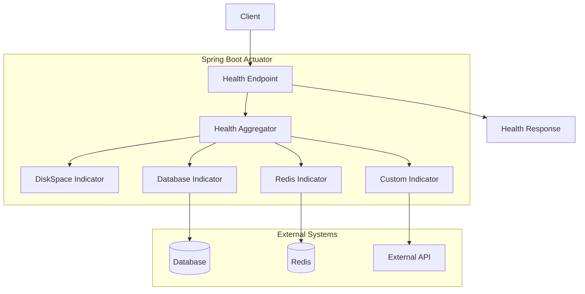
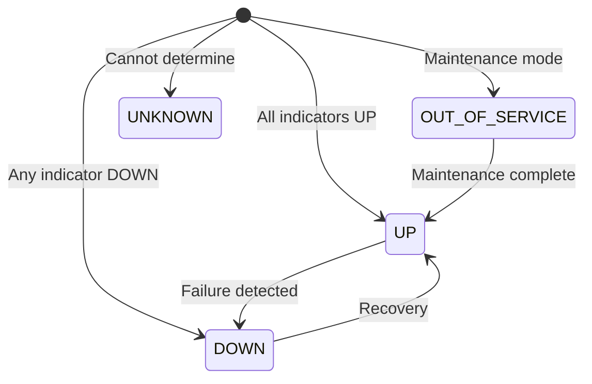
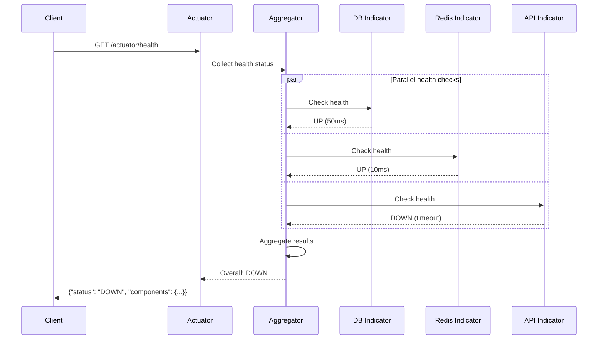

# How to Configure Spring Boot Actuator Custom Health Indicators

Author: [nawazdhandala](https://www.github.com/nawazdhandala)

Tags: Java, Spring Boot, Actuator, Health Check, Monitoring, Kubernetes

Description: Learn how to create custom health indicators in Spring Boot Actuator for monitoring external dependencies. This guide covers health aggregation, reactive indicators, and Kubernetes integration.

---

> Health checks are the heartbeat of modern applications. They tell orchestrators like Kubernetes when your application is ready to serve traffic and when it needs to be restarted. Spring Boot Actuator provides a powerful health check system that you can extend with custom indicators for your specific dependencies.

Spring Boot Actuator's health system goes beyond simple "up or down" status. It provides detailed health information about your application and its dependencies, enabling sophisticated orchestration decisions and operational visibility.

---

## Understanding Health Checks

Before implementing custom health indicators, let's understand how Spring Boot Actuator's health system works:



The health endpoint aggregates results from multiple health indicators. Each indicator checks a specific component and reports its status. The aggregator combines these into an overall health status.

### Health Status Hierarchy

Spring Boot defines a hierarchy of health statuses:



Status priority (highest to lowest):
- **DOWN**: Component is not functioning
- **OUT_OF_SERVICE**: Component is intentionally offline
- **UP**: Component is healthy
- **UNKNOWN**: Health cannot be determined

---

## Getting Started

### Dependencies

Add the required dependencies to your project:

```xml
<!-- pom.xml -->
<dependencies>
    <!-- Spring Boot Web -->
    <dependency>
        <groupId>org.springframework.boot</groupId>
        <artifactId>spring-boot-starter-web</artifactId>
    </dependency>
    
    <!-- Spring Boot Actuator - includes health endpoints -->
    <dependency>
        <groupId>org.springframework.boot</groupId>
        <artifactId>spring-boot-starter-actuator</artifactId>
    </dependency>
    
    <!-- For database health indicators -->
    <dependency>
        <groupId>org.springframework.boot</groupId>
        <artifactId>spring-boot-starter-data-jpa</artifactId>
    </dependency>
    
    <!-- For Redis health indicators -->
    <dependency>
        <groupId>org.springframework.boot</groupId>
        <artifactId>spring-boot-starter-data-redis</artifactId>
    </dependency>
    
    <!-- For HTTP client health checks -->
    <dependency>
        <groupId>org.springframework.boot</groupId>
        <artifactId>spring-boot-starter-webflux</artifactId>
    </dependency>
    
    <!-- Lombok for cleaner code -->
    <dependency>
        <groupId>org.projectlombok</groupId>
        <artifactId>lombok</artifactId>
        <scope>provided</scope>
    </dependency>
</dependencies>
```

For Gradle:

```groovy
// build.gradle
dependencies {
    implementation 'org.springframework.boot:spring-boot-starter-web'
    implementation 'org.springframework.boot:spring-boot-starter-actuator'
    implementation 'org.springframework.boot:spring-boot-starter-data-jpa'
    implementation 'org.springframework.boot:spring-boot-starter-data-redis'
    implementation 'org.springframework.boot:spring-boot-starter-webflux'
    compileOnly 'org.projectlombok:lombok'
    annotationProcessor 'org.projectlombok:lombok'
}
```

### Basic Configuration

Configure Actuator to expose health endpoints:

```yaml
# application.yml
management:
  endpoints:
    web:
      exposure:
        # Expose health, info, and metrics endpoints
        include: health, info, metrics, prometheus
      base-path: /actuator
  
  endpoint:
    health:
      # Show full health details
      show-details: always
      # Show all health components
      show-components: always
      # Enable health groups
      group:
        liveness:
          include: livenessState
        readiness:
          include: readinessState, db, redis, customService
  
  health:
    # Enable default health indicators
    defaults:
      enabled: true
    # Configure specific indicators
    db:
      enabled: true
    redis:
      enabled: true
    diskspace:
      enabled: true
      threshold: 10MB

# Server configuration
server:
  port: 8080
```

---

## Creating Basic Health Indicators

### Simple Health Indicator

The simplest way to create a custom health indicator is to implement the `HealthIndicator` interface:

```java
// health/ExternalServiceHealthIndicator.java
package com.example.health;

import lombok.RequiredArgsConstructor;
import lombok.extern.slf4j.Slf4j;
import org.springframework.boot.actuate.health.Health;
import org.springframework.boot.actuate.health.HealthIndicator;
import org.springframework.stereotype.Component;
import org.springframework.web.client.RestTemplate;

/**
 * Health indicator for external API service.
 * Checks if the external service is reachable and responding.
 */
@Slf4j
@Component("externalService")  // Name appears in health response
@RequiredArgsConstructor
public class ExternalServiceHealthIndicator implements HealthIndicator {

    private final RestTemplate restTemplate;
    private static final String HEALTH_URL = "https://api.example.com/health";

    @Override
    public Health health() {
        try {
            // Attempt to reach the external service
            long startTime = System.currentTimeMillis();
            String response = restTemplate.getForObject(HEALTH_URL, String.class);
            long responseTime = System.currentTimeMillis() - startTime;
            
            // Service is healthy
            return Health.up()
                .withDetail("service", "External API")
                .withDetail("url", HEALTH_URL)
                .withDetail("responseTime", responseTime + "ms")
                .withDetail("status", "reachable")
                .build();
                
        } catch (Exception e) {
            log.error("External service health check failed", e);
            
            // Service is unhealthy
            return Health.down()
                .withDetail("service", "External API")
                .withDetail("url", HEALTH_URL)
                .withDetail("error", e.getMessage())
                .build();
        }
    }
}
```

### Health Indicator with Timeout

Add timeout handling to prevent health checks from hanging:

```java
// health/TimeoutAwareHealthIndicator.java
package com.example.health;

import lombok.extern.slf4j.Slf4j;
import org.springframework.boot.actuate.health.Health;
import org.springframework.boot.actuate.health.HealthIndicator;
import org.springframework.stereotype.Component;

import java.net.HttpURLConnection;
import java.net.URL;
import java.time.Duration;
import java.util.concurrent.*;

/**
 * Health indicator with configurable timeout.
 * Prevents slow dependencies from blocking the health endpoint.
 */
@Slf4j
@Component("paymentGateway")
public class TimeoutAwareHealthIndicator implements HealthIndicator {

    private static final String HEALTH_URL = "https://payments.example.com/health";
    private static final Duration TIMEOUT = Duration.ofSeconds(5);
    
    private final ExecutorService executor = Executors.newSingleThreadExecutor();

    @Override
    public Health health() {
        // Create a callable for the health check
        Callable<Health> healthCheck = this::performHealthCheck;
        
        // Submit with timeout
        Future<Health> future = executor.submit(healthCheck);
        
        try {
            // Wait for result with timeout
            return future.get(TIMEOUT.toMillis(), TimeUnit.MILLISECONDS);
            
        } catch (TimeoutException e) {
            future.cancel(true);
            log.warn("Payment gateway health check timed out after {}ms", 
                TIMEOUT.toMillis());
            
            return Health.down()
                .withDetail("service", "Payment Gateway")
                .withDetail("error", "Health check timed out")
                .withDetail("timeout", TIMEOUT.toMillis() + "ms")
                .build();
                
        } catch (Exception e) {
            log.error("Payment gateway health check failed", e);
            
            return Health.down()
                .withDetail("service", "Payment Gateway")
                .withDetail("error", e.getMessage())
                .build();
        }
    }

    // Perform the actual health check
    private Health performHealthCheck() {
        try {
            long startTime = System.currentTimeMillis();
            
            URL url = new URL(HEALTH_URL);
            HttpURLConnection connection = (HttpURLConnection) url.openConnection();
            connection.setRequestMethod("GET");
            connection.setConnectTimeout((int) TIMEOUT.toMillis());
            connection.setReadTimeout((int) TIMEOUT.toMillis());
            
            int responseCode = connection.getResponseCode();
            long responseTime = System.currentTimeMillis() - startTime;
            
            if (responseCode == 200) {
                return Health.up()
                    .withDetail("service", "Payment Gateway")
                    .withDetail("url", HEALTH_URL)
                    .withDetail("responseCode", responseCode)
                    .withDetail("responseTime", responseTime + "ms")
                    .build();
            } else {
                return Health.down()
                    .withDetail("service", "Payment Gateway")
                    .withDetail("url", HEALTH_URL)
                    .withDetail("responseCode", responseCode)
                    .withDetail("responseTime", responseTime + "ms")
                    .build();
            }
            
        } catch (Exception e) {
            return Health.down()
                .withDetail("service", "Payment Gateway")
                .withDetail("error", e.getMessage())
                .build();
        }
    }
}
```

---

## Health Indicator Patterns

### Database Connection Health

Check database connectivity beyond the default indicator:

```java
// health/DatabaseQueryHealthIndicator.java
package com.example.health;

import lombok.RequiredArgsConstructor;
import lombok.extern.slf4j.Slf4j;
import org.springframework.boot.actuate.health.Health;
import org.springframework.boot.actuate.health.HealthIndicator;
import org.springframework.jdbc.core.JdbcTemplate;
import org.springframework.stereotype.Component;

/**
 * Extended database health indicator.
 * Performs actual query to verify database is responding.
 */
@Slf4j
@Component("databaseQuery")
@RequiredArgsConstructor
public class DatabaseQueryHealthIndicator implements HealthIndicator {

    private final JdbcTemplate jdbcTemplate;

    @Override
    public Health health() {
        try {
            long startTime = System.currentTimeMillis();
            
            // Execute test query
            Integer result = jdbcTemplate.queryForObject(
                "SELECT 1", 
                Integer.class
            );
            
            long queryTime = System.currentTimeMillis() - startTime;
            
            // Check query result
            if (result != null && result == 1) {
                // Get additional database info
                String databaseVersion = getDatabaseVersion();
                int activeConnections = getActiveConnections();
                
                return Health.up()
                    .withDetail("database", "PostgreSQL")
                    .withDetail("queryTime", queryTime + "ms")
                    .withDetail("version", databaseVersion)
                    .withDetail("activeConnections", activeConnections)
                    .build();
            }
            
            return Health.unknown()
                .withDetail("reason", "Unexpected query result")
                .build();
                
        } catch (Exception e) {
            log.error("Database query health check failed", e);
            
            return Health.down()
                .withDetail("database", "PostgreSQL")
                .withDetail("error", e.getMessage())
                .withException(e)
                .build();
        }
    }

    // Get database version
    private String getDatabaseVersion() {
        try {
            return jdbcTemplate.queryForObject("SELECT version()", String.class);
        } catch (Exception e) {
            return "unknown";
        }
    }

    // Get active connection count
    private int getActiveConnections() {
        try {
            Integer count = jdbcTemplate.queryForObject(
                "SELECT count(*) FROM pg_stat_activity WHERE state = 'active'",
                Integer.class
            );
            return count != null ? count : 0;
        } catch (Exception e) {
            return -1;
        }
    }
}
```

### Cache Health Indicator

Check Redis or other cache systems:

```java
// health/RedisCacheHealthIndicator.java
package com.example.health;

import lombok.RequiredArgsConstructor;
import lombok.extern.slf4j.Slf4j;
import org.springframework.boot.actuate.health.Health;
import org.springframework.boot.actuate.health.HealthIndicator;
import org.springframework.data.redis.connection.RedisConnection;
import org.springframework.data.redis.connection.RedisConnectionFactory;
import org.springframework.data.redis.core.RedisTemplate;
import org.springframework.stereotype.Component;

import java.util.Properties;
import java.util.concurrent.TimeUnit;

/**
 * Redis cache health indicator.
 * Checks connectivity and provides cache statistics.
 */
@Slf4j
@Component("redisCache")
@RequiredArgsConstructor
public class RedisCacheHealthIndicator implements HealthIndicator {

    private final RedisTemplate<String, Object> redisTemplate;
    private final RedisConnectionFactory connectionFactory;
    
    private static final String HEALTH_KEY = "health:check";

    @Override
    public Health health() {
        try {
            long startTime = System.currentTimeMillis();
            
            // Test write operation
            redisTemplate.opsForValue().set(HEALTH_KEY, "ok", 10, TimeUnit.SECONDS);
            
            // Test read operation
            Object value = redisTemplate.opsForValue().get(HEALTH_KEY);
            
            long responseTime = System.currentTimeMillis() - startTime;
            
            if ("ok".equals(value)) {
                // Get Redis server info
                Properties info = getRedisInfo();
                
                return Health.up()
                    .withDetail("cache", "Redis")
                    .withDetail("responseTime", responseTime + "ms")
                    .withDetail("version", info.getProperty("redis_version", "unknown"))
                    .withDetail("connectedClients", info.getProperty("connected_clients", "unknown"))
                    .withDetail("usedMemory", info.getProperty("used_memory_human", "unknown"))
                    .withDetail("uptime", info.getProperty("uptime_in_seconds", "unknown") + "s")
                    .build();
            }
            
            return Health.down()
                .withDetail("cache", "Redis")
                .withDetail("error", "Read/write test failed")
                .build();
                
        } catch (Exception e) {
            log.error("Redis health check failed", e);
            
            return Health.down()
                .withDetail("cache", "Redis")
                .withDetail("error", e.getMessage())
                .build();
        }
    }

    // Get Redis server information
    private Properties getRedisInfo() {
        try (RedisConnection connection = connectionFactory.getConnection()) {
            return connection.serverCommands().info();
        } catch (Exception e) {
            log.warn("Could not retrieve Redis info", e);
            return new Properties();
        }
    }
}
```

### Message Queue Health Indicator

Check message broker connectivity:

```java
// health/MessageQueueHealthIndicator.java
package com.example.health;

import lombok.RequiredArgsConstructor;
import lombok.extern.slf4j.Slf4j;
import org.springframework.amqp.rabbit.core.RabbitTemplate;
import org.springframework.boot.actuate.health.Health;
import org.springframework.boot.actuate.health.HealthIndicator;
import org.springframework.stereotype.Component;

/**
 * RabbitMQ message queue health indicator.
 * Verifies broker connectivity and queue status.
 */
@Slf4j
@Component("messageQueue")
@RequiredArgsConstructor
public class MessageQueueHealthIndicator implements HealthIndicator {

    private final RabbitTemplate rabbitTemplate;

    @Override
    public Health health() {
        try {
            // Execute callback to check connection
            Boolean isConnected = rabbitTemplate.execute(channel -> {
                return channel.isOpen();
            });
            
            if (Boolean.TRUE.equals(isConnected)) {
                return Health.up()
                    .withDetail("broker", "RabbitMQ")
                    .withDetail("status", "connected")
                    .withDetail("exchange", rabbitTemplate.getExchange())
                    .build();
            }
            
            return Health.down()
                .withDetail("broker", "RabbitMQ")
                .withDetail("status", "disconnected")
                .build();
                
        } catch (Exception e) {
            log.error("RabbitMQ health check failed", e);
            
            return Health.down()
                .withDetail("broker", "RabbitMQ")
                .withDetail("error", e.getMessage())
                .build();
        }
    }
}
```

---

## Health Check Flow

### Request Processing Flow



---

## Composite Health Indicators

### Grouping Related Indicators

Create composite indicators for related services:

```java
// health/ExternalServicesHealthIndicator.java
package com.example.health;

import lombok.RequiredArgsConstructor;
import lombok.extern.slf4j.Slf4j;
import org.springframework.boot.actuate.health.CompositeHealthContributor;
import org.springframework.boot.actuate.health.HealthContributor;
import org.springframework.boot.actuate.health.NamedContributor;
import org.springframework.stereotype.Component;

import java.util.Iterator;
import java.util.LinkedHashMap;
import java.util.Map;

/**
 * Composite health contributor for external services.
 * Groups multiple external service checks under one component.
 */
@Slf4j
@Component("externalServices")
public class ExternalServicesHealthIndicator implements CompositeHealthContributor {

    private final Map<String, HealthContributor> contributors = new LinkedHashMap<>();

    // Constructor injection of individual indicators
    public ExternalServicesHealthIndicator(
            PaymentGatewayHealthIndicator paymentGateway,
            ShippingServiceHealthIndicator shippingService,
            NotificationServiceHealthIndicator notificationService) {
        
        // Register each contributor with a name
        contributors.put("paymentGateway", paymentGateway);
        contributors.put("shippingService", shippingService);
        contributors.put("notificationService", notificationService);
    }

    @Override
    public HealthContributor getContributor(String name) {
        return contributors.get(name);
    }

    @Override
    public Iterator<NamedContributor<HealthContributor>> iterator() {
        return contributors.entrySet()
            .stream()
            .map(entry -> NamedContributor.of(entry.getKey(), entry.getValue()))
            .iterator();
    }
}

// Individual indicators for the composite
@Slf4j
@Component
@RequiredArgsConstructor
class PaymentGatewayHealthIndicator implements HealthIndicator {
    
    @Override
    public Health health() {
        // Payment gateway health check logic
        return Health.up()
            .withDetail("service", "Payment Gateway")
            .withDetail("provider", "Stripe")
            .build();
    }
}

@Slf4j
@Component
@RequiredArgsConstructor
class ShippingServiceHealthIndicator implements HealthIndicator {
    
    @Override
    public Health health() {
        // Shipping service health check logic
        return Health.up()
            .withDetail("service", "Shipping Service")
            .withDetail("provider", "FedEx")
            .build();
    }
}

@Slf4j
@Component
@RequiredArgsConstructor
class NotificationServiceHealthIndicator implements HealthIndicator {
    
    @Override
    public Health health() {
        // Notification service health check logic
        return Health.up()
            .withDetail("service", "Notification Service")
            .withDetail("channels", "email, sms, push")
            .build();
    }
}
```

### Custom Health Aggregator

Customize how health statuses are aggregated:

```java
// config/CustomHealthAggregator.java
package com.example.config;

import org.springframework.boot.actuate.health.Status;
import org.springframework.boot.actuate.health.StatusAggregator;
import org.springframework.stereotype.Component;

import java.util.Set;

/**
 * Custom health aggregator with business-specific rules.
 * Defines how individual health statuses combine into overall status.
 */
@Component
public class CustomHealthAggregator implements StatusAggregator {

    @Override
    public Status getAggregateStatus(Set<Status> statuses) {
        // Count different status types
        long downCount = statuses.stream()
            .filter(s -> s.equals(Status.DOWN))
            .count();
            
        long outOfServiceCount = statuses.stream()
            .filter(s -> s.equals(Status.OUT_OF_SERVICE))
            .count();
        
        // Custom aggregation logic
        if (downCount > 0) {
            // If any critical service is down
            return Status.DOWN;
        }
        
        if (outOfServiceCount > 0) {
            // Maintenance mode
            return Status.OUT_OF_SERVICE;
        }
        
        // Check for unknown statuses
        boolean hasUnknown = statuses.stream()
            .anyMatch(s -> s.equals(Status.UNKNOWN));
            
        if (hasUnknown) {
            return Status.UNKNOWN;
        }
        
        // All services are healthy
        return Status.UP;
    }
}
```

---

## Reactive Health Indicators

For applications using Spring WebFlux, create reactive health indicators:

```java
// health/ReactiveExternalServiceHealthIndicator.java
package com.example.health;

import lombok.RequiredArgsConstructor;
import lombok.extern.slf4j.Slf4j;
import org.springframework.boot.actuate.health.Health;
import org.springframework.boot.actuate.health.ReactiveHealthIndicator;
import org.springframework.stereotype.Component;
import org.springframework.web.reactive.function.client.WebClient;
import reactor.core.publisher.Mono;

import java.time.Duration;

/**
 * Reactive health indicator for external services.
 * Non-blocking health check using WebClient.
 */
@Slf4j
@Component("reactiveExternalService")
@RequiredArgsConstructor
public class ReactiveExternalServiceHealthIndicator implements ReactiveHealthIndicator {

    private final WebClient webClient;
    
    private static final String HEALTH_URL = "https://api.example.com/health";
    private static final Duration TIMEOUT = Duration.ofSeconds(5);

    @Override
    public Mono<Health> health() {
        long startTime = System.currentTimeMillis();
        
        return webClient.get()
            .uri(HEALTH_URL)
            .retrieve()
            .toBodilessEntity()
            .timeout(TIMEOUT)
            .map(response -> {
                long responseTime = System.currentTimeMillis() - startTime;
                
                if (response.getStatusCode().is2xxSuccessful()) {
                    return Health.up()
                        .withDetail("service", "External API")
                        .withDetail("url", HEALTH_URL)
                        .withDetail("responseTime", responseTime + "ms")
                        .withDetail("statusCode", response.getStatusCode().value())
                        .build();
                }
                
                return Health.down()
                    .withDetail("service", "External API")
                    .withDetail("statusCode", response.getStatusCode().value())
                    .build();
            })
            .onErrorResume(error -> {
                log.error("Reactive health check failed", error);
                
                return Mono.just(Health.down()
                    .withDetail("service", "External API")
                    .withDetail("error", error.getMessage())
                    .build());
            });
    }
}
```

### Reactive Health with Circuit Breaker

```java
// health/CircuitBreakerHealthIndicator.java
package com.example.health;

import io.github.resilience4j.circuitbreaker.CircuitBreaker;
import io.github.resilience4j.circuitbreaker.CircuitBreakerRegistry;
import lombok.RequiredArgsConstructor;
import lombok.extern.slf4j.Slf4j;
import org.springframework.boot.actuate.health.Health;
import org.springframework.boot.actuate.health.ReactiveHealthIndicator;
import org.springframework.stereotype.Component;
import org.springframework.web.reactive.function.client.WebClient;
import reactor.core.publisher.Mono;

import java.time.Duration;

/**
 * Health indicator with circuit breaker pattern.
 * Prevents cascading failures during health checks.
 */
@Slf4j
@Component("circuitBreakerService")
@RequiredArgsConstructor
public class CircuitBreakerHealthIndicator implements ReactiveHealthIndicator {

    private final WebClient webClient;
    private final CircuitBreakerRegistry circuitBreakerRegistry;
    
    private static final String CIRCUIT_BREAKER_NAME = "healthCheck";
    private static final String HEALTH_URL = "https://api.example.com/health";

    @Override
    public Mono<Health> health() {
        CircuitBreaker circuitBreaker = circuitBreakerRegistry
            .circuitBreaker(CIRCUIT_BREAKER_NAME);
        
        // Check circuit breaker state first
        CircuitBreaker.State state = circuitBreaker.getState();
        
        if (state == CircuitBreaker.State.OPEN) {
            // Circuit is open - service is known to be down
            return Mono.just(Health.down()
                .withDetail("service", "External API")
                .withDetail("circuitBreaker", "OPEN")
                .withDetail("reason", "Too many failures")
                .build());
        }
        
        // Perform health check through circuit breaker
        return Mono.fromCallable(() -> performHealthCheck())
            .transform(mono -> circuitBreaker.decorateMono(() -> mono));
    }

    private Health performHealthCheck() {
        try {
            long startTime = System.currentTimeMillis();
            
            Boolean isHealthy = webClient.get()
                .uri(HEALTH_URL)
                .retrieve()
                .toBodilessEntity()
                .map(response -> response.getStatusCode().is2xxSuccessful())
                .block(Duration.ofSeconds(5));
            
            long responseTime = System.currentTimeMillis() - startTime;
            
            if (Boolean.TRUE.equals(isHealthy)) {
                return Health.up()
                    .withDetail("service", "External API")
                    .withDetail("responseTime", responseTime + "ms")
                    .build();
            }
            
            return Health.down()
                .withDetail("service", "External API")
                .withDetail("error", "Unhealthy response")
                .build();
                
        } catch (Exception e) {
            return Health.down()
                .withDetail("service", "External API")
                .withDetail("error", e.getMessage())
                .build();
        }
    }
}
```

---

## Kubernetes Integration

### Liveness and Readiness Probes

Configure health groups for Kubernetes probes:

```yaml
# application.yml
management:
  endpoint:
    health:
      probes:
        enabled: true
      group:
        # Liveness probe - is the application alive?
        liveness:
          include: livenessState
          show-details: always
        
        # Readiness probe - can the application serve traffic?
        readiness:
          include: readinessState, db, redis, customService
          show-details: always
        
        # Startup probe - has the application finished initializing?
        startup:
          include: livenessState
          show-details: always
  
  health:
    livenessState:
      enabled: true
    readinessState:
      enabled: true
```

### Kubernetes Deployment Configuration

```yaml
# kubernetes/deployment.yaml
apiVersion: apps/v1
kind: Deployment
metadata:
  name: my-application
spec:
  replicas: 3
  selector:
    matchLabels:
      app: my-application
  template:
    metadata:
      labels:
        app: my-application
    spec:
      containers:
        - name: app
          image: my-application:latest
          ports:
            - containerPort: 8080
          
          # Startup probe - wait for application to initialize
          startupProbe:
            httpGet:
              path: /actuator/health/liveness
              port: 8080
            initialDelaySeconds: 10
            periodSeconds: 10
            failureThreshold: 30  # Allow up to 5 minutes for startup
          
          # Liveness probe - restart if application is stuck
          livenessProbe:
            httpGet:
              path: /actuator/health/liveness
              port: 8080
            initialDelaySeconds: 0
            periodSeconds: 10
            failureThreshold: 3
            timeoutSeconds: 5
          
          # Readiness probe - remove from load balancer if unhealthy
          readinessProbe:
            httpGet:
              path: /actuator/health/readiness
              port: 8080
            initialDelaySeconds: 0
            periodSeconds: 5
            failureThreshold: 3
            timeoutSeconds: 5
          
          resources:
            requests:
              memory: "512Mi"
              cpu: "500m"
            limits:
              memory: "1Gi"
              cpu: "1000m"
```

### Health Check Flow in Kubernetes

```mermaid
flowchart TB
    subgraph Kubernetes
        Pod[Pod] --> Start[Container Start]
        Start --> Startup[Startup Probe]
        Startup -->|Success| Ready[Ready State]
        Startup -->|Failure 30x| Restart[Restart Container]
        
        Ready --> Liveness[Liveness Probe]
        Ready --> Readiness[Readiness Probe]
        
        Liveness -->|Failure 3x| Restart
        Readiness -->|Failure| RemoveLB[Remove from Service]
        Readiness -->|Success| AddLB[Add to Service]
    end
    
    subgraph Application
        LivenessEndpoint[/actuator/health/liveness]
        ReadinessEndpoint[/actuator/health/readiness]
    end
    
    Liveness --> LivenessEndpoint
    Readiness --> ReadinessEndpoint
```

### Availability State Management

Programmatically update availability state:

```java
// service/ApplicationAvailabilityService.java
package com.example.service;

import lombok.RequiredArgsConstructor;
import lombok.extern.slf4j.Slf4j;
import org.springframework.boot.availability.AvailabilityChangeEvent;
import org.springframework.boot.availability.LivenessState;
import org.springframework.boot.availability.ReadinessState;
import org.springframework.context.ApplicationEventPublisher;
import org.springframework.stereotype.Service;

/**
 * Service to manage application availability state.
 * Allows programmatic control over liveness and readiness.
 */
@Slf4j
@Service
@RequiredArgsConstructor
public class ApplicationAvailabilityService {

    private final ApplicationEventPublisher eventPublisher;

    /**
     * Mark application as not ready to accept traffic.
     * Use during maintenance or dependency failures.
     */
    public void setNotReady(String reason) {
        log.info("Setting application to NOT READY: {}", reason);
        
        AvailabilityChangeEvent.publish(
            eventPublisher,
            this,
            ReadinessState.REFUSING_TRAFFIC
        );
    }

    /**
     * Mark application as ready to accept traffic.
     * Use after recovery from issues.
     */
    public void setReady() {
        log.info("Setting application to READY");
        
        AvailabilityChangeEvent.publish(
            eventPublisher,
            this,
            ReadinessState.ACCEPTING_TRAFFIC
        );
    }

    /**
     * Mark application as broken.
     * Kubernetes will restart the container.
     */
    public void setBroken(String reason) {
        log.error("Setting application to BROKEN: {}", reason);
        
        AvailabilityChangeEvent.publish(
            eventPublisher,
            this,
            LivenessState.BROKEN
        );
    }
}
```

### Graceful Shutdown with Health Updates

```java
// lifecycle/GracefulShutdown.java
package com.example.lifecycle;

import com.example.service.ApplicationAvailabilityService;
import lombok.RequiredArgsConstructor;
import lombok.extern.slf4j.Slf4j;
import org.springframework.context.event.ContextClosedEvent;
import org.springframework.context.event.EventListener;
import org.springframework.stereotype.Component;

import java.util.concurrent.TimeUnit;

/**
 * Handle graceful shutdown by updating health status.
 * Allows in-flight requests to complete before termination.
 */
@Slf4j
@Component
@RequiredArgsConstructor
public class GracefulShutdown {

    private final ApplicationAvailabilityService availabilityService;

    @EventListener(ContextClosedEvent.class)
    public void onShutdown() {
        log.info("Shutdown initiated - marking application as not ready");
        
        // Mark as not ready to stop receiving new traffic
        availabilityService.setNotReady("Application shutting down");
        
        try {
            // Wait for in-flight requests to complete
            log.info("Waiting 30 seconds for in-flight requests to complete");
            TimeUnit.SECONDS.sleep(30);
        } catch (InterruptedException e) {
            Thread.currentThread().interrupt();
            log.warn("Graceful shutdown interrupted");
        }
        
        log.info("Graceful shutdown complete");
    }
}
```

---

## Advanced Health Patterns

### Cached Health Indicator

Cache health check results to reduce load on dependencies:

```java
// health/CachedHealthIndicator.java
package com.example.health;

import lombok.extern.slf4j.Slf4j;
import org.springframework.boot.actuate.health.Health;
import org.springframework.boot.actuate.health.HealthIndicator;
import org.springframework.stereotype.Component;

import java.time.Duration;
import java.time.Instant;
import java.util.concurrent.atomic.AtomicReference;

/**
 * Health indicator with caching.
 * Reduces load on external dependencies during frequent health checks.
 */
@Slf4j
@Component("cachedService")
public class CachedHealthIndicator implements HealthIndicator {

    private static final Duration CACHE_DURATION = Duration.ofSeconds(30);
    
    private final AtomicReference<CachedHealth> cachedHealth = new AtomicReference<>();

    @Override
    public Health health() {
        CachedHealth cached = cachedHealth.get();
        
        // Return cached result if still valid
        if (cached != null && !cached.isExpired()) {
            log.debug("Returning cached health result");
            return cached.health()
                .status(cached.health().getStatus())
                .withDetail("cached", true)
                .withDetail("cacheAge", 
                    Duration.between(cached.timestamp(), Instant.now()).toMillis() + "ms")
                .build();
        }
        
        // Perform actual health check
        Health health = performHealthCheck();
        
        // Cache the result
        cachedHealth.set(new CachedHealth(health, Instant.now()));
        
        return Health.status(health.getStatus())
            .withDetails(health.getDetails())
            .withDetail("cached", false)
            .build();
    }

    private Health performHealthCheck() {
        // Actual health check logic here
        try {
            // Simulate external service check
            Thread.sleep(100);
            
            return Health.up()
                .withDetail("service", "Cached Service")
                .withDetail("status", "operational")
                .build();
                
        } catch (Exception e) {
            return Health.down()
                .withDetail("service", "Cached Service")
                .withDetail("error", e.getMessage())
                .build();
        }
    }

    // Record to hold cached health and timestamp
    private record CachedHealth(Health health, Instant timestamp) {
        boolean isExpired() {
            return Duration.between(timestamp, Instant.now())
                .compareTo(CACHE_DURATION) > 0;
        }
    }
}
```

### Conditional Health Indicator

Enable or disable based on configuration:

```java
// health/ConditionalHealthIndicator.java
package com.example.health;

import lombok.extern.slf4j.Slf4j;
import org.springframework.boot.actuate.health.Health;
import org.springframework.boot.actuate.health.HealthIndicator;
import org.springframework.boot.autoconfigure.condition.ConditionalOnProperty;
import org.springframework.stereotype.Component;

/**
 * Health indicator that can be enabled/disabled via configuration.
 * Useful for optional dependencies or feature flags.
 */
@Slf4j
@Component("optionalService")
@ConditionalOnProperty(
    name = "app.health.optional-service.enabled",
    havingValue = "true",
    matchIfMissing = false
)
public class ConditionalHealthIndicator implements HealthIndicator {

    @Override
    public Health health() {
        log.debug("Optional service health check enabled");
        
        return Health.up()
            .withDetail("service", "Optional Service")
            .withDetail("feature", "enabled")
            .build();
    }
}
```

Configuration:

```yaml
# application.yml
app:
  health:
    optional-service:
      enabled: true  # Set to false to disable this health check
```

### Degraded State Indicator

Report partial functionality:

```java
// health/DegradedStateHealthIndicator.java
package com.example.health;

import lombok.extern.slf4j.Slf4j;
import org.springframework.boot.actuate.health.Health;
import org.springframework.boot.actuate.health.HealthIndicator;
import org.springframework.boot.actuate.health.Status;
import org.springframework.stereotype.Component;

/**
 * Health indicator that supports degraded state.
 * Reports when service is functional but with reduced capability.
 */
@Slf4j
@Component("degradableService")
public class DegradedStateHealthIndicator implements HealthIndicator {

    // Custom status for degraded state
    public static final Status DEGRADED = new Status("DEGRADED");
    
    private volatile ServiceState currentState = ServiceState.HEALTHY;

    @Override
    public Health health() {
        return switch (currentState) {
            case HEALTHY -> Health.up()
                .withDetail("service", "Degradable Service")
                .withDetail("capacity", "100%")
                .build();
                
            case DEGRADED -> Health.status(DEGRADED)
                .withDetail("service", "Degradable Service")
                .withDetail("capacity", "50%")
                .withDetail("reason", "Partial replica failure")
                .build();
                
            case DOWN -> Health.down()
                .withDetail("service", "Degradable Service")
                .withDetail("capacity", "0%")
                .withDetail("reason", "All replicas unavailable")
                .build();
        };
    }

    // Methods to update state programmatically
    public void setHealthy() {
        this.currentState = ServiceState.HEALTHY;
    }
    
    public void setDegraded() {
        this.currentState = ServiceState.DEGRADED;
    }
    
    public void setDown() {
        this.currentState = ServiceState.DOWN;
    }

    private enum ServiceState {
        HEALTHY, DEGRADED, DOWN
    }
}
```

Register the custom status in configuration:

```java
// config/HealthConfig.java
package com.example.config;

import org.springframework.boot.actuate.health.HttpCodeStatusMapper;
import org.springframework.boot.actuate.health.SimpleHttpCodeStatusMapper;
import org.springframework.boot.actuate.health.SimpleStatusAggregator;
import org.springframework.boot.actuate.health.Status;
import org.springframework.boot.actuate.health.StatusAggregator;
import org.springframework.context.annotation.Bean;
import org.springframework.context.annotation.Configuration;

import java.util.Map;

/**
 * Configuration for custom health statuses.
 */
@Configuration
public class HealthConfig {

    // Define status aggregation order
    @Bean
    public StatusAggregator statusAggregator() {
        return new SimpleStatusAggregator(
            Status.DOWN,
            Status.OUT_OF_SERVICE,
            new Status("DEGRADED"),
            Status.UP,
            Status.UNKNOWN
        );
    }

    // Map statuses to HTTP codes
    @Bean
    public HttpCodeStatusMapper httpCodeStatusMapper() {
        return new SimpleHttpCodeStatusMapper(Map.of(
            Status.DOWN, 503,
            Status.OUT_OF_SERVICE, 503,
            new Status("DEGRADED"), 200,  // Still functional
            Status.UP, 200,
            Status.UNKNOWN, 200
        ));
    }
}
```

---

## Testing Health Indicators

### Unit Testing

```java
// test/health/ExternalServiceHealthIndicatorTest.java
package com.example.health;

import org.junit.jupiter.api.BeforeEach;
import org.junit.jupiter.api.Test;
import org.junit.jupiter.api.extension.ExtendWith;
import org.mockito.Mock;
import org.mockito.junit.jupiter.MockitoExtension;
import org.springframework.boot.actuate.health.Health;
import org.springframework.boot.actuate.health.Status;
import org.springframework.web.client.RestClientException;
import org.springframework.web.client.RestTemplate;

import static org.assertj.core.api.Assertions.assertThat;
import static org.mockito.ArgumentMatchers.anyString;
import static org.mockito.ArgumentMatchers.eq;
import static org.mockito.Mockito.when;

@ExtendWith(MockitoExtension.class)
class ExternalServiceHealthIndicatorTest {

    @Mock
    private RestTemplate restTemplate;

    private ExternalServiceHealthIndicator healthIndicator;

    @BeforeEach
    void setUp() {
        healthIndicator = new ExternalServiceHealthIndicator(restTemplate);
    }

    @Test
    void shouldReturnUpWhenServiceIsHealthy() {
        // Given
        when(restTemplate.getForObject(anyString(), eq(String.class)))
            .thenReturn("OK");

        // When
        Health health = healthIndicator.health();

        // Then
        assertThat(health.getStatus()).isEqualTo(Status.UP);
        assertThat(health.getDetails()).containsKey("responseTime");
        assertThat(health.getDetails().get("status")).isEqualTo("reachable");
    }

    @Test
    void shouldReturnDownWhenServiceIsUnreachable() {
        // Given
        when(restTemplate.getForObject(anyString(), eq(String.class)))
            .thenThrow(new RestClientException("Connection refused"));

        // When
        Health health = healthIndicator.health();

        // Then
        assertThat(health.getStatus()).isEqualTo(Status.DOWN);
        assertThat(health.getDetails()).containsKey("error");
    }
}
```

### Integration Testing

```java
// test/health/HealthEndpointIntegrationTest.java
package com.example.health;

import org.junit.jupiter.api.Test;
import org.springframework.beans.factory.annotation.Autowired;
import org.springframework.boot.test.autoconfigure.web.servlet.AutoConfigureMockMvc;
import org.springframework.boot.test.context.SpringBootTest;
import org.springframework.test.web.servlet.MockMvc;

import static org.springframework.test.web.servlet.request.MockMvcRequestBuilders.get;
import static org.springframework.test.web.servlet.result.MockMvcResultMatchers.*;

@SpringBootTest
@AutoConfigureMockMvc
class HealthEndpointIntegrationTest {

    @Autowired
    private MockMvc mockMvc;

    @Test
    void shouldReturnHealthStatus() throws Exception {
        mockMvc.perform(get("/actuator/health"))
            .andExpect(status().isOk())
            .andExpect(jsonPath("$.status").exists())
            .andExpect(jsonPath("$.components").exists());
    }

    @Test
    void shouldReturnLivenessStatus() throws Exception {
        mockMvc.perform(get("/actuator/health/liveness"))
            .andExpect(status().isOk())
            .andExpect(jsonPath("$.status").value("UP"));
    }

    @Test
    void shouldReturnReadinessStatus() throws Exception {
        mockMvc.perform(get("/actuator/health/readiness"))
            .andExpect(status().isOk())
            .andExpect(jsonPath("$.status").exists());
    }

    @Test
    void shouldReturnComponentDetails() throws Exception {
        mockMvc.perform(get("/actuator/health"))
            .andExpect(status().isOk())
            .andExpect(jsonPath("$.components.db").exists())
            .andExpect(jsonPath("$.components.diskSpace").exists());
    }
}
```

---

## Complete Configuration Reference

```yaml
# application.yml - Complete health configuration
management:
  # Server settings
  server:
    port: 8081  # Separate port for management endpoints
    
  # Endpoint configuration
  endpoints:
    web:
      exposure:
        include: health, info, metrics, prometheus
      base-path: /actuator
      
  # Health endpoint configuration  
  endpoint:
    health:
      # Show detailed health information
      show-details: always  # always, never, when_authorized
      show-components: always
      
      # Enable probes for Kubernetes
      probes:
        enabled: true
      
      # Health groups
      group:
        liveness:
          include: livenessState
        readiness:
          include: readinessState, db, redis
        custom:
          include: externalService, paymentGateway
      
      # Cache settings
      cache:
        time-to-live: 10s
        
  # Individual health indicator settings
  health:
    # Enable availability state indicators
    livenessState:
      enabled: true
    readinessState:
      enabled: true
      
    # Built-in indicators
    db:
      enabled: true
    redis:
      enabled: true
    diskspace:
      enabled: true
      threshold: 10MB
    ping:
      enabled: false
      
    # Custom indicators can be configured here
    defaults:
      enabled: true

# Application settings
spring:
  application:
    name: my-application

# Custom health check settings
app:
  health:
    timeout: 5000
    cache-duration: 30s
    external-service:
      enabled: true
      url: https://api.example.com/health
```

---

## Summary

Spring Boot Actuator's health indicators provide a powerful foundation for monitoring application health. Key takeaways:

- **Implement `HealthIndicator`** for synchronous checks or `ReactiveHealthIndicator` for non-blocking checks
- **Use health groups** to separate liveness and readiness concerns for Kubernetes
- **Add timeouts** to prevent slow dependencies from blocking health endpoints
- **Cache results** for frequently checked dependencies
- **Use composite indicators** to group related services
- **Test your indicators** to ensure they behave correctly under failure conditions

Custom health indicators transform generic "up/down" status into actionable operational intelligence about your application's dependencies and capabilities.

---

*Need to monitor your Spring Boot application's health in production? [OneUptime](https://oneuptime.com) provides comprehensive health monitoring, alerting, and incident management for Java applications, integrating seamlessly with Spring Boot Actuator endpoints.*
