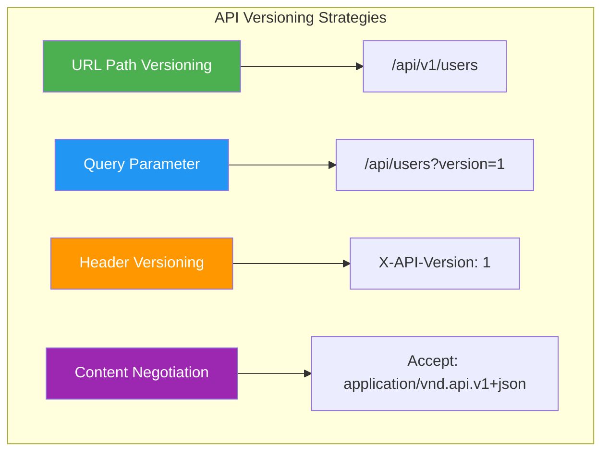
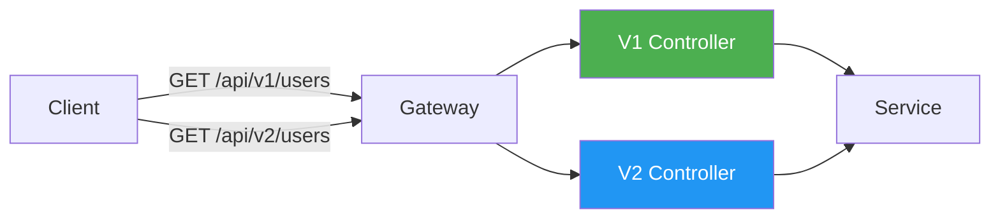
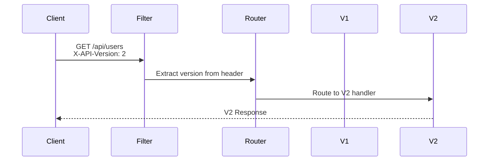
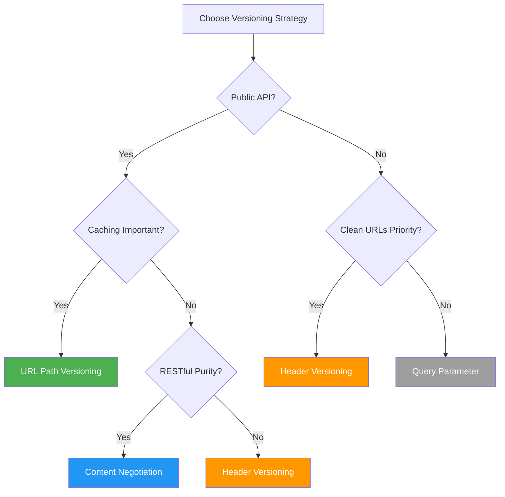

# How to Implement API Versioning in Spring Boot

Author: [nawazdhandala](https://www.github.com/nawazdhandala)

Tags: Java, Spring Boot, API, Versioning, REST, Web Services

Description: A comprehensive guide to implementing API versioning strategies in Spring Boot. Learn URL path, header, and content negotiation approaches with practical examples.

---

> API versioning is essential for evolving your REST APIs without breaking existing clients. This guide covers all major versioning strategies in Spring Boot with production-ready code examples.

APIs evolve over time. New features get added, response formats change, and sometimes breaking changes are unavoidable. Without proper versioning, you risk breaking clients that depend on your API. This guide shows you how to implement robust API versioning in Spring Boot applications.

---

## Why Version Your API?

Before diving into implementation, let's understand why API versioning matters:

| Reason | Description |
|--------|-------------|
| **Backward Compatibility** | Existing clients continue working when you make changes |
| **Gradual Migration** | Clients can migrate to new versions at their own pace |
| **Clear Contracts** | Each version has a well-defined interface |
| **Deprecation Path** | Old versions can be deprecated gracefully |
| **Multiple Client Support** | Different clients can use different versions |

---

## API Versioning Strategies

There are four main approaches to API versioning:



| Strategy | Pros | Cons | Best For |
|----------|------|------|----------|
| **URL Path** | Simple, visible, cacheable | URL pollution | Public APIs |
| **Query Parameter** | Easy to implement | Often forgotten | Internal APIs |
| **Header** | Clean URLs | Hidden, harder to test | Enterprise APIs |
| **Content Negotiation** | RESTful, flexible | Complex | Sophisticated clients |

---

## Project Setup

First, create a Spring Boot project with the required dependencies:

```xml
<!-- pom.xml -->
<?xml version="1.0" encoding="UTF-8"?>
<project xmlns="http://maven.apache.org/POM/4.0.0"
         xmlns:xsi="http://www.w3.org/2001/XMLSchema-instance"
         xsi:schemaLocation="http://maven.apache.org/POM/4.0.0 
         http://maven.apache.org/xsd/maven-4.0.0.xsd">
    <modelVersion>4.0.0</modelVersion>
    
    <parent>
        <groupId>org.springframework.boot</groupId>
        <artifactId>spring-boot-starter-parent</artifactId>
        <version>3.2.0</version>
        <relativePath/>
    </parent>
    
    <groupId>com.example</groupId>
    <artifactId>api-versioning-demo</artifactId>
    <version>1.0.0</version>
    <name>API Versioning Demo</name>
    
    <properties>
        <java.version>17</java.version>
    </properties>
    
    <dependencies>
        <!-- Spring Boot Web for REST APIs -->
        <dependency>
            <groupId>org.springframework.boot</groupId>
            <artifactId>spring-boot-starter-web</artifactId>
        </dependency>
        
        <!-- Validation support -->
        <dependency>
            <groupId>org.springframework.boot</groupId>
            <artifactId>spring-boot-starter-validation</artifactId>
        </dependency>
        
        <!-- Lombok for reducing boilerplate -->
        <dependency>
            <groupId>org.projectlombok</groupId>
            <artifactId>lombok</artifactId>
            <optional>true</optional>
        </dependency>
        
        <!-- Testing -->
        <dependency>
            <groupId>org.springframework.boot</groupId>
            <artifactId>spring-boot-starter-test</artifactId>
            <scope>test</scope>
        </dependency>
    </dependencies>
    
    <build>
        <plugins>
            <plugin>
                <groupId>org.springframework.boot</groupId>
                <artifactId>spring-boot-maven-plugin</artifactId>
            </plugin>
        </plugins>
    </build>
</project>
```

---

## Strategy 1: URL Path Versioning

URL path versioning is the most common and straightforward approach. The version is included directly in the URL path.

### Architecture Overview



### Domain Models

First, define the domain models for different API versions:

```java
// User.java - Base entity
package com.example.model;

import lombok.AllArgsConstructor;
import lombok.Builder;
import lombok.Data;
import lombok.NoArgsConstructor;

import java.time.LocalDateTime;

/**
 * Base User entity representing the database model.
 * This entity is version-independent and contains all user data.
 */
@Data
@Builder
@NoArgsConstructor
@AllArgsConstructor
public class User {
    private Long id;
    private String firstName;
    private String lastName;
    private String email;
    private String phone;
    private String address;
    private LocalDateTime createdAt;
    private LocalDateTime updatedAt;
}
```

```java
// UserDtoV1.java - Version 1 response format
package com.example.dto.v1;

import lombok.AllArgsConstructor;
import lombok.Builder;
import lombok.Data;
import lombok.NoArgsConstructor;

/**
 * V1 User DTO - Simple flat structure.
 * This was the original API response format.
 */
@Data
@Builder
@NoArgsConstructor
@AllArgsConstructor
public class UserDtoV1 {
    private Long id;
    // V1 uses combined full name
    private String name;
    private String email;
}
```

```java
// UserDtoV2.java - Version 2 response format with more details
package com.example.dto.v2;

import lombok.AllArgsConstructor;
import lombok.Builder;
import lombok.Data;
import lombok.NoArgsConstructor;

import java.time.LocalDateTime;

/**
 * V2 User DTO - Enhanced structure with separate name fields
 * and additional metadata.
 * 
 * Breaking changes from V1:
 * - 'name' field split into 'firstName' and 'lastName'
 * - Added 'phone' field
 * - Added 'metadata' object with timestamps
 */
@Data
@Builder
@NoArgsConstructor
@AllArgsConstructor
public class UserDtoV2 {
    private Long id;
    // V2 uses separate first and last name
    private String firstName;
    private String lastName;
    private String email;
    private String phone;
    private UserMetadata metadata;
    
    @Data
    @Builder
    @NoArgsConstructor
    @AllArgsConstructor
    public static class UserMetadata {
        private LocalDateTime createdAt;
        private LocalDateTime updatedAt;
    }
}
```

### Service Layer

Create a service that is version-agnostic:

```java
// UserService.java
package com.example.service;

import com.example.model.User;
import org.springframework.stereotype.Service;

import java.time.LocalDateTime;
import java.util.ArrayList;
import java.util.List;
import java.util.Map;
import java.util.Optional;
import java.util.concurrent.ConcurrentHashMap;
import java.util.concurrent.atomic.AtomicLong;

/**
 * User service handling business logic.
 * This service is version-independent - controllers handle
 * the conversion to version-specific DTOs.
 */
@Service
public class UserService {
    
    // In-memory storage for demonstration
    private final Map<Long, User> users = new ConcurrentHashMap<>();
    private final AtomicLong idGenerator = new AtomicLong(1);
    
    public UserService() {
        // Initialize with sample data
        createUser(User.builder()
            .firstName("John")
            .lastName("Doe")
            .email("john.doe@example.com")
            .phone("+1-555-0100")
            .address("123 Main St")
            .build());
            
        createUser(User.builder()
            .firstName("Jane")
            .lastName("Smith")
            .email("jane.smith@example.com")
            .phone("+1-555-0101")
            .address("456 Oak Ave")
            .build());
    }
    
    /**
     * Retrieve all users from the system.
     * @return List of all users
     */
    public List<User> getAllUsers() {
        return new ArrayList<>(users.values());
    }
    
    /**
     * Find a user by their unique identifier.
     * @param id The user's ID
     * @return Optional containing the user if found
     */
    public Optional<User> getUserById(Long id) {
        return Optional.ofNullable(users.get(id));
    }
    
    /**
     * Create a new user in the system.
     * @param user The user to create (without ID)
     * @return The created user with generated ID and timestamps
     */
    public User createUser(User user) {
        Long id = idGenerator.getAndIncrement();
        LocalDateTime now = LocalDateTime.now();
        
        user.setId(id);
        user.setCreatedAt(now);
        user.setUpdatedAt(now);
        
        users.put(id, user);
        return user;
    }
    
    /**
     * Update an existing user.
     * @param id The ID of the user to update
     * @param user The updated user data
     * @return Optional containing the updated user if found
     */
    public Optional<User> updateUser(Long id, User user) {
        if (!users.containsKey(id)) {
            return Optional.empty();
        }
        
        User existing = users.get(id);
        existing.setFirstName(user.getFirstName());
        existing.setLastName(user.getLastName());
        existing.setEmail(user.getEmail());
        existing.setPhone(user.getPhone());
        existing.setAddress(user.getAddress());
        existing.setUpdatedAt(LocalDateTime.now());
        
        return Optional.of(existing);
    }
    
    /**
     * Delete a user from the system.
     * @param id The ID of the user to delete
     * @return true if the user was deleted, false if not found
     */
    public boolean deleteUser(Long id) {
        return users.remove(id) != null;
    }
}
```

### Version 1 Controller

Create the V1 controller with the original API format:

```java
// UserControllerV1.java
package com.example.controller.v1;

import com.example.dto.v1.UserDtoV1;
import com.example.model.User;
import com.example.service.UserService;
import lombok.RequiredArgsConstructor;
import org.springframework.http.ResponseEntity;
import org.springframework.web.bind.annotation.*;

import java.util.List;
import java.util.stream.Collectors;

/**
 * Version 1 User Controller.
 * 
 * This controller handles the original API format where
 * user names are combined into a single 'name' field.
 * 
 * Base URL: /api/v1/users
 */
@RestController
@RequestMapping("/api/v1/users")
@RequiredArgsConstructor
public class UserControllerV1 {
    
    private final UserService userService;
    
    /**
     * Get all users in V1 format.
     * 
     * @return List of users with combined name field
     */
    @GetMapping
    public ResponseEntity<List<UserDtoV1>> getAllUsers() {
        List<UserDtoV1> users = userService.getAllUsers()
            .stream()
            .map(this::toV1Dto)
            .collect(Collectors.toList());
            
        return ResponseEntity.ok(users);
    }
    
    /**
     * Get a specific user by ID in V1 format.
     * 
     * @param id The user ID
     * @return The user in V1 format or 404 if not found
     */
    @GetMapping("/{id}")
    public ResponseEntity<UserDtoV1> getUser(@PathVariable Long id) {
        return userService.getUserById(id)
            .map(this::toV1Dto)
            .map(ResponseEntity::ok)
            .orElse(ResponseEntity.notFound().build());
    }
    
    /**
     * Create a new user from V1 request format.
     * 
     * @param request The user creation request
     * @return The created user in V1 format
     */
    @PostMapping
    public ResponseEntity<UserDtoV1> createUser(@RequestBody CreateUserRequestV1 request) {
        // Parse the combined name into first and last name
        String[] nameParts = request.getName().split(" ", 2);
        String firstName = nameParts[0];
        String lastName = nameParts.length > 1 ? nameParts[1] : "";
        
        User user = User.builder()
            .firstName(firstName)
            .lastName(lastName)
            .email(request.getEmail())
            .build();
            
        User created = userService.createUser(user);
        return ResponseEntity.ok(toV1Dto(created));
    }
    
    /**
     * Convert internal User model to V1 DTO format.
     * Combines firstName and lastName into single name field.
     */
    private UserDtoV1 toV1Dto(User user) {
        return UserDtoV1.builder()
            .id(user.getId())
            .name(user.getFirstName() + " " + user.getLastName())
            .email(user.getEmail())
            .build();
    }
}
```

```java
// CreateUserRequestV1.java
package com.example.controller.v1;

import jakarta.validation.constraints.Email;
import jakarta.validation.constraints.NotBlank;
import lombok.Data;

/**
 * V1 user creation request.
 * Uses a combined name field.
 */
@Data
public class CreateUserRequestV1 {
    @NotBlank(message = "Name is required")
    private String name;
    
    @NotBlank(message = "Email is required")
    @Email(message = "Invalid email format")
    private String email;
}
```

### Version 2 Controller

Create the V2 controller with the enhanced API format:

```java
// UserControllerV2.java
package com.example.controller.v2;

import com.example.dto.v2.UserDtoV2;
import com.example.model.User;
import com.example.service.UserService;
import lombok.RequiredArgsConstructor;
import org.springframework.http.ResponseEntity;
import org.springframework.web.bind.annotation.*;

import java.util.List;
import java.util.stream.Collectors;

/**
 * Version 2 User Controller.
 * 
 * Breaking changes from V1:
 * - Separate firstName and lastName fields
 * - Added phone field
 * - Added nested metadata object with timestamps
 * 
 * Base URL: /api/v2/users
 */
@RestController
@RequestMapping("/api/v2/users")
@RequiredArgsConstructor
public class UserControllerV2 {
    
    private final UserService userService;
    
    /**
     * Get all users in V2 format with full details.
     * 
     * @return List of users with separate name fields and metadata
     */
    @GetMapping
    public ResponseEntity<List<UserDtoV2>> getAllUsers() {
        List<UserDtoV2> users = userService.getAllUsers()
            .stream()
            .map(this::toV2Dto)
            .collect(Collectors.toList());
            
        return ResponseEntity.ok(users);
    }
    
    /**
     * Get a specific user by ID in V2 format.
     * 
     * @param id The user ID
     * @return The user in V2 format or 404 if not found
     */
    @GetMapping("/{id}")
    public ResponseEntity<UserDtoV2> getUser(@PathVariable Long id) {
        return userService.getUserById(id)
            .map(this::toV2Dto)
            .map(ResponseEntity::ok)
            .orElse(ResponseEntity.notFound().build());
    }
    
    /**
     * Create a new user from V2 request format.
     * 
     * @param request The user creation request with separate name fields
     * @return The created user in V2 format
     */
    @PostMapping
    public ResponseEntity<UserDtoV2> createUser(@RequestBody CreateUserRequestV2 request) {
        User user = User.builder()
            .firstName(request.getFirstName())
            .lastName(request.getLastName())
            .email(request.getEmail())
            .phone(request.getPhone())
            .build();
            
        User created = userService.createUser(user);
        return ResponseEntity.ok(toV2Dto(created));
    }
    
    /**
     * Update an existing user.
     * 
     * @param id The user ID to update
     * @param request The update request
     * @return The updated user or 404 if not found
     */
    @PutMapping("/{id}")
    public ResponseEntity<UserDtoV2> updateUser(
            @PathVariable Long id,
            @RequestBody CreateUserRequestV2 request) {
        
        User user = User.builder()
            .firstName(request.getFirstName())
            .lastName(request.getLastName())
            .email(request.getEmail())
            .phone(request.getPhone())
            .build();
            
        return userService.updateUser(id, user)
            .map(this::toV2Dto)
            .map(ResponseEntity::ok)
            .orElse(ResponseEntity.notFound().build());
    }
    
    /**
     * Delete a user by ID.
     * 
     * @param id The user ID to delete
     * @return 204 No Content if deleted, 404 if not found
     */
    @DeleteMapping("/{id}")
    public ResponseEntity<Void> deleteUser(@PathVariable Long id) {
        if (userService.deleteUser(id)) {
            return ResponseEntity.noContent().build();
        }
        return ResponseEntity.notFound().build();
    }
    
    /**
     * Convert internal User model to V2 DTO format.
     * Includes full details with metadata.
     */
    private UserDtoV2 toV2Dto(User user) {
        return UserDtoV2.builder()
            .id(user.getId())
            .firstName(user.getFirstName())
            .lastName(user.getLastName())
            .email(user.getEmail())
            .phone(user.getPhone())
            .metadata(UserDtoV2.UserMetadata.builder()
                .createdAt(user.getCreatedAt())
                .updatedAt(user.getUpdatedAt())
                .build())
            .build();
    }
}
```

```java
// CreateUserRequestV2.java
package com.example.controller.v2;

import jakarta.validation.constraints.Email;
import jakarta.validation.constraints.NotBlank;
import lombok.Data;

/**
 * V2 user creation request.
 * Uses separate first and last name fields.
 */
@Data
public class CreateUserRequestV2 {
    @NotBlank(message = "First name is required")
    private String firstName;
    
    @NotBlank(message = "Last name is required")
    private String lastName;
    
    @NotBlank(message = "Email is required")
    @Email(message = "Invalid email format")
    private String email;
    
    private String phone;
}
```

---

## Strategy 2: Header-Based Versioning

Header versioning keeps URLs clean while allowing version specification through custom headers.

### Architecture Overview



### Custom Version Annotation

Create a custom annotation for header-based versioning:

```java
// ApiVersion.java
package com.example.versioning;

import java.lang.annotation.ElementType;
import java.lang.annotation.Retention;
import java.lang.annotation.RetentionPolicy;
import java.lang.annotation.Target;

/**
 * Annotation to specify API version for a controller or method.
 * Used with header-based versioning strategy.
 * 
 * Usage:
 * @ApiVersion("1")
 * @ApiVersion({"1", "2"})  // Supports multiple versions
 */
@Target({ElementType.TYPE, ElementType.METHOD})
@Retention(RetentionPolicy.RUNTIME)
public @interface ApiVersion {
    /**
     * Supported API versions for this endpoint.
     */
    String[] value();
}
```

### Custom Request Mapping Condition

Implement custom request condition for version matching:

```java
// ApiVersionCondition.java
package com.example.versioning;

import jakarta.servlet.http.HttpServletRequest;
import org.springframework.web.servlet.mvc.condition.RequestCondition;

import java.util.Arrays;
import java.util.HashSet;
import java.util.Set;

/**
 * Custom request condition that matches requests based on
 * the X-API-Version header value.
 */
public class ApiVersionCondition implements RequestCondition<ApiVersionCondition> {
    
    public static final String HEADER_NAME = "X-API-Version";
    public static final String DEFAULT_VERSION = "1";
    
    private final Set<String> versions;
    
    public ApiVersionCondition(String... versions) {
        this.versions = new HashSet<>(Arrays.asList(versions));
    }
    
    /**
     * Combine this condition with another.
     * Method-level annotation takes precedence over class-level.
     */
    @Override
    public ApiVersionCondition combine(ApiVersionCondition other) {
        // Method-level takes precedence
        return new ApiVersionCondition(
            other.versions.toArray(new String[0])
        );
    }
    
    /**
     * Check if this condition matches the incoming request.
     * Returns this condition if matched, null otherwise.
     */
    @Override
    public ApiVersionCondition getMatchingCondition(HttpServletRequest request) {
        String requestVersion = request.getHeader(HEADER_NAME);
        
        // Default to version 1 if no header present
        if (requestVersion == null || requestVersion.isEmpty()) {
            requestVersion = DEFAULT_VERSION;
        }
        
        // Check if this handler supports the requested version
        if (versions.contains(requestVersion)) {
            return this;
        }
        
        return null;
    }
    
    /**
     * Compare two conditions for specificity.
     * More specific version wins.
     */
    @Override
    public int compareTo(ApiVersionCondition other, HttpServletRequest request) {
        // Prefer handlers with fewer supported versions (more specific)
        return Integer.compare(this.versions.size(), other.versions.size());
    }
    
    public Set<String> getVersions() {
        return versions;
    }
}
```

### Custom Request Mapping Handler

Create a custom handler mapping to process version annotations:

```java
// ApiVersionRequestMappingHandlerMapping.java
package com.example.versioning;

import org.springframework.core.annotation.AnnotatedElementUtils;
import org.springframework.web.servlet.mvc.condition.RequestCondition;
import org.springframework.web.servlet.mvc.method.annotation.RequestMappingHandlerMapping;

import java.lang.reflect.Method;

/**
 * Custom handler mapping that adds API version condition
 * to standard request mappings.
 */
public class ApiVersionRequestMappingHandlerMapping 
        extends RequestMappingHandlerMapping {
    
    /**
     * Get version condition from class-level @ApiVersion annotation.
     */
    @Override
    protected RequestCondition<?> getCustomTypeCondition(Class<?> handlerType) {
        ApiVersion apiVersion = AnnotatedElementUtils.findMergedAnnotation(
            handlerType, ApiVersion.class
        );
        return createCondition(apiVersion);
    }
    
    /**
     * Get version condition from method-level @ApiVersion annotation.
     */
    @Override
    protected RequestCondition<?> getCustomMethodCondition(Method method) {
        ApiVersion apiVersion = AnnotatedElementUtils.findMergedAnnotation(
            method, ApiVersion.class
        );
        return createCondition(apiVersion);
    }
    
    /**
     * Create ApiVersionCondition from annotation.
     */
    private RequestCondition<ApiVersionCondition> createCondition(ApiVersion apiVersion) {
        if (apiVersion == null) {
            return null;
        }
        return new ApiVersionCondition(apiVersion.value());
    }
}
```

### Configuration

Register the custom handler mapping:

```java
// WebMvcConfig.java
package com.example.config;

import com.example.versioning.ApiVersionRequestMappingHandlerMapping;
import org.springframework.boot.autoconfigure.web.servlet.WebMvcRegistrations;
import org.springframework.context.annotation.Configuration;
import org.springframework.web.servlet.mvc.method.annotation.RequestMappingHandlerMapping;

/**
 * Web MVC configuration to enable header-based API versioning.
 */
@Configuration
public class WebMvcConfig implements WebMvcRegistrations {
    
    @Override
    public RequestMappingHandlerMapping getRequestMappingHandlerMapping() {
        return new ApiVersionRequestMappingHandlerMapping();
    }
}
```

### Header-Versioned Controller

```java
// UserControllerHeaderVersioned.java
package com.example.controller.header;

import com.example.dto.v1.UserDtoV1;
import com.example.dto.v2.UserDtoV2;
import com.example.model.User;
import com.example.service.UserService;
import com.example.versioning.ApiVersion;
import lombok.RequiredArgsConstructor;
import org.springframework.http.ResponseEntity;
import org.springframework.web.bind.annotation.*;

import java.util.List;
import java.util.stream.Collectors;

/**
 * User controller using header-based versioning.
 * 
 * Version is specified via X-API-Version header:
 * - X-API-Version: 1 -> Returns V1 format
 * - X-API-Version: 2 -> Returns V2 format
 * - No header -> Defaults to V1
 */
@RestController
@RequestMapping("/api/users")
@RequiredArgsConstructor
public class UserControllerHeaderVersioned {
    
    private final UserService userService;
    
    // Version 1 endpoints
    
    /**
     * Get all users - Version 1 format.
     * Triggered when X-API-Version: 1 or no version header.
     */
    @ApiVersion("1")
    @GetMapping
    public ResponseEntity<List<UserDtoV1>> getAllUsersV1() {
        List<UserDtoV1> users = userService.getAllUsers()
            .stream()
            .map(this::toV1Dto)
            .collect(Collectors.toList());
            
        return ResponseEntity.ok(users);
    }
    
    /**
     * Get user by ID - Version 1 format.
     */
    @ApiVersion("1")
    @GetMapping("/{id}")
    public ResponseEntity<UserDtoV1> getUserV1(@PathVariable Long id) {
        return userService.getUserById(id)
            .map(this::toV1Dto)
            .map(ResponseEntity::ok)
            .orElse(ResponseEntity.notFound().build());
    }
    
    // Version 2 endpoints
    
    /**
     * Get all users - Version 2 format.
     * Triggered when X-API-Version: 2.
     */
    @ApiVersion("2")
    @GetMapping
    public ResponseEntity<List<UserDtoV2>> getAllUsersV2() {
        List<UserDtoV2> users = userService.getAllUsers()
            .stream()
            .map(this::toV2Dto)
            .collect(Collectors.toList());
            
        return ResponseEntity.ok(users);
    }
    
    /**
     * Get user by ID - Version 2 format.
     */
    @ApiVersion("2")
    @GetMapping("/{id}")
    public ResponseEntity<UserDtoV2> getUserV2(@PathVariable Long id) {
        return userService.getUserById(id)
            .map(this::toV2Dto)
            .map(ResponseEntity::ok)
            .orElse(ResponseEntity.notFound().build());
    }
    
    // DTO conversion methods
    
    private UserDtoV1 toV1Dto(User user) {
        return UserDtoV1.builder()
            .id(user.getId())
            .name(user.getFirstName() + " " + user.getLastName())
            .email(user.getEmail())
            .build();
    }
    
    private UserDtoV2 toV2Dto(User user) {
        return UserDtoV2.builder()
            .id(user.getId())
            .firstName(user.getFirstName())
            .lastName(user.getLastName())
            .email(user.getEmail())
            .phone(user.getPhone())
            .metadata(UserDtoV2.UserMetadata.builder()
                .createdAt(user.getCreatedAt())
                .updatedAt(user.getUpdatedAt())
                .build())
            .build();
    }
}
```

---

## Strategy 3: Content Negotiation

Content negotiation uses the Accept header with vendor-specific media types. This is the most RESTful approach.

### Custom Media Types

Define custom media types for each version:

```java
// MediaTypes.java
package com.example.versioning;

import org.springframework.http.MediaType;

/**
 * Custom media types for API versioning via content negotiation.
 * 
 * Format: application/vnd.{company}.{api}.{version}+json
 */
public final class MediaTypes {
    
    private MediaTypes() {}
    
    // Version 1 media type
    public static final String V1_JSON_VALUE = "application/vnd.example.api.v1+json";
    public static final MediaType V1_JSON = MediaType.parseMediaType(V1_JSON_VALUE);
    
    // Version 2 media type
    public static final String V2_JSON_VALUE = "application/vnd.example.api.v2+json";
    public static final MediaType V2_JSON = MediaType.parseMediaType(V2_JSON_VALUE);
    
    // Latest version (alias)
    public static final String LATEST_JSON_VALUE = V2_JSON_VALUE;
    public static final MediaType LATEST_JSON = V2_JSON;
}
```

### Content Negotiation Controller

```java
// UserControllerContentNegotiation.java
package com.example.controller.contentneg;

import com.example.dto.v1.UserDtoV1;
import com.example.dto.v2.UserDtoV2;
import com.example.model.User;
import com.example.service.UserService;
import com.example.versioning.MediaTypes;
import lombok.RequiredArgsConstructor;
import org.springframework.http.ResponseEntity;
import org.springframework.web.bind.annotation.*;

import java.util.List;
import java.util.stream.Collectors;

/**
 * User controller using content negotiation for versioning.
 * 
 * Version is specified via Accept header:
 * - Accept: application/vnd.example.api.v1+json -> V1 format
 * - Accept: application/vnd.example.api.v2+json -> V2 format
 * - Accept: application/json -> Latest version (V2)
 */
@RestController
@RequestMapping("/api-cn/users")
@RequiredArgsConstructor
public class UserControllerContentNegotiation {
    
    private final UserService userService;
    
    // Version 1 endpoints using custom media type
    
    /**
     * Get all users - V1 format via content negotiation.
     * 
     * Request: Accept: application/vnd.example.api.v1+json
     */
    @GetMapping(produces = MediaTypes.V1_JSON_VALUE)
    public ResponseEntity<List<UserDtoV1>> getAllUsersV1() {
        List<UserDtoV1> users = userService.getAllUsers()
            .stream()
            .map(this::toV1Dto)
            .collect(Collectors.toList());
            
        return ResponseEntity.ok(users);
    }
    
    /**
     * Get user by ID - V1 format.
     */
    @GetMapping(value = "/{id}", produces = MediaTypes.V1_JSON_VALUE)
    public ResponseEntity<UserDtoV1> getUserV1(@PathVariable Long id) {
        return userService.getUserById(id)
            .map(this::toV1Dto)
            .map(ResponseEntity::ok)
            .orElse(ResponseEntity.notFound().build());
    }
    
    // Version 2 endpoints (also serves as default for application/json)
    
    /**
     * Get all users - V2 format via content negotiation.
     * Also handles plain application/json requests.
     * 
     * Request: Accept: application/vnd.example.api.v2+json
     * Or: Accept: application/json
     */
    @GetMapping(produces = {
        MediaTypes.V2_JSON_VALUE,
        org.springframework.http.MediaType.APPLICATION_JSON_VALUE
    })
    public ResponseEntity<List<UserDtoV2>> getAllUsersV2() {
        List<UserDtoV2> users = userService.getAllUsers()
            .stream()
            .map(this::toV2Dto)
            .collect(Collectors.toList());
            
        return ResponseEntity.ok(users);
    }
    
    /**
     * Get user by ID - V2 format.
     */
    @GetMapping(value = "/{id}", produces = {
        MediaTypes.V2_JSON_VALUE,
        org.springframework.http.MediaType.APPLICATION_JSON_VALUE
    })
    public ResponseEntity<UserDtoV2> getUserV2(@PathVariable Long id) {
        return userService.getUserById(id)
            .map(this::toV2Dto)
            .map(ResponseEntity::ok)
            .orElse(ResponseEntity.notFound().build());
    }
    
    // DTO conversion methods
    
    private UserDtoV1 toV1Dto(User user) {
        return UserDtoV1.builder()
            .id(user.getId())
            .name(user.getFirstName() + " " + user.getLastName())
            .email(user.getEmail())
            .build();
    }
    
    private UserDtoV2 toV2Dto(User user) {
        return UserDtoV2.builder()
            .id(user.getId())
            .firstName(user.getFirstName())
            .lastName(user.getLastName())
            .email(user.getEmail())
            .phone(user.getPhone())
            .metadata(UserDtoV2.UserMetadata.builder()
                .createdAt(user.getCreatedAt())
                .updatedAt(user.getUpdatedAt())
                .build())
            .build();
    }
}
```

---

## Strategy 4: Query Parameter Versioning

Query parameter versioning is simple but often considered less RESTful.

### Interceptor-Based Approach

```java
// VersionInterceptor.java
package com.example.versioning;

import jakarta.servlet.http.HttpServletRequest;
import jakarta.servlet.http.HttpServletResponse;
import org.springframework.stereotype.Component;
import org.springframework.web.servlet.HandlerInterceptor;

/**
 * Interceptor that extracts version from query parameter
 * and stores it in request attributes.
 */
@Component
public class VersionInterceptor implements HandlerInterceptor {
    
    public static final String VERSION_ATTRIBUTE = "api.version";
    public static final String VERSION_PARAM = "version";
    public static final String DEFAULT_VERSION = "1";
    
    @Override
    public boolean preHandle(
            HttpServletRequest request,
            HttpServletResponse response,
            Object handler) {
        
        String version = request.getParameter(VERSION_PARAM);
        
        if (version == null || version.isEmpty()) {
            version = DEFAULT_VERSION;
        }
        
        // Store version in request attributes for controllers to use
        request.setAttribute(VERSION_ATTRIBUTE, version);
        
        return true;
    }
}
```

### Controller Using Request Attributes

```java
// UserControllerQueryParam.java
package com.example.controller.queryparam;

import com.example.dto.v1.UserDtoV1;
import com.example.dto.v2.UserDtoV2;
import com.example.model.User;
import com.example.service.UserService;
import com.example.versioning.VersionInterceptor;
import lombok.RequiredArgsConstructor;
import org.springframework.http.ResponseEntity;
import org.springframework.web.bind.annotation.*;

import jakarta.servlet.http.HttpServletRequest;
import java.util.List;
import java.util.stream.Collectors;

/**
 * User controller using query parameter versioning.
 * 
 * Version is specified via query parameter:
 * - /api-qp/users?version=1 -> V1 format
 * - /api-qp/users?version=2 -> V2 format
 * - /api-qp/users -> Defaults to V1
 */
@RestController
@RequestMapping("/api-qp/users")
@RequiredArgsConstructor
public class UserControllerQueryParam {
    
    private final UserService userService;
    
    /**
     * Get all users with version-specific response.
     * 
     * @param request HttpServletRequest containing version attribute
     * @return Users in the requested version format
     */
    @GetMapping
    public ResponseEntity<?> getAllUsers(HttpServletRequest request) {
        String version = (String) request.getAttribute(
            VersionInterceptor.VERSION_ATTRIBUTE
        );
        
        List<User> users = userService.getAllUsers();
        
        return switch (version) {
            case "2" -> ResponseEntity.ok(
                users.stream().map(this::toV2Dto).collect(Collectors.toList())
            );
            default -> ResponseEntity.ok(
                users.stream().map(this::toV1Dto).collect(Collectors.toList())
            );
        };
    }
    
    /**
     * Get user by ID with version-specific response.
     */
    @GetMapping("/{id}")
    public ResponseEntity<?> getUser(
            @PathVariable Long id,
            HttpServletRequest request) {
        
        String version = (String) request.getAttribute(
            VersionInterceptor.VERSION_ATTRIBUTE
        );
        
        return userService.getUserById(id)
            .map(user -> switch (version) {
                case "2" -> ResponseEntity.ok(toV2Dto(user));
                default -> ResponseEntity.ok(toV1Dto(user));
            })
            .orElse(ResponseEntity.notFound().build());
    }
    
    // DTO conversion methods
    
    private UserDtoV1 toV1Dto(User user) {
        return UserDtoV1.builder()
            .id(user.getId())
            .name(user.getFirstName() + " " + user.getLastName())
            .email(user.getEmail())
            .build();
    }
    
    private UserDtoV2 toV2Dto(User user) {
        return UserDtoV2.builder()
            .id(user.getId())
            .firstName(user.getFirstName())
            .lastName(user.getLastName())
            .email(user.getEmail())
            .phone(user.getPhone())
            .metadata(UserDtoV2.UserMetadata.builder()
                .createdAt(user.getCreatedAt())
                .updatedAt(user.getUpdatedAt())
                .build())
            .build();
    }
}
```

---

## Version Deprecation

Properly deprecating old API versions is crucial for a smooth transition.

### Deprecation Headers

```java
// DeprecationInterceptor.java
package com.example.versioning;

import jakarta.servlet.http.HttpServletRequest;
import jakarta.servlet.http.HttpServletResponse;
import org.springframework.stereotype.Component;
import org.springframework.web.servlet.HandlerInterceptor;

import java.time.LocalDate;
import java.time.format.DateTimeFormatter;
import java.util.Map;

/**
 * Interceptor that adds deprecation warnings to responses
 * for old API versions.
 */
@Component
public class DeprecationInterceptor implements HandlerInterceptor {
    
    // Deprecation schedule: version -> sunset date
    private static final Map<String, LocalDate> DEPRECATION_DATES = Map.of(
        "1", LocalDate.of(2025, 12, 31)
    );
    
    @Override
    public void afterCompletion(
            HttpServletRequest request,
            HttpServletResponse response,
            Object handler,
            Exception ex) {
        
        // Check URL path for version
        String path = request.getRequestURI();
        
        if (path.contains("/v1/")) {
            addDeprecationHeaders(response, "1");
        }
        
        // Check header version
        String headerVersion = request.getHeader("X-API-Version");
        if ("1".equals(headerVersion)) {
            addDeprecationHeaders(response, "1");
        }
    }
    
    private void addDeprecationHeaders(HttpServletResponse response, String version) {
        LocalDate sunsetDate = DEPRECATION_DATES.get(version);
        
        if (sunsetDate != null) {
            // Standard deprecation header
            response.setHeader("Deprecation", "true");
            
            // Sunset header with date
            response.setHeader("Sunset", 
                sunsetDate.format(DateTimeFormatter.ISO_DATE));
            
            // Link to migration guide
            response.setHeader("Link", 
                "</docs/migration/v1-to-v2>; rel=\"deprecation\"");
            
            // Warning header
            response.setHeader("Warning", 
                "299 - \"API v" + version + " is deprecated. " +
                "Please migrate to v2 before " + sunsetDate + "\"");
        }
    }
}
```

### Register Interceptors

```java
// InterceptorConfig.java
package com.example.config;

import com.example.versioning.DeprecationInterceptor;
import com.example.versioning.VersionInterceptor;
import lombok.RequiredArgsConstructor;
import org.springframework.context.annotation.Configuration;
import org.springframework.web.servlet.config.annotation.InterceptorRegistry;
import org.springframework.web.servlet.config.annotation.WebMvcConfigurer;

/**
 * Configuration to register version-related interceptors.
 */
@Configuration
@RequiredArgsConstructor
public class InterceptorConfig implements WebMvcConfigurer {
    
    private final VersionInterceptor versionInterceptor;
    private final DeprecationInterceptor deprecationInterceptor;
    
    @Override
    public void addInterceptors(InterceptorRegistry registry) {
        // Version extraction for query param versioning
        registry.addInterceptor(versionInterceptor)
            .addPathPatterns("/api-qp/**");
        
        // Deprecation warnings for all API endpoints
        registry.addInterceptor(deprecationInterceptor)
            .addPathPatterns("/api/**");
    }
}
```

---

## Testing API Versions

### Unit Tests

```java
// UserControllerV1Test.java
package com.example.controller.v1;

import com.example.service.UserService;
import org.junit.jupiter.api.Test;
import org.springframework.beans.factory.annotation.Autowired;
import org.springframework.boot.test.autoconfigure.web.servlet.WebMvcTest;
import org.springframework.boot.test.mock.mockito.MockBean;
import org.springframework.test.web.servlet.MockMvc;

import static org.springframework.test.web.servlet.request.MockMvcRequestBuilders.get;
import static org.springframework.test.web.servlet.result.MockMvcResultMatchers.*;

/**
 * Tests for V1 User Controller.
 */
@WebMvcTest(UserControllerV1.class)
class UserControllerV1Test {
    
    @Autowired
    private MockMvc mockMvc;
    
    @MockBean
    private UserService userService;
    
    @Test
    void getAllUsers_ReturnsV1Format() throws Exception {
        mockMvc.perform(get("/api/v1/users"))
            .andExpect(status().isOk())
            .andExpect(jsonPath("$[0].name").exists())
            .andExpect(jsonPath("$[0].firstName").doesNotExist());
    }
}
```

```java
// UserControllerV2Test.java
package com.example.controller.v2;

import com.example.service.UserService;
import org.junit.jupiter.api.Test;
import org.springframework.beans.factory.annotation.Autowired;
import org.springframework.boot.test.autoconfigure.web.servlet.WebMvcTest;
import org.springframework.boot.test.mock.mockito.MockBean;
import org.springframework.test.web.servlet.MockMvc;

import static org.springframework.test.web.servlet.request.MockMvcRequestBuilders.get;
import static org.springframework.test.web.servlet.result.MockMvcResultMatchers.*;

/**
 * Tests for V2 User Controller.
 */
@WebMvcTest(UserControllerV2.class)
class UserControllerV2Test {
    
    @Autowired
    private MockMvc mockMvc;
    
    @MockBean
    private UserService userService;
    
    @Test
    void getAllUsers_ReturnsV2Format() throws Exception {
        mockMvc.perform(get("/api/v2/users"))
            .andExpect(status().isOk())
            .andExpect(jsonPath("$[0].firstName").exists())
            .andExpect(jsonPath("$[0].lastName").exists())
            .andExpect(jsonPath("$[0].metadata").exists());
    }
}
```

### Integration Tests for Header Versioning

```java
// HeaderVersioningIntegrationTest.java
package com.example.controller.header;

import org.junit.jupiter.api.Test;
import org.springframework.beans.factory.annotation.Autowired;
import org.springframework.boot.test.autoconfigure.web.servlet.AutoConfigureMockMvc;
import org.springframework.boot.test.context.SpringBootTest;
import org.springframework.test.web.servlet.MockMvc;

import static org.springframework.test.web.servlet.request.MockMvcRequestBuilders.get;
import static org.springframework.test.web.servlet.result.MockMvcResultMatchers.*;

/**
 * Integration tests for header-based versioning.
 */
@SpringBootTest
@AutoConfigureMockMvc
class HeaderVersioningIntegrationTest {
    
    @Autowired
    private MockMvc mockMvc;
    
    @Test
    void withV1Header_ReturnsV1Format() throws Exception {
        mockMvc.perform(get("/api/users")
                .header("X-API-Version", "1"))
            .andExpect(status().isOk())
            .andExpect(jsonPath("$[0].name").exists())
            .andExpect(jsonPath("$[0].firstName").doesNotExist());
    }
    
    @Test
    void withV2Header_ReturnsV2Format() throws Exception {
        mockMvc.perform(get("/api/users")
                .header("X-API-Version", "2"))
            .andExpect(status().isOk())
            .andExpect(jsonPath("$[0].firstName").exists())
            .andExpect(jsonPath("$[0].metadata").exists());
    }
    
    @Test
    void withNoHeader_DefaultsToV1() throws Exception {
        mockMvc.perform(get("/api/users"))
            .andExpect(status().isOk())
            .andExpect(jsonPath("$[0].name").exists());
    }
}
```

---

## Best Practices

### 1. Choose the Right Strategy



### 2. Version What Changes

| Change Type | Requires New Version? |
|-------------|----------------------|
| Adding new optional field | No |
| Adding new endpoint | No |
| Removing field | Yes |
| Renaming field | Yes |
| Changing field type | Yes |
| Changing endpoint behavior | Yes |

### 3. Document All Versions

```java
// SwaggerConfig.java
package com.example.config;

import io.swagger.v3.oas.models.OpenAPI;
import io.swagger.v3.oas.models.info.Info;
import org.springframework.context.annotation.Bean;
import org.springframework.context.annotation.Configuration;

/**
 * OpenAPI documentation configuration.
 * Document all API versions clearly.
 */
@Configuration
public class SwaggerConfig {
    
    @Bean
    public OpenAPI openAPI() {
        return new OpenAPI()
            .info(new Info()
                .title("User API")
                .version("2.0")
                .description("""
                    User management API supporting multiple versions.
                    
                    ## Versions
                    - **V1** (Deprecated): Original API, sunset date 2025-12-31
                    - **V2** (Current): Enhanced API with separate name fields
                    
                    ## Versioning Methods
                    - URL Path: /api/v1/users, /api/v2/users
                    - Header: X-API-Version: 1 or 2
                    - Content-Type: application/vnd.example.api.v1+json
                    """));
    }
}
```

### 4. Use Semantic Versioning for APIs

- **Major version** (v1 -> v2): Breaking changes
- **Minor version**: Backward-compatible new features
- **Patch version**: Bug fixes

### 5. Maintain Backward Compatibility Within Major Versions

```java
// Add new optional fields without breaking existing clients
@Data
public class UserDtoV2 {
    private Long id;
    private String firstName;
    private String lastName;
    private String email;
    private String phone;
    
    // New field added in v2.1 - optional, won't break v2.0 clients
    @JsonInclude(JsonInclude.Include.NON_NULL)
    private String avatarUrl;
    
    private UserMetadata metadata;
}
```

---

## Conclusion

API versioning is essential for maintaining backward compatibility while evolving your APIs. Key takeaways:

- **URL path versioning** is the most common and recommended for public APIs
- **Header versioning** keeps URLs clean but is harder to test
- **Content negotiation** is the most RESTful but requires sophisticated clients
- **Query parameters** are simple but often forgotten

Choose the strategy that fits your use case, document it well, and plan for deprecation from the start.

---

*Need to monitor API performance across versions? [OneUptime](https://oneuptime.com) provides comprehensive API monitoring and tracing to ensure all your API versions perform well.*

**Related Reading:**
- [How to Build Reactive Applications with Spring WebFlux](https://oneuptime.com/blog)
- [How to Implement Distributed Tracing in Spring Boot](https://oneuptime.com/blog)
