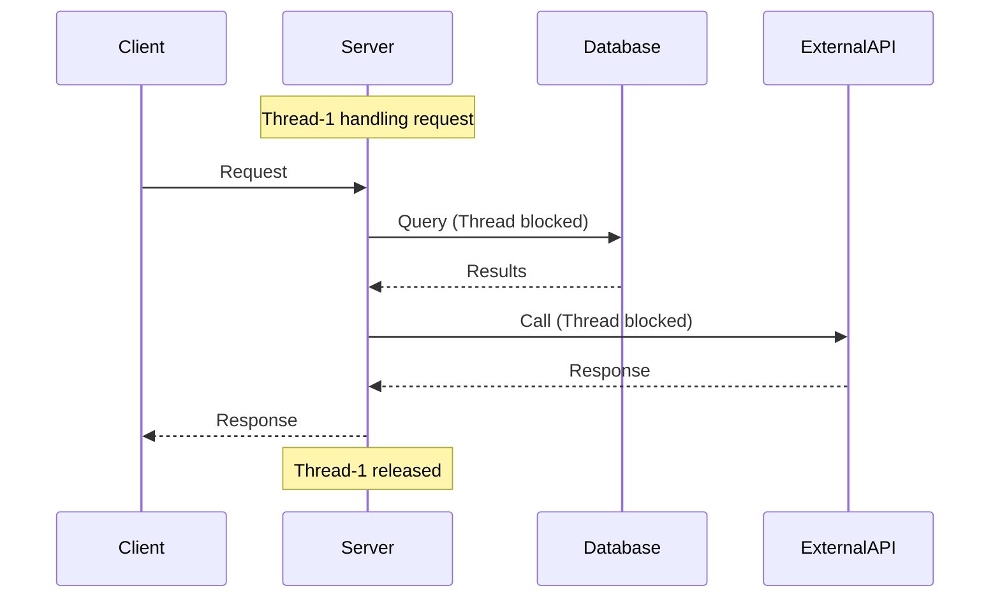
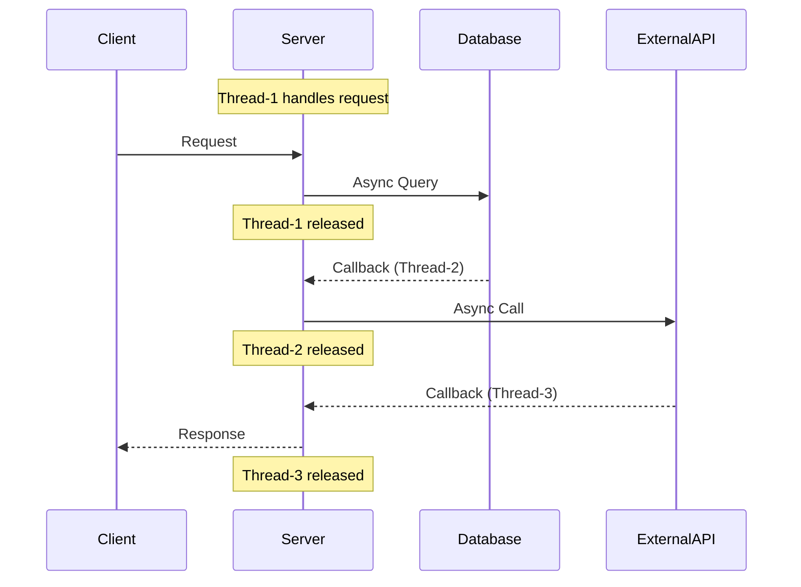
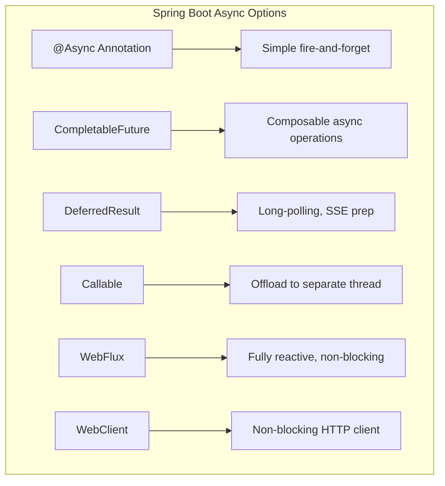
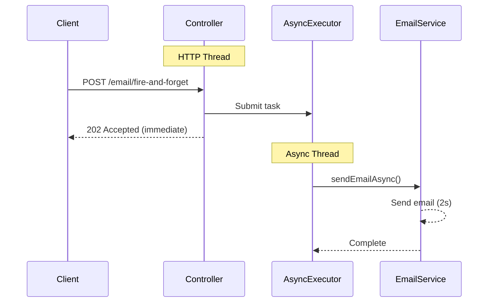
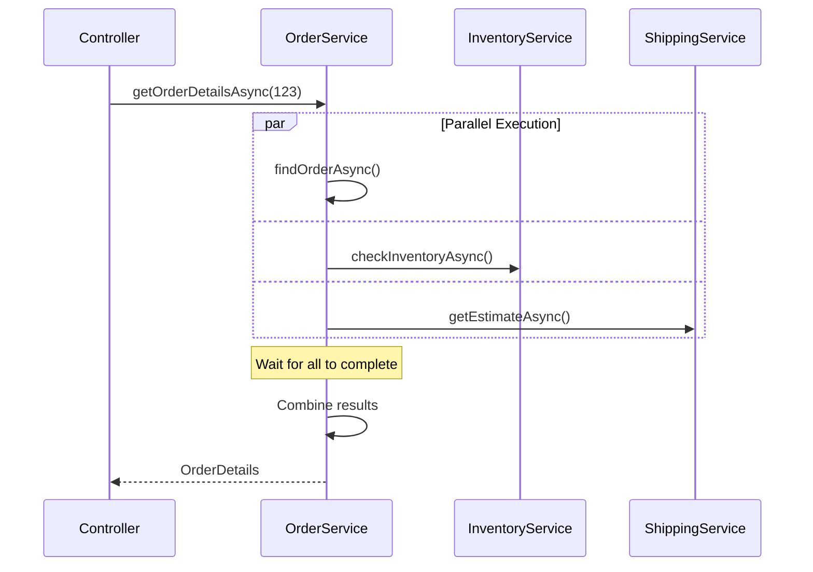
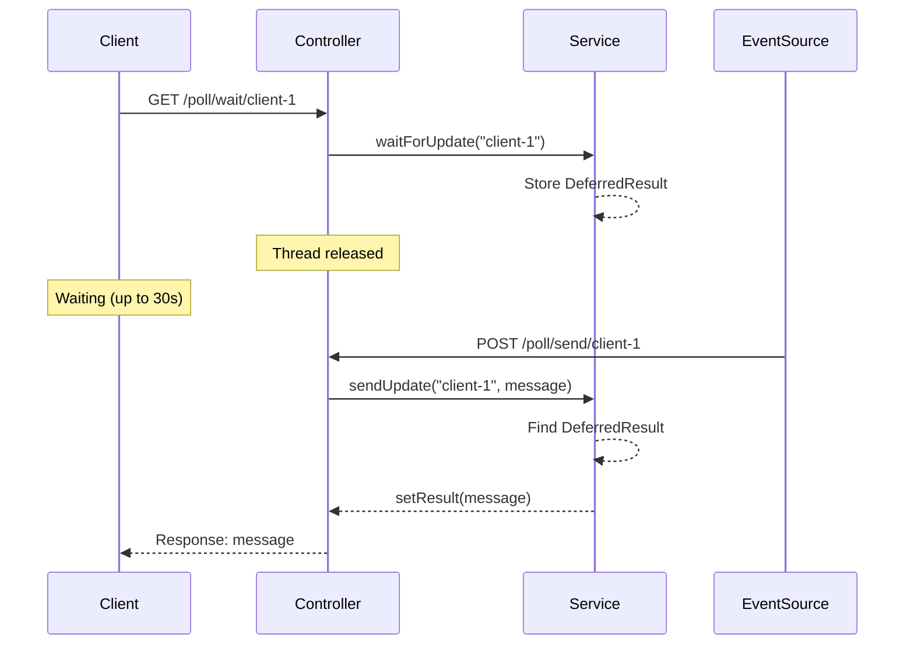
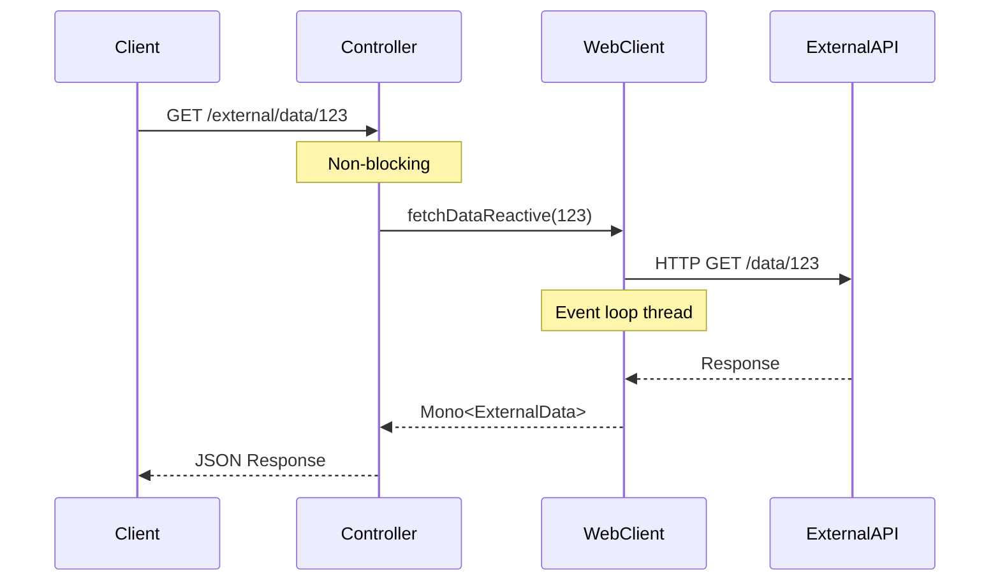
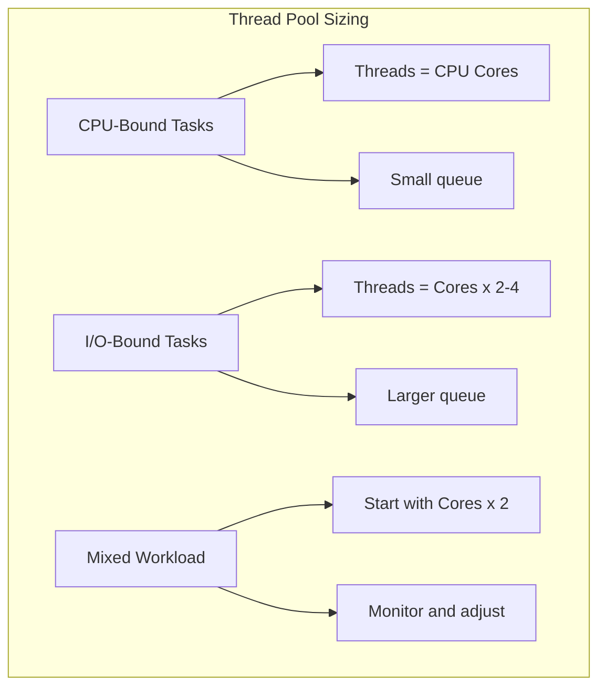

# How to Build Asynchronous APIs with Spring Boot

Author: [nawazdhandala](https://www.github.com/nawazdhandala)

Tags: Java, Spring Boot, Async, CompletableFuture, WebFlux, Performance

Description: A comprehensive guide to building asynchronous APIs in Spring Boot. Learn @Async, CompletableFuture, DeferredResult, and WebClient for non-blocking applications.

---

> Synchronous APIs block threads while waiting for I/O operations. Asynchronous APIs free threads to handle other requests, dramatically improving throughput and scalability. Spring Boot provides multiple approaches to build async APIs, from simple annotations to fully reactive programming.

Modern applications face increasing demands: more users, more integrations, and lower latency requirements. Asynchronous programming helps meet these demands by using resources more efficiently.

---

## Why Asynchronous APIs?

Traditional synchronous APIs follow a simple pattern: receive request, process, respond. The problem? Each request occupies a thread for its entire duration, even during I/O waits.



With async processing, threads are released during I/O operations:



### Benefits of Async Processing

| Aspect | Synchronous | Asynchronous |
|--------|-------------|--------------|
| Thread usage | 1 thread per request | Threads shared across requests |
| Scalability | Limited by thread pool | Higher throughput possible |
| Resource efficiency | Low during I/O waits | High throughout |
| Complexity | Simple | Higher |
| Debugging | Straightforward | More challenging |

---

## Async Approaches in Spring Boot

Spring Boot offers several ways to implement async APIs:



Let's explore each approach with practical examples.

---

## Project Setup

### Dependencies

```xml
<!-- pom.xml -->
<project>
    <parent>
        <groupId>org.springframework.boot</groupId>
        <artifactId>spring-boot-starter-parent</artifactId>
        <version>3.2.0</version>
    </parent>
    
    <dependencies>
        <!-- Spring Web for REST APIs -->
        <dependency>
            <groupId>org.springframework.boot</groupId>
            <artifactId>spring-boot-starter-web</artifactId>
        </dependency>
        
        <!-- WebFlux for reactive programming -->
        <dependency>
            <groupId>org.springframework.boot</groupId>
            <artifactId>spring-boot-starter-webflux</artifactId>
        </dependency>
        
        <!-- Validation -->
        <dependency>
            <groupId>org.springframework.boot</groupId>
            <artifactId>spring-boot-starter-validation</artifactId>
        </dependency>
        
        <!-- Lombok for cleaner code -->
        <dependency>
            <groupId>org.projectlombok</groupId>
            <artifactId>lombok</artifactId>
            <optional>true</optional>
        </dependency>
        
        <!-- Actuator for monitoring -->
        <dependency>
            <groupId>org.springframework.boot</groupId>
            <artifactId>spring-boot-starter-actuator</artifactId>
        </dependency>
        
        <!-- Testing -->
        <dependency>
            <groupId>org.springframework.boot</groupId>
            <artifactId>spring-boot-starter-test</artifactId>
            <scope>test</scope>
        </dependency>
    </dependencies>
</project>
```

For Gradle:

```groovy
// build.gradle
plugins {
    id 'java'
    id 'org.springframework.boot' version '3.2.0'
    id 'io.spring.dependency-management' version '1.1.4'
}

dependencies {
    implementation 'org.springframework.boot:spring-boot-starter-web'
    implementation 'org.springframework.boot:spring-boot-starter-webflux'
    implementation 'org.springframework.boot:spring-boot-starter-validation'
    implementation 'org.springframework.boot:spring-boot-starter-actuator'
    
    compileOnly 'org.projectlombok:lombok'
    annotationProcessor 'org.projectlombok:lombok'
    
    testImplementation 'org.springframework.boot:spring-boot-starter-test'
}
```

---

## Using @Async Annotation

The `@Async` annotation is the simplest way to run methods asynchronously in Spring.

### Enable Async Support

```java
// config/AsyncConfig.java
package com.example.config;

import lombok.extern.slf4j.Slf4j;
import org.springframework.aop.interceptor.AsyncUncaughtExceptionHandler;
import org.springframework.context.annotation.Bean;
import org.springframework.context.annotation.Configuration;
import org.springframework.scheduling.annotation.AsyncConfigurer;
import org.springframework.scheduling.annotation.EnableAsync;
import org.springframework.scheduling.concurrent.ThreadPoolTaskExecutor;

import java.lang.reflect.Method;
import java.util.concurrent.Executor;

@Slf4j
@Configuration
@EnableAsync  // Enable async processing
public class AsyncConfig implements AsyncConfigurer {

    // Configure the default executor for @Async methods
    @Override
    @Bean(name = "taskExecutor")
    public Executor getAsyncExecutor() {
        ThreadPoolTaskExecutor executor = new ThreadPoolTaskExecutor();
        
        // Core pool size - minimum threads kept alive
        executor.setCorePoolSize(10);
        
        // Max pool size - maximum threads allowed
        executor.setMaxPoolSize(50);
        
        // Queue capacity - requests queued when all threads busy
        executor.setQueueCapacity(100);
        
        // Thread name prefix for debugging
        executor.setThreadNamePrefix("Async-");
        
        // Rejection policy when queue is full
        executor.setRejectedExecutionHandler((r, e) -> {
            log.warn("Task rejected: thread pool exhausted");
            throw new RuntimeException("Thread pool exhausted");
        });
        
        // Wait for tasks to complete on shutdown
        executor.setWaitForTasksToCompleteOnShutdown(true);
        executor.setAwaitTerminationSeconds(30);
        
        executor.initialize();
        return executor;
    }

    // Handle exceptions from @Async void methods
    @Override
    public AsyncUncaughtExceptionHandler getAsyncUncaughtExceptionHandler() {
        return new AsyncExceptionHandler();
    }
    
    // Custom exception handler
    private static class AsyncExceptionHandler implements AsyncUncaughtExceptionHandler {
        @Override
        public void handleUncaughtException(Throwable ex, Method method, Object... params) {
            log.error("Async exception in method '{}': {}", 
                method.getName(), ex.getMessage(), ex);
        }
    }
}
```

### Basic Async Service

```java
// service/EmailService.java
package com.example.service;

import lombok.extern.slf4j.Slf4j;
import org.springframework.scheduling.annotation.Async;
import org.springframework.stereotype.Service;

import java.util.concurrent.CompletableFuture;

@Slf4j
@Service
public class EmailService {

    // Fire-and-forget async method (void return)
    // Caller does not wait for completion
    @Async
    public void sendEmailAsync(String to, String subject, String body) {
        log.info("Sending email to {} on thread: {}", 
            to, Thread.currentThread().getName());
        
        try {
            // Simulate email sending delay
            Thread.sleep(2000);
            
            // Actual email sending logic would go here
            log.info("Email sent successfully to {}", to);
            
        } catch (InterruptedException e) {
            Thread.currentThread().interrupt();
            log.error("Email sending interrupted", e);
        }
    }

    // Async method with CompletableFuture return
    // Caller can wait for result or chain operations
    @Async
    public CompletableFuture<Boolean> sendEmailWithConfirmation(
            String to, String subject, String body) {
        
        log.info("Sending email with confirmation to {} on thread: {}", 
            to, Thread.currentThread().getName());
        
        try {
            // Simulate email sending
            Thread.sleep(2000);
            
            // Return success
            log.info("Email sent and confirmed to {}", to);
            return CompletableFuture.completedFuture(true);
            
        } catch (InterruptedException e) {
            Thread.currentThread().interrupt();
            log.error("Email sending interrupted", e);
            return CompletableFuture.completedFuture(false);
        }
    }
}
```

### Controller Using Async Service

```java
// controller/NotificationController.java
package com.example.controller;

import com.example.service.EmailService;
import lombok.RequiredArgsConstructor;
import lombok.extern.slf4j.Slf4j;
import org.springframework.http.ResponseEntity;
import org.springframework.web.bind.annotation.*;

import java.util.Map;
import java.util.concurrent.CompletableFuture;

@Slf4j
@RestController
@RequestMapping("/api/notifications")
@RequiredArgsConstructor
public class NotificationController {

    private final EmailService emailService;

    // Fire-and-forget: returns immediately
    @PostMapping("/email/fire-and-forget")
    public ResponseEntity<Map<String, String>> sendEmailFireAndForget(
            @RequestParam String to,
            @RequestParam String subject,
            @RequestParam String body) {
        
        log.info("Received email request on thread: {}", 
            Thread.currentThread().getName());
        
        // This returns immediately - email sent in background
        emailService.sendEmailAsync(to, subject, body);
        
        return ResponseEntity.accepted()
            .body(Map.of(
                "status", "accepted",
                "message", "Email queued for delivery"
            ));
    }

    // Async with result: endpoint is still async
    @PostMapping("/email/with-confirmation")
    public CompletableFuture<ResponseEntity<Map<String, Object>>> sendEmailWithConfirmation(
            @RequestParam String to,
            @RequestParam String subject,
            @RequestParam String body) {
        
        log.info("Received confirmation email request on thread: {}", 
            Thread.currentThread().getName());
        
        // Return CompletableFuture - Spring handles async response
        return emailService.sendEmailWithConfirmation(to, subject, body)
            .thenApply(success -> {
                log.info("Processing result on thread: {}", 
                    Thread.currentThread().getName());
                
                if (success) {
                    return ResponseEntity.ok(Map.of(
                        "status", "sent",
                        "recipient", to
                    ));
                } else {
                    return ResponseEntity.internalServerError()
                        .body(Map.of(
                            "status", "failed",
                            "recipient", to
                        ));
                }
            });
    }
}
```

### Async Execution Flow



---

## CompletableFuture for Complex Async Flows

`CompletableFuture` enables composing multiple async operations with proper error handling.

### Service with Complex Async Operations

```java
// service/OrderService.java
package com.example.service;

import com.example.model.Order;
import com.example.model.OrderDetails;
import com.example.model.PaymentResult;
import com.example.model.ShippingEstimate;
import lombok.RequiredArgsConstructor;
import lombok.extern.slf4j.Slf4j;
import org.springframework.scheduling.annotation.Async;
import org.springframework.stereotype.Service;

import java.math.BigDecimal;
import java.util.concurrent.CompletableFuture;
import java.util.concurrent.TimeUnit;

@Slf4j
@Service
@RequiredArgsConstructor
public class OrderService {

    private final PaymentService paymentService;
    private final InventoryService inventoryService;
    private final ShippingService shippingService;

    // Async method that returns a CompletableFuture
    @Async
    public CompletableFuture<Order> findOrderAsync(Long orderId) {
        log.info("Finding order {} on thread: {}", 
            orderId, Thread.currentThread().getName());
        
        // Simulate database lookup
        return CompletableFuture.supplyAsync(() -> {
            try {
                Thread.sleep(500);  // Simulate DB latency
            } catch (InterruptedException e) {
                Thread.currentThread().interrupt();
            }
            return new Order(orderId, "PENDING", BigDecimal.valueOf(99.99));
        });
    }

    // Compose multiple async operations
    public CompletableFuture<OrderDetails> getOrderDetailsAsync(Long orderId) {
        log.info("Getting order details for {} on thread: {}", 
            orderId, Thread.currentThread().getName());
        
        // Start all operations in parallel
        CompletableFuture<Order> orderFuture = findOrderAsync(orderId);
        CompletableFuture<String> inventoryFuture = 
            inventoryService.checkInventoryAsync(orderId);
        CompletableFuture<ShippingEstimate> shippingFuture = 
            shippingService.getEstimateAsync(orderId);
        
        // Combine results when all complete
        return CompletableFuture.allOf(orderFuture, inventoryFuture, shippingFuture)
            .thenApply(v -> {
                log.info("Combining results on thread: {}", 
                    Thread.currentThread().getName());
                
                Order order = orderFuture.join();
                String inventoryStatus = inventoryFuture.join();
                ShippingEstimate shipping = shippingFuture.join();
                
                return new OrderDetails(order, inventoryStatus, shipping);
            });
    }

    // Chain async operations with error handling
    public CompletableFuture<Order> processOrderAsync(Long orderId) {
        log.info("Processing order {} on thread: {}", 
            orderId, Thread.currentThread().getName());
        
        return findOrderAsync(orderId)
            // Validate order
            .thenCompose(order -> {
                if (order == null) {
                    return CompletableFuture.failedFuture(
                        new IllegalArgumentException("Order not found: " + orderId));
                }
                return CompletableFuture.completedFuture(order);
            })
            // Process payment
            .thenCompose(order -> 
                paymentService.processPaymentAsync(order)
                    .thenApply(result -> {
                        order.setPaymentStatus(result.getStatus());
                        return order;
                    })
            )
            // Update inventory
            .thenCompose(order ->
                inventoryService.reserveItemsAsync(order)
                    .thenApply(reserved -> {
                        order.setInventoryReserved(reserved);
                        return order;
                    })
            )
            // Schedule shipping
            .thenCompose(order ->
                shippingService.scheduleShippingAsync(order)
                    .thenApply(trackingNumber -> {
                        order.setTrackingNumber(trackingNumber);
                        order.setStatus("COMPLETED");
                        return order;
                    })
            )
            // Handle errors
            .exceptionally(ex -> {
                log.error("Order processing failed for {}: {}", 
                    orderId, ex.getMessage());
                Order failedOrder = new Order(orderId, "FAILED", BigDecimal.ZERO);
                failedOrder.setErrorMessage(ex.getMessage());
                return failedOrder;
            });
    }

    // Timeout handling
    public CompletableFuture<Order> findOrderWithTimeout(Long orderId) {
        return findOrderAsync(orderId)
            .orTimeout(5, TimeUnit.SECONDS)  // Fail if not complete in 5s
            .exceptionally(ex -> {
                log.warn("Order lookup timed out for {}", orderId);
                return null;
            });
    }

    // Fallback on failure
    public CompletableFuture<Order> findOrderWithFallback(Long orderId) {
        return findOrderAsync(orderId)
            .exceptionallyCompose(ex -> {
                log.warn("Primary lookup failed, trying cache for {}", orderId);
                return findOrderFromCacheAsync(orderId);
            });
    }

    @Async
    private CompletableFuture<Order> findOrderFromCacheAsync(Long orderId) {
        // Fallback to cached data
        return CompletableFuture.completedFuture(
            new Order(orderId, "CACHED", BigDecimal.ZERO));
    }
}
```

### Parallel Operations Pattern



### Controller with CompletableFuture

```java
// controller/OrderController.java
package com.example.controller;

import com.example.model.Order;
import com.example.model.OrderDetails;
import com.example.service.OrderService;
import lombok.RequiredArgsConstructor;
import lombok.extern.slf4j.Slf4j;
import org.springframework.http.ResponseEntity;
import org.springframework.web.bind.annotation.*;

import java.util.concurrent.CompletableFuture;

@Slf4j
@RestController
@RequestMapping("/api/orders")
@RequiredArgsConstructor
public class OrderController {

    private final OrderService orderService;

    // Return CompletableFuture directly - Spring handles it
    @GetMapping("/{orderId}")
    public CompletableFuture<ResponseEntity<Order>> getOrder(
            @PathVariable Long orderId) {
        
        log.info("GET /orders/{} on thread: {}", 
            orderId, Thread.currentThread().getName());
        
        return orderService.findOrderAsync(orderId)
            .thenApply(order -> {
                if (order == null) {
                    return ResponseEntity.notFound().build();
                }
                return ResponseEntity.ok(order);
            });
    }

    // Complex async with parallel calls
    @GetMapping("/{orderId}/details")
    public CompletableFuture<ResponseEntity<OrderDetails>> getOrderDetails(
            @PathVariable Long orderId) {
        
        return orderService.getOrderDetailsAsync(orderId)
            .thenApply(ResponseEntity::ok)
            .exceptionally(ex -> {
                log.error("Failed to get order details: {}", ex.getMessage());
                return ResponseEntity.internalServerError().build();
            });
    }

    // Process order with full async pipeline
    @PostMapping("/{orderId}/process")
    public CompletableFuture<ResponseEntity<Order>> processOrder(
            @PathVariable Long orderId) {
        
        return orderService.processOrderAsync(orderId)
            .thenApply(order -> {
                if ("FAILED".equals(order.getStatus())) {
                    return ResponseEntity.unprocessableEntity().body(order);
                }
                return ResponseEntity.ok(order);
            });
    }
}
```

---

## DeferredResult for Long-Polling

`DeferredResult` provides fine-grained control over async responses, useful for long-polling and event-driven scenarios.

### DeferredResult Service

```java
// service/LongPollingService.java
package com.example.service;

import lombok.extern.slf4j.Slf4j;
import org.springframework.stereotype.Service;
import org.springframework.web.context.request.async.DeferredResult;

import java.util.Map;
import java.util.concurrent.ConcurrentHashMap;
import java.util.concurrent.Executors;
import java.util.concurrent.ScheduledExecutorService;
import java.util.concurrent.TimeUnit;

@Slf4j
@Service
public class LongPollingService {

    // Store pending requests by client ID
    private final Map<String, DeferredResult<String>> pendingRequests = 
        new ConcurrentHashMap<>();
    
    // Background executor for simulating async events
    private final ScheduledExecutorService scheduler = 
        Executors.newScheduledThreadPool(2);

    // Client waits for updates using long-polling
    public DeferredResult<String> waitForUpdate(String clientId) {
        log.info("Client {} waiting for update", clientId);
        
        // Create deferred result with 30-second timeout
        DeferredResult<String> deferredResult = new DeferredResult<>(
            30000L,  // Timeout in milliseconds
            "TIMEOUT: No updates available"  // Timeout result
        );
        
        // Cleanup when request completes
        deferredResult.onCompletion(() -> {
            log.info("Request completed for client {}", clientId);
            pendingRequests.remove(clientId);
        });
        
        // Cleanup on timeout
        deferredResult.onTimeout(() -> {
            log.info("Request timed out for client {}", clientId);
            pendingRequests.remove(clientId);
        });
        
        // Handle errors
        deferredResult.onError(ex -> {
            log.error("Error for client {}: {}", clientId, ex.getMessage());
            pendingRequests.remove(clientId);
        });
        
        // Store for later completion
        pendingRequests.put(clientId, deferredResult);
        
        return deferredResult;
    }

    // Send update to waiting client
    public boolean sendUpdate(String clientId, String message) {
        DeferredResult<String> deferredResult = pendingRequests.get(clientId);
        
        if (deferredResult != null) {
            log.info("Sending update to client {}: {}", clientId, message);
            boolean set = deferredResult.setResult(message);
            if (set) {
                pendingRequests.remove(clientId);
            }
            return set;
        }
        
        log.warn("No pending request for client {}", clientId);
        return false;
    }

    // Broadcast to all waiting clients
    public int broadcastUpdate(String message) {
        log.info("Broadcasting to {} clients: {}", 
            pendingRequests.size(), message);
        
        int sent = 0;
        for (Map.Entry<String, DeferredResult<String>> entry : 
                pendingRequests.entrySet()) {
            if (entry.getValue().setResult(message)) {
                sent++;
            }
        }
        
        pendingRequests.clear();
        return sent;
    }

    // Simulate async event that completes the deferred result
    public void simulateAsyncEvent(String clientId, int delaySeconds) {
        scheduler.schedule(() -> {
            String message = "Event completed at " + System.currentTimeMillis();
            sendUpdate(clientId, message);
        }, delaySeconds, TimeUnit.SECONDS);
    }
}
```

### Long-Polling Controller

```java
// controller/LongPollingController.java
package com.example.controller;

import com.example.service.LongPollingService;
import lombok.RequiredArgsConstructor;
import lombok.extern.slf4j.Slf4j;
import org.springframework.http.ResponseEntity;
import org.springframework.web.bind.annotation.*;
import org.springframework.web.context.request.async.DeferredResult;

import java.util.Map;

@Slf4j
@RestController
@RequestMapping("/api/poll")
@RequiredArgsConstructor
public class LongPollingController {

    private final LongPollingService longPollingService;

    // Client calls this and waits for response
    @GetMapping("/wait/{clientId}")
    public DeferredResult<String> waitForUpdate(@PathVariable String clientId) {
        log.info("Client {} starting long-poll on thread: {}", 
            clientId, Thread.currentThread().getName());
        
        // Returns immediately - response sent when update available
        return longPollingService.waitForUpdate(clientId);
    }

    // Send update to specific client
    @PostMapping("/send/{clientId}")
    public ResponseEntity<Map<String, Object>> sendUpdate(
            @PathVariable String clientId,
            @RequestBody String message) {
        
        boolean sent = longPollingService.sendUpdate(clientId, message);
        
        return ResponseEntity.ok(Map.of(
            "sent", sent,
            "clientId", clientId
        ));
    }

    // Broadcast to all waiting clients
    @PostMapping("/broadcast")
    public ResponseEntity<Map<String, Object>> broadcast(@RequestBody String message) {
        int count = longPollingService.broadcastUpdate(message);
        
        return ResponseEntity.ok(Map.of(
            "sentTo", count,
            "message", message
        ));
    }

    // Trigger async event (simulates external event)
    @PostMapping("/trigger/{clientId}")
    public ResponseEntity<Map<String, String>> triggerEvent(
            @PathVariable String clientId,
            @RequestParam(defaultValue = "3") int delaySeconds) {
        
        longPollingService.simulateAsyncEvent(clientId, delaySeconds);
        
        return ResponseEntity.accepted().body(Map.of(
            "status", "scheduled",
            "clientId", clientId,
            "delaySeconds", String.valueOf(delaySeconds)
        ));
    }
}
```

### Long-Polling Flow



---

## Callable for Simple Thread Offloading

`Callable` moves processing to a separate thread while the container manages the response.

```java
// controller/ReportController.java
package com.example.controller;

import com.example.model.Report;
import com.example.service.ReportService;
import lombok.RequiredArgsConstructor;
import lombok.extern.slf4j.Slf4j;
import org.springframework.web.bind.annotation.*;

import java.util.concurrent.Callable;

@Slf4j
@RestController
@RequestMapping("/api/reports")
@RequiredArgsConstructor
public class ReportController {

    private final ReportService reportService;

    // Return Callable - processing happens on async thread
    @GetMapping("/{reportId}")
    public Callable<Report> getReport(@PathVariable Long reportId) {
        log.info("Request received on thread: {}", 
            Thread.currentThread().getName());
        
        // Lambda executed on async thread pool
        return () -> {
            log.info("Processing on thread: {}", 
                Thread.currentThread().getName());
            
            // Simulate slow report generation
            Thread.sleep(3000);
            
            return reportService.generateReport(reportId);
        };
    }

    // Callable with timeout configuration
    @GetMapping("/complex/{reportId}")
    public Callable<Report> getComplexReport(@PathVariable Long reportId) {
        return () -> {
            log.info("Generating complex report on thread: {}", 
                Thread.currentThread().getName());
            
            // CPU-intensive report generation
            return reportService.generateComplexReport(reportId);
        };
    }
}
```

### Configure Async Timeout

```yaml
# application.yml
spring:
  mvc:
    async:
      request-timeout: 60000  # 60 seconds for Callable/DeferredResult
```

---

## WebClient for Non-Blocking HTTP Calls

`WebClient` is Spring's modern, non-blocking HTTP client that integrates seamlessly with async APIs.

### WebClient Configuration

```java
// config/WebClientConfig.java
package com.example.config;

import io.netty.channel.ChannelOption;
import io.netty.handler.timeout.ReadTimeoutHandler;
import io.netty.handler.timeout.WriteTimeoutHandler;
import org.springframework.context.annotation.Bean;
import org.springframework.context.annotation.Configuration;
import org.springframework.http.client.reactive.ReactorClientHttpConnector;
import org.springframework.web.reactive.function.client.WebClient;
import reactor.netty.http.client.HttpClient;

import java.time.Duration;
import java.util.concurrent.TimeUnit;

@Configuration
public class WebClientConfig {

    @Bean
    public WebClient webClient() {
        // Configure Netty HTTP client with timeouts
        HttpClient httpClient = HttpClient.create()
            .option(ChannelOption.CONNECT_TIMEOUT_MILLIS, 5000)
            .responseTimeout(Duration.ofSeconds(10))
            .doOnConnected(conn -> conn
                .addHandlerLast(new ReadTimeoutHandler(10, TimeUnit.SECONDS))
                .addHandlerLast(new WriteTimeoutHandler(10, TimeUnit.SECONDS)));
        
        return WebClient.builder()
            .clientConnector(new ReactorClientHttpConnector(httpClient))
            .baseUrl("https://api.example.com")
            .defaultHeader("Content-Type", "application/json")
            .build();
    }

    // Separate client for internal services
    @Bean("internalWebClient")
    public WebClient internalWebClient() {
        return WebClient.builder()
            .baseUrl("http://internal-service:8080")
            .build();
    }
}
```

### Service Using WebClient

```java
// service/ExternalApiService.java
package com.example.service;

import com.example.model.ExternalData;
import com.example.model.UserProfile;
import lombok.RequiredArgsConstructor;
import lombok.extern.slf4j.Slf4j;
import org.springframework.stereotype.Service;
import org.springframework.web.reactive.function.client.WebClient;
import reactor.core.publisher.Mono;

import java.time.Duration;
import java.util.concurrent.CompletableFuture;

@Slf4j
@Service
@RequiredArgsConstructor
public class ExternalApiService {

    private final WebClient webClient;

    // Return Mono for reactive chains
    public Mono<ExternalData> fetchDataReactive(String id) {
        log.info("Fetching data for {} on thread: {}", 
            id, Thread.currentThread().getName());
        
        return webClient
            .get()
            .uri("/data/{id}", id)
            .retrieve()
            .bodyToMono(ExternalData.class)
            .timeout(Duration.ofSeconds(5))
            .doOnSuccess(data -> log.info("Received data: {}", data))
            .doOnError(ex -> log.error("Failed to fetch data: {}", ex.getMessage()));
    }

    // Convert to CompletableFuture for @Async compatibility
    public CompletableFuture<ExternalData> fetchDataAsync(String id) {
        return fetchDataReactive(id).toFuture();
    }

    // Fetch with retry and fallback
    public Mono<ExternalData> fetchDataWithRetry(String id) {
        return webClient
            .get()
            .uri("/data/{id}", id)
            .retrieve()
            .bodyToMono(ExternalData.class)
            .timeout(Duration.ofSeconds(5))
            .retryWhen(reactor.util.retry.Retry.backoff(3, Duration.ofMillis(500)))
            .onErrorResume(ex -> {
                log.warn("All retries failed, returning fallback");
                return Mono.just(ExternalData.fallback(id));
            });
    }

    // Fetch multiple in parallel
    public Mono<UserProfile> fetchUserProfileParallel(String userId) {
        // All requests execute in parallel
        Mono<ExternalData> userDataMono = webClient
            .get()
            .uri("/users/{id}", userId)
            .retrieve()
            .bodyToMono(ExternalData.class);
        
        Mono<ExternalData> preferencesMono = webClient
            .get()
            .uri("/users/{id}/preferences", userId)
            .retrieve()
            .bodyToMono(ExternalData.class);
        
        Mono<ExternalData> historyMono = webClient
            .get()
            .uri("/users/{id}/history", userId)
            .retrieve()
            .bodyToMono(ExternalData.class);
        
        // Combine when all complete
        return Mono.zip(userDataMono, preferencesMono, historyMono)
            .map(tuple -> new UserProfile(
                tuple.getT1(),  // userData
                tuple.getT2(),  // preferences
                tuple.getT3()   // history
            ));
    }

    // POST with body
    public Mono<ExternalData> createData(ExternalData data) {
        return webClient
            .post()
            .uri("/data")
            .bodyValue(data)
            .retrieve()
            .bodyToMono(ExternalData.class)
            .doOnSuccess(result -> log.info("Created: {}", result));
    }
}
```

### Controller with WebClient

```java
// controller/ExternalDataController.java
package com.example.controller;

import com.example.model.ExternalData;
import com.example.model.UserProfile;
import com.example.service.ExternalApiService;
import lombok.RequiredArgsConstructor;
import lombok.extern.slf4j.Slf4j;
import org.springframework.http.ResponseEntity;
import org.springframework.web.bind.annotation.*;
import reactor.core.publisher.Mono;

import java.util.concurrent.CompletableFuture;

@Slf4j
@RestController
@RequestMapping("/api/external")
@RequiredArgsConstructor
public class ExternalDataController {

    private final ExternalApiService externalApiService;

    // Return Mono directly - WebFlux handles it
    @GetMapping("/data/{id}/reactive")
    public Mono<ExternalData> getDataReactive(@PathVariable String id) {
        return externalApiService.fetchDataReactive(id);
    }

    // Return CompletableFuture - works with MVC async
    @GetMapping("/data/{id}/async")
    public CompletableFuture<ExternalData> getDataAsync(@PathVariable String id) {
        return externalApiService.fetchDataAsync(id);
    }

    // With retry and fallback
    @GetMapping("/data/{id}/safe")
    public Mono<ExternalData> getDataSafe(@PathVariable String id) {
        return externalApiService.fetchDataWithRetry(id);
    }

    // Parallel fetching
    @GetMapping("/users/{userId}/profile")
    public Mono<ResponseEntity<UserProfile>> getUserProfile(@PathVariable String userId) {
        return externalApiService.fetchUserProfileParallel(userId)
            .map(ResponseEntity::ok)
            .defaultIfEmpty(ResponseEntity.notFound().build());
    }
}
```

### WebClient Request Flow



---

## Error Handling in Async APIs

Proper error handling is critical for async APIs since exceptions don't propagate the same way as synchronous code.

### Async Exception Handling

```java
// exception/AsyncExceptionHandler.java
package com.example.exception;

import lombok.extern.slf4j.Slf4j;
import org.springframework.http.HttpStatus;
import org.springframework.http.ResponseEntity;
import org.springframework.web.bind.annotation.ExceptionHandler;
import org.springframework.web.bind.annotation.RestControllerAdvice;
import org.springframework.web.context.request.async.AsyncRequestTimeoutException;

import java.util.Map;
import java.util.concurrent.CompletionException;
import java.util.concurrent.TimeoutException;

@Slf4j
@RestControllerAdvice
public class AsyncExceptionHandler {

    // Handle async timeout
    @ExceptionHandler(AsyncRequestTimeoutException.class)
    public ResponseEntity<Map<String, Object>> handleAsyncTimeout(
            AsyncRequestTimeoutException ex) {
        log.warn("Async request timed out: {}", ex.getMessage());
        
        return ResponseEntity.status(HttpStatus.SERVICE_UNAVAILABLE)
            .body(Map.of(
                "error", "Request timeout",
                "message", "The request took too long to process",
                "status", 503
            ));
    }

    // Handle CompletableFuture exceptions
    @ExceptionHandler(CompletionException.class)
    public ResponseEntity<Map<String, Object>> handleCompletionException(
            CompletionException ex) {
        Throwable cause = ex.getCause();
        log.error("Async operation failed: {}", cause.getMessage(), cause);
        
        return ResponseEntity.status(HttpStatus.INTERNAL_SERVER_ERROR)
            .body(Map.of(
                "error", "Async operation failed",
                "message", cause.getMessage(),
                "status", 500
            ));
    }

    // Handle timeout exceptions
    @ExceptionHandler(TimeoutException.class)
    public ResponseEntity<Map<String, Object>> handleTimeout(TimeoutException ex) {
        log.warn("Operation timed out: {}", ex.getMessage());
        
        return ResponseEntity.status(HttpStatus.GATEWAY_TIMEOUT)
            .body(Map.of(
                "error", "Operation timeout",
                "message", "The operation did not complete in time",
                "status", 504
            ));
    }
}
```

### CompletableFuture Error Handling Patterns

```java
// service/ResilientService.java
package com.example.service;

import lombok.extern.slf4j.Slf4j;
import org.springframework.stereotype.Service;

import java.util.concurrent.CompletableFuture;
import java.util.concurrent.TimeUnit;

@Slf4j
@Service
public class ResilientService {

    // Handle specific exceptions
    public CompletableFuture<String> fetchWithExceptionHandling(String id) {
        return CompletableFuture.supplyAsync(() -> {
            // Simulate operation that might fail
            if (id == null) {
                throw new IllegalArgumentException("ID cannot be null");
            }
            return "Data for " + id;
        })
        .handle((result, ex) -> {
            if (ex != null) {
                log.error("Error fetching {}: {}", id, ex.getMessage());
                return "Default value";  // Return fallback
            }
            return result;
        });
    }

    // Chain with recovery
    public CompletableFuture<String> fetchWithRecovery(String id) {
        return fetchPrimary(id)
            .exceptionallyCompose(ex -> {
                log.warn("Primary failed, trying secondary");
                return fetchSecondary(id);
            })
            .exceptionally(ex -> {
                log.error("All fetches failed");
                return "Fallback value";
            });
    }

    // Timeout with fallback
    public CompletableFuture<String> fetchWithTimeout(String id, int timeoutSeconds) {
        return CompletableFuture.supplyAsync(() -> slowOperation(id))
            .orTimeout(timeoutSeconds, TimeUnit.SECONDS)
            .exceptionally(ex -> {
                if (ex.getCause() instanceof java.util.concurrent.TimeoutException) {
                    log.warn("Operation timed out, using cached value");
                    return getCachedValue(id);
                }
                throw new RuntimeException(ex);
            });
    }

    // Combine multiple with partial failure handling
    public CompletableFuture<AggregateResult> fetchMultipleWithPartialFailure(String id) {
        CompletableFuture<String> future1 = fetchPrimary(id)
            .exceptionally(ex -> null);  // Return null on failure
        
        CompletableFuture<String> future2 = fetchSecondary(id)
            .exceptionally(ex -> null);
        
        return CompletableFuture.allOf(future1, future2)
            .thenApply(v -> {
                String result1 = future1.join();
                String result2 = future2.join();
                
                // Build result with whatever succeeded
                return new AggregateResult(result1, result2);
            });
    }

    private CompletableFuture<String> fetchPrimary(String id) {
        return CompletableFuture.supplyAsync(() -> "Primary: " + id);
    }

    private CompletableFuture<String> fetchSecondary(String id) {
        return CompletableFuture.supplyAsync(() -> "Secondary: " + id);
    }

    private String slowOperation(String id) {
        try {
            Thread.sleep(5000);
        } catch (InterruptedException e) {
            Thread.currentThread().interrupt();
        }
        return "Slow result for " + id;
    }

    private String getCachedValue(String id) {
        return "Cached: " + id;
    }

    record AggregateResult(String primary, String secondary) {}
}
```

---

## Thread Pool Tuning

Proper thread pool configuration is essential for async API performance.

### Multiple Thread Pools

```java
// config/ThreadPoolConfig.java
package com.example.config;

import org.springframework.context.annotation.Bean;
import org.springframework.context.annotation.Configuration;
import org.springframework.scheduling.concurrent.ThreadPoolTaskExecutor;

import java.util.concurrent.Executor;

@Configuration
public class ThreadPoolConfig {

    // Default executor for @Async methods
    @Bean(name = "taskExecutor")
    public Executor taskExecutor() {
        ThreadPoolTaskExecutor executor = new ThreadPoolTaskExecutor();
        executor.setCorePoolSize(10);
        executor.setMaxPoolSize(20);
        executor.setQueueCapacity(50);
        executor.setThreadNamePrefix("Async-");
        executor.initialize();
        return executor;
    }

    // Dedicated executor for email operations
    @Bean(name = "emailExecutor")
    public Executor emailExecutor() {
        ThreadPoolTaskExecutor executor = new ThreadPoolTaskExecutor();
        executor.setCorePoolSize(5);
        executor.setMaxPoolSize(10);
        executor.setQueueCapacity(100);
        executor.setThreadNamePrefix("Email-");
        executor.initialize();
        return executor;
    }

    // Dedicated executor for report generation (CPU-intensive)
    @Bean(name = "reportExecutor")
    public Executor reportExecutor() {
        ThreadPoolTaskExecutor executor = new ThreadPoolTaskExecutor();
        // Fewer threads for CPU-bound work
        int cores = Runtime.getRuntime().availableProcessors();
        executor.setCorePoolSize(cores);
        executor.setMaxPoolSize(cores);
        executor.setQueueCapacity(20);
        executor.setThreadNamePrefix("Report-");
        executor.initialize();
        return executor;
    }

    // Dedicated executor for external API calls (I/O-intensive)
    @Bean(name = "externalApiExecutor")
    public Executor externalApiExecutor() {
        ThreadPoolTaskExecutor executor = new ThreadPoolTaskExecutor();
        // More threads acceptable for I/O-bound work
        executor.setCorePoolSize(20);
        executor.setMaxPoolSize(50);
        executor.setQueueCapacity(200);
        executor.setThreadNamePrefix("ExtApi-");
        executor.initialize();
        return executor;
    }
}
```

### Using Specific Executors

```java
// service/NotificationService.java
package com.example.service;

import lombok.extern.slf4j.Slf4j;
import org.springframework.scheduling.annotation.Async;
import org.springframework.stereotype.Service;

import java.util.concurrent.CompletableFuture;

@Slf4j
@Service
public class NotificationService {

    // Use specific executor by name
    @Async("emailExecutor")
    public CompletableFuture<Boolean> sendEmail(String to, String message) {
        log.info("Sending email on thread: {}", Thread.currentThread().getName());
        // Email sending logic
        return CompletableFuture.completedFuture(true);
    }

    @Async("reportExecutor")
    public CompletableFuture<byte[]> generatePdfReport(Long reportId) {
        log.info("Generating PDF on thread: {}", Thread.currentThread().getName());
        // CPU-intensive PDF generation
        return CompletableFuture.completedFuture(new byte[0]);
    }

    @Async("externalApiExecutor")
    public CompletableFuture<String> callExternalService(String endpoint) {
        log.info("Calling external API on thread: {}", Thread.currentThread().getName());
        // External HTTP call
        return CompletableFuture.completedFuture("response");
    }
}
```

### Thread Pool Sizing Guidelines



---

## Monitoring Async Operations

### Metrics for Async APIs

```java
// metrics/AsyncMetrics.java
package com.example.metrics;

import io.micrometer.core.instrument.Counter;
import io.micrometer.core.instrument.MeterRegistry;
import io.micrometer.core.instrument.Timer;
import lombok.extern.slf4j.Slf4j;
import org.springframework.stereotype.Component;

import java.util.concurrent.CompletableFuture;
import java.util.function.Supplier;

@Slf4j
@Component
public class AsyncMetrics {

    private final Counter asyncTasksTotal;
    private final Counter asyncTasksSuccess;
    private final Counter asyncTasksFailed;
    private final Timer asyncTaskDuration;

    public AsyncMetrics(MeterRegistry registry) {
        this.asyncTasksTotal = Counter.builder("async.tasks.total")
            .description("Total async tasks submitted")
            .register(registry);
        
        this.asyncTasksSuccess = Counter.builder("async.tasks.success")
            .description("Successful async tasks")
            .register(registry);
        
        this.asyncTasksFailed = Counter.builder("async.tasks.failed")
            .description("Failed async tasks")
            .register(registry);
        
        this.asyncTaskDuration = Timer.builder("async.task.duration")
            .description("Async task execution duration")
            .register(registry);
    }

    // Wrap async operation with metrics
    public <T> CompletableFuture<T> recordAsync(
            String operationName, 
            Supplier<CompletableFuture<T>> operation) {
        
        asyncTasksTotal.increment();
        Timer.Sample sample = Timer.start();
        
        return operation.get()
            .whenComplete((result, ex) -> {
                sample.stop(asyncTaskDuration);
                
                if (ex != null) {
                    asyncTasksFailed.increment();
                    log.error("Async operation '{}' failed: {}", 
                        operationName, ex.getMessage());
                } else {
                    asyncTasksSuccess.increment();
                    log.debug("Async operation '{}' completed", operationName);
                }
            });
    }
}
```

### Actuator Configuration

```yaml
# application.yml
management:
  endpoints:
    web:
      exposure:
        include: health, metrics, prometheus, threaddump
  metrics:
    export:
      prometheus:
        enabled: true
    tags:
      application: ${spring.application.name}
  endpoint:
    health:
      show-details: always
```

### Key Prometheus Queries

```promql
# Async task success rate
rate(async_tasks_success_total[5m]) / rate(async_tasks_total_total[5m])

# Async task duration p99
histogram_quantile(0.99, rate(async_task_duration_seconds_bucket[5m]))

# Thread pool active threads
executor_active_threads{name="taskExecutor"}

# Thread pool queue size
executor_queued_tasks{name="taskExecutor"}

# Completed tasks rate
rate(executor_completed_tasks_total{name="taskExecutor"}[5m])
```

---

## Best Practices Summary

### Choosing the Right Approach

| Scenario | Recommended Approach |
|----------|---------------------|
| Fire-and-forget jobs | `@Async` with void return |
| Need result eventually | `@Async` with `CompletableFuture` |
| Long-polling | `DeferredResult` |
| Simple thread offload | `Callable` |
| Non-blocking HTTP calls | `WebClient` with `Mono/Flux` |
| Full reactive stack | WebFlux |

### Common Pitfalls to Avoid

```java
// BAD: @Async on private method (won't work - proxy bypass)
@Async
private void processPrivate() { }  // This runs synchronously!

// GOOD: @Async on public method
@Async
public void processPublic() { }

// BAD: Calling @Async method from same class (proxy bypass)
public void caller() {
    this.asyncMethod();  // Runs synchronously!
}

// GOOD: Inject self or use separate service
@Autowired
private AsyncService self;

public void caller() {
    self.asyncMethod();  // Runs asynchronously
}

// BAD: Blocking on CompletableFuture in async context
@Async
public void badAsync() {
    CompletableFuture<String> future = someService.fetchAsync();
    String result = future.join();  // Blocks the async thread!
}

// GOOD: Chain operations
@Async
public CompletableFuture<String> goodAsync() {
    return someService.fetchAsync()
        .thenApply(result -> process(result));
}
```

### Configuration Checklist

```yaml
# application.yml - Production async configuration
spring:
  mvc:
    async:
      request-timeout: 60000  # 60 seconds

  task:
    execution:
      pool:
        core-size: 10
        max-size: 50
        queue-capacity: 100
      thread-name-prefix: app-async-

management:
  endpoints:
    web:
      exposure:
        include: health, metrics, prometheus

logging:
  level:
    org.springframework.scheduling: DEBUG  # Debug async execution
```

---

## Summary

Building async APIs in Spring Boot requires choosing the right tool for each scenario:

- **@Async** for simple fire-and-forget or CompletableFuture-based operations
- **CompletableFuture** for composing complex async workflows
- **DeferredResult** for fine-grained control and long-polling
- **Callable** for simple thread offloading
- **WebClient** for non-blocking HTTP communication

Key principles:
- Configure thread pools appropriately for your workload type
- Implement proper error handling at every level
- Monitor async operations with metrics
- Avoid blocking operations in async contexts
- Use timeouts to prevent resource exhaustion

Async APIs dramatically improve scalability when implemented correctly. Start with simple patterns and evolve to more complex ones as needed.

---

*Need comprehensive monitoring for your async Spring Boot applications? [OneUptime](https://oneuptime.com) provides full observability including async operation tracking, thread pool metrics, and latency monitoring to ensure your APIs perform reliably at scale.*
