# How to Build Event-Driven Architecture with Spring Events

Author: [nawazdhandala](https://www.github.com/nawazdhandala)

Tags: Java, Spring Boot, Event-Driven, Application Events, Microservices, Async

Description: Learn how to build event-driven applications using Spring's ApplicationEvent system. This guide covers synchronous and asynchronous events, event listeners, and transactional events.

---

> Event-driven architecture decouples components by having them communicate through events rather than direct method calls. Spring's ApplicationEvent system provides powerful, built-in support for this pattern, enabling loose coupling, better testability, and cleaner separation of concerns.

When your order service needs to notify inventory, shipping, and notification services, direct calls create tight coupling. Events let each service react independently, making your system more maintainable and resilient.

---

## Understanding Event-Driven Architecture

Event-driven architecture (EDA) is a design pattern where components communicate by producing and consuming events. Instead of Service A calling Service B directly, Service A publishes an event, and Service B (along with any other interested parties) listens for it.

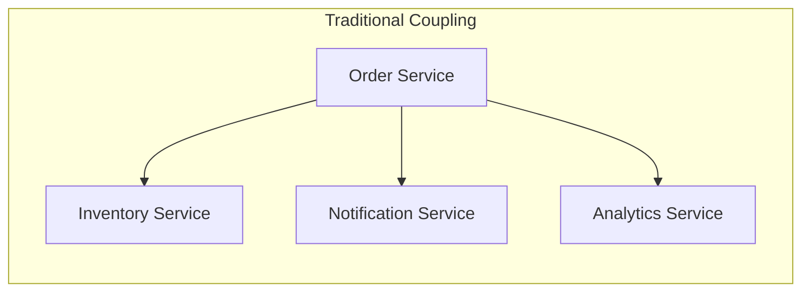

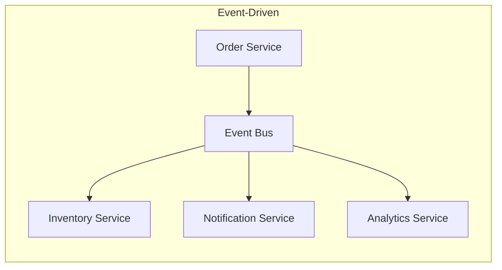

### Benefits of Event-Driven Architecture

- **Loose Coupling**: Publishers and subscribers know nothing about each other
- **Extensibility**: Add new listeners without modifying existing code
- **Testability**: Test components in isolation by mocking events
- **Resilience**: Failures in one listener do not affect others
- **Audit Trail**: Events provide a natural log of what happened

### Spring's Event System

Spring provides a robust event system through `ApplicationEventPublisher` and `@EventListener`:

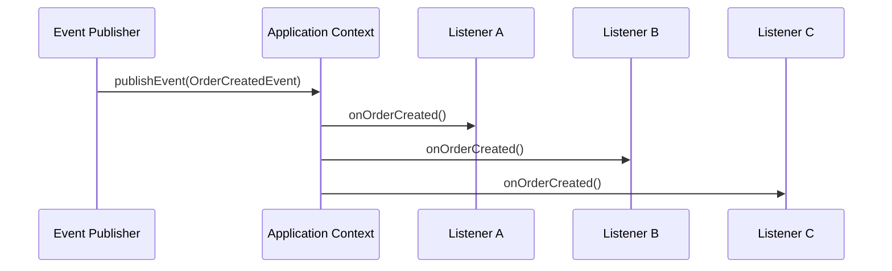

---

## Getting Started

### Dependencies

Spring Boot includes event support out of the box. For enhanced async processing and observability, add these dependencies:

```xml
<!-- pom.xml -->
<dependencies>
    <!-- Spring Boot Starter - includes event support -->
    <dependency>
        <groupId>org.springframework.boot</groupId>
        <artifactId>spring-boot-starter</artifactId>
    </dependency>
    
    <!-- Web starter for REST endpoints -->
    <dependency>
        <groupId>org.springframework.boot</groupId>
        <artifactId>spring-boot-starter-web</artifactId>
    </dependency>
    
    <!-- Data JPA for transactional events -->
    <dependency>
        <groupId>org.springframework.boot</groupId>
        <artifactId>spring-boot-starter-data-jpa</artifactId>
    </dependency>
    
    <!-- Actuator for monitoring -->
    <dependency>
        <groupId>org.springframework.boot</groupId>
        <artifactId>spring-boot-starter-actuator</artifactId>
    </dependency>
    
    <!-- Lombok for cleaner code -->
    <dependency>
        <groupId>org.projectlombok</groupId>
        <artifactId>lombok</artifactId>
        <optional>true</optional>
    </dependency>
    
    <!-- H2 for testing -->
    <dependency>
        <groupId>com.h2database</groupId>
        <artifactId>h2</artifactId>
        <scope>runtime</scope>
    </dependency>
</dependencies>
```

For Gradle:

```groovy
// build.gradle
dependencies {
    implementation 'org.springframework.boot:spring-boot-starter'
    implementation 'org.springframework.boot:spring-boot-starter-web'
    implementation 'org.springframework.boot:spring-boot-starter-data-jpa'
    implementation 'org.springframework.boot:spring-boot-starter-actuator'
    compileOnly 'org.projectlombok:lombok'
    annotationProcessor 'org.projectlombok:lombok'
    runtimeOnly 'com.h2database:h2'
}
```

---

## Creating Custom Events

### Basic Event Structure

Spring events can be any object. The simplest approach is creating a plain Java class:

```java
// event/OrderCreatedEvent.java
package com.example.event;

import lombok.Getter;
import lombok.ToString;
import java.time.Instant;
import java.util.UUID;

// Events should be immutable - use final fields and no setters
// Include all data listeners might need to avoid additional queries
@Getter
@ToString
public class OrderCreatedEvent {
    
    // Unique identifier for event tracing and deduplication
    private final String eventId;
    
    // When the event occurred
    private final Instant timestamp;
    
    // Business data
    private final Long orderId;
    private final String customerId;
    private final String customerEmail;
    private final Double totalAmount;
    private final String currency;

    public OrderCreatedEvent(Long orderId, String customerId, 
                             String customerEmail, Double totalAmount, String currency) {
        this.eventId = UUID.randomUUID().toString();
        this.timestamp = Instant.now();
        this.orderId = orderId;
        this.customerId = customerId;
        this.customerEmail = customerEmail;
        this.totalAmount = totalAmount;
        this.currency = currency;
    }
}
```

### Event with Inheritance

For events that share common properties, use a base class:

```java
// event/BaseEvent.java
package com.example.event;

import lombok.Getter;
import java.time.Instant;
import java.util.UUID;

// Base class for all domain events
// Provides common tracking fields for observability
@Getter
public abstract class BaseEvent {
    
    // Unique event identifier for tracing
    private final String eventId;
    
    // Timestamp when event was created
    private final Instant timestamp;
    
    // Optional: correlation ID for distributed tracing
    private final String correlationId;
    
    protected BaseEvent() {
        this.eventId = UUID.randomUUID().toString();
        this.timestamp = Instant.now();
        this.correlationId = null;
    }
    
    protected BaseEvent(String correlationId) {
        this.eventId = UUID.randomUUID().toString();
        this.timestamp = Instant.now();
        this.correlationId = correlationId;
    }
}
```

```java
// event/OrderEvent.java
package com.example.event;

import lombok.Getter;
import lombok.ToString;

// Base class for all order-related events
@Getter
@ToString(callSuper = true)
public abstract class OrderEvent extends BaseEvent {
    
    private final Long orderId;
    private final String customerId;
    
    protected OrderEvent(Long orderId, String customerId) {
        super();
        this.orderId = orderId;
        this.customerId = customerId;
    }
    
    protected OrderEvent(Long orderId, String customerId, String correlationId) {
        super(correlationId);
        this.orderId = orderId;
        this.customerId = customerId;
    }
}
```

```java
// event/OrderShippedEvent.java
package com.example.event;

import lombok.Getter;
import lombok.ToString;

@Getter
@ToString(callSuper = true)
public class OrderShippedEvent extends OrderEvent {
    
    private final String trackingNumber;
    private final String carrier;
    private final String estimatedDelivery;
    
    public OrderShippedEvent(Long orderId, String customerId, 
                             String trackingNumber, String carrier,
                             String estimatedDelivery) {
        super(orderId, customerId);
        this.trackingNumber = trackingNumber;
        this.carrier = carrier;
        this.estimatedDelivery = estimatedDelivery;
    }
}
```

### Event Lifecycle Diagram

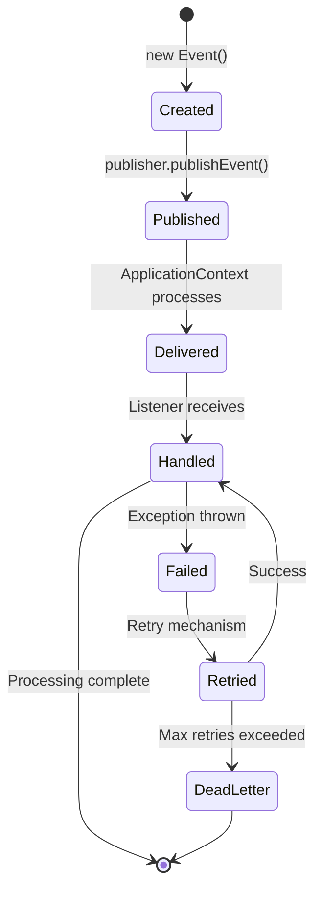

---

## Publishing Events

### Using ApplicationEventPublisher

The primary way to publish events in Spring:

```java
// service/OrderService.java
package com.example.service;

import com.example.event.OrderCreatedEvent;
import com.example.event.OrderShippedEvent;
import com.example.model.Order;
import com.example.repository.OrderRepository;
import lombok.RequiredArgsConstructor;
import lombok.extern.slf4j.Slf4j;
import org.springframework.context.ApplicationEventPublisher;
import org.springframework.stereotype.Service;
import org.springframework.transaction.annotation.Transactional;

@Slf4j
@Service
@RequiredArgsConstructor
public class OrderService {

    // Spring injects the event publisher automatically
    private final ApplicationEventPublisher eventPublisher;
    private final OrderRepository orderRepository;

    // Create a new order and publish an event
    @Transactional
    public Order createOrder(String customerId, String email, Double amount) {
        log.info("Creating order for customer: {}", customerId);
        
        // Save the order first
        Order order = new Order();
        order.setCustomerId(customerId);
        order.setCustomerEmail(email);
        order.setTotalAmount(amount);
        order.setStatus("PENDING");
        
        Order savedOrder = orderRepository.save(order);
        log.info("Order saved with ID: {}", savedOrder.getId());
        
        // Publish event after successful save
        // Event contains all data listeners need - no lazy loading issues
        OrderCreatedEvent event = new OrderCreatedEvent(
            savedOrder.getId(),
            customerId,
            email,
            amount,
            "USD"
        );
        
        eventPublisher.publishEvent(event);
        log.info("OrderCreatedEvent published: {}", event.getEventId());
        
        return savedOrder;
    }

    // Ship an order and publish an event
    @Transactional
    public void shipOrder(Long orderId, String trackingNumber, String carrier) {
        log.info("Shipping order: {}", orderId);
        
        Order order = orderRepository.findById(orderId)
            .orElseThrow(() -> new IllegalArgumentException("Order not found: " + orderId));
        
        order.setStatus("SHIPPED");
        order.setTrackingNumber(trackingNumber);
        orderRepository.save(order);
        
        // Publish shipping event
        OrderShippedEvent event = new OrderShippedEvent(
            orderId,
            order.getCustomerId(),
            trackingNumber,
            carrier,
            "3-5 business days"
        );
        
        eventPublisher.publishEvent(event);
        log.info("OrderShippedEvent published: {}", event.getEventId());
    }
}
```

### Using ApplicationEventPublisherAware

Alternative approach for classes that cannot use constructor injection:

```java
// service/LegacyOrderService.java
package com.example.service;

import com.example.event.OrderCreatedEvent;
import lombok.extern.slf4j.Slf4j;
import org.springframework.context.ApplicationEventPublisher;
import org.springframework.context.ApplicationEventPublisherAware;
import org.springframework.stereotype.Service;

@Slf4j
@Service
public class LegacyOrderService implements ApplicationEventPublisherAware {

    private ApplicationEventPublisher eventPublisher;

    // Spring calls this method to inject the publisher
    @Override
    public void setApplicationEventPublisher(ApplicationEventPublisher publisher) {
        this.eventPublisher = publisher;
    }

    public void processOrder(Long orderId) {
        log.info("Processing order: {}", orderId);
        // Business logic here...
        
        eventPublisher.publishEvent(new OrderCreatedEvent(
            orderId, "customer123", "customer@example.com", 99.99, "USD"
        ));
    }
}
```

---

## Listening to Events

### Basic Event Listener

Use `@EventListener` annotation to handle events:

```java
// listener/InventoryEventListener.java
package com.example.listener;

import com.example.event.OrderCreatedEvent;
import com.example.service.InventoryService;
import lombok.RequiredArgsConstructor;
import lombok.extern.slf4j.Slf4j;
import org.springframework.context.event.EventListener;
import org.springframework.stereotype.Component;

@Slf4j
@Component
@RequiredArgsConstructor
public class InventoryEventListener {

    private final InventoryService inventoryService;

    // This method is called whenever an OrderCreatedEvent is published
    // By default, it runs synchronously in the same thread as the publisher
    @EventListener
    public void handleOrderCreated(OrderCreatedEvent event) {
        log.info("Received OrderCreatedEvent: {}", event.getEventId());
        log.info("Processing inventory for order: {}", event.getOrderId());
        
        try {
            // Reserve inventory for the order
            inventoryService.reserveInventory(event.getOrderId());
            log.info("Inventory reserved successfully for order: {}", event.getOrderId());
        } catch (Exception e) {
            log.error("Failed to reserve inventory for order: {}", event.getOrderId(), e);
            // Handle the error - perhaps publish a compensation event
            throw e;
        }
    }
}
```

### Multiple Listeners

Multiple listeners can handle the same event independently:

```java
// listener/NotificationEventListener.java
package com.example.listener;

import com.example.event.OrderCreatedEvent;
import com.example.event.OrderShippedEvent;
import com.example.service.EmailService;
import com.example.service.SmsService;
import lombok.RequiredArgsConstructor;
import lombok.extern.slf4j.Slf4j;
import org.springframework.context.event.EventListener;
import org.springframework.stereotype.Component;

@Slf4j
@Component
@RequiredArgsConstructor
public class NotificationEventListener {

    private final EmailService emailService;
    private final SmsService smsService;

    // Handle order creation - send confirmation email
    @EventListener
    public void onOrderCreated(OrderCreatedEvent event) {
        log.info("Sending order confirmation for order: {}", event.getOrderId());
        
        emailService.sendOrderConfirmation(
            event.getCustomerEmail(),
            event.getOrderId(),
            event.getTotalAmount()
        );
    }

    // Handle order shipped - send tracking notification
    @EventListener
    public void onOrderShipped(OrderShippedEvent event) {
        log.info("Sending shipping notification for order: {}", event.getOrderId());
        
        emailService.sendShippingNotification(
            event.getOrderId(),
            event.getTrackingNumber(),
            event.getCarrier()
        );
    }
}
```

```java
// listener/AnalyticsEventListener.java
package com.example.listener;

import com.example.event.OrderCreatedEvent;
import com.example.service.AnalyticsService;
import lombok.RequiredArgsConstructor;
import lombok.extern.slf4j.Slf4j;
import org.springframework.context.event.EventListener;
import org.springframework.stereotype.Component;

@Slf4j
@Component
@RequiredArgsConstructor
public class AnalyticsEventListener {

    private final AnalyticsService analyticsService;

    // Track order metrics for analytics
    @EventListener
    public void trackOrderCreated(OrderCreatedEvent event) {
        log.info("Recording analytics for order: {}", event.getOrderId());
        
        analyticsService.recordOrderMetric(
            event.getOrderId(),
            event.getCustomerId(),
            event.getTotalAmount(),
            event.getTimestamp()
        );
    }
}
```

### Event Processing Flow

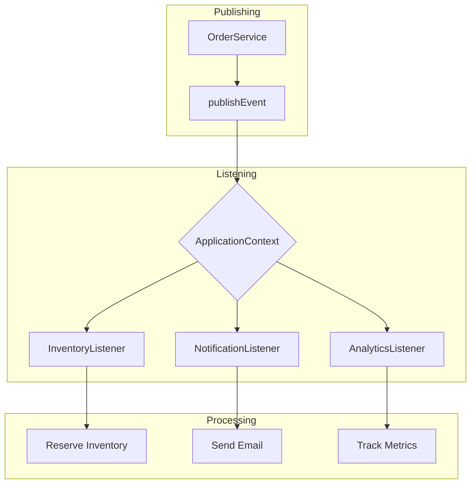

---

## Asynchronous Event Processing

### Enabling Async Support

By default, Spring event listeners run synchronously. Enable async processing for better performance:

```java
// config/AsyncConfig.java
package com.example.config;

import lombok.extern.slf4j.Slf4j;
import org.springframework.aop.interceptor.AsyncUncaughtExceptionHandler;
import org.springframework.context.annotation.Bean;
import org.springframework.context.annotation.Configuration;
import org.springframework.scheduling.annotation.AsyncConfigurer;
import org.springframework.scheduling.annotation.EnableAsync;
import org.springframework.scheduling.concurrent.ThreadPoolTaskExecutor;

import java.util.concurrent.Executor;

@Slf4j
@Configuration
@EnableAsync  // Enable async processing
public class AsyncConfig implements AsyncConfigurer {

    // Configure thread pool for async event processing
    @Bean(name = "eventExecutor")
    public Executor eventExecutor() {
        ThreadPoolTaskExecutor executor = new ThreadPoolTaskExecutor();
        
        // Core pool size - threads always kept alive
        executor.setCorePoolSize(5);
        
        // Max pool size - maximum threads when queue is full
        executor.setMaxPoolSize(20);
        
        // Queue capacity - tasks waiting when core threads are busy
        executor.setQueueCapacity(100);
        
        // Thread name prefix for easy identification in logs
        executor.setThreadNamePrefix("event-");
        
        // Wait for tasks to complete on shutdown
        executor.setWaitForTasksToCompleteOnShutdown(true);
        
        // How long to wait for tasks to complete on shutdown
        executor.setAwaitTerminationSeconds(30);
        
        executor.initialize();
        return executor;
    }

    @Override
    public Executor getAsyncExecutor() {
        return eventExecutor();
    }

    // Handle exceptions from async methods
    @Override
    public AsyncUncaughtExceptionHandler getAsyncUncaughtExceptionHandler() {
        return (throwable, method, params) -> {
            log.error("Async event processing failed in method: {}", method.getName(), throwable);
            // Could publish a failure event here for monitoring
        };
    }
}
```

### Async Event Listeners

Add `@Async` to process events in a separate thread:

```java
// listener/AsyncNotificationListener.java
package com.example.listener;

import com.example.event.OrderCreatedEvent;
import com.example.service.EmailService;
import com.example.service.PushNotificationService;
import lombok.RequiredArgsConstructor;
import lombok.extern.slf4j.Slf4j;
import org.springframework.context.event.EventListener;
import org.springframework.scheduling.annotation.Async;
import org.springframework.stereotype.Component;

@Slf4j
@Component
@RequiredArgsConstructor
public class AsyncNotificationListener {

    private final EmailService emailService;
    private final PushNotificationService pushService;

    // Async listener - runs in separate thread pool
    // Publisher does not wait for this to complete
    @Async("eventExecutor")
    @EventListener
    public void sendOrderConfirmationEmail(OrderCreatedEvent event) {
        log.info("Thread: {} - Sending confirmation email for order: {}", 
            Thread.currentThread().getName(), event.getOrderId());
        
        try {
            // Email sending can be slow - async prevents blocking the main flow
            emailService.sendOrderConfirmation(
                event.getCustomerEmail(),
                event.getOrderId(),
                event.getTotalAmount()
            );
            log.info("Email sent successfully for order: {}", event.getOrderId());
        } catch (Exception e) {
            log.error("Failed to send email for order: {}", event.getOrderId(), e);
            // Implement retry logic or send to dead letter queue
        }
    }

    // Another async listener for push notifications
    @Async("eventExecutor")
    @EventListener
    public void sendPushNotification(OrderCreatedEvent event) {
        log.info("Thread: {} - Sending push notification for order: {}",
            Thread.currentThread().getName(), event.getOrderId());
        
        pushService.sendOrderNotification(
            event.getCustomerId(),
            "Order #" + event.getOrderId() + " confirmed!"
        );
    }
}
```

### Sync vs Async Comparison

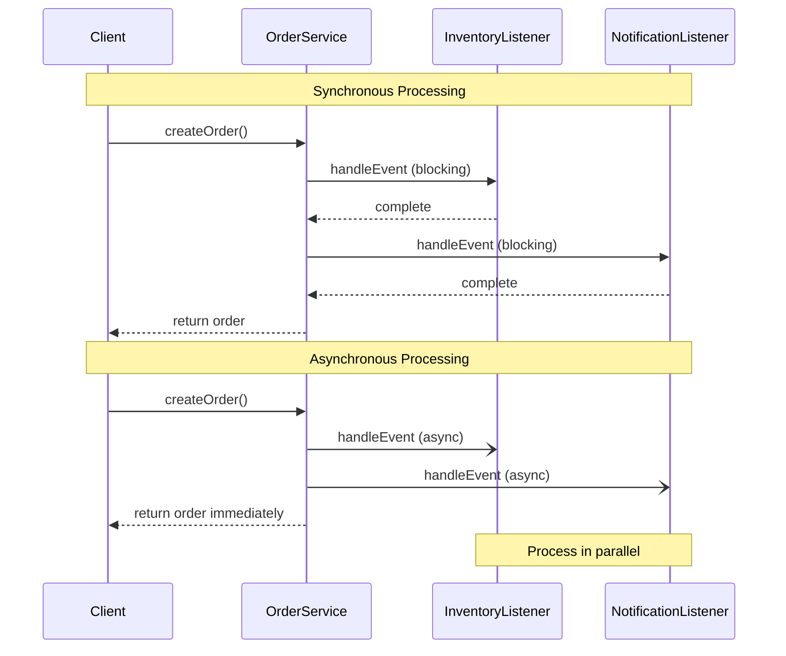

---

## Conditional Event Listeners

### Using SpEL Conditions

Control when listeners are invoked using Spring Expression Language:

```java
// listener/ConditionalEventListener.java
package com.example.listener;

import com.example.event.OrderCreatedEvent;
import com.example.service.FraudDetectionService;
import com.example.service.VipCustomerService;
import lombok.RequiredArgsConstructor;
import lombok.extern.slf4j.Slf4j;
import org.springframework.context.event.EventListener;
import org.springframework.scheduling.annotation.Async;
import org.springframework.stereotype.Component;

@Slf4j
@Component
@RequiredArgsConstructor
public class ConditionalEventListener {

    private final FraudDetectionService fraudService;
    private final VipCustomerService vipService;

    // Only process high-value orders (over $1000)
    // SpEL condition evaluated before listener is invoked
    @EventListener(condition = "#event.totalAmount > 1000")
    public void handleHighValueOrder(OrderCreatedEvent event) {
        log.info("High-value order detected: {} - Amount: ${}", 
            event.getOrderId(), event.getTotalAmount());
        
        // Trigger manual review for high-value orders
        fraudService.flagForReview(event.getOrderId(), "High value order");
    }

    // Only process orders in specific currency
    @EventListener(condition = "#event.currency == 'USD'")
    public void handleUsdOrder(OrderCreatedEvent event) {
        log.info("Processing USD order: {}", event.getOrderId());
        // Currency-specific processing
    }

    // Process orders from VIP customers
    // SpEL can call methods on the event object
    @Async
    @EventListener(condition = "#event.customerId.startsWith('VIP-')")
    public void handleVipOrder(OrderCreatedEvent event) {
        log.info("VIP order received from: {}", event.getCustomerId());
        vipService.addBonusPoints(event.getCustomerId(), event.getTotalAmount());
    }

    // Combine multiple conditions
    @EventListener(condition = "#event.totalAmount > 500 && #event.currency == 'USD'")
    public void handleSignificantUsdOrder(OrderCreatedEvent event) {
        log.info("Significant USD order: {} - ${}", 
            event.getOrderId(), event.getTotalAmount());
    }
}
```

### Condition Flow

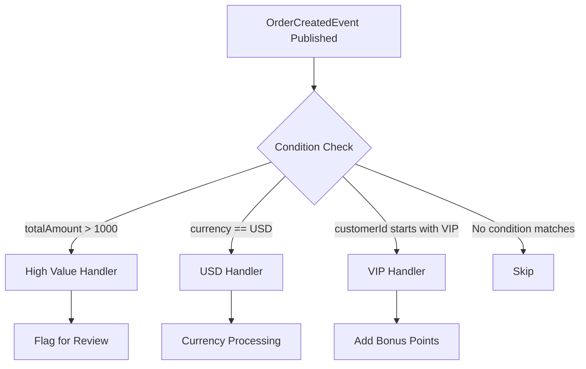

---

## Event Listener Ordering

### Controlling Execution Order

When multiple listeners handle the same event, control their order:

```java
// listener/OrderedEventListeners.java
package com.example.listener;

import com.example.event.OrderCreatedEvent;
import lombok.extern.slf4j.Slf4j;
import org.springframework.context.event.EventListener;
import org.springframework.core.annotation.Order;
import org.springframework.stereotype.Component;

@Slf4j
@Component
public class OrderedEventListeners {

    // Lowest value = highest priority (runs first)
    // Validation should run before other processing
    @Order(1)
    @EventListener
    public void validateOrder(OrderCreatedEvent event) {
        log.info("Step 1: Validating order: {}", event.getOrderId());
        
        // Perform validation
        if (event.getTotalAmount() <= 0) {
            throw new IllegalArgumentException("Invalid order amount");
        }
        
        log.info("Order validation passed: {}", event.getOrderId());
    }

    // Reserve inventory second
    @Order(2)
    @EventListener
    public void reserveInventory(OrderCreatedEvent event) {
        log.info("Step 2: Reserving inventory for order: {}", event.getOrderId());
        // Inventory logic
    }

    // Process payment third
    @Order(3)
    @EventListener
    public void processPayment(OrderCreatedEvent event) {
        log.info("Step 3: Processing payment for order: {}", event.getOrderId());
        // Payment logic
    }

    // Send notification last (lowest priority)
    @Order(100)
    @EventListener
    public void sendNotification(OrderCreatedEvent event) {
        log.info("Step 4: Sending notification for order: {}", event.getOrderId());
        // Notification logic
    }
}
```

### Order Execution Flow

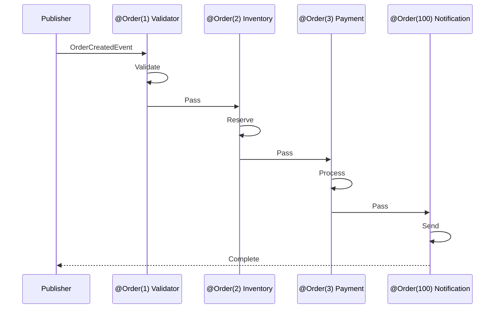

---

## Transactional Events

### Transaction-Bound Event Publishing

Spring allows binding events to transaction phases:

```java
// listener/TransactionalEventListener.java
package com.example.listener;

import com.example.event.OrderCreatedEvent;
import com.example.service.ExternalApiService;
import com.example.service.SearchIndexService;
import lombok.RequiredArgsConstructor;
import lombok.extern.slf4j.Slf4j;
import org.springframework.scheduling.annotation.Async;
import org.springframework.stereotype.Component;
import org.springframework.transaction.event.TransactionPhase;
import org.springframework.transaction.event.TransactionalEventListener;

@Slf4j
@Component
@RequiredArgsConstructor
public class TransactionalEventListener {

    private final ExternalApiService externalApi;
    private final SearchIndexService searchIndex;

    // Default: AFTER_COMMIT - only process if transaction commits successfully
    // This is the safest option for most use cases
    @TransactionalEventListener
    public void onOrderCreatedAfterCommit(OrderCreatedEvent event) {
        log.info("Transaction committed - processing order: {}", event.getOrderId());
        
        // Safe to call external services - we know the order is persisted
        externalApi.notifyOrderCreated(event.getOrderId());
    }

    // BEFORE_COMMIT - process before transaction commits
    // Use with caution - transaction can still rollback
    @TransactionalEventListener(phase = TransactionPhase.BEFORE_COMMIT)
    public void onOrderCreatedBeforeCommit(OrderCreatedEvent event) {
        log.info("Before commit - validating order: {}", event.getOrderId());
        // Last chance validation that could trigger rollback
    }

    // AFTER_ROLLBACK - only process if transaction rolls back
    // Useful for cleanup or alerting
    @TransactionalEventListener(phase = TransactionPhase.AFTER_ROLLBACK)
    public void onOrderCreatedRollback(OrderCreatedEvent event) {
        log.warn("Transaction rolled back for order: {}", event.getOrderId());
        // Alert monitoring system
        // Clean up any partial state
    }

    // AFTER_COMPLETION - process regardless of outcome
    @TransactionalEventListener(phase = TransactionPhase.AFTER_COMPLETION)
    public void onOrderCreatedCompletion(OrderCreatedEvent event) {
        log.info("Transaction completed (success or failure) for order: {}", 
            event.getOrderId());
        // Metrics, logging, cleanup that should happen either way
    }

    // Combine with @Async for non-blocking post-commit processing
    @Async
    @TransactionalEventListener
    public void updateSearchIndexAsync(OrderCreatedEvent event) {
        log.info("Updating search index for order: {}", event.getOrderId());
        searchIndex.indexOrder(event.getOrderId());
    }

    // Handle case when no transaction exists
    // fallbackExecution = true means run even without a transaction
    @TransactionalEventListener(fallbackExecution = true)
    public void alwaysProcess(OrderCreatedEvent event) {
        log.info("Processing order (with or without transaction): {}", event.getOrderId());
    }
}
```

### Transaction Phase Diagram

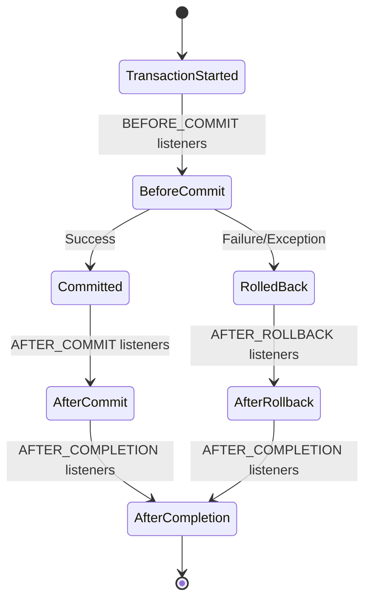

---

## Event Chaining

### Publishing Events from Listeners

Listeners can publish new events, creating event chains:

```java
// event/InventoryReservedEvent.java
package com.example.event;

import lombok.Getter;
import lombok.ToString;

@Getter
@ToString(callSuper = true)
public class InventoryReservedEvent extends OrderEvent {
    
    private final int itemsReserved;
    private final String warehouseId;
    
    public InventoryReservedEvent(Long orderId, String customerId,
                                  int itemsReserved, String warehouseId) {
        super(orderId, customerId);
        this.itemsReserved = itemsReserved;
        this.warehouseId = warehouseId;
    }
}
```

```java
// listener/ChainedEventListener.java
package com.example.listener;

import com.example.event.InventoryReservedEvent;
import com.example.event.OrderCreatedEvent;
import lombok.RequiredArgsConstructor;
import lombok.extern.slf4j.Slf4j;
import org.springframework.context.ApplicationEventPublisher;
import org.springframework.context.event.EventListener;
import org.springframework.core.annotation.Order;
import org.springframework.stereotype.Component;

@Slf4j
@Component
@RequiredArgsConstructor
public class ChainedEventListener {

    private final ApplicationEventPublisher eventPublisher;

    // Handle order creation and publish inventory event
    @Order(1)
    @EventListener
    public void handleOrderAndReserveInventory(OrderCreatedEvent event) {
        log.info("Reserving inventory for order: {}", event.getOrderId());
        
        // Simulate inventory reservation
        int itemsReserved = 5;
        String warehouseId = "WAREHOUSE-01";
        
        // Publish a new event for downstream processing
        InventoryReservedEvent inventoryEvent = new InventoryReservedEvent(
            event.getOrderId(),
            event.getCustomerId(),
            itemsReserved,
            warehouseId
        );
        
        eventPublisher.publishEvent(inventoryEvent);
        log.info("InventoryReservedEvent published for order: {}", event.getOrderId());
    }

    // Listen for inventory reserved event
    @EventListener
    public void handleInventoryReserved(InventoryReservedEvent event) {
        log.info("Inventory reserved: {} items from {} for order: {}",
            event.getItemsReserved(),
            event.getWarehouseId(),
            event.getOrderId());
        
        // Further processing...
    }
}
```

### Event Chain Visualization

```mermaid
flowchart LR
    A[Order Created] --> B[OrderCreatedEvent]
    B --> C[Inventory Listener]
    C --> D[Reserve Items]
    D --> E[InventoryReservedEvent]
    E --> F[Shipping Listener]
    F --> G[Create Shipment]
    G --> H[ShipmentCreatedEvent]
    H --> I[Notification Listener]
    I --> J[Send Email]
```

---

## Generic Event Listeners

### Handling Multiple Event Types

Create listeners that handle multiple event types:

```java
// listener/GenericEventListener.java
package com.example.listener;

import com.example.event.BaseEvent;
import com.example.event.OrderCreatedEvent;
import com.example.event.OrderEvent;
import com.example.event.OrderShippedEvent;
import lombok.extern.slf4j.Slf4j;
import org.springframework.context.event.EventListener;
import org.springframework.stereotype.Component;

@Slf4j
@Component
public class GenericEventListener {

    // Handle all events that extend BaseEvent
    // Useful for logging, metrics, or audit trails
    @EventListener
    public void handleAllBaseEvents(BaseEvent event) {
        log.info("Event received - ID: {}, Type: {}, Timestamp: {}",
            event.getEventId(),
            event.getClass().getSimpleName(),
            event.getTimestamp());
    }

    // Handle all order-related events
    @EventListener
    public void handleAllOrderEvents(OrderEvent event) {
        log.info("Order event for order: {} customer: {}",
            event.getOrderId(),
            event.getCustomerId());
        
        // Could update order audit log here
    }

    // Handle specific event types with instanceof checks
    @EventListener(classes = {OrderCreatedEvent.class, OrderShippedEvent.class})
    public void handleOrderLifecycle(Object event) {
        if (event instanceof OrderCreatedEvent created) {
            log.info("Order {} created - amount: ${}", 
                created.getOrderId(), created.getTotalAmount());
        } else if (event instanceof OrderShippedEvent shipped) {
            log.info("Order {} shipped - tracking: {}", 
                shipped.getOrderId(), shipped.getTrackingNumber());
        }
    }
}
```

### Event Hierarchy Processing

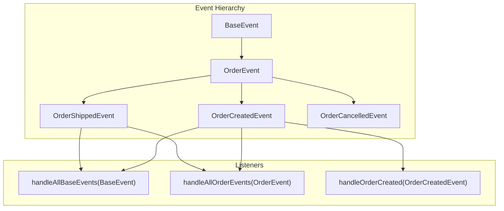

---

## Error Handling

### Listener Exception Handling

Handle errors gracefully in event listeners:

```java
// listener/ResilientEventListener.java
package com.example.listener;

import com.example.event.OrderCreatedEvent;
import com.example.service.NotificationService;
import lombok.RequiredArgsConstructor;
import lombok.extern.slf4j.Slf4j;
import org.springframework.context.event.EventListener;
import org.springframework.retry.annotation.Backoff;
import org.springframework.retry.annotation.Retryable;
import org.springframework.scheduling.annotation.Async;
import org.springframework.stereotype.Component;

@Slf4j
@Component
@RequiredArgsConstructor
public class ResilientEventListener {

    private final NotificationService notificationService;

    // Use try-catch for graceful error handling
    @EventListener
    public void handleWithErrorHandling(OrderCreatedEvent event) {
        log.info("Processing order: {}", event.getOrderId());
        
        try {
            // Risky operation that might fail
            notificationService.sendNotification(event.getCustomerEmail());
            log.info("Notification sent for order: {}", event.getOrderId());
        } catch (Exception e) {
            // Log error but do not rethrow - other listeners can still process
            log.error("Failed to send notification for order: {} - Error: {}", 
                event.getOrderId(), e.getMessage());
            
            // Could publish a failure event for monitoring or retry
            // eventPublisher.publishEvent(new NotificationFailedEvent(event, e));
        }
    }

    // Use Spring Retry for automatic retries with exponential backoff
    @Async
    @Retryable(
        value = {RuntimeException.class},
        maxAttempts = 3,
        backoff = @Backoff(delay = 1000, multiplier = 2)
    )
    @EventListener
    public void handleWithRetry(OrderCreatedEvent event) {
        log.info("Attempting to process order: {}", event.getOrderId());
        
        // This will be retried up to 3 times with 1s, 2s, 4s delays
        if (Math.random() > 0.7) {
            throw new RuntimeException("Random failure for demonstration");
        }
        
        log.info("Successfully processed order: {}", event.getOrderId());
    }
}
```

### Global Error Handler

Create a centralized error handler for async events:

```java
// config/EventErrorHandler.java
package com.example.config;

import lombok.extern.slf4j.Slf4j;
import org.springframework.aop.interceptor.AsyncUncaughtExceptionHandler;
import org.springframework.stereotype.Component;

import java.lang.reflect.Method;
import java.util.Arrays;

@Slf4j
@Component
public class EventErrorHandler implements AsyncUncaughtExceptionHandler {

    @Override
    public void handleUncaughtException(Throwable ex, Method method, Object... params) {
        log.error("Async event processing failed - Method: {}, Params: {}, Error: {}",
            method.getName(),
            Arrays.toString(params),
            ex.getMessage(),
            ex);
        
        // Send alert to monitoring system
        // metricsService.incrementCounter("event.processing.errors");
        
        // Could save to dead letter table for manual review
        // deadLetterService.save(method.getName(), params, ex);
    }
}
```

---

## Testing Event-Driven Components

### Testing Event Publishing

```java
// test/OrderServiceTest.java
package com.example.service;

import com.example.event.OrderCreatedEvent;
import com.example.model.Order;
import com.example.repository.OrderRepository;
import org.junit.jupiter.api.Test;
import org.junit.jupiter.api.extension.ExtendWith;
import org.mockito.ArgumentCaptor;
import org.mockito.Captor;
import org.mockito.InjectMocks;
import org.mockito.Mock;
import org.mockito.junit.jupiter.MockitoExtension;
import org.springframework.context.ApplicationEventPublisher;

import static org.assertj.core.api.Assertions.assertThat;
import static org.mockito.ArgumentMatchers.any;
import static org.mockito.Mockito.*;

@ExtendWith(MockitoExtension.class)
class OrderServiceTest {

    @Mock
    private ApplicationEventPublisher eventPublisher;
    
    @Mock
    private OrderRepository orderRepository;
    
    @InjectMocks
    private OrderService orderService;
    
    @Captor
    private ArgumentCaptor<OrderCreatedEvent> eventCaptor;

    @Test
    void createOrder_shouldPublishEvent() {
        // Arrange
        Order savedOrder = new Order();
        savedOrder.setId(1L);
        savedOrder.setCustomerId("customer123");
        savedOrder.setCustomerEmail("test@example.com");
        savedOrder.setTotalAmount(99.99);
        
        when(orderRepository.save(any(Order.class))).thenReturn(savedOrder);
        
        // Act
        Order result = orderService.createOrder("customer123", "test@example.com", 99.99);
        
        // Assert
        verify(eventPublisher).publishEvent(eventCaptor.capture());
        
        OrderCreatedEvent capturedEvent = eventCaptor.getValue();
        assertThat(capturedEvent.getOrderId()).isEqualTo(1L);
        assertThat(capturedEvent.getCustomerId()).isEqualTo("customer123");
        assertThat(capturedEvent.getTotalAmount()).isEqualTo(99.99);
        assertThat(capturedEvent.getEventId()).isNotNull();
    }

    @Test
    void createOrder_shouldNotPublishEvent_whenSaveFails() {
        // Arrange
        when(orderRepository.save(any(Order.class)))
            .thenThrow(new RuntimeException("Database error"));
        
        // Act & Assert
        try {
            orderService.createOrder("customer123", "test@example.com", 99.99);
        } catch (RuntimeException e) {
            // Expected
        }
        
        // Verify no event was published
        verify(eventPublisher, never()).publishEvent(any());
    }
}
```

### Testing Event Listeners

```java
// test/InventoryEventListenerTest.java
package com.example.listener;

import com.example.event.OrderCreatedEvent;
import com.example.service.InventoryService;
import org.junit.jupiter.api.Test;
import org.junit.jupiter.api.extension.ExtendWith;
import org.mockito.InjectMocks;
import org.mockito.Mock;
import org.mockito.junit.jupiter.MockitoExtension;

import static org.mockito.Mockito.*;

@ExtendWith(MockitoExtension.class)
class InventoryEventListenerTest {

    @Mock
    private InventoryService inventoryService;
    
    @InjectMocks
    private InventoryEventListener listener;

    @Test
    void handleOrderCreated_shouldReserveInventory() {
        // Arrange
        OrderCreatedEvent event = new OrderCreatedEvent(
            1L, "customer123", "test@example.com", 99.99, "USD"
        );
        
        // Act
        listener.handleOrderCreated(event);
        
        // Assert
        verify(inventoryService).reserveInventory(1L);
    }

    @Test
    void handleOrderCreated_shouldHandleServiceFailure() {
        // Arrange
        OrderCreatedEvent event = new OrderCreatedEvent(
            1L, "customer123", "test@example.com", 99.99, "USD"
        );
        
        doThrow(new RuntimeException("Inventory service unavailable"))
            .when(inventoryService).reserveInventory(anyLong());
        
        // Act & Assert
        try {
            listener.handleOrderCreated(event);
        } catch (RuntimeException e) {
            // Expected - verify the exception propagates
        }
        
        verify(inventoryService).reserveInventory(1L);
    }
}
```

### Integration Testing with ApplicationEventPublisher

```java
// test/OrderEventIntegrationTest.java
package com.example;

import com.example.event.OrderCreatedEvent;
import com.example.listener.InventoryEventListener;
import com.example.service.OrderService;
import org.junit.jupiter.api.Test;
import org.springframework.beans.factory.annotation.Autowired;
import org.springframework.boot.test.context.SpringBootTest;
import org.springframework.boot.test.mock.mockito.SpyBean;
import org.springframework.test.context.ActiveProfiles;

import static org.mockito.ArgumentMatchers.any;
import static org.mockito.Mockito.timeout;
import static org.mockito.Mockito.verify;

@SpringBootTest
@ActiveProfiles("test")
class OrderEventIntegrationTest {

    @Autowired
    private OrderService orderService;
    
    @SpyBean
    private InventoryEventListener inventoryListener;

    @Test
    void createOrder_shouldTriggerEventListener() {
        // Act
        orderService.createOrder("customer123", "test@example.com", 99.99);
        
        // Assert - verify listener was called
        // Use timeout for async listeners
        verify(inventoryListener, timeout(5000))
            .handleOrderCreated(any(OrderCreatedEvent.class));
    }
}
```

---

## Best Practices

### Event Design Principles

1. **Events should be immutable** - Use final fields and do not provide setters
2. **Include all necessary data** - Listeners should not need to query for more information
3. **Use meaningful names** - `OrderCreatedEvent` not `OrderEvent` or `Event1`
4. **Add metadata** - Include event ID, timestamp, and correlation ID for tracing
5. **Keep events focused** - One event per business action

### Event Publishing Guidelines

```java
// GOOD: Event contains all necessary data
OrderCreatedEvent event = new OrderCreatedEvent(
    order.getId(),
    order.getCustomerId(),
    order.getEmail(),
    order.getTotalAmount(),
    order.getCurrency()
);

// BAD: Event only contains ID - listeners must query for data
OrderCreatedEvent event = new OrderCreatedEvent(order.getId());
```

### Listener Design Guidelines

```java
// GOOD: Focused listener with single responsibility
@EventListener
public void sendOrderConfirmation(OrderCreatedEvent event) {
    emailService.sendConfirmation(event.getCustomerEmail(), event.getOrderId());
}

// BAD: Listener doing too many things
@EventListener
public void handleOrder(OrderCreatedEvent event) {
    inventoryService.reserve(event);
    emailService.send(event);
    analyticsService.track(event);
    paymentService.process(event);
}
```

### Architecture Decision Flow

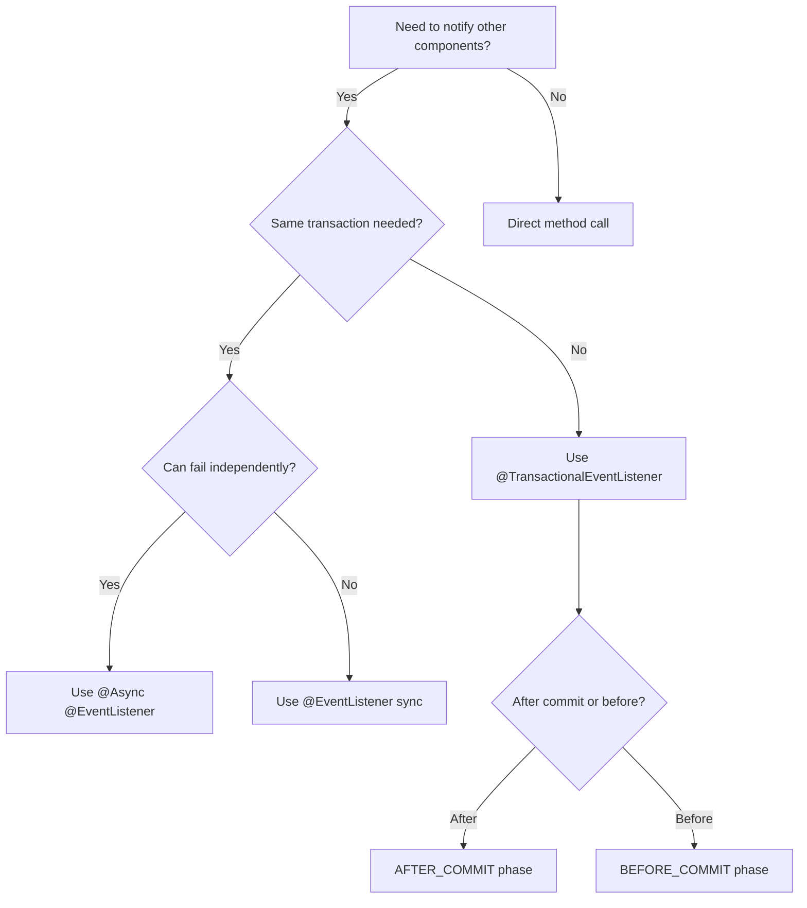

---

## Complete Example Application

### Application Structure

```
src/main/java/com/example/
    config/
        AsyncConfig.java
    event/
        BaseEvent.java
        OrderCreatedEvent.java
        OrderShippedEvent.java
        InventoryReservedEvent.java
    listener/
        InventoryEventListener.java
        NotificationEventListener.java
        AnalyticsEventListener.java
    service/
        OrderService.java
        InventoryService.java
        EmailService.java
    controller/
        OrderController.java
    Application.java
```

### Main Application

```java
// Application.java
package com.example;

import org.springframework.boot.SpringApplication;
import org.springframework.boot.autoconfigure.SpringBootApplication;
import org.springframework.scheduling.annotation.EnableAsync;

@SpringBootApplication
@EnableAsync
public class Application {
    public static void main(String[] args) {
        SpringApplication.run(Application.class, args);
    }
}
```

---

## Summary

Spring's event system provides a powerful way to build loosely coupled, maintainable applications:

- **Custom Events** - Create immutable event classes with all necessary data
- **Event Publishing** - Use `ApplicationEventPublisher` to broadcast events
- **Event Listeners** - Handle events with `@EventListener` annotation
- **Async Processing** - Add `@Async` for non-blocking event handling
- **Conditional Listeners** - Use SpEL to filter which events to process
- **Transactional Events** - Bind event processing to transaction phases
- **Event Chaining** - Publish events from listeners for complex workflows

Event-driven architecture shines when you need to decouple components, enable extensibility, or allow independent scaling of different parts of your system.

---

*Need to monitor your event-driven applications in production? [OneUptime](https://oneuptime.com) provides comprehensive observability for Spring Boot applications, including event processing metrics, distributed tracing across event chains, and alerting when event processing fails.*
