# How to Use Flyway for Database Migrations in Spring Boot

Author: [nawazdhandala](https://www.github.com/nawazdhandala)

Tags: Java, Spring Boot, Flyway, Database, Migrations, SQL, PostgreSQL

Description: A comprehensive guide to managing database migrations with Flyway in Spring Boot applications. Learn versioned migrations, repeatable scripts, and rollback strategies.

---

> Managing database schema changes is one of the most critical aspects of application development. Flyway provides a robust, version-controlled approach to database migrations that integrates seamlessly with Spring Boot. This guide covers everything from basic setup to advanced migration strategies, helping you maintain consistent database schemas across all environments.

Database migrations solve a fundamental problem: how do you evolve your database schema alongside your application code? Without a proper migration strategy, teams often face inconsistent schemas between development, staging, and production environments. Flyway tracks which migrations have been applied, ensures they run in the correct order, and prevents accidental re-execution.

---

## Understanding Database Migrations

Before diving into Flyway, let's understand why database migrations are essential:

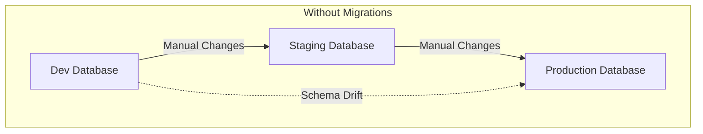

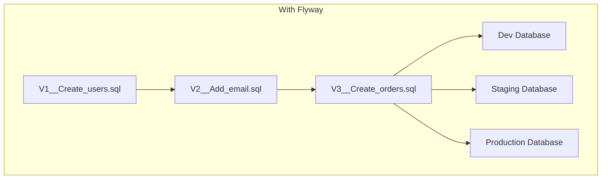

With migrations, every schema change is versioned and tracked. The same migrations run in every environment, ensuring consistency.

### Flyway Migration Lifecycle

Understanding how Flyway processes migrations is crucial for effective usage:

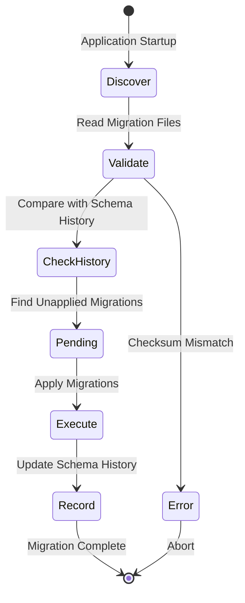

Key phases:
- **Discover**: Flyway scans configured locations for migration files
- **Validate**: Compares found migrations against the schema history table
- **Execute**: Applies pending migrations in version order
- **Record**: Updates the schema history table with applied migrations

### Migration Types

Flyway supports three types of migrations:

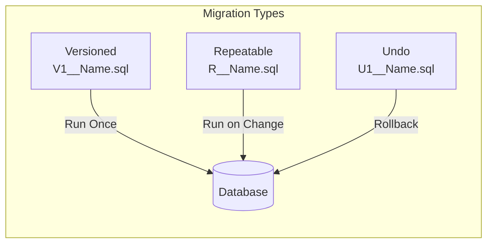

- **Versioned (V)**: Run exactly once, in version order
- **Repeatable (R)**: Run whenever their checksum changes
- **Undo (U)**: Rollback versioned migrations (Flyway Teams feature)

---

## Getting Started

### Dependencies

Add Flyway to your Spring Boot project:

Maven configuration for adding Flyway dependencies:

```xml
<!-- pom.xml -->
<dependencies>
    <!-- Spring Boot Starter JDBC or JPA -->
    <dependency>
        <groupId>org.springframework.boot</groupId>
        <artifactId>spring-boot-starter-data-jpa</artifactId>
    </dependency>
    
    <!-- Flyway Core -->
    <dependency>
        <groupId>org.flywaydb</groupId>
        <artifactId>flyway-core</artifactId>
    </dependency>
    
    <!-- Flyway Database Support - PostgreSQL -->
    <dependency>
        <groupId>org.flywaydb</groupId>
        <artifactId>flyway-database-postgresql</artifactId>
    </dependency>
    
    <!-- PostgreSQL Driver -->
    <dependency>
        <groupId>org.postgresql</groupId>
        <artifactId>postgresql</artifactId>
        <scope>runtime</scope>
    </dependency>
</dependencies>
```

For Gradle, add these dependencies to your build file:

```groovy
// build.gradle
dependencies {
    implementation 'org.springframework.boot:spring-boot-starter-data-jpa'
    implementation 'org.flywaydb:flyway-core'
    implementation 'org.flywaydb:flyway-database-postgresql'
    runtimeOnly 'org.postgresql:postgresql'
}
```

### Basic Configuration

Configure Flyway in your application properties:

```yaml
# application.yml
spring:
  datasource:
    url: jdbc:postgresql://localhost:5432/myapp
    username: ${DB_USERNAME:postgres}
    password: ${DB_PASSWORD:postgres}
    driver-class-name: org.postgresql.Driver
  
  flyway:
    # Enable Flyway migrations
    enabled: true
    
    # Location of migration scripts
    locations: classpath:db/migration
    
    # Schema history table name
    table: flyway_schema_history
    
    # Baseline on migrate for existing databases
    baseline-on-migrate: false
    
    # Validate migrations on startup
    validate-on-migrate: true
```

Alternative configuration using application.properties format:

```properties
# application.properties
spring.datasource.url=jdbc:postgresql://localhost:5432/myapp
spring.datasource.username=${DB_USERNAME:postgres}
spring.datasource.password=${DB_PASSWORD:postgres}

spring.flyway.enabled=true
spring.flyway.locations=classpath:db/migration
spring.flyway.table=flyway_schema_history
spring.flyway.baseline-on-migrate=false
spring.flyway.validate-on-migrate=true
```

---

## Writing Migration Scripts

### Naming Convention

Flyway uses a specific naming convention for migration files:

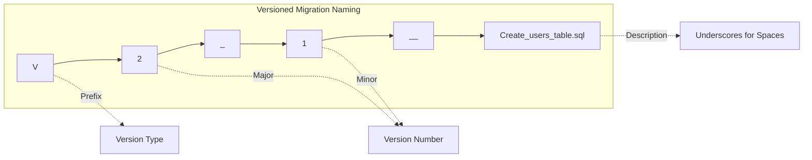

Naming pattern breakdown:
- **Prefix**: V for versioned, R for repeatable, U for undo
- **Version**: Numeric version (dots or underscores as separators)
- **Separator**: Double underscore (__)
- **Description**: Human-readable description (underscores become spaces)
- **Suffix**: .sql for SQL migrations

### Creating Your First Migration

Create the migration directory at `src/main/resources/db/migration/`:

This first migration creates the basic users table:

```sql
-- V1__Create_users_table.sql
-- Creates the initial users table with essential fields

CREATE TABLE users (
    id BIGSERIAL PRIMARY KEY,
    username VARCHAR(50) NOT NULL UNIQUE,
    email VARCHAR(255) NOT NULL UNIQUE,
    password_hash VARCHAR(255) NOT NULL,
    first_name VARCHAR(100),
    last_name VARCHAR(100),
    active BOOLEAN NOT NULL DEFAULT true,
    created_at TIMESTAMP WITH TIME ZONE NOT NULL DEFAULT CURRENT_TIMESTAMP,
    updated_at TIMESTAMP WITH TIME ZONE NOT NULL DEFAULT CURRENT_TIMESTAMP
);

-- Create index on email for faster lookups
CREATE INDEX idx_users_email ON users(email);

-- Create index on username for faster lookups
CREATE INDEX idx_users_username ON users(username);

-- Add comment to table
COMMENT ON TABLE users IS 'Stores user account information';
```

### Adding More Migrations

As your application evolves, add new migrations:

This migration adds role-based access control tables:

```sql
-- V2__Create_roles_table.sql
-- Creates roles and user_roles tables for RBAC

CREATE TABLE roles (
    id SERIAL PRIMARY KEY,
    name VARCHAR(50) NOT NULL UNIQUE,
    description VARCHAR(255),
    created_at TIMESTAMP WITH TIME ZONE NOT NULL DEFAULT CURRENT_TIMESTAMP
);

-- Junction table for many-to-many relationship
CREATE TABLE user_roles (
    user_id BIGINT NOT NULL REFERENCES users(id) ON DELETE CASCADE,
    role_id INT NOT NULL REFERENCES roles(id) ON DELETE CASCADE,
    assigned_at TIMESTAMP WITH TIME ZONE NOT NULL DEFAULT CURRENT_TIMESTAMP,
    PRIMARY KEY (user_id, role_id)
);

-- Insert default roles
INSERT INTO roles (name, description) VALUES
    ('ADMIN', 'Full system administrator access'),
    ('USER', 'Standard user access'),
    ('MODERATOR', 'Content moderation access');

-- Create index for faster role lookups
CREATE INDEX idx_user_roles_role_id ON user_roles(role_id);
```

This migration adds an orders table with foreign key relationships:

```sql
-- V3__Create_orders_table.sql
-- Creates orders table for e-commerce functionality

CREATE TABLE orders (
    id BIGSERIAL PRIMARY KEY,
    user_id BIGINT NOT NULL REFERENCES users(id),
    order_number VARCHAR(50) NOT NULL UNIQUE,
    status VARCHAR(20) NOT NULL DEFAULT 'PENDING',
    total_amount DECIMAL(12, 2) NOT NULL,
    currency VARCHAR(3) NOT NULL DEFAULT 'USD',
    shipping_address_id BIGINT,
    billing_address_id BIGINT,
    notes TEXT,
    created_at TIMESTAMP WITH TIME ZONE NOT NULL DEFAULT CURRENT_TIMESTAMP,
    updated_at TIMESTAMP WITH TIME ZONE NOT NULL DEFAULT CURRENT_TIMESTAMP,
    
    CONSTRAINT chk_order_status CHECK (
        status IN ('PENDING', 'CONFIRMED', 'PROCESSING', 'SHIPPED', 'DELIVERED', 'CANCELLED')
    ),
    CONSTRAINT chk_total_amount CHECK (total_amount >= 0)
);

-- Index for user order history
CREATE INDEX idx_orders_user_id ON orders(user_id);

-- Index for order status queries
CREATE INDEX idx_orders_status ON orders(status);

-- Index for order number lookups
CREATE INDEX idx_orders_order_number ON orders(order_number);

-- Partial index for active orders
CREATE INDEX idx_orders_pending ON orders(user_id, created_at) 
    WHERE status IN ('PENDING', 'CONFIRMED', 'PROCESSING');
```

This migration adds the order items table:

```sql
-- V4__Create_order_items_table.sql
-- Creates order items for line-item details

CREATE TABLE order_items (
    id BIGSERIAL PRIMARY KEY,
    order_id BIGINT NOT NULL REFERENCES orders(id) ON DELETE CASCADE,
    product_id BIGINT NOT NULL,
    product_name VARCHAR(255) NOT NULL,
    quantity INT NOT NULL,
    unit_price DECIMAL(10, 2) NOT NULL,
    total_price DECIMAL(12, 2) NOT NULL,
    created_at TIMESTAMP WITH TIME ZONE NOT NULL DEFAULT CURRENT_TIMESTAMP,
    
    CONSTRAINT chk_quantity CHECK (quantity > 0),
    CONSTRAINT chk_unit_price CHECK (unit_price >= 0),
    CONSTRAINT chk_total_price CHECK (total_price >= 0)
);

-- Index for order item lookups
CREATE INDEX idx_order_items_order_id ON order_items(order_id);

-- Index for product-based queries
CREATE INDEX idx_order_items_product_id ON order_items(product_id);
```

---

## Repeatable Migrations

Repeatable migrations run whenever their content changes. They are ideal for views, stored procedures, and reference data:

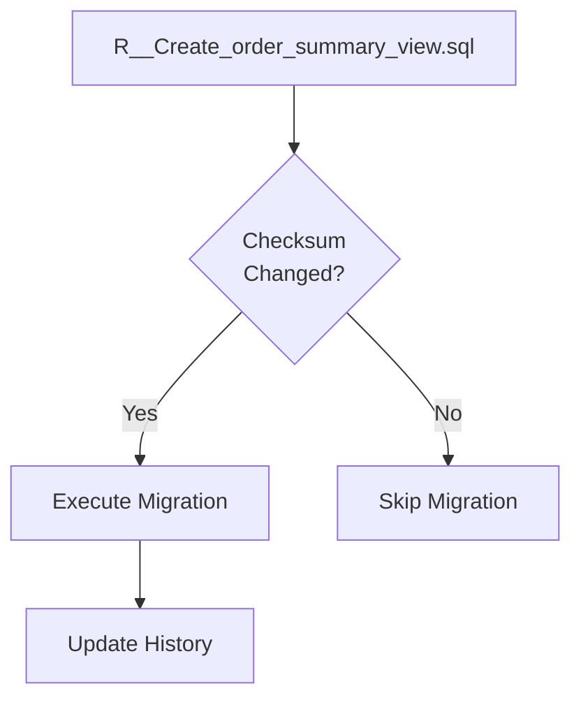

### Creating Views with Repeatable Migrations

This repeatable migration creates a view for order summaries:

```sql
-- R__Create_order_summary_view.sql
-- Creates a view for order summaries - runs on every checksum change

DROP VIEW IF EXISTS v_order_summary;

CREATE VIEW v_order_summary AS
SELECT 
    o.id as order_id,
    o.order_number,
    o.status,
    o.total_amount,
    o.currency,
    o.created_at as order_date,
    u.id as user_id,
    u.username,
    u.email,
    u.first_name || ' ' || u.last_name as customer_name,
    COUNT(oi.id) as item_count,
    SUM(oi.quantity) as total_quantity
FROM orders o
JOIN users u ON o.user_id = u.id
LEFT JOIN order_items oi ON o.id = oi.order_id
GROUP BY o.id, o.order_number, o.status, o.total_amount, 
         o.currency, o.created_at, u.id, u.username, 
         u.email, u.first_name, u.last_name;

-- Add comment to view
COMMENT ON VIEW v_order_summary IS 'Aggregated order information with customer details';
```

### Stored Procedures with Repeatable Migrations

This repeatable migration creates a stored procedure for calculating order totals:

```sql
-- R__Create_calculate_order_total.sql
-- Creates a function to calculate order totals

DROP FUNCTION IF EXISTS calculate_order_total(BIGINT);

CREATE OR REPLACE FUNCTION calculate_order_total(p_order_id BIGINT)
RETURNS DECIMAL(12, 2) AS $$
DECLARE
    v_total DECIMAL(12, 2);
BEGIN
    SELECT COALESCE(SUM(total_price), 0)
    INTO v_total
    FROM order_items
    WHERE order_id = p_order_id;
    
    RETURN v_total;
END;
$$ LANGUAGE plpgsql;

-- Create a function to update order total
CREATE OR REPLACE FUNCTION update_order_total()
RETURNS TRIGGER AS $$
BEGIN
    UPDATE orders
    SET total_amount = calculate_order_total(
        CASE WHEN TG_OP = 'DELETE' THEN OLD.order_id ELSE NEW.order_id END
    ),
    updated_at = CURRENT_TIMESTAMP
    WHERE id = CASE WHEN TG_OP = 'DELETE' THEN OLD.order_id ELSE NEW.order_id END;
    
    RETURN NULL;
END;
$$ LANGUAGE plpgsql;

-- Create trigger to automatically update order totals
DROP TRIGGER IF EXISTS trg_update_order_total ON order_items;
CREATE TRIGGER trg_update_order_total
    AFTER INSERT OR UPDATE OR DELETE ON order_items
    FOR EACH ROW
    EXECUTE FUNCTION update_order_total();
```

### Reference Data with Repeatable Migrations

This repeatable migration manages reference data:

```sql
-- R__Populate_reference_data.sql
-- Manages reference/lookup data that may change over time

-- Clear existing reference data
TRUNCATE TABLE order_statuses CASCADE;

-- Repopulate with current reference data
INSERT INTO order_statuses (code, name, description, sort_order) VALUES
    ('PENDING', 'Pending', 'Order placed but not yet confirmed', 1),
    ('CONFIRMED', 'Confirmed', 'Order confirmed by system', 2),
    ('PROCESSING', 'Processing', 'Order is being prepared', 3),
    ('SHIPPED', 'Shipped', 'Order has been shipped', 4),
    ('DELIVERED', 'Delivered', 'Order delivered to customer', 5),
    ('CANCELLED', 'Cancelled', 'Order was cancelled', 6),
    ('REFUNDED', 'Refunded', 'Order was refunded', 7);
```

---

## Advanced Configuration

### Multiple Locations

Configure Flyway to scan multiple locations:

```yaml
# application.yml
spring:
  flyway:
    locations:
      - classpath:db/migration
      - classpath:db/seed
      - classpath:db/views
      - filesystem:/opt/app/migrations
```

### Environment-Specific Migrations

Use Spring profiles for environment-specific migrations:

```yaml
# application.yml (base configuration)
spring:
  flyway:
    locations: classpath:db/migration

---
# application-dev.yml
spring:
  flyway:
    locations:
      - classpath:db/migration
      - classpath:db/seed/dev

---
# application-prod.yml
spring:
  flyway:
    locations:
      - classpath:db/migration
      - classpath:db/seed/prod
```

### Placeholder Replacement

Use placeholders for dynamic values:

```yaml
# application.yml
spring:
  flyway:
    placeholders:
      schema_name: myapp
      default_admin_email: admin@example.com
    placeholder-replacement: true
```

This migration uses placeholders for configurable values:

```sql
-- V5__Create_audit_schema.sql
-- Uses placeholders for schema name

CREATE SCHEMA IF NOT EXISTS ${schema_name}_audit;

CREATE TABLE ${schema_name}_audit.audit_log (
    id BIGSERIAL PRIMARY KEY,
    table_name VARCHAR(100) NOT NULL,
    operation VARCHAR(10) NOT NULL,
    old_data JSONB,
    new_data JSONB,
    changed_by VARCHAR(100),
    changed_at TIMESTAMP WITH TIME ZONE NOT NULL DEFAULT CURRENT_TIMESTAMP
);

-- Insert default admin user with configurable email
INSERT INTO users (username, email, password_hash, first_name, last_name)
SELECT 'admin', '${default_admin_email}', 'changeme', 'System', 'Administrator'
WHERE NOT EXISTS (SELECT 1 FROM users WHERE username = 'admin');
```

---

## Java-Based Migrations

For complex migrations that require business logic, use Java:

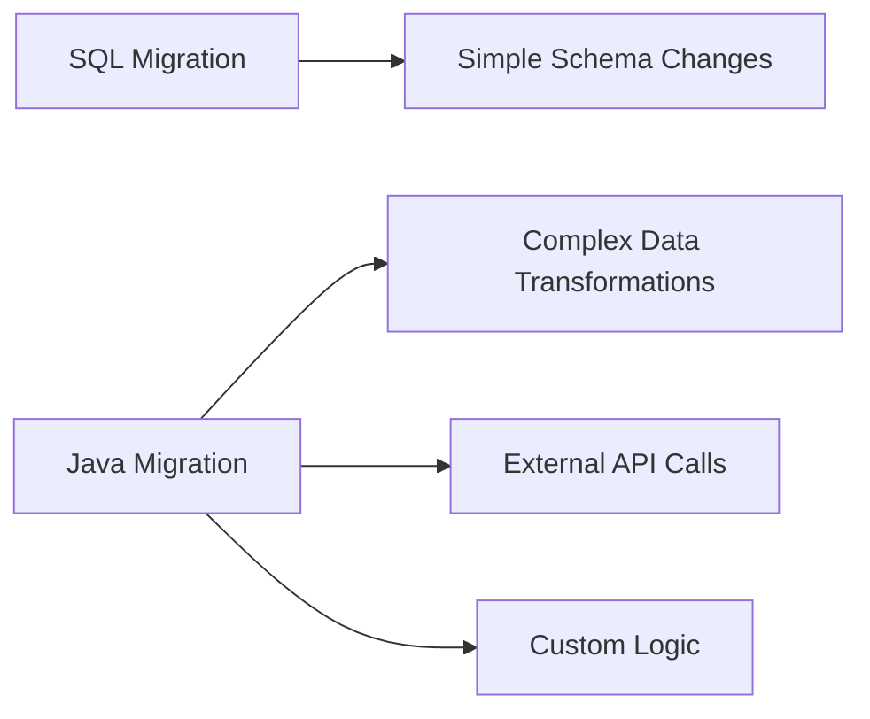

### Creating a Java Migration

This Java migration handles complex data transformation:

```java
// V6__Migrate_user_addresses.java
package db.migration;

import org.flywaydb.core.api.migration.BaseJavaMigration;
import org.flywaydb.core.api.migration.Context;
import org.springframework.jdbc.core.JdbcTemplate;
import org.springframework.jdbc.datasource.SingleConnectionDataSource;

import java.sql.Connection;
import java.sql.PreparedStatement;
import java.sql.ResultSet;
import java.sql.Statement;

/**
 * Migrates embedded address fields to a separate addresses table.
 * This complex migration requires Java for data transformation logic.
 */
public class V6__Migrate_user_addresses extends BaseJavaMigration {

    @Override
    public void migrate(Context context) throws Exception {
        Connection connection = context.getConnection();
        
        // Create the new addresses table
        createAddressesTable(connection);
        
        // Migrate existing address data from users table
        migrateAddressData(connection);
        
        // Drop the old address columns from users
        dropOldAddressColumns(connection);
    }
    
    private void createAddressesTable(Connection connection) throws Exception {
        String sql = """
            CREATE TABLE IF NOT EXISTS addresses (
                id BIGSERIAL PRIMARY KEY,
                user_id BIGINT NOT NULL REFERENCES users(id) ON DELETE CASCADE,
                address_type VARCHAR(20) NOT NULL,
                street_line_1 VARCHAR(255) NOT NULL,
                street_line_2 VARCHAR(255),
                city VARCHAR(100) NOT NULL,
                state VARCHAR(100),
                postal_code VARCHAR(20),
                country VARCHAR(100) NOT NULL DEFAULT 'USA',
                is_default BOOLEAN NOT NULL DEFAULT false,
                created_at TIMESTAMP WITH TIME ZONE NOT NULL DEFAULT CURRENT_TIMESTAMP,
                updated_at TIMESTAMP WITH TIME ZONE NOT NULL DEFAULT CURRENT_TIMESTAMP,
                
                CONSTRAINT chk_address_type CHECK (
                    address_type IN ('SHIPPING', 'BILLING', 'HOME', 'WORK')
                )
            )
            """;
        
        try (Statement stmt = connection.createStatement()) {
            stmt.execute(sql);
        }
        
        // Create indexes
        try (Statement stmt = connection.createStatement()) {
            stmt.execute("CREATE INDEX idx_addresses_user_id ON addresses(user_id)");
        }
    }
    
    private void migrateAddressData(Connection connection) throws Exception {
        // Query existing address data from users (assuming these columns exist)
        String selectSql = """
            SELECT id, street_address, city, state, postal_code, country
            FROM users
            WHERE street_address IS NOT NULL
            """;
        
        String insertSql = """
            INSERT INTO addresses 
            (user_id, address_type, street_line_1, city, state, postal_code, country, is_default)
            VALUES (?, 'HOME', ?, ?, ?, ?, ?, true)
            """;
        
        try (Statement selectStmt = connection.createStatement();
             ResultSet rs = selectStmt.executeQuery(selectSql);
             PreparedStatement insertStmt = connection.prepareStatement(insertSql)) {
            
            int batchCount = 0;
            
            while (rs.next()) {
                insertStmt.setLong(1, rs.getLong("id"));
                insertStmt.setString(2, rs.getString("street_address"));
                insertStmt.setString(3, rs.getString("city"));
                insertStmt.setString(4, rs.getString("state"));
                insertStmt.setString(5, rs.getString("postal_code"));
                insertStmt.setString(6, rs.getString("country"));
                
                insertStmt.addBatch();
                batchCount++;
                
                // Execute batch every 1000 records for memory efficiency
                if (batchCount % 1000 == 0) {
                    insertStmt.executeBatch();
                }
            }
            
            // Execute remaining batch
            if (batchCount % 1000 != 0) {
                insertStmt.executeBatch();
            }
        }
    }
    
    private void dropOldAddressColumns(Connection connection) throws Exception {
        String[] columnsToRemove = {
            "street_address", "city", "state", "postal_code", "country"
        };
        
        for (String column : columnsToRemove) {
            String sql = "ALTER TABLE users DROP COLUMN IF EXISTS " + column;
            try (Statement stmt = connection.createStatement()) {
                stmt.execute(sql);
            }
        }
    }
}
```

### Spring-Aware Java Migration

For migrations that need Spring beans, use callbacks:

```java
// MigrationConfiguration.java
package com.example.config;

import org.flywaydb.core.api.callback.Callback;
import org.flywaydb.core.api.callback.Context;
import org.flywaydb.core.api.callback.Event;
import org.springframework.stereotype.Component;

/**
 * Flyway callback for executing Spring-aware operations during migration.
 */
@Component
public class MigrationCallback implements Callback {

    private final UserService userService;
    private final NotificationService notificationService;
    
    public MigrationCallback(UserService userService, 
                            NotificationService notificationService) {
        this.userService = userService;
        this.notificationService = notificationService;
    }
    
    @Override
    public boolean supports(Event event, Context context) {
        // Support after migrate event
        return event == Event.AFTER_MIGRATE;
    }
    
    @Override
    public boolean canHandleInTransaction(Event event, Context context) {
        return false; // Run outside transaction
    }
    
    @Override
    public void handle(Event event, Context context) {
        if (event == Event.AFTER_MIGRATE) {
            // Perform post-migration tasks using Spring services
            userService.refreshUserCache();
            notificationService.sendMigrationCompleteNotification(
                context.getMigrationInfo().length
            );
        }
    }
    
    @Override
    public String getCallbackName() {
        return "SpringAwareMigrationCallback";
    }
}
```

---

## Handling Schema History

### The Schema History Table

Flyway tracks migrations in a schema history table:

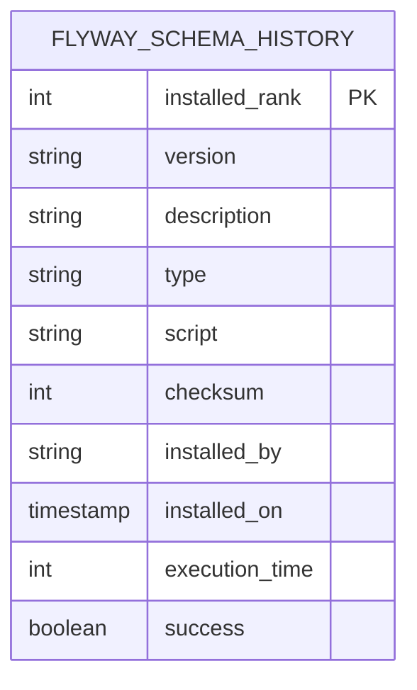

Query the schema history to see migration status:

```sql
-- View all applied migrations
SELECT 
    installed_rank,
    version,
    description,
    type,
    script,
    checksum,
    installed_on,
    execution_time,
    success
FROM flyway_schema_history
ORDER BY installed_rank;
```

### Baselining Existing Databases

When introducing Flyway to an existing database:

```yaml
# application.yml
spring:
  flyway:
    # Baseline an existing database at version 1
    baseline-on-migrate: true
    baseline-version: 1
    baseline-description: "Baseline existing schema"
```

Alternatively, use programmatic baselining:

```java
// FlywayConfiguration.java
package com.example.config;

import org.flywaydb.core.Flyway;
import org.springframework.boot.autoconfigure.flyway.FlywayMigrationStrategy;
import org.springframework.context.annotation.Bean;
import org.springframework.context.annotation.Configuration;

/**
 * Custom Flyway configuration for advanced baseline scenarios.
 */
@Configuration
public class FlywayConfiguration {

    @Bean
    public FlywayMigrationStrategy flywayMigrationStrategy() {
        return flyway -> {
            // Check if database has existing tables but no Flyway history
            if (!flyway.info().applied().length > 0 && hasExistingTables(flyway)) {
                // Baseline at version 1
                flyway.baseline();
            }
            
            // Run migrations
            flyway.migrate();
        };
    }
    
    private boolean hasExistingTables(Flyway flyway) {
        // Check for existing application tables
        try {
            flyway.getConfiguration()
                  .getDataSource()
                  .getConnection()
                  .createStatement()
                  .executeQuery("SELECT 1 FROM users LIMIT 1");
            return true;
        } catch (Exception e) {
            return false;
        }
    }
}
```

---

## Migration Validation

### Checksum Validation

Flyway validates migration checksums to detect changes:

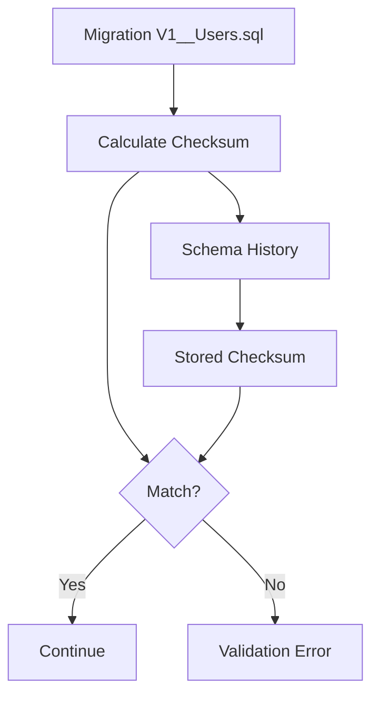

If a migration file changes after being applied, Flyway throws an error.

### Handling Checksum Mismatches

When you need to repair checksums (use with caution):

```yaml
# application.yml for development only
spring:
  flyway:
    # Skip checksum validation (NOT recommended for production)
    validate-on-migrate: false
```

Better approach is to use Flyway repair:

```java
// FlywayRepairRunner.java
package com.example.maintenance;

import org.flywaydb.core.Flyway;
import org.springframework.boot.CommandLineRunner;
import org.springframework.boot.autoconfigure.condition.ConditionalOnProperty;
import org.springframework.stereotype.Component;

/**
 * Repairs Flyway schema history when explicitly enabled.
 * Should only be used in controlled maintenance scenarios.
 */
@Component
@ConditionalOnProperty(name = "flyway.repair", havingValue = "true")
public class FlywayRepairRunner implements CommandLineRunner {

    private final Flyway flyway;
    
    public FlywayRepairRunner(Flyway flyway) {
        this.flyway = flyway;
    }
    
    @Override
    public void run(String... args) {
        // Repair removes failed migrations and realigns checksums
        flyway.repair();
        System.out.println("Flyway repair completed successfully");
    }
}
```

---

## Rollback Strategies

Flyway Teams offers undo migrations, but for open-source versions, implement manual rollback:

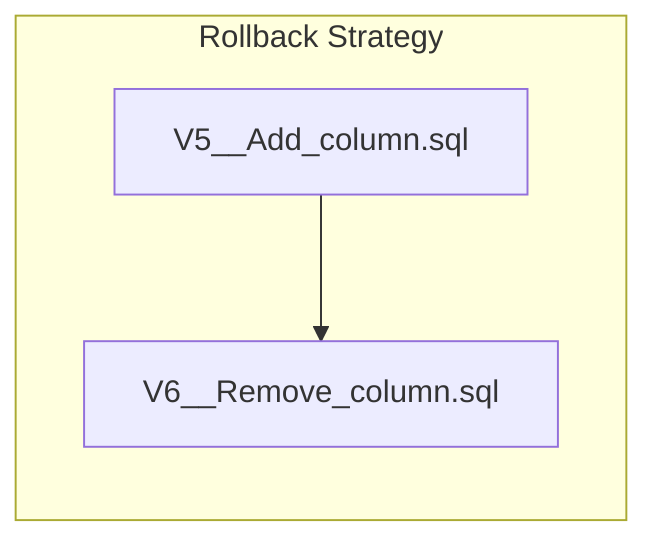

### Forward-Only Rollbacks

Create a new migration to undo changes:

This migration adds a column that might need to be rolled back:

```sql
-- V7__Add_user_preferences.sql
-- Adds preferences column to users table

ALTER TABLE users 
ADD COLUMN preferences JSONB DEFAULT '{}';

-- Create GIN index for JSONB queries
CREATE INDEX idx_users_preferences ON users USING GIN (preferences);
```

If rollback is needed, create another migration:

```sql
-- V8__Remove_user_preferences.sql
-- Rollback: Removes preferences column added in V7

-- Drop the index first
DROP INDEX IF EXISTS idx_users_preferences;

-- Remove the column
ALTER TABLE users 
DROP COLUMN IF EXISTS preferences;
```

### Conditional Migrations

Handle rollback scenarios with conditional logic:

```sql
-- V9__Add_feature_flag_column.sql
-- Adds feature flag column with safe rollback check

DO $$
BEGIN
    -- Only add column if it doesn't exist
    IF NOT EXISTS (
        SELECT 1 FROM information_schema.columns 
        WHERE table_name = 'users' AND column_name = 'feature_flags'
    ) THEN
        ALTER TABLE users ADD COLUMN feature_flags JSONB DEFAULT '{}';
    END IF;
END $$;

-- Safely create index
CREATE INDEX IF NOT EXISTS idx_users_feature_flags 
ON users USING GIN (feature_flags);
```

### Blue-Green Deployment Migrations

For zero-downtime deployments, ensure backward compatibility:

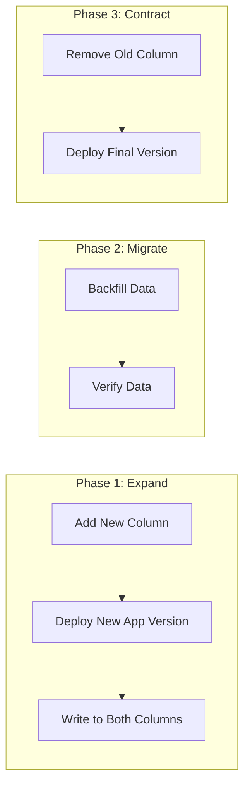

Phase 1: Add new column while keeping old column:

```sql
-- V10__Expand_email_to_email_address.sql
-- Phase 1: Add new column (non-breaking change)

ALTER TABLE users 
ADD COLUMN IF NOT EXISTS email_address VARCHAR(255);

-- Copy existing data
UPDATE users 
SET email_address = email 
WHERE email_address IS NULL AND email IS NOT NULL;

-- Create index on new column
CREATE INDEX IF NOT EXISTS idx_users_email_address ON users(email_address);
```

Phase 2: Backfill and verify (run as part of deployment):

```sql
-- V11__Backfill_email_address.sql
-- Phase 2: Ensure all data is migrated

-- Final backfill
UPDATE users 
SET email_address = email 
WHERE email_address IS NULL AND email IS NOT NULL;

-- Add NOT NULL constraint after verification
ALTER TABLE users 
ALTER COLUMN email_address SET NOT NULL;

-- Add unique constraint
ALTER TABLE users 
ADD CONSTRAINT uk_users_email_address UNIQUE (email_address);
```

Phase 3: Contract - remove old column (after all services are updated):

```sql
-- V12__Contract_remove_old_email.sql
-- Phase 3: Remove old column (breaking change - ensure all services updated)

-- Drop old constraints
ALTER TABLE users DROP CONSTRAINT IF EXISTS users_email_key;

-- Drop old index
DROP INDEX IF EXISTS idx_users_email;

-- Remove old column
ALTER TABLE users DROP COLUMN IF EXISTS email;
```

---

## Testing Migrations

### Using Testcontainers

Test migrations against a real database:

```java
// MigrationIntegrationTest.java
package com.example.migration;

import org.flywaydb.core.Flyway;
import org.junit.jupiter.api.BeforeEach;
import org.junit.jupiter.api.Test;
import org.springframework.beans.factory.annotation.Autowired;
import org.springframework.boot.test.context.SpringBootTest;
import org.springframework.jdbc.core.JdbcTemplate;
import org.springframework.test.context.DynamicPropertyRegistry;
import org.springframework.test.context.DynamicPropertySource;
import org.testcontainers.containers.PostgreSQLContainer;
import org.testcontainers.junit.jupiter.Container;
import org.testcontainers.junit.jupiter.Testcontainers;

import static org.assertj.core.api.Assertions.assertThat;

/**
 * Integration tests for Flyway migrations using Testcontainers.
 */
@SpringBootTest
@Testcontainers
class MigrationIntegrationTest {

    @Container
    static PostgreSQLContainer<?> postgres = new PostgreSQLContainer<>("postgres:15")
            .withDatabaseName("testdb")
            .withUsername("test")
            .withPassword("test");
    
    @DynamicPropertySource
    static void configureProperties(DynamicPropertyRegistry registry) {
        registry.add("spring.datasource.url", postgres::getJdbcUrl);
        registry.add("spring.datasource.username", postgres::getUsername);
        registry.add("spring.datasource.password", postgres::getPassword);
    }
    
    @Autowired
    private Flyway flyway;
    
    @Autowired
    private JdbcTemplate jdbcTemplate;
    
    @BeforeEach
    void setUp() {
        // Clean and migrate for each test
        flyway.clean();
        flyway.migrate();
    }
    
    @Test
    void shouldApplyAllMigrations() {
        // Verify migration count
        var info = flyway.info();
        assertThat(info.applied().length).isGreaterThan(0);
        assertThat(info.pending().length).isZero();
    }
    
    @Test
    void shouldCreateUsersTable() {
        // Verify users table structure
        var columns = jdbcTemplate.queryForList("""
            SELECT column_name, data_type, is_nullable
            FROM information_schema.columns
            WHERE table_name = 'users'
            ORDER BY ordinal_position
            """);
        
        assertThat(columns).isNotEmpty();
        
        var columnNames = columns.stream()
                .map(row -> row.get("column_name").toString())
                .toList();
        
        assertThat(columnNames).contains("id", "username", "email", "created_at");
    }
    
    @Test
    void shouldCreateIndexes() {
        // Verify indexes are created
        var indexes = jdbcTemplate.queryForList("""
            SELECT indexname FROM pg_indexes 
            WHERE tablename = 'users'
            """);
        
        var indexNames = indexes.stream()
                .map(row -> row.get("indexname").toString())
                .toList();
        
        assertThat(indexNames).contains("idx_users_email", "idx_users_username");
    }
    
    @Test
    void shouldInsertDefaultRoles() {
        // Verify default data
        var roleCount = jdbcTemplate.queryForObject(
            "SELECT COUNT(*) FROM roles", Integer.class
        );
        
        assertThat(roleCount).isGreaterThanOrEqualTo(3);
    }
    
    @Test
    void shouldCreateForeignKeyConstraints() {
        // Verify foreign key constraints
        var constraints = jdbcTemplate.queryForList("""
            SELECT constraint_name, table_name
            FROM information_schema.table_constraints
            WHERE constraint_type = 'FOREIGN KEY'
            AND table_schema = 'public'
            """);
        
        assertThat(constraints).isNotEmpty();
    }
}
```

### Validating Migration Scripts

Create a test to validate SQL syntax:

```java
// MigrationValidationTest.java
package com.example.migration;

import org.flywaydb.core.Flyway;
import org.flywaydb.core.api.MigrationInfo;
import org.junit.jupiter.api.Test;
import org.junit.jupiter.params.ParameterizedTest;
import org.junit.jupiter.params.provider.MethodSource;
import org.springframework.core.io.Resource;
import org.springframework.core.io.support.PathMatchingResourcePatternResolver;

import java.io.IOException;
import java.nio.file.Files;
import java.util.Arrays;
import java.util.stream.Stream;

import static org.assertj.core.api.Assertions.assertThat;

/**
 * Validates migration file naming and content conventions.
 */
class MigrationValidationTest {

    private static final PathMatchingResourcePatternResolver resolver = 
            new PathMatchingResourcePatternResolver();
    
    static Stream<Resource> migrationFiles() throws IOException {
        Resource[] resources = resolver.getResources(
            "classpath:db/migration/*.sql"
        );
        return Arrays.stream(resources);
    }
    
    @ParameterizedTest
    @MethodSource("migrationFiles")
    void migrationShouldFollowNamingConvention(Resource resource) {
        String filename = resource.getFilename();
        assertThat(filename).isNotNull();
        
        // Check versioned migration naming
        if (filename.startsWith("V")) {
            assertThat(filename)
                .matches("V\\d+(_\\d+)?__[A-Za-z_]+\\.sql",
                    "Version migration should follow pattern V{version}__{description}.sql");
        }
        
        // Check repeatable migration naming
        if (filename.startsWith("R")) {
            assertThat(filename)
                .matches("R__[A-Za-z_]+\\.sql",
                    "Repeatable migration should follow pattern R__{description}.sql");
        }
    }
    
    @ParameterizedTest
    @MethodSource("migrationFiles")
    void migrationShouldNotContainDropDatabase(Resource resource) throws IOException {
        String content = Files.readString(resource.getFile().toPath());
        
        assertThat(content.toUpperCase())
            .doesNotContain("DROP DATABASE")
            .describedAs("Migration should not contain DROP DATABASE");
    }
    
    @ParameterizedTest
    @MethodSource("migrationFiles")
    void migrationShouldHaveComments(Resource resource) throws IOException {
        String content = Files.readString(resource.getFile().toPath());
        
        // Check for at least one comment
        assertThat(content)
            .containsPattern("--.*|/\\*.*\\*/")
            .describedAs("Migration should have documentation comments");
    }
    
    @Test
    void shouldHaveNoPendingMigrations() {
        // This test verifies all migrations are valid
        Flyway flyway = Flyway.configure()
                .dataSource("jdbc:h2:mem:test;MODE=PostgreSQL", "sa", "")
                .locations("classpath:db/migration")
                .load();
        
        MigrationInfo[] pending = flyway.info().pending();
        
        // Validate all pending migrations can be parsed
        assertThat(pending).isNotNull();
        for (MigrationInfo info : pending) {
            assertThat(info.getVersion()).isNotNull();
            assertThat(info.getDescription()).isNotBlank();
        }
    }
}
```

---

## Monitoring Migrations

### Exposing Migration Status via Actuator

Configure the Flyway actuator endpoint:

```yaml
# application.yml
management:
  endpoints:
    web:
      exposure:
        include: health, info, flyway
  endpoint:
    flyway:
      enabled: true
```

The `/actuator/flyway` endpoint returns:

```json
{
  "contexts": {
    "application": {
      "flywayBeans": {
        "flyway": {
          "migrations": [
            {
              "type": "SQL",
              "checksum": 1234567890,
              "version": "1",
              "description": "Create users table",
              "script": "V1__Create_users_table.sql",
              "state": "SUCCESS",
              "installedBy": "postgres",
              "installedOn": "2024-01-15T10:30:00.000Z",
              "installedRank": 1,
              "executionTime": 45
            }
          ]
        }
      }
    }
  }
}
```

### Custom Migration Metrics

Export migration metrics to Prometheus:

```java
// FlywayMetricsConfiguration.java
package com.example.config;

import io.micrometer.core.instrument.Gauge;
import io.micrometer.core.instrument.MeterRegistry;
import io.micrometer.core.instrument.Tags;
import org.flywaydb.core.Flyway;
import org.flywaydb.core.api.MigrationInfo;
import org.springframework.context.annotation.Configuration;

import jakarta.annotation.PostConstruct;

/**
 * Exposes Flyway migration metrics to Micrometer.
 */
@Configuration
public class FlywayMetricsConfiguration {

    private final Flyway flyway;
    private final MeterRegistry meterRegistry;
    
    public FlywayMetricsConfiguration(Flyway flyway, MeterRegistry meterRegistry) {
        this.flyway = flyway;
        this.meterRegistry = meterRegistry;
    }
    
    @PostConstruct
    public void registerMetrics() {
        // Total migrations applied
        Gauge.builder("flyway.migrations.applied", flyway, 
                f -> f.info().applied().length)
            .description("Number of applied Flyway migrations")
            .register(meterRegistry);
        
        // Pending migrations
        Gauge.builder("flyway.migrations.pending", flyway,
                f -> f.info().pending().length)
            .description("Number of pending Flyway migrations")
            .register(meterRegistry);
        
        // Current version
        Gauge.builder("flyway.migrations.current.version", flyway, f -> {
            MigrationInfo current = f.info().current();
            if (current != null && current.getVersion() != null) {
                try {
                    return Double.parseDouble(
                        current.getVersion().getVersion().replace(".", "")
                    );
                } catch (NumberFormatException e) {
                    return -1;
                }
            }
            return 0;
        })
        .description("Current Flyway migration version")
        .register(meterRegistry);
        
        // Total execution time
        Gauge.builder("flyway.migrations.execution.time.total", flyway, f -> {
            long total = 0;
            for (MigrationInfo info : f.info().applied()) {
                if (info.getExecutionTime() != null) {
                    total += info.getExecutionTime();
                }
            }
            return total;
        })
        .description("Total execution time for all migrations in milliseconds")
        .baseUnit("milliseconds")
        .register(meterRegistry);
    }
}
```

### Migration Health Indicator

Create a custom health indicator:

```java
// FlywayHealthIndicator.java
package com.example.health;

import org.flywaydb.core.Flyway;
import org.flywaydb.core.api.MigrationInfo;
import org.flywaydb.core.api.MigrationState;
import org.springframework.boot.actuate.health.Health;
import org.springframework.boot.actuate.health.HealthIndicator;
import org.springframework.stereotype.Component;

import java.util.Arrays;
import java.util.Map;

/**
 * Health indicator for Flyway migration status.
 */
@Component
public class FlywayHealthIndicator implements HealthIndicator {

    private final Flyway flyway;
    
    public FlywayHealthIndicator(Flyway flyway) {
        this.flyway = flyway;
    }
    
    @Override
    public Health health() {
        var info = flyway.info();
        var pending = info.pending();
        var failed = Arrays.stream(info.all())
                .filter(m -> m.getState() == MigrationState.FAILED)
                .toList();
        
        var details = Map.of(
            "applied", info.applied().length,
            "pending", pending.length,
            "failed", failed.size(),
            "current", info.current() != null ? 
                       info.current().getVersion().getVersion() : "none"
        );
        
        // Failed migrations indicate unhealthy state
        if (!failed.isEmpty()) {
            return Health.down()
                .withDetails(details)
                .withDetail("failedMigrations", failed.stream()
                    .map(m -> m.getScript())
                    .toList())
                .build();
        }
        
        // Pending migrations are a warning
        if (pending.length > 0) {
            return Health.status("WARNING")
                .withDetails(details)
                .withDetail("pendingMigrations", Arrays.stream(pending)
                    .map(m -> m.getScript())
                    .toList())
                .build();
        }
        
        return Health.up().withDetails(details).build();
    }
}
```

---

## CI/CD Integration

### GitHub Actions Workflow

Validate migrations in CI:

```yaml
# .github/workflows/migrations.yml
name: Validate Migrations

on:
  push:
    paths:
      - 'src/main/resources/db/migration/**'
  pull_request:
    paths:
      - 'src/main/resources/db/migration/**'

jobs:
  validate:
    runs-on: ubuntu-latest
    
    services:
      postgres:
        image: postgres:15
        env:
          POSTGRES_DB: testdb
          POSTGRES_USER: test
          POSTGRES_PASSWORD: test
        options: >-
          --health-cmd pg_isready
          --health-interval 10s
          --health-timeout 5s
          --health-retries 5
        ports:
          - 5432:5432
    
    steps:
      - uses: actions/checkout@v4
      
      - name: Set up JDK 21
        uses: actions/setup-java@v4
        with:
          java-version: '21'
          distribution: 'temurin'
      
      - name: Cache Maven dependencies
        uses: actions/cache@v4
        with:
          path: ~/.m2
          key: ${{ runner.os }}-maven-${{ hashFiles('**/pom.xml') }}
      
      - name: Validate migrations
        run: |
          mvn flyway:validate \
            -Dflyway.url=jdbc:postgresql://localhost:5432/testdb \
            -Dflyway.user=test \
            -Dflyway.password=test
      
      - name: Run migrations
        run: |
          mvn flyway:migrate \
            -Dflyway.url=jdbc:postgresql://localhost:5432/testdb \
            -Dflyway.user=test \
            -Dflyway.password=test
      
      - name: Run migration tests
        run: mvn test -Dtest=*MigrationTest
        env:
          SPRING_DATASOURCE_URL: jdbc:postgresql://localhost:5432/testdb
          SPRING_DATASOURCE_USERNAME: test
          SPRING_DATASOURCE_PASSWORD: test
```

### Docker Compose for Local Development

Set up local development with Docker Compose:

```yaml
# docker-compose.yml
version: '3.8'

services:
  postgres:
    image: postgres:15
    environment:
      POSTGRES_DB: myapp
      POSTGRES_USER: myapp
      POSTGRES_PASSWORD: secret
    ports:
      - "5432:5432"
    volumes:
      - postgres_data:/var/lib/postgresql/data
    healthcheck:
      test: ["CMD-SHELL", "pg_isready -U myapp -d myapp"]
      interval: 5s
      timeout: 5s
      retries: 5
  
  app:
    build: .
    depends_on:
      postgres:
        condition: service_healthy
    environment:
      SPRING_PROFILES_ACTIVE: dev
      SPRING_DATASOURCE_URL: jdbc:postgresql://postgres:5432/myapp
      SPRING_DATASOURCE_USERNAME: myapp
      SPRING_DATASOURCE_PASSWORD: secret
    ports:
      - "8080:8080"

volumes:
  postgres_data:
```

### Kubernetes Init Container

Run migrations before app startup:

```yaml
# kubernetes/deployment.yaml
apiVersion: apps/v1
kind: Deployment
metadata:
  name: myapp
spec:
  replicas: 3
  selector:
    matchLabels:
      app: myapp
  template:
    metadata:
      labels:
        app: myapp
    spec:
      initContainers:
        # Run migrations before main container starts
        - name: flyway-migrate
          image: myapp:latest
          command: ["java", "-cp", "/app/*", "org.flywaydb.core.Flyway"]
          args:
            - "migrate"
            - "-url=$(DATABASE_URL)"
            - "-user=$(DATABASE_USER)"
            - "-password=$(DATABASE_PASSWORD)"
          envFrom:
            - secretRef:
                name: database-credentials
      containers:
        - name: myapp
          image: myapp:latest
          ports:
            - containerPort: 8080
          env:
            - name: SPRING_FLYWAY_ENABLED
              value: "false"  # Already ran in init container
          envFrom:
            - secretRef:
                name: database-credentials
```

---

## Best Practices

### Migration Best Practices Checklist

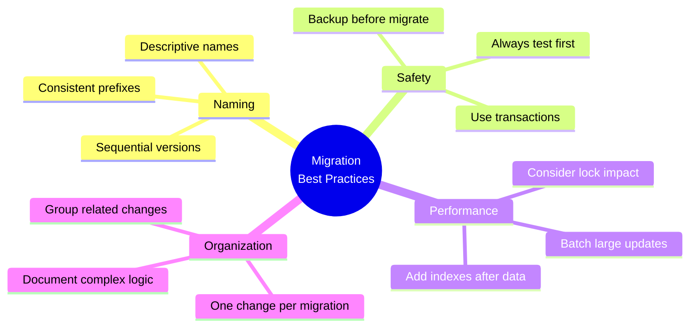

### Do's and Don'ts

**DO:**
- Test migrations against production-like data
- Use meaningful version numbers (semantic versioning)
- Include comments explaining complex operations
- Create indexes after inserting bulk data
- Use IF NOT EXISTS and IF EXISTS for safety

**DON'T:**
- Edit migrations after they are applied
- Use random version numbers
- Put multiple unrelated changes in one migration
- Lock large tables during busy hours
- Forget to update related application code

### Sample Project Structure

Organize your migration files logically:

```
src/main/resources/
  db/
    migration/
      # Versioned migrations
      V1__Create_users_table.sql
      V2__Create_roles_table.sql
      V3__Create_orders_table.sql
      V4__Create_order_items_table.sql
      V5__Add_user_preferences.sql
      
      # Repeatable migrations
      R__Create_views.sql
      R__Create_functions.sql
      R__Populate_reference_data.sql
    
    seed/
      dev/
        V1000__Insert_test_data.sql
      prod/
        V1000__Insert_production_seed.sql
```

---

## Troubleshooting Common Issues

### Migration Failed: Checksum Mismatch

**Problem**: Flyway detects that a migration file has been modified.

**Solution**:

```java
// Option 1: Repair the schema history (development only)
flyway.repair();

// Option 2: Create a corrective migration
// Never modify applied migrations in production
```

### Migration Stuck: Lock Timeout

**Problem**: Migration hangs due to database locks.

**Solution**:

```sql
-- Check for blocking queries in PostgreSQL
SELECT 
    pid,
    usename,
    state,
    query_start,
    query
FROM pg_stat_activity
WHERE state = 'active'
AND query NOT LIKE '%pg_stat_activity%';

-- Terminate blocking session if safe
SELECT pg_terminate_backend(pid);
```

### Out of Order Migrations

**Problem**: Team members create migrations with overlapping version numbers.

**Solution**:

```yaml
# application.yml
spring:
  flyway:
    # Allow out-of-order migrations (use carefully)
    out-of-order: true
    
    # Better: Use timestamps as versions
    # V20240115_1430__Create_table.sql
```

### Memory Issues with Large Migrations

**Problem**: Large data migrations cause OutOfMemoryError.

**Solution**: Use batched processing in Java migrations:

```java
// Process in batches to avoid memory issues
private void migrateInBatches(Connection connection, int batchSize) 
        throws Exception {
    String countSql = "SELECT COUNT(*) FROM large_table WHERE migrated = false";
    String selectSql = "SELECT * FROM large_table WHERE migrated = false LIMIT ?";
    String updateSql = "UPDATE large_table SET migrated = true WHERE id = ?";
    
    int totalRecords = jdbcTemplate.queryForObject(countSql, Integer.class);
    int processed = 0;
    
    while (processed < totalRecords) {
        // Process batch
        List<Record> batch = jdbcTemplate.query(selectSql, 
            new Object[]{batchSize}, recordRowMapper);
        
        for (Record record : batch) {
            // Transform and migrate record
            processRecord(record);
            jdbcTemplate.update(updateSql, record.getId());
        }
        
        processed += batch.size();
        
        // Log progress
        System.out.printf("Migrated %d/%d records%n", processed, totalRecords);
    }
}
```

---

## Summary

Flyway provides a robust foundation for managing database schema changes in Spring Boot applications. Key takeaways:

1. **Version Control**: Every schema change is tracked and versioned
2. **Consistency**: Same migrations run in all environments
3. **Automation**: Migrations run automatically on application startup
4. **Flexibility**: Support for SQL and Java-based migrations
5. **Safety**: Checksum validation prevents accidental modifications

The migration workflow integrates naturally into modern development practices:

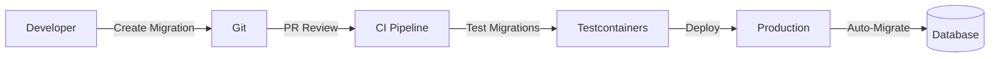

Start with simple versioned migrations and gradually adopt advanced features like repeatable migrations, Java-based transformations, and blue-green deployment strategies as your needs evolve. Remember to always test migrations thoroughly before applying them to production databases.

---

## Further Reading

- [Flyway Official Documentation](https://documentation.red-gate.com/fd)
- [Spring Boot Flyway Auto-configuration](https://docs.spring.io/spring-boot/docs/current/reference/html/howto.html#howto.data-initialization.migration-tool.flyway)
- [Database Migration Patterns](https://martinfowler.com/articles/evodb.html)
- [OneUptime for Monitoring Your Spring Boot Applications](https://oneuptime.com)
