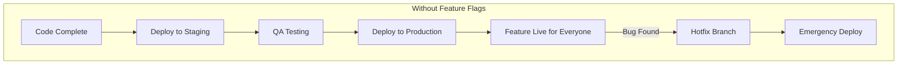
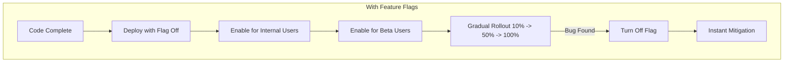
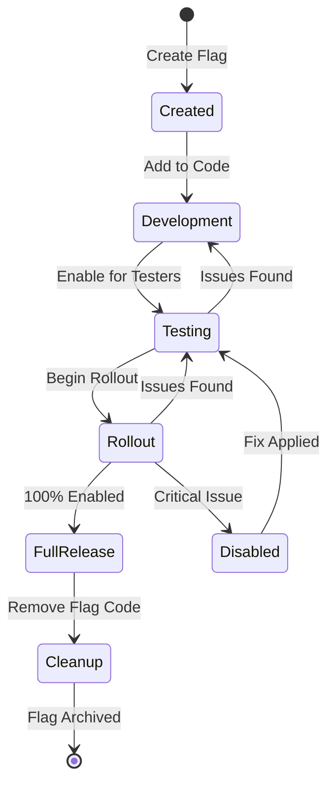
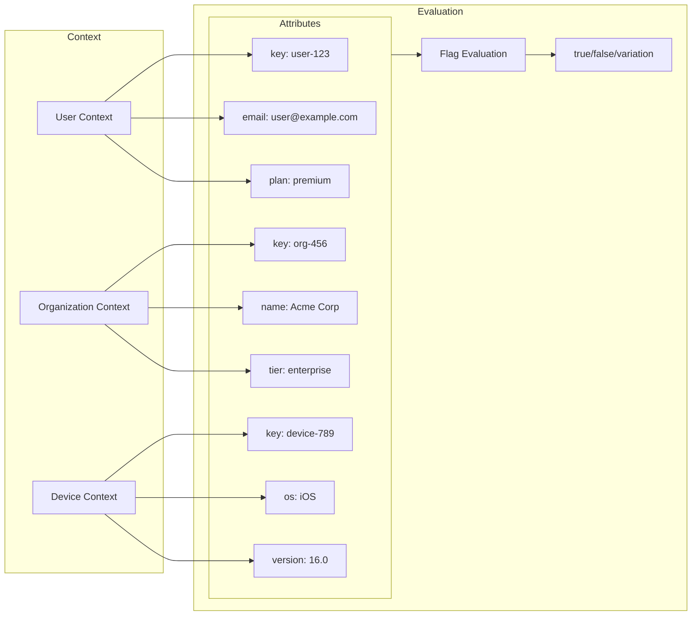
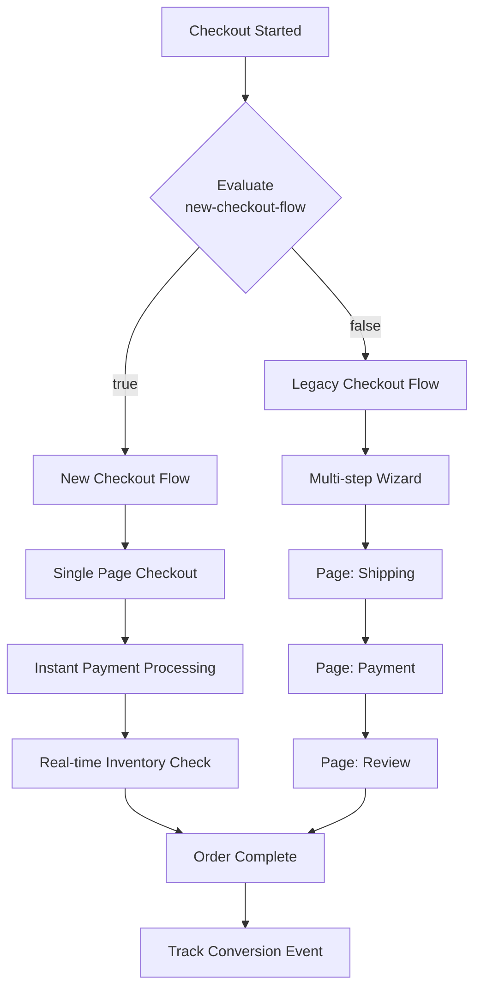
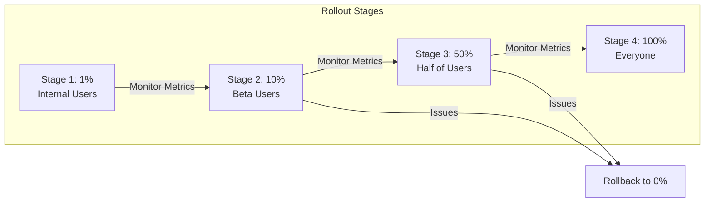
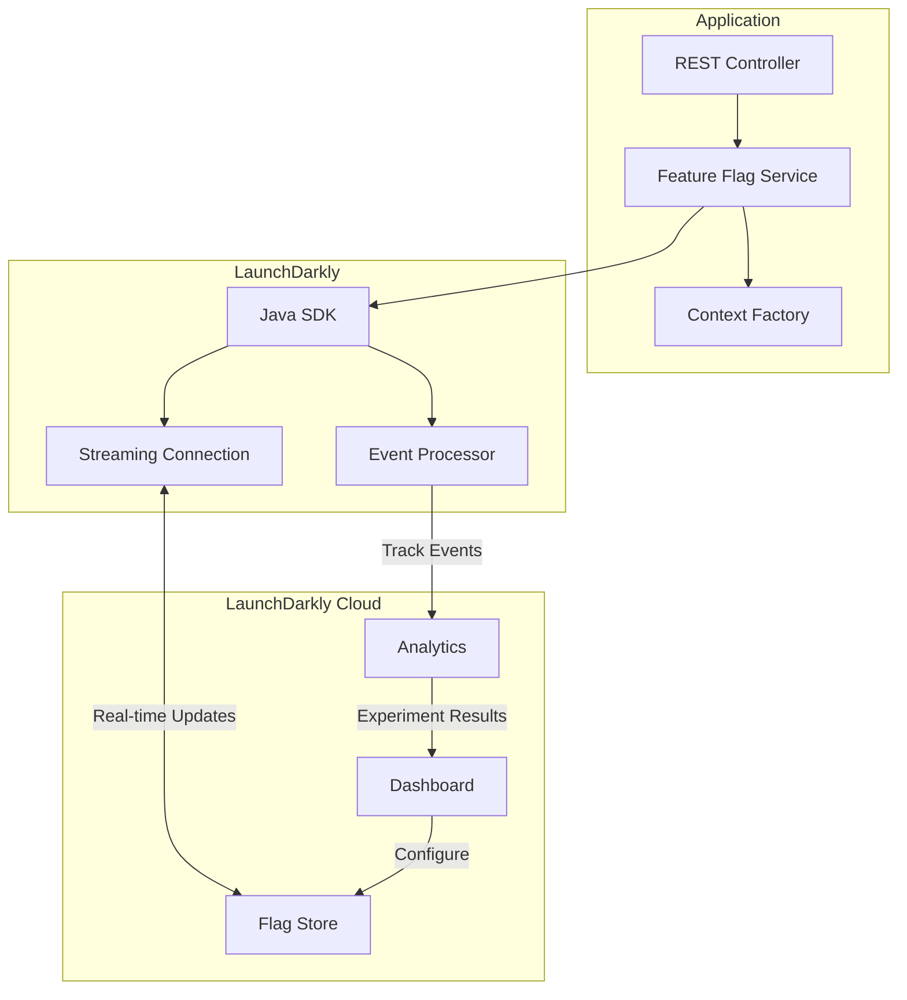

# How to Use LaunchDarkly with Spring Boot

Author: [nawazdhandala](https://www.github.com/nawazdhandala)

Tags: Java, Spring Boot, LaunchDarkly, Feature Flags, Feature Toggles, A/B Testing

Description: Learn how to implement feature flags in Spring Boot applications using LaunchDarkly. This guide covers SDK setup, flag evaluation, targeting rules, and best practices.

---

> Feature flags are the secret weapon of high-performing engineering teams. They let you ship code to production without releasing features, run A/B tests without redeploying, and kill problematic features instantly. LaunchDarkly is the industry leader in feature flag management, and integrating it with Spring Boot is straightforward.

Feature flags (also called feature toggles) decouple deployment from release. You deploy code containing new features to production, but those features remain hidden behind flags until you're ready to turn them on. This enables trunk-based development, progressive rollouts, and instant rollbacks without code changes.

---

## Why Feature Flags Matter

Before diving into implementation, let's understand the core benefits:





Key benefits:
- **Safer deployments**: Deploy code without releasing features
- **Progressive rollouts**: Release to 1%, then 10%, then 100% of users
- **Instant rollback**: Kill a feature without deploying code
- **A/B testing**: Run experiments with real users
- **Targeted releases**: Enable features for specific users, regions, or plans

---

## Feature Flag Lifecycle

Understanding the lifecycle helps you manage flags effectively:



Key stages:
- **Created**: Flag exists in LaunchDarkly but not in code
- **Development**: Flag added to codebase, always returns default
- **Testing**: Enabled for internal testers
- **Rollout**: Progressive percentage-based rollout
- **Full Release**: 100% of users see the feature
- **Cleanup**: Remove flag from code, archive in LaunchDarkly

---

## Getting Started

### Dependencies

Add the LaunchDarkly SDK to your Spring Boot project:

```xml
<!-- pom.xml -->
<dependencies>
    <!-- Spring Boot Web -->
    <dependency>
        <groupId>org.springframework.boot</groupId>
        <artifactId>spring-boot-starter-web</artifactId>
    </dependency>
    
    <!-- LaunchDarkly Java Server SDK -->
    <dependency>
        <groupId>com.launchdarkly</groupId>
        <artifactId>launchdarkly-java-server-sdk</artifactId>
        <version>7.2.0</version>
    </dependency>
    
    <!-- Optional: Spring Boot Actuator for health checks -->
    <dependency>
        <groupId>org.springframework.boot</groupId>
        <artifactId>spring-boot-starter-actuator</artifactId>
    </dependency>
    
    <!-- Optional: Lombok for cleaner code -->
    <dependency>
        <groupId>org.projectlombok</groupId>
        <artifactId>lombok</artifactId>
        <optional>true</optional>
    </dependency>
</dependencies>
```

For Gradle:

```groovy
// build.gradle
dependencies {
    // Spring Boot Web
    implementation 'org.springframework.boot:spring-boot-starter-web'
    
    // LaunchDarkly Java Server SDK
    implementation 'com.launchdarkly:launchdarkly-java-server-sdk:7.2.0'
    
    // Optional: Actuator for health checks
    implementation 'org.springframework.boot:spring-boot-starter-actuator'
    
    // Optional: Lombok
    compileOnly 'org.projectlombok:lombok'
    annotationProcessor 'org.projectlombok:lombok'
}
```

---

## Basic Configuration

### Application Properties

Configure LaunchDarkly in your `application.yml`:

```yaml
# application.yml
launchdarkly:
  # SDK key from LaunchDarkly dashboard
  # Found in Account Settings > Projects > Your Project > Environments
  sdk-key: ${LAUNCHDARKLY_SDK_KEY}
  
  # Offline mode for local development (optional)
  offline: ${LAUNCHDARKLY_OFFLINE:false}
  
  # Connection settings
  connect-timeout-millis: 5000
  socket-timeout-millis: 5000
  
  # Event settings
  events:
    flush-interval-seconds: 5
    capacity: 10000
  
  # Streaming vs polling
  streaming:
    enabled: true
  
  # Application metadata
  application:
    id: ${spring.application.name}
    version: ${app.version:unknown}
```

### LaunchDarkly Client Configuration

Create a configuration class to initialize the LaunchDarkly client:

```java
// config/LaunchDarklyConfig.java
package com.example.config;

import com.launchdarkly.sdk.server.LDClient;
import com.launchdarkly.sdk.server.LDConfig;
import com.launchdarkly.sdk.server.Components;
import com.launchdarkly.sdk.server.integrations.ApplicationInfoBuilder;
import lombok.extern.slf4j.Slf4j;
import org.springframework.beans.factory.annotation.Value;
import org.springframework.context.annotation.Bean;
import org.springframework.context.annotation.Configuration;

import javax.annotation.PreDestroy;
import java.io.IOException;
import java.time.Duration;

@Slf4j
@Configuration
public class LaunchDarklyConfig {

    @Value("${launchdarkly.sdk-key}")
    private String sdkKey;

    @Value("${launchdarkly.offline:false}")
    private boolean offline;

    @Value("${launchdarkly.connect-timeout-millis:5000}")
    private int connectTimeoutMillis;

    @Value("${launchdarkly.socket-timeout-millis:5000}")
    private int socketTimeoutMillis;

    @Value("${spring.application.name:unknown}")
    private String applicationName;

    @Value("${app.version:unknown}")
    private String applicationVersion;

    private LDClient ldClient;

    @Bean
    public LDClient ldClient() {
        // Build configuration
        LDConfig.Builder configBuilder = new LDConfig.Builder();
        
        // Set offline mode if configured
        if (offline) {
            log.warn("LaunchDarkly running in OFFLINE mode - all flags will return defaults");
            configBuilder.offline(true);
        } else {
            // Configure HTTP settings
            configBuilder.http(
                Components.httpConfiguration()
                    .connectTimeout(Duration.ofMillis(connectTimeoutMillis))
                    .socketTimeout(Duration.ofMillis(socketTimeoutMillis))
            );
            
            // Enable streaming (default) for real-time flag updates
            configBuilder.dataSource(
                Components.streamingDataSource()
                    .initialReconnectDelay(Duration.ofMillis(1000))
            );
            
            // Configure events
            configBuilder.events(
                Components.sendEvents()
                    .flushInterval(Duration.ofSeconds(5))
                    .capacity(10000)
            );
        }
        
        // Add application metadata for easier debugging in LaunchDarkly
        configBuilder.applicationInfo(
            Components.applicationInfo()
                .applicationId(applicationName)
                .applicationVersion(applicationVersion)
        );
        
        // Create and verify client
        ldClient = new LDClient(sdkKey, configBuilder.build());
        
        // Wait for client initialization
        if (!offline && !ldClient.isInitialized()) {
            log.error("LaunchDarkly client failed to initialize");
        } else {
            log.info("LaunchDarkly client initialized successfully");
        }
        
        return ldClient;
    }

    // Ensure proper cleanup on shutdown
    @PreDestroy
    public void shutdown() throws IOException {
        if (ldClient != null) {
            log.info("Shutting down LaunchDarkly client");
            ldClient.close();
        }
    }
}
```

---

## Creating Feature Flag Contexts

LaunchDarkly evaluates flags based on context (user, organization, device, etc.). Create proper contexts for accurate targeting:



### Context Factory

```java
// context/FeatureFlagContextFactory.java
package com.example.context;

import com.launchdarkly.sdk.LDContext;
import com.launchdarkly.sdk.ContextKind;
import org.springframework.stereotype.Component;

/**
 * Factory for creating LaunchDarkly contexts.
 * Contexts identify who/what is being evaluated for feature flags.
 */
@Component
public class FeatureFlagContextFactory {

    // Context kinds for multi-context evaluations
    private static final ContextKind USER_KIND = ContextKind.of("user");
    private static final ContextKind ORGANIZATION_KIND = ContextKind.of("organization");
    private static final ContextKind DEVICE_KIND = ContextKind.of("device");

    /**
     * Create a simple user context for flag evaluation.
     *
     * @param userId Unique user identifier
     * @return LDContext for the user
     */
    public LDContext createUserContext(String userId) {
        return LDContext.builder(USER_KIND, userId)
            .build();
    }

    /**
     * Create a detailed user context with attributes for targeting.
     *
     * @param userId    Unique user identifier
     * @param email     User's email address
     * @param name      User's display name
     * @param plan      User's subscription plan
     * @param country   User's country code
     * @return LDContext with user attributes
     */
    public LDContext createUserContext(
            String userId,
            String email,
            String name,
            String plan,
            String country) {
        
        return LDContext.builder(USER_KIND, userId)
            .name(name)
            .set("email", email)
            .set("plan", plan)
            .set("country", country)
            .set("createdAt", System.currentTimeMillis())
            .build();
    }

    /**
     * Create an organization context for B2B applications.
     *
     * @param orgId   Unique organization identifier
     * @param orgName Organization name
     * @param tier    Organization tier (e.g., free, pro, enterprise)
     * @param seats   Number of seats/users
     * @return LDContext for the organization
     */
    public LDContext createOrganizationContext(
            String orgId,
            String orgName,
            String tier,
            int seats) {
        
        return LDContext.builder(ORGANIZATION_KIND, orgId)
            .name(orgName)
            .set("tier", tier)
            .set("seats", seats)
            .build();
    }

    /**
     * Create a multi-context combining user and organization.
     * Useful for B2B apps where features may target users OR organizations.
     *
     * @param userId    User identifier
     * @param userEmail User email
     * @param userPlan  User plan
     * @param orgId     Organization identifier
     * @param orgName   Organization name
     * @param orgTier   Organization tier
     * @return Multi-context for evaluation
     */
    public LDContext createMultiContext(
            String userId,
            String userEmail,
            String userPlan,
            String orgId,
            String orgName,
            String orgTier) {
        
        LDContext userContext = LDContext.builder(USER_KIND, userId)
            .set("email", userEmail)
            .set("plan", userPlan)
            .build();
        
        LDContext orgContext = LDContext.builder(ORGANIZATION_KIND, orgId)
            .name(orgName)
            .set("tier", orgTier)
            .build();
        
        return LDContext.multiBuilder()
            .add(userContext)
            .add(orgContext)
            .build();
    }

    /**
     * Create an anonymous context for unauthenticated users.
     * LaunchDarkly will generate a consistent key based on device.
     *
     * @param deviceId Device or session identifier
     * @return Anonymous LDContext
     */
    public LDContext createAnonymousContext(String deviceId) {
        return LDContext.builder(USER_KIND, deviceId)
            .anonymous(true)
            .build();
    }
}
```

---

## Feature Flag Service

Create a service layer to centralize all flag evaluations:

```java
// service/FeatureFlagService.java
package com.example.service;

import com.launchdarkly.sdk.LDContext;
import com.launchdarkly.sdk.LDValue;
import com.launchdarkly.sdk.server.LDClient;
import com.launchdarkly.sdk.server.interfaces.LDClientInterface;
import lombok.RequiredArgsConstructor;
import lombok.extern.slf4j.Slf4j;
import org.springframework.stereotype.Service;

/**
 * Service for evaluating LaunchDarkly feature flags.
 * Centralizes all flag evaluations and provides type-safe methods.
 */
@Slf4j
@Service
@RequiredArgsConstructor
public class FeatureFlagService {

    private final LDClient ldClient;

    // Flag key constants - define all flags in one place
    public static final String NEW_CHECKOUT_FLOW = "new-checkout-flow";
    public static final String DARK_MODE = "dark-mode";
    public static final String AI_RECOMMENDATIONS = "ai-recommendations";
    public static final String PREMIUM_FEATURES = "premium-features";
    public static final String RATE_LIMIT_TIER = "rate-limit-tier";
    public static final String EXPERIMENT_BUTTON_COLOR = "experiment-button-color";

    /**
     * Evaluate a boolean feature flag.
     *
     * @param flagKey      The flag key in LaunchDarkly
     * @param context      The evaluation context
     * @param defaultValue Default value if evaluation fails
     * @return Flag value (true/false)
     */
    public boolean getBooleanFlag(String flagKey, LDContext context, boolean defaultValue) {
        try {
            boolean value = ldClient.boolVariation(flagKey, context, defaultValue);
            log.debug("Flag '{}' evaluated to {} for context {}", 
                flagKey, value, context.getKey());
            return value;
        } catch (Exception e) {
            log.error("Error evaluating flag '{}': {}", flagKey, e.getMessage());
            return defaultValue;
        }
    }

    /**
     * Evaluate a string feature flag (useful for A/B tests with variations).
     *
     * @param flagKey      The flag key
     * @param context      The evaluation context
     * @param defaultValue Default string value
     * @return Flag value as string
     */
    public String getStringFlag(String flagKey, LDContext context, String defaultValue) {
        try {
            String value = ldClient.stringVariation(flagKey, context, defaultValue);
            log.debug("Flag '{}' evaluated to '{}' for context {}", 
                flagKey, value, context.getKey());
            return value;
        } catch (Exception e) {
            log.error("Error evaluating flag '{}': {}", flagKey, e.getMessage());
            return defaultValue;
        }
    }

    /**
     * Evaluate an integer feature flag (useful for limits, thresholds).
     *
     * @param flagKey      The flag key
     * @param context      The evaluation context
     * @param defaultValue Default integer value
     * @return Flag value as integer
     */
    public int getIntFlag(String flagKey, LDContext context, int defaultValue) {
        try {
            int value = ldClient.intVariation(flagKey, context, defaultValue);
            log.debug("Flag '{}' evaluated to {} for context {}", 
                flagKey, value, context.getKey());
            return value;
        } catch (Exception e) {
            log.error("Error evaluating flag '{}': {}", flagKey, e.getMessage());
            return defaultValue;
        }
    }

    /**
     * Evaluate a JSON feature flag (useful for complex configurations).
     *
     * @param flagKey      The flag key
     * @param context      The evaluation context
     * @param defaultValue Default JSON value
     * @return Flag value as LDValue (JSON)
     */
    public LDValue getJsonFlag(String flagKey, LDContext context, LDValue defaultValue) {
        try {
            LDValue value = ldClient.jsonValueVariation(flagKey, context, defaultValue);
            log.debug("Flag '{}' evaluated to JSON for context {}", 
                flagKey, context.getKey());
            return value;
        } catch (Exception e) {
            log.error("Error evaluating flag '{}': {}", flagKey, e.getMessage());
            return defaultValue;
        }
    }

    // Convenience methods for common flags

    /**
     * Check if new checkout flow is enabled for a user.
     */
    public boolean isNewCheckoutEnabled(LDContext context) {
        return getBooleanFlag(NEW_CHECKOUT_FLOW, context, false);
    }

    /**
     * Check if dark mode is enabled for a user.
     */
    public boolean isDarkModeEnabled(LDContext context) {
        return getBooleanFlag(DARK_MODE, context, false);
    }

    /**
     * Check if AI recommendations are enabled for a user.
     */
    public boolean isAiRecommendationsEnabled(LDContext context) {
        return getBooleanFlag(AI_RECOMMENDATIONS, context, false);
    }

    /**
     * Check if premium features are enabled for a user.
     */
    public boolean isPremiumFeaturesEnabled(LDContext context) {
        return getBooleanFlag(PREMIUM_FEATURES, context, false);
    }

    /**
     * Get the rate limit tier for a user (e.g., 100, 1000, 10000).
     */
    public int getRateLimitTier(LDContext context) {
        return getIntFlag(RATE_LIMIT_TIER, context, 100);
    }

    /**
     * Get the button color for an A/B experiment.
     */
    public String getExperimentButtonColor(LDContext context) {
        return getStringFlag(EXPERIMENT_BUTTON_COLOR, context, "blue");
    }

    /**
     * Track a custom event for analytics and experiments.
     *
     * @param eventName Event name
     * @param context   Context that triggered the event
     * @param data      Additional event data
     * @param metricValue Numeric value for metrics (e.g., revenue)
     */
    public void trackEvent(String eventName, LDContext context, LDValue data, Double metricValue) {
        try {
            if (metricValue != null) {
                ldClient.trackMetric(eventName, context, data, metricValue);
            } else if (data != null) {
                ldClient.trackData(eventName, context, data);
            } else {
                ldClient.track(eventName, context);
            }
            log.debug("Tracked event '{}' for context {}", eventName, context.getKey());
        } catch (Exception e) {
            log.error("Error tracking event '{}': {}", eventName, e.getMessage());
        }
    }

    /**
     * Check if the LaunchDarkly client is initialized and healthy.
     */
    public boolean isInitialized() {
        return ldClient.isInitialized();
    }

    /**
     * Force flush any pending events to LaunchDarkly.
     */
    public void flush() {
        ldClient.flush();
    }
}
```

---

## Using Feature Flags in Controllers

Here's how to use feature flags in your REST controllers:

```java
// controller/ProductController.java
package com.example.controller;

import com.example.context.FeatureFlagContextFactory;
import com.example.model.Product;
import com.example.model.User;
import com.example.service.FeatureFlagService;
import com.example.service.ProductService;
import com.launchdarkly.sdk.LDContext;
import lombok.RequiredArgsConstructor;
import lombok.extern.slf4j.Slf4j;
import org.springframework.http.ResponseEntity;
import org.springframework.security.core.annotation.AuthenticationPrincipal;
import org.springframework.web.bind.annotation.*;

import java.util.HashMap;
import java.util.List;
import java.util.Map;

@Slf4j
@RestController
@RequestMapping("/api/products")
@RequiredArgsConstructor
public class ProductController {

    private final ProductService productService;
    private final FeatureFlagService featureFlagService;
    private final FeatureFlagContextFactory contextFactory;

    /**
     * Get products with optional AI recommendations based on feature flag.
     */
    @GetMapping
    public ResponseEntity<Map<String, Object>> getProducts(
            @AuthenticationPrincipal User user) {
        
        // Create context for flag evaluation
        LDContext context = contextFactory.createUserContext(
            user.getId(),
            user.getEmail(),
            user.getName(),
            user.getPlan(),
            user.getCountry()
        );
        
        Map<String, Object> response = new HashMap<>();
        
        // Get base products
        List<Product> products = productService.getAllProducts();
        response.put("products", products);
        
        // Check if AI recommendations are enabled for this user
        if (featureFlagService.isAiRecommendationsEnabled(context)) {
            log.info("AI recommendations enabled for user {}", user.getId());
            List<Product> recommendations = productService.getAiRecommendations(user);
            response.put("recommendations", recommendations);
            response.put("aiEnabled", true);
        } else {
            response.put("aiEnabled", false);
        }
        
        // Check for premium features
        if (featureFlagService.isPremiumFeaturesEnabled(context)) {
            response.put("premiumFeatures", List.of(
                "advanced-filters",
                "bulk-export",
                "priority-support"
            ));
        }
        
        return ResponseEntity.ok(response);
    }

    /**
     * Get product detail with feature flag controlled UI variations.
     */
    @GetMapping("/{id}")
    public ResponseEntity<Map<String, Object>> getProduct(
            @PathVariable String id,
            @AuthenticationPrincipal User user) {
        
        LDContext context = contextFactory.createUserContext(
            user.getId(),
            user.getEmail(),
            user.getName(),
            user.getPlan(),
            user.getCountry()
        );
        
        Product product = productService.getProductById(id);
        
        Map<String, Object> response = new HashMap<>();
        response.put("product", product);
        
        // A/B test: Button color experiment
        String buttonColor = featureFlagService.getExperimentButtonColor(context);
        response.put("ctaButtonColor", buttonColor);
        
        // Track view for experiment metrics
        featureFlagService.trackEvent("product-viewed", context, null, null);
        
        return ResponseEntity.ok(response);
    }
}
```

---

## Feature Flag Controlled Checkout Flow

A complete example showing how to use feature flags for a checkout flow:



```java
// controller/CheckoutController.java
package com.example.controller;

import com.example.context.FeatureFlagContextFactory;
import com.example.model.Cart;
import com.example.model.Order;
import com.example.model.User;
import com.example.service.FeatureFlagService;
import com.example.service.CheckoutService;
import com.example.service.LegacyCheckoutService;
import com.launchdarkly.sdk.LDContext;
import com.launchdarkly.sdk.LDValue;
import lombok.RequiredArgsConstructor;
import lombok.extern.slf4j.Slf4j;
import org.springframework.http.ResponseEntity;
import org.springframework.security.core.annotation.AuthenticationPrincipal;
import org.springframework.web.bind.annotation.*;

@Slf4j
@RestController
@RequestMapping("/api/checkout")
@RequiredArgsConstructor
public class CheckoutController {

    private final FeatureFlagService featureFlagService;
    private final FeatureFlagContextFactory contextFactory;
    private final CheckoutService newCheckoutService;
    private final LegacyCheckoutService legacyCheckoutService;

    /**
     * Process checkout using appropriate flow based on feature flag.
     */
    @PostMapping
    public ResponseEntity<Order> processCheckout(
            @RequestBody Cart cart,
            @AuthenticationPrincipal User user) {
        
        // Create evaluation context
        LDContext context = contextFactory.createUserContext(
            user.getId(),
            user.getEmail(),
            user.getName(),
            user.getPlan(),
            user.getCountry()
        );
        
        // Check which checkout flow to use
        boolean useNewCheckout = featureFlagService.isNewCheckoutEnabled(context);
        
        Order order;
        String flowUsed;
        
        if (useNewCheckout) {
            log.info("Using NEW checkout flow for user {}", user.getId());
            flowUsed = "new";
            order = newCheckoutService.processCheckout(cart, user);
        } else {
            log.info("Using LEGACY checkout flow for user {}", user.getId());
            flowUsed = "legacy";
            order = legacyCheckoutService.processCheckout(cart, user);
        }
        
        // Track conversion with flow information for analysis
        featureFlagService.trackEvent(
            "checkout-completed",
            context,
            LDValue.buildObject()
                .put("flow", flowUsed)
                .put("orderValue", order.getTotalAmount())
                .put("itemCount", cart.getItems().size())
                .build(),
            order.getTotalAmount()  // Metric value for revenue tracking
        );
        
        return ResponseEntity.ok(order);
    }

    /**
     * Get checkout configuration for the frontend.
     */
    @GetMapping("/config")
    public ResponseEntity<CheckoutConfig> getCheckoutConfig(
            @AuthenticationPrincipal User user) {
        
        LDContext context = contextFactory.createUserContext(
            user.getId(),
            user.getEmail(),
            user.getName(),
            user.getPlan(),
            user.getCountry()
        );
        
        CheckoutConfig config = new CheckoutConfig();
        config.setUseNewCheckout(featureFlagService.isNewCheckoutEnabled(context));
        config.setButtonColor(featureFlagService.getExperimentButtonColor(context));
        config.setPremiumFeaturesEnabled(featureFlagService.isPremiumFeaturesEnabled(context));
        
        return ResponseEntity.ok(config);
    }

    // Inner class for checkout configuration response
    @lombok.Data
    public static class CheckoutConfig {
        private boolean useNewCheckout;
        private String buttonColor;
        private boolean premiumFeaturesEnabled;
    }
}
```

---

## Rate Limiting with Feature Flags

Use feature flags to dynamically control rate limits:

```java
// interceptor/RateLimitInterceptor.java
package com.example.interceptor;

import com.example.context.FeatureFlagContextFactory;
import com.example.model.User;
import com.example.service.FeatureFlagService;
import com.launchdarkly.sdk.LDContext;
import io.github.bucket4j.Bandwidth;
import io.github.bucket4j.Bucket;
import io.github.bucket4j.Refill;
import lombok.RequiredArgsConstructor;
import lombok.extern.slf4j.Slf4j;
import org.springframework.http.HttpStatus;
import org.springframework.security.core.context.SecurityContextHolder;
import org.springframework.stereotype.Component;
import org.springframework.web.servlet.HandlerInterceptor;

import javax.servlet.http.HttpServletRequest;
import javax.servlet.http.HttpServletResponse;
import java.time.Duration;
import java.util.Map;
import java.util.concurrent.ConcurrentHashMap;

@Slf4j
@Component
@RequiredArgsConstructor
public class RateLimitInterceptor implements HandlerInterceptor {

    private final FeatureFlagService featureFlagService;
    private final FeatureFlagContextFactory contextFactory;
    
    // Cache buckets per user
    private final Map<String, Bucket> buckets = new ConcurrentHashMap<>();

    @Override
    public boolean preHandle(
            HttpServletRequest request,
            HttpServletResponse response,
            Object handler) throws Exception {
        
        // Get current user
        User user = (User) SecurityContextHolder.getContext()
            .getAuthentication().getPrincipal();
        
        // Create context for flag evaluation
        LDContext context = contextFactory.createUserContext(
            user.getId(),
            user.getEmail(),
            user.getName(),
            user.getPlan(),
            user.getCountry()
        );
        
        // Get rate limit from feature flag
        // This allows dynamic rate limit changes without deployment
        int rateLimit = featureFlagService.getRateLimitTier(context);
        
        // Get or create bucket for this user
        Bucket bucket = buckets.computeIfAbsent(user.getId(), 
            id -> createBucket(rateLimit));
        
        // Try to consume a token
        if (bucket.tryConsume(1)) {
            // Add rate limit headers for transparency
            response.setHeader("X-Rate-Limit-Limit", String.valueOf(rateLimit));
            response.setHeader("X-Rate-Limit-Remaining", 
                String.valueOf(bucket.getAvailableTokens()));
            return true;
        }
        
        // Rate limited
        log.warn("Rate limit exceeded for user {} (limit: {})", user.getId(), rateLimit);
        response.setStatus(HttpStatus.TOO_MANY_REQUESTS.value());
        response.setHeader("Retry-After", "60");
        response.getWriter().write("Rate limit exceeded. Please try again later.");
        return false;
    }

    private Bucket createBucket(int requestsPerMinute) {
        return Bucket.builder()
            .addLimit(Bandwidth.classic(
                requestsPerMinute,
                Refill.greedy(requestsPerMinute, Duration.ofMinutes(1))
            ))
            .build();
    }
}
```

---

## Progressive Rollout Strategy

Configure progressive rollouts in LaunchDarkly and handle them in code:



```java
// service/RolloutService.java
package com.example.service;

import com.example.context.FeatureFlagContextFactory;
import com.example.model.User;
import com.launchdarkly.sdk.LDContext;
import com.launchdarkly.sdk.LDValue;
import com.launchdarkly.sdk.server.LDClient;
import com.launchdarkly.sdk.server.interfaces.FlagValueChangeEvent;
import lombok.RequiredArgsConstructor;
import lombok.extern.slf4j.Slf4j;
import org.springframework.stereotype.Service;

import javax.annotation.PostConstruct;

@Slf4j
@Service
@RequiredArgsConstructor
public class RolloutService {

    private final LDClient ldClient;
    private final FeatureFlagContextFactory contextFactory;

    /**
     * Listen for flag changes to react to rollout changes.
     */
    @PostConstruct
    public void setupFlagChangeListener() {
        // Listen for changes to the checkout flag
        ldClient.getFlagTracker().addFlagValueChangeListener(
            "new-checkout-flow",
            // Use a sample context for checking changes
            contextFactory.createUserContext("system"),
            this::onCheckoutFlagChanged
        );
    }

    private void onCheckoutFlagChanged(FlagValueChangeEvent event) {
        log.info("Checkout flag changed: {} -> {}",
            event.getOldValue(),
            event.getNewValue());
        
        // Could trigger cache clear, notification, etc.
        // This is useful for warming caches or notifying other services
    }

    /**
     * Check if a feature is in beta rollout (< 100%).
     * Useful for showing "Beta" badges in UI.
     */
    public boolean isFeatureInBeta(String flagKey, User user) {
        LDContext context = contextFactory.createUserContext(
            user.getId(),
            user.getEmail(),
            user.getName(),
            user.getPlan(),
            user.getCountry()
        );
        
        // Get flag evaluation details
        var detail = ldClient.boolVariationDetail(flagKey, context, false);
        
        // Check if user is in a percentage rollout
        // Reason will indicate rollout for percentage-based rules
        String reason = detail.getReason().toString();
        return reason.contains("ROLLOUT") && detail.getValue();
    }
}
```

---

## A/B Testing with Feature Flags

Implement experiments using multi-variate flags:

```java
// service/ExperimentService.java
package com.example.service;

import com.example.context.FeatureFlagContextFactory;
import com.example.model.User;
import com.launchdarkly.sdk.LDContext;
import com.launchdarkly.sdk.LDValue;
import lombok.RequiredArgsConstructor;
import lombok.extern.slf4j.Slf4j;
import org.springframework.stereotype.Service;

@Slf4j
@Service
@RequiredArgsConstructor
public class ExperimentService {

    private final FeatureFlagService featureFlagService;
    private final FeatureFlagContextFactory contextFactory;

    // Experiment: Pricing page layout
    public static final String PRICING_EXPERIMENT = "pricing-page-experiment";
    
    // Experiment: Onboarding flow
    public static final String ONBOARDING_EXPERIMENT = "onboarding-experiment";

    /**
     * Get the pricing page variant for a user.
     * Returns: "control", "variant-a", or "variant-b"
     */
    public String getPricingVariant(User user) {
        LDContext context = contextFactory.createUserContext(
            user.getId(),
            user.getEmail(),
            user.getName(),
            user.getPlan(),
            user.getCountry()
        );
        
        String variant = featureFlagService.getStringFlag(
            PRICING_EXPERIMENT, 
            context, 
            "control"
        );
        
        log.debug("User {} assigned to pricing variant: {}", user.getId(), variant);
        return variant;
    }

    /**
     * Get the onboarding flow configuration for a user.
     * Returns a JSON object with flow configuration.
     */
    public OnboardingConfig getOnboardingConfig(User user) {
        LDContext context = contextFactory.createUserContext(
            user.getId(),
            user.getEmail(),
            user.getName(),
            user.getPlan(),
            user.getCountry()
        );
        
        LDValue config = featureFlagService.getJsonFlag(
            ONBOARDING_EXPERIMENT,
            context,
            LDValue.buildObject()
                .put("steps", 5)
                .put("showVideo", false)
                .put("theme", "default")
                .build()
        );
        
        return new OnboardingConfig(
            config.get("steps").intValue(),
            config.get("showVideo").booleanValue(),
            config.get("theme").stringValue()
        );
    }

    /**
     * Track experiment conversion event.
     */
    public void trackConversion(User user, String experimentKey, double value) {
        LDContext context = contextFactory.createUserContext(
            user.getId(),
            user.getEmail(),
            user.getName(),
            user.getPlan(),
            user.getCountry()
        );
        
        featureFlagService.trackEvent(
            experimentKey + "-conversion",
            context,
            null,
            value
        );
    }

    // Inner class for onboarding configuration
    @lombok.Data
    @lombok.AllArgsConstructor
    public static class OnboardingConfig {
        private int steps;
        private boolean showVideo;
        private String theme;
    }
}
```

---

## Health Check Integration

Add LaunchDarkly health check to your actuator:

```java
// health/LaunchDarklyHealthIndicator.java
package com.example.health;

import com.launchdarkly.sdk.server.LDClient;
import com.launchdarkly.sdk.server.interfaces.DataStoreStatusProvider;
import lombok.RequiredArgsConstructor;
import org.springframework.boot.actuate.health.Health;
import org.springframework.boot.actuate.health.HealthIndicator;
import org.springframework.stereotype.Component;

@Component
@RequiredArgsConstructor
public class LaunchDarklyHealthIndicator implements HealthIndicator {

    private final LDClient ldClient;

    @Override
    public Health health() {
        // Check if client is initialized
        if (!ldClient.isInitialized()) {
            return Health.down()
                .withDetail("status", "Client not initialized")
                .build();
        }

        // Check data store status
        DataStoreStatusProvider.Status storeStatus = 
            ldClient.getDataStoreStatusProvider().getStatus();
        
        if (!storeStatus.isAvailable()) {
            return Health.down()
                .withDetail("status", "Data store unavailable")
                .withDetail("storeStatus", storeStatus.toString())
                .build();
        }

        // Check if we're in offline mode
        boolean offline = ldClient.isOffline();

        return Health.up()
            .withDetail("initialized", true)
            .withDetail("offline", offline)
            .withDetail("dataStoreAvailable", storeStatus.isAvailable())
            .build();
    }
}
```

---

## Testing Feature Flags

### Unit Testing with Mock Client

```java
// test/FeatureFlagServiceTest.java
package com.example.service;

import com.launchdarkly.sdk.LDContext;
import com.launchdarkly.sdk.server.LDClient;
import org.junit.jupiter.api.BeforeEach;
import org.junit.jupiter.api.Test;
import org.junit.jupiter.api.extension.ExtendWith;
import org.mockito.Mock;
import org.mockito.junit.jupiter.MockitoExtension;

import static org.assertj.core.api.Assertions.assertThat;
import static org.mockito.ArgumentMatchers.*;
import static org.mockito.Mockito.when;

@ExtendWith(MockitoExtension.class)
class FeatureFlagServiceTest {

    @Mock
    private LDClient ldClient;

    private FeatureFlagService featureFlagService;

    @BeforeEach
    void setUp() {
        featureFlagService = new FeatureFlagService(ldClient);
    }

    @Test
    void shouldReturnTrueWhenNewCheckoutEnabled() {
        // Given
        LDContext context = LDContext.builder("user-123").build();
        when(ldClient.boolVariation(
            eq(FeatureFlagService.NEW_CHECKOUT_FLOW),
            any(LDContext.class),
            eq(false)
        )).thenReturn(true);

        // When
        boolean result = featureFlagService.isNewCheckoutEnabled(context);

        // Then
        assertThat(result).isTrue();
    }

    @Test
    void shouldReturnDefaultWhenFlagEvaluationFails() {
        // Given
        LDContext context = LDContext.builder("user-123").build();
        when(ldClient.boolVariation(anyString(), any(LDContext.class), anyBoolean()))
            .thenThrow(new RuntimeException("Connection failed"));

        // When
        boolean result = featureFlagService.isNewCheckoutEnabled(context);

        // Then
        assertThat(result).isFalse(); // Returns default value
    }

    @Test
    void shouldReturnCorrectRateLimitTier() {
        // Given
        LDContext context = LDContext.builder("user-123").build();
        when(ldClient.intVariation(
            eq(FeatureFlagService.RATE_LIMIT_TIER),
            any(LDContext.class),
            eq(100)
        )).thenReturn(1000);

        // When
        int result = featureFlagService.getRateLimitTier(context);

        // Then
        assertThat(result).isEqualTo(1000);
    }
}
```

### Integration Testing with Test Data Source

```java
// test/FeatureFlagIntegrationTest.java
package com.example;

import com.launchdarkly.sdk.LDContext;
import com.launchdarkly.sdk.server.LDClient;
import com.launchdarkly.sdk.server.LDConfig;
import com.launchdarkly.sdk.server.integrations.TestData;
import org.junit.jupiter.api.AfterEach;
import org.junit.jupiter.api.BeforeEach;
import org.junit.jupiter.api.Test;

import static org.assertj.core.api.Assertions.assertThat;

class FeatureFlagIntegrationTest {

    private TestData testData;
    private LDClient ldClient;

    @BeforeEach
    void setUp() {
        // Create test data source
        testData = TestData.dataSource();
        
        // Configure client with test data
        LDConfig config = new LDConfig.Builder()
            .dataSource(testData)
            .events(com.launchdarkly.sdk.server.Components.noEvents())
            .build();
        
        ldClient = new LDClient("test-sdk-key", config);
    }

    @AfterEach
    void tearDown() throws Exception {
        ldClient.close();
    }

    @Test
    void shouldEvaluateFlagBasedOnUserAttribute() {
        // Set up flag with targeting rule
        testData.update(testData.flag("premium-features")
            .booleanFlag()
            .variationForUser("premium-user", true)
            .falseForEverything());

        // Premium user should get true
        LDContext premiumContext = LDContext.builder("premium-user").build();
        assertThat(ldClient.boolVariation("premium-features", premiumContext, false))
            .isTrue();

        // Regular user should get false
        LDContext regularContext = LDContext.builder("regular-user").build();
        assertThat(ldClient.boolVariation("premium-features", regularContext, false))
            .isFalse();
    }

    @Test
    void shouldHandlePercentageRollout() {
        // Set up 50% rollout
        testData.update(testData.flag("new-checkout-flow")
            .booleanFlag()
            .variationForAll(true));  // Enable for everyone in test

        LDContext context = LDContext.builder("user-123").build();
        boolean result = ldClient.boolVariation("new-checkout-flow", context, false);
        
        assertThat(result).isTrue();
    }

    @Test
    void shouldEvaluateStringVariations() {
        // Set up multivariate flag
        testData.update(testData.flag("button-color")
            .variations("red", "blue", "green")
            .variationForUser("user-a", 0)  // red
            .variationForUser("user-b", 1)  // blue
            .offVariation(2));              // green (default)

        assertThat(ldClient.stringVariation("button-color", 
            LDContext.builder("user-a").build(), "default")).isEqualTo("red");
        assertThat(ldClient.stringVariation("button-color", 
            LDContext.builder("user-b").build(), "default")).isEqualTo("blue");
    }
}
```

---

## Best Practices

### Flag Naming Conventions

```
# Boolean flags: Use clear yes/no naming
enable-dark-mode           # Good
dark-mode                  # Good
is-dark-mode-enabled       # Avoid redundancy

# Feature flags: Describe the feature
new-checkout-flow          # Good
checkout-v2                # Version numbers can be unclear

# Experiments: Include experiment context
experiment-pricing-layout  # Good
ab-test-button-color       # Good

# Temporary flags: Include expected removal date
temp-holiday-banner-2024   # Good - clear removal timeline
```

### Flag Lifecycle Management

```java
// Flag metadata for tracking
public class FeatureFlags {
    
    // Active flags - in use
    public static final String NEW_CHECKOUT = "new-checkout-flow";
    
    // Flags pending removal - fully rolled out
    @Deprecated(since = "2024-01-15", forRemoval = true)
    public static final String OLD_PAYMENT_FLOW = "old-payment-flow";
    
    // Experiment flags - time-limited
    public static final String EXPERIMENT_CTA_COLOR = "experiment-cta-color";
    // Expected end: 2024-02-28
}
```

### Logging and Debugging

```yaml
# application.yml - Enable flag evaluation logging
logging:
  level:
    com.launchdarkly: INFO
    com.example.service.FeatureFlagService: DEBUG
```

---

## Complete Architecture Diagram



---

## Summary

LaunchDarkly with Spring Boot enables powerful feature flag capabilities:

- **Decouple deployment from release** - Ship code safely behind flags
- **Progressive rollouts** - Release to percentages of users
- **Instant rollback** - Kill features without deployment
- **A/B testing** - Run experiments with real users
- **Dynamic configuration** - Change behavior without code changes
- **Targeted releases** - Enable features for specific users or segments

Key implementation steps:
1. Add LaunchDarkly SDK dependency
2. Configure the client with proper timeouts and streaming
3. Create context factories for consistent user targeting
4. Build a service layer for type-safe flag evaluation
5. Track events for experiments and analytics
6. Add health checks for monitoring
7. Write tests using TestData source

Feature flags are not just a deployment tool - they're a fundamental shift in how you build and release software. Start small, establish naming conventions, and clean up flags after full rollout.

---

*Need to monitor your feature flag performance and track rollout health? [OneUptime](https://oneuptime.com) provides comprehensive observability for your applications, helping you correlate flag changes with system metrics and user experience.*
