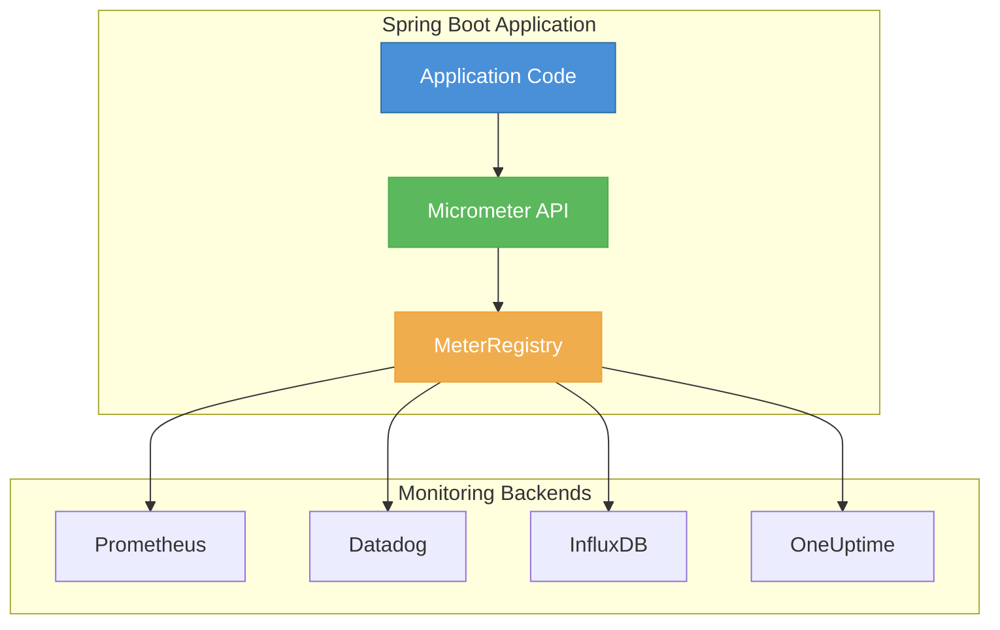
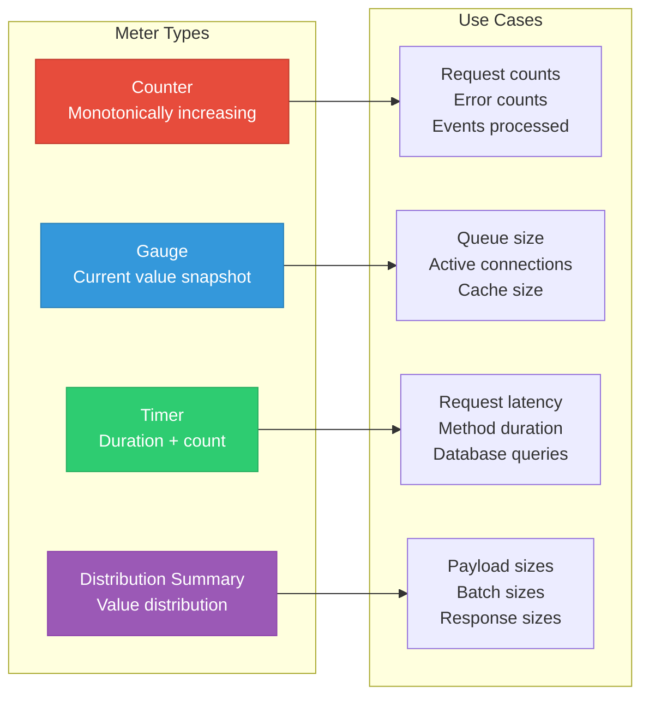
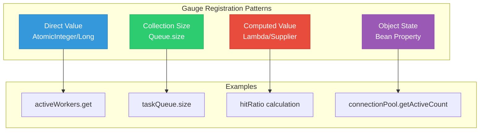
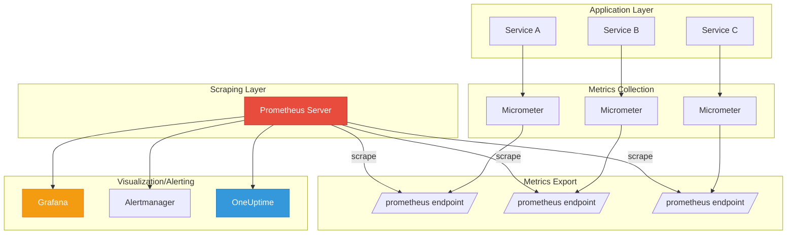
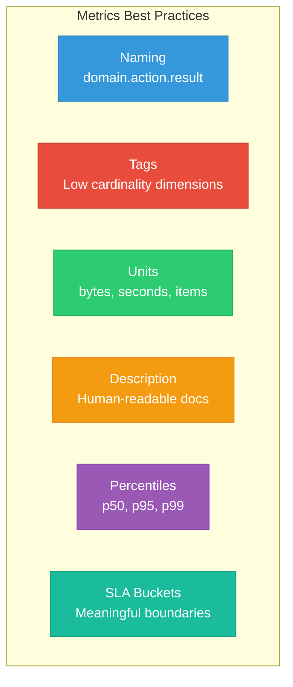

# How to Use Micrometer for Metrics in Spring Boot

Author: [nawazdhandala](https://www.github.com/nawazdhandala)

Tags: Java, Spring Boot, Micrometer, Metrics, Prometheus, Monitoring, Observability

Description: A comprehensive guide to implementing custom metrics in Spring Boot using Micrometer. Learn counters, gauges, timers, and distribution summaries with practical examples.

---

Observability is no longer optional for production systems. While logs tell you what happened and traces show you the flow, metrics answer the critical question: "How is my system performing right now?" Spring Boot's integration with Micrometer provides a vendor-neutral metrics facade that makes instrumenting your applications straightforward and portable.

In this guide, you will learn how to implement custom metrics using Micrometer in Spring Boot applications. We will cover counters, gauges, timers, and distribution summaries with practical, production-ready examples.

## What is Micrometer?

Micrometer is a metrics instrumentation library for JVM-based applications. Think of it as SLF4J for metrics - it provides a common API that works with multiple monitoring systems including Prometheus, Datadog, InfluxDB, and OneUptime.



The beauty of Micrometer lies in its abstraction. You instrument your code once, and switch backends by changing dependencies - no code changes required.

## Setting Up Micrometer in Spring Boot

First, add the necessary dependencies to your `pom.xml`:

```xml
<?xml version="1.0" encoding="UTF-8"?>
<project xmlns="http://maven.apache.org/POM/4.0.0"
         xmlns:xsi="http://www.w3.org/2001/XMLSchema-instance"
         xsi:schemaLocation="http://maven.apache.org/POM/4.0.0 
         http://maven.apache.org/xsd/maven-4.0.0.xsd">
    <modelVersion>4.0.0</modelVersion>
    
    <parent>
        <groupId>org.springframework.boot</groupId>
        <artifactId>spring-boot-starter-parent</artifactId>
        <version>3.2.0</version>
    </parent>
    
    <groupId>com.example</groupId>
    <artifactId>micrometer-demo</artifactId>
    <version>1.0.0</version>
    
    <dependencies>
        <!-- Spring Boot Actuator includes Micrometer core -->
        <dependency>
            <groupId>org.springframework.boot</groupId>
            <artifactId>spring-boot-starter-actuator</artifactId>
        </dependency>
        
        <!-- Web starter for REST endpoints -->
        <dependency>
            <groupId>org.springframework.boot</groupId>
            <artifactId>spring-boot-starter-web</artifactId>
        </dependency>
        
        <!-- Prometheus registry for exposing metrics -->
        <dependency>
            <groupId>io.micrometer</groupId>
            <artifactId>micrometer-registry-prometheus</artifactId>
        </dependency>
    </dependencies>
</project>
```

Configure the actuator endpoints in `application.yml`:

```yaml
# application.yml
# Enable metrics endpoint and Prometheus format
management:
  endpoints:
    web:
      exposure:
        include: health, metrics, prometheus
  metrics:
    export:
      prometheus:
        enabled: true
    tags:
      # Common tags applied to all metrics
      application: ${spring.application.name}
      environment: ${ENVIRONMENT:development}

spring:
  application:
    name: order-service
```

## Understanding Meter Types

Micrometer provides four primary meter types, each designed for specific use cases:



Let us explore each type with practical examples.

## Counters: Tracking Cumulative Values

Counters track values that only increase. They are perfect for counting events like requests, errors, or items processed.

```java
package com.example.metrics;

import io.micrometer.core.instrument.Counter;
import io.micrometer.core.instrument.MeterRegistry;
import org.springframework.stereotype.Service;

/**
 * Service demonstrating counter usage for tracking order events.
 * Counters are ideal for values that only increase over time.
 */
@Service
public class OrderService {
    
    // Counter for tracking total orders placed
    private final Counter ordersPlacedCounter;
    
    // Counter for tracking failed orders
    private final Counter ordersFailedCounter;
    
    // Counter for tracking orders by type
    private final MeterRegistry meterRegistry;
    
    /**
     * Constructor injection of MeterRegistry.
     * Spring Boot auto-configures the registry based on classpath.
     */
    public OrderService(MeterRegistry meterRegistry) {
        this.meterRegistry = meterRegistry;
        
        // Create counter with name and description
        // Convention: use dot-separated names like "domain.action.result"
        this.ordersPlacedCounter = Counter.builder("orders.placed.total")
            .description("Total number of orders placed successfully")
            .tag("service", "order-service")
            .register(meterRegistry);
        
        this.ordersFailedCounter = Counter.builder("orders.failed.total")
            .description("Total number of failed order attempts")
            .tag("service", "order-service")
            .register(meterRegistry);
    }
    
    /**
     * Place an order and increment the appropriate counter.
     * 
     * @param orderType The type of order (standard, express, bulk)
     * @param amount The order amount in cents
     * @return Order ID if successful
     */
    public String placeOrder(String orderType, long amount) {
        try {
            // Business logic here...
            String orderId = processOrder(orderType, amount);
            
            // Increment success counter
            ordersPlacedCounter.increment();
            
            // Also track by order type using dynamic tags
            // This creates separate time series per order type
            Counter.builder("orders.placed")
                .tag("type", orderType)
                .tag("service", "order-service")
                .description("Orders placed by type")
                .register(meterRegistry)
                .increment();
            
            return orderId;
            
        } catch (Exception e) {
            // Increment failure counter with reason tag
            ordersFailedCounter.increment();
            
            Counter.builder("orders.failed")
                .tag("type", orderType)
                .tag("reason", categorizeError(e))
                .tag("service", "order-service")
                .description("Failed orders by type and reason")
                .register(meterRegistry)
                .increment();
            
            throw e;
        }
    }
    
    /**
     * Increment counter by a specific amount.
     * Useful when processing batches.
     */
    public void processBatch(String orderType, int batchSize) {
        // Process batch...
        
        // Increment by batch size
        Counter.builder("orders.processed.batch")
            .tag("type", orderType)
            .register(meterRegistry)
            .increment(batchSize);
    }
    
    private String processOrder(String orderType, long amount) {
        // Simulated order processing
        return "ORD-" + System.currentTimeMillis();
    }
    
    private String categorizeError(Exception e) {
        // Categorize errors for metric tagging
        if (e instanceof IllegalArgumentException) {
            return "validation_error";
        } else if (e.getMessage() != null && e.getMessage().contains("timeout")) {
            return "timeout";
        }
        return "internal_error";
    }
}
```

### Counter Best Practices

1. **Use descriptive names**: Follow the pattern `domain.action.result`
2. **Keep cardinality low**: Avoid high-cardinality tags like user IDs
3. **Use tags wisely**: Tags should represent dimensions you want to filter/group by
4. **Document your counters**: The description helps others understand the metric

## Gauges: Capturing Current State

Gauges represent a current value that can go up or down. They are ideal for measuring things like queue depths, active connections, or cache sizes.

```java
package com.example.metrics;

import io.micrometer.core.instrument.Gauge;
import io.micrometer.core.instrument.MeterRegistry;
import org.springframework.stereotype.Component;

import java.util.concurrent.ConcurrentLinkedQueue;
import java.util.concurrent.atomic.AtomicInteger;

/**
 * Component demonstrating gauge usage for tracking current state.
 * Gauges sample the current value when scraped.
 */
@Component
public class TaskQueueMetrics {
    
    // The queue we want to monitor
    private final ConcurrentLinkedQueue<Task> taskQueue;
    
    // Active workers count
    private final AtomicInteger activeWorkers;
    
    // Cache statistics
    private final CacheManager cacheManager;
    
    /**
     * Register gauges that track the state of our task queue.
     * Gauges use a supplier function that is called when metrics are scraped.
     */
    public TaskQueueMetrics(MeterRegistry meterRegistry, CacheManager cacheManager) {
        this.taskQueue = new ConcurrentLinkedQueue<>();
        this.activeWorkers = new AtomicInteger(0);
        this.cacheManager = cacheManager;
        
        // Gauge for queue size - uses method reference
        // The value is computed when the metric is observed
        Gauge.builder("tasks.queue.size", taskQueue, ConcurrentLinkedQueue::size)
            .description("Current number of tasks waiting in the queue")
            .tag("queue", "main")
            .register(meterRegistry);
        
        // Gauge for active workers using AtomicInteger
        Gauge.builder("workers.active", activeWorkers, AtomicInteger::get)
            .description("Number of workers currently processing tasks")
            .tag("pool", "default")
            .register(meterRegistry);
        
        // Gauge for cache hit ratio - computed value
        Gauge.builder("cache.hit.ratio", cacheManager, cm -> {
                long hits = cm.getHitCount();
                long misses = cm.getMissCount();
                long total = hits + misses;
                return total > 0 ? (double) hits / total : 0.0;
            })
            .description("Cache hit ratio (0.0 to 1.0)")
            .tag("cache", "orders")
            .register(meterRegistry);
        
        // Gauge for memory usage percentage
        Gauge.builder("jvm.memory.used.percentage", () -> {
                Runtime runtime = Runtime.getRuntime();
                long maxMemory = runtime.maxMemory();
                long usedMemory = runtime.totalMemory() - runtime.freeMemory();
                return (double) usedMemory / maxMemory * 100;
            })
            .description("Percentage of heap memory currently used")
            .baseUnit("percent")
            .register(meterRegistry);
    }
    
    /**
     * Add a task to the queue.
     * The gauge automatically reflects the new queue size.
     */
    public void submitTask(Task task) {
        taskQueue.offer(task);
    }
    
    /**
     * Process tasks from the queue.
     * Demonstrates how gauges track state changes automatically.
     */
    public void processNextTask() {
        Task task = taskQueue.poll();
        if (task != null) {
            activeWorkers.incrementAndGet();
            try {
                // Process task...
                task.execute();
            } finally {
                activeWorkers.decrementAndGet();
            }
        }
    }
    
    /**
     * Get current queue depth for monitoring.
     */
    public int getQueueDepth() {
        return taskQueue.size();
    }
}

// Supporting classes
class Task {
    private final String id;
    private final Runnable action;
    
    public Task(String id, Runnable action) {
        this.id = id;
        this.action = action;
    }
    
    public void execute() {
        action.run();
    }
}

class CacheManager {
    private long hitCount = 0;
    private long missCount = 0;
    
    public long getHitCount() { return hitCount; }
    public long getMissCount() { return missCount; }
    
    public void recordHit() { hitCount++; }
    public void recordMiss() { missCount++; }
}
```

### Gauge Patterns



## Timers: Measuring Duration

Timers are the workhorses of application performance monitoring. They capture both the count and total time of events, enabling calculation of throughput and latency percentiles.

```java
package com.example.metrics;

import io.micrometer.core.annotation.Timed;
import io.micrometer.core.instrument.MeterRegistry;
import io.micrometer.core.instrument.Timer;
import org.springframework.stereotype.Service;

import java.time.Duration;
import java.util.concurrent.Callable;

/**
 * Service demonstrating timer usage for measuring operation duration.
 * Timers provide count, total time, and percentile distributions.
 */
@Service
public class PaymentService {
    
    private final Timer paymentProcessingTimer;
    private final Timer externalApiTimer;
    private final MeterRegistry meterRegistry;
    
    public PaymentService(MeterRegistry meterRegistry) {
        this.meterRegistry = meterRegistry;
        
        // Create timer with histogram buckets for percentile calculation
        // SLA boundaries define the buckets for histogram
        this.paymentProcessingTimer = Timer.builder("payment.processing.duration")
            .description("Time to process a payment")
            .tag("service", "payment-service")
            // Publish percentiles that can be aggregated
            .publishPercentiles(0.5, 0.75, 0.95, 0.99)
            // SLA boundaries for histogram buckets
            .serviceLevelObjectives(
                Duration.ofMillis(100),
                Duration.ofMillis(250),
                Duration.ofMillis(500),
                Duration.ofSeconds(1)
            )
            // Enable percentile histograms for server-side calculation
            .publishPercentileHistogram()
            .register(meterRegistry);
        
        // Timer for external API calls
        this.externalApiTimer = Timer.builder("external.api.duration")
            .description("Time spent calling external payment gateway")
            .tag("gateway", "stripe")
            .publishPercentiles(0.5, 0.95, 0.99)
            .register(meterRegistry);
    }
    
    /**
     * Process payment with manual timer recording.
     * Use this approach when you need full control.
     */
    public PaymentResult processPayment(PaymentRequest request) {
        // Start timing
        Timer.Sample sample = Timer.start(meterRegistry);
        
        try {
            // Validate request
            validateRequest(request);
            
            // Call external payment gateway
            PaymentResult result = callPaymentGateway(request);
            
            // Record success with appropriate tags
            sample.stop(Timer.builder("payment.processing.duration")
                .tag("status", "success")
                .tag("method", request.getMethod())
                .register(meterRegistry));
            
            return result;
            
        } catch (ValidationException e) {
            // Record validation failure
            sample.stop(Timer.builder("payment.processing.duration")
                .tag("status", "validation_error")
                .tag("method", request.getMethod())
                .register(meterRegistry));
            throw e;
            
        } catch (GatewayException e) {
            // Record gateway failure
            sample.stop(Timer.builder("payment.processing.duration")
                .tag("status", "gateway_error")
                .tag("method", request.getMethod())
                .register(meterRegistry));
            throw e;
        }
    }
    
    /**
     * Process payment using Timer.record() with a Callable.
     * Cleaner syntax when the operation returns a value.
     */
    public PaymentResult processPaymentAlt(PaymentRequest request) throws Exception {
        return paymentProcessingTimer.recordCallable(() -> {
            validateRequest(request);
            return callPaymentGateway(request);
        });
    }
    
    /**
     * Time a void operation using Runnable.
     */
    public void sendReceipt(String paymentId, String email) {
        paymentProcessingTimer.record(() -> {
            // Send email receipt
            emailService.sendReceipt(paymentId, email);
        });
    }
    
    /**
     * Record duration directly when you have the elapsed time.
     * Useful when timing is done elsewhere.
     */
    public void recordExternalCallDuration(String gateway, long durationMs) {
        Timer.builder("external.api.duration")
            .tag("gateway", gateway)
            .register(meterRegistry)
            .record(Duration.ofMillis(durationMs));
    }
    
    private void validateRequest(PaymentRequest request) {
        if (request.getAmount() <= 0) {
            throw new ValidationException("Invalid amount");
        }
    }
    
    private PaymentResult callPaymentGateway(PaymentRequest request) {
        // Time the external call separately
        return externalApiTimer.record(() -> {
            // Simulated external API call
            try {
                Thread.sleep(50 + (long)(Math.random() * 100));
            } catch (InterruptedException e) {
                Thread.currentThread().interrupt();
            }
            return new PaymentResult("PAY-" + System.currentTimeMillis(), "SUCCESS");
        });
    }
    
    // Email service placeholder
    private final EmailService emailService = new EmailService();
}

// Supporting classes
class PaymentRequest {
    private long amount;
    private String method;
    
    public long getAmount() { return amount; }
    public String getMethod() { return method; }
}

class PaymentResult {
    private final String id;
    private final String status;
    
    public PaymentResult(String id, String status) {
        this.id = id;
        this.status = status;
    }
}

class ValidationException extends RuntimeException {
    public ValidationException(String message) { super(message); }
}

class GatewayException extends RuntimeException {
    public GatewayException(String message) { super(message); }
}

class EmailService {
    public void sendReceipt(String paymentId, String email) {
        // Send email implementation
    }
}
```

### Using @Timed Annotation

Spring Boot provides a convenient annotation-based approach for timing methods:

```java
package com.example.metrics;

import io.micrometer.core.annotation.Timed;
import org.springframework.stereotype.Service;

/**
 * Service using @Timed annotation for automatic timing.
 * Requires TimedAspect bean to be registered.
 */
@Service
public class InventoryService {
    
    /**
     * Check inventory with automatic timing.
     * The annotation creates a timer named "inventory.check"
     */
    @Timed(
        value = "inventory.check",
        description = "Time to check inventory availability",
        percentiles = {0.5, 0.95, 0.99},
        histogram = true
    )
    public boolean checkAvailability(String productId, int quantity) {
        // Check inventory logic
        return getStock(productId) >= quantity;
    }
    
    /**
     * Long-running operation with custom tags.
     */
    @Timed(
        value = "inventory.sync",
        description = "Time to sync inventory with warehouse",
        extraTags = {"operation", "sync", "source", "warehouse"}
    )
    public void syncInventory() {
        // Sync with warehouse system
    }
    
    private int getStock(String productId) {
        // Database lookup
        return 100;
    }
}
```

Enable the `@Timed` annotation by registering the aspect:

```java
package com.example.config;

import io.micrometer.core.aop.TimedAspect;
import io.micrometer.core.instrument.MeterRegistry;
import org.springframework.context.annotation.Bean;
import org.springframework.context.annotation.Configuration;

/**
 * Configuration to enable @Timed annotation support.
 */
@Configuration
public class MetricsConfig {
    
    /**
     * Register TimedAspect to enable @Timed annotation.
     * This creates an AOP aspect that intercepts @Timed methods.
     */
    @Bean
    public TimedAspect timedAspect(MeterRegistry registry) {
        return new TimedAspect(registry);
    }
}
```

## Distribution Summaries: Tracking Value Distributions

Distribution summaries are similar to timers but track non-time values like request sizes, batch sizes, or prices.

```java
package com.example.metrics;

import io.micrometer.core.instrument.DistributionSummary;
import io.micrometer.core.instrument.MeterRegistry;
import org.springframework.stereotype.Service;

/**
 * Service demonstrating distribution summary usage.
 * Distribution summaries track the distribution of non-time values.
 */
@Service
public class FileUploadService {
    
    private final DistributionSummary uploadSizeSummary;
    private final DistributionSummary batchSizeSummary;
    private final MeterRegistry meterRegistry;
    
    public FileUploadService(MeterRegistry meterRegistry) {
        this.meterRegistry = meterRegistry;
        
        // Track file upload sizes with percentiles
        this.uploadSizeSummary = DistributionSummary.builder("file.upload.size")
            .description("Size of uploaded files in bytes")
            .baseUnit("bytes")
            .tag("service", "upload-service")
            // Publish client-side percentiles
            .publishPercentiles(0.5, 0.75, 0.95, 0.99)
            // Define SLA boundaries (file size limits)
            .serviceLevelObjectives(
                1024 * 1024,      // 1MB
                5 * 1024 * 1024,  // 5MB
                10 * 1024 * 1024, // 10MB
                50 * 1024 * 1024  // 50MB
            )
            // Enable histogram for server-side percentile calculation
            .publishPercentileHistogram()
            // Minimum expected value
            .minimumExpectedValue(1024.0)  // 1KB
            // Maximum expected value - helps optimize histogram buckets
            .maximumExpectedValue(100.0 * 1024 * 1024)  // 100MB
            .register(meterRegistry);
        
        // Track batch processing sizes
        this.batchSizeSummary = DistributionSummary.builder("batch.processing.size")
            .description("Number of items in each batch")
            .baseUnit("items")
            .publishPercentiles(0.5, 0.95)
            .register(meterRegistry);
    }
    
    /**
     * Upload a file and record its size.
     */
    public String uploadFile(String filename, byte[] content, String contentType) {
        // Record the file size
        uploadSizeSummary.record(content.length);
        
        // Also record with content type tag for breakdown
        DistributionSummary.builder("file.upload.size.by.type")
            .tag("content-type", normalizeContentType(contentType))
            .register(meterRegistry)
            .record(content.length);
        
        // Process upload...
        return storeFile(filename, content);
    }
    
    /**
     * Process a batch and record the batch size.
     */
    public void processBatch(String batchType, java.util.List<?> items) {
        // Record batch size
        batchSizeSummary.record(items.size());
        
        // Track by batch type
        DistributionSummary.builder("batch.processing.size")
            .tag("type", batchType)
            .register(meterRegistry)
            .record(items.size());
        
        // Process items...
        for (Object item : items) {
            processItem(item);
        }
    }
    
    /**
     * Track response payload sizes.
     */
    public void recordResponseSize(String endpoint, long sizeInBytes) {
        DistributionSummary.builder("http.response.size")
            .tag("endpoint", endpoint)
            .baseUnit("bytes")
            .publishPercentiles(0.5, 0.95, 0.99)
            .register(meterRegistry)
            .record(sizeInBytes);
    }
    
    private String normalizeContentType(String contentType) {
        // Normalize to prevent high cardinality
        if (contentType.startsWith("image/")) return "image";
        if (contentType.startsWith("video/")) return "video";
        if (contentType.startsWith("text/")) return "text";
        if (contentType.contains("json")) return "json";
        if (contentType.contains("xml")) return "xml";
        return "other";
    }
    
    private String storeFile(String filename, byte[] content) {
        return "file-" + System.currentTimeMillis();
    }
    
    private void processItem(Object item) {
        // Process individual item
    }
}
```

## Metrics Architecture Patterns

Understanding how metrics flow through your system helps design effective observability:



## Custom Tags and Dimensional Metrics

Tags (also called labels) add dimensions to your metrics, enabling powerful filtering and grouping:

```java
package com.example.metrics;

import io.micrometer.core.instrument.MeterRegistry;
import io.micrometer.core.instrument.Tag;
import io.micrometer.core.instrument.Tags;
import io.micrometer.core.instrument.Timer;
import io.micrometer.core.instrument.Counter;
import org.springframework.stereotype.Service;

import java.util.List;

/**
 * Service demonstrating effective tag usage for dimensional metrics.
 * Tags enable filtering, grouping, and aggregation in dashboards.
 */
@Service
public class ApiService {
    
    private final MeterRegistry meterRegistry;
    
    public ApiService(MeterRegistry meterRegistry) {
        this.meterRegistry = meterRegistry;
    }
    
    /**
     * Record API request with multiple dimensions.
     * Each unique tag combination creates a separate time series.
     */
    public void recordApiRequest(
            String endpoint,
            String method,
            int statusCode,
            long durationMs
    ) {
        // Create tags for this request
        // Keep cardinality manageable - avoid user IDs, session IDs, etc.
        Tags tags = Tags.of(
            Tag.of("endpoint", normalizeEndpoint(endpoint)),
            Tag.of("method", method),
            Tag.of("status", categorizeStatus(statusCode)),
            Tag.of("status_code", String.valueOf(statusCode))
        );
        
        // Record request count
        Counter.builder("api.requests")
            .tags(tags)
            .description("Total API requests")
            .register(meterRegistry)
            .increment();
        
        // Record request duration
        Timer.builder("api.request.duration")
            .tags(tags)
            .description("API request duration")
            .publishPercentiles(0.5, 0.95, 0.99)
            .register(meterRegistry)
            .record(java.time.Duration.ofMillis(durationMs));
    }
    
    /**
     * Normalize endpoint to prevent cardinality explosion.
     * Replace dynamic segments with placeholders.
     */
    private String normalizeEndpoint(String endpoint) {
        // Replace IDs in paths with placeholders
        // /users/123/orders/456 becomes /users/{id}/orders/{id}
        return endpoint
            .replaceAll("/\\d+", "/{id}")
            .replaceAll("/[a-f0-9-]{36}", "/{uuid}");
    }
    
    /**
     * Categorize HTTP status codes for grouping.
     */
    private String categorizeStatus(int statusCode) {
        if (statusCode >= 200 && statusCode < 300) return "success";
        if (statusCode >= 400 && statusCode < 500) return "client_error";
        if (statusCode >= 500) return "server_error";
        return "other";
    }
    
    /**
     * Record business metrics with customer segments.
     * Be careful with cardinality - use categories, not raw values.
     */
    public void recordOrderMetrics(Order order) {
        Tags tags = Tags.of(
            Tag.of("region", order.getRegion()),
            Tag.of("customer_tier", order.getCustomerTier()),
            Tag.of("payment_method", order.getPaymentMethod())
            // DO NOT add: customer_id, order_id, etc.
        );
        
        // Order value distribution
        io.micrometer.core.instrument.DistributionSummary
            .builder("order.value")
            .tags(tags)
            .baseUnit("cents")
            .publishPercentiles(0.5, 0.95)
            .register(meterRegistry)
            .record(order.getTotalCents());
        
        // Items per order
        io.micrometer.core.instrument.DistributionSummary
            .builder("order.items")
            .tags(tags)
            .register(meterRegistry)
            .record(order.getItemCount());
    }
}

// Supporting class
class Order {
    private String region;
    private String customerTier;
    private String paymentMethod;
    private long totalCents;
    private int itemCount;
    
    public String getRegion() { return region; }
    public String getCustomerTier() { return customerTier; }
    public String getPaymentMethod() { return paymentMethod; }
    public long getTotalCents() { return totalCents; }
    public int getItemCount() { return itemCount; }
}
```

## Common Tags Configuration

Apply common tags to all metrics for consistent dimensional data:

```java
package com.example.config;

import io.micrometer.core.instrument.MeterRegistry;
import io.micrometer.core.instrument.config.MeterFilter;
import org.springframework.beans.factory.annotation.Value;
import org.springframework.boot.actuate.autoconfigure.metrics.MeterRegistryCustomizer;
import org.springframework.context.annotation.Bean;
import org.springframework.context.annotation.Configuration;

import java.net.InetAddress;
import java.net.UnknownHostException;

/**
 * Configuration for common tags applied to all metrics.
 * These tags help identify metric sources across services.
 */
@Configuration
public class CommonTagsConfig {
    
    @Value("${spring.application.name}")
    private String applicationName;
    
    @Value("${ENVIRONMENT:development}")
    private String environment;
    
    @Value("${VERSION:unknown}")
    private String version;
    
    /**
     * Customize MeterRegistry to add common tags to all metrics.
     */
    @Bean
    public MeterRegistryCustomizer<MeterRegistry> commonTags() {
        return registry -> registry.config()
            .commonTags(
                "application", applicationName,
                "environment", environment,
                "version", version,
                "host", getHostname()
            );
    }
    
    /**
     * Add meter filters for renaming, ignoring, or transforming metrics.
     */
    @Bean
    public MeterRegistryCustomizer<MeterRegistry> meterFilters() {
        return registry -> registry.config()
            // Ignore metrics we do not need
            .meterFilter(MeterFilter.deny(id -> 
                id.getName().startsWith("jvm.gc.pause")))
            
            // Rename metrics for consistency
            .meterFilter(MeterFilter.renameTag("http.server.requests", 
                "status", "http_status"))
            
            // Limit cardinality of URI tag
            .meterFilter(MeterFilter.maximumAllowableTags(
                "http.server.requests", "uri", 100, 
                MeterFilter.deny()));
    }
    
    private String getHostname() {
        try {
            return InetAddress.getLocalHost().getHostName();
        } catch (UnknownHostException e) {
            return "unknown";
        }
    }
}
```

## Composite Metrics Example

Here is a complete example showing how to combine multiple metric types for comprehensive monitoring:

```java
package com.example.metrics;

import io.micrometer.core.instrument.*;
import org.springframework.scheduling.annotation.Scheduled;
import org.springframework.stereotype.Component;

import java.time.Duration;
import java.util.concurrent.ConcurrentHashMap;
import java.util.concurrent.atomic.AtomicLong;

/**
 * Comprehensive metrics example for a message processing system.
 * Demonstrates counters, gauges, timers, and distribution summaries
 * working together for full observability.
 */
@Component
public class MessageProcessingMetrics {
    
    private final MeterRegistry registry;
    
    // Counters for message events
    private final Counter messagesReceived;
    private final Counter messagesProcessed;
    private final Counter messagesFailed;
    
    // Gauge backing values
    private final AtomicLong queueDepth = new AtomicLong(0);
    private final AtomicLong activeConsumers = new AtomicLong(0);
    
    // Timer for processing duration
    private final Timer processingTimer;
    
    // Distribution summary for message sizes
    private final DistributionSummary messageSizeSummary;
    
    // Track lag per partition
    private final ConcurrentHashMap<String, AtomicLong> partitionLag;
    
    public MessageProcessingMetrics(MeterRegistry registry) {
        this.registry = registry;
        this.partitionLag = new ConcurrentHashMap<>();
        
        // Initialize counters
        this.messagesReceived = Counter.builder("messages.received")
            .description("Total messages received from queue")
            .tag("component", "consumer")
            .register(registry);
        
        this.messagesProcessed = Counter.builder("messages.processed")
            .description("Total messages successfully processed")
            .tag("component", "consumer")
            .register(registry);
        
        this.messagesFailed = Counter.builder("messages.failed")
            .description("Total messages that failed processing")
            .tag("component", "consumer")
            .register(registry);
        
        // Initialize gauges
        Gauge.builder("messages.queue.depth", queueDepth, AtomicLong::get)
            .description("Current depth of the message queue")
            .tag("component", "consumer")
            .register(registry);
        
        Gauge.builder("consumers.active", activeConsumers, AtomicLong::get)
            .description("Number of active message consumers")
            .tag("component", "consumer")
            .register(registry);
        
        // Initialize timer with SLA boundaries
        this.processingTimer = Timer.builder("messages.processing.duration")
            .description("Time to process a message")
            .tag("component", "consumer")
            .publishPercentiles(0.5, 0.75, 0.95, 0.99)
            .serviceLevelObjectives(
                Duration.ofMillis(10),
                Duration.ofMillis(50),
                Duration.ofMillis(100),
                Duration.ofMillis(500)
            )
            .publishPercentileHistogram()
            .register(registry);
        
        // Initialize distribution summary
        this.messageSizeSummary = DistributionSummary.builder("messages.size")
            .description("Size of processed messages")
            .baseUnit("bytes")
            .tag("component", "consumer")
            .publishPercentiles(0.5, 0.95, 0.99)
            .publishPercentileHistogram()
            .register(registry);
    }
    
    /**
     * Process a message and record all relevant metrics.
     */
    public void processMessage(Message message) {
        messagesReceived.increment();
        
        Timer.Sample sample = Timer.start(registry);
        
        try {
            // Increment active consumers
            activeConsumers.incrementAndGet();
            
            // Record message size
            messageSizeSummary.record(message.getSizeBytes());
            
            // Process the message
            doProcess(message);
            
            // Record success
            messagesProcessed.increment();
            
            // Stop timer with success status
            sample.stop(Timer.builder("messages.processing.duration")
                .tag("status", "success")
                .tag("type", message.getType())
                .register(registry));
            
        } catch (Exception e) {
            // Record failure
            messagesFailed.increment();
            
            // Stop timer with failure status
            sample.stop(Timer.builder("messages.processing.duration")
                .tag("status", "failed")
                .tag("type", message.getType())
                .tag("error", e.getClass().getSimpleName())
                .register(registry));
            
            throw e;
            
        } finally {
            activeConsumers.decrementAndGet();
        }
    }
    
    /**
     * Update queue depth - called periodically or on queue changes.
     */
    public void updateQueueDepth(long depth) {
        queueDepth.set(depth);
    }
    
    /**
     * Update consumer lag for a partition.
     */
    public void updatePartitionLag(String partition, long lag) {
        partitionLag.computeIfAbsent(partition, p -> {
            AtomicLong lagValue = new AtomicLong(lag);
            // Register gauge for this partition
            Gauge.builder("consumer.lag", lagValue, AtomicLong::get)
                .description("Consumer lag for partition")
                .tag("partition", partition)
                .register(registry);
            return lagValue;
        }).set(lag);
    }
    
    /**
     * Record batch processing metrics.
     */
    public void recordBatchProcessed(int batchSize, long durationMs) {
        // Record batch size distribution
        DistributionSummary.builder("messages.batch.size")
            .tag("component", "consumer")
            .register(registry)
            .record(batchSize);
        
        // Record batch processing time
        Timer.builder("messages.batch.duration")
            .tag("component", "consumer")
            .register(registry)
            .record(Duration.ofMillis(durationMs));
        
        // Calculate and record throughput
        double throughput = batchSize / (durationMs / 1000.0);
        Gauge.builder("messages.throughput", () -> throughput)
            .description("Messages processed per second")
            .baseUnit("messages/second")
            .register(registry);
    }
    
    /**
     * Scheduled task to compute and publish derived metrics.
     */
    @Scheduled(fixedRate = 60000)
    public void publishDerivedMetrics() {
        // Calculate success rate
        double total = messagesReceived.count();
        double failed = messagesFailed.count();
        double successRate = total > 0 ? (total - failed) / total : 1.0;
        
        // Publish as gauge (will be overwritten each minute)
        Gauge.builder("messages.success.rate", () -> successRate)
            .description("Message processing success rate")
            .tag("component", "consumer")
            .register(registry);
    }
    
    private void doProcess(Message message) {
        // Actual message processing logic
        try {
            Thread.sleep((long) (Math.random() * 50));
        } catch (InterruptedException e) {
            Thread.currentThread().interrupt();
        }
    }
}

// Supporting class
class Message {
    private String id;
    private String type;
    private int sizeBytes;
    private byte[] payload;
    
    public String getId() { return id; }
    public String getType() { return type; }
    public int getSizeBytes() { return sizeBytes; }
    public byte[] getPayload() { return payload; }
}
```

## Exposing Metrics to Prometheus

Once you have instrumented your application, expose the metrics endpoint:

```yaml
# application.yml
management:
  endpoints:
    web:
      exposure:
        include: prometheus, health, metrics
      base-path: /actuator
  endpoint:
    prometheus:
      enabled: true
    health:
      show-details: always
  prometheus:
    metrics:
      export:
        enabled: true
```

The `/actuator/prometheus` endpoint will expose metrics in Prometheus format:

```
# HELP orders_placed_total Total number of orders placed successfully
# TYPE orders_placed_total counter
orders_placed_total{application="order-service",service="order-service"} 1523.0

# HELP payment_processing_duration_seconds Time to process a payment
# TYPE payment_processing_duration_seconds histogram
payment_processing_duration_seconds_bucket{application="order-service",le="0.1"} 892.0
payment_processing_duration_seconds_bucket{application="order-service",le="0.25"} 1203.0
payment_processing_duration_seconds_bucket{application="order-service",le="0.5"} 1489.0
payment_processing_duration_seconds_bucket{application="order-service",le="1.0"} 1520.0
payment_processing_duration_seconds_bucket{application="order-service",le="+Inf"} 1523.0
payment_processing_duration_seconds_count{application="order-service"} 1523.0
payment_processing_duration_seconds_sum{application="order-service"} 198.45

# HELP tasks_queue_size Current number of tasks waiting in the queue
# TYPE tasks_queue_size gauge
tasks_queue_size{application="order-service",queue="main"} 42.0
```

## Integration with OneUptime

OneUptime can ingest Prometheus metrics through its OpenTelemetry endpoint. Configure the OTLP exporter:

```xml
<!-- Add OTLP registry dependency -->
<dependency>
    <groupId>io.micrometer</groupId>
    <artifactId>micrometer-registry-otlp</artifactId>
</dependency>
```

```yaml
# application.yml for OTLP export
management:
  otlp:
    metrics:
      export:
        enabled: true
        url: https://otlp.oneuptime.com/v1/metrics
        headers:
          x-oneuptime-token: ${ONEUPTIME_TOKEN}
        step: 60s
```

## Best Practices Summary

1. **Naming conventions**: Use dot-separated, lowercase names like `orders.placed.total`
2. **Tag cardinality**: Keep tag values bounded - avoid IDs, timestamps, or unbounded strings
3. **Base units**: Always specify units (bytes, seconds, items)
4. **Descriptions**: Add meaningful descriptions for documentation
5. **Percentiles**: Use histograms for server-side aggregation in distributed systems
6. **Common tags**: Apply service/environment tags globally
7. **SLA boundaries**: Define meaningful buckets for your SLOs



## Conclusion

Micrometer provides a powerful, vendor-neutral way to instrument your Spring Boot applications. By understanding when to use counters, gauges, timers, and distribution summaries, you can build comprehensive observability into your services.

Start with the basics - track request counts and latencies. Then expand to business metrics that matter to your stakeholders. Remember that metrics are for understanding system behavior, not for debugging individual requests - that is what traces are for.

The combination of well-designed metrics, proper tagging, and a capable backend like OneUptime gives you the visibility needed to operate reliable systems at scale.
