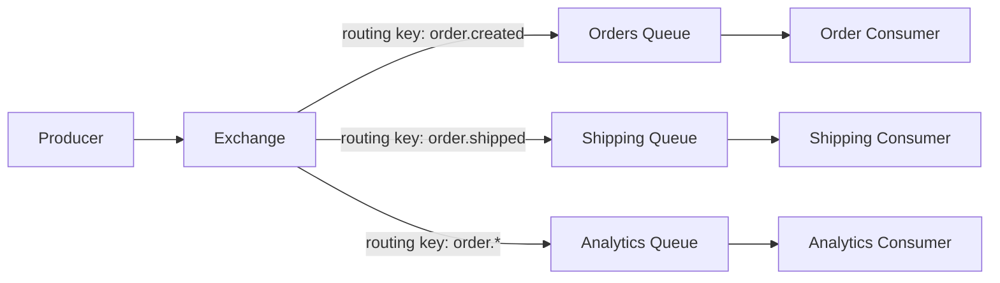
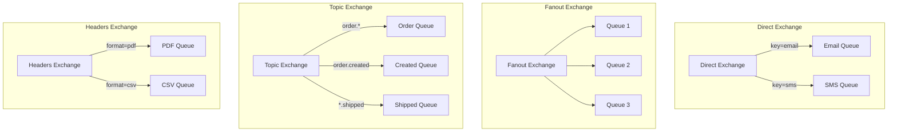
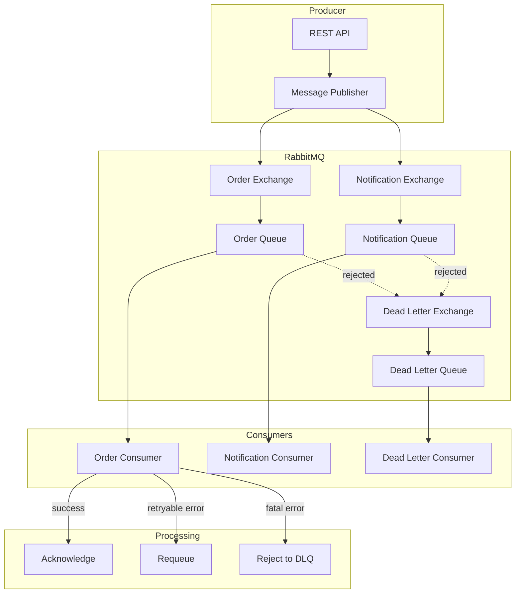

# How to Use RabbitMQ with Spring Boot

Author: [nawazdhandala](https://www.github.com/nawazdhandala)

Tags: Java, Spring Boot, RabbitMQ, Messaging, AMQP, Microservices, Event-Driven

Description: A practical guide to integrating RabbitMQ with Spring Boot for message-driven architectures. Learn exchanges, queues, consumers, and error handling patterns.

---

> Modern distributed systems rely on asynchronous messaging to decouple services, handle peak loads, and build resilient architectures. RabbitMQ is one of the most popular message brokers, and Spring Boot makes integration seamless with its AMQP starter.

RabbitMQ implements the Advanced Message Queuing Protocol (AMQP) and provides features like message acknowledgment, routing, dead letter queues, and clustering. Spring AMQP abstracts the complexity while giving you full control when needed.

---

## Understanding RabbitMQ Concepts

Before diving into code, let's understand how RabbitMQ routes messages:



Key components:
- **Producer**: Application that sends messages
- **Exchange**: Routes messages to queues based on routing rules
- **Queue**: Buffer that stores messages
- **Consumer**: Application that receives and processes messages
- **Binding**: Rule that links an exchange to a queue

### Exchange Types

RabbitMQ supports four exchange types:



1. **Direct**: Routes to queues with exact routing key match
2. **Fanout**: Broadcasts to all bound queues (ignores routing key)
3. **Topic**: Routes using wildcard patterns (* matches one word, # matches zero or more)
4. **Headers**: Routes based on message headers instead of routing key

---

## Getting Started

### Dependencies

Add the Spring AMQP starter to your `pom.xml`:

```xml
<!-- pom.xml -->
<dependencies>
    <!-- Spring AMQP for RabbitMQ integration -->
    <dependency>
        <groupId>org.springframework.boot</groupId>
        <artifactId>spring-boot-starter-amqp</artifactId>
    </dependency>
    
    <!-- Web starter for REST endpoints -->
    <dependency>
        <groupId>org.springframework.boot</groupId>
        <artifactId>spring-boot-starter-web</artifactId>
    </dependency>
    
    <!-- JSON serialization for messages -->
    <dependency>
        <groupId>com.fasterxml.jackson.core</groupId>
        <artifactId>jackson-databind</artifactId>
    </dependency>
    
    <!-- Lombok to reduce boilerplate -->
    <dependency>
        <groupId>org.projectlombok</groupId>
        <artifactId>lombok</artifactId>
        <optional>true</optional>
    </dependency>
    
    <!-- Test dependencies -->
    <dependency>
        <groupId>org.springframework.boot</groupId>
        <artifactId>spring-boot-starter-test</artifactId>
        <scope>test</scope>
    </dependency>
    <dependency>
        <groupId>org.springframework.amqp</groupId>
        <artifactId>spring-rabbit-test</artifactId>
        <scope>test</scope>
    </dependency>
</dependencies>
```

For Gradle users:

```groovy
// build.gradle
dependencies {
    // Spring AMQP for RabbitMQ integration
    implementation 'org.springframework.boot:spring-boot-starter-amqp'
    
    // Web starter for REST endpoints
    implementation 'org.springframework.boot:spring-boot-starter-web'
    
    // JSON serialization
    implementation 'com.fasterxml.jackson.core:jackson-databind'
    
    // Lombok for reducing boilerplate
    compileOnly 'org.projectlombok:lombok'
    annotationProcessor 'org.projectlombok:lombok'
    
    // Test dependencies
    testImplementation 'org.springframework.boot:spring-boot-starter-test'
    testImplementation 'org.springframework.amqp:spring-rabbit-test'
}
```

### Application Configuration

Configure RabbitMQ connection in `application.yml`:

```yaml
# application.yml
spring:
  rabbitmq:
    # Connection settings
    host: localhost
    port: 5672
    username: guest
    password: guest
    virtual-host: /
    
    # Connection pool settings
    connection-timeout: 10000
    
    # Publisher confirms for reliable publishing
    publisher-confirm-type: correlated
    publisher-returns: true
    
    # Consumer settings
    listener:
      simple:
        # Manual acknowledgment for reliable processing
        acknowledge-mode: manual
        # Number of concurrent consumers per listener
        concurrency: 3
        max-concurrency: 10
        # Prefetch count - messages fetched before ack
        prefetch: 10
        # Retry settings
        retry:
          enabled: true
          initial-interval: 1000
          max-attempts: 3
          max-interval: 10000
          multiplier: 2.0
```

---

## Basic Configuration

### RabbitMQ Configuration Class

Create the configuration class that defines exchanges, queues, and bindings:

```java
// config/RabbitMQConfig.java
package com.example.messaging.config;

import org.springframework.amqp.core.*;
import org.springframework.amqp.rabbit.connection.ConnectionFactory;
import org.springframework.amqp.rabbit.core.RabbitTemplate;
import org.springframework.amqp.support.converter.Jackson2JsonMessageConverter;
import org.springframework.amqp.support.converter.MessageConverter;
import org.springframework.context.annotation.Bean;
import org.springframework.context.annotation.Configuration;

@Configuration
public class RabbitMQConfig {

    // Queue names as constants for type safety
    public static final String ORDER_QUEUE = "order.queue";
    public static final String NOTIFICATION_QUEUE = "notification.queue";
    public static final String DEAD_LETTER_QUEUE = "dead-letter.queue";
    
    // Exchange names
    public static final String ORDER_EXCHANGE = "order.exchange";
    public static final String NOTIFICATION_EXCHANGE = "notification.exchange";
    public static final String DEAD_LETTER_EXCHANGE = "dead-letter.exchange";
    
    // Routing keys
    public static final String ORDER_ROUTING_KEY = "order.created";
    public static final String NOTIFICATION_ROUTING_KEY = "notification.#";

    // Configure JSON message converter for serialization
    @Bean
    public MessageConverter jsonMessageConverter() {
        return new Jackson2JsonMessageConverter();
    }

    // Configure RabbitTemplate with JSON converter and publisher confirms
    @Bean
    public RabbitTemplate rabbitTemplate(ConnectionFactory connectionFactory) {
        RabbitTemplate template = new RabbitTemplate(connectionFactory);
        template.setMessageConverter(jsonMessageConverter());
        
        // Enable publisher confirms for reliable publishing
        template.setConfirmCallback((correlationData, ack, cause) -> {
            if (ack) {
                System.out.println("Message confirmed: " + correlationData);
            } else {
                System.err.println("Message not confirmed: " + cause);
            }
        });
        
        // Enable returns for unroutable messages
        template.setReturnsCallback(returned -> {
            System.err.println("Message returned: " + returned.getMessage());
            System.err.println("Reply code: " + returned.getReplyCode());
            System.err.println("Reply text: " + returned.getReplyText());
        });
        
        return template;
    }

    // Dead Letter Exchange for failed messages
    @Bean
    public DirectExchange deadLetterExchange() {
        return new DirectExchange(DEAD_LETTER_EXCHANGE);
    }

    // Dead Letter Queue receives failed messages
    @Bean
    public Queue deadLetterQueue() {
        return QueueBuilder.durable(DEAD_LETTER_QUEUE).build();
    }

    // Bind dead letter queue to dead letter exchange
    @Bean
    public Binding deadLetterBinding() {
        return BindingBuilder
            .bind(deadLetterQueue())
            .to(deadLetterExchange())
            .with("dead-letter");
    }

    // Order Exchange - Direct type for exact routing key matching
    @Bean
    public DirectExchange orderExchange() {
        return new DirectExchange(ORDER_EXCHANGE);
    }

    // Order Queue with dead letter configuration
    @Bean
    public Queue orderQueue() {
        return QueueBuilder.durable(ORDER_QUEUE)
            // Route rejected messages to dead letter exchange
            .withArgument("x-dead-letter-exchange", DEAD_LETTER_EXCHANGE)
            .withArgument("x-dead-letter-routing-key", "dead-letter")
            // Message TTL - messages expire after 24 hours
            .withArgument("x-message-ttl", 86400000)
            .build();
    }

    // Bind order queue to order exchange
    @Bean
    public Binding orderBinding() {
        return BindingBuilder
            .bind(orderQueue())
            .to(orderExchange())
            .with(ORDER_ROUTING_KEY);
    }

    // Notification Exchange - Topic type for pattern matching
    @Bean
    public TopicExchange notificationExchange() {
        return new TopicExchange(NOTIFICATION_EXCHANGE);
    }

    // Notification Queue
    @Bean
    public Queue notificationQueue() {
        return QueueBuilder.durable(NOTIFICATION_QUEUE)
            .withArgument("x-dead-letter-exchange", DEAD_LETTER_EXCHANGE)
            .withArgument("x-dead-letter-routing-key", "dead-letter")
            .build();
    }

    // Bind notification queue with wildcard pattern
    @Bean
    public Binding notificationBinding() {
        return BindingBuilder
            .bind(notificationQueue())
            .to(notificationExchange())
            .with(NOTIFICATION_ROUTING_KEY);
    }
}
```

---

## Message Models

Define the message objects that will be serialized to JSON:

```java
// model/OrderMessage.java
package com.example.messaging.model;

import lombok.AllArgsConstructor;
import lombok.Builder;
import lombok.Data;
import lombok.NoArgsConstructor;

import java.math.BigDecimal;
import java.time.Instant;
import java.util.List;

@Data
@Builder
@NoArgsConstructor
@AllArgsConstructor
public class OrderMessage {
    
    // Unique order identifier
    private String orderId;
    
    // Customer information
    private String customerId;
    private String customerEmail;
    
    // Order details
    private List<OrderItem> items;
    private BigDecimal totalAmount;
    private String currency;
    
    // Timestamps
    private Instant createdAt;
    private Instant processedAt;
    
    // Order status
    private OrderStatus status;
    
    // Nested class for order items
    @Data
    @Builder
    @NoArgsConstructor
    @AllArgsConstructor
    public static class OrderItem {
        private String productId;
        private String productName;
        private int quantity;
        private BigDecimal unitPrice;
    }
    
    // Order status enum
    public enum OrderStatus {
        CREATED,
        PROCESSING,
        CONFIRMED,
        SHIPPED,
        DELIVERED,
        CANCELLED
    }
}
```

```java
// model/NotificationMessage.java
package com.example.messaging.model;

import lombok.AllArgsConstructor;
import lombok.Builder;
import lombok.Data;
import lombok.NoArgsConstructor;

import java.time.Instant;
import java.util.Map;

@Data
@Builder
@NoArgsConstructor
@AllArgsConstructor
public class NotificationMessage {
    
    // Notification type for routing
    private NotificationType type;
    
    // Recipient information
    private String recipientId;
    private String recipientEmail;
    private String recipientPhone;
    
    // Notification content
    private String subject;
    private String body;
    private String templateId;
    
    // Template variables for dynamic content
    private Map<String, Object> templateVariables;
    
    // Priority for processing order
    private Priority priority;
    
    // Metadata
    private Instant createdAt;
    private String correlationId;
    
    public enum NotificationType {
        EMAIL,
        SMS,
        PUSH,
        IN_APP
    }
    
    public enum Priority {
        LOW,
        NORMAL,
        HIGH,
        URGENT
    }
}
```

---

## Producer Implementation

### Message Publisher Service

Create a service that publishes messages to RabbitMQ:

```java
// service/MessagePublisher.java
package com.example.messaging.service;

import com.example.messaging.config.RabbitMQConfig;
import com.example.messaging.model.NotificationMessage;
import com.example.messaging.model.OrderMessage;
import lombok.RequiredArgsConstructor;
import lombok.extern.slf4j.Slf4j;
import org.springframework.amqp.core.MessagePostProcessor;
import org.springframework.amqp.rabbit.core.RabbitTemplate;
import org.springframework.stereotype.Service;

import java.util.UUID;

@Slf4j
@Service
@RequiredArgsConstructor
public class MessagePublisher {

    private final RabbitTemplate rabbitTemplate;

    // Publish order message to order exchange
    public void publishOrderCreated(OrderMessage order) {
        log.info("Publishing order created event: {}", order.getOrderId());
        
        // Convert and send with correlation ID for tracking
        rabbitTemplate.convertAndSend(
            RabbitMQConfig.ORDER_EXCHANGE,
            RabbitMQConfig.ORDER_ROUTING_KEY,
            order,
            createMessagePostProcessor(order.getOrderId())
        );
        
        log.info("Order message published successfully: {}", order.getOrderId());
    }

    // Publish notification with dynamic routing key
    public void publishNotification(NotificationMessage notification) {
        // Build routing key based on notification type
        String routingKey = "notification." + notification.getType().name().toLowerCase();
        
        log.info("Publishing notification: {} with routing key: {}", 
            notification.getCorrelationId(), routingKey);
        
        rabbitTemplate.convertAndSend(
            RabbitMQConfig.NOTIFICATION_EXCHANGE,
            routingKey,
            notification,
            createMessagePostProcessor(notification.getCorrelationId())
        );
        
        log.info("Notification published successfully: {}", notification.getCorrelationId());
    }

    // Publish with priority header
    public void publishPriorityNotification(NotificationMessage notification) {
        String routingKey = "notification." + notification.getType().name().toLowerCase();
        
        rabbitTemplate.convertAndSend(
            RabbitMQConfig.NOTIFICATION_EXCHANGE,
            routingKey,
            notification,
            message -> {
                // Set priority (0-9, higher is more important)
                int priority = switch (notification.getPriority()) {
                    case URGENT -> 9;
                    case HIGH -> 7;
                    case NORMAL -> 5;
                    case LOW -> 3;
                };
                message.getMessageProperties().setPriority(priority);
                message.getMessageProperties().setCorrelationId(notification.getCorrelationId());
                return message;
            }
        );
    }

    // Publish with delay using RabbitMQ delayed message plugin
    public void publishDelayedNotification(NotificationMessage notification, long delayMs) {
        String routingKey = "notification." + notification.getType().name().toLowerCase();
        
        log.info("Publishing delayed notification: {} with delay: {}ms", 
            notification.getCorrelationId(), delayMs);
        
        rabbitTemplate.convertAndSend(
            RabbitMQConfig.NOTIFICATION_EXCHANGE,
            routingKey,
            notification,
            message -> {
                // Set delay header for delayed message plugin
                message.getMessageProperties().setDelay((int) delayMs);
                message.getMessageProperties().setCorrelationId(notification.getCorrelationId());
                return message;
            }
        );
    }

    // Create message post processor for setting headers
    private MessagePostProcessor createMessagePostProcessor(String correlationId) {
        return message -> {
            // Set correlation ID for message tracking
            message.getMessageProperties().setCorrelationId(
                correlationId != null ? correlationId : UUID.randomUUID().toString()
            );
            // Set content type
            message.getMessageProperties().setContentType("application/json");
            // Set timestamp
            message.getMessageProperties().setTimestamp(new java.util.Date());
            return message;
        };
    }
}
```

### REST Controller for Publishing

Expose REST endpoints to publish messages:

```java
// controller/MessageController.java
package com.example.messaging.controller;

import com.example.messaging.model.NotificationMessage;
import com.example.messaging.model.OrderMessage;
import com.example.messaging.service.MessagePublisher;
import lombok.RequiredArgsConstructor;
import org.springframework.http.ResponseEntity;
import org.springframework.web.bind.annotation.*;

import java.math.BigDecimal;
import java.time.Instant;
import java.util.List;
import java.util.Map;
import java.util.UUID;

@RestController
@RequestMapping("/api/messages")
@RequiredArgsConstructor
public class MessageController {

    private final MessagePublisher messagePublisher;

    // Endpoint to publish an order
    @PostMapping("/orders")
    public ResponseEntity<Map<String, String>> publishOrder(@RequestBody OrderMessage order) {
        // Set defaults if not provided
        if (order.getOrderId() == null) {
            order.setOrderId(UUID.randomUUID().toString());
        }
        if (order.getCreatedAt() == null) {
            order.setCreatedAt(Instant.now());
        }
        if (order.getStatus() == null) {
            order.setStatus(OrderMessage.OrderStatus.CREATED);
        }
        
        messagePublisher.publishOrderCreated(order);
        
        return ResponseEntity.ok(Map.of(
            "status", "published",
            "orderId", order.getOrderId()
        ));
    }

    // Endpoint to publish a notification
    @PostMapping("/notifications")
    public ResponseEntity<Map<String, String>> publishNotification(
            @RequestBody NotificationMessage notification) {
        
        // Set defaults
        if (notification.getCorrelationId() == null) {
            notification.setCorrelationId(UUID.randomUUID().toString());
        }
        if (notification.getCreatedAt() == null) {
            notification.setCreatedAt(Instant.now());
        }
        if (notification.getPriority() == null) {
            notification.setPriority(NotificationMessage.Priority.NORMAL);
        }
        
        messagePublisher.publishNotification(notification);
        
        return ResponseEntity.ok(Map.of(
            "status", "published",
            "correlationId", notification.getCorrelationId()
        ));
    }

    // Test endpoint to publish sample order
    @PostMapping("/test/order")
    public ResponseEntity<Map<String, String>> publishTestOrder() {
        OrderMessage order = OrderMessage.builder()
            .orderId(UUID.randomUUID().toString())
            .customerId("CUST-001")
            .customerEmail("customer@example.com")
            .items(List.of(
                OrderMessage.OrderItem.builder()
                    .productId("PROD-001")
                    .productName("Widget")
                    .quantity(2)
                    .unitPrice(new BigDecimal("29.99"))
                    .build()
            ))
            .totalAmount(new BigDecimal("59.98"))
            .currency("USD")
            .status(OrderMessage.OrderStatus.CREATED)
            .createdAt(Instant.now())
            .build();
        
        messagePublisher.publishOrderCreated(order);
        
        return ResponseEntity.ok(Map.of(
            "status", "published",
            "orderId", order.getOrderId()
        ));
    }
}
```

---

## Consumer Implementation

### Order Consumer

Create a consumer that processes order messages:

```java
// consumer/OrderConsumer.java
package com.example.messaging.consumer;

import com.example.messaging.config.RabbitMQConfig;
import com.example.messaging.model.OrderMessage;
import com.rabbitmq.client.Channel;
import lombok.extern.slf4j.Slf4j;
import org.springframework.amqp.rabbit.annotation.RabbitListener;
import org.springframework.amqp.support.AmqpHeaders;
import org.springframework.messaging.handler.annotation.Header;
import org.springframework.messaging.handler.annotation.Payload;
import org.springframework.stereotype.Component;

import java.io.IOException;

@Slf4j
@Component
public class OrderConsumer {

    // Listen to order queue with manual acknowledgment
    @RabbitListener(
        queues = RabbitMQConfig.ORDER_QUEUE,
        // Create container factory with custom error handler
        containerFactory = "rabbitListenerContainerFactory"
    )
    public void handleOrderCreated(
            @Payload OrderMessage order,
            @Header(AmqpHeaders.DELIVERY_TAG) long deliveryTag,
            @Header(AmqpHeaders.CORRELATION_ID) String correlationId,
            Channel channel) throws IOException {
        
        log.info("Received order: {} with correlation: {}", order.getOrderId(), correlationId);
        
        try {
            // Process the order
            processOrder(order);
            
            // Acknowledge successful processing
            // false = only acknowledge this message (not multiple)
            channel.basicAck(deliveryTag, false);
            log.info("Order processed successfully: {}", order.getOrderId());
            
        } catch (RetryableException e) {
            // Reject and requeue for retry
            log.warn("Retryable error processing order: {}. Requeueing.", order.getOrderId(), e);
            // true = requeue the message
            channel.basicNack(deliveryTag, false, true);
            
        } catch (NonRetryableException e) {
            // Reject without requeue - goes to dead letter queue
            log.error("Non-retryable error processing order: {}. Sending to DLQ.", 
                order.getOrderId(), e);
            // false = do not requeue (will go to DLQ if configured)
            channel.basicNack(deliveryTag, false, false);
            
        } catch (Exception e) {
            // Unexpected error - reject without requeue
            log.error("Unexpected error processing order: {}", order.getOrderId(), e);
            channel.basicNack(deliveryTag, false, false);
        }
    }

    // Business logic for processing orders
    private void processOrder(OrderMessage order) {
        log.info("Processing order: {}", order.getOrderId());
        
        // Validate order
        validateOrder(order);
        
        // Process payment
        processPayment(order);
        
        // Update inventory
        updateInventory(order);
        
        // Send confirmation email
        sendConfirmation(order);
        
        log.info("Order processing completed: {}", order.getOrderId());
    }

    private void validateOrder(OrderMessage order) {
        if (order.getItems() == null || order.getItems().isEmpty()) {
            throw new NonRetryableException("Order has no items");
        }
        if (order.getTotalAmount() == null || order.getTotalAmount().signum() <= 0) {
            throw new NonRetryableException("Invalid order amount");
        }
    }

    private void processPayment(OrderMessage order) {
        // Simulate payment processing
        log.info("Processing payment for order: {}", order.getOrderId());
    }

    private void updateInventory(OrderMessage order) {
        // Simulate inventory update
        log.info("Updating inventory for order: {}", order.getOrderId());
    }

    private void sendConfirmation(OrderMessage order) {
        // Simulate sending confirmation
        log.info("Sending confirmation for order: {}", order.getOrderId());
    }

    // Custom exception classes
    public static class RetryableException extends RuntimeException {
        public RetryableException(String message) {
            super(message);
        }
        public RetryableException(String message, Throwable cause) {
            super(message, cause);
        }
    }

    public static class NonRetryableException extends RuntimeException {
        public NonRetryableException(String message) {
            super(message);
        }
    }
}
```

### Notification Consumer

```java
// consumer/NotificationConsumer.java
package com.example.messaging.consumer;

import com.example.messaging.config.RabbitMQConfig;
import com.example.messaging.model.NotificationMessage;
import com.rabbitmq.client.Channel;
import lombok.extern.slf4j.Slf4j;
import org.springframework.amqp.rabbit.annotation.RabbitListener;
import org.springframework.amqp.support.AmqpHeaders;
import org.springframework.messaging.handler.annotation.Header;
import org.springframework.messaging.handler.annotation.Payload;
import org.springframework.stereotype.Component;

import java.io.IOException;

@Slf4j
@Component
public class NotificationConsumer {

    // Listen for all notification types using topic exchange
    @RabbitListener(queues = RabbitMQConfig.NOTIFICATION_QUEUE)
    public void handleNotification(
            @Payload NotificationMessage notification,
            @Header(AmqpHeaders.DELIVERY_TAG) long deliveryTag,
            @Header(value = AmqpHeaders.CORRELATION_ID, required = false) String correlationId,
            @Header(value = AmqpHeaders.RECEIVED_ROUTING_KEY, required = false) String routingKey,
            Channel channel) throws IOException {
        
        log.info("Received notification: {} type: {} routing: {}", 
            correlationId, notification.getType(), routingKey);
        
        try {
            // Route to appropriate handler based on type
            switch (notification.getType()) {
                case EMAIL -> sendEmail(notification);
                case SMS -> sendSms(notification);
                case PUSH -> sendPushNotification(notification);
                case IN_APP -> createInAppNotification(notification);
            }
            
            channel.basicAck(deliveryTag, false);
            log.info("Notification processed: {}", correlationId);
            
        } catch (Exception e) {
            log.error("Error processing notification: {}", correlationId, e);
            channel.basicNack(deliveryTag, false, false);
        }
    }

    private void sendEmail(NotificationMessage notification) {
        log.info("Sending email to: {}", notification.getRecipientEmail());
        log.info("Subject: {}", notification.getSubject());
        // Email sending logic would go here
    }

    private void sendSms(NotificationMessage notification) {
        log.info("Sending SMS to: {}", notification.getRecipientPhone());
        // SMS sending logic would go here
    }

    private void sendPushNotification(NotificationMessage notification) {
        log.info("Sending push notification to user: {}", notification.getRecipientId());
        // Push notification logic would go here
    }

    private void createInAppNotification(NotificationMessage notification) {
        log.info("Creating in-app notification for user: {}", notification.getRecipientId());
        // In-app notification logic would go here
    }
}
```

---

## Dead Letter Queue Handler

Process messages that failed all retry attempts:

```java
// consumer/DeadLetterConsumer.java
package com.example.messaging.consumer;

import com.example.messaging.config.RabbitMQConfig;
import lombok.extern.slf4j.Slf4j;
import org.springframework.amqp.core.Message;
import org.springframework.amqp.rabbit.annotation.RabbitListener;
import org.springframework.stereotype.Component;

import java.util.Map;

@Slf4j
@Component
public class DeadLetterConsumer {

    // Listen to dead letter queue for failed messages
    @RabbitListener(queues = RabbitMQConfig.DEAD_LETTER_QUEUE)
    public void handleDeadLetter(Message message) {
        // Extract headers for debugging
        Map<String, Object> headers = message.getMessageProperties().getHeaders();
        
        log.error("Dead letter received:");
        log.error("  Original exchange: {}", headers.get("x-first-death-exchange"));
        log.error("  Original queue: {}", headers.get("x-first-death-queue"));
        log.error("  Death reason: {}", headers.get("x-first-death-reason"));
        log.error("  Correlation ID: {}", message.getMessageProperties().getCorrelationId());
        log.error("  Body: {}", new String(message.getBody()));
        
        // Store failed message for manual review
        storeFailedMessage(message);
        
        // Send alert to operations team
        sendAlert(message);
    }

    private void storeFailedMessage(Message message) {
        // Store in database or file for manual review
        log.info("Storing failed message for manual review");
        // Implementation depends on your storage choice
    }

    private void sendAlert(Message message) {
        // Send alert via email, Slack, PagerDuty, etc.
        log.info("Sending alert for failed message");
        // Implementation depends on your alerting system
    }
}
```

---

## Error Handling Configuration

### Custom Error Handler

Create a custom error handler for more control:

```java
// config/RabbitMQErrorConfig.java
package com.example.messaging.config;

import lombok.extern.slf4j.Slf4j;
import org.springframework.amqp.core.Message;
import org.springframework.amqp.rabbit.config.SimpleRabbitListenerContainerFactory;
import org.springframework.amqp.rabbit.connection.ConnectionFactory;
import org.springframework.amqp.rabbit.listener.ConditionalRejectingErrorHandler;
import org.springframework.amqp.rabbit.listener.FatalExceptionStrategy;
import org.springframework.amqp.rabbit.support.ListenerExecutionFailedException;
import org.springframework.amqp.support.converter.MessageConverter;
import org.springframework.context.annotation.Bean;
import org.springframework.context.annotation.Configuration;
import org.springframework.util.ErrorHandler;

@Slf4j
@Configuration
public class RabbitMQErrorConfig {

    // Create container factory with custom error handling
    @Bean
    public SimpleRabbitListenerContainerFactory rabbitListenerContainerFactory(
            ConnectionFactory connectionFactory,
            MessageConverter messageConverter) {
        
        SimpleRabbitListenerContainerFactory factory = new SimpleRabbitListenerContainerFactory();
        factory.setConnectionFactory(connectionFactory);
        factory.setMessageConverter(messageConverter);
        
        // Set custom error handler
        factory.setErrorHandler(errorHandler());
        
        // Configure acknowledgment mode
        factory.setAcknowledgeMode(org.springframework.amqp.core.AcknowledgeMode.MANUAL);
        
        // Configure prefetch
        factory.setPrefetchCount(10);
        
        // Configure concurrency
        factory.setConcurrentConsumers(3);
        factory.setMaxConcurrentConsumers(10);
        
        return factory;
    }

    // Custom error handler
    @Bean
    public ErrorHandler errorHandler() {
        return new ConditionalRejectingErrorHandler(new CustomFatalExceptionStrategy());
    }

    // Custom strategy to determine which exceptions are fatal (non-retryable)
    public static class CustomFatalExceptionStrategy implements FatalExceptionStrategy {
        
        @Override
        public boolean isFatal(Throwable t) {
            // Unwrap listener execution exception
            if (t instanceof ListenerExecutionFailedException) {
                Throwable cause = t.getCause();
                
                // These exceptions should not be retried
                if (cause instanceof IllegalArgumentException ||
                    cause instanceof NullPointerException ||
                    cause instanceof ClassCastException) {
                    log.error("Fatal exception - message will be rejected: {}", cause.getMessage());
                    return true;
                }
                
                // Check for custom non-retryable exception
                if (cause instanceof com.example.messaging.consumer
                        .OrderConsumer.NonRetryableException) {
                    return true;
                }
            }
            
            // Default: not fatal, will be retried
            return false;
        }
    }
}
```

### Retry Configuration

Configure retry behavior with a custom retry template:

```java
// config/RetryConfig.java
package com.example.messaging.config;

import lombok.extern.slf4j.Slf4j;
import org.springframework.amqp.rabbit.config.RetryInterceptorBuilder;
import org.springframework.amqp.rabbit.retry.RejectAndDontRequeueRecoverer;
import org.springframework.context.annotation.Bean;
import org.springframework.context.annotation.Configuration;
import org.springframework.retry.interceptor.RetryOperationsInterceptor;
import org.springframework.retry.backoff.ExponentialBackOffPolicy;
import org.springframework.retry.policy.SimpleRetryPolicy;
import org.springframework.retry.support.RetryTemplate;

import java.util.Map;

@Slf4j
@Configuration
public class RetryConfig {

    // Create retry interceptor for listeners
    @Bean
    public RetryOperationsInterceptor retryInterceptor() {
        return RetryInterceptorBuilder.stateless()
            .retryOperations(retryTemplate())
            // After all retries exhausted, reject without requeue (goes to DLQ)
            .recoverer(new RejectAndDontRequeueRecoverer())
            .build();
    }

    // Configure retry template with exponential backoff
    @Bean
    public RetryTemplate retryTemplate() {
        RetryTemplate template = new RetryTemplate();
        
        // Configure which exceptions to retry
        SimpleRetryPolicy retryPolicy = new SimpleRetryPolicy(
            5,  // Maximum attempts
            Map.of(
                Exception.class, true,                     // Retry all exceptions
                IllegalArgumentException.class, false,    // Except these
                NullPointerException.class, false
            )
        );
        template.setRetryPolicy(retryPolicy);
        
        // Configure exponential backoff
        ExponentialBackOffPolicy backOffPolicy = new ExponentialBackOffPolicy();
        backOffPolicy.setInitialInterval(1000);     // Start with 1 second
        backOffPolicy.setMultiplier(2.0);           // Double each time
        backOffPolicy.setMaxInterval(30000);        // Max 30 seconds
        template.setBackOffPolicy(backOffPolicy);
        
        return template;
    }
}
```

---

## Message Flow Architecture

Here's a complete picture of how messages flow through the system:



---

## Testing with RabbitMQ

### Unit Testing with Mocks

```java
// test/MessagePublisherTest.java
package com.example.messaging.service;

import com.example.messaging.config.RabbitMQConfig;
import com.example.messaging.model.OrderMessage;
import org.junit.jupiter.api.Test;
import org.junit.jupiter.api.extension.ExtendWith;
import org.mockito.ArgumentCaptor;
import org.mockito.InjectMocks;
import org.mockito.Mock;
import org.mockito.junit.jupiter.MockitoExtension;
import org.springframework.amqp.core.MessagePostProcessor;
import org.springframework.amqp.rabbit.core.RabbitTemplate;

import java.math.BigDecimal;
import java.time.Instant;
import java.util.List;

import static org.assertj.core.api.Assertions.assertThat;
import static org.mockito.ArgumentMatchers.*;
import static org.mockito.Mockito.verify;

@ExtendWith(MockitoExtension.class)
class MessagePublisherTest {

    @Mock
    private RabbitTemplate rabbitTemplate;

    @InjectMocks
    private MessagePublisher messagePublisher;

    @Test
    void shouldPublishOrderToCorrectExchange() {
        // Given
        OrderMessage order = OrderMessage.builder()
            .orderId("ORDER-001")
            .customerId("CUST-001")
            .totalAmount(new BigDecimal("99.99"))
            .items(List.of(
                OrderMessage.OrderItem.builder()
                    .productId("PROD-001")
                    .quantity(1)
                    .build()
            ))
            .createdAt(Instant.now())
            .build();

        // When
        messagePublisher.publishOrderCreated(order);

        // Then
        ArgumentCaptor<OrderMessage> messageCaptor = ArgumentCaptor.forClass(OrderMessage.class);
        verify(rabbitTemplate).convertAndSend(
            eq(RabbitMQConfig.ORDER_EXCHANGE),
            eq(RabbitMQConfig.ORDER_ROUTING_KEY),
            messageCaptor.capture(),
            any(MessagePostProcessor.class)
        );

        assertThat(messageCaptor.getValue().getOrderId()).isEqualTo("ORDER-001");
    }
}
```

### Integration Testing with Testcontainers

```java
// test/RabbitMQIntegrationTest.java
package com.example.messaging;

import com.example.messaging.config.RabbitMQConfig;
import com.example.messaging.model.OrderMessage;
import com.example.messaging.service.MessagePublisher;
import org.junit.jupiter.api.Test;
import org.springframework.amqp.rabbit.core.RabbitTemplate;
import org.springframework.beans.factory.annotation.Autowired;
import org.springframework.boot.test.context.SpringBootTest;
import org.springframework.test.context.DynamicPropertyRegistry;
import org.springframework.test.context.DynamicPropertySource;
import org.testcontainers.containers.RabbitMQContainer;
import org.testcontainers.junit.jupiter.Container;
import org.testcontainers.junit.jupiter.Testcontainers;

import java.math.BigDecimal;
import java.time.Instant;
import java.util.List;
import java.util.concurrent.TimeUnit;

import static org.assertj.core.api.Assertions.assertThat;
import static org.awaitility.Awaitility.await;

@SpringBootTest
@Testcontainers
class RabbitMQIntegrationTest {

    // Start RabbitMQ container for tests
    @Container
    static RabbitMQContainer rabbitMQContainer = new RabbitMQContainer("rabbitmq:3.12-management")
        .withExposedPorts(5672, 15672);

    // Configure Spring to use container
    @DynamicPropertySource
    static void configureProperties(DynamicPropertyRegistry registry) {
        registry.add("spring.rabbitmq.host", rabbitMQContainer::getHost);
        registry.add("spring.rabbitmq.port", rabbitMQContainer::getAmqpPort);
    }

    @Autowired
    private MessagePublisher messagePublisher;

    @Autowired
    private RabbitTemplate rabbitTemplate;

    @Test
    void shouldPublishAndConsumeOrderMessage() {
        // Given
        OrderMessage order = OrderMessage.builder()
            .orderId("TEST-ORDER-001")
            .customerId("TEST-CUST-001")
            .totalAmount(new BigDecimal("50.00"))
            .items(List.of(
                OrderMessage.OrderItem.builder()
                    .productId("TEST-PROD-001")
                    .productName("Test Product")
                    .quantity(1)
                    .unitPrice(new BigDecimal("50.00"))
                    .build()
            ))
            .status(OrderMessage.OrderStatus.CREATED)
            .createdAt(Instant.now())
            .build();

        // When
        messagePublisher.publishOrderCreated(order);

        // Then - verify message was received
        await().atMost(10, TimeUnit.SECONDS).untilAsserted(() -> {
            // Check queue is empty (message was consumed)
            var info = rabbitTemplate.execute(channel -> 
                channel.queueDeclarePassive(RabbitMQConfig.ORDER_QUEUE));
            // Consumer should have processed it
            assertThat(info).isNotNull();
        });
    }
}
```

---

## Monitoring and Observability

### Health Indicator

Create a custom health indicator for RabbitMQ:

```java
// health/RabbitMQHealthIndicator.java
package com.example.messaging.health;

import lombok.RequiredArgsConstructor;
import lombok.extern.slf4j.Slf4j;
import org.springframework.amqp.rabbit.core.RabbitTemplate;
import org.springframework.boot.actuate.health.Health;
import org.springframework.boot.actuate.health.HealthIndicator;
import org.springframework.stereotype.Component;

@Slf4j
@Component
@RequiredArgsConstructor
public class RabbitMQHealthIndicator implements HealthIndicator {

    private final RabbitTemplate rabbitTemplate;

    @Override
    public Health health() {
        try {
            // Check connection by executing a simple operation
            rabbitTemplate.execute(channel -> {
                channel.queueDeclarePassive("order.queue");
                return null;
            });
            
            return Health.up()
                .withDetail("host", rabbitTemplate.getConnectionFactory()
                    .getHost())
                .withDetail("port", rabbitTemplate.getConnectionFactory()
                    .getPort())
                .build();
                
        } catch (Exception e) {
            log.error("RabbitMQ health check failed", e);
            return Health.down()
                .withException(e)
                .build();
        }
    }
}
```

### Metrics with Micrometer

```java
// metrics/RabbitMQMetrics.java
package com.example.messaging.metrics;

import io.micrometer.core.instrument.Counter;
import io.micrometer.core.instrument.MeterRegistry;
import io.micrometer.core.instrument.Timer;
import lombok.extern.slf4j.Slf4j;
import org.springframework.stereotype.Component;

import java.util.concurrent.TimeUnit;

@Slf4j
@Component
public class RabbitMQMetrics {

    private final Counter messagesPublished;
    private final Counter messagesConsumed;
    private final Counter messagesFailed;
    private final Counter messagesDeadLettered;
    private final Timer messageProcessingTime;

    public RabbitMQMetrics(MeterRegistry registry) {
        // Counter for published messages
        this.messagesPublished = Counter.builder("rabbitmq.messages.published")
            .description("Number of messages published")
            .register(registry);
        
        // Counter for consumed messages
        this.messagesConsumed = Counter.builder("rabbitmq.messages.consumed")
            .description("Number of messages consumed successfully")
            .register(registry);
        
        // Counter for failed messages
        this.messagesFailed = Counter.builder("rabbitmq.messages.failed")
            .description("Number of messages that failed processing")
            .register(registry);
        
        // Counter for dead-lettered messages
        this.messagesDeadLettered = Counter.builder("rabbitmq.messages.deadlettered")
            .description("Number of messages sent to dead letter queue")
            .register(registry);
        
        // Timer for message processing duration
        this.messageProcessingTime = Timer.builder("rabbitmq.message.processing.time")
            .description("Time taken to process messages")
            .register(registry);
    }

    public void recordPublished() {
        messagesPublished.increment();
    }

    public void recordConsumed() {
        messagesConsumed.increment();
    }

    public void recordFailed() {
        messagesFailed.increment();
    }

    public void recordDeadLettered() {
        messagesDeadLettered.increment();
    }

    public void recordProcessingTime(long durationMs) {
        messageProcessingTime.record(durationMs, TimeUnit.MILLISECONDS);
    }
}
```

---

## Production Best Practices

### 1. Connection Management

```java
// config/ConnectionConfig.java
package com.example.messaging.config;

import org.springframework.amqp.rabbit.connection.CachingConnectionFactory;
import org.springframework.amqp.rabbit.connection.ConnectionFactory;
import org.springframework.context.annotation.Bean;
import org.springframework.context.annotation.Configuration;

@Configuration
public class ConnectionConfig {

    @Bean
    public ConnectionFactory connectionFactory() {
        CachingConnectionFactory factory = new CachingConnectionFactory();
        factory.setHost("localhost");
        factory.setPort(5672);
        factory.setUsername("guest");
        factory.setPassword("guest");
        
        // Connection pool settings
        factory.setChannelCacheSize(25);          // Cache up to 25 channels
        factory.setConnectionCacheSize(5);         // Cache up to 5 connections
        
        // Publisher confirms for reliable publishing
        factory.setPublisherConfirmType(
            CachingConnectionFactory.ConfirmType.CORRELATED);
        factory.setPublisherReturns(true);
        
        // Connection recovery
        factory.getRabbitConnectionFactory().setAutomaticRecoveryEnabled(true);
        factory.getRabbitConnectionFactory().setNetworkRecoveryInterval(5000);
        
        return factory;
    }
}
```

### 2. Message Idempotency

```java
// service/IdempotentProcessor.java
package com.example.messaging.service;

import lombok.RequiredArgsConstructor;
import org.springframework.data.redis.core.RedisTemplate;
import org.springframework.stereotype.Service;

import java.time.Duration;

@Service
@RequiredArgsConstructor
public class IdempotentProcessor {

    private final RedisTemplate<String, String> redisTemplate;
    private static final Duration DEDUP_TTL = Duration.ofHours(24);

    // Check if message was already processed
    public boolean isProcessed(String messageId) {
        String key = "processed:" + messageId;
        return Boolean.TRUE.equals(redisTemplate.hasKey(key));
    }

    // Mark message as processed
    public void markProcessed(String messageId) {
        String key = "processed:" + messageId;
        redisTemplate.opsForValue().set(key, "1", DEDUP_TTL);
    }

    // Process with idempotency check
    public <T> void processIdempotent(String messageId, T message, 
            java.util.function.Consumer<T> processor) {
        
        if (isProcessed(messageId)) {
            return;  // Skip duplicate
        }
        
        processor.accept(message);
        markProcessed(messageId);
    }
}
```

### 3. Graceful Shutdown

```java
// config/ShutdownConfig.java
package com.example.messaging.config;

import lombok.RequiredArgsConstructor;
import lombok.extern.slf4j.Slf4j;
import org.springframework.amqp.rabbit.listener.RabbitListenerEndpointRegistry;
import org.springframework.context.event.ContextClosedEvent;
import org.springframework.context.event.EventListener;
import org.springframework.stereotype.Component;

@Slf4j
@Component
@RequiredArgsConstructor
public class ShutdownConfig {

    private final RabbitListenerEndpointRegistry registry;

    @EventListener(ContextClosedEvent.class)
    public void onShutdown() {
        log.info("Shutting down RabbitMQ listeners...");
        
        // Stop all listeners gracefully
        registry.getListenerContainers().forEach(container -> {
            log.info("Stopping listener: {}", container);
            container.stop();
        });
        
        log.info("All RabbitMQ listeners stopped");
    }
}
```

---

## Common Patterns

### Request-Reply Pattern

```java
// service/RequestReplyService.java
package com.example.messaging.service;

import lombok.RequiredArgsConstructor;
import lombok.extern.slf4j.Slf4j;
import org.springframework.amqp.core.Message;
import org.springframework.amqp.core.MessageProperties;
import org.springframework.amqp.rabbit.core.RabbitTemplate;
import org.springframework.stereotype.Service;

@Slf4j
@Service
@RequiredArgsConstructor
public class RequestReplyService {

    private final RabbitTemplate rabbitTemplate;

    // Send request and wait for reply
    public Object sendAndReceive(String exchange, String routingKey, Object request) {
        log.info("Sending request to {}/{}", exchange, routingKey);
        
        // sendAndReceive blocks until reply is received
        Object reply = rabbitTemplate.convertSendAndReceive(
            exchange, 
            routingKey, 
            request,
            message -> {
                // Set reply-to queue (auto-created by Spring)
                message.getMessageProperties().setReplyTo("amq.rabbitmq.reply-to");
                return message;
            }
        );
        
        log.info("Received reply: {}", reply);
        return reply;
    }
}
```

### Event Sourcing Pattern

```java
// model/DomainEvent.java
package com.example.messaging.model;

import lombok.Data;
import java.time.Instant;

@Data
public abstract class DomainEvent {
    private String eventId;
    private String aggregateId;
    private String eventType;
    private Instant occurredAt;
    private int version;
}

// service/EventPublisher.java
package com.example.messaging.service;

import com.example.messaging.model.DomainEvent;
import lombok.RequiredArgsConstructor;
import org.springframework.amqp.rabbit.core.RabbitTemplate;
import org.springframework.stereotype.Service;

@Service
@RequiredArgsConstructor
public class EventPublisher {

    private final RabbitTemplate rabbitTemplate;

    public void publish(DomainEvent event) {
        // Route events by type
        String routingKey = "events." + event.getEventType().toLowerCase();
        
        rabbitTemplate.convertAndSend(
            "domain.events",
            routingKey,
            event,
            message -> {
                message.getMessageProperties().setCorrelationId(event.getEventId());
                message.getMessageProperties().setHeader("aggregate-id", event.getAggregateId());
                message.getMessageProperties().setHeader("event-type", event.getEventType());
                return message;
            }
        );
    }
}
```

---

## Troubleshooting

### Common Issues and Solutions

| Issue | Cause | Solution |
|-------|-------|----------|
| Messages not being consumed | Consumer not started | Check `@RabbitListener` annotation and component scanning |
| Messages going to DLQ immediately | Non-retryable exception | Check exception type and retry configuration |
| Connection refused | RabbitMQ not running | Verify RabbitMQ is running on configured host/port |
| Messages not acknowledged | Missing `channel.basicAck()` | Ensure manual ack is called on success |
| Duplicate processing | No idempotency check | Implement message deduplication |
| Memory issues | Large message backlog | Increase consumers or add rate limiting |

### Debugging Commands

```bash
# Check queue status
rabbitmqctl list_queues name messages consumers

# Check bindings
rabbitmqctl list_bindings

# Check consumer status
rabbitmqctl list_consumers

# Purge a queue (use carefully!)
rabbitmqctl purge_queue order.queue

# Check connection status
rabbitmqctl list_connections
```

---

## Summary

RabbitMQ with Spring Boot provides a powerful foundation for building message-driven applications. Key takeaways:

- **Exchanges route messages** to queues based on routing keys and patterns
- **Manual acknowledgment** ensures reliable message processing
- **Dead letter queues** capture failed messages for analysis
- **Retry with backoff** handles transient failures gracefully
- **Idempotency** prevents duplicate processing
- **Monitoring** keeps your messaging infrastructure healthy

The combination of Spring Boot's auto-configuration and RabbitMQ's reliability features makes it easy to build robust, scalable async communication between services.

---

*Need to monitor your RabbitMQ queues and consumers? [OneUptime](https://oneuptime.com) provides comprehensive monitoring for message queue systems with queue depth tracking, consumer health checks, and failure alerting.*
