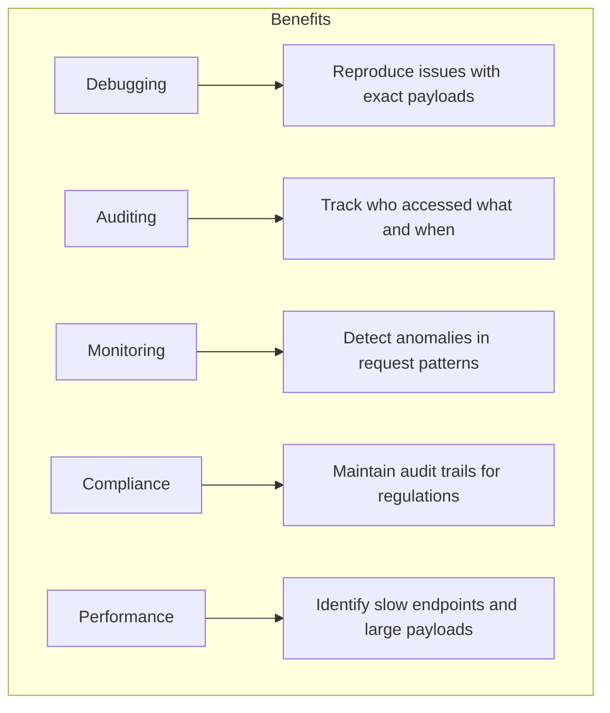
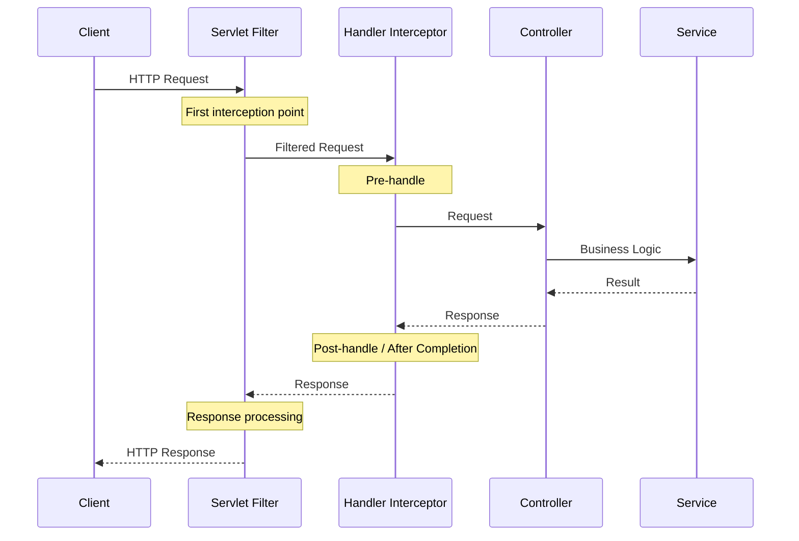
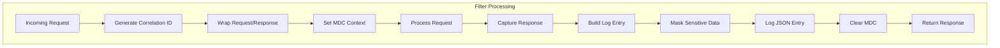
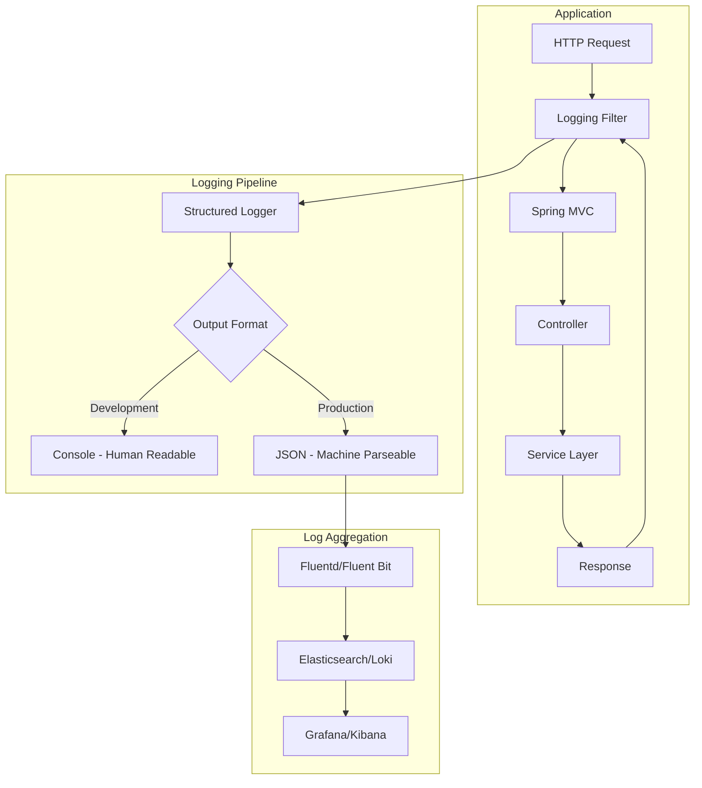
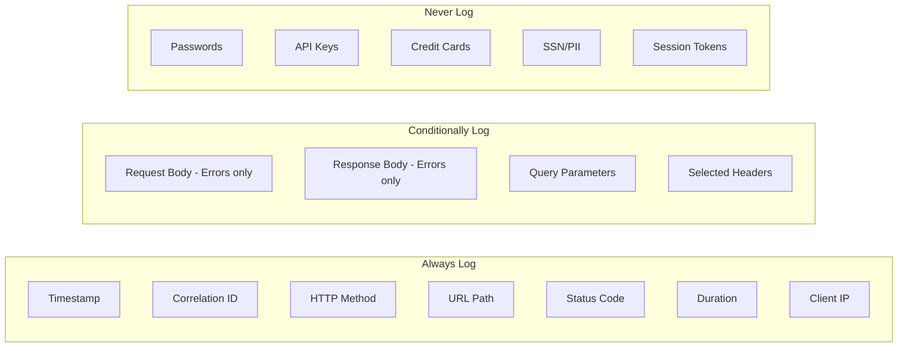

# How to Implement Request/Response Logging in Spring Boot

Author: [nawazdhandala](https://www.github.com/nawazdhandala)

Tags: Java, Spring Boot, Logging, HTTP, Debugging, Observability

Description: Learn how to implement comprehensive HTTP request and response logging in Spring Boot applications. This guide covers filters, interceptors, and structured logging with sensitive data masking.

---

> HTTP request/response logging is essential for debugging, auditing, and observability. When something goes wrong in production, detailed logs of what was sent and received can mean the difference between minutes and hours of troubleshooting.

This guide covers multiple approaches to implementing request/response logging in Spring Boot, from simple filters to production-ready structured logging with sensitive data masking.

---

## Why Log HTTP Traffic?

Before diving into implementation, let's understand why request/response logging matters:



Common use cases:
- **API debugging**: See exactly what clients are sending
- **Integration troubleshooting**: Debug third-party API responses
- **Security auditing**: Track access patterns and detect anomalies
- **SLA monitoring**: Measure response times per endpoint
- **Compliance**: Maintain audit logs for regulatory requirements

---

## Request/Response Flow in Spring Boot

Understanding the request lifecycle helps you choose the right interception point:



Key interception points:
- **Servlet Filter**: Lowest level, sees raw request/response
- **Handler Interceptor**: Spring MVC level, has access to handler info
- **Controller Advice**: Exception handling and response body modification

---

## Approach 1: Simple Logging Filter

Let's start with a basic filter that logs request and response details:

### Basic Request Logging Filter

```java
// filter/RequestLoggingFilter.java
package com.example.filter;

import jakarta.servlet.FilterChain;
import jakarta.servlet.ServletException;
import jakarta.servlet.http.HttpServletRequest;
import jakarta.servlet.http.HttpServletResponse;
import lombok.extern.slf4j.Slf4j;
import org.springframework.core.Ordered;
import org.springframework.core.annotation.Order;
import org.springframework.stereotype.Component;
import org.springframework.web.filter.OncePerRequestFilter;
import org.springframework.web.util.ContentCachingRequestWrapper;
import org.springframework.web.util.ContentCachingResponseWrapper;

import java.io.IOException;
import java.nio.charset.StandardCharsets;
import java.util.Collections;
import java.util.UUID;
import java.util.stream.Collectors;

/**
 * Filter that logs HTTP request and response details.
 * Uses ContentCaching wrappers to allow reading the body multiple times.
 */
@Slf4j
@Component
@Order(Ordered.HIGHEST_PRECEDENCE)
public class RequestLoggingFilter extends OncePerRequestFilter {

    // Maximum body size to log (prevent memory issues with large payloads)
    private static final int MAX_PAYLOAD_LENGTH = 10000;

    @Override
    protected void doFilterInternal(
            HttpServletRequest request,
            HttpServletResponse response,
            FilterChain filterChain) throws ServletException, IOException {

        // Generate unique request ID for correlation
        String requestId = UUID.randomUUID().toString().substring(0, 8);

        // Wrap request and response to enable body caching
        ContentCachingRequestWrapper wrappedRequest = 
            new ContentCachingRequestWrapper(request);
        ContentCachingResponseWrapper wrappedResponse = 
            new ContentCachingResponseWrapper(response);

        // Record start time for duration calculation
        long startTime = System.currentTimeMillis();

        try {
            // Log incoming request
            logRequest(requestId, wrappedRequest);

            // Process the request
            filterChain.doFilter(wrappedRequest, wrappedResponse);

        } finally {
            // Calculate request duration
            long duration = System.currentTimeMillis() - startTime;

            // Log outgoing response
            logResponse(requestId, wrappedRequest, wrappedResponse, duration);

            // Copy cached response body back to the actual response
            wrappedResponse.copyBodyToResponse();
        }
    }

    /**
     * Logs incoming HTTP request details.
     */
    private void logRequest(String requestId, ContentCachingRequestWrapper request) {
        String queryString = request.getQueryString();
        String path = queryString == null 
            ? request.getRequestURI() 
            : request.getRequestURI() + "?" + queryString;

        // Log basic request info
        log.info("[{}] --> {} {} from {}",
            requestId,
            request.getMethod(),
            path,
            request.getRemoteAddr());

        // Log headers (be careful with sensitive headers)
        if (log.isDebugEnabled()) {
            String headers = Collections.list(request.getHeaderNames())
                .stream()
                .map(name -> name + ": " + request.getHeader(name))
                .collect(Collectors.joining(", "));
            log.debug("[{}] Headers: {}", requestId, headers);
        }
    }

    /**
     * Logs outgoing HTTP response details.
     */
    private void logResponse(
            String requestId,
            ContentCachingRequestWrapper request,
            ContentCachingResponseWrapper response,
            long duration) {

        // Get request body (now available after processing)
        String requestBody = getPayload(request.getContentAsByteArray());

        // Get response body
        String responseBody = getPayload(response.getContentAsByteArray());

        // Log response summary
        log.info("[{}] <-- {} {} {}ms",
            requestId,
            response.getStatus(),
            request.getRequestURI(),
            duration);

        // Log bodies at debug level
        if (log.isDebugEnabled()) {
            if (!requestBody.isEmpty()) {
                log.debug("[{}] Request body: {}", requestId, requestBody);
            }
            if (!responseBody.isEmpty()) {
                log.debug("[{}] Response body: {}", requestId, responseBody);
            }
        }
    }

    /**
     * Converts byte array to string, truncating if necessary.
     */
    private String getPayload(byte[] content) {
        if (content == null || content.length == 0) {
            return "";
        }

        int length = Math.min(content.length, MAX_PAYLOAD_LENGTH);
        String payload = new String(content, 0, length, StandardCharsets.UTF_8);

        if (content.length > MAX_PAYLOAD_LENGTH) {
            payload += "... [truncated]";
        }

        return payload;
    }

    /**
     * Exclude certain paths from logging (health checks, static resources).
     */
    @Override
    protected boolean shouldNotFilter(HttpServletRequest request) {
        String path = request.getRequestURI();
        return path.startsWith("/actuator") 
            || path.startsWith("/health")
            || path.endsWith(".css")
            || path.endsWith(".js")
            || path.endsWith(".ico");
    }
}
```

---

## Approach 2: Spring Boot's Built-in Logging

Spring Boot provides `CommonsRequestLoggingFilter` for simple logging needs:

### Configuration Class

```java
// config/RequestLoggingConfig.java
package com.example.config;

import org.springframework.context.annotation.Bean;
import org.springframework.context.annotation.Configuration;
import org.springframework.web.filter.CommonsRequestLoggingFilter;

/**
 * Configuration for Spring Boot's built-in request logging filter.
 * Simple to set up but limited in customization options.
 */
@Configuration
public class RequestLoggingConfig {

    @Bean
    public CommonsRequestLoggingFilter requestLoggingFilter() {
        CommonsRequestLoggingFilter filter = new CommonsRequestLoggingFilter();
        
        // Include client info (remote address, session ID)
        filter.setIncludeClientInfo(true);
        
        // Include query string in the log
        filter.setIncludeQueryString(true);
        
        // Include request payload (body)
        filter.setIncludePayload(true);
        
        // Maximum payload length to log
        filter.setMaxPayloadLength(10000);
        
        // Include request headers
        filter.setIncludeHeaders(true);
        
        // Custom message prefix
        filter.setBeforeMessagePrefix("REQUEST: ");
        filter.setAfterMessagePrefix("RESPONSE: ");
        
        return filter;
    }
}
```

### Enable Logging Level

```yaml
# application.yml
logging:
  level:
    org.springframework.web.filter.CommonsRequestLoggingFilter: DEBUG
```

---

## Approach 3: Handler Interceptor

For Spring MVC-specific logging with access to handler information:

```java
// interceptor/LoggingInterceptor.java
package com.example.interceptor;

import jakarta.servlet.http.HttpServletRequest;
import jakarta.servlet.http.HttpServletResponse;
import lombok.extern.slf4j.Slf4j;
import org.springframework.stereotype.Component;
import org.springframework.web.method.HandlerMethod;
import org.springframework.web.servlet.HandlerInterceptor;
import org.springframework.web.servlet.ModelAndView;

/**
 * Handler interceptor for logging at the Spring MVC level.
 * Has access to the handler method being invoked.
 */
@Slf4j
@Component
public class LoggingInterceptor implements HandlerInterceptor {

    // Thread-local storage for request start time
    private static final ThreadLocal<Long> START_TIME = new ThreadLocal<>();

    /**
     * Called before the handler method is invoked.
     * Good place to log incoming requests and set up timing.
     */
    @Override
    public boolean preHandle(
            HttpServletRequest request,
            HttpServletResponse response,
            Object handler) {

        START_TIME.set(System.currentTimeMillis());

        // Get handler method information
        String handlerInfo = getHandlerInfo(handler);

        log.info("--> {} {} ({})",
            request.getMethod(),
            request.getRequestURI(),
            handlerInfo);

        return true; // Continue processing
    }

    /**
     * Called after the handler method completes but before view rendering.
     * Not called if an exception is thrown.
     */
    @Override
    public void postHandle(
            HttpServletRequest request,
            HttpServletResponse response,
            Object handler,
            ModelAndView modelAndView) {

        // Log view information if present
        if (modelAndView != null && modelAndView.getViewName() != null) {
            log.debug("View: {}", modelAndView.getViewName());
        }
    }

    /**
     * Called after the complete request has finished.
     * Always called, even if an exception was thrown.
     */
    @Override
    public void afterCompletion(
            HttpServletRequest request,
            HttpServletResponse response,
            Object handler,
            Exception ex) {

        long duration = System.currentTimeMillis() - START_TIME.get();
        START_TIME.remove(); // Clean up thread-local

        if (ex != null) {
            log.error("<-- {} {} {}ms ERROR: {}",
                response.getStatus(),
                request.getRequestURI(),
                duration,
                ex.getMessage());
        } else {
            log.info("<-- {} {} {}ms",
                response.getStatus(),
                request.getRequestURI(),
                duration);
        }
    }

    /**
     * Extracts handler method information for logging.
     */
    private String getHandlerInfo(Object handler) {
        if (handler instanceof HandlerMethod handlerMethod) {
            return handlerMethod.getBeanType().getSimpleName() 
                + "." 
                + handlerMethod.getMethod().getName();
        }
        return handler.getClass().getSimpleName();
    }
}
```

### Register the Interceptor

```java
// config/WebMvcConfig.java
package com.example.config;

import com.example.interceptor.LoggingInterceptor;
import lombok.RequiredArgsConstructor;
import org.springframework.context.annotation.Configuration;
import org.springframework.web.servlet.config.annotation.InterceptorRegistry;
import org.springframework.web.servlet.config.annotation.WebMvcConfigurer;

/**
 * Web MVC configuration to register interceptors.
 */
@Configuration
@RequiredArgsConstructor
public class WebMvcConfig implements WebMvcConfigurer {

    private final LoggingInterceptor loggingInterceptor;

    @Override
    public void addInterceptors(InterceptorRegistry registry) {
        registry.addInterceptor(loggingInterceptor)
            .addPathPatterns("/api/**")        // Only API endpoints
            .excludePathPatterns("/api/health"); // Exclude health checks
    }
}
```

---

## Approach 4: Production-Ready Structured Logging

For production environments, structured logging with JSON output is essential:

### Structured Logging Filter

```java
// filter/StructuredLoggingFilter.java
package com.example.filter;

import com.fasterxml.jackson.databind.ObjectMapper;
import jakarta.servlet.FilterChain;
import jakarta.servlet.ServletException;
import jakarta.servlet.http.HttpServletRequest;
import jakarta.servlet.http.HttpServletResponse;
import lombok.RequiredArgsConstructor;
import lombok.extern.slf4j.Slf4j;
import org.slf4j.MDC;
import org.springframework.core.Ordered;
import org.springframework.core.annotation.Order;
import org.springframework.stereotype.Component;
import org.springframework.web.filter.OncePerRequestFilter;
import org.springframework.web.util.ContentCachingRequestWrapper;
import org.springframework.web.util.ContentCachingResponseWrapper;

import java.io.IOException;
import java.nio.charset.StandardCharsets;
import java.time.Instant;
import java.util.*;

/**
 * Production-ready filter for structured HTTP request/response logging.
 * Outputs JSON-formatted logs suitable for log aggregation systems.
 */
@Slf4j
@Component
@Order(Ordered.HIGHEST_PRECEDENCE)
@RequiredArgsConstructor
public class StructuredLoggingFilter extends OncePerRequestFilter {

    private final ObjectMapper objectMapper;
    private final SensitiveDataMasker sensitiveDataMasker;

    private static final int MAX_PAYLOAD_LENGTH = 10000;

    @Override
    protected void doFilterInternal(
            HttpServletRequest request,
            HttpServletResponse response,
            FilterChain filterChain) throws ServletException, IOException {

        // Generate correlation ID
        String correlationId = getOrGenerateCorrelationId(request);

        // Add to MDC for log correlation
        MDC.put("correlationId", correlationId);
        MDC.put("requestPath", request.getRequestURI());
        MDC.put("requestMethod", request.getMethod());

        // Wrap request and response
        ContentCachingRequestWrapper wrappedRequest = 
            new ContentCachingRequestWrapper(request);
        ContentCachingResponseWrapper wrappedResponse = 
            new ContentCachingResponseWrapper(response);

        // Add correlation ID to response header
        wrappedResponse.setHeader("X-Correlation-ID", correlationId);

        Instant startTime = Instant.now();
        Exception capturedException = null;

        try {
            filterChain.doFilter(wrappedRequest, wrappedResponse);
        } catch (Exception e) {
            capturedException = e;
            throw e;
        } finally {
            // Calculate duration
            long durationMs = Instant.now().toEpochMilli() - startTime.toEpochMilli();

            // Build structured log entry
            logStructuredEntry(
                correlationId,
                wrappedRequest,
                wrappedResponse,
                durationMs,
                capturedException
            );

            // Copy response body back
            wrappedResponse.copyBodyToResponse();

            // Clean up MDC
            MDC.clear();
        }
    }

    /**
     * Gets existing correlation ID from request header or generates a new one.
     */
    private String getOrGenerateCorrelationId(HttpServletRequest request) {
        String correlationId = request.getHeader("X-Correlation-ID");
        if (correlationId == null || correlationId.isEmpty()) {
            correlationId = request.getHeader("X-Request-ID");
        }
        if (correlationId == null || correlationId.isEmpty()) {
            correlationId = UUID.randomUUID().toString();
        }
        return correlationId;
    }

    /**
     * Builds and logs a structured log entry.
     */
    private void logStructuredEntry(
            String correlationId,
            ContentCachingRequestWrapper request,
            ContentCachingResponseWrapper response,
            long durationMs,
            Exception exception) {

        try {
            Map<String, Object> logEntry = new LinkedHashMap<>();

            // Basic request info
            logEntry.put("timestamp", Instant.now().toString());
            logEntry.put("correlationId", correlationId);
            logEntry.put("type", "http_request");

            // Request details
            Map<String, Object> requestDetails = new LinkedHashMap<>();
            requestDetails.put("method", request.getMethod());
            requestDetails.put("path", request.getRequestURI());
            requestDetails.put("queryString", request.getQueryString());
            requestDetails.put("remoteAddress", request.getRemoteAddr());
            requestDetails.put("userAgent", request.getHeader("User-Agent"));
            requestDetails.put("contentType", request.getContentType());
            requestDetails.put("contentLength", request.getContentLength());

            // Masked headers
            requestDetails.put("headers", 
                sensitiveDataMasker.maskHeaders(extractHeaders(request)));

            // Masked request body
            String requestBody = getPayload(request.getContentAsByteArray());
            if (!requestBody.isEmpty()) {
                requestDetails.put("body", 
                    sensitiveDataMasker.maskJsonBody(requestBody));
            }

            logEntry.put("request", requestDetails);

            // Response details
            Map<String, Object> responseDetails = new LinkedHashMap<>();
            responseDetails.put("status", response.getStatus());
            responseDetails.put("contentType", response.getContentType());

            // Response body (be careful with large responses)
            String responseBody = getPayload(response.getContentAsByteArray());
            if (!responseBody.isEmpty() && response.getStatus() >= 400) {
                // Only log response body for errors
                responseDetails.put("body", 
                    sensitiveDataMasker.maskJsonBody(responseBody));
            }

            logEntry.put("response", responseDetails);

            // Timing
            logEntry.put("durationMs", durationMs);

            // Error info if present
            if (exception != null) {
                Map<String, Object> errorDetails = new LinkedHashMap<>();
                errorDetails.put("type", exception.getClass().getName());
                errorDetails.put("message", exception.getMessage());
                logEntry.put("error", errorDetails);
            }

            // Log as JSON
            String jsonLog = objectMapper.writeValueAsString(logEntry);

            if (response.getStatus() >= 500) {
                log.error(jsonLog);
            } else if (response.getStatus() >= 400) {
                log.warn(jsonLog);
            } else {
                log.info(jsonLog);
            }

        } catch (Exception e) {
            log.error("Failed to create structured log entry", e);
        }
    }

    /**
     * Extracts headers from request into a map.
     */
    private Map<String, String> extractHeaders(HttpServletRequest request) {
        Map<String, String> headers = new HashMap<>();
        Collections.list(request.getHeaderNames())
            .forEach(name -> headers.put(name, request.getHeader(name)));
        return headers;
    }

    /**
     * Converts byte array to string with truncation.
     */
    private String getPayload(byte[] content) {
        if (content == null || content.length == 0) {
            return "";
        }
        int length = Math.min(content.length, MAX_PAYLOAD_LENGTH);
        String payload = new String(content, 0, length, StandardCharsets.UTF_8);
        if (content.length > MAX_PAYLOAD_LENGTH) {
            payload += "...[truncated]";
        }
        return payload;
    }

    @Override
    protected boolean shouldNotFilter(HttpServletRequest request) {
        String path = request.getRequestURI();
        return path.startsWith("/actuator")
            || path.startsWith("/health")
            || path.contains("/swagger")
            || path.contains("/api-docs");
    }
}
```

---

## Sensitive Data Masking

Never log sensitive information like passwords, tokens, or personal data:

```java
// util/SensitiveDataMasker.java
package com.example.util;

import com.fasterxml.jackson.core.JsonProcessingException;
import com.fasterxml.jackson.databind.JsonNode;
import com.fasterxml.jackson.databind.ObjectMapper;
import com.fasterxml.jackson.databind.node.ObjectNode;
import lombok.RequiredArgsConstructor;
import org.springframework.stereotype.Component;

import java.util.HashMap;
import java.util.Map;
import java.util.Set;
import java.util.regex.Pattern;

/**
 * Utility for masking sensitive data in logs.
 * Prevents accidental exposure of passwords, tokens, and PII.
 */
@Component
@RequiredArgsConstructor
public class SensitiveDataMasker {

    private final ObjectMapper objectMapper;

    // Headers that should be masked
    private static final Set<String> SENSITIVE_HEADERS = Set.of(
        "authorization",
        "x-api-key",
        "api-key",
        "x-auth-token",
        "cookie",
        "set-cookie",
        "x-csrf-token"
    );

    // JSON fields that should be masked
    private static final Set<String> SENSITIVE_FIELDS = Set.of(
        "password",
        "passwd",
        "secret",
        "token",
        "accessToken",
        "access_token",
        "refreshToken",
        "refresh_token",
        "apiKey",
        "api_key",
        "creditCard",
        "credit_card",
        "cardNumber",
        "card_number",
        "cvv",
        "ssn",
        "socialSecurity",
        "social_security"
    );

    // Patterns for additional masking
    private static final Pattern EMAIL_PATTERN = 
        Pattern.compile("[a-zA-Z0-9._%+-]+@[a-zA-Z0-9.-]+\\.[a-zA-Z]{2,}");
    private static final Pattern CREDIT_CARD_PATTERN = 
        Pattern.compile("\\b(?:\\d[ -]*?){13,16}\\b");

    private static final String MASK = "***MASKED***";

    /**
     * Masks sensitive headers in a map.
     */
    public Map<String, String> maskHeaders(Map<String, String> headers) {
        Map<String, String> maskedHeaders = new HashMap<>();

        headers.forEach((key, value) -> {
            if (SENSITIVE_HEADERS.contains(key.toLowerCase())) {
                // Mask the value but show first few characters
                maskedHeaders.put(key, maskValue(value));
            } else {
                maskedHeaders.put(key, value);
            }
        });

        return maskedHeaders;
    }

    /**
     * Masks sensitive fields in a JSON body.
     */
    public String maskJsonBody(String jsonBody) {
        if (jsonBody == null || jsonBody.isEmpty()) {
            return jsonBody;
        }

        try {
            JsonNode rootNode = objectMapper.readTree(jsonBody);
            maskJsonNode(rootNode);
            return objectMapper.writeValueAsString(rootNode);
        } catch (JsonProcessingException e) {
            // Not valid JSON, apply pattern-based masking
            return maskPatterns(jsonBody);
        }
    }

    /**
     * Recursively masks sensitive fields in a JSON node.
     */
    private void maskJsonNode(JsonNode node) {
        if (node.isObject()) {
            ObjectNode objectNode = (ObjectNode) node;
            objectNode.fieldNames().forEachRemaining(fieldName -> {
                JsonNode childNode = objectNode.get(fieldName);

                if (SENSITIVE_FIELDS.contains(fieldName.toLowerCase())) {
                    // Mask the entire value
                    objectNode.put(fieldName, MASK);
                } else if (childNode.isObject() || childNode.isArray()) {
                    // Recurse into nested structures
                    maskJsonNode(childNode);
                } else if (childNode.isTextual()) {
                    // Check for patterns in string values
                    String value = childNode.asText();
                    String maskedValue = maskPatterns(value);
                    if (!value.equals(maskedValue)) {
                        objectNode.put(fieldName, maskedValue);
                    }
                }
            });
        } else if (node.isArray()) {
            node.forEach(this::maskJsonNode);
        }
    }

    /**
     * Applies pattern-based masking to a string.
     */
    private String maskPatterns(String value) {
        // Mask email addresses
        value = EMAIL_PATTERN.matcher(value).replaceAll(match -> {
            String email = match.group();
            int atIndex = email.indexOf('@');
            if (atIndex > 2) {
                return email.substring(0, 2) + "***@" + email.substring(atIndex + 1);
            }
            return "***@" + email.substring(atIndex + 1);
        });

        // Mask credit card numbers
        value = CREDIT_CARD_PATTERN.matcher(value).replaceAll(match -> {
            String card = match.group().replaceAll("[ -]", "");
            if (card.length() >= 4) {
                return "****-****-****-" + card.substring(card.length() - 4);
            }
            return MASK;
        });

        return value;
    }

    /**
     * Masks a value showing only first few characters.
     */
    private String maskValue(String value) {
        if (value == null || value.length() <= 4) {
            return MASK;
        }
        return value.substring(0, 4) + "..." + MASK;
    }
}
```

---

## Request/Response Processing Flow



---

## Configuring Logback for Structured Output

Configure Logback to output structured JSON logs:

```xml
<!-- src/main/resources/logback-spring.xml -->
<?xml version="1.0" encoding="UTF-8"?>
<configuration>
    <!-- Import Spring Boot defaults -->
    <include resource="org/springframework/boot/logging/logback/defaults.xml"/>

    <!-- Define log pattern for development -->
    <property name="CONSOLE_LOG_PATTERN" 
              value="%d{yyyy-MM-dd HH:mm:ss.SSS} %highlight(%-5level) [%thread] %cyan(%logger{36}) - %msg%n"/>

    <!-- Console appender for development -->
    <appender name="CONSOLE" class="ch.qos.logback.core.ConsoleAppender">
        <encoder>
            <pattern>${CONSOLE_LOG_PATTERN}</pattern>
        </encoder>
    </appender>

    <!-- JSON appender for production -->
    <appender name="JSON" class="ch.qos.logback.core.ConsoleAppender">
        <encoder class="net.logstash.logback.encoder.LogstashEncoder">
            <!-- Include MDC fields -->
            <includeMdcKeyName>correlationId</includeMdcKeyName>
            <includeMdcKeyName>requestPath</includeMdcKeyName>
            <includeMdcKeyName>requestMethod</includeMdcKeyName>
            
            <!-- Custom fields -->
            <customFields>{"service":"my-service","version":"1.0.0"}</customFields>
            
            <!-- Timestamp format -->
            <timestampPattern>yyyy-MM-dd'T'HH:mm:ss.SSSZ</timestampPattern>
        </encoder>
    </appender>

    <!-- File appender for audit logs -->
    <appender name="AUDIT_FILE" class="ch.qos.logback.core.rolling.RollingFileAppender">
        <file>logs/audit.log</file>
        <rollingPolicy class="ch.qos.logback.core.rolling.TimeBasedRollingPolicy">
            <fileNamePattern>logs/audit.%d{yyyy-MM-dd}.log</fileNamePattern>
            <maxHistory>30</maxHistory>
        </rollingPolicy>
        <encoder class="net.logstash.logback.encoder.LogstashEncoder"/>
    </appender>

    <!-- Development profile -->
    <springProfile name="dev">
        <root level="INFO">
            <appender-ref ref="CONSOLE"/>
        </root>
        <logger name="com.example" level="DEBUG"/>
    </springProfile>

    <!-- Production profile -->
    <springProfile name="prod">
        <root level="INFO">
            <appender-ref ref="JSON"/>
        </root>
        
        <!-- Audit logger -->
        <logger name="AUDIT" level="INFO" additivity="false">
            <appender-ref ref="AUDIT_FILE"/>
        </logger>
    </springProfile>
</configuration>
```

### Add Logstash Encoder Dependency

```xml
<!-- pom.xml -->
<dependency>
    <groupId>net.logstash.logback</groupId>
    <artifactId>logstash-logback-encoder</artifactId>
    <version>7.4</version>
</dependency>
```

---

## Async Logging for Performance

For high-throughput applications, use async logging to prevent blocking:

```xml
<!-- logback-spring.xml - Async configuration -->
<appender name="ASYNC_JSON" class="ch.qos.logback.classic.AsyncAppender">
    <!-- Queue size for pending log events -->
    <queueSize>1024</queueSize>
    
    <!-- Don't block when queue is full, drop events instead -->
    <discardingThreshold>0</discardingThreshold>
    
    <!-- Include caller data (file, line number) -->
    <includeCallerData>false</includeCallerData>
    
    <!-- Never block the logging thread -->
    <neverBlock>true</neverBlock>
    
    <appender-ref ref="JSON"/>
</appender>

<springProfile name="prod">
    <root level="INFO">
        <appender-ref ref="ASYNC_JSON"/>
    </root>
</springProfile>
```

---

## Conditional Logging Based on Response

Sometimes you want different log levels based on the outcome:

```java
// filter/ConditionalLoggingFilter.java
package com.example.filter;

import jakarta.servlet.FilterChain;
import jakarta.servlet.ServletException;
import jakarta.servlet.http.HttpServletRequest;
import jakarta.servlet.http.HttpServletResponse;
import lombok.extern.slf4j.Slf4j;
import org.springframework.stereotype.Component;
import org.springframework.web.filter.OncePerRequestFilter;
import org.springframework.web.util.ContentCachingRequestWrapper;
import org.springframework.web.util.ContentCachingResponseWrapper;

import java.io.IOException;
import java.nio.charset.StandardCharsets;

/**
 * Filter that adjusts logging verbosity based on response status.
 * Logs more details for errors, less for successful requests.
 */
@Slf4j
@Component
public class ConditionalLoggingFilter extends OncePerRequestFilter {

    @Override
    protected void doFilterInternal(
            HttpServletRequest request,
            HttpServletResponse response,
            FilterChain filterChain) throws ServletException, IOException {

        ContentCachingRequestWrapper wrappedRequest = 
            new ContentCachingRequestWrapper(request);
        ContentCachingResponseWrapper wrappedResponse = 
            new ContentCachingResponseWrapper(response);

        long startTime = System.currentTimeMillis();

        try {
            filterChain.doFilter(wrappedRequest, wrappedResponse);
        } finally {
            long duration = System.currentTimeMillis() - startTime;
            logBasedOnStatus(wrappedRequest, wrappedResponse, duration);
            wrappedResponse.copyBodyToResponse();
        }
    }

    private void logBasedOnStatus(
            ContentCachingRequestWrapper request,
            ContentCachingResponseWrapper response,
            long duration) {

        int status = response.getStatus();
        String method = request.getMethod();
        String path = request.getRequestURI();

        if (status >= 500) {
            // Server error - log everything
            log.error("SERVER_ERROR {} {} {} {}ms - Request: {} - Response: {}",
                status,
                method,
                path,
                duration,
                getBody(request.getContentAsByteArray()),
                getBody(response.getContentAsByteArray()));

        } else if (status >= 400) {
            // Client error - log request details
            log.warn("CLIENT_ERROR {} {} {} {}ms - Request: {}",
                status,
                method,
                path,
                duration,
                getBody(request.getContentAsByteArray()));

        } else if (duration > 5000) {
            // Slow request - log with warning
            log.warn("SLOW_REQUEST {} {} {} {}ms",
                status,
                method,
                path,
                duration);

        } else {
            // Success - minimal logging
            log.info("{} {} {} {}ms",
                status,
                method,
                path,
                duration);
        }
    }

    private String getBody(byte[] content) {
        if (content == null || content.length == 0) {
            return "[empty]";
        }
        return new String(content, StandardCharsets.UTF_8);
    }
}
```

---

## Testing the Logging

### Unit Test for the Filter

```java
// filter/RequestLoggingFilterTest.java
package com.example.filter;

import org.junit.jupiter.api.BeforeEach;
import org.junit.jupiter.api.Test;
import org.springframework.mock.web.MockFilterChain;
import org.springframework.mock.web.MockHttpServletRequest;
import org.springframework.mock.web.MockHttpServletResponse;

import static org.assertj.core.api.Assertions.assertThat;

class RequestLoggingFilterTest {

    private RequestLoggingFilter filter;
    private MockHttpServletRequest request;
    private MockHttpServletResponse response;
    private MockFilterChain filterChain;

    @BeforeEach
    void setUp() {
        filter = new RequestLoggingFilter();
        request = new MockHttpServletRequest();
        response = new MockHttpServletResponse();
        filterChain = new MockFilterChain();
    }

    @Test
    void shouldProcessRequest() throws Exception {
        // Given
        request.setMethod("GET");
        request.setRequestURI("/api/users");

        // When
        filter.doFilter(request, response, filterChain);

        // Then
        assertThat(filterChain.getRequest()).isNotNull();
        assertThat(filterChain.getResponse()).isNotNull();
    }

    @Test
    void shouldSkipHealthEndpoints() throws Exception {
        // Given
        request.setRequestURI("/actuator/health");

        // When/Then
        assertThat(filter.shouldNotFilter(request)).isTrue();
    }

    @Test
    void shouldNotSkipApiEndpoints() throws Exception {
        // Given
        request.setRequestURI("/api/users");

        // When/Then
        assertThat(filter.shouldNotFilter(request)).isFalse();
    }
}
```

### Integration Test

```java
// integration/LoggingIntegrationTest.java
package com.example.integration;

import org.junit.jupiter.api.Test;
import org.springframework.beans.factory.annotation.Autowired;
import org.springframework.boot.test.autoconfigure.web.servlet.AutoConfigureMockMvc;
import org.springframework.boot.test.context.SpringBootTest;
import org.springframework.http.MediaType;
import org.springframework.test.web.servlet.MockMvc;

import static org.springframework.test.web.servlet.request.MockMvcRequestBuilders.post;
import static org.springframework.test.web.servlet.result.MockMvcResultMatchers.status;

@SpringBootTest
@AutoConfigureMockMvc
class LoggingIntegrationTest {

    @Autowired
    private MockMvc mockMvc;

    @Test
    void shouldLogRequestWithCorrelationId() throws Exception {
        mockMvc.perform(post("/api/users")
                .header("X-Correlation-ID", "test-123")
                .contentType(MediaType.APPLICATION_JSON)
                .content("{\"name\":\"John\",\"email\":\"john@example.com\"}"))
            .andExpect(status().isCreated());

        // Verify logs contain correlation ID (check log output or use log capture)
    }

    @Test
    void shouldMaskSensitiveData() throws Exception {
        mockMvc.perform(post("/api/auth/login")
                .contentType(MediaType.APPLICATION_JSON)
                .content("{\"username\":\"admin\",\"password\":\"secret123\"}"))
            .andExpect(status().isOk());

        // Verify password is masked in logs
    }
}
```

---

## Logging Architecture Overview



---

## Application Properties

```yaml
# application.yml
spring:
  application:
    name: my-service

# Logging configuration
logging:
  level:
    root: INFO
    com.example: DEBUG
    
    # Spring framework logging
    org.springframework.web: INFO
    org.springframework.web.filter: DEBUG
    
    # Hibernate SQL logging (if using JPA)
    org.hibernate.SQL: DEBUG
    org.hibernate.type.descriptor.sql: TRACE

# Custom logging properties
app:
  logging:
    # Enable request/response body logging
    include-payload: true
    
    # Maximum payload size to log (bytes)
    max-payload-length: 10000
    
    # Paths to exclude from logging
    exclude-paths:
      - /actuator/**
      - /health
      - /swagger-ui/**
      - /v3/api-docs/**
    
    # Headers to mask
    sensitive-headers:
      - Authorization
      - X-API-Key
      - Cookie
    
    # JSON fields to mask
    sensitive-fields:
      - password
      - token
      - secret
      - creditCard
```

### Configuration Properties Class

```java
// config/LoggingProperties.java
package com.example.config;

import lombok.Data;
import org.springframework.boot.context.properties.ConfigurationProperties;
import org.springframework.context.annotation.Configuration;

import java.util.ArrayList;
import java.util.List;

/**
 * Configuration properties for request/response logging.
 */
@Data
@Configuration
@ConfigurationProperties(prefix = "app.logging")
public class LoggingProperties {

    // Enable request/response body logging
    private boolean includePayload = true;

    // Maximum payload size to log
    private int maxPayloadLength = 10000;

    // Paths to exclude from logging
    private List<String> excludePaths = new ArrayList<>();

    // Headers to mask in logs
    private List<String> sensitiveHeaders = new ArrayList<>();

    // JSON fields to mask in logs
    private List<String> sensitiveFields = new ArrayList<>();
}
```

---

## Best Practices Summary

### What to Log



### Performance Considerations

1. **Use async logging** to prevent blocking the request thread
2. **Limit payload size** to prevent memory issues with large bodies
3. **Exclude noisy endpoints** like health checks and static resources
4. **Sample high-volume endpoints** if logging everything is too expensive
5. **Buffer and batch logs** when sending to external systems

### Security Considerations

1. **Always mask sensitive data** before logging
2. **Use allowlists** instead of denylists for sensitive fields
3. **Encrypt log files** at rest
4. **Implement log retention policies** for compliance
5. **Restrict access** to production logs

---

## Summary

Implementing request/response logging in Spring Boot involves choosing the right approach for your needs:

- **Simple Filter**: Quick setup for basic logging
- **CommonsRequestLoggingFilter**: Spring's built-in solution
- **Handler Interceptor**: Access to handler method information
- **Structured Logging Filter**: Production-ready with JSON output

Key takeaways:
- Always use correlation IDs for request tracing
- Mask sensitive data before logging
- Configure different log levels for different environments
- Use async logging for high-throughput applications
- Exclude noisy endpoints from logging

The right logging strategy helps you debug issues faster, maintain security compliance, and gain insights into your application's behavior.

---

*Monitor your Spring Boot applications in production with [OneUptime](https://oneuptime.com). Get comprehensive observability including logs, metrics, and traces with powerful alerting and incident management.*
