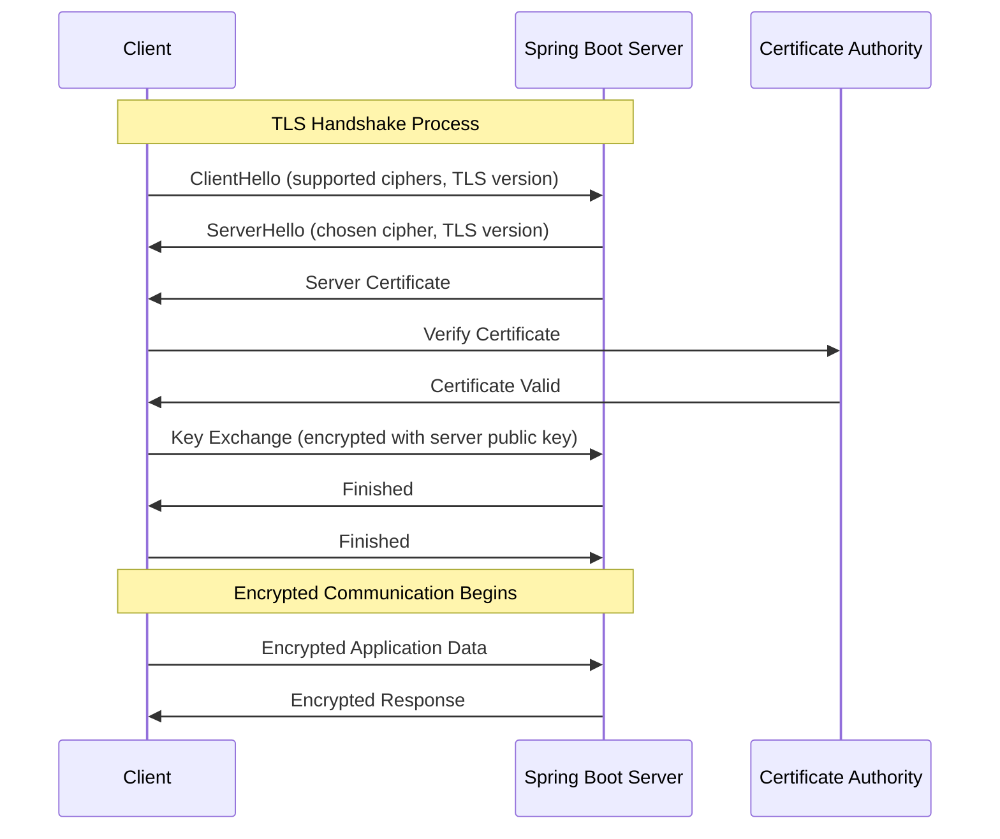
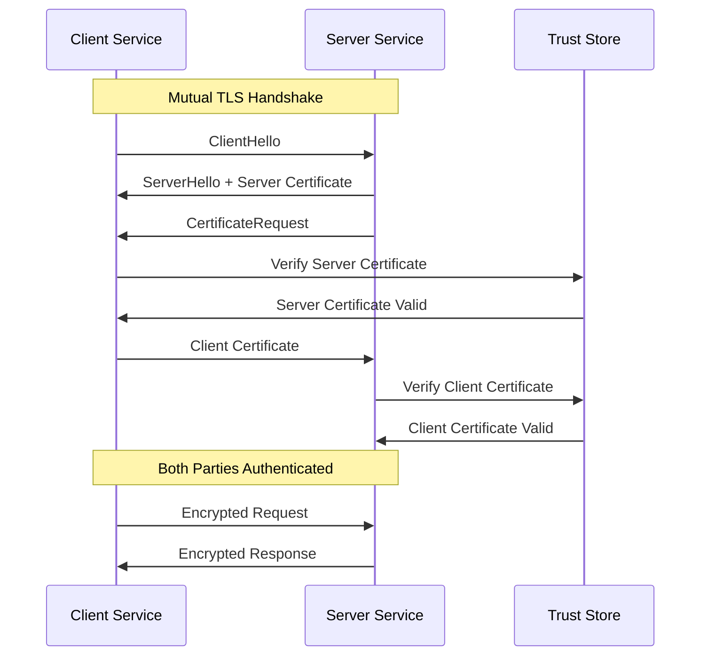

# How to Configure SSL/TLS in Spring Boot Applications

Author: [nawazdhandala](https://www.github.com/nawazdhandala)

Tags: Java, Spring Boot, SSL, TLS, HTTPS, Security, Certificates

Description: Learn how to configure SSL/TLS in Spring Boot applications for secure HTTPS connections. This guide covers keystore setup, certificate management, and mutual TLS authentication.

---

> In today's security-conscious environment, serving your Spring Boot applications over HTTPS isn't optional - it's essential. Whether you're protecting user credentials, API keys, or sensitive business data, SSL/TLS encryption ensures that data in transit remains confidential and tamper-proof.

This guide walks you through everything you need to know about configuring SSL/TLS in Spring Boot applications, from basic HTTPS setup to advanced mutual TLS (mTLS) authentication.

---

## Understanding SSL/TLS Architecture

Before diving into configuration, let's understand how SSL/TLS works in the context of a Spring Boot application.



The handshake establishes a secure channel using asymmetric encryption for key exchange, then switches to faster symmetric encryption for actual data transfer.

---

## SSL/TLS Component Overview

| Component | Purpose | File Format |
|-----------|---------|-------------|
| Private Key | Server identity proof, never shared | .key, .pem |
| Certificate | Public key + identity info, shared with clients | .crt, .pem |
| Keystore | Java container for private key + certificate | .jks, .p12 |
| Truststore | Container for trusted CA certificates | .jks, .p12 |
| CA Certificate | Issued by Certificate Authority, establishes trust | .crt, .pem |

---

## Basic HTTPS Configuration

### Step 1: Generate a Self-Signed Certificate

For development and testing, you can generate a self-signed certificate using Java's keytool:

```bash
# Generate a self-signed certificate in PKCS12 format
# This creates both the private key and certificate in one keystore file
keytool -genkeypair \
  -alias myapp \
  -keyalg RSA \
  -keysize 2048 \
  -storetype PKCS12 \
  -keystore keystore.p12 \
  -validity 365 \
  -storepass changeit \
  -dname "CN=localhost, OU=Development, O=MyCompany, L=City, ST=State, C=US"
```

The command above generates:
- RSA key pair with 2048-bit strength
- Self-signed X.509 certificate valid for 365 days
- PKCS12 keystore (recommended over JKS for modern applications)

### Step 2: Configure Spring Boot for HTTPS

Place the keystore file in your resources directory and configure application.yml:

```yaml
# application.yml
# Basic SSL/TLS configuration for Spring Boot
server:
  port: 8443  # Standard HTTPS port
  ssl:
    # Enable SSL/TLS
    enabled: true
    
    # Keystore configuration
    key-store: classpath:keystore.p12  # Location of keystore file
    key-store-password: changeit       # Password to access keystore
    key-store-type: PKCS12             # Keystore format (PKCS12 recommended)
    key-alias: myapp                   # Alias of the key pair in keystore
    
    # TLS protocol configuration
    protocol: TLS                      # Use TLS (not SSL)
    enabled-protocols: TLSv1.3,TLSv1.2 # Only allow TLS 1.2 and 1.3
```

### Step 3: Verify HTTPS is Working

Start your application and verify HTTPS is working:

```bash
# Test HTTPS endpoint (skip certificate verification for self-signed)
curl -k https://localhost:8443/actuator/health

# View certificate details
openssl s_client -connect localhost:8443 -showcerts
```

---

## Production-Ready SSL Configuration

For production environments, you need a certificate signed by a trusted Certificate Authority.

### Using Let's Encrypt Certificates

Let's Encrypt provides free SSL certificates. First, obtain your certificate:

```bash
# Install certbot and obtain certificate
sudo certbot certonly --standalone -d yourdomain.com

# Certificates are saved to:
# /etc/letsencrypt/live/yourdomain.com/fullchain.pem (certificate chain)
# /etc/letsencrypt/live/yourdomain.com/privkey.pem (private key)
```

Convert PEM files to PKCS12 format for Spring Boot:

```bash
# Convert Let's Encrypt PEM files to PKCS12 keystore
# This command creates a keystore from the certificate chain and private key
openssl pkcs12 -export \
  -in /etc/letsencrypt/live/yourdomain.com/fullchain.pem \
  -inkey /etc/letsencrypt/live/yourdomain.com/privkey.pem \
  -out keystore.p12 \
  -name myapp \
  -password pass:your-secure-password
```

### Configuration with External Certificate

Configure Spring Boot to use the production certificate:

```yaml
# application-prod.yml
# Production SSL configuration with externalized secrets
server:
  port: 443
  ssl:
    enabled: true
    
    # Use file system path instead of classpath for production
    key-store: file:/opt/app/certs/keystore.p12
    key-store-password: ${SSL_KEYSTORE_PASSWORD}  # Externalize password
    key-store-type: PKCS12
    key-alias: myapp
    
    # Strong TLS configuration
    protocol: TLS
    enabled-protocols: TLSv1.3,TLSv1.2
    
    # Restrict to strong cipher suites only
    ciphers:
      - TLS_AES_256_GCM_SHA384
      - TLS_AES_128_GCM_SHA256
      - TLS_ECDHE_RSA_WITH_AES_256_GCM_SHA384
      - TLS_ECDHE_RSA_WITH_AES_128_GCM_SHA256
```

---

## HTTP to HTTPS Redirect

In production, you should redirect all HTTP traffic to HTTPS. Here's how to configure both HTTP and HTTPS:

Configure the application to listen on both ports:

```java
// WebServerConfig.java
// Configure embedded Tomcat to handle both HTTP and HTTPS
package com.example.config;

import org.apache.catalina.Context;
import org.apache.catalina.connector.Connector;
import org.apache.tomcat.util.descriptor.web.SecurityCollection;
import org.apache.tomcat.util.descriptor.web.SecurityConstraint;
import org.springframework.beans.factory.annotation.Value;
import org.springframework.boot.web.embedded.tomcat.TomcatServletWebServerFactory;
import org.springframework.boot.web.servlet.server.ServletWebServerFactory;
import org.springframework.context.annotation.Bean;
import org.springframework.context.annotation.Configuration;

@Configuration
public class WebServerConfig {

    @Value("${server.port.http:8080}")
    private int httpPort;

    @Value("${server.port:8443}")
    private int httpsPort;

    /**
     * Configure Tomcat to:
     * 1. Listen on HTTP port (8080)
     * 2. Redirect all HTTP requests to HTTPS
     * 3. Serve application on HTTPS port (8443)
     */
    @Bean
    public ServletWebServerFactory servletContainer() {
        TomcatServletWebServerFactory tomcat = new TomcatServletWebServerFactory() {
            @Override
            protected void postProcessContext(Context context) {
                // Create security constraint that requires HTTPS
                SecurityConstraint securityConstraint = new SecurityConstraint();
                securityConstraint.setUserConstraint("CONFIDENTIAL");

                // Apply to all URL patterns
                SecurityCollection collection = new SecurityCollection();
                collection.addPattern("/*");
                securityConstraint.addCollection(collection);

                context.addConstraint(securityConstraint);
            }
        };

        // Add HTTP connector that redirects to HTTPS
        tomcat.addAdditionalTomcatConnectors(createHttpConnector());
        return tomcat;
    }

    /**
     * Create HTTP connector that redirects to HTTPS port
     * All requests to HTTP will be automatically redirected
     */
    private Connector createHttpConnector() {
        Connector connector = new Connector(TomcatServletWebServerFactory.DEFAULT_PROTOCOL);
        connector.setScheme("http");
        connector.setPort(httpPort);
        connector.setSecure(false);
        connector.setRedirectPort(httpsPort);  // Redirect target
        return connector;
    }
}
```

---

## Mutual TLS (mTLS) Authentication

Mutual TLS requires both client and server to present certificates, providing two-way authentication. This is essential for microservices communication and API security.



### Step 1: Generate Client and Server Certificates

Generate certificates for both client and server:

```bash
# Create a Certificate Authority (CA) for signing certificates
# This CA will be trusted by both client and server
keytool -genkeypair \
  -alias ca \
  -keyalg RSA \
  -keysize 4096 \
  -storetype PKCS12 \
  -keystore ca.p12 \
  -validity 3650 \
  -storepass ca-password \
  -dname "CN=MyCompany CA, OU=Security, O=MyCompany, C=US" \
  -ext bc:c

# Export CA certificate for distribution
keytool -exportcert \
  -alias ca \
  -keystore ca.p12 \
  -storepass ca-password \
  -file ca.crt

# Generate server keystore with certificate signed by CA
keytool -genkeypair \
  -alias server \
  -keyalg RSA \
  -keysize 2048 \
  -storetype PKCS12 \
  -keystore server.p12 \
  -validity 365 \
  -storepass server-password \
  -dname "CN=server.mycompany.com, OU=Engineering, O=MyCompany, C=US"

# Create certificate signing request (CSR) for server
keytool -certreq \
  -alias server \
  -keystore server.p12 \
  -storepass server-password \
  -file server.csr

# Sign server certificate with CA
keytool -gencert \
  -alias ca \
  -keystore ca.p12 \
  -storepass ca-password \
  -infile server.csr \
  -outfile server.crt \
  -validity 365

# Import CA certificate into server keystore (establish trust chain)
keytool -importcert \
  -alias ca \
  -keystore server.p12 \
  -storepass server-password \
  -file ca.crt \
  -noprompt

# Import signed server certificate
keytool -importcert \
  -alias server \
  -keystore server.p12 \
  -storepass server-password \
  -file server.crt

# Generate client keystore (repeat similar process)
keytool -genkeypair \
  -alias client \
  -keyalg RSA \
  -keysize 2048 \
  -storetype PKCS12 \
  -keystore client.p12 \
  -validity 365 \
  -storepass client-password \
  -dname "CN=client-service, OU=Engineering, O=MyCompany, C=US"

# Create CSR and sign with CA (similar to server)
keytool -certreq \
  -alias client \
  -keystore client.p12 \
  -storepass client-password \
  -file client.csr

keytool -gencert \
  -alias ca \
  -keystore ca.p12 \
  -storepass ca-password \
  -infile client.csr \
  -outfile client.crt \
  -validity 365

keytool -importcert \
  -alias ca \
  -keystore client.p12 \
  -storepass client-password \
  -file ca.crt \
  -noprompt

keytool -importcert \
  -alias client \
  -keystore client.p12 \
  -storepass client-password \
  -file client.crt
```

### Step 2: Create Trust Store

Create a trust store containing certificates that the server should trust:

```bash
# Create server truststore containing CA certificate
# Server will trust any certificate signed by this CA
keytool -importcert \
  -alias ca \
  -file ca.crt \
  -keystore truststore.p12 \
  -storetype PKCS12 \
  -storepass truststore-password \
  -noprompt
```

### Step 3: Configure Server for mTLS

Configure Spring Boot to require client certificates:

```yaml
# application.yml
# Mutual TLS configuration - requires client certificate
server:
  port: 8443
  ssl:
    enabled: true
    
    # Server keystore (server's private key + certificate)
    key-store: classpath:server.p12
    key-store-password: ${SSL_KEYSTORE_PASSWORD}
    key-store-type: PKCS12
    key-alias: server
    
    # Trust store (certificates the server trusts)
    trust-store: classpath:truststore.p12
    trust-store-password: ${SSL_TRUSTSTORE_PASSWORD}
    trust-store-type: PKCS12
    
    # Client authentication mode
    # need = require client certificate (mTLS)
    # want = request but don't require
    # none = don't request client certificate
    client-auth: need
    
    # Protocol settings
    protocol: TLS
    enabled-protocols: TLSv1.3,TLSv1.2
```

### Step 4: Configure Client for mTLS

Configure a Spring RestTemplate or WebClient to present client certificate:

```java
// MtlsClientConfig.java
// Configure HTTP client to present client certificate for mTLS
package com.example.config;

import org.apache.hc.client5.http.impl.classic.CloseableHttpClient;
import org.apache.hc.client5.http.impl.classic.HttpClients;
import org.apache.hc.client5.http.impl.io.PoolingHttpClientConnectionManagerBuilder;
import org.apache.hc.client5.http.io.HttpClientConnectionManager;
import org.apache.hc.client5.http.ssl.SSLConnectionSocketFactory;
import org.apache.hc.client5.http.ssl.SSLConnectionSocketFactoryBuilder;
import org.springframework.beans.factory.annotation.Value;
import org.springframework.context.annotation.Bean;
import org.springframework.context.annotation.Configuration;
import org.springframework.core.io.Resource;
import org.springframework.http.client.HttpComponentsClientHttpRequestFactory;
import org.springframework.web.client.RestTemplate;

import javax.net.ssl.KeyManagerFactory;
import javax.net.ssl.SSLContext;
import javax.net.ssl.TrustManagerFactory;
import java.security.KeyStore;

@Configuration
public class MtlsClientConfig {

    @Value("${client.ssl.key-store}")
    private Resource keyStore;

    @Value("${client.ssl.key-store-password}")
    private String keyStorePassword;

    @Value("${client.ssl.trust-store}")
    private Resource trustStore;

    @Value("${client.ssl.trust-store-password}")
    private String trustStorePassword;

    /**
     * Create SSLContext configured with client certificate and trusted CAs
     * This context will be used for all outgoing HTTPS connections
     */
    @Bean
    public SSLContext sslContext() throws Exception {
        // Load client keystore containing private key and certificate
        KeyStore clientKeyStore = KeyStore.getInstance("PKCS12");
        clientKeyStore.load(
            keyStore.getInputStream(),
            keyStorePassword.toCharArray()
        );

        // Initialize KeyManager with client credentials
        KeyManagerFactory keyManagerFactory = KeyManagerFactory.getInstance(
            KeyManagerFactory.getDefaultAlgorithm()
        );
        keyManagerFactory.init(clientKeyStore, keyStorePassword.toCharArray());

        // Load truststore containing trusted CA certificates
        KeyStore clientTrustStore = KeyStore.getInstance("PKCS12");
        clientTrustStore.load(
            trustStore.getInputStream(),
            trustStorePassword.toCharArray()
        );

        // Initialize TrustManager with trusted certificates
        TrustManagerFactory trustManagerFactory = TrustManagerFactory.getInstance(
            TrustManagerFactory.getDefaultAlgorithm()
        );
        trustManagerFactory.init(clientTrustStore);

        // Create SSL context with both key and trust managers
        SSLContext sslContext = SSLContext.getInstance("TLS");
        sslContext.init(
            keyManagerFactory.getKeyManagers(),
            trustManagerFactory.getTrustManagers(),
            null
        );

        return sslContext;
    }

    /**
     * Create RestTemplate configured for mTLS communication
     * Uses Apache HttpClient 5 for advanced SSL configuration
     */
    @Bean
    public RestTemplate mtlsRestTemplate(SSLContext sslContext) {
        // Create SSL socket factory with our SSLContext
        SSLConnectionSocketFactory sslSocketFactory = SSLConnectionSocketFactoryBuilder.create()
            .setSslContext(sslContext)
            .build();

        // Create connection manager with SSL support
        HttpClientConnectionManager connectionManager = PoolingHttpClientConnectionManagerBuilder.create()
            .setSSLSocketFactory(sslSocketFactory)
            .build();

        // Create HTTP client
        CloseableHttpClient httpClient = HttpClients.custom()
            .setConnectionManager(connectionManager)
            .build();

        // Wrap in Spring's request factory
        HttpComponentsClientHttpRequestFactory requestFactory =
            new HttpComponentsClientHttpRequestFactory(httpClient);

        return new RestTemplate(requestFactory);
    }
}
```

---

## WebClient Configuration for mTLS

For reactive applications using WebClient:

```java
// WebClientMtlsConfig.java
// Configure WebClient for mutual TLS in reactive applications
package com.example.config;

import io.netty.handler.ssl.SslContext;
import io.netty.handler.ssl.SslContextBuilder;
import org.springframework.beans.factory.annotation.Value;
import org.springframework.context.annotation.Bean;
import org.springframework.context.annotation.Configuration;
import org.springframework.core.io.Resource;
import org.springframework.http.client.reactive.ReactorClientHttpConnector;
import org.springframework.web.reactive.function.client.WebClient;
import reactor.netty.http.client.HttpClient;

import javax.net.ssl.KeyManagerFactory;
import javax.net.ssl.TrustManagerFactory;
import java.security.KeyStore;

@Configuration
public class WebClientMtlsConfig {

    @Value("${client.ssl.key-store}")
    private Resource keyStore;

    @Value("${client.ssl.key-store-password}")
    private String keyStorePassword;

    @Value("${client.ssl.trust-store}")
    private Resource trustStore;

    @Value("${client.ssl.trust-store-password}")
    private String trustStorePassword;

    /**
     * Create WebClient configured for mTLS
     * Uses Reactor Netty's SSL support for non-blocking I/O
     */
    @Bean
    public WebClient mtlsWebClient() throws Exception {
        // Load and configure key manager (client identity)
        KeyStore clientKeyStore = KeyStore.getInstance("PKCS12");
        clientKeyStore.load(
            keyStore.getInputStream(),
            keyStorePassword.toCharArray()
        );

        KeyManagerFactory keyManagerFactory = KeyManagerFactory.getInstance(
            KeyManagerFactory.getDefaultAlgorithm()
        );
        keyManagerFactory.init(clientKeyStore, keyStorePassword.toCharArray());

        // Load and configure trust manager (server verification)
        KeyStore clientTrustStore = KeyStore.getInstance("PKCS12");
        clientTrustStore.load(
            trustStore.getInputStream(),
            trustStorePassword.toCharArray()
        );

        TrustManagerFactory trustManagerFactory = TrustManagerFactory.getInstance(
            TrustManagerFactory.getDefaultAlgorithm()
        );
        trustManagerFactory.init(clientTrustStore);

        // Build Netty SSL context
        SslContext sslContext = SslContextBuilder.forClient()
            .keyManager(keyManagerFactory)
            .trustManager(trustManagerFactory)
            .protocols("TLSv1.3", "TLSv1.2")
            .build();

        // Create HTTP client with SSL context
        HttpClient httpClient = HttpClient.create()
            .secure(spec -> spec.sslContext(sslContext));

        // Build WebClient with configured HTTP client
        return WebClient.builder()
            .clientConnector(new ReactorClientHttpConnector(httpClient))
            .build();
    }
}
```

---

## Extracting Client Certificate Information

When using mTLS, you can extract authenticated client information from the certificate:

```java
// ClientCertificateExtractor.java
// Extract information from client certificates in mTLS requests
package com.example.security;

import org.springframework.stereotype.Component;
import org.springframework.web.bind.annotation.GetMapping;
import org.springframework.web.bind.annotation.RestController;

import jakarta.servlet.http.HttpServletRequest;
import java.security.cert.X509Certificate;
import java.util.HashMap;
import java.util.Map;

@RestController
public class ClientCertificateController {

    /**
     * Extract client certificate details from mTLS request
     * The certificate is added to the request by the servlet container
     */
    @GetMapping("/api/whoami")
    public Map<String, Object> whoami(HttpServletRequest request) {
        Map<String, Object> response = new HashMap<>();

        // Get client certificates from request attribute
        // This is populated by Tomcat/Jetty when client auth is enabled
        X509Certificate[] certs = (X509Certificate[]) request.getAttribute(
            "jakarta.servlet.request.X509Certificate"
        );

        if (certs != null && certs.length > 0) {
            X509Certificate clientCert = certs[0];

            // Extract Distinguished Name (DN) from certificate
            String subjectDN = clientCert.getSubjectX500Principal().getName();
            response.put("subject", subjectDN);

            // Extract Common Name (CN) - typically the service/user name
            String commonName = extractCN(subjectDN);
            response.put("commonName", commonName);

            // Certificate validity information
            response.put("validFrom", clientCert.getNotBefore());
            response.put("validUntil", clientCert.getNotAfter());

            // Certificate issuer
            response.put("issuer", clientCert.getIssuerX500Principal().getName());

            // Serial number (unique identifier)
            response.put("serialNumber", clientCert.getSerialNumber().toString());

            response.put("authenticated", true);
        } else {
            response.put("authenticated", false);
            response.put("message", "No client certificate provided");
        }

        return response;
    }

    /**
     * Extract Common Name from Distinguished Name
     * DN format: CN=name,OU=unit,O=org,C=country
     */
    private String extractCN(String dn) {
        for (String part : dn.split(",")) {
            String trimmed = part.trim();
            if (trimmed.startsWith("CN=")) {
                return trimmed.substring(3);
            }
        }
        return null;
    }
}
```

---

## Spring Security Integration with mTLS

Integrate client certificate authentication with Spring Security:

```java
// MtlsSecurityConfig.java
// Configure Spring Security to authenticate users via client certificates
package com.example.config;

import org.springframework.context.annotation.Bean;
import org.springframework.context.annotation.Configuration;
import org.springframework.security.config.annotation.web.builders.HttpSecurity;
import org.springframework.security.config.annotation.web.configuration.EnableWebSecurity;
import org.springframework.security.core.authority.AuthorityUtils;
import org.springframework.security.core.userdetails.User;
import org.springframework.security.core.userdetails.UserDetailsService;
import org.springframework.security.web.SecurityFilterChain;

@Configuration
@EnableWebSecurity
public class MtlsSecurityConfig {

    /**
     * Configure Spring Security for X.509 client certificate authentication
     * The certificate's CN becomes the authenticated principal
     */
    @Bean
    public SecurityFilterChain securityFilterChain(HttpSecurity http) throws Exception {
        http
            // Enable X.509 certificate authentication
            .x509(x509 -> x509
                // Extract username from certificate's Subject DN
                // This regex extracts the CN (Common Name) value
                .subjectPrincipalRegex("CN=(.*?)(?:,|$)")
                // Use custom user details service to map certificate to user
                .userDetailsService(certificateUserDetailsService())
            )
            .authorizeHttpRequests(auth -> auth
                // Health endpoints don't require authentication
                .requestMatchers("/actuator/health").permitAll()
                // All other endpoints require authentication
                .anyRequest().authenticated()
            );

        return http.build();
    }

    /**
     * Map certificate CN to Spring Security UserDetails
     * In production, this might query a database or LDAP
     */
    @Bean
    public UserDetailsService certificateUserDetailsService() {
        return username -> {
            // Map known service names to roles
            // In production, look up user/service in database
            if (username.startsWith("admin-")) {
                return User.withUsername(username)
                    .password("")  // No password needed for cert auth
                    .authorities(AuthorityUtils.createAuthorityList("ROLE_ADMIN"))
                    .build();
            } else if (username.startsWith("service-")) {
                return User.withUsername(username)
                    .password("")
                    .authorities(AuthorityUtils.createAuthorityList("ROLE_SERVICE"))
                    .build();
            } else {
                return User.withUsername(username)
                    .password("")
                    .authorities(AuthorityUtils.createAuthorityList("ROLE_USER"))
                    .build();
            }
        };
    }
}
```

---

## Certificate Rotation Without Downtime

Implement certificate rotation without restarting your application:

```java
// DynamicSslContextReloader.java
// Reload SSL certificates without application restart
package com.example.ssl;

import org.springframework.beans.factory.annotation.Value;
import org.springframework.scheduling.annotation.Scheduled;
import org.springframework.stereotype.Component;

import javax.net.ssl.KeyManagerFactory;
import javax.net.ssl.SSLContext;
import javax.net.ssl.TrustManagerFactory;
import java.io.FileInputStream;
import java.nio.file.Files;
import java.nio.file.Path;
import java.nio.file.attribute.FileTime;
import java.security.KeyStore;
import java.util.concurrent.atomic.AtomicReference;

@Component
public class DynamicSslContextReloader {

    @Value("${server.ssl.key-store}")
    private String keyStorePath;

    @Value("${server.ssl.key-store-password}")
    private String keyStorePassword;

    @Value("${server.ssl.trust-store}")
    private String trustStorePath;

    @Value("${server.ssl.trust-store-password}")
    private String trustStorePassword;

    // Track last modification time to detect changes
    private FileTime lastKeyStoreModified;
    private FileTime lastTrustStoreModified;

    // Thread-safe reference to current SSL context
    private final AtomicReference<SSLContext> sslContextRef = new AtomicReference<>();

    /**
     * Check for certificate file changes every 60 seconds
     * If changes detected, reload SSL context
     */
    @Scheduled(fixedRate = 60000)
    public void checkForCertificateChanges() {
        try {
            Path keyStorePath = Path.of(this.keyStorePath.replace("file:", ""));
            Path trustStorePath = Path.of(this.trustStorePath.replace("file:", ""));

            FileTime keyStoreModified = Files.getLastModifiedTime(keyStorePath);
            FileTime trustStoreModified = Files.getLastModifiedTime(trustStorePath);

            boolean keyStoreChanged = lastKeyStoreModified == null ||
                !keyStoreModified.equals(lastKeyStoreModified);
            boolean trustStoreChanged = lastTrustStoreModified == null ||
                !trustStoreModified.equals(lastTrustStoreModified);

            if (keyStoreChanged || trustStoreChanged) {
                reloadSslContext();
                lastKeyStoreModified = keyStoreModified;
                lastTrustStoreModified = trustStoreModified;
            }
        } catch (Exception e) {
            // Log error but don't crash - keep using existing context
            System.err.println("Failed to check certificate changes: " + e.getMessage());
        }
    }

    /**
     * Reload SSL context with new certificates
     * Uses atomic reference for thread-safe updates
     */
    private void reloadSslContext() throws Exception {
        // Load keystore
        KeyStore keyStore = KeyStore.getInstance("PKCS12");
        try (FileInputStream fis = new FileInputStream(
            keyStorePath.replace("file:", "")
        )) {
            keyStore.load(fis, keyStorePassword.toCharArray());
        }

        KeyManagerFactory kmf = KeyManagerFactory.getInstance(
            KeyManagerFactory.getDefaultAlgorithm()
        );
        kmf.init(keyStore, keyStorePassword.toCharArray());

        // Load truststore
        KeyStore trustStore = KeyStore.getInstance("PKCS12");
        try (FileInputStream fis = new FileInputStream(
            trustStorePath.replace("file:", "")
        )) {
            trustStore.load(fis, trustStorePassword.toCharArray());
        }

        TrustManagerFactory tmf = TrustManagerFactory.getInstance(
            TrustManagerFactory.getDefaultAlgorithm()
        );
        tmf.init(trustStore);

        // Create new SSL context
        SSLContext newContext = SSLContext.getInstance("TLS");
        newContext.init(kmf.getKeyManagers(), tmf.getTrustManagers(), null);

        // Atomically update reference
        sslContextRef.set(newContext);

        System.out.println("SSL context reloaded successfully");
    }

    /**
     * Get current SSL context for use in HTTP clients
     */
    public SSLContext getSslContext() {
        return sslContextRef.get();
    }
}
```

---

## Certificate Validation and Monitoring

Monitor certificate expiration and health:

```java
// CertificateHealthIndicator.java
// Spring Boot Actuator health indicator for SSL certificates
package com.example.health;

import org.springframework.beans.factory.annotation.Value;
import org.springframework.boot.actuate.health.Health;
import org.springframework.boot.actuate.health.HealthIndicator;
import org.springframework.stereotype.Component;

import java.io.FileInputStream;
import java.security.KeyStore;
import java.security.cert.X509Certificate;
import java.time.Instant;
import java.time.temporal.ChronoUnit;
import java.util.Date;
import java.util.Enumeration;

@Component
public class CertificateHealthIndicator implements HealthIndicator {

    @Value("${server.ssl.key-store}")
    private String keyStorePath;

    @Value("${server.ssl.key-store-password}")
    private String keyStorePassword;

    // Warn when certificate expires within this many days
    private static final int EXPIRY_WARNING_DAYS = 30;

    /**
     * Check SSL certificate health for Actuator endpoint
     * Returns UP, DEGRADED (expiring soon), or DOWN (expired/error)
     */
    @Override
    public Health health() {
        try {
            KeyStore keyStore = KeyStore.getInstance("PKCS12");
            try (FileInputStream fis = new FileInputStream(
                keyStorePath.replace("file:", "").replace("classpath:", "")
            )) {
                keyStore.load(fis, keyStorePassword.toCharArray());
            }

            // Check all certificates in keystore
            Enumeration<String> aliases = keyStore.aliases();
            Health.Builder healthBuilder = Health.up();

            while (aliases.hasMoreElements()) {
                String alias = aliases.nextElement();

                if (keyStore.isCertificateEntry(alias) ||
                    keyStore.isKeyEntry(alias)) {

                    X509Certificate cert = (X509Certificate)
                        keyStore.getCertificate(alias);

                    if (cert != null) {
                        Date expiryDate = cert.getNotAfter();
                        long daysUntilExpiry = ChronoUnit.DAYS.between(
                            Instant.now(),
                            expiryDate.toInstant()
                        );

                        healthBuilder.withDetail(alias + ".subject",
                            cert.getSubjectX500Principal().getName());
                        healthBuilder.withDetail(alias + ".expiryDate",
                            expiryDate.toString());
                        healthBuilder.withDetail(alias + ".daysUntilExpiry",
                            daysUntilExpiry);

                        // Check if certificate is expired
                        if (daysUntilExpiry < 0) {
                            return Health.down()
                                .withDetail("error", "Certificate " + alias + " has expired")
                                .build();
                        }

                        // Check if certificate is expiring soon
                        if (daysUntilExpiry < EXPIRY_WARNING_DAYS) {
                            healthBuilder = Health.status("DEGRADED")
                                .withDetail("warning",
                                    "Certificate " + alias + " expires in " +
                                    daysUntilExpiry + " days");
                        }
                    }
                }
            }

            return healthBuilder.build();

        } catch (Exception e) {
            return Health.down()
                .withDetail("error", "Failed to check certificate: " + e.getMessage())
                .build();
        }
    }
}
```

---

## Programmatic SSL Configuration

For applications requiring dynamic SSL configuration:

```java
// ProgrammaticSslConfig.java
// Configure SSL programmatically for advanced use cases
package com.example.config;

import org.apache.catalina.connector.Connector;
import org.apache.coyote.http11.Http11NioProtocol;
import org.springframework.beans.factory.annotation.Value;
import org.springframework.boot.web.embedded.tomcat.TomcatServletWebServerFactory;
import org.springframework.boot.web.server.Ssl;
import org.springframework.boot.web.server.WebServerFactoryCustomizer;
import org.springframework.context.annotation.Bean;
import org.springframework.context.annotation.Configuration;

@Configuration
public class ProgrammaticSslConfig {

    @Value("${custom.ssl.enabled:true}")
    private boolean sslEnabled;

    @Value("${custom.ssl.port:8443}")
    private int sslPort;

    @Value("${custom.ssl.keystore.path}")
    private String keystorePath;

    @Value("${custom.ssl.keystore.password}")
    private String keystorePassword;

    @Value("${custom.ssl.truststore.path}")
    private String truststorePath;

    @Value("${custom.ssl.truststore.password}")
    private String truststorePassword;

    /**
     * Customize embedded Tomcat with programmatic SSL configuration
     * Useful when SSL settings need to be computed at runtime
     */
    @Bean
    public WebServerFactoryCustomizer<TomcatServletWebServerFactory> sslCustomizer() {
        return factory -> {
            if (!sslEnabled) {
                return;
            }

            // Configure SSL properties programmatically
            Ssl ssl = new Ssl();
            ssl.setEnabled(true);
            ssl.setKeyStore(keystorePath);
            ssl.setKeyStorePassword(keystorePassword);
            ssl.setKeyStoreType("PKCS12");
            ssl.setTrustStore(truststorePath);
            ssl.setTrustStorePassword(truststorePassword);
            ssl.setTrustStoreType("PKCS12");
            ssl.setClientAuth(Ssl.ClientAuth.NEED);  // Require client cert
            ssl.setEnabledProtocols(new String[]{"TLSv1.3", "TLSv1.2"});
            ssl.setCiphers(new String[]{
                "TLS_AES_256_GCM_SHA384",
                "TLS_AES_128_GCM_SHA256",
                "TLS_ECDHE_RSA_WITH_AES_256_GCM_SHA384"
            });

            factory.setSsl(ssl);
            factory.setPort(sslPort);
        };
    }

    /**
     * Add custom connector with fine-grained protocol settings
     * Useful for multi-port configurations or protocol tuning
     */
    @Bean
    public WebServerFactoryCustomizer<TomcatServletWebServerFactory>
        additionalConnectorCustomizer() {

        return factory -> {
            Connector connector = new Connector(
                "org.apache.coyote.http11.Http11NioProtocol"
            );

            Http11NioProtocol protocol = (Http11NioProtocol) connector.getProtocolHandler();

            // Configure SSL on the protocol level
            connector.setScheme("https");
            connector.setSecure(true);
            connector.setPort(8444);  // Additional HTTPS port

            protocol.setSSLEnabled(true);
            protocol.setKeystoreFile(keystorePath);
            protocol.setKeystorePass(keystorePassword);
            protocol.setKeystoreType("PKCS12");
            protocol.setTruststoreFile(truststorePath);
            protocol.setTruststorePass(truststorePassword);
            protocol.setTruststoreType("PKCS12");
            protocol.setClientAuth("true");  // Require client cert
            protocol.setSslProtocol("TLS");
            protocol.setSslEnabledProtocols("TLSv1.3,TLSv1.2");

            // Connection settings
            protocol.setMaxThreads(200);
            protocol.setConnectionTimeout(20000);

            factory.addAdditionalTomcatConnectors(connector);
        };
    }
}
```

---

## Testing SSL Configuration

Write tests to verify your SSL configuration:

```java
// SslConfigurationTest.java
// Integration tests for SSL/TLS configuration
package com.example;

import org.junit.jupiter.api.Test;
import org.springframework.beans.factory.annotation.Autowired;
import org.springframework.boot.test.context.SpringBootTest;
import org.springframework.boot.test.web.client.TestRestTemplate;
import org.springframework.boot.test.web.server.LocalServerPort;
import org.springframework.http.HttpStatus;
import org.springframework.http.ResponseEntity;
import org.springframework.test.context.TestPropertySource;

import javax.net.ssl.SSLContext;
import javax.net.ssl.TrustManagerFactory;
import java.security.KeyStore;

import static org.assertj.core.api.Assertions.assertThat;

@SpringBootTest(webEnvironment = SpringBootTest.WebEnvironment.RANDOM_PORT)
@TestPropertySource(properties = {
    "server.ssl.enabled=true",
    "server.ssl.key-store=classpath:test-keystore.p12",
    "server.ssl.key-store-password=test-password"
})
class SslConfigurationTest {

    @LocalServerPort
    private int port;

    @Autowired
    private TestRestTemplate restTemplate;

    /**
     * Test that HTTPS endpoint is accessible
     */
    @Test
    void httpsEndpointShouldBeAccessible() {
        // TestRestTemplate is configured to trust self-signed certs in tests
        ResponseEntity<String> response = restTemplate.getForEntity(
            "https://localhost:" + port + "/actuator/health",
            String.class
        );

        assertThat(response.getStatusCode()).isEqualTo(HttpStatus.OK);
    }

    /**
     * Test TLS version configuration
     */
    @Test
    void shouldUseTls12OrHigher() throws Exception {
        SSLContext context = SSLContext.getInstance("TLS");
        context.init(null, null, null);

        String[] enabledProtocols = context.getDefaultSSLParameters()
            .getProtocols();

        // Verify TLS 1.2 or 1.3 is available
        assertThat(enabledProtocols)
            .containsAnyOf("TLSv1.2", "TLSv1.3");
    }

    /**
     * Test that HTTP requests are rejected or redirected
     */
    @Test
    void httpRequestShouldBeRejectedOrRedirected() {
        // Try HTTP request - should fail or redirect
        try {
            ResponseEntity<String> response = restTemplate.getForEntity(
                "http://localhost:" + port + "/actuator/health",
                String.class
            );

            // If we get here, expect redirect status
            assertThat(response.getStatusCode().is3xxRedirection() ||
                response.getStatusCode().is4xxClientError()).isTrue();
        } catch (Exception e) {
            // Connection refused is also acceptable (HTTP disabled)
            assertThat(e).isNotNull();
        }
    }
}
```

---

## Docker and Kubernetes Deployment

### Docker Configuration

Mount certificates as volumes in Docker:

```dockerfile
# Dockerfile
FROM eclipse-temurin:21-jre-alpine

# Create non-root user for security
RUN addgroup -g 1000 appgroup && \
    adduser -u 1000 -G appgroup -D appuser

WORKDIR /app

# Copy application JAR
COPY target/app.jar app.jar

# Create directory for certificates
RUN mkdir -p /app/certs && chown appuser:appgroup /app/certs

# Switch to non-root user
USER appuser

# Expose HTTPS port
EXPOSE 8443

# Health check
HEALTHCHECK --interval=30s --timeout=10s --retries=3 \
    CMD wget --no-verbose --tries=1 --spider \
    --no-check-certificate https://localhost:8443/actuator/health || exit 1

ENTRYPOINT ["java", "-jar", "app.jar"]
```

Docker Compose with certificate mounting:

```yaml
# docker-compose.yml
version: '3.8'

services:
  app:
    build: .
    ports:
      - "8443:8443"
    volumes:
      # Mount certificates as read-only volumes
      - ./certs/keystore.p12:/app/certs/keystore.p12:ro
      - ./certs/truststore.p12:/app/certs/truststore.p12:ro
    environment:
      # Reference mounted certificate paths
      - SERVER_SSL_KEY_STORE=file:/app/certs/keystore.p12
      - SERVER_SSL_KEY_STORE_PASSWORD=${SSL_KEYSTORE_PASSWORD}
      - SERVER_SSL_TRUST_STORE=file:/app/certs/truststore.p12
      - SERVER_SSL_TRUST_STORE_PASSWORD=${SSL_TRUSTSTORE_PASSWORD}
    secrets:
      - ssl_keystore_password
      - ssl_truststore_password

secrets:
  ssl_keystore_password:
    file: ./secrets/ssl_keystore_password.txt
  ssl_truststore_password:
    file: ./secrets/ssl_truststore_password.txt
```

### Kubernetes Configuration

Store certificates in Kubernetes secrets and mount them:

```yaml
# kubernetes/ssl-secret.yaml
# Create secret from certificate files
apiVersion: v1
kind: Secret
metadata:
  name: app-ssl-certs
type: Opaque
data:
  # Base64 encoded certificate files
  keystore.p12: <base64-encoded-keystore>
  truststore.p12: <base64-encoded-truststore>
  keystore-password: <base64-encoded-password>
  truststore-password: <base64-encoded-password>
```

```yaml
# kubernetes/deployment.yaml
apiVersion: apps/v1
kind: Deployment
metadata:
  name: spring-boot-app
spec:
  replicas: 3
  selector:
    matchLabels:
      app: spring-boot-app
  template:
    metadata:
      labels:
        app: spring-boot-app
    spec:
      containers:
        - name: app
          image: myregistry/spring-boot-app:latest
          ports:
            - containerPort: 8443
          env:
            # Reference certificate paths
            - name: SERVER_SSL_KEY_STORE
              value: file:/app/certs/keystore.p12
            - name: SERVER_SSL_TRUST_STORE
              value: file:/app/certs/truststore.p12
            # Get passwords from secret
            - name: SERVER_SSL_KEY_STORE_PASSWORD
              valueFrom:
                secretKeyRef:
                  name: app-ssl-certs
                  key: keystore-password
            - name: SERVER_SSL_TRUST_STORE_PASSWORD
              valueFrom:
                secretKeyRef:
                  name: app-ssl-certs
                  key: truststore-password
          volumeMounts:
            # Mount certificates
            - name: ssl-certs
              mountPath: /app/certs
              readOnly: true
          livenessProbe:
            httpGet:
              path: /actuator/health/liveness
              port: 8443
              scheme: HTTPS
            initialDelaySeconds: 30
            periodSeconds: 10
          readinessProbe:
            httpGet:
              path: /actuator/health/readiness
              port: 8443
              scheme: HTTPS
            initialDelaySeconds: 10
            periodSeconds: 5
      volumes:
        - name: ssl-certs
          secret:
            secretName: app-ssl-certs
            items:
              - key: keystore.p12
                path: keystore.p12
              - key: truststore.p12
                path: truststore.p12
```

---

## Troubleshooting SSL Issues

Common SSL problems and solutions:

### Enable SSL Debug Logging

Add JVM arguments to debug SSL handshake:

```bash
# Enable detailed SSL debugging
java -Djavax.net.debug=ssl:handshake:verbose \
     -jar app.jar

# Or set in application properties
# JAVA_TOOL_OPTIONS: -Djavax.net.debug=ssl:handshake
```

### Common Issues Checklist

| Issue | Cause | Solution |
|-------|-------|----------|
| PKIX path building failed | Untrusted certificate | Add CA to truststore |
| Certificate expired | Certificate past validity | Renew certificate |
| No cipher suites in common | Mismatched TLS versions | Align enabled protocols |
| Connection reset | Protocol mismatch | Check enabled-protocols |
| Keystore password wrong | Incorrect password | Verify password in config |
| Alias not found | Wrong key-alias | List aliases with keytool |

### Verify Certificate Chain

Use OpenSSL to diagnose certificate issues:

```bash
# Check server certificate and chain
openssl s_client -connect localhost:8443 -showcerts

# Verify certificate against CA
openssl verify -CAfile ca.crt server.crt

# Check certificate expiration
openssl x509 -in server.crt -noout -dates

# List keystore contents
keytool -list -v -keystore keystore.p12 -storepass password

# Test TLS version support
openssl s_client -connect localhost:8443 -tls1_3
openssl s_client -connect localhost:8443 -tls1_2
```

---

## Security Best Practices Checklist

- [ ] Use TLS 1.2 or TLS 1.3 only (disable older versions)
- [ ] Use strong cipher suites (AES-GCM preferred)
- [ ] Use 2048-bit or 4096-bit RSA keys
- [ ] Enable certificate chain validation
- [ ] Implement certificate rotation without downtime
- [ ] Monitor certificate expiration
- [ ] Use HSM or secrets management for key storage
- [ ] Enable HSTS header for web applications
- [ ] Implement certificate pinning for mobile clients
- [ ] Regular security audits of SSL configuration

---

## Conclusion

Configuring SSL/TLS in Spring Boot applications involves several components:

1. **Basic HTTPS** - Start with keystore configuration and enable SSL
2. **Production Certificates** - Use properly signed certificates from a CA
3. **HTTP Redirect** - Force all traffic to HTTPS
4. **Mutual TLS** - Implement client certificate authentication for service-to-service communication
5. **Certificate Management** - Monitor expiration and implement rotation
6. **Deployment** - Properly configure certificates in Docker and Kubernetes

Security is not a one-time setup. Regularly audit your SSL configuration, monitor certificate expiration, and stay updated with TLS best practices.

---

*Need to monitor your SSL certificates and service health? [OneUptime](https://oneuptime.com) provides comprehensive SSL certificate monitoring to alert you before certificates expire and cause outages.*

**Related Reading:**
- [SSL Certificate Monitoring with OneUptime](https://oneuptime.com/blog/post/2025-09-23-ssl-certificate-monitoring-with-oneuptime/view)
- [Monitor Kubernetes Clusters with OpenTelemetry and OneUptime](https://oneuptime.com/blog/post/2025-11-14-monitor-kubernetes-clusters-with-opentelemetry-and-oneuptime/view)
