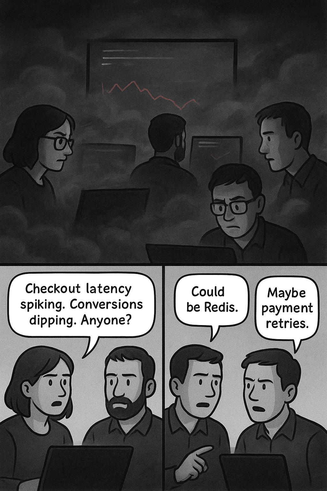

# Logs, Metrics & Traces: A Before and After Story.

Author: [devneelpatel](https://www.github.com/devneelpatel)

Tags: Observability, OpenTelemetry, Logs, Metrics, Traces, Open Source

Description: A journey from firefighting in the dark to calm, data-driven operations by unifying metrics, logs, and traces with OpenTelemetry.

> “We keep fixing symptoms, not causes.” — Priya, Staff Engineer, 41 incidents into Q2.

---

## Act I — Fog

Monday, 09:12 AM.

Jade (Product) drops into #eng-ops: “Checkout latency spiking. Conversions dipping. Anyone?”

Priya (Engineering) opens the “Core API” dashboard. CPU: green. Memory: stable. p99 latency: red. Luis (SRE) opens another dashboard—different query, different scale, different timezone formatting. Ryan (Engineering) SSHs into a pod to tail logs; the pod restarts mid-scroll.

“Could be Redis.” “Maybe payment retries.” “Or deploy drift?” - the conversation spirals.

> They *had* data. They did **not** have a story.

Monitoring told them *something* was wrong—but not where, not why, not when it started in relation to deploys or dependencies. Average time to *first plausible* root cause: 47 grinding minutes - a mix of guesswork, dashboard hopping, and log archaeology.

They accumulated *patterns of pain* with surgical precision: dashboards that multiplied like weeds instead of yielding answers, logs that became digital archaeology—ephemeral fragments buried in unstructured noise, impossible to correlate across services. Metrics would scream warnings from every corner, but arrived stripped of context, like smoke signals without the fire's location. Most damaging of all: every fresh incident became a teaching moment for the same hard-won lessons, each postmortem a carbon copy of the last, each engineer rediscovering what should have been institutional knowledge. They were trapped in a loop of perpetual rediscovery, always learning but never retaining.

Priya, closing yet another inconclusive postmortem: “We have data exhaust, not observability.”

---

## Act II — Collapse

Friday. Marketing launches a promo. Traffic spikes 3.2× baseline.

09:41: Latency alert (static threshold) half-fires in one region; another region silently degrades.

09:47: p99 jumps from 420ms → 2100ms. Error rate stays suspiciously normal. CPU flat. DB connections plateau. The *absence* of certain signals becomes another mystery.

Three competing hypotheses by engineering:

1. Regional networking issue.
2. Hidden lock in payment service.
3. Thread pool starvation in the gateway.

None backed by correlated evidence.

Six dashboards. Five log queries. Two Slack threads merging. A paste of a partial stack trace with no surrounding context. Finally Luis notices a cluster of slow payment retries—each retry slower than the previous—caused by an undetected TLS negotiation regression after a library bump.

Detection to confident diagnosis: 38 minutes. Thousands in lost revenue $ mounts.

CTO in the retro: “We don’t get another quarter of this. Instrument reality or keep guessing.”

Mandate pinned to the wall:

> Unify signals. Cut MTTR by 70%. Preserve portability. Control spend.

---

## Act III — Reconstruction

The decision: stay neutral + platform agnostic. Instrument once; keep optionality. Implement **OpenTelemetry** as the neutral backbone with **OneUptime** as the convergence canvas.

Whiteboard Principles (still smudged with marker):

1. Every user request births a trace (smart sampling, not firehose).
2. Every meaningful log line carries `trace_id` & `span_id`.
3. SLO metrics are curated, versioned, owned by product teams.

Implementation Sprint (5 days, no heroics):
| Day | Scene | Outcome |
|-----|-------|---------|
| 1 | Auto-instrument gateway + three busiest services | Spans visible locally |
| 2 | OTel Collector w/ batch + tail sampling | 90% trace volume drop; anomaly fidelity intact |
| 3 | Structured JSON logs; middleware injects IDs | Click-through trace ↔ logs achieved |
| 4 | Define 4 SLOs; kill 11 vanity metrics | Alert noise collapses |
| 5 | Terraform monitors + dashboards committed | Reproducible, reviewable config |

Sampling Model:
- Head: 10% baseline.
- Tail: keep all error traces, >p95 latency, rare routes.

Log Policy:
- ERROR 100% (7d hot)
- WARN 50% (3d)
- INFO 5% (24h then cold tier)
- Security/audit separate pipeline.

Metric Guardrails:
- Bounded tags: `service.name`, `env`, `region`, `endpoint_group`.
- PR bot comments on suspected high-cardinality additions.

> They didn’t add “more telemetry”; they added **relational glue**.

---

## Act IV — Clarity

Two weeks later the system is stress-tested organically: a new recommendation model causes elevated internal queue pressure.

10:06: Burn rate alert fires (SLO-based, not static). The alert payload already includes a link to an *exemplar trace*.

10:06:30: Trace view shows a `payment.authorize` span bloating from 120ms → 900ms.

10:07: Span events annotate "retry_backoff" with increasing delays. Linked logs—pre-filtered—show TLS renegotiations isolated to `gateway=eu-west-2`.

10:08: Metrics inline panel displays connection pool saturation creeping and queue depth rising.

10:09: Deploy marker reveals a feature flag flipped 6 minutes earlier on that region only.

10:12: Flag reverted. Latency normalizes. Post-incident doc auto-attaches trace + logs + SLO breach window.

Time to confident root cause: **6 minutes**.

> Old world: heroism + hunches. New world: evidence + flow.

### Shift by the Numbers
| Metric | Before | After |
|--------|--------|-------|
| MTTR (p50) | 41m | 9m |
| MTTR (p90) | 78m | 18m |
| Dashboards touched per incident | 11 | 3 |
| Incidents w/ “Unknown” cause | 22% | 4% |
| Weekly alert acknowledgements | 63 | 28 |

### Cultural Markers

- Postmortems cite spans, not screenshots.
- On-call anxiety drops; backups sleep.
- “Could be Redis?” replaced by “See span 4a9… waiting on ext gateway handshake.”

---

## Interlude — The Pillars Reframed

| Pillar | Narrative Role | Core Question | Strength | Failure Mode | Countermeasure |
|--------|----------------|---------------|----------|--------------|----------------|
| Metrics | Tension meter | Is behavior drifting? | Fast math & trends | Cardinality creep | Tag budget + review |
| Logs | Dialogue transcript | What specifically happened? | Rich context | Unstructured firehose | Structured JSON + sampling |
| Traces | Plot spine | Where & why along the path? | Causality & latency map | Over/under instrumentation | Tail + boundary focus |

Individually: fragments. Linked: a **queryable narrative**.

---

## The Neutral Backbone: OpenTelemetry

Not “another agent”—a **portable contract**.

Pieces that mattered:
- APIs + Auto-Instrumentation → fast coverage
- Semantic Conventions → consistency (`http.method`, `db.system`)
- W3C Context Propagation → cross-service stitching
- OTLP + Collector → transform + route without code redeploys

OpenTelemetry Collector Pipeline:
- `batch` (network efficiency)
- `tail_sampling` (keep the weird)
- `attributes` (deploy metadata enrichment)
- `transform` (normalize legacy names)
- `filter` (drop healthchecks)

> Everything stays exportable. Backend choice is configuration, not loyalty oath driven by lock-in, vendor inertia, and price gouging.

---

## Cost & Lock-In: Threats Neutralized

Avoided:
- Per-host tax punishing autoscale
- Proprietary query dialect lock
- Hidden ingestion multipliers

Adopted:
- Value-density ingestion (summarize normal, retain anomalies)
- Raw OTLP archival (object storage, future-proof)
- Everything-as-code (SLOs, monitors, retention)

Outcome: Predictable curve. Escape hatch intact.

---

## OneUptime’s Role
OneUptime became the convergence canvas: traces, metrics panels, linked logs, incidents, SLO burn charts, deploy markers—*one* surface.

Enablers:
- Native OTLP ingestion
- Unified context pane (trace ↔ logs ↔ key metrics)
- SLO + incident workflow reduces swivel time
- Terraform provider + OpenAPI spec = portability discipline

It wasn’t “install a tool.” It was institutionalizing **observable operations**.

---

## Playbook You Can Steal

1. Start with OTel auto-instrumentation; add manual spans at business boundaries.
2. Inject `trace_id`, `span_id` into every structured log line.
3. Centralize routing in the Collector (batch + tail sampling + enrich).
4. Define 3–5 SLOs tied to user impact; delete vanity metrics. Make teams own them.
5. Enforce tag/cardinality guardrails in PR review.
6. Archive raw data cheaply; rehydrate if needed.
7. Revisit sampling & retention monthly; tune to value density.
8. Attach exemplar traces to postmortems by policy.

---

## Anti-Patterns & Remedies
| Anti-Pattern | Pain | Remedy |
|--------------|------|--------|
| 100% trace firehose | Runaway spend, noisy UI | Tail + adaptive sampling |
| Logs missing IDs | Grep roulette | Correlation middleware |
| Metric inflation | Analysis paralysis | SLO-first pruning |
| Span nesting mania | Cognitive overload | Instrument boundaries only |
| Replatform paralysis | Vendor inertia | Collector multi-route + archive |

---

## Epilogue — Cultural Refactor

Engineers’ language changed:
- From “Anyone seeing errors?” → “Exemplar trace shows external gateway stall.”
- From “Maybe deploy?” → “Deploy marker T+6m precedes latency climb.”
- From “Add a dashboard?” → “Enrich span with queue depth.”

Observability matured from *artifact* to *practice*. Feedback loops shortened. Confidence replaced folklore.

---

## Final Take

You don’t win by stockpiling telemetry. You win by **designing correlated signals** that collapse the distance from alert → insight → learning. Metrics surfaced *that* something drifted. Traces revealed *where*. Logs explained *why*. OpenTelemetry made it portable. OneUptime made it cohesive.

> Before: heroic debugging. After: intentional diagnosis.

Own your telemetry. Don’t rent your visibility.

If you’re stitching tools manually or overpaying just to *see* reality—start decoupling now. Instrument once with OTel, route via a Collector, let OneUptime unify the narrative.

Need help? The OneUptime support and engineering is there. *Bring a gnarly trace. We'll help you write stories.*

