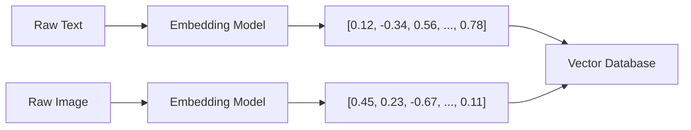
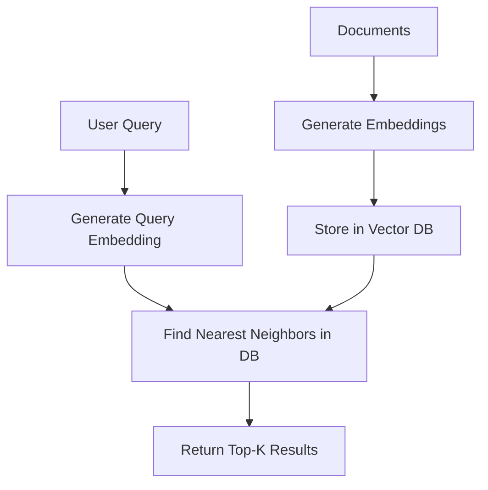

# Understanding Vector Embeddings for Search and AI Applications

Author: [nawazdhandala](https://github.com/nawazdhandala)

Tags: AI, Machine Learning, Vector Embeddings, Search, NLP

Description: A practical guide to vector embeddings covering what they are, how they work, and how to use them in search, recommendation systems, and AI applications.

---

If you have worked with search systems, recommendation engines, or any modern AI application, you have probably encountered the term "vector embeddings." The concept sounds abstract, but the mechanics are practical and worth understanding. Embeddings are the bridge between human-readable data (text, images, audio) and the numerical representations that machines can reason about.

## What Are Vector Embeddings

A vector embedding is a list of floating-point numbers that represents some piece of data in a high-dimensional space. The key property is that similar items end up close together in that space, and dissimilar items end up far apart.

For example, the sentence "the cat sat on the mat" and "a kitten rested on the rug" would produce embeddings that are close together because they express similar meanings. The sentence "quarterly revenue exceeded projections" would produce an embedding that is far from both.

A typical embedding might have 384, 768, or 1536 dimensions. Each dimension captures some learned feature of the input data. No single dimension has an obvious human interpretation, but taken together, the dimensions encode semantic meaning.



## How Embeddings Are Created

Embedding models are neural networks trained on large datasets to map inputs to vectors. The training objective shapes what "similarity" means in the resulting space.

**Word embeddings** like Word2Vec and GloVe map individual words to vectors. Word2Vec, trained on predicting surrounding words from a target word (or vice versa), learns that "king" minus "man" plus "woman" is close to "queen" in vector space. These are historically important but limited because they assign one vector per word regardless of context.

**Sentence and document embeddings** from models like Sentence-BERT, OpenAI's text-embedding-ada-002, or Cohere's embed models take entire passages as input and produce a single vector. The word "bank" gets a different embedding depending on whether the surrounding text is about finance or rivers.

**Multimodal embeddings** from models like CLIP map both images and text into the same vector space. A photo of a dog and the text "a golden retriever playing fetch" end up near each other, enabling cross-modal search.

## Measuring Similarity

Once you have vectors, you need a way to compare them. The two most common distance metrics are cosine similarity and Euclidean distance.

**Cosine similarity** measures the angle between two vectors, ignoring their magnitude. Values range from -1 (opposite) to 1 (identical direction). This is the standard choice for text embeddings because document length should not affect similarity.

**Euclidean distance** (L2 distance) measures the straight-line distance between two points in the vector space. Smaller values mean more similar. This works well when the magnitudes of vectors are meaningful.

Here is how to compute both in Python:

```python
import numpy as np

def cosine_similarity(vec_a, vec_b):
    # Dot product divided by the product of magnitudes
    # Returns a value between -1 and 1
    dot_product = np.dot(vec_a, vec_b)
    norm_a = np.linalg.norm(vec_a)
    norm_b = np.linalg.norm(vec_b)
    return dot_product / (norm_a * norm_b)

def euclidean_distance(vec_a, vec_b):
    # Straight-line distance between two points
    # Lower values indicate higher similarity
    return np.linalg.norm(vec_a - vec_b)

# Example with small vectors for readability
embedding_cat = np.array([0.9, 0.1, 0.3])
embedding_kitten = np.array([0.85, 0.15, 0.28])
embedding_truck = np.array([0.1, 0.8, 0.7])

print(cosine_similarity(embedding_cat, embedding_kitten))   # ~0.998 (very similar)
print(cosine_similarity(embedding_cat, embedding_truck))     # ~0.494 (not similar)
```

## Using Embeddings for Semantic Search

Traditional keyword search fails when users phrase queries differently from the indexed documents. If your knowledge base says "terminate the process" but the user searches "how to kill a running program," keyword search will miss it. Semantic search with embeddings catches it because both phrases have similar meaning.

The architecture is straightforward:



Here is a working example using the `sentence-transformers` library and Facebook's FAISS for indexing:

```python
from sentence_transformers import SentenceTransformer
import faiss
import numpy as np

# Load a pre-trained embedding model
# all-MiniLM-L6-v2 produces 384-dimensional embeddings and is fast
model = SentenceTransformer('all-MiniLM-L6-v2')

# Sample documents to index
documents = [
    "How to restart a Linux service using systemctl",
    "Monitoring memory usage with top and htop",
    "Setting up SSH key-based authentication",
    "Configuring nginx as a reverse proxy",
    "Troubleshooting high CPU usage on servers",
]

# Generate embeddings for all documents
# Returns a numpy array of shape (5, 384)
doc_embeddings = model.encode(documents)

# Build a FAISS index for fast nearest-neighbor search
# Using L2 (Euclidean) distance with IndexFlatL2
dimension = doc_embeddings.shape[1]
index = faiss.IndexFlatL2(dimension)
index.add(doc_embeddings.astype('float32'))

# Search with a natural language query
query = "my server CPU is maxed out"
query_embedding = model.encode([query]).astype('float32')

# Retrieve the 3 closest documents
distances, indices = index.search(query_embedding, k=3)

for i, idx in enumerate(indices[0]):
    print(f"Rank {i+1}: {documents[idx]} (distance: {distances[0][i]:.4f})")
```

The query "my server CPU is maxed out" would match "Troubleshooting high CPU usage on servers" even though they share almost no keywords.

## Embeddings in Recommendation Systems

Recommendation systems use embeddings to represent users and items in the same vector space. A user's embedding is computed from their interaction history, and recommendations are generated by finding items whose embeddings are closest to the user's.

This approach handles the cold-start problem better than collaborative filtering alone. A new article about Kubernetes monitoring can be recommended to users who have read articles about Docker observability, because the content embeddings are close even if no user has interacted with both.

## Choosing an Embedding Model

The choice depends on your use case, latency requirements, and budget.

| Model | Dimensions | Use Case | Notes |
|---|---|---|---|
| all-MiniLM-L6-v2 | 384 | General-purpose text | Fast, runs locally, good quality |
| text-embedding-3-small | 1536 | Production search | OpenAI API, good cost/quality ratio |
| text-embedding-3-large | 3072 | High-accuracy retrieval | OpenAI API, best quality, higher cost |
| BGE-large-en | 1024 | Open-source retrieval | Strong performance, runs locally |
| CLIP ViT-B/32 | 512 | Image + text | Multimodal, runs locally |

For most text search applications, starting with `all-MiniLM-L6-v2` locally or `text-embedding-3-small` via API gives good results without overcomplicating things.

## Chunking Strategies for Long Documents

Embedding models have token limits (typically 256 to 8192 tokens). Long documents need to be split into chunks before embedding. How you chunk matters a lot.

**Fixed-size chunks** (e.g., 512 tokens with 50-token overlap) are simple but can split sentences mid-thought.

**Paragraph-based chunks** respect natural boundaries but produce uneven sizes.

**Semantic chunking** uses the embedding model itself to detect topic shifts, splitting where similarity between consecutive sentences drops. This produces the most coherent chunks but is the most expensive to compute.

A practical middle ground is splitting on paragraph boundaries with a maximum chunk size, and including overlap so that context is not lost at the edges.

```python
def chunk_text(text, max_tokens=500, overlap=50):
    """
    Split text into overlapping chunks at paragraph boundaries.
    Falls back to sentence boundaries if paragraphs are too long.
    """
    paragraphs = text.split('\n\n')
    chunks = []
    current_chunk = []
    current_length = 0

    for para in paragraphs:
        # Rough token estimate: 1 token per 4 characters
        para_tokens = len(para) // 4

        if current_length + para_tokens > max_tokens and current_chunk:
            chunks.append('\n\n'.join(current_chunk))
            # Keep the last paragraph for overlap
            current_chunk = current_chunk[-1:]
            current_length = len(current_chunk[0]) // 4 if current_chunk else 0

        current_chunk.append(para)
        current_length += para_tokens

    if current_chunk:
        chunks.append('\n\n'.join(current_chunk))

    return chunks
```

## Vector Databases

Once you have embeddings, you need somewhere to store and query them efficiently. In-memory solutions like FAISS work for small datasets, but production systems need purpose-built vector databases.

**Pinecone** is a managed service that handles scaling and indexing. No infrastructure to manage, but it is a paid service.

**Weaviate** is open-source and supports hybrid search (combining vector and keyword search). It can run self-hosted or as a managed service.

**Qdrant** is another open-source option with a focus on filtering. It supports attaching metadata to vectors and filtering results by metadata fields before or during the similarity search.

**pgvector** adds vector operations to PostgreSQL. If your data is already in Postgres, this avoids introducing a new database into your stack.

## Practical Considerations

**Embedding drift**: If you change your embedding model, all existing vectors must be re-computed. Old and new embeddings are incompatible even if they have the same dimensionality.

**Dimensionality vs. performance**: Higher-dimensional embeddings capture more nuance but require more storage and slower searches. For many applications, 384 or 768 dimensions are sufficient.

**Normalization**: Some models return normalized vectors (unit length), others do not. If you are using cosine similarity, normalizing vectors beforehand lets you use a faster dot-product search instead.

**Batch processing**: Generating embeddings one at a time is slow. Always batch your inputs. Most libraries and APIs support batch encoding, and the throughput improvement is substantial.

Vector embeddings are not magic. They are a well-understood numerical representation that makes it possible for machines to work with semantic meaning. Once you understand the pipeline of generating, storing, and querying embeddings, a large number of AI-adjacent features become straightforward to implement.
