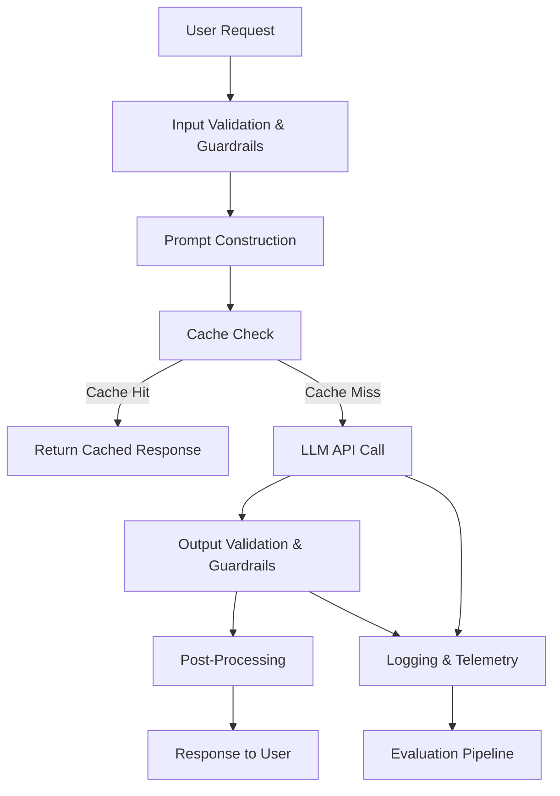

# How to Build Production-Ready LLM Applications

Author: [nawazdhandala](https://github.com/nawazdhandala)

Tags: AI, LLM, Production, Machine Learning, Architecture

Description: Best practices for taking large language model applications from prototype to production, covering architecture, reliability, cost management, and monitoring.

---

Getting a demo working with an LLM takes an afternoon. Getting that same application to run reliably in production, at a reasonable cost, with predictable behavior, takes months of engineering work. The gap between prototype and production for LLM-powered applications is wider than most teams expect.

This post covers the practical engineering concerns that emerge once you move past the "it works on my laptop" phase.

## The Architecture of a Production LLM Application

A production LLM application is not just an API call to OpenAI wrapped in a web server. It is a system with multiple components that each need to be resilient, observable, and cost-efficient.



Each box in that diagram represents a place where things can go wrong, and where you need monitoring and fallback behavior.

## Prompt Management

Hardcoding prompts in application code is the first thing teams do and the first thing they regret. Prompts need to be versioned, testable, and deployable independently of application code.

Treat prompts like configuration. Store them in a system where you can:

- Version every change
- A/B test different versions
- Roll back to a previous version without a code deploy
- Track which prompt version generated which output

```python
# A minimal prompt registry that loads versioned prompts from files
# In production, this could be backed by a database or feature flag system
import json
from pathlib import Path

class PromptRegistry:
    def __init__(self, prompt_dir: str):
        self.prompt_dir = Path(prompt_dir)
        self._cache = {}

    def get_prompt(self, name: str, version: str = "latest") -> str:
        """Load a prompt template by name and version."""
        cache_key = f"{name}:{version}"
        if cache_key not in self._cache:
            prompt_file = self.prompt_dir / name / f"{version}.txt"
            if not prompt_file.exists():
                raise FileNotFoundError(f"Prompt {name} version {version} not found")
            self._cache[cache_key] = prompt_file.read_text()
        return self._cache[cache_key]

    def render(self, name: str, version: str = "latest", **kwargs) -> str:
        """Load and render a prompt template with variables."""
        template = self.get_prompt(name, version)
        return template.format(**kwargs)
```

## Handling LLM Failures

LLM APIs fail. They time out, return 500 errors, hit rate limits, and occasionally return malformed responses. Your application needs to handle all of these gracefully.

**Retries with exponential backoff** are essential. But naive retries can amplify load during an outage. Use jitter to spread retry attempts.

```python
import time
import random
import httpx

async def call_llm_with_retry(
    client: httpx.AsyncClient,
    payload: dict,
    max_retries: int = 3,
    base_delay: float = 1.0
) -> dict:
    """
    Call the LLM API with exponential backoff and jitter.
    Retries on transient errors (429, 500, 502, 503, 504).
    """
    retryable_status_codes = {429, 500, 502, 503, 504}

    for attempt in range(max_retries + 1):
        try:
            response = await client.post(
                "https://api.openai.com/v1/chat/completions",
                json=payload,
                timeout=30.0
            )
            if response.status_code in retryable_status_codes:
                raise httpx.HTTPStatusError(
                    f"Retryable status {response.status_code}",
                    request=response.request,
                    response=response
                )
            response.raise_for_status()
            return response.json()
        except (httpx.HTTPStatusError, httpx.TimeoutException) as e:
            if attempt == max_retries:
                raise
            # Exponential backoff with full jitter
            delay = base_delay * (2 ** attempt) * random.uniform(0.5, 1.5)
            time.sleep(delay)
```

**Model fallbacks** are the LLM equivalent of a circuit breaker. If GPT-4 is down or too slow, fall back to GPT-3.5-turbo or Claude. If the cloud API is unreachable, fall back to a local model. The response quality may differ, but a degraded response is better than no response.

## Caching

LLM API calls are expensive and slow. Caching identical or near-identical requests saves both money and latency.

**Exact caching** is simple: hash the full prompt and parameters, store the response. This works well for deterministic use cases like classification or extraction where the same input always produces the same output.

**Semantic caching** is more interesting. Use embeddings to find queries that are semantically similar to previous ones and return the cached response. This requires more infrastructure but dramatically improves cache hit rates for search and Q&A applications.

```python
import hashlib
import json
from typing import Optional

class LLMCache:
    """
    Simple exact-match cache for LLM responses.
    Uses a hash of the request parameters as the cache key.
    """
    def __init__(self, redis_client):
        self.redis = redis_client
        self.ttl = 3600  # 1 hour default TTL

    def _make_key(self, model: str, messages: list, temperature: float) -> str:
        # Hash the full request to create a cache key
        payload = json.dumps({
            "model": model,
            "messages": messages,
            "temperature": temperature
        }, sort_keys=True)
        return f"llm_cache:{hashlib.sha256(payload.encode()).hexdigest()}"

    async def get(self, model: str, messages: list, temperature: float) -> Optional[dict]:
        key = self._make_key(model, messages, temperature)
        cached = await self.redis.get(key)
        if cached:
            return json.loads(cached)
        return None

    async def set(self, model: str, messages: list, temperature: float, response: dict):
        key = self._make_key(model, messages, temperature)
        await self.redis.setex(key, self.ttl, json.dumps(response))
```

Note that caching only makes sense when temperature is 0 or when you are okay returning a previous response for similar inputs. High-temperature creative generation should not be cached.

## Input and Output Guardrails

LLMs will happily generate harmful content, leak system prompts, or follow injected instructions from user input. Guardrails on both input and output are not optional.

**Input guardrails** should:
- Validate that user input is within expected length bounds
- Detect and block prompt injection attempts
- Sanitize any data that will be interpolated into prompts

**Output guardrails** should:
- Validate that the response conforms to expected formats (especially for structured output)
- Check for hallucinated URLs, emails, or phone numbers
- Filter content that violates your application's policies
- Verify that extraction or classification outputs fall within expected categories

```python
import re
from typing import Optional

def validate_llm_json_output(raw_output: str, required_fields: list[str]) -> Optional[dict]:
    """
    Parse and validate JSON output from an LLM.
    LLMs sometimes wrap JSON in markdown code blocks, so we strip those first.
    """
    # Remove markdown code block wrapper if present
    cleaned = re.sub(r'^```(?:json)?\s*', '', raw_output.strip())
    cleaned = re.sub(r'\s*```$', '', cleaned)

    try:
        parsed = json.loads(cleaned)
    except json.JSONDecodeError:
        return None

    # Verify all required fields are present
    for field in required_fields:
        if field not in parsed:
            return None

    return parsed
```

## Cost Management

LLM API costs can spiral quickly. A single GPT-4 call with a long context might cost $0.10. At 100 requests per second, that is $864,000 per month.

Strategies for controlling costs:

**Right-size your model.** Use the smallest model that meets your quality requirements. GPT-3.5-turbo or Claude Haiku handles classification, extraction, and simple summarization as well as larger models at a fraction of the cost.

**Minimize token usage.** Shorter prompts cost less. Remove verbose instructions, use few-shot examples sparingly, and compress context before sending it to the model.

**Set spending limits.** Every LLM provider offers usage limits. Set them. Also implement application-level rate limiting per user and per feature.

**Track cost per request.** Log the model, token counts (input and output), and computed cost for every request. Build dashboards around this data. You cannot optimize what you do not measure.

## Evaluation and Monitoring

You need to know whether your LLM application is working correctly, and "working correctly" for an LLM is harder to define than for a traditional API.

**Automated evaluation** uses a combination of:
- Deterministic checks (format validation, required fields present, response length)
- LLM-as-judge evaluation (use a model to score another model's output)
- Embedding similarity to reference answers
- User feedback signals (thumbs up/down, regeneration rate, task completion)

**Production monitoring** should track:
- Latency distribution (p50, p95, p99) per model and prompt version
- Token usage over time
- Error rates by error type
- Cache hit rates
- Cost per request and per user
- Output quality scores from automated evaluation


## Structured Output

When your application needs the LLM to return data in a specific format (JSON, XML, specific fields), you have several options ranked by reliability:

1. **Function calling / tool use**: Most reliable. The API constrains the output to a defined schema.
2. **JSON mode**: Available from OpenAI and others. Guarantees valid JSON but not schema conformance.
3. **Prompt engineering**: Least reliable but most portable. Include the schema in the prompt with examples and parse the output.

Always validate the output regardless of which method you use. Even function calling can produce values outside your expected ranges.

## Rate Limiting and Queue Management

Production applications need to manage concurrency carefully. LLM APIs have rate limits (tokens per minute, requests per minute), and exceeding them results in 429 errors that can cascade.

Use a token bucket or leaky bucket rate limiter on your side. Queue requests when you approach the limit rather than firing them all at once and dealing with retries. For batch processing, use a work queue (Redis, SQS, RabbitMQ) and process items at a controlled rate.

## The Path from Prototype to Production

The journey looks roughly like this:

1. **Prototype**: Single prompt, direct API call, manual testing
2. **Alpha**: Prompt versioning, basic error handling, simple evaluation
3. **Beta**: Caching, guardrails, cost tracking, automated evaluation
4. **Production**: Model fallbacks, rate limiting, comprehensive monitoring, alerting

Each step adds complexity, but each step also adds resilience. The teams that skip steps end up with a production service that fails in unpredictable ways and costs more than it should. Take the time to build each layer properly, and you will have an LLM application that is genuinely production-ready rather than a prototype wearing a production costume.
