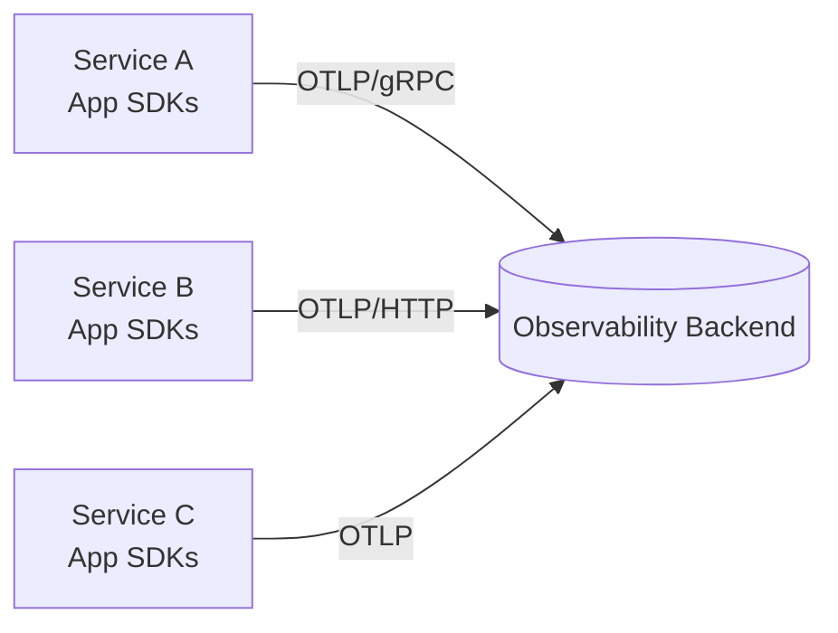
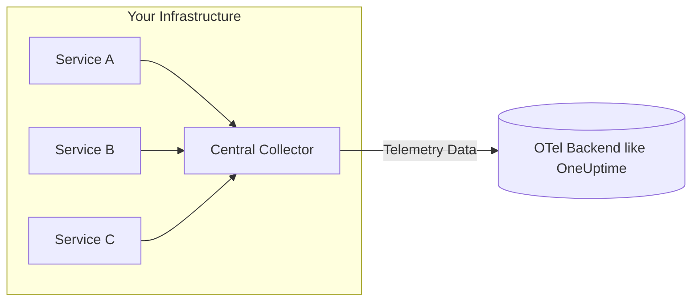

# OpenTelemetry Collector: What It Is, When You Need It, and When You Don’t

Author: [devneelpatel](https://www.github.com/devneelpatel)

Tags: OpenTelemetry, Observability, Metrics, Logs, Traces, Collector, Cost Optimization, Reliability, Sampling

Description: A practical, no-fluff guide to understanding the OpenTelemetry Collector - what it does, how it works, real architecture patterns (with and without it), and how to decide if/when you should deploy one for performance, control, security, and cost efficiency.

---

> Do you really need an OpenTelemetry Collector? If you're just sprinkling SDKs into a side project - maybe not. If you're running a multi-service production environment and care about cost, performance, security boundaries, or intelligent processing - yes, you almost certainly do.

This post explains *exactly* what the OpenTelemetry Collector is, why it exists, how data flows **with** and **without** it, and the trade‑offs of each approach. You’ll leave with a decision framework, deployment patterns, and practical configuration guidance.

---

## Quick Definition

The **OpenTelemetry Collector** is a **vendor‑neutral, pluggable telemetry pipeline** that receives, processes, and exports telemetry signals (traces, metrics, logs, profiles, more coming) from your applications to one or more backends (one of those backends is [OneUptime](https://oneuptime.com)).

It removes vendor SDK lock‑in, centralizes telemetry policy, and gives you a programmable choke point to:

- Clean the data (remove sensitive fields, add context)
- Batch sends and retry automatically when exports fail
- Sample smartly (keep errors & rare slow traces, trim noisy success traffic)
- Smooth out differences between frameworks / SDK versions
- Route traces, metrics, and logs to different backends
- Act as a safety barrier between app nodes and the public internet
- Cut cost early by dropping low‑value or redundant telemetry

---

## Architecture at 10,000ft

### 1. Without a Collector (Direct Export)
Each service ships telemetry directly to your backend (e.g., OneUptime, another SaaS, or self‑hosted store):



**Pros:**
- Simpler (fewer moving parts)
- Lower operational overhead
- Good for small apps / POCs

**Cons:**
- Each service handles retries, auth, backpressure
- Hard to change exporters later (coupling)
- No central sampling / scrubbing / routing
- Higher risk of SDK or network misconfig hurting reliability
- Increased egress cost if sending duplicate data to multiple vendors

### 2. With a Central Collector
All apps send to a centralized Collector (or a tiered set) which then exports.



**Pros:**
- Centralized config: sampling, redaction, enrichment
- One egress channel with batching & retry
- Decouple app lifecycle from vendor changes
- Multi-destination routing (e.g., traces, metrics, logs → OneUptime, logs → S3)
- Reduce noisy telemetry before it hits priced tiers
- Security boundary: no direct outbound to internet from app nodes

**Cons:**
- Extra component to deploy / monitor
- Potential chokepoint (must size + scale properly)
- Misconfiguration can drop all telemetry

---

## Direct Export vs Collector: Side‑by‑Side

| Dimension | Direct Export | Collector-Based |
|-----------|---------------|-----------------|
| Setup Speed | Fast | Moderate |
| Policy Control (sampling/redaction) | Per service | Centralized |
| Multi-backend Routing | Manual duplication | Built-in pipelines |
| Cost Optimization | Hard | Easy (drop early) |
| Failure Isolation | Each app handles retries | Central queue + backpressure |
| Security (egress lockdown) | Outbound from every app | Single controlled egress |
| Config Drift Risk | High | Low (single source) |
| Vendor Migration | Painful (touch all apps) | Swap exporter centrally |
| Scaling Pressure | Apps bear it | Collector tier handles it |
| Recommended For | Small app / POC | Production / multi-service |

---

## What the Collector Actually Does (Core Concepts)

| Component | Purpose |
|-----------|---------|
| Receivers | Ingest telemetry (OTLP, Jaeger, Prometheus, Zipkin, Syslog, etc.) |
| Processors | Transform / batch / sample / tail filter / memory limit |
| Exporters | Send to destinations (OTLP, Kafka, S3, logging, load balancers) |
| Extensions | Auth, health check, zpages, pprof, headers, feature add-ons |
| Pipelines | Declarative graphs binding receiver → processors → exporter |

A minimal example pipeline (YAML):

```yaml
receivers:
  otlp:
    protocols:
      grpc:
      http:

processors:
  batch:
    send_batch_max_size: 8192
    timeout: 5s
  memory_limiter:
    limit_mib: 512
    spike_limit_mib: 128
    check_interval: 2s
  attributes/redact:
    actions:
      - key: user.email
        action: delete
  tail_sampling:
    decision_wait: 5s
    num_traces: 10000
    policies:
      - name: errors
        type: status_code
        status_code:
          status_codes: [ERROR]
      - name: latency
        type: latency
        latency:
          threshold_ms: 500

exporters:
  otlphttp_oneuptime:
    endpoint: https://oneuptime.com/otlp/v1/traces
    headers:
      x-oneuptime-token: ${ONEUPTIME_TOKEN}


service:
  pipelines:
    traces:
      receivers: [otlp]
      processors: [memory_limiter, batch, tail_sampling, attributes/redact]
      exporters: [otlphttp_oneuptime]
    metrics:
      receivers: [otlp]
      processors: [memory_limiter, batch]
      exporters: [otlphttp_oneuptime]
    logs:
      receivers: [otlp]
      processors: [memory_limiter, batch, attributes/redact]
      exporters: [otlphttp_oneuptime]
    
```

---

## When You Definitely Need a Collector

- You want **tail sampling** (decide after seeing full trace) to keep 100% of errors & rare paths but downsample boring traffic.
- You need **multi-destination routing** (e.g., traces, metrics, logs → OneUptime, logs → S3/ClickHouse, security events → SIEM).
- You must **strip sensitive PII** before it leaves your network.
- You need **cost governance**—drop chatty spans/metrics at the edge.
- You want **hot-swappable vendors** without touching app code.
- You require **network isolation** (no direct internet from app nodes).
- You need **central retries / buffering** to survive outages gracefully.

## When You Can Probably Skip It (For Now)

- Single service + low traffic.
- You only emit a few key metrics and a handful of spans.
- You are experimenting locally / learning OTel basics.
- You have no current need for sampling, routing, or redaction.

(But design your app setup so you can add a collector later with a one-line endpoint change. Ideally an env variable change)

---

## Cost Optimization: Why the Collector Often Pays for Itself

Raw telemetry can explode: high-cardinality logs, trace spans for internal cron noise, verbose debug metrics. Sending everything directly → backend = surprise bill.

Collector lets you:

- Batch aggressively → fewer network round trips
- Drop low-value spans (health checks, cache hits)
- Tail sample: keep 100% of errors, maybe 10% of success
- Strip high-cardinality attributes before storage
- Aggregate / reduce metrics before export
- Route *only* audit-critical logs to expensive storage; bulk to cheap object store

> Every dollar saved upstream compounds monthly. The collector is your first cost control valve.

---

## Observing the Observer: Collector Internal Metrics

You can (and should) scrape the collector's own metrics to watch queue length, dropped spans, export latency. See our post: 

- [How to collect internal metrics from OpenTelemetry Collector?](https://oneuptime.com/blog/post/2025-01-22-how-to-collect-opentelemetry-collector-internal-metrics/view)
- [How to increase the size of the sending queue in OpenTelemetry Collector?](https://oneuptime.com/blog/post/2025-01-20-increase-size-of-open-telemetry-collector-queue/view)

---

## Related Concepts

- [Traces vs Metrics in Software Observability](https://oneuptime.com/blog/post/2025-08-21-traces-vs-metrics-in-opentelemetry/view)
- [Logs, Metrics & Traces: A Before and After Story.](https://oneuptime.com/blog/post/2025-08-21-logs-traces-metrics-before-and-after/view)
- [How to reduce noise in OpenTelemetry?](https://oneuptime.com/blog/post/2025-08-25-how-to-reduce-noise-in-opentelemetry/view)

---

## Final Take

If observability is core to operating your system (it should be), the Collector becomes the *control plane* for your telemetry. Start simple, add capabilities incrementally, and let it pay for itself through cost savings, flexibility, and reliability.

> Golden rule: **Emit broadly at the edge, curate aggressively in the pipeline, store intentionally in the backend.** The Collector is where that curation lives.

---

Need a production-grade backend for your Collector pipelines? **OneUptime** natively supports OpenTelemetry for traces, metrics, logs, and more - without vendor lock‑in.

Happy instrumenting.
