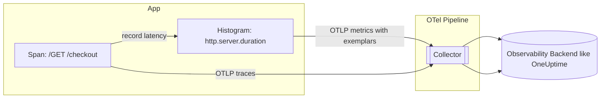

# Connecitng Metrics ↔ Traces with Exemplars in OpenTelemetry

Author: [nawazdhandala](https://www.github.com/nawazdhandala)

Tags: OpenTelemetry, Metrics, Traces, Exemplars, Correlation, Histograms, Performance

Description: A hands-on guide to exemplars, how they connect metric points to the exact trace that caused them, why they matter for faster debugging and cost efficiency, and how to enable them end‑to‑end with OpenTelemetry (apps → collector → backend (like oneuptime)).

---

You’ve got metrics for fast dashboards and traces for deep debugging—but how do you jump from a painful P99 spike to the one slow request that caused it? That’s what exemplars are for.

Exemplars attach a trace reference (trace_id, span_id) to selected metric data points - typically histogram buckets, so you can click a metric and land directly on a representative trace of that behavior.

This post shows what exemplars are, how they work in OpenTelemetry, and how to wire them up with minimal friction.

---

## TL;DR

- Use histograms for latency/size metrics; exemplars annotate buckets with trace links.
- Record measurements inside active spans; OTel SDKs automatically attach trace context to exemplars.
- Keep exemplars end-to-end by exporting OTLP → Collector → backend that supports exemplars (e.g., OneUptime).
- If you don’t see exemplars: no active span, wrong instrument type, exporter/backend doesn’t support exemplars, or aggressive metric aggregation dropped them.

---

## What is an Exemplar?

An exemplar is a sample data point stored alongside a metric data point that includes reference metadata—most commonly the trace_id/span_id. In practice: when a histogram bucket count increases (say, the 500–1000ms latency bucket), the SDK may also attach an exemplar pointing to the trace of the request that produced that measurement.

Why you care:
- Click from metrics to an actual trace in one step.
- Investigate the specific outliers (tail latency, errors) instead of averages.
- Keep metrics high-level and cheap, but retain a breadcrumb to deep context only when needed.

---

## How Exemplars Flow Through OTel



- The application records a histogram measurement while a span is active.
- The SDK attaches an exemplar (trace_id/span_id) to that histogram bucket.
- The Collector forwards metrics and traces via OTLP to the backend.
- In your charts, clicking the bucket exemplar takes you to the exact trace.

---

## Minimal Implementation (Language-Agnostic)

Conceptually, you need just three things:

1) Use a histogram for the metric you want to correlate (e.g., http.server.duration in milliseconds).
2) Record the metric while a span is active.
3) Export via OTLP to a backend that renders exemplars.

### Pseudocode

```pseudo
tracer = getTracer()
meter = getMeter()
latency = meter.createHistogram("http.server.duration", unit="ms")

handleRequest(req):
  span = tracer.startSpan("HTTP GET /checkout")
  with context(span):
    t0 = now()
    try:
      result = doWork()
      return result
    finally:
      ms = now() - t0
      latency.record(ms)   # recorded while span is active → exemplar attached
      span.end()
```

That’s it—no special API for exemplars in most SDKs; they’re attached automatically when recording within an active span.

---

## Example: Node.js (TypeScript)

```ts
import { context, trace } from '@opentelemetry/api'
import { MeterProvider } from '@opentelemetry/sdk-metrics'

const meterProvider = new MeterProvider()
const meter = meterProvider.getMeter('web')
const latency = meter.createHistogram('http.server.duration', {
  description: 'Server request duration',
  unit: 'ms',
})

const tracer = trace.getTracer('web')

async function handle(req: Request) {
  const span = tracer.startSpan('GET /checkout')
  return await context.with(trace.setSpan(context.active(), span), async () => {
    const start = // start time
    try {
      // ... your handler logic ...
      return new Response('ok')
    } finally {
      const total_time = // start time - now.
      latency.record(total_time)
      span.end()
    }
  })
}
```

Notes:
- Use an OTLP exporter for metrics and traces (app → Collector).
- Ensure your backend supports exemplars; with OTLP they ride along with metric data points.

---

## Collector: Keep Exemplars Intact

If you route through the OpenTelemetry Collector (recommended for production), you generally don’t need special config—just make sure you’re using OTLP in and out, and avoid processors that strip exemplars.


Tip: Exemplars are most useful on histograms (latency/size). Prefer histograms over summaries for correlation and SLO math; see also our guide on percentiles and histograms:
- https://oneuptime.com/blog/post/2025-09-15-p50-vs-p95-vs-p99-latency-percentiles/view
- https://oneuptime.com/blog/post/2025-08-26-what-are-metrics-in-opentelemetry/view
- https://oneuptime.com/blog/post/2025-08-21-traces-vs-metrics-in-opentelemetry/view

---

## Common Pitfalls (and Fixes)

- No active span context when recording the metric
  - Fix: start a span (or use an existing one) and record within its context.
- Using the wrong instrument type (e.g., a counter when you need a histogram)
  - Fix: use histograms for latency/size; counters/gauges don’t surface bucket exemplars.
- Exporter/backend doesn’t support exemplars
  - Fix: use OTLP end-to-end and a backend that renders exemplar links (OneUptime supports this).
- Aggressive metric aggregation or downsampling removes exemplars
  - Fix: ensure your metrics pipeline preserves exemplars on histogram data points.
- Scraping via a path that drops exemplars
  - Fix: prefer OTLP over legacy scrape paths when you need exemplars preserved.

---

## Why This Matters

- Reduce MTTR: click straight from a red P99 to the exact bad request.
- Control cost: keep metrics lightweight but retain deep debug only when you need it.
- Better SLOs: histograms + exemplars help you investigate tail distributions fast.

If observability is your safety net, exemplars are the stitches that bind fast metrics to deep traces.

---

Need a backend that renders exemplars and natively supports OpenTelemetry? OneUptime speaks OTLP for metrics and traces, so you can wire apps → collector → OneUptime and get click-throughs from metrics to traces.

Happy instrumenting.
