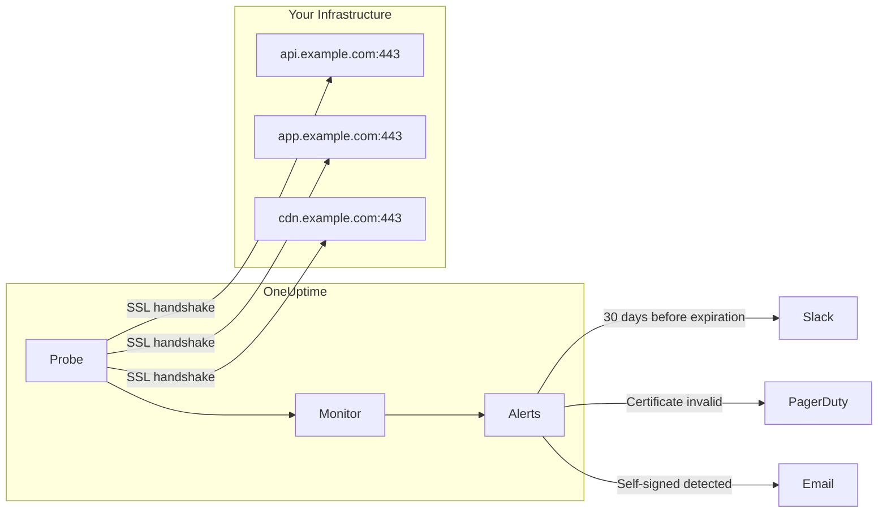

# How to monitor SSL Certificate with OneUptime: Never Let a Certificate Expire Again

Author: [nawazdhandala](https://www.github.com/nawazdhandala)

Tags: SSL, TLS, Certificate Monitoring, Security, Monitoring, Infrastructure, DevOps, Reliability, Uptime Monitoring

Description: A comprehensive guide to monitoring SSL certificates with OneUptime - from setup and configuration to advanced monitoring scenarios. Learn how to prevent certificate expiration outages, track certificate health, and set up intelligent alerting for your SSL infrastructure.

---

SSL certificate expiration is one of those "preventable disasters" that still catch teams off guard. One minute your site is running fine, the next minute customers can't connect because your certificate expired at 3 AM on a weekend.

OneUptime's SSL certificate monitoring eliminates this risk by continuously checking your certificates, tracking expiration dates, validating certificate chains, and alerting you well before problems occur.

This guide shows you how to set up comprehensive SSL monitoring that goes beyond simple expiration tracking.

---

## TL;DR

- OneUptime monitors SSL certificates continuously, checking validity, expiration, and certificate details.
- Set up monitors for each critical domain and configure alerts 30+ days before expiration.
- Monitor certificate authority trust, self-signed status, and certificate chain validity.
- Use monitoring intervals appropriate for your RTO/RPO requirements (daily for most cases).
- Integrate alerts with your incident management workflow for proactive certificate renewal.

---

## Why SSL Certificate Monitoring Matters

SSL certificate failures cause:
- **Complete service outages**: Users can't connect to your application
- **Trust warnings**: Browsers display scary security warnings that drive users away
- **SEO penalties**: Search engines downrank sites with certificate issues
- **Compliance violations**: Many regulations require valid certificates
- **Revenue loss**: E-commerce sites lose money immediately when certificates fail

The worst part? Certificate expiration is 100% preventable with proper monitoring.

---

## How OneUptime Monitors SSL Certificates

OneUptime's SSL monitoring works by:

1. **Connecting to your domains on port 443** (or custom ports)
2. **Retrieving the full certificate chain**
3. **Validating certificate properties**:
   - Expiration date
   - Certificate authority trust
   - Common name and SAN matches
   - Self-signed status
   - Certificate fingerprints
4. **Checking certificate health continuously**
5. **Alerting when issues are detected**



---

## Setting Up Your First SSL Monitor

### Step 1: Create a New Monitor

1. Navigate to **Monitors** in your OneUptime dashboard
2. Click **Create Monitor**
3. Select **SSL Certificate** as the monitor type
4. Enter your domain (e.g., `https://api.example.com`)

### Step 2: Configure Basic Settings

```
Monitor Name: API SSL Certificate
Description: Monitors SSL certificate for api.example.com
URL: https://api.example.com
Port: 443 (default)
Monitoring Interval: Every 6 hours
```

**Why 6 hours?** Most certificates are valid for months/years, so checking every few hours provides fast detection without overwhelming your infrastructure.

### Step 3: Set Up Monitoring Criteria

OneUptime automatically creates intelligent default criteria:

- **Certificate Validity**: Alert when certificate is invalid or self-signed
- **Expiration Warning**: Alert 30 days before expiration
- **Connection Failure**: Alert when SSL handshake fails

You can customize these thresholds based on your renewal process timeline.

---

## Advanced SSL Monitoring Scenarios

### Monitoring Multiple Subdomains

Create separate monitors for each critical subdomain:

```
✓ api.example.com
✓ app.example.com  
✓ cdn.example.com
✓ admin.example.com
✓ webhook.example.com
```

### Custom Ports and Non-Standard Configurations

Not all SSL services run on port 443:

```
Database SSL: db.example.com:5432
SMTP SSL: mail.example.com:465
HTTPS Proxy: proxy.example.com:8443
```

OneUptime can monitor SSL on any port where TLS is terminated.

### Wildcard Certificate Monitoring

For wildcard certificates (*.example.com), monitor the primary domain and key subdomains:

```
Primary: example.com (wildcard cert)
Critical subdomains: api.example.com, app.example.com
```

This ensures both the certificate validity and that DNS/routing works correctly for each subdomain.

---

## Understanding SSL Certificate Data

OneUptime collects comprehensive certificate information:

### Basic Certificate Properties
- **Common Name (CN)**: Primary domain the certificate covers
- **Subject Alternative Names (SAN)**: Additional domains covered
- **Issuer**: Certificate Authority that signed the certificate
- **Valid From / Valid To**: Certificate validity period

### Security Properties
- **Self-Signed Status**: Whether certificate is self-signed
- **Certificate Chain**: Full trust path to root CA
- **Signature Algorithm**: Cryptographic algorithm used
- **Key Size**: Strength of the certificate key

### Certificate Fingerprints
- **SHA-1 Fingerprint**: Legacy fingerprint for identification
- **SHA-256 Fingerprint**: Modern fingerprint for verification

This data helps with security audits, compliance reporting, and certificate lifecycle management.

---

## Setting Up Intelligent Alerting

### Expiration Alerting Strategy

Set up cascading alerts for different urgency levels:

```
90 days: Information (start planning renewal)
30 days: Warning (begin renewal process)  
7 days: Critical (urgent renewal required)
1 day: Emergency (immediate action needed)
```

### Custom Alert Criteria

You can create alerts for specific scenarios:

**Self-Signed Certificate Detection**:
```yaml
Condition: SSL Certificate is self-signed
Action: Immediate alert to security team
```

**Certificate Authority Changes**:
```yaml
Condition: Certificate issuer changes unexpectedly  
Action: Alert for manual verification
```

---

## Monitoring Best Practices

### 1. Monitor What Matters
- Production domains (critical)
- Customer-facing endpoints (critical)
- API endpoints (high priority)
- Admin interfaces (medium priority)
- Internal services (low priority)

### 2. Set Appropriate Intervals
- **Critical services**: Every hour
- **Important services**: Every 6 hours  
- **Standard services**: Daily
- **Internal services**: Weekly

### 3. Plan Your Renewal Process
- **90 days out**: Add to renewal calendar
- **60 days out**: Begin procurement/approval process
- **30 days out**: Generate new certificate
- **7 days out**: Deploy and test new certificate
- **1 day out**: Emergency deployment if needed

### 4. Test Certificate Deployment
After renewing certificates:
- Verify monitors show the new certificate
- Check expiration dates updated correctly
- Confirm certificate chain is valid
- Test from multiple geographic locations

---

## Troubleshooting Common Issues

### "No Certificate Found" Errors

**Symptoms**: Monitor reports no certificate available
**Causes**:
- SSL not enabled on the target port
- Firewall blocking connections
- Wrong port configuration
- Server not serving SSL on specified domain

**Solutions**:
- Verify SSL is configured: `openssl s_client -connect domain.com:443`
- Check firewall rules allow inbound SSL connections
- Confirm port configuration matches server setup
- Test certificate serves correctly for the exact domain

### "Self-Signed Certificate" Warnings

**Symptoms**: Certificate marked as self-signed when it shouldn't be
**Causes**:
- Certificate is actually self-signed
- Incomplete certificate chain
- Missing intermediate certificates
- Certificate trust store issues

**Solutions**:
- Install complete certificate chain including intermediates
- Verify certificate was issued by trusted CA
- Test certificate chain: `openssl verify -verbose certificate.crt`

### Intermittent SSL Failures

**Symptoms**: SSL monitoring sometimes succeeds, sometimes fails
**Causes**:
- Load balancer serving mixed certificates
- DNS round-robin with different SSL configs  
- Certificate caching issues
- Network connectivity problems

**Solutions**:
- Ensure all load balancer nodes have same certificate
- Verify DNS resolution consistency
- Check for certificate sync issues across servers
- Monitor from multiple probe locations

---

## SSL Monitoring at Scale

### Multi-Environment Strategy

Organize monitoring across environments:

```
Production:
├── api.example.com
├── app.example.com  
└── cdn.example.com

Staging:
├── api-staging.example.com
├── app-staging.example.com
└── cdn-staging.example.com

Development:
├── api-dev.example.com
└── app-dev.example.com
```

Use different alert thresholds for each environment (production gets faster response, development can have longer lead times).


---


## Conclusion

SSL certificate monitoring with OneUptime transforms certificate management from reactive fire-fighting to proactive maintenance. By setting up comprehensive monitoring, you:

- **Eliminate certificate outages** with advance warning
- **Improve security posture** through continuous validation  
- **Reduce operational stress** by catching issues early
- **Enable compliance** with detailed certificate tracking
- **Save money** by preventing emergency renewals and downtime

Start with your most critical domains, establish good alerting thresholds, and gradually expand coverage to your entire SSL infrastructure.

Your customers will never see a certificate error, your team will sleep better, and your infrastructure will be more reliable.

---

Ready to set up bulletproof SSL monitoring? OneUptime makes it easy to monitor SSL certificates across your entire infrastructure with intelligent alerting and comprehensive reporting.

Start monitoring your SSL certificates today and never worry about certificate expiration again.