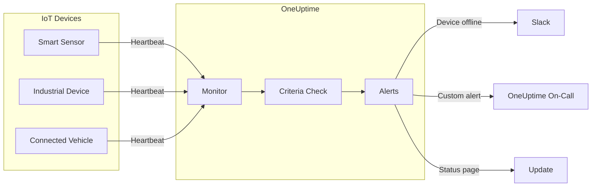

# Monitoring IoT Devices with OneUptime: Keep Your Connected Devices in Check

Author: [nawazdhandala](https://www.github.com/nawazdhandala)

Tags: IoT, Monitoring, Incoming Request, Heartbeat, Devices, Reliability, DevOps

Description: A comprehensive guide to monitoring IoT devices with OneUptime's incoming request monitors. Learn how to set up heartbeat monitoring for your connected devices, configure alerts, and ensure your IoT infrastructure stays reliable.

---

IoT devices are everywhere - from edge devices and industrial sensors to connected vehicles and medical devices. But with great connectivity comes great responsibility: how do you know if your IoT devices are still online and functioning?

OneUptime's IoT monitoring solves this with incoming request monitors that let your devices "ping" OneUptime with heartbeats. If a device stops sending heartbeats, you get alerted immediately.

This guide shows you how to set up comprehensive IoT monitoring that keeps your connected infrastructure reliable.

---

## TL;DR

- OneUptime monitors IoT devices through heartbeat signals sent to a unique endpoint
- Devices send GET/POST requests with custom payloads to indicate they're online
- Set up monitors with expected heartbeat intervals and get alerted when devices go offline
- Monitor device health, connectivity, and custom metrics through request payloads
- Use incoming request monitors for any device that can make HTTP requests

---

## Why IoT Device Monitoring Matters

IoT devices operate in remote, often inaccessible locations. When they fail:

- **Lost visibility**: You don't know device status until customers report issues
- **Delayed response**: Problems compound while you remain unaware
- **Safety risks**: Failed sensors in critical systems (medical, industrial) create hazards
- **Revenue impact**: Offline devices mean lost data, service interruptions, or failed automation
- **Maintenance nightmares**: Reactive repairs are expensive and time-consuming

Proactive IoT monitoring transforms this from reactive firefighting to predictive maintenance.

---

## How OneUptime Monitors IoT Devices

OneUptime's IoT monitoring works through **incoming request monitors**:

1. **Create a monitor** with a unique secret key
2. **Get a heartbeat URL** (e.g., `https://your-domain.com/heartbeat/abc123`)
3. **Devices send HTTP requests** to this URL at regular intervals
4. **OneUptime tracks request timestamps** and validates against criteria
5. **Alerts trigger** when expected heartbeats are missed



---

## Setting Up Your First IoT Monitor

### Step 1: Create an Incoming Request Monitor

1. Navigate to **Monitors** in your OneUptime dashboard
2. Click **Create Monitor**
3. Select **Incoming Request** as the monitor type
4. Enter monitor details:
   ```
   Monitor Name: Factory Floor Sensor Network
   Description: Monitors heartbeat signals from industrial IoT sensors
   ```

### Step 2: Configure Heartbeat Expectations

Set up criteria for when the monitor should be considered healthy:

```
Monitor Criteria:
- Incoming request received within last 5 minutes
- Request method: GET or POST
- Response status: 200 OK
```

### Step 3: Get Your Heartbeat URL

After creating the monitor, OneUptime provides a unique URL:

```
https://oneuptime.com/heartbeat/abc123def456
```

This URL is specific to your monitor and includes a secret key for security.

---

## Integrating IoT Devices

### Basic Heartbeat Implementation

For devices that can make HTTP requests:

**Python (MicroPython/Raspberry Pi):**
```python
import urequests  # or requests for full Python
import time

HEARTBEAT_URL = "https://oneuptime.com/heartbeat/abc123"
INTERVAL = 300  # 5 minutes

while True:
    try:
        response = urequests.get(HEARTBEAT_URL)
        print(f"Heartbeat sent: {response.status_code}")
        response.close()
    except Exception as e:
        print(f"Heartbeat failed: {e}")
    
    time.sleep(INTERVAL)
```

**Arduino (ESP32/ESP8266):**
```cpp
#include <WiFi.h>
#include <HTTPClient.h>

const char* HEARTBEAT_URL = "https://oneuptime.com/heartbeat/abc123";
const int INTERVAL = 300000; // 5 minutes in milliseconds

void setup() {
  WiFi.begin("SSID", "PASSWORD");
  // ... WiFi connection code
}

void loop() {
  if (WiFi.status() == WL_CONNECTED) {
    HTTPClient http;
    http.begin(HEARTBEAT_URL);
    int httpCode = http.GET();
    Serial.println("Heartbeat: " + String(httpCode));
    http.end();
  }
  delay(INTERVAL);
}
```

### Advanced Payload Monitoring

Send custom data with heartbeats for richer monitoring:

```python
import json
import requests

payload = {
    "device_id": "sensor_001",
    "temperature": 23.5,
    "battery_level": 85,
    "location": "factory_floor_a"
}

response = requests.post(
    HEARTBEAT_URL,
    json=payload,
    headers={"Content-Type": "application/json"}
)
```

OneUptime stores this payload data, allowing you to:
- Monitor device-specific metrics
- Track device locations
- Alert on battery levels or sensor readings
- Create custom dashboards

---

## Monitoring Strategies for IoT

### Device Categories and Intervals

Different IoT devices need different monitoring frequencies:

```
Critical Infrastructure:
├── Medical devices: Every 1 minute
├── Industrial controls: Every 5 minutes
└── Safety systems: Every 2 minutes

Standard Devices:
├── Environmental sensors: Every 15 minutes
├── Smart meters: Every 30 minutes
└── Asset trackers: Every 10 minutes

Low-Power Devices:
├── Battery-powered sensors: Every hour
├── Solar devices: Every 2 hours
└── Maintenance sensors: Every 6 hours
```

---

## Advanced IoT Monitoring Scenarios

### Fleet Monitoring

Monitor entire fleets of devices:

```
Vehicle Fleet:
├── GPS trackers: Location + status
├── Engine sensors: Performance metrics
├── Fuel monitors: Consumption data
└── Maintenance alerts: Service reminders
```

### Industrial IoT (IIoT)

Critical manufacturing monitoring:

```
Production Line:
├── Machine status: Online/offline
├── Quality sensors: Defect rates
├── Temperature monitors: Equipment health
└── Predictive maintenance: Vibration analysis
```

### Smart Building Systems

Building automation monitoring:

```
HVAC Systems:
├── Thermostat status: Temperature control
├── Occupancy sensors: Space utilization
├── Energy monitors: Consumption tracking
└── Security systems: Access control
```

---

## Alerting and Incident Response

### Cascading Alert Strategy

Set up progressive alerts based on severity:

```
5 minutes overdue: Information alert (check device)
15 minutes overdue: Warning alert (investigate)
1 hour overdue: Critical alert (dispatch technician)
4 hours overdue: Emergency (business impact)
```

### Integration with Response Workflows

Connect alerts to your incident management:

- **Slack/OneUptime On-Call**: Immediate notifications
- **ServiceNow/Jira**: Ticket creation
- **Custom workflows**: Automated remediation
- **Status pages with OneUptime**: Customer communication

### Custom Alert Conditions

Create alerts for specific scenarios:

**Battery Level Monitoring:**
```yaml
Condition: Battery level < 20% in payload
Action: Alert maintenance team
```

**Location-Based Alerts:**
```yaml
Condition: Device moved outside geofence
Action: Security alert
```

---

## IoT Monitoring Best Practices


### 1. Payload Standardization

Establish consistent payload formats across your IoT devices for that one specific monitor:

```json
{
  "device_id": "unique_identifier",
  "timestamp": "2025-09-24T10:30:00Z",
  "status": "online|offline|error",
  "metrics": {
    "temperature": 23.5,
    "battery": 85,
    "signal_strength": -45
  },
  "location": {
    "lat": 40.7128,
    "lon": -74.0060
  }
}
```

### 2. Network Considerations

Account for IoT network limitations:

- **Intermittent connectivity**: Allow grace periods for reconnection
- **Low bandwidth**: Keep payloads minimal
- **Power constraints**: Balance monitoring frequency with battery life


---

## IoT Monitoring at Scale

### Enterprise IoT Deployments

For large-scale IoT monitoring:

**Hierarchical Monitoring:**
```
Global View (on OneUptime Status Page):
├── Regional aggregators
├── Fleet summaries
└── Service-level dashboards

Device Level (on OneUptime Dashboard):
├── Individual device status
├── Performance metrics
└── Maintenance schedules
```

**Automated Onboarding:**
- API-driven monitor creation
- Bulk device registration
- Configuration templates
- Automated secret key distribution

---

## Conclusion

IoT device monitoring with OneUptime transforms reactive maintenance into proactive reliability. By implementing heartbeat monitoring, you:

- **Detect failures immediately** instead of waiting for customer reports
- **Reduce downtime** through predictive maintenance
- **Improve safety** by monitoring critical systems
- **Scale efficiently** with automated monitoring
- **Save costs** by preventing widespread outages

Start with your most critical IoT devices, establish reliable heartbeat patterns, and gradually expand coverage across your entire connected infrastructure.

Your IoT ecosystem will be more reliable, your operations more efficient, and your customers more satisfied.

---

Ready to monitor your IoT devices? OneUptime makes it easy to set up heartbeat monitoring for any device that can make HTTP requests.

Start monitoring your IoT infrastructure today and never lose visibility into your connected devices again.