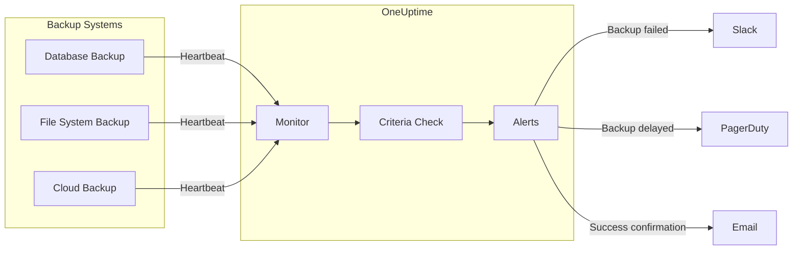

# Monitoring Backup Jobs with OneUptime: Ensure Your Backups Actually Work

Author: [nawazdhandala](https://www.github.com/nawazdhandala)

Tags: Backup, Monitoring, Incoming Request, Heartbeat, Jobs, Reliability, DevOps, Data Protection, Automation

Description: A comprehensive guide to monitoring backup jobs with OneUptime's incoming request monitors. Learn how to track backup job status, detect failures, and ensure your data protection strategy works when you need it most.

---

Backup jobs are the unsung heroes of data protection - but what happens when they fail silently? OneUptime's incoming request monitors let your backup scripts and tools send heartbeat signals, ensuring you know immediately when backups succeed or fail.

This guide shows you how to set up comprehensive backup monitoring that gives you confidence in your data protection strategy.

---

## TL;DR

- OneUptime monitors backup jobs through heartbeat signals sent from backup scripts
- Track backup start, progress, completion, and failures in real-time
- Set up monitors for each critical backup job with appropriate alert thresholds
- Integrate with popular backup tools like rsync, mysqldump, pg_dump, and cloud backup services
- Get alerted immediately when backups fail or run longer than expected

---

## Why Backup Job Monitoring Matters

Backup failures can be catastrophic:

- **Silent failures**: Backups appear to run but don't actually protect data
- **Partial backups**: Some files excluded due to permissions or corruption
- **Performance degradation**: Slow backups impacting production systems
- **Storage issues**: Out of space or connectivity problems
- **Compliance violations**: Regulatory requirements for backup verification
- **Recovery failures**: Discovering backup issues only during restoration

The worst part? Most backup failures go undetected until disaster strikes.

---

## How OneUptime Monitors Backup Jobs

OneUptime's backup monitoring works through **incoming request monitors**:

1. **Create a monitor** for each backup job with a unique secret key
2. **Get a heartbeat URL** (e.g., `https://your-domain.com/heartbeat/backup123`)
3. **Backup scripts send HTTP requests** at key points: start, progress, completion
4. **OneUptime tracks timestamps** and validates against expected schedules
5. **Alerts trigger** when backups fail, run too long, or miss scheduled runs



---

## Setting Up Your First Backup Monitor

### Step 1: Create an Incoming Request Monitor

1. Navigate to **Monitors** in your OneUptime dashboard
2. Click **Create Monitor**
3. Select **Incoming Request** as the monitor type
4. Enter monitor details:
   ```
   Monitor Name: Daily Database Backup
   Description: Monitors completion of nightly PostgreSQL backup job
   ```

### Step 2: Configure Backup Expectations

Set up criteria for healthy backup behavior:

```
Monitor Criteria:
- Incoming request received within last 24 hours (for daily backups)
- Request method: POST (to send backup metadata)
- Response status: 200 OK
```

### Step 3: Get Your Heartbeat URL

After creating the monitor, OneUptime provides a unique URL:

```
https://oneuptime.com.com/heartbeat/db_backup_abc123
```

This URL is specific to your backup job and includes a secret key for security.

---

## Integrating Backup Scripts

### Basic Backup Monitoring

For simple backup scripts:

**Bash Script:**

This script wraps a PostgreSQL backup with heartbeat signals at start, success, and failure. The OneUptime monitor will alert if no heartbeat is received within the expected window (e.g., 24 hours for daily backups).

```bash
#!/bin/bash
# backup-postgres.sh - PostgreSQL backup with OneUptime monitoring

# Your unique heartbeat URL from the OneUptime monitor
HEARTBEAT_URL="https://your-domain.com/heartbeat/db_backup_abc123"

# Capture start time for duration calculation
BACKUP_START=$(date +%s)

# Send start heartbeat - lets OneUptime know backup has begun
curl -X POST "$HEARTBEAT_URL" \
  -H "Content-Type: application/json" \
  -d "{\"status\":\"started\",\"timestamp\":\"$BACKUP_START\"}"

# Perform the actual database backup
# pg_dump exports the database to a SQL file
if pg_dump mydb > backup.sql; then
  # Backup succeeded - calculate metrics and send success heartbeat
  BACKUP_END=$(date +%s)
  DURATION=$((BACKUP_END - BACKUP_START))

  # Include duration and file size for tracking trends
  curl -X POST "$HEARTBEAT_URL" \
    -H "Content-Type: application/json" \
    -d "{\"status\":\"completed\",\"duration\":$DURATION,\"size\":$(stat -f%z backup.sql)}"
else
  # Backup failed - send failure heartbeat to trigger alert
  curl -X POST "$HEARTBEAT_URL" \
    -H "Content-Type: application/json" \
    -d "{\"status\":\"failed\",\"error\":\"pg_dump failed\",\"timestamp\":\"$(date +%s)\"}"
fi
```

**Python Script:**

The Python version provides more robust error handling and makes it easier to extend with additional backup logic. The `send_heartbeat` function includes automatic retry and timeout handling.

```python
import requests
import time
import subprocess

# Heartbeat URL from your OneUptime incoming request monitor
HEARTBEAT_URL = "https://your-domain.com/heartbeat/db_backup_abc123"

def send_heartbeat(status, **kwargs):
    """Send a heartbeat signal to OneUptime with status and metadata."""
    # Build payload with status, timestamp, and any additional fields
    payload = {"status": status, "timestamp": int(time.time()), **kwargs}
    try:
        # Timeout ensures backup script doesn't hang on network issues
        response = requests.post(HEARTBEAT_URL, json=payload, timeout=10)
        return response.status_code == 200
    except Exception as e:
        # Log but don't fail the backup if heartbeat fails
        print(f"Failed to send heartbeat: {e}")
        return False

# Notify OneUptime that backup is starting
send_heartbeat("started")

try:
    start_time = time.time()

    # Execute pg_dump and capture output
    # check=True raises CalledProcessError if pg_dump fails
    result = subprocess.run(["pg_dump", "mydb"],
                          capture_output=True, text=True, check=True)

    # Calculate metrics for trend analysis
    duration = time.time() - start_time
    backup_size = len(result.stdout.encode('utf-8'))

    # Send success heartbeat with backup metrics
    send_heartbeat("completed", duration=duration, size=backup_size)

except subprocess.CalledProcessError as e:
    # Backup command failed - send failure heartbeat with error details
    send_heartbeat("failed", error=str(e), exit_code=e.returncode)
```

### Advanced Backup Monitoring

Send detailed backup metadata:

```python
def monitor_backup_job(backup_type, source, destination):
    payload = {
        "backup_type": backup_type,  # "database", "filesystem", "incremental"
        "source": source,
        "destination": destination,
        "hostname": socket.gethostname(),
        "start_time": datetime.now().isoformat(),
        "expected_duration": "2h",  # Expected completion time
        "compression": "gzip",
        "encryption": "AES256"
    }
    
    # Send start signal
    send_heartbeat("started", **payload)
    
    # ... perform backup ...
    
    # Send completion with metrics
    completion_payload = {
        "end_time": datetime.now().isoformat(),
        "total_files": 15420,
        "total_size": "45.2GB",
        "transfer_rate": "25MB/s",
        "compression_ratio": "3.2:1",
        "verification_hash": "sha256:abc123..."
    }
    
    send_heartbeat("completed", **completion_payload)
```

---

## Popular Backup Tool Integration

### Database Backups

**PostgreSQL with pg_dump:**
```bash
#!/bin/bash
HEARTBEAT_URL="https://your-domain.com/heartbeat/pg_backup_xyz"

# Start
curl -X POST "$HEARTBEAT_URL" -d '{"status":"started","database":"production"}'

# Backup
if pg_dump -Fc production > prod_backup.dump; then
  SIZE=$(stat -f%z prod_backup.dump)
  curl -X POST "$HEARTBEAT_URL" -d "{\"status\":\"completed\",\"size\":$SIZE}"
else
  curl -X POST "$HEARTBEAT_URL" -d '{"status":"failed","error":"pg_dump failed"}'
fi
```

**MySQL with mysqldump:**
```bash
#!/bin/bash
HEARTBEAT_URL="https://your-domain.com/heartbeat/mysql_backup_xyz"

# Start
curl -X POST "$HEARTBEAT_URL" -d '{"status":"started","database":"app_db"}'

# Backup with progress
mysqldump app_db | gzip > app_backup.sql.gz

if [ $? -eq 0 ]; then
  SIZE=$(stat -f%z app_backup.sql.gz)
  curl -X POST "$HEARTBEAT_URL" -d "{\"status\":\"completed\",\"size\":$SIZE,\"compressed\":true}"
else
  curl -X POST "$HEARTBEAT_URL" -d '{"status":"failed","error":"mysqldump failed"}'
fi
```

### File System Backups

**rsync Backups:**
```bash
#!/bin/bash
HEARTBEAT_URL="https://your-domain.com/heartbeat/rsync_backup_xyz"

# Start
curl -X POST "$HEARTBEAT_URL" -d '{"status":"started","source":"/data","destination":"backup-server:/backups"}'

# Backup with progress monitoring
rsync -avz --stats /data/ backup-server:/backups/ > rsync.log 2>&1

if [ $? -eq 0 ]; then
  # Extract stats from rsync output
  TRANSFERRED=$(grep "sent" rsync.log | awk '{print $1}')
  SPEED=$(grep "bytes/sec" rsync.log | awk '{print $1}')
  curl -X POST "$HEARTBEAT_URL" -d "{\"status\":\"completed\",\"transferred\":\"$TRANSFERRED\",\"speed\":\"$SPEED\"}"
else
  curl -X POST "$HEARTBEAT_URL" -d '{"status":"failed","error":"rsync failed"}'
fi
```

### Cloud Backup Integration

**AWS S3 Backups:**
```python
import boto3
import requests

HEARTBEAT_URL = "https://your-domain.com/heartbeat/s3_backup_xyz"

def backup_to_s3(bucket, source_dir, prefix):
    s3 = boto3.client('s3')
    
    # Send start
    requests.post(HEARTBEAT_URL, json={
        "status": "started",
        "provider": "AWS S3",
        "bucket": bucket,
        "source": source_dir
    })
    
    try:
        # Upload files
        total_files = 0
        total_size = 0
        
        for root, dirs, files in os.walk(source_dir):
            for file in files:
                local_path = os.path.join(root, file)
                s3_key = os.path.join(prefix, os.path.relpath(local_path, source_dir))
                
                s3.upload_file(local_path, bucket, s3_key)
                total_files += 1
                total_size += os.path.getsize(local_path)
        
        # Success
        requests.post(HEARTBEAT_URL, json={
            "status": "completed",
            "total_files": total_files,
            "total_size": f"{total_size} bytes",
            "provider": "AWS S3"
        })
        
    except Exception as e:
        requests.post(HEARTBEAT_URL, json={
            "status": "failed",
            "error": str(e),
            "provider": "AWS S3"
        })
```

---

## Backup Monitoring Strategies

### Backup Types and Frequencies

Different backup types need different monitoring approaches:

```
Critical Database Backups:
├── Frequency: Every 4-6 hours
├── Alert threshold: 1 hour overdue
└── Payload: Transaction log info, consistency checks

Daily File System Backups:
├── Frequency: Once per day
├── Alert threshold: 4 hours overdue  
└── Payload: File counts, sizes, transfer rates

Weekly Archive Backups:
├── Frequency: Weekly
├── Alert threshold: 24 hours overdue
└── Payload: Archive integrity, compression ratios

Incremental Backups:
├── Frequency: Every 1-2 hours
├── Alert threshold: 2 hours overdue
└── Payload: Changed files, delta sizes
```

### Multi-Stage Backup Monitoring

For complex backup workflows:

```
Pre-backup:
├── Send "preparing" heartbeat
├── Validate source availability
└── Check destination space

During Backup:
├── Send progress heartbeats every 10%
├── Monitor transfer rates
└── Check for errors

Post-backup:
├── Send "verifying" heartbeat
├── Run integrity checks
├── Update backup catalogs
└── Send final "completed" heartbeat
```

---

## Alerting and Incident Response

### Backup Alert Strategy

Set up cascading alerts based on severity:

```
Backup delayed (1 hour): Information alert
Backup failed: Critical alert (immediate)
Backup verification failed: Emergency alert
Multiple backups failing: System-wide alert
```

### Custom Alert Conditions

Create alerts for specific backup scenarios:

**Backup Size Anomalies:**
```yaml
Condition: Backup size changed by >50% from average
Action: Alert for investigation
```

**Slow Backup Performance:**
```yaml
Condition: Backup duration >2x average time
Action: Alert operations team
```

**Backup Chain Failures:**
```yaml
Condition: Incremental backup failed after full backup
Action: Emergency alert
```

---

## Backup Monitoring Best Practices

### 1. Monitor What Matters

Prioritize your backup monitoring:

- **Production databases**: Highest priority
- **Critical application data**: High priority
- **User data**: Medium priority
- **System configurations**: Medium priority
- **Development environments**: Low priority

### 2. Implement Backup Verification

Don't just monitor backup execution- verify backup integrity:

```python
def verify_backup(backup_path, expected_hash=None):
    # Calculate actual hash
    actual_hash = calculate_sha256(backup_path)
    
    # Send verification result
    requests.post(HEARTBEAT_URL, json={
        "status": "verified",
        "hash": actual_hash,
        "matches_expected": actual_hash == expected_hash,
        "backup_path": backup_path
    })
```

### 3. Track Backup Metrics

Monitor backup performance over time:

- **Duration trends**: Identify performance degradation
- **Success rates**: Track reliability over time
- **Size growth**: Plan for capacity needs
- **Transfer speeds**: Monitor network performance

### 4. Implement Retry Logic

Handle transient failures gracefully:

```python
def send_heartbeat_with_retry(status, max_retries=3, **kwargs):
    for attempt in range(max_retries):
        try:
            response = requests.post(HEARTBEAT_URL, json={"status": status, **kwargs}, timeout=10)
            if response.status_code == 200:
                return True
        except Exception as e:
            if attempt == max_retries - 1:
                print(f"Failed to send heartbeat after {max_retries} attempts: {e}")
            else:
                time.sleep(2 ** attempt)  # Exponential backoff
    return False
```

### 5. Document Backup Dependencies

Track what each backup protects:

```json
{
  "backup_name": "prod_database_daily",
  "protects": [
    "customer_data",
    "transaction_history", 
    "user_sessions"
  ],
  "rto": "4 hours",
  "rpo": "1 hour",
  "owner": "database_team",
  "escalation": "oncall@company.com"
}
```

---

## Troubleshooting Common Backup Issues

### "Backup Heartbeat Not Received" Errors

**Symptoms**: Monitor shows backup as failed/missing
**Causes**:
- Script crashed before sending heartbeat
- Network connectivity issues during backup
- Firewall blocking outbound requests
- Incorrect heartbeat URL or authentication

**Solutions**:
- Add heartbeat at script start and end
- Implement retry logic for network failures
- Test heartbeat URL manually: `curl -X POST https://your-domain.com/heartbeat/abc123 -d '{"test":true}'`
- Check script logs for errors before heartbeat calls

### Intermittent Backup Failures

**Symptoms**: Backups succeed sometimes, fail others
**Causes**:
- Resource contention during backup windows
- Network instability
- Source data corruption
- Destination storage issues

**Solutions**:
- Monitor system resources during backup
- Implement backup window scheduling
- Add data validation before backup
- Test destination connectivity

### Slow Backup Performance

**Symptoms**: Backups taking longer than expected
**Causes**:
- Increased data volume
- Network congestion
- Source system performance issues
- Backup tool configuration problems

**Solutions**:
- Monitor backup duration trends
- Optimize backup tool settings
- Consider incremental backup strategies
- Schedule backups during low-usage periods

---

## Backup Monitoring at Scale

### Enterprise Backup Monitoring

For large organizations:

**Centralized Dashboard:**
```
├── Backup health overview
├── SLA compliance tracking
├── Failure trend analysis
└── Capacity planning reports
```

**Automated Remediation:**
- Auto-retry failed backups
- Scale up resources for slow backups
- Alert appropriate teams based on backup type
- Generate incident tickets for failures

### Integration with Backup Software

Connect with enterprise backup solutions:

- **Veeam**: Monitor job status via API
- **Commvault**: Track backup completion
- **Rubrik**: Monitor SLA compliance
- **Acronis**: Alert on backup failures

---

## Conclusion

Backup job monitoring with OneUptime transforms backup reliability from hope to certainty. By implementing heartbeat monitoring, you:

- **Detect backup failures immediately** instead of during recovery
- **Monitor backup performance** and catch degradation early
- **Verify backup completion** with detailed status reporting
- **Improve recovery confidence** through continuous validation
- **Meet compliance requirements** with auditable backup logs

Start monitoring your most critical backups first, establish reliable heartbeat patterns, and gradually expand coverage to your entire backup infrastructure.

Your data protection strategy will be more reliable, your recovery processes more confident, and your business continuity more assured.

---

Ready to monitor your backup jobs? OneUptime makes it easy to track backup status across your entire infrastructure with intelligent alerting and comprehensive reporting.

Start monitoring your backups today and ensure your data protection actually works.

---

*For more information on incoming request monitors, see our guide on [Monitoring IoT Devices with OneUptime](https://oneuptime.com/blog/post/2025-09-24-monitoring-iot-devices-with-oneuptime/view).* 