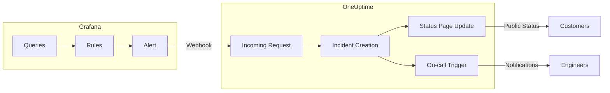

# Integrating Grafana Alerts with OneUptime: Automated Incident Management

Author: [nawazdhandala](https://www.github.com/nawazdhandala)

Tags: Grafana, Alerts, Monitoring, Incoming Request, Heartbeat, Status Page, On-call, Incident Management, DevOps, Webhooks, Automation

Description: A comprehensive guide to integrating Grafana alerts with OneUptime's incoming request monitors. Learn how to automatically create incidents, update status pages, and trigger on-call rotations when Grafana detects issues.

---

Grafana alerts are powerful for detecting metric anomalies, but what happens when alerts fire? OneUptime's incoming request monitors let Grafana automatically create incidents, update status pages, and trigger on-call rotations.

This guide shows you how to bridge Grafana's alerting with OneUptime's incident management for seamless observability workflows.

---

## TL;DR

- Grafana can send alert notifications to OneUptime's incoming request endpoints
- Automatically create incidents when Grafana alerts fire
- Update status pages in real-time based on alert severity
- Trigger on-call rotations for critical alerts
- Use webhook integrations for bi-directional alert management

---

## Why Integrate Grafana with OneUptime?

Grafana excels at visualization and alerting, but incident management requires more:

- **Incident tracking**: Grafana alerts are ephemeral; OneUptime provides persistent incident records
- **Status page updates**: Automatically communicate issues to stakeholders
- **On-call management**: Route alerts to the right people at the right time
- **Escalation policies**: Handle alerts that don't get acknowledged
- **Post-mortem workflows**: Track resolution and learn from incidents

Integration creates a complete observability pipeline from detection to resolution.

---

## How Grafana Alert Integration Works

The integration uses **incoming request monitors** with webhooks:

1. **Grafana fires an alert** based on metric thresholds or queries
2. **Webhook sends alert data** to OneUptime's incoming request endpoint
3. **OneUptime creates/updates incidents** based on alert severity
4. **Status pages update automatically** to reflect current system health
5. **On-call rotations trigger** for critical alerts requiring immediate attention

The following diagram shows the complete alert flow from Grafana to OneUptime. When a metric threshold is breached, the alert triggers a webhook that flows through OneUptime's incident management pipeline, ultimately notifying both customers (via status page) and engineers (via on-call).



---

## Setting Up Grafana Alert Integration

### Step 1: Create an Incoming Request Monitor

1. Navigate to **Monitors** in your OneUptime dashboard
2. Click **Create Monitor**
3. Select **Incoming Request** as the monitor type
4. Configure monitor settings:
   ```
   Monitor Name: Grafana Alert Integration
   Description: Receives alert notifications from Grafana instances
   ```

### Step 2: Get Your Webhook URL

After creating the monitor, OneUptime provides a unique URL:

```
https://oneuptime.com.com/heartbeat/abc123
```

This URL will receive webhook payloads from Grafana.

### Step 3: Configure Grafana Contact Point

In Grafana, create a new contact point:

1. Go to **Alerting > Contact points**
2. Click **Add contact point**
3. Select **Webhook** as the integration type
4. Configure the webhook:
   ```
   Name: OneUptime Integration
   URL: https://oneuptime.com.com/heartbeat/abc123
   HTTP Method: POST
   ```

---

## Grafana Alert Rule Configuration

### Basic Alert Rule Setup

Create alert rules that send meaningful data to OneUptime. This example demonstrates a CPU usage alert with proper labeling and annotations that provide context for incident responders.

```yaml
# Example Grafana alert rule for monitoring CPU usage
# This rule triggers when CPU exceeds 85% for 5 consecutive minutes
alert: High CPU Usage
expr: cpu_usage_percent > 85        # PromQL expression defining the threshold
for: 5m                              # Alert only fires after condition persists for 5 minutes
labels:
  severity: critical                 # Used by OneUptime for incident priority
  service: web-server                # Identifies the affected service
  team: infrastructure               # Routes alert to the responsible team
annotations:
  summary: "High CPU usage detected"                                    # Brief description for notifications
  description: "CPU usage is {{ $value }}% on {{ $labels.instance }}"  # Detailed message with dynamic values
  runbook_url: "https://wiki.company.com/cpu-troubleshooting"          # Link to remediation steps
  dashboard_url: "https://grafana.company.com/d/cpu-dashboard"         # Quick access to relevant dashboard
```

### Advanced Alert Configuration

Include contextual information for better incident management. This advanced example shows how to provide comprehensive context that helps responders understand impact, affected systems, and remediation steps.

```yaml
# Advanced alert rule with rich context for incident management
# Monitors database connection pool utilization to prevent outages
alert: Database Connection Pool Exhausted
expr: db_connections_active / db_connections_max > 0.9  # Triggers at 90% pool utilization
for: 2m                                                  # 2-minute evaluation window
labels:
  severity: warning                   # Warning level - not yet critical but needs attention
  service: database                   # Primary service affected
  component: connection-pool          # Specific component for precise routing
  environment: production             # Environment context for prioritization
annotations:
  summary: "Database connection pool nearly exhausted"
  description: "Active connections: {{ $value }} of max {{ $labels.max_connections }}"
  impact: "May cause application slowdown or outages"                              # Business impact statement
  affected_services: "web-app, api-gateway, background-jobs"                       # Downstream dependencies
  mitigation_steps: "1. Check application connection leaks 2. Consider scaling database"  # Actionable remediation
  owner: "database-team@company.com"                                               # Escalation contact
```

---

## Processing Grafana Webhooks in OneUptime

### Webhook Payload Structure

Understanding the Grafana webhook payload structure is essential for configuring OneUptime to extract the right information. This payload contains all the context needed to create meaningful incidents.

```json
{
  // Top-level metadata about the webhook delivery
  "receiver": "oneuptime-integration",        // Name of the contact point that sent this
  "status": "firing",                          // "firing" = alert active, "resolved" = alert cleared

  "alerts": [                                  // Array of alerts (can contain multiple)
    {
      "status": "firing",                      // Individual alert status
      "labels": {                              // Key-value pairs for routing and identification
        "alertname": "High CPU Usage",         // The alert rule name
        "severity": "critical",                // Priority level for incident creation
        "service": "web-server",               // Affected service name
        "instance": "web-01"                   // Specific instance/host
      },
      "annotations": {                         // Human-readable context
        "summary": "High CPU usage detected",
        "description": "CPU usage is 92.5% on web-01",
        "runbook_url": "https://wiki.company.com/cpu-troubleshooting"
      },
      "startsAt": "2025-09-26T10:30:00Z",     // When the alert started firing
      "endsAt": "0001-01-01T00:00:00Z",       // When alert ended (zero time = still active)
      "generatorURL": "https://grafana.company.com/alerting/grafana/...",  // Link back to Grafana
      "fingerprint": "a1b2c3d4e5f6..."        // Unique identifier for deduplication
    }
  ],

  // Aggregation metadata for grouped alerts
  "groupLabels": {
    "service": "web-server"                    // Labels used for grouping alerts together
  },
  "commonLabels": {                            // Labels shared by all alerts in this group
    "severity": "critical",
    "service": "web-server"
  },
  "commonAnnotations": {                       // Annotations shared by all alerts
    "summary": "High CPU usage detected"
  },

  "externalURL": "https://grafana.company.com/",  // Grafana instance URL
  "version": "1",                                  // Webhook format version
  "groupKey": "{service=\"web-server\"}",         // Unique key for this alert group
  "truncatedAlerts": 0                            // Number of alerts omitted (if payload too large)
}
```

### Incident Creation Logic

Configure OneUptime to create incidents based on webhook data:

**Severity Mapping:**
- `critical` → Create incident, trigger on-call, update status page
- `warning` → Create incident, notify team, minor status page update
- `info` → Log only, no incident creation

**Incident Title Generation:**
```
[{{requestBody.alerts[0].labels.severity}}] {{requestBody.alerts[0].annotations.summary}}
```

**Incident Description Template:**
```markdown
**Alert Details:**
- **Service:** {{requestBody.alerts[0].labels.service}}
- **Instance:** {{requestBody.alerts[0].labels.instance}}
- **Started:** {{requestBody.alerts[0].startsAt | formatDate}}
- **Description:** {{requestBody.alerts[0].annotations.description}}

**Additional Context:**
{{requestBody.alerts[0].annotations.impact}}

**Runbook:** {{requestBody.alerts[0].annotations.runbook_url}}
**Dashboard:** {{requestBody.alerts[0].generatorURL}}

**Affected Services:** {{requestBody.alerts[0].annotations.affected_services}}
**Owner:** {{requestBody.alerts[0].annotations.owner}}
```

---

## Status Page Integration

### Automatic Status Updates

Configure status pages to update based on alert severity:

**Critical Alerts:**
- Set component status to "Major Outage"
- Display incident details on status page
- Send notifications to subscribers

**Warning Alerts:**
- Set component status to "Partial Outage" or "Degraded Performance"
- Show maintenance-like messaging

**Resolved Alerts:**
- Automatically resolve incidents when Grafana sends "resolved" status
- Update status page to "Operational"
- Send "all clear" notifications

### Status Page Configuration

1. Create status page components matching your services
2. Map Grafana alert labels to status page components
3. Configure automated status updates based on alert lifecycle

---

## On-Call Management Integration

### Triggering On-Call Rotations

Set up escalation policies for different alert types:

**Critical Production Alerts:**
```
Immediate: Page primary on-call engineer
5 minutes: Escalate to secondary on-call
15 minutes: Notify entire team
30 minutes: Escalate to management
```

**Non-Critical Alerts:**
```
Immediate: Slack notification to on-call channel
30 minutes: Email notification
4 hours: Escalate if unacknowledged
```

### On-Call Schedule Integration

Connect with popular on-call tools:

- **OneUptime**: You can use OneUptime for on-call without using any other tools, but you can integrate with other tools as well.
- **PagerDuty**: Forward alerts to PD services
- **Opsgenie**: Create incidents in Opsgenie
- **VictorOps**: Route alerts through VictorOps
- **Native OneUptime**: Use built-in on-call scheduling

---

### Enterprise Integration Patterns

**Centralized Alert Management:**
- Route alerts from multiple Grafana instances
- Aggregate alerts across teams/services
- Implement cross-team incident coordination

**Compliance and Auditing:**
- Log all alert deliveries
- Track incident response times
- Generate compliance reports
- Maintain audit trails

---

## Conclusion

Grafana alert integration with OneUptime creates a seamless observability workflow from detection to resolution. By connecting Grafana's powerful alerting with OneUptime's incident management, you:

- **Automate incident creation** from metric anomalies
- **Keep stakeholders informed** with automatic status page updates
- **Ensure rapid response** through on-call integrations
- **Maintain compliance** with comprehensive incident tracking
- **Improve MTTR** with structured incident workflows

Start with your most critical alerts, establish reliable webhook delivery, and gradually expand integration across your Grafana infrastructure.

Your incident response will be faster, your communication more effective, and your system reliability more predictable.

---

Ready to integrate Grafana alerts with OneUptime? The combination creates a powerful observability platform that bridges monitoring and incident management.

Start integrating your Grafana alerts today and transform your incident response capabilities.

---

*For more information on incoming request monitors, see our guides on [Monitoring IoT Devices](https://oneuptime.com/blog/post/2025-09-24-monitoring-iot-devices-with-oneuptime/view) and [Monitoring Backup Jobs](https://oneuptime.com/blog/post/2025-09-25-monitoring-backup-jobs-with-oneuptime/view) with OneUptime.*