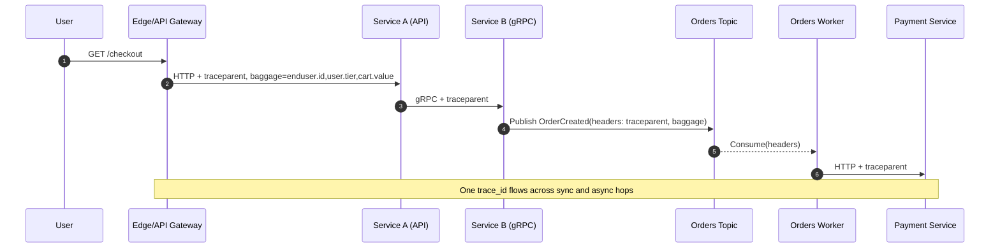

# Mastering OpenTelemetry Tracing: End-to-End User Journey Tracing in Distributed Systems

Author: [nawazdhandala](https://www.github.com/nawazdhandala)

Tags: OpenTelemetry, APM, Tracing, Trace Context, Baggage, Sampling, OpenTelemetry Collector, Distributed Systems

Description: A practical, end-to-end guide to propagating OpenTelemetry context (traceparent + baggage) across microservices- HTTP, gRPC, queues, and background jobs- so you can reconstruct real user journeys. We’ll use the OTel API/SDK, W3C Trace Context, semantic conventions, and head/tail sampling via the OpenTelemetry Collector.

Modern systems are made of many moving parts: APIs, services, queues, workers, caches, databases, and third-party calls. When a customer says “checkout is slow,” you don’t want to chase logs across five repos -  you want a single trace that shows the user’s journey hop-by-hop. OpenTelemetry tracing gives you that.

This post focuses on the most critical part teams get wrong: how OpenTelemetry context (trace + baggage) propagates across service boundaries- sync, async, and everything between- so your traces actually represent real user journeys.

## What OpenTelemetry pieces you’ll use

- API: trace, context, propagation, baggage
- SDK: span processors, samplers, context manager
- Resource: identifies your service (service.name, service.version, etc.)
- Semantic conventions: standard attribute names on spans (HTTP, gRPC, messaging, DB)
- Propagators: W3C Trace Context + Baggage (default in OTel)
- Exporters: OTLP over HTTP/gRPC to an OpenTelemetry Collector
- Collector: tail sampling, batching, attribute processors, fan‑out to backend platforms like OneUptime

## The model in 60 seconds (OTel terms)

- A trace is a tree/DAG of spans sharing the same trace_id.
- Each span has a span_id and an optional parent span_id.
- SpanContext holds trace_id, span_id, trace flags, tracestate.
- W3C Trace Context standardizes how context travels between processes.
- Baggage is key/value metadata for business context that travels with the trace.
- Resource describes the entity producing telemetry (e.g., service.name=checkout-api).


## OpenTelemetry setup (Node.js / TypeScript)

Minimal SDK setup using OTLP exporter, W3C propagators, and head sampling. This configuration should be placed in a separate file (e.g., `tracing.ts`) and imported at the very start of your application, before any other imports.

```ts
// Import OpenTelemetry SDK and core components
import { NodeSDK } from '@opentelemetry/sdk-node'
import { Resource } from '@opentelemetry/resources'
import { SemanticResourceAttributes } from '@opentelemetry/semantic-conventions'
import { OTLPTraceExporter } from '@opentelemetry/exporter-trace-otlp-http'
import { AsyncLocalStorageContextManager } from '@opentelemetry/context-async-hooks'
import { CompositePropagator, W3CTraceContextPropagator, W3CBaggagePropagator } from '@opentelemetry/core'
import { ParentBasedSampler, TraceIdRatioBasedSampler } from '@opentelemetry/sdk-trace-base'
import { getNodeAutoInstrumentations } from '@opentelemetry/auto-instrumentations-node'

// Initialize the OpenTelemetry SDK with all necessary components
const sdk = new NodeSDK({
  // Resource attributes identify this service in traces
  resource: new Resource({
    [SemanticResourceAttributes.SERVICE_NAME]: 'checkout-api',  // Unique service identifier
    [SemanticResourceAttributes.DEPLOYMENT_ENVIRONMENT]: process.env.NODE_ENV || 'development',  // Environment tag
  }),

  // Configure where traces are sent (OTLP over HTTP)
  traceExporter: new OTLPTraceExporter({
    // url: process.env.OTEL_EXPORTER_OTLP_TRACES_ENDPOINT, // e.g. http://otel-collector:4318/v1/traces
    headers: {},  // Add authentication headers if your collector requires them
  }),

  // AsyncLocalStorage ensures trace context is preserved across async operations
  contextManager: new AsyncLocalStorageContextManager(),

  // Configure W3C standard propagators for distributed tracing
  textMapPropagator: new CompositePropagator({
    propagators: [
      new W3CTraceContextPropagator(),  // Propagates traceparent header
      new W3CBaggagePropagator()        // Propagates baggage for business context
    ],
  }),

  // Head sampling: decide at trace start whether to sample (10% by default)
  // ParentBasedSampler respects parent's sampling decision for child spans
  sampler: new ParentBasedSampler({
    root: new TraceIdRatioBasedSampler(Number(process.env.OTEL_TRACES_SAMPLER_ARG ?? 0.1)),
  }),

  // Auto-instrumentation automatically traces common libraries
  instrumentations: getNodeAutoInstrumentations({
    '@opentelemetry/instrumentation-http': { propagateTraceHeaderCorsUrls: /.*/ },  // Trace all HTTP calls
    '@opentelemetry/instrumentation-express': {},    // Trace Express routes
    '@opentelemetry/instrumentation-grpc': {},       // Trace gRPC calls
    '@opentelemetry/instrumentation-kafkajs': {},    // Trace Kafka messaging (if used)
  }),
})

// Start SDK early in process startup (before importing app code)
// This ensures all subsequent imports are automatically instrumented
sdk.start()
```

## Minimal code examples with OTel API

These show explicit propagation/attributes. Most of this is automatic once the SDK and instrumentations are enabled.

### HTTP server (Express)

- Use semantic attributes and baggage for end-user/business context.
- The HTTP instrumentation creates the server span; you add attributes.

This example shows how to enrich automatically-created spans with business context. The HTTP instrumentation handles span creation; you focus on adding meaningful attributes that help with debugging and analysis.

```ts
import express from 'express'
import { context, propagation, trace, SpanKind } from '@opentelemetry/api'

const app = express()

app.get('/checkout', async (req, res) => {
  // Get the span automatically created by HTTP instrumentation
  const span = trace.getActiveSpan()

  // Add user identification using semantic conventions
  // 'enduser.id' is a standard attribute for user correlation
  const userId = req.header('x-user-id') || 'anonymous'
  span?.setAttribute('enduser.id', userId)

  // Add business-specific attributes for analysis
  span?.setAttribute('cart.value', Number(req.header('x-cart-value') || 0))

  // Extract baggage sent from upstream services (e.g., frontend)
  // Baggage travels with the trace across service boundaries
  const bag = propagation.getBaggage(context.active())
  const tier = bag?.getEntry('user.tier')?.value

  // Promote baggage values to span attributes for querying/sampling
  if (tier) span?.setAttribute('user.tier', tier)

  res.json({ ok: true })
})

app.listen(3000)
```

### Kafka publish/consume (manual inject/extract + semantic attributes)

- Messaging spans should set messaging semantic attributes.
- Use PRODUCER/CONSUMER span kinds.

This example demonstrates the critical pattern for maintaining trace continuity across message queues. The publisher injects trace context into message headers, and the consumer extracts it to continue the same trace. This is essential for understanding end-to-end flows in event-driven architectures.

```ts
import { context, propagation, trace, SpanKind } from '@opentelemetry/api'

// Publisher: Injects trace context into Kafka message headers
async function publishOrder(kafkaProducer: any, order: any) {
  // Get a tracer instance - name should identify the component
  const tracer = trace.getTracer('orders-publisher')

  // Create a PRODUCER span - indicates this span produces messages
  await tracer.startActiveSpan('orders publish', { kind: SpanKind.PRODUCER }, async (span) => {
    try {
      // Add semantic attributes per OpenTelemetry messaging conventions
      span.setAttribute('messaging.system', 'kafka')           // Message broker type
      span.setAttribute('messaging.destination.name', 'orders') // Topic name
      span.setAttribute('messaging.destination.kind', 'topic')  // Destination type

      // CRITICAL: Inject trace context into message headers
      // This allows consumers to continue the same trace
      const headers: Record<string, string> = {}
      propagation.inject(context.active(), headers)

      // Send message with trace context embedded in headers
      await kafkaProducer.send({
        topic: 'orders',
        messages: [{ value: JSON.stringify(order), headers }],
      })
    } finally {
      // Always end the span, even if an error occurred
      span.end()
    }
  })
}

// Consumer: Extracts trace context from message headers
function onMessage(msg: { value: Buffer; headers?: Record<string, string> }) {
  // CRITICAL: Extract trace context from message headers
  // This links the consumer span to the producer's trace
  const parentCtx = propagation.extract(context.active(), msg.headers || {})
  const tracer = trace.getTracer('orders-consumer')

  // Execute within the extracted context to maintain trace continuity
  return context.with(parentCtx, async () => {
    // Create a CONSUMER span with messaging attributes
    await tracer.startActiveSpan(
      'orders process',
      { kind: SpanKind.CONSUMER, attributes: {
        'messaging.system': 'kafka',
        'messaging.destination.name': 'orders',
        'messaging.operation': 'process',           // Operation type: receive, process, etc.
      }},
      async (span) => {
        try {
          const order = JSON.parse(msg.value.toString())

          // Add business context for correlation and debugging
          if (order?.userId) span.setAttribute('enduser.id', String(order.userId))
          if (order?.id) span.setAttribute('order.id', String(order.id))
          // ... process order
        } finally {
          span.end()
        }
      }
    )
  })
}
```

### gRPC metadata (OTel propagators)

- OTel gRPC instrumentation does inject/extract automatically if enabled.
- If you need manual control, use propagation APIs with metadata.

For gRPC services, the OpenTelemetry instrumentation handles context propagation automatically. However, if you need manual control (e.g., for custom interceptors), use the same propagation pattern as HTTP/Kafka.

```ts
// Client side: Inject trace context into gRPC metadata before making call
// propagation.inject(context.active(), grpcMetadata)

// Server side: Extract trace context from incoming gRPC metadata
// const ctx = propagation.extract(context.active(), grpcMetadata)

// Then create spans within the extracted context
// trace.getTracer(...).startActiveSpan(...) within ctx
```

## Sampling user journeys with OpenTelemetry

You rarely need 100% of traces.

- Head sampling (SDK): Keep 5-10% globally with ParentBased + TraceIdRatioBased so inbound sampled decisions are respected.

Head sampling makes the decision at trace creation time, which is efficient but cannot consider trace outcome (errors, latency). Use this for baseline sampling.

```ts
// Configure head sampling in your SDK setup
// ParentBasedSampler respects upstream sampling decisions
sampler: new ParentBasedSampler({
  root: new TraceIdRatioBasedSampler(0.1),  // Sample 10% of new traces
}),
```

- Tail sampling (Collector): Decide after seeing the whole trace (errors, slow requests, VIPs).

Tail sampling waits for a trace to complete before deciding whether to keep it. This allows intelligent decisions based on trace outcome - keeping all errors and slow requests while sampling routine traffic.

```yaml
# OpenTelemetry Collector configuration for tail sampling
# This configuration ensures you capture important traces while managing volume

receivers:
  otlp:
    protocols:
      http:     # Receive traces over HTTP (port 4318)
      grpc:     # Receive traces over gRPC (port 4317)

processors:
  batch:        # Batch spans for efficient export
  tail_sampling:
    decision_wait: 10s    # Wait 10s for trace to complete before deciding
    num_traces: 50000     # Max traces to hold in memory during decision_wait
    policies:
      # Policy 1: Keep ALL traces that contain errors
      - name: errors
        type: status_code
        status_code:
          status_codes: [ERROR]

      # Policy 2: Keep ALL traces slower than 500ms
      - name: slow-requests
        type: latency
        latency:
          threshold_ms: 500

      # Policy 3: Keep ALL traces from premium/VIP users
      # Requires user.tier attribute on spans
      - name: premium-users
        type: string_attribute
        string_attribute:
          key: user.tier
          values: ['premium', 'vip']

exporters:
  otlphttp:
    endpoint: http://your-backend:4318    # Your tracing backend (e.g., OneUptime)

service:
  pipelines:
    traces:
      receivers: [otlp]
      processors: [tail_sampling, batch]   # Order matters: sample first, then batch
      exporters: [otlphttp]
```

Tip: If you set user.tier in baggage, also copy it onto entry spans as a span attribute so the tail sampler can match it.

This utility function promotes baggage values to span attributes. Call it at the entry point of each service to ensure tail sampling policies can match on business context.

```ts
import { context, propagation, trace } from '@opentelemetry/api'

// Promotes selected baggage values to span attributes
// Call this at service entry points (e.g., in middleware)
export function promoteBaggageToSpanAttributes() {
  const span = trace.getActiveSpan()
  const bag = propagation.getBaggage(context.active())

  // Exit early if no span or baggage exists
  if (!span || !bag) return

  // Iterate through all baggage entries
  for (const [k, entry] of bag.getAllEntries()) {
    // IMPORTANT: Whitelist specific keys to avoid exposing PII
    // Only promote keys that are safe and useful for sampling/querying
    if (['user.tier', 'enduser.id', 'session.id'].includes(k)) {
      span.setAttribute(k, entry.value)
    }
  }
}
```

## Correlate traces with logs and metrics

- Logs: include trace_id and span_id (from the active SpanContext) in every log line, or use OTel Logs to emit structured logs with context attached.

This logging utility automatically injects trace context into every log entry. This enables you to jump from a log line directly to the corresponding trace in your observability platform.

```ts
import { trace } from '@opentelemetry/api'

// Utility function to log with automatic trace correlation
// Use this instead of console.log for structured, correlated logging
function logWithTrace(message: string, fields: Record<string, unknown> = {}) {
  // Get the currently active span (if any)
  const span = trace.getActiveSpan()
  const ctx = span?.spanContext()

  // Output structured JSON with trace IDs embedded
  // Most log aggregators can parse this and create clickable links to traces
  console.log(JSON.stringify({
    msg: message,
    trace_id: ctx?.traceId,     // Links this log to its trace
    span_id: ctx?.spanId,       // Links to the specific span
    ...fields,                   // Include any additional context
  }))
}
```

- Metrics: use exemplars to link high-latency buckets to example traces (supported by OTel metrics + backends that display exemplars).
- Attributes: prefer semantic conventions (enduser.id, http.route, net.peer.name). Use baggage to propagate business identifiers; promote to span attributes where needed.

Related reading:
- Connecting metrics to traces with exemplars: https://oneuptime.com/blog/post/2025-09-22-connecting-metrics-to-traces-with-exemplars/view
- Traces and spans fundamentals: https://oneuptime.com/blog/post/2025-08-27-traces-and-spans-in-opentelemetry/view
- Traces vs metrics: https://oneuptime.com/blog/post/2025-08-21-traces-vs-metrics-in-opentelemetry/view

## Visualizing trace propagation

This sequence diagram shows how a single trace_id flows through an entire user journey, from the initial request through synchronous service calls, asynchronous message queues, and background workers. This unified trace enables end-to-end debugging of distributed transactions.



## A quick OpenTelemetry checklist

- Initialize the OTel SDK early; set Resource.service.name.
- Instrument async producers/consumers; use span links for fan‑out/retries.
- Prefer semantic conventions (HTTP, gRPC, messaging, DB). Use enduser.id for user correlation.
- Configure head sampling in SDK; use the Collector for tail sampling of errors/slow/VIP journeys.
- Correlate logs/metrics by including trace_id/span_id and exemplars.

End-to-end tracing isn’t magic -  it’s disciplined OpenTelemetry context propagation. Get that right, wire in the Collector, and turn vague “it’s slow” reports into precise, debuggable user journeys.
