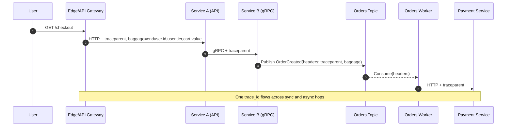

# Mastering OpenTelemetry Tracing: End-to-End User Journey Tracing in Distributed Systems

Author: [nawazdhandala](https://www.github.com/nawazdhandala)

Tags: OpenTelemetry, APM, Tracing, Trace Context, Baggage, Sampling, OpenTelemetry Collector, Distributed Systems

Description: A practical, end-to-end guide to propagating OpenTelemetry context (traceparent + baggage) across microservices- HTTP, gRPC, queues, and background jobs- so you can reconstruct real user journeys. We’ll use the OTel API/SDK, W3C Trace Context, semantic conventions, and head/tail sampling via the OpenTelemetry Collector.

Modern systems are made of many moving parts: APIs, services, queues, workers, caches, databases, and third-party calls. When a customer says “checkout is slow,” you don’t want to chase logs across five repos -  you want a single trace that shows the user’s journey hop-by-hop. OpenTelemetry tracing gives you that.

This post focuses on the most critical part teams get wrong: how OpenTelemetry context (trace + baggage) propagates across service boundaries- sync, async, and everything between- so your traces actually represent real user journeys.

## What OpenTelemetry pieces you’ll use

- API: trace, context, propagation, baggage
- SDK: span processors, samplers, context manager
- Resource: identifies your service (service.name, service.version, etc.)
- Semantic conventions: standard attribute names on spans (HTTP, gRPC, messaging, DB)
- Propagators: W3C Trace Context + Baggage (default in OTel)
- Exporters: OTLP over HTTP/gRPC to an OpenTelemetry Collector
- Collector: tail sampling, batching, attribute processors, fan‑out to backend platforms like OneUptime

## The model in 60 seconds (OTel terms)

- A trace is a tree/DAG of spans sharing the same trace_id.
- Each span has a span_id and an optional parent span_id.
- SpanContext holds trace_id, span_id, trace flags, tracestate.
- W3C Trace Context standardizes how context travels between processes.
- Baggage is key/value metadata for business context that travels with the trace.
- Resource describes the entity producing telemetry (e.g., service.name=checkout-api).


## OpenTelemetry setup (Node.js / TypeScript)

Minimal SDK setup using OTLP exporter, W3C propagators, and head sampling.

```ts
import { NodeSDK } from '@opentelemetry/sdk-node'
import { Resource } from '@opentelemetry/resources'
import { SemanticResourceAttributes } from '@opentelemetry/semantic-conventions'
import { OTLPTraceExporter } from '@opentelemetry/exporter-trace-otlp-http'
import { AsyncLocalStorageContextManager } from '@opentelemetry/context-async-hooks'
import { CompositePropagator, W3CTraceContextPropagator, W3CBaggagePropagator } from '@opentelemetry/core'
import { ParentBasedSampler, TraceIdRatioBasedSampler } from '@opentelemetry/sdk-trace-base'
import { getNodeAutoInstrumentations } from '@opentelemetry/auto-instrumentations-node'

const sdk = new NodeSDK({
  resource: new Resource({
    [SemanticResourceAttributes.SERVICE_NAME]: 'checkout-api',
    [SemanticResourceAttributes.DEPLOYMENT_ENVIRONMENT]: process.env.NODE_ENV || 'development',
  }),
  traceExporter: new OTLPTraceExporter({
    // url: process.env.OTEL_EXPORTER_OTLP_TRACES_ENDPOINT, // e.g. http://otel-collector:4318/v1/traces
    headers: {}, // set if your collector requires auth
  }),
  contextManager: new AsyncLocalStorageContextManager(),
  textMapPropagator: new CompositePropagator({
    propagators: [new W3CTraceContextPropagator(), new W3CBaggagePropagator()],
  }),
  sampler: new ParentBasedSampler({
    root: new TraceIdRatioBasedSampler(Number(process.env.OTEL_TRACES_SAMPLER_ARG ?? 0.1)), // 10% head sampling
  }),
  instrumentations: getNodeAutoInstrumentations({
    '@opentelemetry/instrumentation-http': { propagateTraceHeaderCorsUrls: /.*/ },
    '@opentelemetry/instrumentation-express': {},
    '@opentelemetry/instrumentation-grpc': {},
    '@opentelemetry/instrumentation-kafkajs': {}, // if you use kafkajs
  }),
})

// Start SDK early in process startup (before importing app code)
sdk.start()
```

## Minimal code examples with OTel API

These show explicit propagation/attributes. Most of this is automatic once the SDK and instrumentations are enabled.

### HTTP server (Express)

- Use semantic attributes and baggage for end-user/business context.
- The HTTP instrumentation creates the server span; you add attributes.

```ts
import express from 'express'
import { context, propagation, trace, SpanKind } from '@opentelemetry/api'

const app = express()

app.get('/checkout', async (req, res) => {
  const span = trace.getActiveSpan()
  // Prefer semantic conventions when available
  const userId = req.header('x-user-id') || 'anonymous'
  span?.setAttribute('enduser.id', userId)
  span?.setAttribute('cart.value', Number(req.header('x-cart-value') || 0))

  // If the frontend sent baggage, pull it into span attributes
  const bag = propagation.getBaggage(context.active())
  const tier = bag?.getEntry('user.tier')?.value
  if (tier) span?.setAttribute('user.tier', tier)

  res.json({ ok: true })
})

app.listen(3000)
```

### Kafka publish/consume (manual inject/extract + semantic attributes)

- Messaging spans should set messaging semantic attributes.
- Use PRODUCER/CONSUMER span kinds.

```ts
import { context, propagation, trace, SpanKind } from '@opentelemetry/api'

// Publisher
async function publishOrder(kafkaProducer: any, order: any) {
  const tracer = trace.getTracer('orders-publisher')
  await tracer.startActiveSpan('orders publish', { kind: SpanKind.PRODUCER }, async (span) => {
    try {
      span.setAttribute('messaging.system', 'kafka')
      span.setAttribute('messaging.destination.name', 'orders')
      span.setAttribute('messaging.destination.kind', 'topic')

      // Carry context across the message
      const headers: Record<string, string> = {}
      propagation.inject(context.active(), headers)

      await kafkaProducer.send({
        topic: 'orders',
        messages: [{ value: JSON.stringify(order), headers }],
      })
    } finally {
      span.end()
    }
  })
}

// Consumer
function onMessage(msg: { value: Buffer; headers?: Record<string, string> }) {
  const parentCtx = propagation.extract(context.active(), msg.headers || {})
  const tracer = trace.getTracer('orders-consumer')

  return context.with(parentCtx, async () => {
    await tracer.startActiveSpan(
      'orders process',
      { kind: SpanKind.CONSUMER, attributes: {
        'messaging.system': 'kafka',
        'messaging.destination.name': 'orders',
        'messaging.operation': 'process',
      }},
      async (span) => {
        try {
          const order = JSON.parse(msg.value.toString())
          // Business attributes for correlation
          if (order?.userId) span.setAttribute('enduser.id', String(order.userId))
          if (order?.id) span.setAttribute('order.id', String(order.id))
          // ... process
        } finally {
          span.end()
        }
      }
    )
  })
}
```

### gRPC metadata (OTel propagators)

- OTel gRPC instrumentation does inject/extract automatically if enabled.
- If you need manual control, use propagation APIs with metadata.

```ts
// Client side: propagation.inject(context.active(), grpcMetadata)
// Server side: const ctx = propagation.extract(context.active(), grpcMetadata)
// Then create spans with trace.getTracer(...).startActiveSpan(...) within ctx
```

## Sampling user journeys with OpenTelemetry

You rarely need 100% of traces.

- Head sampling (SDK): Keep 5–10% globally with ParentBased + TraceIdRatioBased so inbound sampled decisions are respected.

```ts
// ...existing OTel NodeSDK setup
sampler: new ParentBasedSampler({
  root: new TraceIdRatioBasedSampler(0.1),
}),
// ...existing setup
```

- Tail sampling (Collector): Decide after seeing the whole trace (errors, slow requests, VIPs).

```yaml
receivers:
  otlp:
    protocols:
      http:
      grpc:

processors:
  batch:
  tail_sampling:
    decision_wait: 10s
    num_traces: 50000
    policies:
      - name: errors
        type: status_code
        status_code:
          status_codes: [ERROR]
      - name: slow-requests
        type: latency
        latency:
          threshold_ms: 500
      - name: premium-users
        type: string_attribute
        string_attribute:
          key: user.tier
          values: ['premium', 'vip']

exporters:
  otlphttp:
    endpoint: http://your-backend:4318

service:
  pipelines:
    traces:
      receivers: [otlp]
      processors: [tail_sampling, batch]
      exporters: [otlphttp]
```

Tip: If you set user.tier in baggage, also copy it onto entry spans as a span attribute so the tail sampler can match it.

```ts
import { context, propagation, trace } from '@opentelemetry/api'

export function promoteBaggageToSpanAttributes() {
  const span = trace.getActiveSpan()
  const bag = propagation.getBaggage(context.active())
  if (!span || !bag) return
  for (const [k, entry] of bag.getAllEntries()) {
    // Whitelist to avoid PII
    if (['user.tier', 'enduser.id', 'session.id'].includes(k)) {
      span.setAttribute(k, entry.value)
    }
  }
}
```

## Correlate traces with logs and metrics

- Logs: include trace_id and span_id (from the active SpanContext) in every log line, or use OTel Logs to emit structured logs with context attached.

```ts
import { trace } from '@opentelemetry/api'

function logWithTrace(message: string, fields: Record<string, unknown> = {}) {
  const span = trace.getActiveSpan()
  const ctx = span?.spanContext()
  console.log(JSON.stringify({
    msg: message,
    trace_id: ctx?.traceId,
    span_id: ctx?.spanId,
    ...fields,
  }))
}
```

- Metrics: use exemplars to link high-latency buckets to example traces (supported by OTel metrics + backends that display exemplars).
- Attributes: prefer semantic conventions (enduser.id, http.route, net.peer.name). Use baggage to propagate business identifiers; promote to span attributes where needed.

Related reading:
- Connecting metrics to traces with exemplars: https://oneuptime.com/blog/post/2025-09-22-connecting-metrics-to-traces-with-exemplars/view
- Traces and spans fundamentals: https://oneuptime.com/blog/post/2025-08-27-traces-and-spans-in-opentelemetry/view
- Traces vs metrics: https://oneuptime.com/blog/post/2025-08-21-traces-vs-metrics-in-opentelemetry/view

## Visualizing trace propagation 



## A quick OpenTelemetry checklist

- Initialize the OTel SDK early; set Resource.service.name.
- Instrument async producers/consumers; use span links for fan‑out/retries.
- Prefer semantic conventions (HTTP, gRPC, messaging, DB). Use enduser.id for user correlation.
- Configure head sampling in SDK; use the Collector for tail sampling of errors/slow/VIP journeys.
- Correlate logs/metrics by including trace_id/span_id and exemplars.

End-to-end tracing isn’t magic -  it’s disciplined OpenTelemetry context propagation. Get that right, wire in the Collector, and turn vague “it’s slow” reports into precise, debuggable user journeys.
