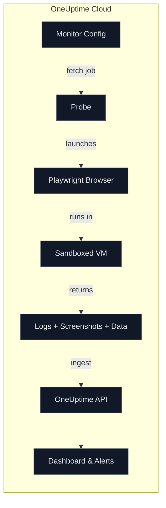

# Synthetic Monitoring in OneUptime: Simulating Real User Journeys with Playwright

Author: [nawazdhandala](https://www.github.com/nawazdhandala)

Tags: Synthetic Monitoring, Monitoring, Reliability, Performance, Customer Experience, Playwright, Uptime Monitoring, DevOps

Description: How OneUptime implements synthetic monitoring using real browsers, sandboxed user scripts, multi-device/multi-browser matrices, and rich artifacts (logs, screenshots) to proactively validate user journeys before your customers do.

---

When customers say “the checkout button doesn’t work on mobile,” you need proof, not guesses. Synthetic monitoring makes this proactive: it runs scripted user flows on a schedule (and from your probes/regions), capturing screenshots, logs, and timings across different browsers and screen sizes.

This post explains how synthetic monitoring works in OneUptime -  under the hood and in practice -  so you can simulate real user experiences with confidence.

## What “synthetic” means here

OneUptime executes your Playwright script in a real browser (Chromium or Firefox), with a chosen viewport (Mobile, Tablet, Desktop). The script navigates your app, clicks buttons, validates UI, and can take screenshots. These runs are executed in a sandboxed environment with strict timeouts, and the results are sent back to OneUptime for visualization and alerting.

## What is Playwright?

[Playwright](https://playwright.dev/) is a modern end-to-end testing and automation framework that supports multiple browsers (Chromium, Firefox, WebKit) and platforms. It provides a high-level API to control browsers, interact with web pages, and capture screenshots, making it ideal for simulating real user journeys.

## Writing your synthetic script

Your script runs with a context that includes Playwright’s `browser` and `page`, plus metadata like `browserType` and `screenSizeType`.

Return shape expected by OneUptime:
- `data`: Any JSON-serializable object you want to return
- `screenshots`: A map of name -> Buffer (OneUptime converts these to base64 automatically)
- Console output is captured as `logMessages`


## Easier way to write a playwright script by using browser extensions

1. Install the [Playwright Recorder extension](https://chromewebstore.google.com/detail/playwright-chrome-recorde/bfnbgoehgplaehdceponclakmhlgjlpd) for Chrome or Firefox.
2. Navigate to your web application and start recording your user journey.
3. Stop the recording and copy the generated Playwright script.
4. Paste the script into your OneUptime synthetic monitor script editor.

### Minimal example

The following script demonstrates the core pattern for synthetic monitoring: navigate to a page, validate critical content exists, capture visual evidence, and return structured results. This pattern ensures you catch both functional issues (missing content) and visual regressions.

```js
// This code is executed in a sandbox. You can use Playwright APIs via the provided page/browser.
// You may return { data, screenshots } where screenshots are Buffers.

// Step 1: Navigate to the target URL and wait for the DOM to be ready
// Using 'domcontentloaded' is faster than 'load' since we don't need all resources
await page.goto('https://example.com', { waitUntil: 'domcontentloaded' });

// Step 2: Validate that the expected title text exists on the page
// This assertion catches content delivery issues or broken deployments
const title = await page.textContent('h1');
if (!title || !title.toLowerCase().includes('example')) {
  // Throwing an error marks the synthetic check as failed in OneUptime
  throw new Error('Expected title to contain "example"');
}

// Step 3: Take a full-page screenshot for visual verification
// Screenshots are stored in OneUptime and help debug issues when they occur
screenshots.home = await page.screenshot({ fullPage: true });

// Step 4: Return structured data that OneUptime will store and display
// Include any metrics or values you want to track over time
return {
  data: { ok: true, title },  // Custom data accessible in OneUptime dashboard
  screenshots,                 // Named screenshots for artifact storage
};
```

### Multi-step flow with assertions

This example simulates a complete user login journey - one of the most critical flows to monitor. It tests authentication, page navigation, and verifies that key dashboard elements render correctly. Use this pattern to catch login regressions, SSO issues, or broken post-login redirects before users encounter them.

```ts
// Log the current test environment for debugging purposes
// browserType and screenSizeType are provided by OneUptime's execution context
console.log(`Running on ${browserType} at ${screenSizeType} size`);

// Step 1: Navigate to the login page
await page.goto('https://your-app.example/login', { waitUntil: 'domcontentloaded' });

// Step 2: Fill in login credentials
// Use a dedicated test account - never use real user credentials in synthetic tests
await page.fill('input[name=email]', 'synthetic+bot@example.com');
await page.fill('input[name=password]', 'not-a-real-password');

// Step 3: Submit the login form
await page.click('button[type=submit]');

// Step 4: Wait for the dashboard to load after successful login
// The 15-second timeout accommodates slow authentication backends
await page.waitForSelector('[data-test="dashboard"]', { timeout: 15000 });

// Step 5: Verify that a critical business widget is present and has content
// This catches issues where the page loads but data fails to populate
const widgetText = await page.textContent('[data-test="kpi-revenue"]');
if (!widgetText) {
  // Fail the check if the revenue KPI widget is missing or empty
  throw new Error('Revenue KPI widget missing');
}

// Step 6: Return results with a screenshot of the authenticated dashboard
return {
  data: { ok: true, widgetText },  // Include widget text for trend analysis
  screenshots: {
    dashboard: await page.screenshot({ fullPage: true })  // Capture full dashboard state
  },
};
```

## Browser and device matrix

OneUptime will execute your script across all combinations you select in the monitor step:

- Browsers: Chromium, Firefox
- Screen sizes: Desktop (1920×1080), Tablet (1024×768), Mobile (360×640)

Results (including screenshots) are returned per combination, so you can spot device-specific regressions quickly.

## Timeouts and reliability

- If a script times out or throws, the error is captured as `scriptError` with logs included.
- Browsers are always closed after execution to avoid resource leaks.

## Network and proxy support

If your probes run behind corporate egress or you require specific routing, OneUptime auto-applies HTTPS/HTTP proxy settings (including basic auth parsed from the proxy URL) when launching Playwright.

## Artifact-rich results: logs, data, screenshots

Your script can `console.log()` and return named screenshots. OneUptime captures:

- `logMessages`: everything you log
- `executionTimeInMS`: precise runtime
- `result`: the `data` you return
- `screenshots`: base64-encoded images you return as Buffers

These are shown in the Dashboard under the monitor’s summary view.

## How results flow through the system

This diagram illustrates the complete lifecycle of a synthetic monitoring check, from configuration to visualization. Understanding this flow helps you troubleshoot issues and optimize your monitoring setup.



## When to use synthetic monitoring vs. APM tracing

- Synthetic monitoring: proactively tests critical flows even when traffic is low or absent. Great for catching broken buttons, auth regressions, or CDN misconfigurations.
- APM tracing: shows real user journeys and performance in production under real load.

They’re complementary. For deeper end-to-end tracing of real journeys, see: https://oneuptime.com/blog/post/2025-10-01-mastering-apm-tracing-user-journeys-in-distributed-systems/view

## Quick checklist for effective synthetic monitors

- Cover your golden paths: sign-up, login, checkout, search, upload, etc.
- Run across at least Desktop + Mobile, and Chromium + Firefox.
- Take named screenshots on key steps; assert critical UI exists.
- Use timeouts intentionally and fail fast with helpful messages.
- Keep secrets out of scripts; use non-production accounts and data.
- Add alerts on failures and rising execution times.

Proactive reliability means testing what matters most: the user’s experience. With OneUptime’s synthetic monitoring, you’ll know when critical flows break- before your customers do.
