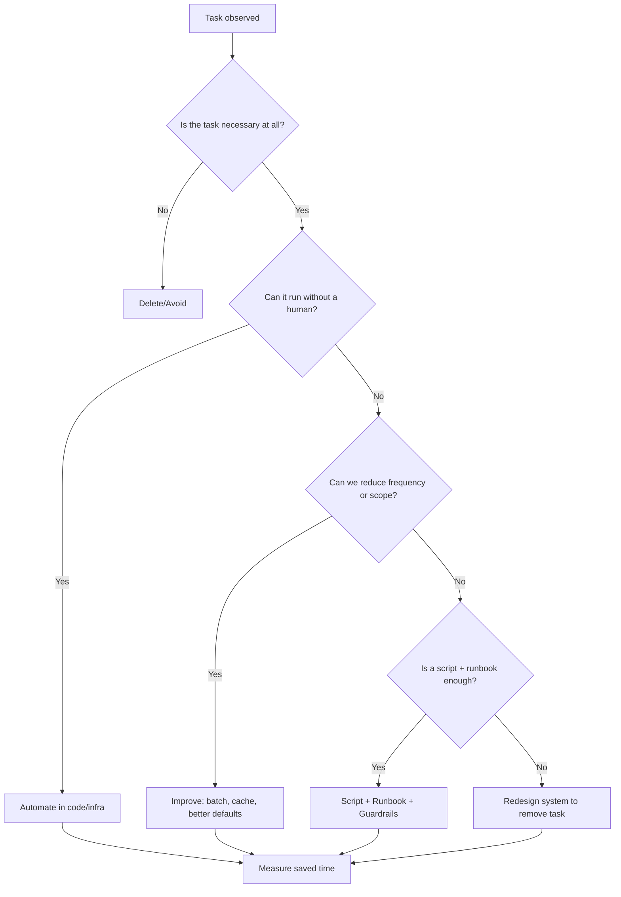
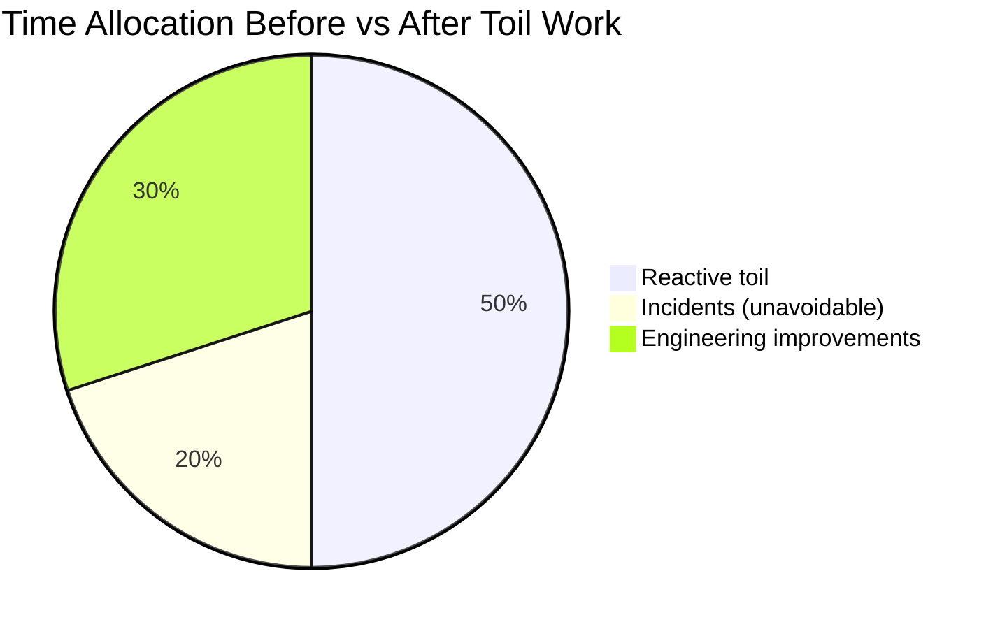

# Eliminating Toil: A Practical SRE Playbook

Author: [nawazdhandala](https://www.github.com/nawazdhandala)

Tags: Site Reliability Engineering, SRE, Toil, Automation, DevOps, Observability, On-call, Runbooks

Description: What toil really is (and isn’t), how to find and measure it, and pragmatic steps to eliminate it with automation, guardrails, and culture.

---

## What is toil?

Toil is the repetitive, manual, and reactive operational work that scales linearly with growth but produces no lasting value. It’s the busywork that keeps teams stuck in firefighting instead of building leverage.

Toil is not: thoughtful debugging, learning a new system, or a one‑off migration. Those may be hard, but they create durable value. Toil is the opposite: work with no compounding returns.

Characteristics of toil:
- Manual and repetitive
- Tied to operational load (more users = more of it)
- Reactive and interrupt-driven
- Low cognitive demand, minimal engineering judgement
- No permanent improvement after it’s done

> If it feels like “this again,” it’s probably toil.

---

## Why eliminating toil matters

- Protects on-call health and reduces burnout
- Frees engineering bandwidth for reliability improvements and features
- Decreases MTTR by turning ad-hoc steps into reliable automation
- Lowers cost by reducing human-in-the-loop operations

The fastest teams aren’t the ones who work the most hours, they’re the ones who delete the work entirely.

---

## A simple definition you can use

“Toil is any operational task that a well-designed system should perform automatically.”

If the system can’t, your short-term job is to script it; your long-term job is to redesign so it’s not needed.

---

## How to find toil (and decide what to tackle first)

1. Run a 5‑day “toil log.” During on‑call and routine ops, write down each repetitive task. Include: trigger, steps, time, frequency, pain.
2. Tag each item with a small score:
   - Frequency: daily (3), weekly (2), monthly (1)
   - Duration: >30m (3), 10–30m (2), <10m (1)
   - Risk: user impact or page? yes (2), no (0)
   Total score = Frequency + Duration + Risk.
3. Sort by score. Start with the top 5.
4. For each, ask: Avoid, Automate, Improve, or Delegate? (in that order).

Here’s a quick decision flow you can share with the team:

---

## Measuring toil (so you know it’s shrinking)

Track just three numbers per team:
- Toil hours per week (rolling 4 weeks)
- Pages per on-call shift (and sleep interrupts)
- Top 5 recurring tasks (with scores and owners)

Visualization for a quarterly review:

Aim to push “reactive toil” under 15–20% of team time within a quarter.

---

## The Toil Elimination Playbook

1) Avoid
- Don’t do unnecessary work. Kill unused dashboards, dead features, zombie monitors.
- Tighten alert rules to only page on user impact (SLO burn, not CPU noise).

2) Automate
- Self-serve scripts and bots for runbook steps (one-click or chatops).
- Auto-create incidents and timelines; attach context (metrics, logs, deploy info).
- Use feature flags and canaries to auto-gate risky deploys.

3) Improve the system
- Idempotent jobs, retries with backoff + jitter, circuit breakers, and timeouts.
- Better defaults: safe configs, reasonable quotas, sensible retention.
- Pre-compute or cache to remove entire classes of manual checks.

4) Delegate appropriately
- Push routine actions to platform tooling with guardrails.
- Simple, well-documented runbooks for rare but necessary manual steps.

---

## Practical examples

- Paging noise → SLO burn-rate alerts with dual windows; link to runbooks.
- Manual status updates → Automated incident comms from the incident system.
- Re-running failed jobs → Retry + dead-letter queues + UI to reprocess safely.
- “Can you check X?” tickets → Self-serve dashboards with golden signals by service.
- “Is it us or them?” outages → Implement synthetic monitoring on critical journeys.

---

## Runbooks done right (when manual is unavoidable)

- Keep steps atomic and verifiable; include safety checks.
- Script what you can; the runbook orchestrates, it doesn’t copy/paste commands.
- Add rollbacks for every action.
- After each use, update it—runbooks are living documents.

---

## Culture changes that make toil disappear

- Make toil visible. Celebrate deletions like feature launches.
- Protect focus time; cluster reactive work into office hours when possible.
- Tie roadmap to error budgets and on-call pain; invest ahead of the curve.

For a broader reliability foundation, read: [The Ultimate SRE Reliability Checklist](https://oneuptime.com/blog/post/2025-09-10-sre-checklist/view).

---

## A note on tools

Use one integrated platform for telemetry, incidents, SLOs, and automation. Correlated traces, logs, and metrics remove hunt-the-context toil; opinionated incident flows remove paste-the-timeline toil.

OneUptime brings these together so your team can spend time improving systems—not running them.

---

## Summary

- Toil is repetitive ops work that doesn’t compound.
- Log it for a week, score it, start with the top 5.
- Follow Avoid → Automate → Improve → Delegate.
- Measure toil hours and pages per shift; review monthly.
- Delete the work, don’t just do the work faster.

---
