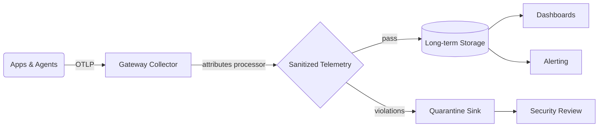

# Keep PII Out of Your Telemetry: Sanitizing Logs, Traces, and Metrics with OpenTelemetry

Author: [nawazdhandala](https://www.github.com/nawazdhandala)

Tags: OpenTelemetry, Security, Data Protection, Logs, Metrics, Traces, PII, Compliance

Description: A practical playbook for preventing sensitive data from leaking into telemetry pipelines. Learn how to classify data, instrument applications safely, sanitize it in the OpenTelemetry Collector, and validate that your observability stack stays compliant.

---

> The fastest way to burn trust with customers and regulators is to let sensitive data slip into your telemetry. OpenTelemetry gives you the tools to observe your systems without turning observability into a compliance liability.

Telemetry hygiene is now table stakes. Regulations (GDPR, HIPAA, PCI-DSS, CCPA) expect you to detect and prevent exposure of personal or regulated data. Your customers expect the same. This guide covers how to use OpenTelemetry (OTel) to keep logs, traces, and metrics useful **without** shipping secrets, personally identifiable information (PII), or regulated payloads to downstream platforms.

---

## Why Telemetry Leaks Sensitive Data

Accidental PII leaks are rarely malicious. They happen because observability is intentionally high-volume and low-friction.

- **Verbose logging frameworks** capture entire request bodies when debugging.
- **Trace attributes** often duplicate HTTP headers or gRPC metadata.
- **Metric labels** (dimensions) sneak in email addresses, account IDs, or payment tokens as convenient identifiers.
- **Third-party libraries** emit telemetry that you do not fully control.

The result? Sensitive data leaves its intended boundary and lands in analytics tools, log archives, slack notifications, or screenshot-laden support tickets.

---

## Build a PII Guardrail Program First

Before touching code, put governance in place so engineering teams know what is allowed.

1. **Classify data**: Group attributes by sensitivity (public, internal, confidential, regulated). Published data dictionaries give instrumenters a reference.
2. **Set allow/deny lists**: Define which fields are always banned (passwords, tokens) and which must be hashed, truncated, or tokenized.
3. **Choose canonical IDs**: Provide privacy-safe identifiers (UUIDs, hashed IDs) for teams to use in telemetry instead of emails or credit card fragments.
4. **Document retention policies**: Pair telemetry TTLs with your privacy program so your storage lifecycle matches regulatory promises.
5. **Automate reviews**: Enforce lint rules, code review checklists, and CI scanners that detect banned attributes before they merge.

Once those expectations are clear, you can encode them in OTel instrumentation and pipelines.

---

## Instrument Applications with PII Prevention in Mind

### 1. Default to explicit attribute allow-lists

When you add log or span attributes, define them centrally and make it hard to sneak in unapproved keys. These helper functions only return pre-approved attributes, forcing developers to consciously update the allow-list to add new fields.

```typescript
// telemetry/attributes.ts - Centralized attribute definitions prevent PII leaks
// Only returns approved fields - no way to accidentally include email/password

const safeUserAttributes = (user: { id: string; country: string; plan: string }) => ({
  'user.id': user.id,       // Hashed or surrogate ID, not the actual user email
  'user.country': user.country, // Country is OK - not personally identifiable
  'user.plan': user.plan,   // Plan type is business data, not PII
  // NOTE: email, name, phone are intentionally excluded
});

const safeOrderAttributes = (order: { id: string; amount: number; currency: string }) => ({
  'order.id': order.id,         // Safe internal identifier
  'order.amount': order.amount, // Amount without payment details
  'order.currency': order.currency,
  // NOTE: billing address, card info are intentionally excluded
});

// Export the allow-list - developers can only use these approved helpers
export const safeAttributes = {
  user: safeUserAttributes,
  order: safeOrderAttributes,
};
```

This checkout service demonstrates safe instrumentation. Instead of attaching the raw payment object (which contains card numbers), it uses the approved attribute helpers and converts sensitive presence checks to booleans.

```typescript
// services/checkout.ts - Safe instrumentation using approved attribute helpers
import { trace, SpanStatusCode } from '@opentelemetry/api';
import { safeAttributes } from '../telemetry/attributes';

const tracer = trace.getTracer('checkout');

export async function submitOrder(payload: CheckoutRequest) {
  return tracer.startActiveSpan('CheckoutHandler', async (span) => {
    try {
      // Use safe attribute helpers - these only include approved fields
      span.setAttributes({
        ...safeAttributes.user(payload.user),   // Only id, country, plan
        ...safeAttributes.order(payload.order), // Only id, amount, currency
      });

      // For sensitive data, only record presence/type, never the value
      span.setAttribute('payment.method', payload.payment.method); // 'credit_card', 'paypal'
      span.setAttribute('payment.has_token', Boolean(payload.payment.token)); // true/false only

      // NEVER DO: span.setAttribute('payment.token', payload.payment.token)
      // NEVER DO: span.setAttribute('payment.card_number', payload.payment.cardNumber)

      const result = await processPayment(payload);
      span.setStatus({ code: SpanStatusCode.OK });
      return result;
    } catch (error) {
      span.recordException(error as Error);
      span.setStatus({ code: SpanStatusCode.ERROR });
      throw error;
    } finally {
      span.end();
    }
  });
}
```

Key ideas:

- Do not expose free-form `span.setAttribute` calls to application code.
- Provide helper functions that only output approved attributes.
- Represent sensitive booleans as flags (`has_token: true`) instead of leaking tokens themselves.

### 2. Strip secrets from logs before they leave the process

Pino's redact option automatically replaces matching fields with `[Redacted]` before they're written. This is your safety net - even if application code accidentally logs a password, it won't reach your log storage.

```typescript
// telemetry/logger.ts - Pino logger with automatic PII redaction
import pino from 'pino';
import redact from 'redact-object';

// Define fields that must NEVER appear in logs
// These patterns are matched against nested paths (e.g., 'credit_card.number')
const redactRules = [
  'password',           // User passwords
  'token',              // Auth tokens, API keys
  'secret',             // Any field named 'secret'
  'authorization',      // HTTP Authorization headers
  'credit_card.number', // Nested payment card number
];

const logger = pino({
  level: process.env.LOG_LEVEL ?? 'info',
  redact: redactRules,  // Pino replaces these with '[Redacted]'
  formatters: {
    level(label) {
      return { level: label };  // Include level as readable string
    },
  },
  mixin() {
    // Add service metadata to every log entry
    return {
      service: 'checkout-service',
      environment: process.env.NODE_ENV,
    };
  },
});

// Helper that applies additional redaction before logging
export function logSecure(level: pino.Level, message: string, payload: unknown = {}) {
  // Double-redact for safety - Pino's built-in + explicit redact-object
  logger[level](redact(payload, redactRules), message);
}
```

Pino’s `redact` option replaces matching fields with `[Redacted]` before they are emitted. Similar hooks exist for Winston, Bunyan, Zap (Go), Serilog (.NET), and Python’s `structlog`.

### 3. Bake redaction into metric views

Metric labels (dimensions) often leak PII because they are "just strings". Views act as an allow-list - only explicitly listed attributes are exported. Any attribute not in the list is silently dropped before leaving your application.

```typescript
// telemetry/metrics.ts - Metric views enforce attribute allow-lists
import { MeterProvider, View, InstrumentType } from '@opentelemetry/sdk-metrics';
import { OTLPMetricExporter } from '@opentelemetry/exporter-metrics-otlp-http';

const exporter = new OTLPMetricExporter({ url: process.env.OTEL_EXPORTER_OTLP_METRICS_URL });

const meterProvider = new MeterProvider({
  views: [
    // Define allowed attributes for HTTP duration histogram
    // Any other attributes (like user.email) are automatically dropped
    new View({
      instrumentName: 'http.server.duration',
      instrumentType: InstrumentType.HISTOGRAM,
      attributeKeys: ['http.method', 'http.route', 'http.status_code', 'deployment.environment'],
      // NOT included: user.id, user.email, request.body, etc.
    }),
    // Define allowed attributes for the orders counter
    new View({
      instrumentName: 'checkout.orders.created',
      instrumentType: InstrumentType.COUNTER,
      attributeKeys: ['deployment.environment', 'tenant.id'],
      // NOT included: customer.email, order.billing_address, etc.
    }),
  ],
});

meterProvider.addMetricReader(exporter);
```

Views drop any attribute keys not explicitly listed, ensuring no engineer can add `user.email` to a counter without changing the view configuration.

---

## Sanitize Data in the OpenTelemetry Collector

Even with disciplined instrumentation, you need a second layer of defense in the collector. This is your centralized enforcement point - if PII slips through application code, the collector can catch it before it reaches storage. The configuration below demonstrates multiple sanitization strategies.

```yaml
# collector-config.yaml - Defense-in-depth PII sanitization pipeline
receivers:
  otlp:
    protocols:
      http:    # Accept OTLP over HTTP
      grpc:    # Accept OTLP over gRPC

processors:
  # STRATEGY 1: Delete sensitive headers from all telemetry
  attributes/sanitize_headers:
    actions:
      - key: http.request.header.authorization  # Remove auth tokens
        action: delete
      - key: http.request.header.cookie         # Remove session cookies
        action: delete
      - key: user.email                         # Hash instead of delete
        action: hash                            # Preserves cardinality without exposing PII
        value_hash_algorithm: sha256

  # STRATEGY 2: Delete payment data from specific services
  attributes/drop_unused:
    include:
      match_type: strict
      services: ["checkout-service", "identity-service"]  # Only apply to these services
    actions:
      - key: payment.card_token
        action: delete
      - key: payment.card_number
        action: delete

  # STRATEGY 3: Log allow-list - only keep approved fields
  redaction/logs:
    allow_all_keys: false                       # Default deny - must be in list
    allowed_keys:
      - timestamp
      - severity
      - body
      - trace_id
      - span_id
      - service.name
      - deployment.environment
      - user.id                                 # Hashed ID only, not email

  # STRATEGY 4: Drop entire spans that match dangerous patterns
  filter/deny_spans:
    traces:
      span:
        - attributes["span.name"] == "PIIDump"  # Catch rogue debugging spans

exporters:
  otlphttp/secure:
    endpoint: ${TELEMETRY_BACKEND}
    headers:
      authorization: ${BACKEND_TOKEN}

# Wire everything together - order matters!
service:
  pipelines:
    traces:
      receivers: [otlp]
      processors: [attributes/sanitize_headers, attributes/drop_unused, filter/deny_spans]
      exporters: [otlphttp/secure]
    logs:
      receivers: [otlp]
      processors: [attributes/sanitize_headers, redaction/logs]
      exporters: [otlphttp/secure]
    metrics:
      receivers: [otlp]
      processors: [attributes/sanitize_headers]
      exporters: [otlphttp/secure]
```

**Processor tactics to know:**

- `attributes` processor can **delete**, **update**, **hash**, or **extract** values based on regex.
- `redaction` processor (contrib) enforces explicit allow-lists for logs.
- `filter` processor drops entire spans/logs/metrics that match conditions.
- `transform` processor allows complex manipulations using OTTL expressions.

Combine them to build a defense-in-depth pipeline that strips risky fields automatically.

---

## Visualize Your Sanitization Pipeline



- **Gateway collector** centralizes policy enforcement.
- **Quarantine sink** (e.g., S3 with restricted access) captures rejected payloads for investigation without exposing them to broad analytics.

---

## Detect Violations Early

Treat PII detection like any other production incident.

- **Continuous scanning**: run regex-based detections (emails, SSNs, credit card BINs) inside the collector using the `transform` processor to route suspicious telemetry to a separate exporter.
- **Unit tests for telemetry**: write tests that initialize instrumentation and assert that disallowed attributes never appear.

These unit tests verify that your attribute helpers never expose PII. Run them in CI to catch violations before code reaches production.

```typescript
// telemetry/__tests__/attributes.test.ts - Verify PII is never exposed
import { safeAttributes } from '../attributes';

describe('safeAttributes.user', () => {
  // This test ensures the helper function doesn't leak email
  it('does not expose email', () => {
    const attrs = safeAttributes.user({ id: 'user-123', country: 'US', plan: 'pro' });
    expect(attrs).not.toHaveProperty('user.email');  // Should never appear
  });

  // Add more tests for other PII fields
  it('does not expose phone number', () => {
    const attrs = safeAttributes.user({ id: 'user-123', country: 'US', plan: 'pro' });
    expect(attrs).not.toHaveProperty('user.phone');
  });

  it('does not expose real name', () => {
    const attrs = safeAttributes.user({ id: 'user-123', country: 'US', plan: 'pro' });
    expect(attrs).not.toHaveProperty('user.name');
  });
});
```

- **Sampling audits**: configure a periodic job that exports a sampled dataset to your security data lake and runs detection rules there.
- **Alerting**: send incidents to security/on-call if collectors drop or redact more than a threshold number of fields per minute. Spikes often indicate a new code path leaking data.

---

## Partner with Compliance and Legal Teams

Telemetry controls only work when they align with policy.

- Map each processing step to regulatory controls (GDPR Art. 32, HIPAA 164.312, PCI-DSS 3.4).
- Document data flow diagrams to show auditors how sensitive fields are stripped before leaving controlled networks.
- Enable subject access requests (SAR) and deletion workflows by keeping telemetry scoped to identifiers you can actually manage.
- Provide runbooks that explain how to pause ingestion or reroute to quarantine if a leak is detected.

---

## Progressive Hardening Roadmap

1. **Inventory**: catalog telemetry producers, data types, and storage locations.
2. **Deploy gateway collector**: route all telemetry through a centralized OTel collector cluster that enforces attribute policies.
3. **Implement SDK allow-lists**: add safe attribute helpers, sanitize loggers, and instrument metric views.
4. **Add automated tests/scanners**: integrate detection into CI and runtime monitoring.
5. **Roll out tenant isolation**: tag telemetry with tenant-aware IDs to support differential privacy.
6. **Introduce privacy budgets**: cap the retention and dimensionality of telemetry per data class.

Each step reduces risk and makes the next compliance audit easier.

---

## Related Reading

- Learn how to design telemetry structures without noise: [How to Structure Logs Properly in OpenTelemetry](https://oneuptime.com/blog/post/2025-08-28-how-to-structure-logs-properly-in-opentelemetry/view)
- Adopt guardrails for what to keep and what to drop: [How to Reduce Noise in OpenTelemetry](https://oneuptime.com/blog/post/2025-08-25-how-to-reduce-noise-in-opentelemetry/view)

---

## Final Checklist Before Shipping Telemetry

- [ ] Sensitive fields classified and documented.
- [ ] SDK helpers expose only approved attributes.
- [ ] Loggers redact secrets at source.
- [ ] Metric views restrict label keys.
- [ ] Collector processors delete, hash, or drop disallowed data.
- [ ] Detection alerts fire when redaction volume spikes.
- [ ] Runbooks exist for security and SRE teams to respond.

When you combine disciplined instrumentation with collector-level enforcement and ongoing validation, you get the observability depth you need without turning telemetry into a privacy nightmare.
