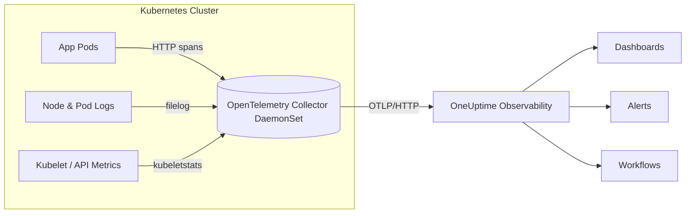

# Monitor Kubernetes Clusters with OpenTelemetry and OneUptime

Author: [nawazdhandala](https://www.github.com/nawazdhandala)

Tags: Kubernetes, OpenTelemetry, Observability, Monitoring, Metrics, Logs, Traces

Description: A practical, multi-signal playbook for wiring Kubernetes metrics, logs, and traces through OpenTelemetry into OneUptime dashboards, alerts, and workflows.

---

Kubernetes gives you infinite knobs to tune but very little context when something stalls. OpenTelemetry solves the signal collection problem; OneUptime solves the visualization, alerting, and response problem. This guide shows how to connect the two so that you can answer three urgent questions in seconds:

1. **Is the cluster healthy?** (metrics)
2. **Where is the request slowing down?** (traces)
3. **What changed right before it broke?** (logs)



## Why OpenTelemetry for Kubernetes Observability?

- **Vendor neutral ingestion**: Instrument once, ship to any backend.
- **Multi-signal correlation**: Span IDs link traces, logs, and exemplars so you can pivot without context switching. If you are new to span hygiene, bookmark [How to name spans in OpenTelemetry](https://oneuptime.com/blog/post/2024-11-04-how-to-name-spans-in-opentelemetry/view).
- **Scales with your cluster**: Sidecar or DaemonSet collectors follow the node schedule and keep the data plane close to the workload.

## Prerequisites

- Kubernetes 1.24+ cluster with `kubectl` access.
- OneUptime project with an OTLP token (`Settings > Telemetry > Tokens`).
- Helm 3.10+ (simplifies managing Collector manifests).
- Optional but recommended: cert-manager or another CA solution for TLS between workloads and the Collector.

## Step 1: Deploy a base OpenTelemetry Collector

The Collector runs as a DaemonSet so every node has a local agent. It scrapes node-level metrics, tails container logs, and forwards OTLP traffic from your services.

This comprehensive Collector configuration handles all three signal types: metrics from kubelet and cluster APIs, logs from container files, and traces from instrumented applications. The DaemonSet mode ensures every node has a local collector, minimizing network hops and providing consistent telemetry coverage across your cluster.

```yaml
# collector-daemonset.yaml
apiVersion: opentelemetry.io/v1alpha1
kind: OpenTelemetryCollector
metadata:
  name: k8s-observability              # Name shown in kubectl and logs
spec:
  mode: daemonset                      # One collector pod per node for local collection
  config: |
    receivers:
      otlp:                            # Receive telemetry from instrumented applications
        protocols:
          grpc:
            endpoint: 0.0.0.0:4317     # Standard OTLP gRPC port for SDKs
          http:
            endpoint: 0.0.0.0:4318     # OTLP HTTP for browsers and HTTP-only clients
      kubeletstats:                    # Scrape CPU, memory, network stats from kubelet
        collection_interval: 30s       # Balance freshness vs API load
        auth_type: serviceAccount      # Use pod's service account for kubelet auth
        endpoint: ${K8S_NODE_NAME}:10250  # Connect to local node's kubelet
        insecure_skip_verify: true     # Skip TLS verify (use certs in production)
      k8scluster:                      # Collect cluster-level metadata and events
        collection_interval: 60s       # Less frequent - cluster state changes slowly
      filelog:                         # Tail container log files from the node
        include: [/var/log/pods/*/*/*.log]  # Standard Kubernetes log path
        start_at: end                  # Only collect new logs, skip historical
        operators:
          - type: add_attributes       # Tag all logs with a type for filtering
            attributes:
              log_type: "container"
          - type: container            # Parse container log format and extract metadata
    processors:
      batch:                           # Batch telemetry for efficient network usage
        send_batch_size: 2000          # Send batches of 2000 items
        timeout: 5s                    # Or every 5 seconds, whichever comes first
      k8sattributes:                   # Enrich telemetry with pod/namespace labels
        passthrough: false             # Actually process attributes, don't just pass through
      resourcedetection:               # Auto-detect host and environment info
        detectors: [env, system]       # Detect from environment vars and system calls
    exporters:
      otlphttp:                        # Send all signals to OneUptime via OTLP HTTP
        endpoint: https://oneuptime.com/otlp/v1
        headers:
          x-oneuptime-token: ${ONEUPTIME_OTLP_TOKEN}  # Auth token from secret
      logging:                         # Also log telemetry locally for debugging
        verbosity: normal              # Set to detailed when troubleshooting
    service:
      pipelines:
        metrics:                       # Metrics pipeline configuration
          receivers: [kubeletstats, k8scluster, otlp]  # All metric sources
          processors: [k8sattributes, batch]           # Enrich then batch
          exporters: [otlphttp]                        # Send to OneUptime
        logs:                          # Logs pipeline configuration
          receivers: [filelog, otlp]   # Container logs and app-emitted logs
          processors: [k8sattributes, batch]
          exporters: [otlphttp]
        traces:                        # Traces pipeline configuration
          receivers: [otlp]            # Only from instrumented apps
          processors: [k8sattributes, batch]
          exporters: [otlphttp]
```

Apply it with the Operator or render it to plain manifests if you prefer raw YAML. Inject the OneUptime token as a secret and mount it as an env var on the Collector pod.

## Step 2: Capture Kubernetes metrics that matter

The default `kubeletstats` receiver already pulls CPU, memory, network, and filesystem stats per pod and node. Add more receivers when you want richer context:

The Prometheus receiver lets you scrape existing metric endpoints like kube-state-metrics. This gives you access to deployment replica counts, pod phase transitions, and resource quota usage - metrics the kubelet does not expose directly.

```yaml
receivers:
  prometheus:                        # Scrape Prometheus-format metric endpoints
    config:
      scrape_configs:
        - job_name: kube-state-metrics   # Descriptive name for this scrape target
          static_configs:
            - targets: ['kube-state-metrics.kube-system.svc:8080']  # kube-state-metrics service endpoint
```

Use the histogram buckets exposed by kube-state-metrics to drive SLOs inside OneUptime. Map key series like `kube_pod_container_status_restarts_total` to alerts that page teams only when restart budgets are exceeded. For guidance on tuning alert cardinality, see [How to reduce noise in OpenTelemetry](https://oneuptime.com/blog/post/2025-08-25-how-to-reduce-noise-in-opentelemetry/view).

## Step 3: Stream container and cluster logs

`filelog` reads per-container log files mounted via the Kubernetes log volume. Pair it with `k8sattributes` so every log line carries namespace, pod, and container labels. Encourage teams to emit structured JSON; OneUptime can parse payloads and let you facet by attributes instantly. If you have sidecars producing TSV or plain text, drop in an additional parser operator before export.

For cluster-wide events, add the `k8sevents` receiver. This surfaces crash loops and admission failures without hitting the API server on every query.

## Step 4: Emit traces from workloads

Instrument applications with language-specific OpenTelemetry SDKs and point them to the Collector's OTLP endpoint (`otel-collector:4317`). A minimal Node.js bootstrap looks like this:

This TypeScript snippet initializes the OpenTelemetry SDK with automatic instrumentation for common Node.js libraries (Express, HTTP, database clients). It sends traces to your local Collector via gRPC, which then forwards them to OneUptime with proper batching and retry logic.

```typescript
// Import the Node.js SDK and auto-instrumentation package
import { NodeSDK } from '@opentelemetry/sdk-node';
import { getNodeAutoInstrumentations } from '@opentelemetry/auto-instrumentations-node';
import { OTLPTraceExporter } from '@opentelemetry/exporter-trace-otlp-grpc';

// Initialize the SDK with trace export and auto-instrumentation
const sdk = new NodeSDK({
  // Configure where to send traces - point to your Collector's gRPC endpoint
  traceExporter: new OTLPTraceExporter({
    url: 'grpc://otel-collector.default:4317',  // Collector service in default namespace
  }),
  // Auto-instrument HTTP, Express, database clients, and more
  instrumentations: [getNodeAutoInstrumentations()],
});

// Start the SDK - this must happen before your app imports instrumented libraries
sdk.start();
```

Propagate `traceparent` headers between services so cross-cluster calls stay stitched. When you emit logs, inject the current span ID to correlate events back inside OneUptime’s trace explorer. If you need a refresher, read [Traces and spans in OpenTelemetry](https://oneuptime.com/blog/post/2025-08-27-traces-and-spans-in-opentelemetry/view).

## Step 5: Export every signal into OneUptime

The OTLP HTTP exporter sends all pipelines to `https://oneuptime.com/otlp/v1`. Create separate exporters if you want to split development and production projects, but keep the Collector config identical so workloads do not know about environment-specific tokens.

Inside OneUptime:

- Build dashboards with node level CPU saturation, pod restart counts, and request latency histograms.
- Tie SLO monitors to metrics such as `http.server.duration` or `kube_deployment_status_replicas_available`.
- Drive workflows when certain log patterns appear (for example, auto-create an incident when `CrashLoopBackOff` errors spike).

## Step 6: Operationalize the pipeline

- **Dashboards**: Clone the Kubernetes starter dashboard, then overlay your service histograms so infra and app teams share the same view.
- **Alerts**: Create multi-signal alerts that require both high CPU and elevated request latency before paging.
- **Runbooks**: Embed links to Grafana, kubeconfig, or Terraform modules directly inside OneUptime incidents.
- **Cost control**: Batch processor and exemplar sampling keep egress costs predictable without losing fidelity.

## Step 7: Manage cluster capacity (nodes, pods, and memory)

Collecting signals is only useful when you translate them into capacity plans. Pair OpenTelemetry data with Kubernetes resource controls so nodes do not starve and pods do not thrash.

### Right-size pods with requests and limits

- Track `container_cpu_usage_seconds_total` and `container_memory_working_set_bytes` against `kube_pod_container_resource_requests_*` to see how close workloads run to their guarantees.
- Surface over-commit ratios (`sum(container_memory_working_set_bytes) / sum(kube_node_status_allocatable_memory_bytes)`) in OneUptime dashboards; alert if they exceed thresholds that historically caused eviction storms.
- Audit namespaces that still run without requests or limits using `kube_pod_container_resource_limits_*` metrics and turn findings into backlog items.

### Keep nodes healthy and balanced

- Watch `kube_node_status_condition{condition="Ready"}` to ensure the control plane still schedules new work; page on sustained `status="false"` values.
- Plot allocatable vs. requested capacity per node pool to reveal hotspots that might trigger the Kubernetes scheduler's `NoExecute` taints or PodDisruptionBudget violations.
- Regularly run `kubectl top nodes` or consume `kube_node_status_capacity_*` metrics to confirm new workloads fit without pushing nodes into swap or OOM territory.

These commands help you quickly assess cluster capacity and identify resource hogs. Use them during incidents to understand whether you are hitting resource limits, and regularly during capacity planning reviews.

```bash
# Quick view of cluster pressure alongside resource requests
# Shows allocatable vs requested resources for a specific node
kubectl describe node <NODE_NAME> | grep -E "Allocated resources|cpu|memory"

# Compare live usage and limits per namespace
# Sorted by memory to quickly find the biggest consumers
kubectl top pods -A --sort-by=memory
```

### Automate scaling decisions

- Feed `http.server.duration`, queue depth, or custom SLO burn metrics into a Horizontal Pod Autoscaler (HPA) and observe scaling events through the `kube_hpa_status_current_replicas` series.
- For memory-bound services, add a Vertical Pod Autoscaler recommendation pipeline but enforce guardrails before it writes updates; record decisions in OneUptime runbooks so on-call engineers know which workloads self-tune.
- Use cluster-autoscaler metrics (`cluster_autoscaler_node_group_min_size`, `cluster_autoscaler_unschedulable_pods_count`) to alert when there is insufficient capacity or a cloud API quota is blocking node creation.

### Guard against noisy neighbors and evictions

- Enable `kubeletstats` eviction metrics (`kubelet_evictions_*`) and send high-severity alerts if eviction counts spike, signaling that nodes are out of memory or disk.
- Correlate pod restarts with node pressure conditions in OneUptime workflows to trigger automated cordon-and-drain steps when a node becomes unhealthy.
- Track daemonset resource usage separately so platform agents do not collide with application pods during peak load.

Document these practices in your capacity playbooks and revisit dashboards quarterly. The goal is to make resource pressure obvious long before customers notice latency, mirroring the approach we covered in [Basics of profiling](https://oneuptime.com/blog/post/2025-09-09-basics-of-profiling/view) for CPU-bound debugging.

## Troubleshooting tips

- Collector pods `CrashLoopBackOff`: check missing token secret or mis-typed exporter endpoint.
- No metrics landing: verify kubelet port `10250` is reachable; on hardened clusters you may need a client cert instead of `insecure_skip_verify`.
- High CPU on nodes: drop `collection_interval` to 60s or use `delta_tempo` processor to pre-aggregate histograms before export.
- Logs missing namespace metadata: ensure the Collector ServiceAccount has `get` permissions on pods.

## Next steps

- Add the OpenTelemetry Operator’s instrumentation CRDs for auto-injecting SDK sidecars.
- Layer in exemplar sampling so SLO burn calculations deep link to the exact trace in a failing percentile.
- Publish service-specific dashboards to your status page so stakeholders see the same health picture.

When your Kubernetes telemetry flows through OpenTelemetry into OneUptime, you get a single source of truth for the cluster, the workloads, and the business impact. That feedback loop is how teams move from reactive firefighting to proactive reliability engineering.
