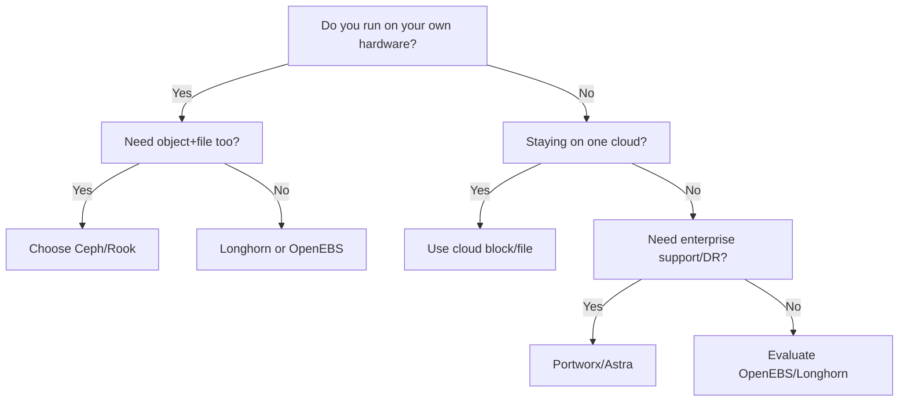

# Kubernetes Storage Layers: Ceph vs. Longhorn vs. Everything Else

Author: [nawazdhandala](https://www.github.com/nawazdhandala)

Tags: Kubernetes, Storage, Ceph, Bare Metal, Cloud, DevOps

Description: A decision guide to the most common Kubernetes storage layers-Ceph/Rook, Longhorn, OpenEBS, Portworx, and cloud block/file services-covering architecture, failure modes, performance profiles, and how to match them to your workloads.

---

Pods are disposable until they write data. Then every restart becomes a negotiation between performance, failover, and how much control you want over the disks underneath. Kubernetes does not ship an opinionated storage stack; it relies on the **Container Storage Interface (CSI)** to plug into whatever layer you pick. The question is which layer fits your reality: bare metal, hybrid, or cloud.

## Quick Comparison

| Layer | Best Fit | Strengths | Watch-outs |
| --- | --- | --- | --- |
| **Ceph via Rook** | Bare metal / hybrid clouds that need block + file + object in one cluster | Mature replication, erasure coding, crush maps for rack awareness, huge community | Operationally heavy, steep learning curve, needs SSD journals for decent latency |
| **Longhorn** | Mid-sized clusters (edge or bare metal) that want simple block volumes with UI-driven ops | Built-in snapshots/backups, automatic replica rebuilds, easier day-2 than Ceph | Only block storage, replication happens at the volume layer (extra network traffic) |
| **OpenEBS (Mayastor/cStor/Jiva)** | Per-workload flexibility; dev teams want choices between local PVs and replicated pools | Mix-and-match engines, integrates with Kubernetes-native tools, good for StatefulSets | Each engine has unique ops patterns; performance varies widely |
| **Portworx / Pure Fusion** | Enterprises needing SLAs, multi-cloud DR, and rich data services (encryption, tiering) | 24/7 vendor support, application-aware snapshots, migration tooling | License costs, kernel compatibility requirements |
| **Cloud Block/File (EBS, GCE PD, Azure Disk/Files)** | Teams fully on a hyperscaler, need reliable volumes without touching disks | Managed HA, per-volume IOPS guarantees, no on-call for storage failures | Tied to one cloud; cross-zone replication costs spike; on-prem portability drops |

## When Ceph/Rook Wins

Ceph pairs a battle-tested distributed storage system with Kubernetes-native management via the [Rook operator](https://rook.io). Pick it when:

- **You own hardware:** Combine NVMe + large HDD pools and run both compute + storage on the same racks.
- **You need multiple protocols:** Block (RBD) for databases, filesystem (CephFS) for shared workloads, and S3-compatible object (RGW) without deploying three products.
- **You care about rack-level failure domains:** CRUSH maps let you define rules like "never place replicas on the same chassis"-critical for compliance and uptime.

Key design tips:

- Dedicate SSDs/NVMe devices for RocksDB/WAL so writes do not suffer HDD latency.
- Use at least three monitor pods; colocate them on control-plane nodes with anti-affinity.
- Budget a week for failure drills (OSD down, disk replacement, node loss) before production.

Choose Ceph if you are already comfortable running distributed systems like etcd and Kafka on bare metal. Otherwise, the on-call cost will surprise you.

## When Longhorn is the Sweet Spot

[Longhorn](https://longhorn.io) was built by Rancher to give mid-sized teams **replicated block storage** without running a separate storage cluster. It runs lightweight engine/replica pods on each node and streams block data across the network.

Why teams love it:

- **Simple day-2:** Web UI for snapshots, recurring backups to S3/NFS, and one-click replica rebuilds.
- **Incremental adoption:** Start with three workers, add more nodes later, no rebalancing rituals.
- **Edge-friendly:** Works on ARM, handles single-node clusters via RWX support, perfect for retail/branch deployments.

Limitations:

- Only block storage. If you need shared filesystems, you still need NFS or another layer.
- Replication happens at the volume level, so high-write databases can saturate network links faster than Ceph’s erasure coding.

Pick Longhorn when you want the **"it just runs"** storage experience for apps that expect ReadWriteOnce volumes, and you do not want to become a full-time storage admin.

## OpenEBS for per-Workload Freedom

[OpenEBS](https://openebs.io) is a CNCF project that offers three engines:

- **Jiva:** Simple replication, great for dev clusters.
- **cStor:** Production-grade mirrored pools with snapshots and clones.
- **Mayastor:** High-performance NVMe-over-TCP engine (now the default for new installs).

It shines when different teams need different storage guarantees inside the same cluster. You can give one namespace raw local PVs (fast but not replicated) and another namespace cStor pools for HA databases.

Watch-outs:

- You become the integrator; upgrading engines and keeping CRDs in sync is your job.
- Observability is on you-export metrics to Prometheus/OneUptime or you will debug blind.

Pick OpenEBS if you want **flexibility above all else** and are comfortable standardizing on one engine per workload.

## Portworx and Other Commercial Layers

Vendors such as Portworx (Pure Storage), NetApp Astra, and Robin offer fully managed data platforms on top of Kubernetes. You get:

- Application-aware snapshots/cloning that understand PVC + ConfigMap + Secret bundles.
- Multi-cloud disaster recovery with scheduled replication.
- Support teams who will hop on Zoom when etcd is bored and your storage loop is on fire.

They cost real money, but if your org values **"one throat to choke"** and compliance-ready features, they can be cheaper than staffing senior storage engineers.

## Cloud-Managed Block/File Storage

If you live inside AWS/GCP/Azure, start with their managed volumes:

- **AWS EBS / EFS / FSx**
- **Google Persistent Disk / Filestore**
- **Azure Managed Disk / Azure Files**

Why?

- Volume performance is predictable (Provisioned IOPS, throughput tiers).
- Snapshots and encryption are built-in.
- CSI drivers are maintained by the cloud vendor.

Downside: portability. You cannot take an EBS snapshot to your on-prem cluster without a replication pipeline. If multi-cloud or bare-metal portability matters, layer a vendor-neutral storage system on top or plan for data migration tooling early.

## Decision Checklist

## How to Test Before Committing

1. **Benchmark with your real workload.** FIO is fine, but run the actual database with production configs. Measure p99 latency during failover tests.
2. **Kill nodes on purpose.** Forcefully power down a worker and ensure PVCs reattach inside your SLO. Watch network saturation while rebuilds run.
3. **Back up and restore.** Snapshots that are never restored are fantasies. Automate restores into a staging namespace weekly.
4. **Inventory dependencies.** Some layers need kernel modules (e.g., RBD), others need iSCSI packages. Bake them into your node AMIs/images.
5. **Observe everything.** Emit metrics and events into OneUptime so your on-call rotation knows whether the outage is app-level or storage-level.

## TL;DR Recommendations

- **Bare metal + multi-protocol needs:** Ceph with Rook. Budget the time to learn CRUSH maps and automate OSD lifecycle.
- **Mid-sized clusters that want painless ops:** Longhorn. Easy UI, built-in backups, great for edge and general SaaS workloads.
- **Mixed workloads demanding choice:** OpenEBS with Mayastor for performance and cStor/Jiva where simplicity matters.
- **Enterprise compliance, DR, support:** Portworx or similar commercial platforms with SLAs.
- **All-in on a single cloud provider:** Use the managed block/file CSI drivers and invest instead in replication + backup strategies.

Choose the layer whose **failure drills you can rehearse** and whose cost model matches your runway. Storage is just another SLO: know exactly how it fails, how long repairs take, and who gets paged when bits go sideways.
