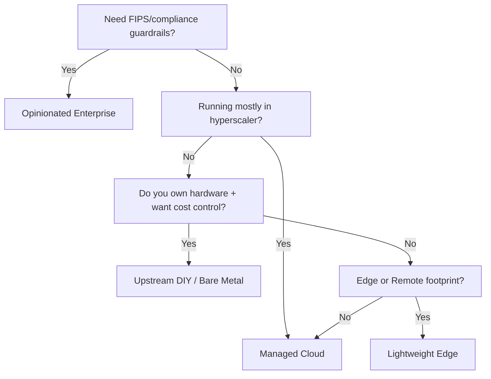

# Choosing the Right Kubernetes Distribution: When Each Flavor Wins

Author: [nawazdhandala](https://www.github.com/nawazdhandala)

Tags: Kubernetes, Cloud, Bare Metal, DevOps, Self-Hosting, Infrastructure

Description: A pragmatic guide to Kubernetes flavors—upstream DIY, managed clouds, opinionated platforms, and lightweight edge distros—with crisp heuristics on when each option is the fastest, cheapest, or safest bet.

---

The Kubernetes logo hides more forks than a data center cafeteria. Between upstream `kubeadm`, EKS/GKE/AKS, OpenShift, Rancher, Talos, K3s, MicroK8s, and every vendor acronym, teams burn quarters debating which distro to back. The trick is to map business constraints (compliance, team size, latency, cost) to the *operational promises* each flavor actually makes—and the work it offloads to you.

If you need a control-plane refresher before comparing distros, start with [Learn Kubernetes Step by Step](https://oneuptime.com/blog/post/2025-11-27-learn-kubernetes-step-by-step/view). Once the pieces click, this guide helps you pick the stack that matches your runway.

## The Four Major Flavors

| Flavor | Typical Examples | Platform Promise | Use When | You Still Own |
| --- | --- | --- | --- | --- |
| Upstream DIY | kubeadm, Talos, Kubespray | Total control, zero licensing | You need custom networking/storage and deep cost control | Everything: upgrades, etcd, CNI, backup |
| Managed Cloud | GKE, EKS, AKS, DO Kubernetes | Control plane as a service, cloud-native IAM/integration | You live on hyperscalers and prefer SLAs over tinkering | Worker AMIs/images, add-ons, autoscaling levers |
| Opinionated Enterprise | OpenShift, VMware Tanzu, Rancher RKE2, Platform9 | Batteries-included GitOps, upgrade pipelines, policy | You want paved roads + support contracts | Hardware/cloud bills, app-level guardrails |
| Lightweight Edge | K3s, MicroK8s, k0s, EKS Anywhere | Runs on single board computers or retail stores | You need footprint <1 GB RAM or disconnected ops | OS patching, air-gap registries, sync jobs |

Keep this table handy. Most debates boil down to: **Who patches the control plane? Who supplies networking/storage defaults? Who signs the SLA when etcd hiccups?**

## 1. Upstream DIY (kubeadm, Talos, Kubespray)

This bucket is literally Kubernetes-the-project with automation glue. You choose the OS (Ubuntu, Flatcar, Talos), bootstrap nodes, and keep etcd happy.

Why teams pick it:

- **Hardware freedom:** Run the control plane on bare metal and pair it with Ceph or MinIO; see [Kubernetes + Ceph: Your Freedom from the Cloud Cartel](https://oneuptime.com/blog/post/2025-11-03-kubernetes-and-ceph-break-the-cloud-cartel/view) for a pattern we use.
- **Network choices:** Calico, Cilium, or custom eBPF meshes without waiting for vendor certification.
- **Cost control:** No per-core tax, no managed control-plane hourly fees.

Watch-outs:

- You maintain every certificate and etcd snapshot.
- Upgrades are multi-step (drain nodes, rotate kubelets, update CRDs). Automate this early with pipelines or you will fear patches.
- Expect to invest in bare-metal provisioning (PXE, MAAS, Tinkerbell) if you scale beyond a rack.

Choose this path when you have SREs comfortable with etcd, Linux networking, and storage. Otherwise, you are volunteering for 2 a.m. outages.

## 2. Managed Cloud Services (GKE, EKS, AKS, DigitalOcean Kubernetes)

Most companies deploy here first because the hyperscaler runs the control plane and hands you an API endpoint with an SLA.

What you get automatically:

- Control-plane patching and auto-healing.
- IAM hooks (AWS IAM, Google IAM) so RBAC maps to your existing identities.
- Cloud-native load balancers, node pools, managed node upgrades, and autoscalers.

Key differences:

- **GKE:** Fastest access to upstream features, multi-cluster services, built-in cost controls.
- **EKS:** Deep AWS integration, but you still manage worker AMIs—make sure Bottlerocket or EKS-optimized images fit your security model.
- **AKS:** Simplified node auto-upgrades, Windows node support is strongest here.

Choose managed services if:

- Your workloads already rely on cloud PaaS (RDS, Cloud Pub/Sub, S3). Network egress stays cheap.
- Compliance is handled by your cloud vendor’s attestations.
- You prefer to spend headcount on apps, not on cluster plumbing.

Still your job:

- Scaling nodes (via cluster autoscaler or Karpenter) and managing spot/on-demand mix.
- Add-ons: Ingress controllers, service mesh, sidecars, and storage classes beyond the default.
- Observability. Stream cluster events to OpenTelemetry + OneUptime as described in [Monitor Kubernetes Clusters with OpenTelemetry and OneUptime](https://oneuptime.com/blog/post/2025-11-14-monitor-kubernetes-clusters-with-opentelemetry-and-oneuptime/view).

## 3. Opinionated Enterprise Platforms (OpenShift, VMware Tanzu, Rancher RKE2)

These distros wrap Kubernetes in policy, pipelines, and multi-cluster dashboards. They shine when you must enforce compliance or run dozens of clusters with a small platform team.

What you gain:

- **Turnkey GitOps and registries:** OpenShift’s ImageStreams, Tanzu’s Application Platform, Rancher Fleet.
- **Security guardrails:** Built-in admission policies, operator catalogs, FIPS-certified builds.
- **One upgrade button:** Rolling clusters without writing bespoke Ansible/Kubespray.

Evaluate them when:

- You need audit-ready guardrails and can justify subscription costs.
- Your developer experience team wants to ship golden-path templates faster than they can maintain internal tooling.
- You support multiple infrastructure flavors (bare metal + multiple clouds) and need a single pane of glass.

Trade-offs:

- Licensing per core/node can rival managed cloud costs if you overprovision.
- You trade flexibility for paved roads; swapping the CNI or CSI driver may be limited to certified options.

## 4. Lightweight & Edge Distributions (K3s, MicroK8s, k0s, EKS Anywhere)

When you deploy clusters to factories, ships, or retail closets, you need Kubernetes without the heavyweight dependencies.

Highlights:

- **K3s:** Single binary, SQLite or etcd backend, perfect for IoT and CI runners.
- **MicroK8s:** Snap-installed, great for laptop labs or small GPU rigs.
- **k0s / Talos Edge:** Immutable OS + Kubernetes combo, ideal for locked-down appliances.
- **EKS Anywhere / AKS Edge:** Managed cloud UX even when disconnected.

Pick these if:

- Network connectivity is unreliable and you sync workloads periodically.
- Hardware is limited (Raspberry Pi, Intel NUC) but you still want declarative deploys.
- You need thousands of clusters, each tiny, and prefer fleet managers to full SRE squads.

Design considerations:

- Centralize observability and policy via pull-based GitOps since pushing from HQ may fail.
- Automate snapshotting and syncing containers through registries you control (Harbor, Dragonfly, JFrog Artifactory).

## 5. Decision Tree: Start from Constraints

Use this flowchart as a pre-read before platform councils. It keeps discussions anchored on constraints, not vendor FUD.

## 6. How to Pilot Before You Commit

1. **Run the same workload on two flavors.** Example: deploy your main revenue API plus supporting jobs on both GKE and kubeadm-on-bare-metal. Compare autoscaler behavior, upgrade flow, and on-call noise.
2. **Quantify control-plane MTTR.** Ask the vendor: *Who fixes etcd when it corrupts? What is the SLA?* DIY clusters must document their recovery runbooks (snapshot freq, quorum restore steps).
3. **Check ecosystem compatibility.** If you lean on eBPF observability, verify whether the distro pins kernel versions that support it.
4. **Budget with real numbers.** Managed control planes cost per hour; enterprise distros charge per core. Bare metal requires amortizing capex plus facilities. Put all three on one spreadsheet.
5. **Plan storage from day zero.** Even if you start managed, ensure workloads abstract away from vendor CSI specifics. When you eventually run on your own hardware, you will be happy you picked a portable storage layer.

## 7. TL;DR Recommendations

- **Small team, all-in on AWS/GCP/Azure:** Start with managed services, enable cluster autoscaler or Karpenter, and reinvest the freed time into observability.
- **Regulated org or multi-cloud SRE team:** OpenShift / Rancher give you policy + fleet management with support contracts when auditors knock.
- **Cost-driven infra, hardware already paid for:** Upstream kubeadm or Talos with Ceph keeps opex low and sovereignty high—see [Kubernetes Is Your Private Cloud](https://oneuptime.com/blog/post/2025-11-12-kubernetes-is-your-private-cloud/view).
- **Retail/edge/IoT fleet:** K3s or MicroK8s with GitOps pull agents prevents manual drift and tolerates offline periods.

The right Kubernetes flavor is the one whose failure modes you understand and whose upgrade rhythm matches your team’s capacity. Anchor the conversation on ownership lines—who patches what, who responds to incidents, who pays the bill—and the right distro almost picks itself.
