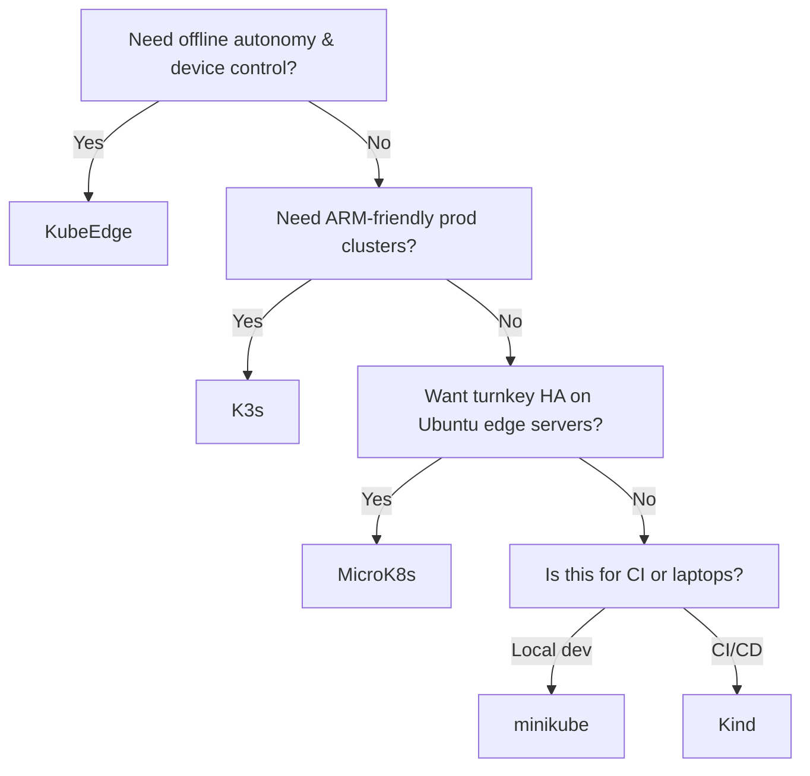

# Choosing the Right Kubernetes Edge Flavor: Minikube vs. Kind vs. MicroK8s vs. K3s vs. KubeEdge

Author: [nawazdhandala](https://www.github.com/nawazdhandala)

Tags: Kubernetes, Edge, DevOps, Cloud, Bare Metal, Automation

Description: A practical buyer's guide to Kubernetes edge distributions—minikube, Kind, MicroK8s, K3s, and KubeEdge—covering their architectures, hardware footprints, online/offline behavior, and the decision criteria that actually matter when you deploy beyond the data center.

---

The moment your workloads leave a hyperscaler region and land in factories, retail stores, or developer laptops, the "default" Kubernetes experience stops being friendly. Control planes must boot fast, tolerate flaky networks, and run happily on 4 GB of RAM. That's why so many edge-focused flavors exist. This guide compares the five I recommend most and gives you a test plan before you standardize.

Need a refresher on the core platform pieces first? Skim [Learn Kubernetes Step by Step](https://oneuptime.com/blog/post/2025-11-27-learn-kubernetes-step-by-step/view), then come back to pick the right edge distro.

## TL;DR Table

| Flavor | Ideal Use Case | Architecture Highlights | Footprint | Limitations |
| --- | --- | --- | --- | --- |
| **minikube** | Local developer laptops, quick PoCs | Single-node VM/driver; add-ons for Ingress, registry, GPU | 2+ vCPUs / 4 GB RAM | Not meant for production; single control plane; limited HA |
| **Kind** | CI pipelines, GitHub Actions, ephemeral test envs | Runs nodes as Docker containers; multi-cluster on one host | ~1 GB RAM per cluster | Needs Docker; no load balancer, storage via hostPath |
| **MicroK8s** | Edge appliances, GPU labs, small on-prem clusters | Single snap install, optional HA, built-in add-ons (MetalLB, Istio) | 4 GB RAM (single) / 3 nodes for HA | Upgrades require snap discipline; not as lightweight as K3s |
| **K3s** | Retail/industrial sites, ARM boards, remote offices | Single binary, SQLite or embedded etcd, helm-controller, Traefik | 512 MB–1 GB RAM for single-node | Advanced networking/storage needs extra work |
| **KubeEdge** | IoT fleets needing offline autonomy | Extends K8s control plane to edge nodes via MQTT/WebSocket | Edge nodes run edgesite; control plane stays central | More moving parts (cloudcore/edgecore); steeper learning curve |

## 1. minikube: Friendly On-Ramp

minikube is the right answer when the goal is a **developer sandbox** that mimics production APIs without caring about bare-metal-level performance.

- **Drivers:** Runs on HyperKit, Docker, QEMU, or bare metal. `minikube addons enable ingress` gives you NGINX, registry, metrics-server, etc.
- **Profiles:** Keep multiple clusters on one laptop (`minikube profile list`). Great for testing version upgrades locally.
- **Local mirror:** `minikube image load` avoids pulling images from the internet repeatedly—perfect for airplane Wi-Fi coding sessions.

Not for:

- Multi-node HA; though you can spin up multiple "nodes," they still live inside one VM.
- Long-term production workloads; there's no builtin storage story beyond hostPath unless you add NFS/CSI yourself.

Use minikube for **education, workshops, and local feature development** before handing manifests to CI.

## 2. Kind: CI/CD Workhorse

[Kind](https://kind.sigs.k8s.io) (Kubernetes IN Docker) packages control-plane and worker nodes as Docker containers, making it ideal for pipeline automation.

- **Deterministic images:** Pin cluster versions with `kindest/node:v1.30.0`. CI runs stay reproducible.
- **Networking:** Each node container gets its own network namespace. You can even run multiple clusters side-by-side for multi-cluster tests.
- **Speed:** Cold-start in <30 seconds on decent hardware, so GitHub Actions and GitLab runners can spin clusters per test suite.

Caveats:

- Requires Docker/Containerd on the host runner.
- LoadBalancers are simulated with `kind load docker-image` + ingress controllers; not representative of cloud LBs.
- Storage defaults to hostPath; testing CSI drivers requires extra wiring.

Use Kind when you want **cheap, fast, disposable clusters in automation**. Pair it with [Kubernetes Superpowers](https://oneuptime.com/blog/post/2025-11-27-ten-kubernetes-superpowers-developers-overlook/view) tips like `kubectl diff --server-side` to keep GitOps pipelines honest.

## 3. MicroK8s: Batteries-Included Edge Appliance

Canonical's [MicroK8s](https://microk8s.io) balances convenience and production readiness:

- **Single snap install:** `sudo snap install microk8s --classic`. Add workers with `microk8s add-node` and enable HA by forming a three-node cluster.
- **Add-ons:** Built-in toggles for DNS, MetalLB, Ingress, GPU, Kata Containers. Perfect when you want a curated stack without Helm charts.
- **RBAC and strict confinement:** Integrates cleanly with Ubuntu Core; great for locked-down appliances.

Trade-offs:

- Upgrades are tied to snap channels; you need good release hygiene.
- Slightly heavier than K3s because it ships upstream components virtually untouched.

Choose MicroK8s when you need **turnkey edge clusters with optional HA** and you like Canonical's support story (Pro/Advantage contracts).

## 4. K3s: Tiny but Mighty

[K3s](https://k3s.io) is the go-to for constrained hardware and ARM boards.

- **Single binary:** Includes kubelet, apiserver, controller-manager, scheduler, flannel (default CNI), and a minimal containerd.
- **Storage flexibility:** Uses SQLite for single-node control planes and embedded etcd (or external DB) for HA. Works with Longhorn, NFS, or local-path provisioner.
- **Built-in extras:** Helm CRD, Traefik ingress, servicelb—all optional but handy.

Why teams deploy it:

- Handles hundreds of clusters managed by Rancher Fleet or ArgoCD.
- Works offline; sync manifests from Git when connectivity returns.
- ARM + x86 parity, so the same build runs on Raspberry Pi gateways and Intel edge servers.

Be aware:

- Advanced CNIs (Cilium, Calico) require custom installs to replace flannel.
- Because it's so easy, some teams forget to set up observability. Ship metrics to OneUptime early so you can spot failing nodes.

## 5. KubeEdge: When Devices Need Autonomy

If you must manage thousands of IoT devices that act even when the WAN is down, [KubeEdge](https://kubeedge.io) extends Kubernetes to the edge via a cloud-edge control plane split.

- **CloudCore:** Runs in the data center or cloud, integrating with your existing Kubernetes API server.
- **EdgeCore:** Runs on edge nodes, holding cached state and talking to devices via MQTT/Modbus/etc.
- **Offline-first:** Edge nodes continue running workloads and device twins even when disconnected; once the link returns, they reconcile with CloudCore.

Choose KubeEdge when:

- Devices need real-time responses and can't wait for the cloud.
- You want to program hardware through Kubernetes CRDs (DeviceModel/Device instances).
- Regulations keep you from hauling telemetry to the cloud instantly.

It does introduce new components and certificates, so invest in automation early.

## Decision Tree

## How to Evaluate Before Standardizing

1. **Run your real workload.** Deploy the same StatefulSet or DaemonSet on each flavor; measure cold-start, CPU steal, and storage latency.
2. **Simulate failure.** Pull network cables, kill nodes, or suspend laptops. Record how each distro recovers.
3. **Patch cadence.** Some flavors (MicroK8s snaps, K3s releases) ship weekly. Make sure your ops team can keep up.
4. **Observability plan.** Install the OpenTelemetry Collector or vendor agents on day one so your edge SLOs roll into OneUptime dashboards.
5. **Fleet management.** Decide whether you'll push updates (Ansible, Fleet, SSH) or let agents pull from Git (ArgoCD, Flux) when connectivity returns.

## Recommendations

- **Hackathons & demos:** minikube. Fast installs, easy resets, lots of built-in add-ons.
- **CI pipelines & PR validation:** Kind. Deterministic and container-native.
- **Small edge data centers:** MicroK8s with HA enabled. Balanced feature set and vendor backing.
- **Large fleets, mixed hardware:** K3s, optionally managed via Rancher Fleet. Lowest footprint, most flexible.
- **IoT / offline ops:** KubeEdge when you need device twins, protocol adapters, and offline autonomy.

Whichever flavor you pick, script the install, bake guardrails (PodDisruptionBudgets, resource requests), and monitor it like production—the moment customers depend on it, it is production.
