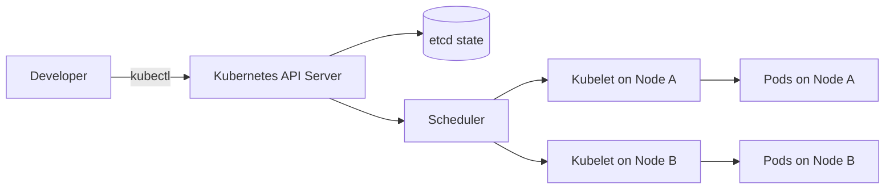
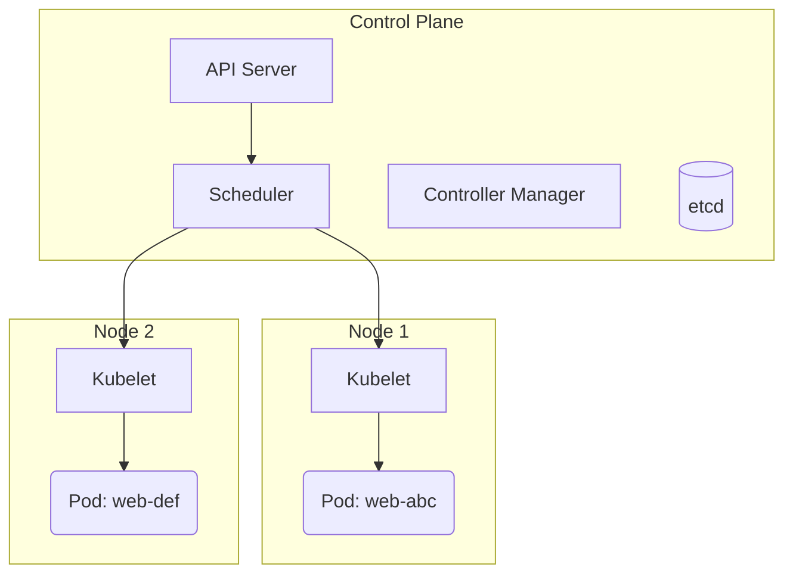

# Learn Kubernetes Step by Step: Cluster Basics Without the Headache

Author: [nawazdhandala](https://www.github.com/nawazdhandala)

Tags: Kubernetes, Containers, Learning Resource, DevOps, Cloud

Description: A beginner-friendly path to Kubernetes - what the pieces are, how they talk to each other, and one practical Deployment + Service example you can run today.

Think of Kubernetes as a super smart operations teammate. You tell it what you want running, and it handles the boring work: starting containers, restarting them when they crash, and spreading them across machines. Kubernetes feels overwhelming because most explanations start with advanced add-ons. This guide sticks to the building blocks you actually touch on day one: pods, deployments, services, and the simple commands that tie them together.

---

## Why Teams Reach for Kubernetes

Before diving into commands, it helps to know the problems Kubernetes was built to erase:

- **Self-healing:** If a container crashes, Kubernetes restarts it automatically. No more midnight SSH sessions.
- **Horizontal scaling:** Need more capacity? Increase the replica count and the scheduler spreads pods across healthy machines.
- **Consistent rollouts:** The YAML becomes living documentation, so dev, staging, and production behave the same way.
- **Ecosystem:** Ingress controllers, autoscalers, and observability stacks all plug into the same APIs, so you are not inventing glue code.

If Docker solved “works on my laptop,” Kubernetes solves “this app keeps working even when many laptops (servers) fail.”

## Mental Model: Who Talks to Whom?

Picture a help desk ticket flowing through a company. You (the developer) submit a request, operations triage it, and someone on the ground actually does the work. Kubernetes follows the same rhythm.



- `kubectl` sends your YAML wish list to the API server.
- The API server files that wish list inside etcd, the cluster’s database.
- The scheduler reads the wish list and picks a node with enough CPU/RAM.
- Each node runs a helper called `kubelet`, which pulls images and starts containers until the wish list matches reality.

Any time the cluster feels mysterious, return to this flow. Kubernetes is just a loop that compares “what should exist” vs. “what exists” and fixes the difference.

## Core Pieces in Plain English

- **Pod = lunchbox.** It holds one main container plus any sidecar helpers, and everything inside shares the same network identity and storage.
- **Deployment = lunchbox manager.** You tell it how many identical pods you want, and it keeps that number steady even when nodes fail.
- **Service = contact card.** It gives your pods a stable name and IP so other apps do not need to track every pod shuffle.
- **Node = kitchen.** It is the actual machine (VM or bare metal) where pods live. Nodes report their health and capacity to the control plane.
- **Namespace = folder.** Use it to separate dev, staging, and prod resources so commands stay scoped.

Lock these five definitions into memory and most documentation suddenly makes sense.

## Step 1: Set Up Your Playground

1. **Install `kubectl`.** It is the CLI that talks to the cluster. On macOS run `brew install kubectl`, then confirm with `kubectl version --client`. Windows/Linux installers are on kubernetes.io, and they work the same way.
2. **Start a local cluster.** You need somewhere safe to experiment:
  - `minikube start` spins up a tiny VM with everything prewired.
  - `kind create cluster` runs each Kubernetes node as a Docker container, which is fast for laptops and CI.
  - Managed services (GKE, EKS, AKS) come later; the kubectl commands stay identical.
3. **Make sure you are connected.** Run `kubectl get nodes`. Seeing at least one `Ready` node means your kubeconfig is pointed at the right cluster.

If `kubectl` hangs, restart Docker Desktop (kind/minikube rely on it) or run `kubectl config get-contexts` to ensure you are on the local context, not production.

## Step 2: See the Cluster Topology

Now that `kubectl` works, zoom out and see the moving parts. The control plane makes decisions; the nodes do the work.



Memorize this chain: **API → Scheduler → Kubelet → Pod.** Whenever something is “Pending,” the request is stuck somewhere along that path. Use `kubectl describe` to read the events on each hop until you find the blocker.

## Step 3: Deploy a Real App (Quotes API)

Let us run the same Node.js “quote API” from the Docker article. Namespaces keep the demo isolated from other workloads.

Create a namespace to isolate your demo workloads:

```bash
# Namespaces provide logical separation between workloads
kubectl create namespace demo
```

Deployment YAML (`quote-api.yaml`):

This Deployment tells Kubernetes to run 2 replicas of the quote-api container. The Deployment controller ensures that exactly 2 Pods are always running.

```yaml
apiVersion: apps/v1
kind: Deployment
metadata:
  name: quote-api
  namespace: demo               # Deploy into the demo namespace
spec:
  replicas: 2                   # Run 2 copies of this Pod
  selector:
    matchLabels:
      app: quote-api            # Find Pods with this label
  template:
    metadata:
      labels:
        app: quote-api          # Label applied to created Pods
    spec:
      containers:
        - name: api
          image: ghcr.io/example/quote-api:1.0.0
          ports:
            - containerPort: 8080  # Port the container listens on
```

Every section mirrors plain English:

- `metadata` sets the human-readable name.
- `spec.replicas` declares how many copies you want.
- `template.spec.containers` lists the image and ports.

Apply the manifest to create the Deployment in your cluster:

```bash
# Create or update the Deployment from the YAML file
kubectl apply -f quote-api.yaml
# List Pods in the demo namespace - should show 2 Running Pods
kubectl get pods -n demo
```

`kubectl` replies with the resource names it created. Seconds later, `kubectl get pods -n demo` should show two pods in the `Running` phase. Delete one of them and watch Kubernetes bring it back automatically - that is the Deployment controller doing its job.

## Step 4: Expose It with a Service

Pods receive random IPs that change every time they restart. A Service gives the deployment a permanent address and load-balances across healthy pods.

`service.yaml`:

A Service provides a stable DNS name and IP address for your Pods. It load-balances traffic across all Pods matching the label selector.

```yaml
apiVersion: v1
kind: Service
metadata:
  name: quote-api
  namespace: demo
spec:
  type: ClusterIP               # Internal cluster IP (default type)
  selector:
    app: quote-api              # Route traffic to Pods with this label
  ports:
    - port: 80                  # Port the Service exposes
      targetPort: 8080          # Port on the container to forward to
```

Apply and test the Service using port-forwarding:

```bash
# Create the Service
kubectl apply -f service.yaml
# Forward local port 8080 to Service port 80
kubectl port-forward svc/quote-api -n demo 8080:80
# In another terminal, test the endpoint
curl http://localhost:8080
```

`kubectl port-forward` temporarily glues your laptop port 8080 to the Service port 80, so `curl` can hit it without needing an ingress controller or cloud load balancer yet. Cancel with `Ctrl+C` once you are done.

## Step 5: Roll Out Safely

Rolling updates are the payoff: you edit one field, Kubernetes swaps out pods gradually, and users never see downtime.

Update the image tag to trigger a rolling update. Kubernetes will gradually replace old Pods with new ones.

```bash
# Update the container image - triggers a rolling update
kubectl set image deployment/quote-api api=ghcr.io/example/quote-api:1.1.0 -n demo
# Watch the rollout progress until all Pods are updated
kubectl rollout status deployment/quote-api -n demo
```

`kubectl rollout status` streams progress so you know when traffic is entirely on the new version. If the update breaks something, `kubectl rollout undo ...` rewinds to the prior image instantly.

## Step 6: Databases and Volumes Without Tears

Containers are disposable, but databases are not. Kubernetes solves this with two building blocks:

- **PersistentVolume (PV):** Think "storage supply." Cluster admins (or the cloud) make these available ahead of time.
- **PersistentVolumeClaim (PVC):** Think "storage request." Apps ask for space, and Kubernetes matches the claim to a PV automatically.

Once the PVC is bound, pods mount it like a normal folder. If the pod reschedules onto another node, Kubernetes reattaches the same disk so your data survives.

### Example: PostgreSQL with One Volume

This example shows a StatefulSet running PostgreSQL with persistent storage. Unlike Deployments, StatefulSets give each Pod a stable identity and dedicated storage.

```yaml
apiVersion: v1
kind: PersistentVolumeClaim
metadata:
  name: pg-data
  namespace: demo
spec:
  accessModes: [ReadWriteOnce]    # Only one Pod can mount at a time
  resources:
    requests:
      storage: 20Gi               # Request 20GB of storage
---
apiVersion: apps/v1
kind: StatefulSet
metadata:
  name: pg
  namespace: demo
spec:
  serviceName: pg                 # Headless Service for DNS
  replicas: 1
  selector:
    matchLabels:
      app: pg
  template:
    metadata:
      labels:
        app: pg
    spec:
      containers:
        - name: postgres
          image: postgres:16
          ports:
            - containerPort: 5432   # PostgreSQL default port
          env:
            - name: POSTGRES_PASSWORD
              valueFrom:
                secretKeyRef:       # Read password from a Secret
                  name: pg-secret
                  key: password
          volumeMounts:
            - name: data
              mountPath: /var/lib/postgresql/data  # Where PostgreSQL stores data
  volumeClaimTemplates:            # Creates a PVC for each Pod replica
    - metadata:
        name: data
      spec:
        accessModes: [ReadWriteOnce]
        resources:
          requests:
            storage: 20Gi
```

Key points, minus the jargon:

1. The PVC asks for 20Gi of storage once. The cloud-provisioner creates an actual disk behind the scenes.
2. The StatefulSet template mounts that disk at `/var/lib/postgresql/data`, so PostgreSQL writes real files there.
3. If the pod restarts, Kubernetes reuses the same volume because the `volumeClaimTemplates` name matches.

Create the referenced secret before deploying the StatefulSet:

```bash
# Create a Secret containing the PostgreSQL password
kubectl create secret generic pg-secret --from-literal=password=supersecure -n demo
```

For quick dev environments you can skip StatefulSets and mount a PVC inside a Deployment, but the StatefulSet keeps stable pod names (`pg-0`, `pg-1`) which databases like.

### Local Testing Shortcut

When using `minikube` or `kind`, storage classes already exist. Run `kubectl get storageclass` to confirm. If you see `standard` or `local-path`, your PVCs will bind automatically without extra setup.

That is the entire mental shift: treat stateless apps as Deployments with Services, treat stateful apps as StatefulSets with PVCs, and let Kubernetes reattach the right disk whenever pods move.

## Troubleshooting Flow

When something misbehaves, follow this mini playbook:

1. **Start with a list.** `kubectl get pods -n demo` shows the overall state. Anything not `Running` is your clue.
2. **Describe the pod.** `kubectl describe pod <name> -n demo` prints the attached events (“image pull back-off,” “insufficient cpu”). These messages come straight from the scheduler and kubelet.
3. **Read the logs.** `kubectl logs <pod> -n demo` surfaces your application’s stdout/stderr. For multi-container pods add `-c <container-name>`.
4. **Check cluster events.** `kubectl get events --sort-by=.lastTimestamp` reveals node-level problems like full disks or failed mounts.

Also remember: if Kubernetes never created a pod, the issue is probably a typo in your YAML (syntax error, missing image). Fix the manifest, reapply, and the controllers will try again.

## Where to Go Next

1. **Autoscale:** `kubectl autoscale deployment ...` teaches Kubernetes to add/remove pods based on CPU.
2. **Ingress or LoadBalancer:** Swap the Service type when you are ready for real customers, and let the cloud create an external IP.
3. **Resource limits:** Add `resources.requests/limits` so the scheduler knows exactly how to pack pods.

Kubernetes is just a reconciliation loop: you describe the world you want, and the control plane keeps nudging reality to match it. Keep practicing that loop with tiny experiments - declare, apply, observe, tweak - and the platform stops feeling magical and starts feeling dependable.
