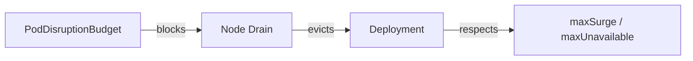

# 10 Kubernetes Superpowers Developers Overlook (and How to Use Them)

Author: [nawazdhandala](https://www.github.com/nawazdhandala)

Tags: Kubernetes, DevOps, Observability, Automation, Security, Cost Optimization

Description: Ten field-tested Kubernetes capabilities - topology spread, disruption budgets, admission policies, autoscaling guardrails, and more - that most teams ignore but instantly boost resilience, velocity, and cost control.

---

Kubernetes has been around long enough that we all "kind of" know how Deployments, Services, and Ingress work. Yet production incidents keep reminding us that the platform hides dozens of smarter defaults most teams never switch on. These are the ten features I audit for any cluster before we even talk about service meshes or AI copilots.

Pro tip: if you still need a friendly refresher on the control-plane basics, start with [Learn Kubernetes Step by Step](https://oneuptime.com/blog/post/2025-11-27-learn-kubernetes-step-by-step/view) and then come back to flip these advanced switches.

## 1. Topology Spread Constraints Beat Basic Anti-Affinity

Pod anti-affinity stops replicas from landing on the same node, but it does not understand zones or racks. `topologySpreadConstraints` does, giving you precise skew control across zones, regions, or even custom labels.

```yaml
spec:
  replicas: 4
  template:
    spec:
      topologySpreadConstraints:
        - maxSkew: 1
          topologyKey: topology.kubernetes.io/zone
          whenUnsatisfiable: DoNotSchedule
          labelSelector:
            matchLabels:
              app: payments
```

- `maxSkew: 1` ensures no zone runs more than one extra replica compared to its peers.
- `whenUnsatisfiable: DoNotSchedule` forces the scheduler to wait for capacity instead of piling pods onto one zone.
- Works beautifully with bare metal too - label racks/nodes however you want.

## 2. PodDisruptionBudget + maxSurge Save Your Rollouts

Every `kubectl drain` or node upgrade evicts pods. Without a `PodDisruptionBudget` (PDB), a single drain can drop your entire Deployment. Pair a PDB with a Deployment surge so upgrades stay safe.

```yaml
apiVersion: policy/v1
kind: PodDisruptionBudget
metadata:
  name: payments-pdb
spec:
  minAvailable: 3
  selector:
    matchLabels:
      app: payments
---
apiVersion: apps/v1
kind: Deployment
metadata:
  name: payments
spec:
  strategy:
    rollingUpdate:
      maxSurge: 1
      maxUnavailable: 0
```



- The drain will pause if removing a pod violates `minAvailable`.
- `maxSurge: 1` lets Kubernetes add a fresh pod before deleting the old one - zero downtime, even during cluster upgrades.

## 3. PriorityClasses Prevent Thundering Herds

Background Jobs (backfills, data science experiments) love to steal CPU from real-time APIs. Create two `PriorityClasses` so the scheduler knows which pods it may preempt.

```yaml
apiVersion: scheduling.k8s.io/v1
kind: PriorityClass
metadata:
  name: critical-api
value: 100000
preemptionPolicy: PreemptLowerPriority
---
kind: PriorityClass
metadata:
  name: batch-low
value: 1000
preemptionPolicy: Never
```

Set `priorityClassName` on each Deployment. Now, if autoscaling squeezes the cluster, Kubernetes evicts the low-priority jobs first and keeps latency-sensitive workloads alive.

## 4. Blend Requests, Limits, and HPAs with Stabilization Windows

Most throttling complaints come from mismatched requests/limits. Set `requests` to the 90th percentile, `limits` ~1.5x requests, and then let the Horizontal Pod Autoscaler scale based on actual load. Stabilization windows prevent oscillation.

```yaml
apiVersion: autoscaling/v2
kind: HorizontalPodAutoscaler
spec:
  minReplicas: 3
  maxReplicas: 15
  behavior:
    scaleDown:
      stabilizationWindowSeconds: 300
      policies:
        - type: Percent
          value: 30
          periodSeconds: 60
```

- The 5-minute stabilization window stops the HPA from removing pods too aggressively right after a spike.
- Combine with `--horizontal-pod-autoscaler-downscale-stabilization` on the controller manager for cluster-wide defaults.

## 5. LimitRanges and ResourceQuotas Stop Noisy Neighbors

Namespaces without default requests become a free-for-all. Apply a `LimitRange` so every pod gets CPU/memory defaults, then cap the namespace using a `ResourceQuota`.

```yaml
apiVersion: v1
kind: LimitRange
metadata:
  name: defaults
  namespace: web
spec:
  limits:
    - defaultRequest:
        cpu: 200m
        memory: 256Mi
      default:
        cpu: 500m
        memory: 512Mi
      type: Container
```

Pair it with:

```yaml
apiVersion: v1
kind: ResourceQuota
metadata:
  name: web-budget
  namespace: web
spec:
  hard:
    requests.cpu: "8"
    requests.memory: 16Gi
    pods: "40"
```

Now every service in the `web` namespace must declare sane resource values, and runaway deployments cannot spin up infinite replicas.

## 6. CronJobs Need Concurrency Policies to Avoid Duplicate Work

By default, CronJobs will happily start a new Job even if the previous one is still running. Add `concurrencyPolicy: Forbid` and `startingDeadlineSeconds` so DevOps is not paged twice for the same task.

```yaml
apiVersion: batch/v1
kind: CronJob
metadata:
  name: nightly-compaction
spec:
  schedule: "0 1 * * *"
  concurrencyPolicy: Forbid
  startingDeadlineSeconds: 600
  successfulJobsHistoryLimit: 3
  failedJobsHistoryLimit: 1
```

Also consider `suspend: true` during incident response to stop runaway batch workloads with one flag.

## 7. `kubectl debug` with Ephemeral Containers Beats SSH

`kubectl exec` fails whenever the container image lacks a shell. `kubectl debug` launches a short-lived helper container (with `busybox`, `distroless`, etc.) in the same pod namespace so you can inspect the filesystem and network without rebuilding images.

```bash
kubectl debug deploy/payments -it --image=busybox:1.36 --target=api
```

- `--target` picks which existing container’s namespaces you want to join.
- Ephemeral containers never restart with the pod, so there is no lingering risk.

## 8. `kubectl diff --server-side` Catches Drift Before You Apply

Git diffs only show what you changed locally. `kubectl diff --server-side -f manifest.yaml` compares your desired state with the **live** object, including defaulted fields and cluster-side mutations.

```bash
kubectl diff --server-side -f k8s/deployment.yaml --field-manager=gitops
```

Pair it with `kubectl apply --server-side --field-manager=gitops` so a single manager owns each field, eliminating "field is managed by another client" errors during GitOps rollouts.

## 9. Policy-as-Code: Kyverno or Gatekeeper

Stop relying on wiki pages to enforce best practices. Admission controllers such as Kyverno or OPA Gatekeeper can reject any manifest missing labels, liveness probes, or resource limits.

Example Kyverno policy forcing HTTPS-only Ingress definitions:

```yaml
apiVersion: kyverno.io/v1
kind: ClusterPolicy
metadata:
  name: enforce-tls-ingress
spec:
  validationFailureAction: enforce
  rules:
    - name: tls-required
      match:
        resources:
          kinds:
            - Ingress
      validate:
        message: "Ingress must terminate TLS."
        pattern:
          spec:
            tls:
              - secretName: "?*"
```

Once the policy exists, developers get instant feedback at admission time instead of waiting for a code review.

## 10. Export Cluster Events and Metrics to OpenTelemetry

`kubectl get events` only holds a few hours of history. Ship events, kube-state-metrics, and node telemetry into OpenTelemetry Collector + OneUptime so regressions surface instantly.

- Deploy the Collector as a DaemonSet with the `kubeletstats` receiver.
- Add the `k8sobjects` receiver to stream Events, HPAs, and PDB changes.
- Forward everything to OneUptime (see [How to Monitor Kubernetes Clusters with OpenTelemetry and OneUptime](https://oneuptime.com/blog/post/2025-11-14-monitor-kubernetes-clusters-with-opentelemetry-and-oneuptime/view)) for SLOs and alerting.

This single pipeline gives developers the "why" behind pending pods, crash loops, or policy denials without ever SSH-ing into a node.

---

Kubernetes is already in your stack; squeezing more value from it is about turning on the features hiding behind a few YAML fields. Audit these ten areas during your next on-call retro and you will usually delete more incidents than you add new YAML.
