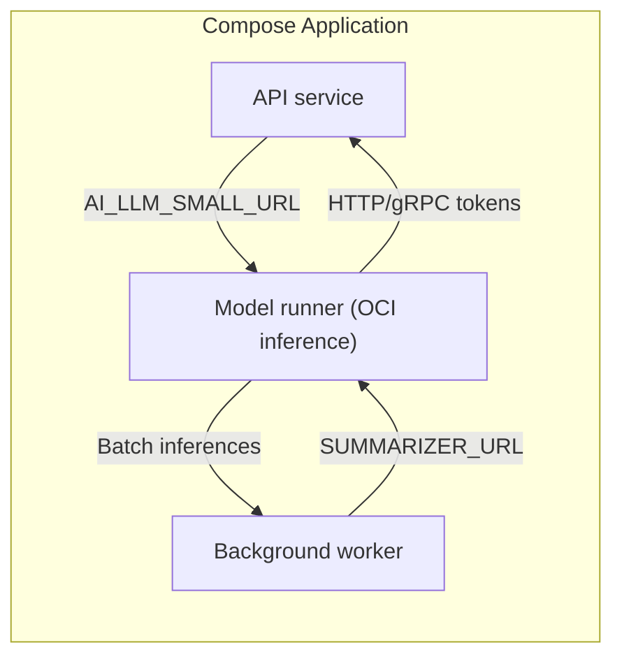

# Docker Compose Models Explained: Wire AI Runtimes Like Any Other Dependency

Author: [nawazdhandala](https://www.github.com/nawazdhandala)

Tags: Docker, Docker Compose, DevOps, Configuration, AI

Description: Docker Compose adds a `models` top-level section that lets you pull OCI-hosted AI models, run them alongside your services, and inject stable endpoints automatically. Here's why it matters and how to use it without creating fragile glue code.

> Compose finally treats AI models as first-class citizens: declare them once, grant access explicitly, and keep your inference endpoints versioned right next to your application stack.

## Why Docker Compose even needs a `models` section

AI features forced us to bolt on model servers manually: a stray `docker run` here, a bespoke shell script there. The `models` section solves three chronic issues:

1. **Reproducibility** – You reference the model as an OCI artifact (for example `docker.io/company/models:13b-q4`) and Compose pulls the exact digest every time, just like an image.
2. **Controlled access** – Services only see the models you list under their `models:` attribute. No more exposing an inference endpoint on a shared network and hoping people behave.
3. **Self-documenting stacks** – Your Compose file now tells reviewers, “these services depend on these models with this context size,” instead of burying runtime flags deep inside README instructions.

Compose treats models as another resource type (like `volumes` or `configs`), so they can be shared, versioned, and templatized.

## How the `models` block works

```yaml
services:
  api:
    image: ghcr.io/acme/api:main
    models:
      - llm_small

models:
  llm_small:
    model: docker.io/acme/llm-small:1.2.0
```

Behind the scenes, Docker Desktop launches a **model runner** container, downloads the OCI artifact, and injects connection info into `api` as environment variables (for example `AI_LLM_SMALL_URL`).

Need more control? Switch to the long syntax so you can pick your env var, add runtime flags, or adjust token windows:

```yaml
services:
  worker:
    image: ghcr.io/acme/worker:main
    models:
      llm_large:
        endpoint_var: SUMMARIZER_URL

models:
  llm_large:
    model: docker.io/acme/llm-large@sha256:deadcafe
    context_size: 8192
    runtime_flags:
      - "--temperature=0.2"
      - "--gpu-layers=40"
```

Compose still injects credentials and URLs, but now you control the env var name (`SUMMARIZER_URL`) and the runtime knobs.

## Why not just define models inside `services`?

At first glance it feels like models should live under each service, just like `environment` or `volumes`. The Compose team pulled them into a top-level section for a few practical reasons:

1. **Shared model runners** – Multiple services frequently reuse the same artifact. Declaring it once lets Compose start exactly one runner and wire every authorized service to it, instead of duplicating heavyweight downloads.
2. **Isolated lifecycle management** – Top-level `models` behave like `volumes` or `secrets`: Compose can pull, cache, and update them independently of service images, so rolling a new model version doesn’t force you to edit unrelated service blocks.
3. **Richer metadata** – Attributes such as `context_size`, `runtime_flags`, or future GPU reservations belong to the model itself, not to any single consumer. Keeping them alongside the artifact avoids divergent copies across services.
4. **Explicit permissioning** – Services must opt in via their `models:` attribute. If everything lived inline, it would be trivial to accidentally expose an inference endpoint to a container that shouldn’t have it. The split ensures least privilege by default.
5. **Tooling/runtime awareness** – Compose uses the models map to spin up the model runner, mount accelerators, inject credentials, and emit env vars. A purely service-local declaration wouldn’t give Compose the full picture of which models exist in the project.

In short, the models section is an application-level contract: define the AI assets once, then grant access explicitly from each service. That separation keeps your Compose file auditable, reproducible, and harder to misuse.

## Wiring services to models safely

1. **Grant access intentionally** – Only list a model under the services that need it. If `cron` should not hit the LLM, keep it out of the `models:` array.
2. **Use Compose profiles for environment parity** – Pair models with [`profiles`](https://oneuptime.com/blog/post/2025-11-27-manage-docker-compose-profiles/view) so heavier inference stacks run only in dev boxes that can handle them.
3. **Version-pin with digests** – Treat `models.model` like `image` fields. Lock to a digest (`@sha256:...`) before promoting to staging so a repushed tag cannot surprise you.
4. **Override endpoints when needed** – In CI you might point to a remote hosted model by replacing the entry with a `profiles` override file that sets `runtime_flags: ["--remote=https://llm.ci"]`.

## Visualizing the flow



Each service receives its own credential + endpoint pair, even though a single runner hosts the artifact.

## Patterns that make `models` shine

- **Sidecar-style isolation** – Run smaller quantized models for unit tests and swap in full-size weights for pre-prod simply by changing the artifact reference.
- **Shared inference bus** – Multiple services can reference the same model without recreating runners, keeping GPU allocation predictable.
- **Least-privilege networking** – Because Compose injects endpoints via env vars, you can disable exposing the runner on any network and let Compose handle the plumbing.
- **Repeatable local onboarding** – New engineers only need `docker compose up`. They get the same models, context limits, and runtime flags that production uses.

## Common mistakes (and quick fixes)

| Smell | Why it hurts | Better approach |
| --- | --- | --- |
| Leaving `models:` empty and curling a random localhost port | Hidden dependency, no declarative link | Declare the model and let Compose inject the URL |
| Sharing the injected env var through `.env` files | Breaks isolation & leaks credentials | Keep the Compose-managed env vars internal to each container |
| Forgetting GPU requirements | Model runner may silently fall back to CPU | Annotate the model service with `deploy.resources.reservations.devices` so scheduling fails fast |
| Treating models like static files | You lose provenance when weights change | Publish models as OCI artifacts with semver tags and digests |

## Ship it thoughtfully

Compose models are young, but they close an annoying gap: declaring AI dependencies with the same rigor as everything else in your stack. Start small-wrap one LLM-powered endpoint behind the `models` section, version it, and gate access consciously. Once the friction disappears, you can iterate faster on AI features without building bespoke infrastructure each sprint.
