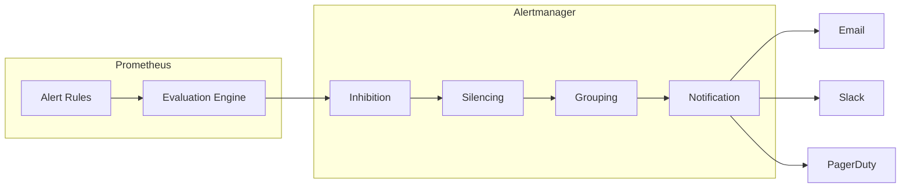

# How to Configure Alert Rules in Prometheus

Author: [nawazdhandala](https://www.github.com/nawazdhandala)

Tags: Prometheus, Alerting, Alert Rules, Alertmanager, Monitoring, Observability

Description: A complete guide to configuring Prometheus alert rules including rule syntax, severity levels, grouping, and integration with Alertmanager for notifications.

---

Prometheus alerting rules define conditions that trigger alerts. When combined with Alertmanager, they form a powerful notification system. This guide covers everything from basic rule syntax to advanced alerting patterns.

## Alert Rule Architecture



## Basic Alert Rule Configuration

### Enable Rule Files

First, configure Prometheus to load rule files:

```yaml
# prometheus.yml
global:
  scrape_interval: 15s
  evaluation_interval: 15s

rule_files:
  - '/etc/prometheus/rules/*.yml'
  - '/etc/prometheus/alerts/*.yml'

alerting:
  alertmanagers:
    - static_configs:
        - targets:
            - 'alertmanager:9093'
```

### Basic Rule Syntax

```yaml
# /etc/prometheus/rules/basic-alerts.yml
groups:
  - name: example-alerts
    rules:
      - alert: HighCPUUsage
        expr: 100 - (avg by(instance) (rate(node_cpu_seconds_total{mode="idle"}[5m])) * 100) > 80
        for: 5m
        labels:
          severity: warning
        annotations:
          summary: "High CPU usage detected"
          description: "CPU usage is {{ printf \"%.2f\" $value }}% on {{ $labels.instance }}"
```

### Rule Components Explained

- **alert**: Unique name for the alert
- **expr**: PromQL expression that evaluates to true/false
- **for**: Duration the condition must be true before firing
- **labels**: Additional labels attached to the alert
- **annotations**: Human-readable metadata

## Severity Levels and Labels

Establish a consistent severity scheme:

```yaml
groups:
  - name: severity-examples
    rules:
      - alert: ServiceDown
        expr: up == 0
        for: 1m
        labels:
          severity: critical
          team: platform
        annotations:
          summary: "Service {{ $labels.job }} is down"

      - alert: HighMemoryUsage
        expr: (1 - (node_memory_MemAvailable_bytes / node_memory_MemTotal_bytes)) * 100 > 85
        for: 10m
        labels:
          severity: warning
          team: infrastructure
        annotations:
          summary: "High memory usage on {{ $labels.instance }}"

      - alert: DiskSpaceLow
        expr: (node_filesystem_avail_bytes / node_filesystem_size_bytes) * 100 < 20
        for: 30m
        labels:
          severity: info
          team: infrastructure
        annotations:
          summary: "Disk space below 20% on {{ $labels.instance }}"
```

## Alert Rule Categories

### Infrastructure Alerts

```yaml
groups:
  - name: infrastructure-alerts
    rules:
      # Node down
      - alert: NodeDown
        expr: up{job="node-exporter"} == 0
        for: 2m
        labels:
          severity: critical
        annotations:
          summary: "Node {{ $labels.instance }} is unreachable"

      # High CPU
      - alert: NodeHighCPU
        expr: |
          100 - (avg by(instance) (rate(node_cpu_seconds_total{mode="idle"}[5m])) * 100) > 80
        for: 15m
        labels:
          severity: warning
        annotations:
          summary: "High CPU on {{ $labels.instance }}"
          description: "CPU usage: {{ printf \"%.1f\" $value }}%"

      # Memory pressure
      - alert: NodeMemoryPressure
        expr: |
          (1 - (node_memory_MemAvailable_bytes / node_memory_MemTotal_bytes)) * 100 > 90
        for: 5m
        labels:
          severity: critical
        annotations:
          summary: "Memory pressure on {{ $labels.instance }}"

      # Disk filling up
      - alert: NodeDiskWillFillIn24Hours
        expr: |
          predict_linear(node_filesystem_avail_bytes{fstype!~"tmpfs|overlay"}[6h], 24*3600) < 0
        for: 1h
        labels:
          severity: warning
        annotations:
          summary: "Disk {{ $labels.device }} will fill within 24 hours"
```

### Application Alerts

```yaml
groups:
  - name: application-alerts
    rules:
      # High error rate
      - alert: HighErrorRate
        expr: |
          sum(rate(http_requests_total{status=~"5.."}[5m])) by (service)
          /
          sum(rate(http_requests_total[5m])) by (service)
          > 0.05
        for: 5m
        labels:
          severity: critical
        annotations:
          summary: "High error rate for {{ $labels.service }}"
          description: "Error rate: {{ printf \"%.2f\" $value | mul 100 }}%"

      # High latency
      - alert: HighLatency
        expr: |
          histogram_quantile(0.95,
            sum(rate(http_request_duration_seconds_bucket[5m])) by (le, service)
          ) > 1
        for: 5m
        labels:
          severity: warning
        annotations:
          summary: "P95 latency above 1s for {{ $labels.service }}"

      # Request rate anomaly
      - alert: LowRequestRate
        expr: |
          sum(rate(http_requests_total[5m])) by (service)
          <
          sum(rate(http_requests_total[5m] offset 1h)) by (service) * 0.5
        for: 10m
        labels:
          severity: warning
        annotations:
          summary: "Request rate dropped significantly for {{ $labels.service }}"
```

### Kubernetes Alerts

```yaml
groups:
  - name: kubernetes-alerts
    rules:
      # Pod not ready
      - alert: PodNotReady
        expr: |
          kube_pod_status_ready{condition="true"} == 0
        for: 15m
        labels:
          severity: warning
        annotations:
          summary: "Pod {{ $labels.namespace }}/{{ $labels.pod }} not ready"

      # Container restarts
      - alert: ContainerRestartLoop
        expr: |
          increase(kube_pod_container_status_restarts_total[1h]) > 5
        for: 0m
        labels:
          severity: warning
        annotations:
          summary: "Container {{ $labels.container }} restarting frequently"

      # Deployment replicas mismatch
      - alert: DeploymentReplicasMismatch
        expr: |
          kube_deployment_spec_replicas != kube_deployment_status_replicas_available
        for: 15m
        labels:
          severity: warning
        annotations:
          summary: "Deployment {{ $labels.deployment }} replicas mismatch"

      # PVC almost full
      - alert: PVCAlmostFull
        expr: |
          kubelet_volume_stats_used_bytes / kubelet_volume_stats_capacity_bytes > 0.85
        for: 5m
        labels:
          severity: warning
        annotations:
          summary: "PVC {{ $labels.persistentvolumeclaim }} is 85% full"

      # Job failed
      - alert: KubernetesJobFailed
        expr: kube_job_status_failed > 0
        for: 0m
        labels:
          severity: warning
        annotations:
          summary: "Job {{ $labels.job_name }} failed"
```

## Alertmanager Configuration

Configure Alertmanager to route and send notifications:

```yaml
# alertmanager.yml
global:
  smtp_smarthost: 'smtp.example.com:587'
  smtp_from: 'alerts@example.com'
  smtp_auth_username: 'alertmanager'
  smtp_auth_password: 'password'

route:
  group_by: ['alertname', 'severity']
  group_wait: 30s
  group_interval: 5m
  repeat_interval: 4h
  receiver: 'default'
  routes:
    - match:
        severity: critical
      receiver: 'pagerduty'
      continue: true
    - match:
        severity: critical
      receiver: 'slack-critical'
    - match:
        severity: warning
      receiver: 'slack-warning'
    - match:
        team: database
      receiver: 'database-team'

receivers:
  - name: 'default'
    email_configs:
      - to: 'ops@example.com'

  - name: 'pagerduty'
    pagerduty_configs:
      - service_key: 'your-pagerduty-key'

  - name: 'slack-critical'
    slack_configs:
      - api_url: 'https://hooks.slack.com/services/xxx'
        channel: '#alerts-critical'
        title: '{{ .Status | toUpper }}: {{ .CommonAnnotations.summary }}'
        text: '{{ .CommonAnnotations.description }}'

  - name: 'slack-warning'
    slack_configs:
      - api_url: 'https://hooks.slack.com/services/xxx'
        channel: '#alerts-warning'

  - name: 'database-team'
    email_configs:
      - to: 'dba@example.com'

inhibit_rules:
  - source_match:
      severity: 'critical'
    target_match:
      severity: 'warning'
    equal: ['alertname', 'instance']
```

## Alert Templating

Use Go templating for dynamic content:

```yaml
groups:
  - name: templated-alerts
    rules:
      - alert: HighErrorRate
        expr: |
          sum(rate(http_requests_total{status=~"5.."}[5m])) by (service, namespace)
          /
          sum(rate(http_requests_total[5m])) by (service, namespace)
          > 0.05
        labels:
          severity: critical
          runbook_url: "https://wiki.example.com/runbooks/high-error-rate"
        annotations:
          summary: "High error rate for {{ $labels.service }}"
          description: |
            Service: {{ $labels.service }}
            Namespace: {{ $labels.namespace }}
            Error Rate: {{ printf "%.2f" $value | mul 100 }}%

            Runbook: {{ $labels.runbook_url }}
```

## Testing Alert Rules

### Syntax Validation

```bash
# Validate rule file syntax
promtool check rules /etc/prometheus/rules/*.yml
```

### Unit Testing

```yaml
# test-rules.yml
rule_files:
  - /etc/prometheus/rules/alerts.yml

evaluation_interval: 1m

tests:
  - interval: 1m
    input_series:
      - series: 'http_requests_total{service="api",status="500"}'
        values: '0+10x10'
      - series: 'http_requests_total{service="api",status="200"}'
        values: '0+100x10'
    alert_rule_test:
      - eval_time: 5m
        alertname: HighErrorRate
        exp_alerts:
          - exp_labels:
              severity: critical
              service: api
```

Run tests:

```bash
promtool test rules test-rules.yml
```

## Best Practices

### 1. Use Meaningful Alert Names

```yaml
# Good
- alert: DatabaseConnectionPoolExhausted
- alert: PaymentServiceHighLatency

# Bad
- alert: Alert1
- alert: DBProblem
```

### 2. Include Actionable Information

```yaml
annotations:
  summary: "Database connection pool exhausted"
  description: |
    Connection pool for {{ $labels.database }} is at {{ $value }}% capacity.

    Immediate actions:
    1. Check for connection leaks in application logs
    2. Consider increasing pool size
    3. Review recent deployments

    Runbook: https://wiki.example.com/db-pool-exhausted
```

### 3. Avoid Alert Fatigue

```yaml
# Add meaningful 'for' duration
- alert: HighCPU
  expr: cpu_usage > 80
  for: 15m  # Don't alert on brief spikes

# Combine with traffic threshold
- alert: HighErrorRate
  expr: |
    error_rate > 0.05
    AND
    request_rate > 10  # Only alert with meaningful traffic
```

### 4. Use Recording Rules for Complex Alerts

```yaml
groups:
  - name: recording
    rules:
      - record: service:error_rate:5m
        expr: |
          sum(rate(http_requests_total{status=~"5.."}[5m])) by (service)
          /
          sum(rate(http_requests_total[5m])) by (service)

  - name: alerting
    rules:
      - alert: HighErrorRate
        expr: service:error_rate:5m > 0.05
        for: 5m
```

## Conclusion

Well-configured alert rules catch real problems without generating noise. Start with essential infrastructure and application health alerts, then refine based on operational experience. Combine Prometheus alerting with Alertmanager for flexible routing and notification. For unified alerting across metrics, logs, and traces with intelligent noise reduction, explore OneUptime's alerting capabilities.
