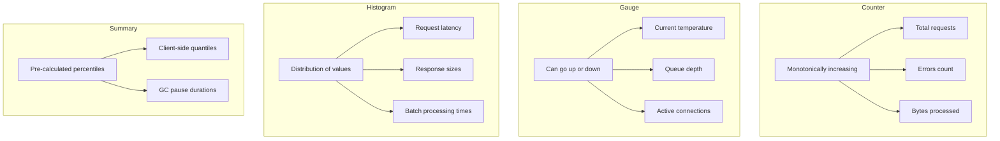

# How to Implement Custom Metrics in Prometheus

Author: [nawazdhandala](https://www.github.com/nawazdhandala)

Tags: Prometheus, Custom Metrics, Instrumentation, Go, Python, Node.js, Observability

Description: Learn how to instrument your applications with custom Prometheus metrics including counters, gauges, histograms, and best practices for naming and labeling.

---

Built-in metrics only tell part of the story. Custom metrics let you measure what matters most to your business and operations. This guide covers implementing custom metrics in Go, Python, and Node.js with best practices for effective instrumentation.

## Metric Types Overview



## Naming Conventions

Follow these patterns for clear, consistent metrics:

```
<namespace>_<subsystem>_<name>_<unit>
```

Examples:
- `http_requests_total` - Counter of HTTP requests
- `http_request_duration_seconds` - Histogram of request duration
- `process_resident_memory_bytes` - Gauge of memory usage
- `queue_messages_pending` - Gauge of pending messages

### Unit Suffixes

| Unit | Suffix | Example |
|------|--------|---------|
| Seconds | `_seconds` | `request_duration_seconds` |
| Bytes | `_bytes` | `response_size_bytes` |
| Total count | `_total` | `http_requests_total` |
| Ratio | `_ratio` | `cache_hit_ratio` |
| Info | `_info` | `build_info` |

## Go Implementation

### Setup

```go
package main

import (
    "net/http"
    "time"

    "github.com/prometheus/client_golang/prometheus"
    "github.com/prometheus/client_golang/prometheus/promauto"
    "github.com/prometheus/client_golang/prometheus/promhttp"
)

// Define metrics
var (
    // Counter
    httpRequestsTotal = promauto.NewCounterVec(
        prometheus.CounterOpts{
            Name: "http_requests_total",
            Help: "Total number of HTTP requests",
        },
        []string{"method", "endpoint", "status"},
    )

    // Gauge
    activeConnections = promauto.NewGauge(
        prometheus.GaugeOpts{
            Name: "active_connections",
            Help: "Number of active connections",
        },
    )

    // Histogram
    requestDuration = promauto.NewHistogramVec(
        prometheus.HistogramOpts{
            Name:    "http_request_duration_seconds",
            Help:    "HTTP request duration in seconds",
            Buckets: []float64{.005, .01, .025, .05, .1, .25, .5, 1, 2.5, 5, 10},
        },
        []string{"method", "endpoint"},
    )

    // Summary
    responseSize = promauto.NewSummaryVec(
        prometheus.SummaryOpts{
            Name:       "http_response_size_bytes",
            Help:       "HTTP response size in bytes",
            Objectives: map[float64]float64{0.5: 0.05, 0.9: 0.01, 0.99: 0.001},
        },
        []string{"endpoint"},
    )
)
```

### Using Metrics

```go
func handleRequest(w http.ResponseWriter, r *http.Request) {
    // Track active connections
    activeConnections.Inc()
    defer activeConnections.Dec()

    // Track request duration
    timer := prometheus.NewTimer(requestDuration.WithLabelValues(r.Method, r.URL.Path))
    defer timer.ObserveDuration()

    // Process request
    response := processRequest(r)

    // Track response size
    responseSize.WithLabelValues(r.URL.Path).Observe(float64(len(response)))

    // Write response
    w.Write(response)

    // Track request count
    httpRequestsTotal.WithLabelValues(r.Method, r.URL.Path, "200").Inc()
}

func main() {
    http.HandleFunc("/api/", handleRequest)
    http.Handle("/metrics", promhttp.Handler())
    http.ListenAndServe(":8080", nil)
}
```

### Business Metrics Example

```go
var (
    ordersProcessed = promauto.NewCounterVec(
        prometheus.CounterOpts{
            Name: "orders_processed_total",
            Help: "Total number of orders processed",
        },
        []string{"status", "payment_method", "region"},
    )

    orderValue = promauto.NewHistogramVec(
        prometheus.HistogramOpts{
            Name:    "order_value_dollars",
            Help:    "Order value in dollars",
            Buckets: []float64{10, 25, 50, 100, 250, 500, 1000, 2500, 5000},
        },
        []string{"region"},
    )

    inventoryLevel = promauto.NewGaugeVec(
        prometheus.GaugeOpts{
            Name: "inventory_items_count",
            Help: "Current inventory level",
        },
        []string{"product_category", "warehouse"},
    )
)

func processOrder(order Order) error {
    // Process the order...

    // Record metrics
    ordersProcessed.WithLabelValues(
        "completed",
        order.PaymentMethod,
        order.Region,
    ).Inc()

    orderValue.WithLabelValues(order.Region).Observe(order.Total)

    // Update inventory
    for _, item := range order.Items {
        inventoryLevel.WithLabelValues(
            item.Category,
            item.Warehouse,
        ).Sub(float64(item.Quantity))
    }

    return nil
}
```

## Python Implementation

### Setup with prometheus_client

```python
from prometheus_client import Counter, Gauge, Histogram, Summary, start_http_server
import time
import random

# Counter
http_requests_total = Counter(
    'http_requests_total',
    'Total number of HTTP requests',
    ['method', 'endpoint', 'status']
)

# Gauge
active_connections = Gauge(
    'active_connections',
    'Number of active connections'
)

# Histogram
request_duration = Histogram(
    'http_request_duration_seconds',
    'HTTP request duration in seconds',
    ['method', 'endpoint'],
    buckets=[.005, .01, .025, .05, .1, .25, .5, 1, 2.5, 5, 10]
)

# Summary
response_size = Summary(
    'http_response_size_bytes',
    'HTTP response size in bytes',
    ['endpoint']
)
```

### Using Metrics with Decorators

```python
from functools import wraps

def track_request(method, endpoint):
    def decorator(func):
        @wraps(func)
        def wrapper(*args, **kwargs):
            # Track active connections
            active_connections.inc()

            # Track request duration
            with request_duration.labels(method=method, endpoint=endpoint).time():
                try:
                    result = func(*args, **kwargs)
                    http_requests_total.labels(
                        method=method,
                        endpoint=endpoint,
                        status='200'
                    ).inc()
                    return result
                except Exception as e:
                    http_requests_total.labels(
                        method=method,
                        endpoint=endpoint,
                        status='500'
                    ).inc()
                    raise
                finally:
                    active_connections.dec()
        return wrapper
    return decorator

@track_request('GET', '/api/users')
def get_users():
    time.sleep(random.uniform(0.01, 0.5))
    return {'users': []}
```

### Flask Integration

```python
from flask import Flask, request, g
from prometheus_client import make_wsgi_app, Counter, Histogram
from werkzeug.middleware.dispatcher import DispatcherMiddleware
import time

app = Flask(__name__)

REQUEST_COUNT = Counter(
    'flask_request_count',
    'Flask Request Count',
    ['method', 'endpoint', 'http_status']
)

REQUEST_LATENCY = Histogram(
    'flask_request_latency_seconds',
    'Flask Request Latency',
    ['method', 'endpoint']
)

@app.before_request
def before_request():
    g.start_time = time.time()

@app.after_request
def after_request(response):
    latency = time.time() - g.start_time
    REQUEST_LATENCY.labels(
        method=request.method,
        endpoint=request.endpoint or 'unknown'
    ).observe(latency)

    REQUEST_COUNT.labels(
        method=request.method,
        endpoint=request.endpoint or 'unknown',
        http_status=response.status_code
    ).inc()

    return response

# Add prometheus wsgi middleware
app.wsgi_app = DispatcherMiddleware(app.wsgi_app, {
    '/metrics': make_wsgi_app()
})

@app.route('/api/users')
def get_users():
    return {'users': []}

if __name__ == '__main__':
    app.run(port=8080)
```

### FastAPI Integration

```python
from fastapi import FastAPI, Request
from prometheus_client import Counter, Histogram, generate_latest, CONTENT_TYPE_LATEST
from starlette.responses import Response
from starlette.middleware.base import BaseHTTPMiddleware
import time

app = FastAPI()

REQUEST_COUNT = Counter(
    'fastapi_requests_total',
    'Total HTTP requests',
    ['method', 'endpoint', 'status']
)

REQUEST_LATENCY = Histogram(
    'fastapi_request_duration_seconds',
    'HTTP request duration',
    ['method', 'endpoint'],
    buckets=[.005, .01, .025, .05, .1, .25, .5, 1, 2.5, 5, 10]
)

class PrometheusMiddleware(BaseHTTPMiddleware):
    async def dispatch(self, request: Request, call_next):
        start_time = time.time()

        response = await call_next(request)

        latency = time.time() - start_time
        endpoint = request.url.path

        REQUEST_COUNT.labels(
            method=request.method,
            endpoint=endpoint,
            status=response.status_code
        ).inc()

        REQUEST_LATENCY.labels(
            method=request.method,
            endpoint=endpoint
        ).observe(latency)

        return response

app.add_middleware(PrometheusMiddleware)

@app.get("/metrics")
def metrics():
    return Response(generate_latest(), media_type=CONTENT_TYPE_LATEST)

@app.get("/api/users")
def get_users():
    return {"users": []}
```

## Node.js Implementation

### Setup with prom-client

```javascript
const client = require('prom-client');
const express = require('express');

// Create a Registry
const register = new client.Registry();

// Add default metrics
client.collectDefaultMetrics({ register });

// Counter
const httpRequestsTotal = new client.Counter({
    name: 'http_requests_total',
    help: 'Total number of HTTP requests',
    labelNames: ['method', 'endpoint', 'status'],
    registers: [register]
});

// Gauge
const activeConnections = new client.Gauge({
    name: 'active_connections',
    help: 'Number of active connections',
    registers: [register]
});

// Histogram
const requestDuration = new client.Histogram({
    name: 'http_request_duration_seconds',
    help: 'HTTP request duration in seconds',
    labelNames: ['method', 'endpoint'],
    buckets: [0.005, 0.01, 0.025, 0.05, 0.1, 0.25, 0.5, 1, 2.5, 5, 10],
    registers: [register]
});

// Summary
const responseSize = new client.Summary({
    name: 'http_response_size_bytes',
    help: 'HTTP response size in bytes',
    labelNames: ['endpoint'],
    percentiles: [0.5, 0.9, 0.99],
    registers: [register]
});
```

### Express Middleware

```javascript
const express = require('express');
const app = express();

// Metrics middleware
function metricsMiddleware(req, res, next) {
    activeConnections.inc();

    const end = requestDuration.startTimer({
        method: req.method,
        endpoint: req.path
    });

    res.on('finish', () => {
        activeConnections.dec();
        end();

        httpRequestsTotal.labels({
            method: req.method,
            endpoint: req.path,
            status: res.statusCode
        }).inc();

        // Track response size if available
        const contentLength = res.get('Content-Length');
        if (contentLength) {
            responseSize.labels({ endpoint: req.path }).observe(parseInt(contentLength));
        }
    });

    next();
}

app.use(metricsMiddleware);

// Metrics endpoint
app.get('/metrics', async (req, res) => {
    res.set('Content-Type', register.contentType);
    res.end(await register.metrics());
});

// API endpoints
app.get('/api/users', (req, res) => {
    res.json({ users: [] });
});

app.listen(8080);
```

### Business Metrics Example

```javascript
const ordersProcessed = new client.Counter({
    name: 'orders_processed_total',
    help: 'Total orders processed',
    labelNames: ['status', 'payment_method'],
    registers: [register]
});

const orderValue = new client.Histogram({
    name: 'order_value_dollars',
    help: 'Order value in dollars',
    buckets: [10, 25, 50, 100, 250, 500, 1000],
    registers: [register]
});

const cartItems = new client.Gauge({
    name: 'cart_items_total',
    help: 'Total items across all carts',
    registers: [register]
});

async function processOrder(order) {
    try {
        // Process order...

        ordersProcessed.labels({
            status: 'completed',
            payment_method: order.paymentMethod
        }).inc();

        orderValue.observe(order.total);
        cartItems.dec(order.items.length);

    } catch (error) {
        ordersProcessed.labels({
            status: 'failed',
            payment_method: order.paymentMethod
        }).inc();
        throw error;
    }
}
```

## Best Practices

### 1. Choose the Right Metric Type

```go
// Counter - monotonically increasing
errors_total.Inc()  // Never Dec()

// Gauge - can go up and down
temperature.Set(23.5)
queue_depth.Inc()
queue_depth.Dec()

// Histogram - measure distributions
latency.Observe(0.235)
```

### 2. Limit Label Cardinality

```go
// Bad - unbounded cardinality
requests.WithLabelValues(userID, requestID).Inc()

// Good - bounded cardinality
requests.WithLabelValues(userRole, endpoint).Inc()
```

### 3. Use Consistent Labels

```go
// Define labels once
var commonLabels = []string{"service", "environment", "region"}

// Use across metrics
requestsTotal = prometheus.NewCounterVec(opts, commonLabels)
errorsTotal = prometheus.NewCounterVec(opts, commonLabels)
```

### 4. Document Your Metrics

```go
prometheus.NewCounter(prometheus.CounterOpts{
    Name: "payment_transactions_total",
    Help: "Total payment transactions processed. " +
          "Label 'status' indicates success/failure. " +
          "Label 'provider' indicates payment gateway used.",
})
```

## Conclusion

Custom metrics transform generic monitoring into business-aware observability. Instrument the metrics that matter for your operations and business outcomes, follow naming conventions, and be mindful of cardinality. Start with essential metrics and expand based on what questions you need to answer. OneUptime seamlessly ingests custom Prometheus metrics alongside logs and traces for comprehensive observability.
