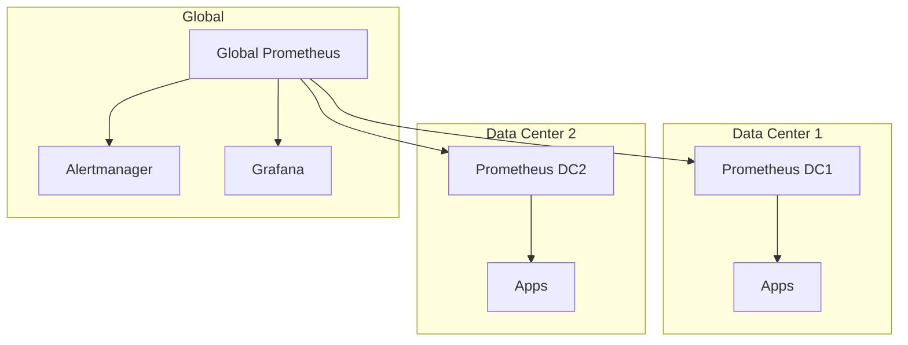

# How to Configure Prometheus Federation

Author: [nawazdhandala](https://www.github.com/nawazdhandala)

Tags: Prometheus, Federation, Monitoring, Metrics, Scalability, Multi-Cluster

Description: Learn how to configure Prometheus federation to aggregate metrics across multiple Prometheus servers, enabling hierarchical monitoring for large-scale deployments.

---

As your infrastructure grows, a single Prometheus server cannot handle all metrics. Federation allows you to aggregate metrics from multiple Prometheus servers into a central instance. This guide shows you how to configure Prometheus federation for scalable monitoring.

## Understanding Federation

Federation is a pull-based mechanism where one Prometheus server scrapes selected time series from another Prometheus server.



### Federation Use Cases

1. **Hierarchical Federation**: Aggregate metrics from lower-level Prometheus servers
2. **Cross-Service Federation**: Pull metrics from another team's Prometheus
3. **Multi-Cluster Monitoring**: Centralize metrics from multiple Kubernetes clusters

## Basic Federation Configuration

### Source Prometheus Setup

Each source Prometheus automatically exposes a federation endpoint at `/federate`. No additional configuration needed on the source.

### Central Prometheus Configuration

Configure the central Prometheus to scrape from source instances:

```yaml
# prometheus.yml on central/global Prometheus
global:
  scrape_interval: 60s
  evaluation_interval: 60s

scrape_configs:
  # Federate from datacenter 1
  - job_name: 'federate-dc1'
    honor_labels: true
    metrics_path: '/federate'
    params:
      'match[]':
        - '{job="node"}'
        - '{job="kubernetes-pods"}'
        - '{__name__=~"job:.*"}'
    static_configs:
      - targets:
          - 'prometheus-dc1.example.com:9090'
        labels:
          datacenter: 'dc1'

  # Federate from datacenter 2
  - job_name: 'federate-dc2'
    honor_labels: true
    metrics_path: '/federate'
    params:
      'match[]':
        - '{job="node"}'
        - '{job="kubernetes-pods"}'
        - '{__name__=~"job:.*"}'
    static_configs:
      - targets:
          - 'prometheus-dc2.example.com:9090'
        labels:
          datacenter: 'dc2'
```

### Understanding the Configuration

- **`honor_labels: true`**: Preserves original labels from source Prometheus
- **`metrics_path: '/federate'`**: Uses the federation endpoint
- **`match[]`**: Selects which time series to federate
- **`labels`**: Adds labels to identify the source

## Match Parameter Patterns

The `match[]` parameter is crucial for controlling what gets federated.

### Pattern 1: By Job Name

```yaml
params:
  'match[]':
    - '{job="node"}'
    - '{job="kubernetes-pods"}'
```

### Pattern 2: By Metric Name Prefix

```yaml
params:
  'match[]':
    - '{__name__=~"http_.*"}'
    - '{__name__=~"node_.*"}'
```

### Pattern 3: Recording Rules Only

Federation works best with pre-aggregated recording rules:

```yaml
params:
  'match[]':
    - '{__name__=~"job:.*"}'
    - '{__name__=~"instance:.*"}'
    - '{__name__=~"cluster:.*"}'
```

### Pattern 4: Combined Selectors

```yaml
params:
  'match[]':
    - '{job="api-server", __name__=~"http_requests_.*"}'
    - '{namespace="production"}'
```

## Hierarchical Federation Setup

For large deployments, use a multi-tier hierarchy.

### Tier 1: Edge Prometheus (Per Service/Team)

```yaml
# edge-prometheus.yml
global:
  scrape_interval: 15s

scrape_configs:
  - job_name: 'my-service'
    kubernetes_sd_configs:
      - role: pod
    relabel_configs:
      - source_labels: [__meta_kubernetes_namespace]
        action: keep
        regex: my-namespace
```

### Tier 2: Regional Prometheus

```yaml
# regional-prometheus.yml
global:
  scrape_interval: 30s

scrape_configs:
  - job_name: 'federate-edge'
    honor_labels: true
    metrics_path: '/federate'
    params:
      'match[]':
        - '{__name__=~"service:.*"}'
    kubernetes_sd_configs:
      - role: service
        namespaces:
          names:
            - monitoring
    relabel_configs:
      - source_labels: [__meta_kubernetes_service_label_prometheus_federate]
        action: keep
        regex: 'true'
```

### Tier 3: Global Prometheus

```yaml
# global-prometheus.yml
global:
  scrape_interval: 60s

scrape_configs:
  - job_name: 'federate-regions'
    honor_labels: true
    metrics_path: '/federate'
    params:
      'match[]':
        - '{__name__=~"region:.*"}'
        - '{__name__=~"global:.*"}'
    static_configs:
      - targets:
          - 'prometheus-us-east.example.com:9090'
          - 'prometheus-us-west.example.com:9090'
          - 'prometheus-eu-central.example.com:9090'
```

## Recording Rules for Federation

Create recording rules at source Prometheus servers to reduce cardinality before federation.

### Source Prometheus Recording Rules

```yaml
# rules/recording-rules.yml
groups:
  - name: federation-rules
    interval: 30s
    rules:
      # Aggregate request rate by service
      - record: service:http_requests:rate5m
        expr: sum(rate(http_requests_total[5m])) by (service)

      # Aggregate error rate by service
      - record: service:http_errors:rate5m
        expr: sum(rate(http_requests_total{status=~"5.."}[5m])) by (service)

      # P99 latency by service
      - record: service:http_latency_p99:5m
        expr: |
          histogram_quantile(0.99,
            sum(rate(http_request_duration_seconds_bucket[5m])) by (le, service)
          )

      # Node CPU usage
      - record: instance:node_cpu:avg_rate5m
        expr: |
          100 - (avg by(instance) (rate(node_cpu_seconds_total{mode="idle"}[5m])) * 100)

      # Node memory usage
      - record: instance:node_memory_utilization:ratio
        expr: |
          1 - (node_memory_MemAvailable_bytes / node_memory_MemTotal_bytes)
```

### Federate Only Recording Rules

```yaml
# On central Prometheus
scrape_configs:
  - job_name: 'federate-dc1'
    honor_labels: true
    metrics_path: '/federate'
    params:
      'match[]':
        - '{__name__=~"service:.*"}'
        - '{__name__=~"instance:.*"}'
    static_configs:
      - targets: ['prometheus-dc1.example.com:9090']
```

## Kubernetes Federation Setup

### Service for Federation Endpoint

```yaml
apiVersion: v1
kind: Service
metadata:
  name: prometheus-federate
  namespace: monitoring
  labels:
    prometheus-federate: "true"
spec:
  selector:
    app: prometheus
  ports:
    - port: 9090
      targetPort: 9090
  type: ClusterIP
```

### Central Prometheus with Service Discovery

```yaml
scrape_configs:
  - job_name: 'federate-clusters'
    honor_labels: true
    metrics_path: '/federate'
    params:
      'match[]':
        - '{__name__=~"cluster:.*"}'
    kubernetes_sd_configs:
      - role: endpoints
        namespaces:
          names:
            - monitoring
    relabel_configs:
      - source_labels: [__meta_kubernetes_service_label_prometheus_federate]
        action: keep
        regex: 'true'
      - source_labels: [__meta_kubernetes_endpoint_port_name]
        action: keep
        regex: web
```

## Performance Considerations

### Scrape Interval

Use longer intervals for federation than for direct scraping:

```yaml
# Direct scraping
global:
  scrape_interval: 15s

# Federation scraping
scrape_configs:
  - job_name: 'federate'
    scrape_interval: 60s  # Longer interval
```

### Limit Cardinality

Monitor what you're federating:

```promql
# Check cardinality of federated metrics
count({job="federate-dc1"})

# Check scrape duration
prometheus_target_scrape_pool_sync_total{scrape_job="federate-dc1"}
```

### Memory Usage

Each federated time series consumes memory. Monitor Prometheus resource usage:

```promql
# Memory usage
process_resident_memory_bytes{job="prometheus"}

# Active time series
prometheus_tsdb_head_series
```

## Troubleshooting Federation

### Verify Federation Endpoint

```bash
# Test federation endpoint directly
curl -G 'http://prometheus:9090/federate' \
  --data-urlencode 'match[]={job="node"}'
```

### Check Scrape Status

```promql
# Scrape success
up{job="federate-dc1"}

# Scrape duration
scrape_duration_seconds{job="federate-dc1"}

# Samples scraped
scrape_samples_scraped{job="federate-dc1"}
```

### Debug Missing Metrics

```promql
# Check if metric exists at source
curl 'http://source-prometheus:9090/api/v1/query?query=up'

# Verify match pattern
curl -G 'http://source-prometheus:9090/federate' \
  --data-urlencode 'match[]={job="node"}'
```

## Conclusion

Prometheus federation enables scalable monitoring across large, distributed infrastructures. Use recording rules to pre-aggregate metrics at the source, federate only what you need at the global level, and monitor federation performance to avoid bottlenecks. For enterprise-scale monitoring with built-in federation capabilities, OneUptime provides seamless multi-cluster metric aggregation alongside logs and traces.
