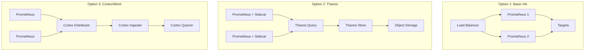

# How to Configure High Availability for Prometheus

Author: [nawazdhandala](https://www.github.com/nawazdhandala)

Tags: Prometheus, High Availability, HA, Reliability, Thanos, Cortex, Monitoring

Description: Learn how to configure Prometheus for high availability using multiple replicas, Thanos, or Cortex for production-grade monitoring infrastructure.

---

A single Prometheus server is a single point of failure. High availability configurations ensure your monitoring continues working even when components fail. This guide covers HA patterns from simple to enterprise-grade.

## HA Architecture Options



## Option 1: Basic HA with Duplicate Prometheus

The simplest HA setup runs identical Prometheus servers.

### Configuration

```yaml
# prometheus-1.yml
global:
  scrape_interval: 15s
  external_labels:
    replica: prometheus-1

scrape_configs:
  - job_name: 'kubernetes-pods'
    kubernetes_sd_configs:
      - role: pod
```

```yaml
# prometheus-2.yml
global:
  scrape_interval: 15s
  external_labels:
    replica: prometheus-2

scrape_configs:
  - job_name: 'kubernetes-pods'
    kubernetes_sd_configs:
      - role: pod
```

### Kubernetes Deployment

```yaml
apiVersion: apps/v1
kind: StatefulSet
metadata:
  name: prometheus
  namespace: monitoring
spec:
  replicas: 2
  serviceName: prometheus
  selector:
    matchLabels:
      app: prometheus
  template:
    metadata:
      labels:
        app: prometheus
    spec:
      containers:
        - name: prometheus
          image: prom/prometheus:v2.47.0
          args:
            - '--config.file=/etc/prometheus/prometheus.yml'
            - '--storage.tsdb.path=/prometheus'
            - '--storage.tsdb.retention.time=15d'
            - '--web.enable-lifecycle'
          env:
            - name: POD_NAME
              valueFrom:
                fieldRef:
                  fieldPath: metadata.name
          volumeMounts:
            - name: config
              mountPath: /etc/prometheus
            - name: storage
              mountPath: /prometheus
      volumes:
        - name: config
          configMap:
            name: prometheus-config
  volumeClaimTemplates:
    - metadata:
        name: storage
      spec:
        accessModes: ["ReadWriteOnce"]
        resources:
          requests:
            storage: 50Gi
```

### Load Balancer Service

```yaml
apiVersion: v1
kind: Service
metadata:
  name: prometheus
  namespace: monitoring
spec:
  type: ClusterIP
  selector:
    app: prometheus
  ports:
    - port: 9090
      targetPort: 9090
```

### Alertmanager HA

```yaml
apiVersion: apps/v1
kind: StatefulSet
metadata:
  name: alertmanager
  namespace: monitoring
spec:
  replicas: 3
  serviceName: alertmanager
  selector:
    matchLabels:
      app: alertmanager
  template:
    metadata:
      labels:
        app: alertmanager
    spec:
      containers:
        - name: alertmanager
          image: prom/alertmanager:v0.26.0
          args:
            - '--config.file=/etc/alertmanager/alertmanager.yml'
            - '--storage.path=/alertmanager'
            - '--cluster.listen-address=0.0.0.0:9094'
            - '--cluster.peer=alertmanager-0.alertmanager:9094'
            - '--cluster.peer=alertmanager-1.alertmanager:9094'
            - '--cluster.peer=alertmanager-2.alertmanager:9094'
          ports:
            - containerPort: 9093
            - containerPort: 9094
          volumeMounts:
            - name: config
              mountPath: /etc/alertmanager
            - name: storage
              mountPath: /alertmanager
      volumes:
        - name: config
          configMap:
            name: alertmanager-config
  volumeClaimTemplates:
    - metadata:
        name: storage
      spec:
        accessModes: ["ReadWriteOnce"]
        resources:
          requests:
            storage: 10Gi
```

## Option 2: Thanos for Global View

Thanos provides a global query view across multiple Prometheus instances.

### Architecture Components

- **Sidecar**: Uploads data to object storage, serves queries
- **Store Gateway**: Serves historical data from object storage
- **Query**: Global query interface, deduplicates data
- **Compactor**: Compacts and downsamples data in object storage
- **Ruler**: Evaluates recording and alerting rules

### Prometheus with Thanos Sidecar

```yaml
apiVersion: apps/v1
kind: StatefulSet
metadata:
  name: prometheus
  namespace: monitoring
spec:
  replicas: 2
  selector:
    matchLabels:
      app: prometheus
  template:
    metadata:
      labels:
        app: prometheus
        thanos-store-api: "true"
    spec:
      containers:
        - name: prometheus
          image: prom/prometheus:v2.47.0
          args:
            - '--config.file=/etc/prometheus/prometheus.yml'
            - '--storage.tsdb.path=/prometheus'
            - '--storage.tsdb.retention.time=2h'
            - '--storage.tsdb.min-block-duration=2h'
            - '--storage.tsdb.max-block-duration=2h'
            - '--web.enable-lifecycle'
          ports:
            - containerPort: 9090
          volumeMounts:
            - name: prometheus-data
              mountPath: /prometheus
            - name: config
              mountPath: /etc/prometheus

        - name: thanos-sidecar
          image: quay.io/thanos/thanos:v0.32.0
          args:
            - sidecar
            - '--prometheus.url=http://localhost:9090'
            - '--tsdb.path=/prometheus'
            - '--objstore.config-file=/etc/thanos/objstore.yml'
            - '--grpc-address=0.0.0.0:10901'
            - '--http-address=0.0.0.0:10902'
          ports:
            - containerPort: 10901
              name: grpc
            - containerPort: 10902
              name: http
          volumeMounts:
            - name: prometheus-data
              mountPath: /prometheus
            - name: thanos-config
              mountPath: /etc/thanos

      volumes:
        - name: config
          configMap:
            name: prometheus-config
        - name: thanos-config
          secret:
            secretName: thanos-objstore-config
  volumeClaimTemplates:
    - metadata:
        name: prometheus-data
      spec:
        accessModes: ["ReadWriteOnce"]
        resources:
          requests:
            storage: 20Gi
```

### Object Storage Configuration

```yaml
# thanos-objstore-config secret
apiVersion: v1
kind: Secret
metadata:
  name: thanos-objstore-config
  namespace: monitoring
stringData:
  objstore.yml: |
    type: S3
    config:
      bucket: thanos-metrics
      endpoint: s3.amazonaws.com
      region: us-east-1
      access_key: YOUR_ACCESS_KEY
      secret_key: YOUR_SECRET_KEY
```

### Thanos Query

```yaml
apiVersion: apps/v1
kind: Deployment
metadata:
  name: thanos-query
  namespace: monitoring
spec:
  replicas: 2
  selector:
    matchLabels:
      app: thanos-query
  template:
    metadata:
      labels:
        app: thanos-query
    spec:
      containers:
        - name: thanos-query
          image: quay.io/thanos/thanos:v0.32.0
          args:
            - query
            - '--http-address=0.0.0.0:9090'
            - '--grpc-address=0.0.0.0:10901'
            - '--query.replica-label=replica'
            - '--store=dnssrv+_grpc._tcp.thanos-sidecar.monitoring.svc'
            - '--store=dnssrv+_grpc._tcp.thanos-store.monitoring.svc'
          ports:
            - containerPort: 9090
              name: http
            - containerPort: 10901
              name: grpc
---
apiVersion: v1
kind: Service
metadata:
  name: thanos-query
  namespace: monitoring
spec:
  selector:
    app: thanos-query
  ports:
    - port: 9090
      targetPort: 9090
      name: http
    - port: 10901
      targetPort: 10901
      name: grpc
```

### Thanos Store Gateway

```yaml
apiVersion: apps/v1
kind: StatefulSet
metadata:
  name: thanos-store
  namespace: monitoring
spec:
  replicas: 2
  serviceName: thanos-store
  selector:
    matchLabels:
      app: thanos-store
  template:
    metadata:
      labels:
        app: thanos-store
    spec:
      containers:
        - name: thanos-store
          image: quay.io/thanos/thanos:v0.32.0
          args:
            - store
            - '--data-dir=/var/thanos/store'
            - '--objstore.config-file=/etc/thanos/objstore.yml'
            - '--http-address=0.0.0.0:10902'
            - '--grpc-address=0.0.0.0:10901'
          ports:
            - containerPort: 10901
              name: grpc
            - containerPort: 10902
              name: http
          volumeMounts:
            - name: data
              mountPath: /var/thanos/store
            - name: thanos-config
              mountPath: /etc/thanos
      volumes:
        - name: thanos-config
          secret:
            secretName: thanos-objstore-config
  volumeClaimTemplates:
    - metadata:
        name: data
      spec:
        accessModes: ["ReadWriteOnce"]
        resources:
          requests:
            storage: 50Gi
```

### Thanos Compactor

```yaml
apiVersion: apps/v1
kind: StatefulSet
metadata:
  name: thanos-compactor
  namespace: monitoring
spec:
  replicas: 1  # Must be 1
  serviceName: thanos-compactor
  selector:
    matchLabels:
      app: thanos-compactor
  template:
    metadata:
      labels:
        app: thanos-compactor
    spec:
      containers:
        - name: thanos-compactor
          image: quay.io/thanos/thanos:v0.32.0
          args:
            - compact
            - '--data-dir=/var/thanos/compact'
            - '--objstore.config-file=/etc/thanos/objstore.yml'
            - '--http-address=0.0.0.0:10902'
            - '--wait'
            - '--retention.resolution-raw=30d'
            - '--retention.resolution-5m=60d'
            - '--retention.resolution-1h=1y'
          volumeMounts:
            - name: data
              mountPath: /var/thanos/compact
            - name: thanos-config
              mountPath: /etc/thanos
      volumes:
        - name: thanos-config
          secret:
            secretName: thanos-objstore-config
  volumeClaimTemplates:
    - metadata:
        name: data
      spec:
        accessModes: ["ReadWriteOnce"]
        resources:
          requests:
            storage: 100Gi
```

## Option 3: Remote Write to Cortex/Mimir

For horizontally scalable long-term storage.

### Prometheus Configuration

```yaml
global:
  scrape_interval: 15s
  external_labels:
    cluster: production
    replica: $(POD_NAME)

remote_write:
  - url: http://cortex-distributor:8080/api/v1/push
    queue_config:
      max_samples_per_send: 1000
      max_shards: 200
      capacity: 2500
```

### Cortex Architecture

```yaml
# Simplified Cortex deployment
apiVersion: apps/v1
kind: Deployment
metadata:
  name: cortex
  namespace: monitoring
spec:
  replicas: 3
  selector:
    matchLabels:
      app: cortex
  template:
    metadata:
      labels:
        app: cortex
    spec:
      containers:
        - name: cortex
          image: cortexproject/cortex:v1.15.0
          args:
            - '-target=all'
            - '-config.file=/etc/cortex/config.yml'
          ports:
            - containerPort: 8080
          volumeMounts:
            - name: config
              mountPath: /etc/cortex
            - name: data
              mountPath: /data
      volumes:
        - name: config
          configMap:
            name: cortex-config
        - name: data
          emptyDir: {}
```

## Monitoring Your HA Setup

```promql
# Check Prometheus scrape success
up{job="prometheus"}

# Check replica count
count(up{job="prometheus"})

# Check Thanos sidecar health
thanos_sidecar_prometheus_up

# Check Thanos store health
thanos_store_bucket_operations_total

# Check data replication
count by (replica) (up)
```

## Alerting for HA Components

```yaml
groups:
  - name: ha-alerts
    rules:
      - alert: PrometheusReplicaDown
        expr: count(up{job="prometheus"}) < 2
        for: 5m
        labels:
          severity: critical
        annotations:
          summary: "Prometheus HA replica down"

      - alert: ThanosSidecarDown
        expr: thanos_sidecar_prometheus_up == 0
        for: 5m
        labels:
          severity: critical
        annotations:
          summary: "Thanos sidecar cannot reach Prometheus"

      - alert: ThanosCompactorNotRunning
        expr: up{job="thanos-compactor"} == 0
        for: 15m
        labels:
          severity: warning
        annotations:
          summary: "Thanos compactor is not running"
```

## Best Practices

1. **Use StatefulSets**: Ensures stable network identities and persistent storage
2. **Configure external_labels**: Add replica label for deduplication
3. **Set appropriate retention**: Balance storage costs with data availability
4. **Monitor the monitors**: Alert on monitoring infrastructure failures
5. **Test failover**: Regularly verify HA works by killing components

## Conclusion

High availability for Prometheus ranges from simple duplicate instances to sophisticated architectures like Thanos. Choose based on your scale, retention requirements, and operational complexity tolerance. Start simple and evolve as needed. OneUptime provides enterprise-grade HA monitoring out of the box, eliminating the operational burden of managing Prometheus clusters.
