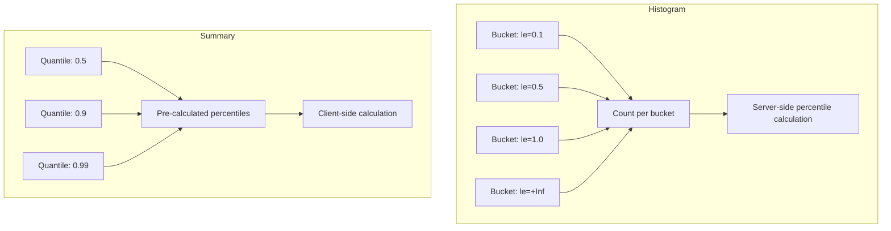

# How to Use Histograms and Summaries in Prometheus

Author: [nawazdhandala](https://www.github.com/nawazdhandala)

Tags: Prometheus, Histograms, Summaries, Metrics, Latency, PromQL, Observability

Description: Master Prometheus histograms and summaries for accurate latency measurement, including when to use each type, bucket configuration, and percentile calculations.

---

Measuring latency accurately requires understanding distributions, not just averages. Prometheus provides histograms and summaries for this purpose. This guide explains both metric types, when to use each, and how to query them effectively.

## Histograms vs Summaries



### Key Differences

| Feature | Histogram | Summary |
|---------|-----------|---------|
| Percentile calculation | Server-side (PromQL) | Client-side |
| Aggregation across instances | Yes | No (cannot aggregate quantiles) |
| Accuracy | Depends on bucket boundaries | Configurable error |
| Performance | Lower memory | Higher memory |
| Configuration | Define buckets | Define quantiles |

## When to Use Each

**Use Histograms when:**
- You need to aggregate across multiple instances
- Bucket boundaries can be defined in advance
- You want flexibility in percentile calculations
- You're using recording rules for percentiles

**Use Summaries when:**
- You only have a single instance
- You need exact percentiles
- You cannot define good bucket boundaries in advance
- Memory usage is not a concern

## Implementing Histograms

### Go Example

```go
package main

import (
    "net/http"
    "time"

    "github.com/prometheus/client_golang/prometheus"
    "github.com/prometheus/client_golang/prometheus/promhttp"
)

var httpDuration = prometheus.NewHistogramVec(
    prometheus.HistogramOpts{
        Name:    "http_request_duration_seconds",
        Help:    "HTTP request duration in seconds",
        Buckets: []float64{0.005, 0.01, 0.025, 0.05, 0.1, 0.25, 0.5, 1, 2.5, 5, 10},
    },
    []string{"method", "path", "status"},
)

func init() {
    prometheus.MustRegister(httpDuration)
}

func instrumentHandler(next http.Handler) http.Handler {
    return http.HandlerFunc(func(w http.ResponseWriter, r *http.Request) {
        start := time.Now()

        // Wrap response writer to capture status code
        wrapped := &responseWriter{ResponseWriter: w, statusCode: 200}
        next.ServeHTTP(wrapped, r)

        duration := time.Since(start).Seconds()
        httpDuration.WithLabelValues(
            r.Method,
            r.URL.Path,
            http.StatusText(wrapped.statusCode),
        ).Observe(duration)
    })
}

type responseWriter struct {
    http.ResponseWriter
    statusCode int
}

func (w *responseWriter) WriteHeader(code int) {
    w.statusCode = code
    w.ResponseWriter.WriteHeader(code)
}
```

### Python Example

```python
from prometheus_client import Histogram, start_http_server
import time
import random

# Define histogram with custom buckets
request_duration = Histogram(
    'http_request_duration_seconds',
    'HTTP request duration in seconds',
    ['method', 'endpoint', 'status'],
    buckets=[0.005, 0.01, 0.025, 0.05, 0.1, 0.25, 0.5, 1, 2.5, 5, 10]
)

# Using decorator
@request_duration.labels(method='GET', endpoint='/api/users', status='200').time()
def process_request():
    time.sleep(random.uniform(0.01, 0.5))

# Using context manager
def handle_request(method, endpoint):
    with request_duration.labels(method=method, endpoint=endpoint, status='200').time():
        # Process request
        time.sleep(random.uniform(0.01, 0.5))

# Manual observation
def manual_observe():
    start = time.time()
    # Do work
    time.sleep(random.uniform(0.01, 0.5))
    duration = time.time() - start
    request_duration.labels(method='POST', endpoint='/api/data', status='201').observe(duration)

if __name__ == '__main__':
    start_http_server(8000)
    while True:
        process_request()
        handle_request('GET', '/api/items')
        manual_observe()
```

### Node.js Example

```javascript
const client = require('prom-client');

const httpDuration = new client.Histogram({
    name: 'http_request_duration_seconds',
    help: 'HTTP request duration in seconds',
    labelNames: ['method', 'route', 'status_code'],
    buckets: [0.005, 0.01, 0.025, 0.05, 0.1, 0.25, 0.5, 1, 2.5, 5, 10]
});

// Express middleware
function metricsMiddleware(req, res, next) {
    const end = httpDuration.startTimer();

    res.on('finish', () => {
        end({
            method: req.method,
            route: req.route?.path || req.path,
            status_code: res.statusCode
        });
    });

    next();
}

// Expose metrics endpoint
app.get('/metrics', async (req, res) => {
    res.set('Content-Type', client.register.contentType);
    res.end(await client.register.metrics());
});
```

## Choosing Histogram Buckets

### For HTTP Latency (seconds)

```go
// Web applications
Buckets: []float64{0.005, 0.01, 0.025, 0.05, 0.1, 0.25, 0.5, 1, 2.5, 5, 10}

// APIs with strict SLOs
Buckets: []float64{0.001, 0.005, 0.01, 0.025, 0.05, 0.075, 0.1, 0.25, 0.5, 1}

// Background jobs
Buckets: []float64{0.1, 0.5, 1, 2.5, 5, 10, 30, 60, 120, 300}
```

### For Request/Response Size (bytes)

```go
Buckets: []float64{100, 1000, 10000, 100000, 1000000, 10000000}
```

### Using Exponential Buckets

```go
// prometheus.ExponentialBuckets(start, factor, count)
Buckets: prometheus.ExponentialBuckets(0.001, 2, 15)
// Results: 0.001, 0.002, 0.004, 0.008, 0.016, 0.032, 0.064, 0.128, 0.256, 0.512, 1.024, 2.048, 4.096, 8.192, 16.384
```

## Querying Histograms

### Calculate Percentiles

```promql
# P50 (median)
histogram_quantile(0.50, sum(rate(http_request_duration_seconds_bucket[5m])) by (le))

# P90
histogram_quantile(0.90, sum(rate(http_request_duration_seconds_bucket[5m])) by (le))

# P99
histogram_quantile(0.99, sum(rate(http_request_duration_seconds_bucket[5m])) by (le))

# P99 by service
histogram_quantile(0.99, sum(rate(http_request_duration_seconds_bucket[5m])) by (le, service))
```

### Calculate Average

```promql
# Average latency
sum(rate(http_request_duration_seconds_sum[5m]))
/
sum(rate(http_request_duration_seconds_count[5m]))

# Average by endpoint
sum(rate(http_request_duration_seconds_sum[5m])) by (endpoint)
/
sum(rate(http_request_duration_seconds_count[5m])) by (endpoint)
```

### Calculate Request Rate

```promql
# Total request rate
sum(rate(http_request_duration_seconds_count[5m]))

# Request rate by status
sum(rate(http_request_duration_seconds_count[5m])) by (status)
```

### Apdex Score

```promql
# Apdex with T=0.5s (satisfied < 0.5s, tolerating < 2s)
(
  sum(rate(http_request_duration_seconds_bucket{le="0.5"}[5m]))
  +
  sum(rate(http_request_duration_seconds_bucket{le="2"}[5m]))
  -
  sum(rate(http_request_duration_seconds_bucket{le="0.5"}[5m]))
) / 2
/
sum(rate(http_request_duration_seconds_count[5m]))
```

## Implementing Summaries

### Go Example

```go
var requestDuration = prometheus.NewSummaryVec(
    prometheus.SummaryOpts{
        Name:       "request_duration_seconds",
        Help:       "Request duration in seconds",
        Objectives: map[float64]float64{
            0.5:  0.05,   // 50th percentile with 5% error
            0.9:  0.01,   // 90th percentile with 1% error
            0.99: 0.001,  // 99th percentile with 0.1% error
        },
        MaxAge:     10 * time.Minute,
        AgeBuckets: 5,
    },
    []string{"method"},
)
```

### Python Example

```python
from prometheus_client import Summary

request_duration = Summary(
    'request_duration_seconds',
    'Request duration in seconds',
    ['method']
)

# Using decorator
@request_duration.labels(method='GET').time()
def process_request():
    # Do work
    pass
```

## Recording Rules for Histograms

Pre-compute percentiles for dashboard performance:

```yaml
groups:
  - name: histogram-recording-rules
    interval: 30s
    rules:
      # P50 latency by service
      - record: service:http_request_duration:p50_5m
        expr: |
          histogram_quantile(0.50,
            sum(rate(http_request_duration_seconds_bucket[5m])) by (le, service)
          )

      # P90 latency by service
      - record: service:http_request_duration:p90_5m
        expr: |
          histogram_quantile(0.90,
            sum(rate(http_request_duration_seconds_bucket[5m])) by (le, service)
          )

      # P99 latency by service
      - record: service:http_request_duration:p99_5m
        expr: |
          histogram_quantile(0.99,
            sum(rate(http_request_duration_seconds_bucket[5m])) by (le, service)
          )

      # Average latency by service
      - record: service:http_request_duration:avg_5m
        expr: |
          sum(rate(http_request_duration_seconds_sum[5m])) by (service)
          /
          sum(rate(http_request_duration_seconds_count[5m])) by (service)
```

## Alerting on Histograms

```yaml
groups:
  - name: latency-alerts
    rules:
      - alert: HighP99Latency
        expr: |
          histogram_quantile(0.99,
            sum(rate(http_request_duration_seconds_bucket[5m])) by (le, service)
          ) > 1
        for: 5m
        labels:
          severity: warning
        annotations:
          summary: "P99 latency above 1s for {{ $labels.service }}"

      - alert: HighP50Latency
        expr: |
          histogram_quantile(0.50,
            sum(rate(http_request_duration_seconds_bucket[5m])) by (le, service)
          ) > 0.5
        for: 10m
        labels:
          severity: warning
        annotations:
          summary: "Median latency above 500ms for {{ $labels.service }}"
```

## Best Practices

### 1. Choose Buckets Based on SLOs

```go
// If SLO is "99% of requests under 200ms"
Buckets: []float64{0.01, 0.025, 0.05, 0.1, 0.15, 0.2, 0.25, 0.5, 1}
```

### 2. Avoid Too Many Buckets

More buckets = more time series = more storage and query overhead.

```go
// Too many (cardinality explosion)
Buckets: prometheus.LinearBuckets(0.01, 0.01, 100)

// Reasonable
Buckets: []float64{0.01, 0.025, 0.05, 0.1, 0.25, 0.5, 1, 2.5, 5, 10}
```

### 3. Include +Inf Bucket

Always include the +Inf bucket (automatic in most client libraries):

```promql
# This query works because +Inf exists
histogram_quantile(0.99, sum(rate(my_histogram_bucket[5m])) by (le))
```

### 4. Use Native Histograms (Prometheus 2.40+)

```go
httpDuration := prometheus.NewHistogram(prometheus.HistogramOpts{
    Name:                        "http_request_duration_seconds",
    Help:                        "HTTP request duration",
    NativeHistogramBucketFactor: 1.1,
})
```

## Conclusion

Histograms and summaries provide essential insight into latency distributions. Use histograms for most cases due to their aggregation capabilities and flexibility. Define bucket boundaries based on your SLOs and expected latency ranges. Pre-compute percentiles with recording rules for dashboard performance. OneUptime automatically handles histogram data and provides SLO tracking out of the box.
