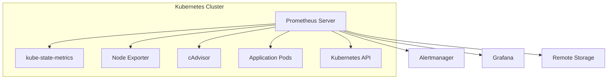

# How to Set Up Prometheus for Kubernetes Monitoring

Author: [nawazdhandala](https://www.github.com/nawazdhandala)

Tags: Prometheus, Kubernetes, Monitoring, Metrics, Observability, Cloud Native

Description: A complete guide to deploying Prometheus in Kubernetes for comprehensive cluster and application monitoring with practical configurations and best practices.

---

Prometheus has become the de facto standard for Kubernetes monitoring. Its pull-based architecture, powerful query language, and native Kubernetes integration make it ideal for cloud-native environments. This guide walks you through setting up Prometheus for comprehensive Kubernetes monitoring.

## Architecture Overview

Before diving into setup, understanding the architecture helps you make better configuration decisions.



Prometheus scrapes metrics from multiple sources:
- **kube-state-metrics**: Cluster state information (deployments, pods, nodes)
- **Node Exporter**: Host-level metrics (CPU, memory, disk, network)
- **cAdvisor**: Container metrics (built into kubelet)
- **Application Pods**: Custom application metrics

## Prerequisites

Ensure you have:
- A running Kubernetes cluster (v1.19+)
- kubectl configured with cluster access
- Helm 3 installed

## Method 1: Deploy Using Helm (Recommended)

The kube-prometheus-stack Helm chart provides a complete monitoring solution.

```bash
# Add the Prometheus community Helm repository
helm repo add prometheus-community https://prometheus-community.github.io/helm-charts
helm repo update

# Create monitoring namespace
kubectl create namespace monitoring

# Install the stack
helm install prometheus prometheus-community/kube-prometheus-stack \
  --namespace monitoring \
  --set prometheus.prometheusSpec.retention=15d \
  --set prometheus.prometheusSpec.storageSpec.volumeClaimTemplate.spec.resources.requests.storage=50Gi
```

This installs Prometheus, Alertmanager, Grafana, and various exporters with sensible defaults.

## Method 2: Manual Deployment

For more control, deploy Prometheus manually.

### Create the Namespace and RBAC

```yaml
# prometheus-rbac.yaml
apiVersion: v1
kind: Namespace
metadata:
  name: monitoring
---
apiVersion: v1
kind: ServiceAccount
metadata:
  name: prometheus
  namespace: monitoring
---
apiVersion: rbac.authorization.k8s.io/v1
kind: ClusterRole
metadata:
  name: prometheus
rules:
  - apiGroups: [""]
    resources:
      - nodes
      - nodes/proxy
      - services
      - endpoints
      - pods
    verbs: ["get", "list", "watch"]
  - apiGroups: ["extensions"]
    resources:
      - ingresses
    verbs: ["get", "list", "watch"]
  - nonResourceURLs: ["/metrics"]
    verbs: ["get"]
---
apiVersion: rbac.authorization.k8s.io/v1
kind: ClusterRoleBinding
metadata:
  name: prometheus
roleRef:
  apiGroup: rbac.authorization.k8s.io
  kind: ClusterRole
  name: prometheus
subjects:
  - kind: ServiceAccount
    name: prometheus
    namespace: monitoring
```

### Create the ConfigMap

```yaml
# prometheus-configmap.yaml
apiVersion: v1
kind: ConfigMap
metadata:
  name: prometheus-config
  namespace: monitoring
data:
  prometheus.yml: |
    global:
      scrape_interval: 15s
      evaluation_interval: 15s

    scrape_configs:
      # Scrape Prometheus itself
      - job_name: 'prometheus'
        static_configs:
          - targets: ['localhost:9090']

      # Kubernetes API servers
      - job_name: 'kubernetes-apiservers'
        kubernetes_sd_configs:
          - role: endpoints
        scheme: https
        tls_config:
          ca_file: /var/run/secrets/kubernetes.io/serviceaccount/ca.crt
        bearer_token_file: /var/run/secrets/kubernetes.io/serviceaccount/token
        relabel_configs:
          - source_labels: [__meta_kubernetes_namespace, __meta_kubernetes_service_name, __meta_kubernetes_endpoint_port_name]
            action: keep
            regex: default;kubernetes;https

      # Kubernetes nodes
      - job_name: 'kubernetes-nodes'
        kubernetes_sd_configs:
          - role: node
        scheme: https
        tls_config:
          ca_file: /var/run/secrets/kubernetes.io/serviceaccount/ca.crt
        bearer_token_file: /var/run/secrets/kubernetes.io/serviceaccount/token
        relabel_configs:
          - action: labelmap
            regex: __meta_kubernetes_node_label_(.+)

      # Kubernetes pods with prometheus.io annotations
      - job_name: 'kubernetes-pods'
        kubernetes_sd_configs:
          - role: pod
        relabel_configs:
          - source_labels: [__meta_kubernetes_pod_annotation_prometheus_io_scrape]
            action: keep
            regex: true
          - source_labels: [__meta_kubernetes_pod_annotation_prometheus_io_path]
            action: replace
            target_label: __metrics_path__
            regex: (.+)
          - source_labels: [__address__, __meta_kubernetes_pod_annotation_prometheus_io_port]
            action: replace
            regex: ([^:]+)(?::\d+)?;(\d+)
            replacement: $1:$2
            target_label: __address__
          - action: labelmap
            regex: __meta_kubernetes_pod_label_(.+)
          - source_labels: [__meta_kubernetes_namespace]
            action: replace
            target_label: kubernetes_namespace
          - source_labels: [__meta_kubernetes_pod_name]
            action: replace
            target_label: kubernetes_pod_name
```

### Deploy Prometheus

```yaml
# prometheus-deployment.yaml
apiVersion: apps/v1
kind: Deployment
metadata:
  name: prometheus
  namespace: monitoring
spec:
  replicas: 1
  selector:
    matchLabels:
      app: prometheus
  template:
    metadata:
      labels:
        app: prometheus
    spec:
      serviceAccountName: prometheus
      containers:
        - name: prometheus
          image: prom/prometheus:v2.47.0
          args:
            - '--config.file=/etc/prometheus/prometheus.yml'
            - '--storage.tsdb.path=/prometheus'
            - '--storage.tsdb.retention.time=15d'
            - '--web.enable-lifecycle'
          ports:
            - containerPort: 9090
          volumeMounts:
            - name: config
              mountPath: /etc/prometheus
            - name: storage
              mountPath: /prometheus
          resources:
            requests:
              memory: "512Mi"
              cpu: "250m"
            limits:
              memory: "2Gi"
              cpu: "1000m"
      volumes:
        - name: config
          configMap:
            name: prometheus-config
        - name: storage
          emptyDir: {}
---
apiVersion: v1
kind: Service
metadata:
  name: prometheus
  namespace: monitoring
spec:
  selector:
    app: prometheus
  ports:
    - port: 9090
      targetPort: 9090
  type: ClusterIP
```

Apply the configurations:

```bash
kubectl apply -f prometheus-rbac.yaml
kubectl apply -f prometheus-configmap.yaml
kubectl apply -f prometheus-deployment.yaml
```

## Configuring Application Scraping

To scrape metrics from your applications, add annotations to your pods:

```yaml
apiVersion: apps/v1
kind: Deployment
metadata:
  name: my-app
spec:
  template:
    metadata:
      annotations:
        prometheus.io/scrape: "true"
        prometheus.io/port: "8080"
        prometheus.io/path: "/metrics"
    spec:
      containers:
        - name: my-app
          image: my-app:latest
          ports:
            - containerPort: 8080
```

## Deploy kube-state-metrics

kube-state-metrics exposes Kubernetes object state as Prometheus metrics:

```bash
helm install kube-state-metrics prometheus-community/kube-state-metrics \
  --namespace monitoring
```

## Deploy Node Exporter

Node Exporter provides host-level metrics:

```bash
helm install node-exporter prometheus-community/prometheus-node-exporter \
  --namespace monitoring
```

## Essential Kubernetes Metrics

Once deployed, query these essential metrics:

```promql
# Node CPU usage percentage
100 - (avg by(instance) (rate(node_cpu_seconds_total{mode="idle"}[5m])) * 100)

# Node memory usage percentage
(1 - (node_memory_MemAvailable_bytes / node_memory_MemTotal_bytes)) * 100

# Pod restart count
kube_pod_container_status_restarts_total

# Container CPU usage
sum(rate(container_cpu_usage_seconds_total{container!=""}[5m])) by (namespace, pod)

# Container memory usage
sum(container_memory_working_set_bytes{container!=""}) by (namespace, pod)

# Deployment replica availability
kube_deployment_status_replicas_available / kube_deployment_spec_replicas
```

## Accessing Prometheus

Port-forward to access the Prometheus UI:

```bash
kubectl port-forward -n monitoring svc/prometheus 9090:9090
```

Open http://localhost:9090 in your browser.

## Best Practices

1. **Use Persistent Storage**: Configure PersistentVolumeClaims for data retention
2. **Set Resource Limits**: Prevent Prometheus from consuming excessive cluster resources
3. **Configure Retention**: Balance storage costs with data availability needs
4. **Use Recording Rules**: Pre-compute expensive queries
5. **Implement Alerting**: Connect to Alertmanager for notifications

## Conclusion

You now have Prometheus monitoring your Kubernetes cluster. This foundation enables you to track cluster health, application performance, and resource utilization. Consider integrating with Grafana for visualization and Alertmanager for notifications. For a unified observability platform that combines metrics with logs and traces, explore OneUptime's Kubernetes monitoring capabilities.
