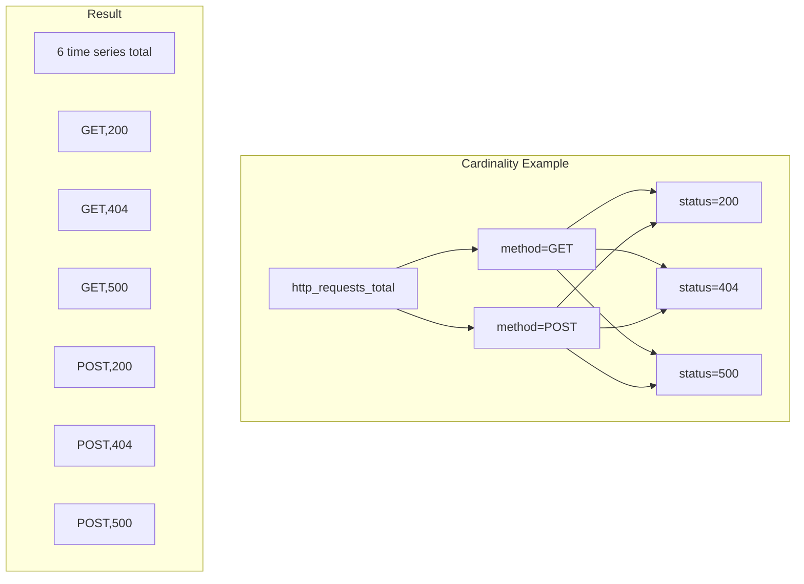

# How to Follow Label Best Practices in Prometheus

Author: [nawazdhandala](https://www.github.com/nawazdhandala)

Tags: Prometheus, Labels, Best Practices, Cardinality, Metrics, Data Modeling

Description: Learn Prometheus label best practices to create efficient, queryable metrics while avoiding cardinality explosions that degrade performance.

---

Labels are fundamental to Prometheus's data model, enabling powerful querying and aggregation. However, poor label design leads to cardinality explosions that consume resources and degrade performance. This guide covers label best practices for efficient Prometheus deployments.

## Understanding Labels and Cardinality



**Cardinality** = Product of all unique label value combinations

```
http_requests_total{method="GET", status="200"} - 1 time series
http_requests_total{method="GET", status="404"} - 1 time series
http_requests_total{method="POST", status="200"} - 1 time series
... and so on
```

## Label Naming Conventions

### Use Snake Case

```yaml
# Good
http_requests_total{service_name="api", deployment_env="production"}

# Bad
http_requests_total{serviceName="api", DeploymentEnv="production"}
```

### Be Descriptive but Concise

```yaml
# Good
container_memory_usage_bytes{namespace="production", pod="api-server-abc123"}

# Bad - too verbose
container_memory_usage_bytes{kubernetes_namespace_name="production", kubernetes_pod_object_name="api-server-abc123"}

# Bad - too cryptic
container_memory_usage_bytes{ns="p", p="a-a123"}
```

### Use Consistent Labels Across Metrics

```yaml
# Good - consistent labels
http_requests_total{service="api", method="GET"}
http_request_duration_seconds{service="api", method="GET"}
http_response_size_bytes{service="api", method="GET"}

# Bad - inconsistent labels
http_requests_total{svc="api", verb="GET"}
http_request_duration_seconds{service_name="api", method="GET"}
http_response_size_bytes{service="api", http_method="GET"}
```

## Avoiding Cardinality Explosions

### Never Use High-Cardinality Values

```yaml
# NEVER - unbounded cardinality
http_requests_total{user_id="12345", request_id="abc-123-def"}

# BETTER - bounded cardinality
http_requests_total{user_tier="premium", endpoint="/api/users"}
```

### Bad Label Examples

| Label | Problem | Alternative |
|-------|---------|-------------|
| `user_id` | Unbounded (millions of values) | `user_tier`, `user_type` |
| `request_id` | Unbounded | Remove entirely |
| `email` | PII + unbounded | `domain` if needed |
| `timestamp` | Changes every request | Use metric timestamp |
| `ip_address` | High cardinality + PII | `ip_range`, `region` |
| `url` with query params | Unbounded | Normalize to `path` |

### Normalize High-Cardinality Labels

```go
// Bad - every unique URL is a new time series
requests.WithLabelValues(r.URL.String()).Inc()

// Good - normalize to route pattern
route := normalizeRoute(r.URL.Path)  // "/users/{id}" not "/users/12345"
requests.WithLabelValues(route).Inc()

func normalizeRoute(path string) string {
    // Map /users/12345 to /users/{id}
    // Map /orders/abc123/items/456 to /orders/{id}/items/{id}
    re := regexp.MustCompile(`/[0-9a-f-]+`)
    return re.ReplaceAllString(path, "/{id}")
}
```

### Use Label Value Allowlists

```python
ALLOWED_ENDPOINTS = {'/api/users', '/api/orders', '/api/products', '/health'}

def track_request(endpoint):
    # Normalize unknown endpoints
    if endpoint not in ALLOWED_ENDPOINTS:
        endpoint = 'other'

    requests_total.labels(endpoint=endpoint).inc()
```

## Recommended Label Patterns

### Service Identification

```yaml
# Identify the service
http_requests_total{
  service="api-gateway",
  instance="10.0.0.1:8080",
  job="api-servers"
}
```

### Environment Labels

```yaml
# Add via external_labels in prometheus.yml
global:
  external_labels:
    cluster: production-us-east
    environment: production
    region: us-east-1
```

### Request Classification

```yaml
# Classify requests appropriately
http_requests_total{
  method="GET",           # HTTP method
  endpoint="/api/users",  # Normalized path
  status_code="200",      # HTTP status
  status_class="2xx"      # Status class for aggregation
}
```

### Error Classification

```yaml
# Classify errors for actionable alerts
errors_total{
  error_type="validation",    # validation, database, network, etc.
  error_code="INVALID_INPUT", # Specific error code
  service="user-service"
}
```

## Label Guidelines by Use Case

### Infrastructure Metrics

```yaml
# Good infrastructure labels
node_cpu_seconds_total{
  instance="node-1.example.com:9100",
  cpu="0",
  mode="idle"
}

node_memory_MemAvailable_bytes{
  instance="node-1.example.com:9100"
}

# Additional context via target labels
node_cpu_seconds_total{
  instance="node-1.example.com:9100",
  datacenter="dc1",
  rack="r1",
  node_type="compute"
}
```

### Application Metrics

```yaml
# Good application labels
http_request_duration_seconds{
  service="checkout",
  method="POST",
  endpoint="/api/checkout",
  status="200"
}

# Business context
orders_processed_total{
  service="checkout",
  payment_method="credit_card",  # bounded: credit_card, paypal, etc.
  status="completed"             # bounded: completed, failed, pending
}
```

### Kubernetes Metrics

```yaml
# Standard Kubernetes labels
container_cpu_usage_seconds_total{
  namespace="production",
  pod="api-server-5d4f6-abc12",
  container="api",
  node="node-1"
}

# With useful aggregation labels
kube_pod_info{
  namespace="production",
  pod="api-server-5d4f6-abc12",
  created_by_kind="ReplicaSet",
  created_by_name="api-server-5d4f6"
}
```

## Monitoring Cardinality

### Key Queries

```promql
# Total time series count
prometheus_tsdb_head_series

# Time series by job
count by (job) ({__name__=~".+"})

# Time series by metric name
topk(10, count by (__name__) ({__name__=~".+"}))

# High cardinality labels (find label with most values)
count(count by (some_label) (some_metric))
```

### Alert on Cardinality Issues

```yaml
groups:
  - name: cardinality-alerts
    rules:
      - alert: HighCardinalityMetric
        expr: |
          count by (__name__) ({__name__=~".+"}) > 10000
        for: 1h
        labels:
          severity: warning
        annotations:
          summary: "Metric {{ $labels.__name__ }} has high cardinality"
          description: "{{ $value }} time series for this metric"

      - alert: TotalSeriesHigh
        expr: prometheus_tsdb_head_series > 1000000
        for: 1h
        labels:
          severity: warning
        annotations:
          summary: "Total time series count exceeds 1M"

      - alert: SeriesChurnHigh
        expr: |
          rate(prometheus_tsdb_head_series_created_total[1h]) > 1000
        for: 30m
        labels:
          severity: warning
        annotations:
          summary: "High time series churn rate"
```

## Removing Bad Labels

### Using metric_relabel_configs

```yaml
scrape_configs:
  - job_name: 'my-app'
    static_configs:
      - targets: ['app:8080']
    metric_relabel_configs:
      # Drop specific high-cardinality labels
      - action: labeldrop
        regex: 'request_id|trace_id|span_id'

      # Keep only essential labels
      - action: labelkeep
        regex: 'job|instance|method|status|endpoint'

      # Replace high-cardinality values
      - source_labels: [user_id]
        regex: '.+'
        replacement: 'redacted'
        target_label: user_id
```

### Dropping Entire Metrics

```yaml
metric_relabel_configs:
  # Drop metrics with problematic labels
  - source_labels: [__name__, problematic_label]
    regex: 'my_metric;.+'
    action: drop
```

## Label Design Checklist

Before adding a label, ask:

1. **Is it bounded?** - Maximum number of unique values should be known and small
2. **Is it useful for aggregation?** - Can you write meaningful queries with it?
3. **Is it stable?** - Values should not change frequently for the same entity
4. **Is it consistent?** - Same label name and values across related metrics
5. **Is it necessary?** - Could you get the same insight without it?

## Example: Refactoring High-Cardinality Metrics

### Before (Bad)

```go
// Creates unbounded time series
requestDuration.WithLabelValues(
    userID,           // millions of users
    requestPath,      // includes query params
    responseCode,
    serverIP,
    timestamp,        // always unique
).Observe(duration)
```

### After (Good)

```go
// Bounded, useful time series
requestDuration.WithLabelValues(
    userTier,         // free, pro, enterprise
    normalizedPath,   // /users/{id}, /orders/{id}
    statusClass,      // 2xx, 4xx, 5xx
).Observe(duration)

// Separate counter for detailed status codes
requestCount.WithLabelValues(
    normalizedPath,
    strconv.Itoa(responseCode),
).Inc()
```

## Conclusion

Good label design is essential for efficient Prometheus deployments. Keep cardinality bounded, use consistent naming, and regularly monitor for cardinality growth. When in doubt, start with fewer labels - you can always add more, but removing labels from production metrics is harder. OneUptime automatically manages label cardinality and provides insights into label usage patterns across your metrics.
