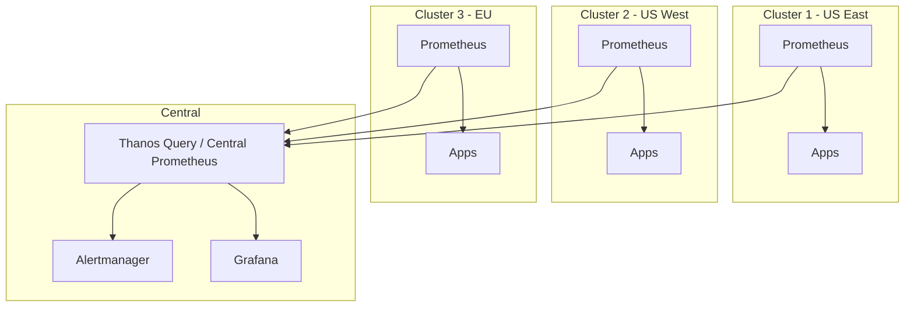

# How to Configure Multi-Cluster Prometheus

Author: [nawazdhandala](https://www.github.com/nawazdhandala)

Tags: Prometheus, Multi-Cluster, Kubernetes, Federation, Thanos, Global Monitoring

Description: Learn how to set up Prometheus monitoring across multiple Kubernetes clusters with centralized querying, alerting, and visualization strategies.

---

Modern infrastructure spans multiple Kubernetes clusters across regions, cloud providers, or environments. This guide covers architectures and configurations for unified Prometheus monitoring across clusters.

## Multi-Cluster Architecture Options



## Option 1: Thanos for Multi-Cluster

Thanos provides the most robust multi-cluster solution.

### Cluster-Level Prometheus with Sidecar

Deploy in each cluster:

```yaml
# prometheus-thanos.yaml
apiVersion: apps/v1
kind: StatefulSet
metadata:
  name: prometheus
  namespace: monitoring
spec:
  replicas: 2
  serviceName: prometheus
  selector:
    matchLabels:
      app: prometheus
  template:
    metadata:
      labels:
        app: prometheus
        thanos-store-api: "true"
    spec:
      serviceAccountName: prometheus
      containers:
        - name: prometheus
          image: prom/prometheus:v2.47.0
          args:
            - '--config.file=/etc/prometheus/prometheus.yml'
            - '--storage.tsdb.path=/prometheus'
            - '--storage.tsdb.retention.time=6h'
            - '--storage.tsdb.min-block-duration=2h'
            - '--storage.tsdb.max-block-duration=2h'
            - '--web.enable-lifecycle'
            - '--web.enable-admin-api'
          ports:
            - containerPort: 9090
          volumeMounts:
            - name: config
              mountPath: /etc/prometheus
            - name: storage
              mountPath: /prometheus

        - name: thanos-sidecar
          image: quay.io/thanos/thanos:v0.32.0
          args:
            - sidecar
            - '--prometheus.url=http://localhost:9090'
            - '--tsdb.path=/prometheus'
            - '--objstore.config-file=/etc/thanos/objstore.yml'
            - '--grpc-address=0.0.0.0:10901'
            - '--http-address=0.0.0.0:10902'
          ports:
            - containerPort: 10901
              name: grpc
            - containerPort: 10902
              name: http
          volumeMounts:
            - name: storage
              mountPath: /prometheus
            - name: thanos-config
              mountPath: /etc/thanos
      volumes:
        - name: config
          configMap:
            name: prometheus-config
        - name: thanos-config
          secret:
            secretName: thanos-objstore
  volumeClaimTemplates:
    - metadata:
        name: storage
      spec:
        accessModes: ["ReadWriteOnce"]
        resources:
          requests:
            storage: 20Gi
```

### Prometheus Configuration with Cluster Label

```yaml
# prometheus-config ConfigMap
apiVersion: v1
kind: ConfigMap
metadata:
  name: prometheus-config
  namespace: monitoring
data:
  prometheus.yml: |
    global:
      scrape_interval: 15s
      evaluation_interval: 15s
      external_labels:
        cluster: us-east-1
        region: us-east
        environment: production

    scrape_configs:
      - job_name: 'kubernetes-pods'
        kubernetes_sd_configs:
          - role: pod
        relabel_configs:
          - source_labels: [__meta_kubernetes_pod_annotation_prometheus_io_scrape]
            action: keep
            regex: true
          - source_labels: [__meta_kubernetes_namespace]
            target_label: namespace
          - source_labels: [__meta_kubernetes_pod_name]
            target_label: pod
```

### Thanos Query (Central)

Deploy in a central management cluster:

```yaml
apiVersion: apps/v1
kind: Deployment
metadata:
  name: thanos-query
  namespace: monitoring
spec:
  replicas: 3
  selector:
    matchLabels:
      app: thanos-query
  template:
    metadata:
      labels:
        app: thanos-query
    spec:
      containers:
        - name: thanos-query
          image: quay.io/thanos/thanos:v0.32.0
          args:
            - query
            - '--http-address=0.0.0.0:9090'
            - '--grpc-address=0.0.0.0:10901'
            - '--query.replica-label=replica'
            - '--query.replica-label=prometheus_replica'
            # Store endpoints from each cluster
            - '--store=thanos-sidecar-us-east.monitoring.svc:10901'
            - '--store=thanos-sidecar-us-west.monitoring.svc:10901'
            - '--store=thanos-sidecar-eu.monitoring.svc:10901'
            - '--store=thanos-store.monitoring.svc:10901'
          ports:
            - containerPort: 9090
              name: http
            - containerPort: 10901
              name: grpc
---
apiVersion: v1
kind: Service
metadata:
  name: thanos-query
  namespace: monitoring
spec:
  type: LoadBalancer
  selector:
    app: thanos-query
  ports:
    - port: 9090
      targetPort: 9090
```

### Cross-Cluster Store Discovery

For dynamic store discovery across clusters:

```yaml
# Using DNS service discovery
args:
  - query
  - '--store=dnssrv+_grpc._tcp.thanos-sidecar.monitoring.svc.cluster-us-east.local'
  - '--store=dnssrv+_grpc._tcp.thanos-sidecar.monitoring.svc.cluster-us-west.local'
  - '--store=dnssrv+_grpc._tcp.thanos-sidecar.monitoring.svc.cluster-eu.local'
```

## Option 2: Federation-Based Multi-Cluster

For simpler setups, use Prometheus federation.

### Cluster-Level Prometheus

Each cluster runs a standard Prometheus:

```yaml
# prometheus.yml
global:
  scrape_interval: 15s
  external_labels:
    cluster: us-east-1

scrape_configs:
  - job_name: 'kubernetes-pods'
    kubernetes_sd_configs:
      - role: pod
```

### Central Federated Prometheus

```yaml
# central-prometheus.yml
global:
  scrape_interval: 60s
  evaluation_interval: 60s

scrape_configs:
  # Federate from US East cluster
  - job_name: 'federate-us-east'
    honor_labels: true
    metrics_path: '/federate'
    params:
      'match[]':
        - '{__name__=~"job:.*"}'
        - '{__name__=~"cluster:.*"}'
        - 'up'
    static_configs:
      - targets:
          - 'prometheus.us-east.example.com:9090'
        labels:
          cluster: us-east-1

  # Federate from US West cluster
  - job_name: 'federate-us-west'
    honor_labels: true
    metrics_path: '/federate'
    params:
      'match[]':
        - '{__name__=~"job:.*"}'
        - '{__name__=~"cluster:.*"}'
        - 'up'
    static_configs:
      - targets:
          - 'prometheus.us-west.example.com:9090'
        labels:
          cluster: us-west-1

  # Federate from EU cluster
  - job_name: 'federate-eu'
    honor_labels: true
    metrics_path: '/federate'
    params:
      'match[]':
        - '{__name__=~"job:.*"}'
        - '{__name__=~"cluster:.*"}'
        - 'up'
    static_configs:
      - targets:
          - 'prometheus.eu.example.com:9090'
        labels:
          cluster: eu-central-1
```

### Recording Rules for Federation

On each cluster, create aggregated metrics for federation:

```yaml
# recording-rules.yml
groups:
  - name: cluster-aggregates
    rules:
      # Request rate by service
      - record: cluster:http_requests:rate5m
        expr: sum(rate(http_requests_total[5m])) by (service)

      # Error rate by service
      - record: cluster:http_errors:rate5m
        expr: sum(rate(http_requests_total{status=~"5.."}[5m])) by (service)

      # P99 latency by service
      - record: cluster:http_latency_p99:5m
        expr: |
          histogram_quantile(0.99,
            sum(rate(http_request_duration_seconds_bucket[5m])) by (le, service)
          )

      # Node count
      - record: cluster:nodes:count
        expr: count(up{job="node-exporter"})

      # Pod count by namespace
      - record: cluster:pods:count
        expr: count(kube_pod_info) by (namespace)
```

## Option 3: Remote Write to Central Storage

### Cluster Prometheus with Remote Write

```yaml
# prometheus.yml
global:
  scrape_interval: 15s
  external_labels:
    cluster: us-east-1
    region: us-east

remote_write:
  - url: "https://central-metrics.example.com/api/v1/write"
    basic_auth:
      username: prometheus
      password_file: /etc/prometheus/remote-write-password
    write_relabel_configs:
      # Only send aggregated metrics
      - source_labels: [__name__]
        regex: 'cluster:.*|job:.*|up'
        action: keep
    queue_config:
      max_samples_per_send: 1000
      max_shards: 50
```

### Central Cortex/Mimir

```yaml
# cortex-config.yml
multitenancy_enabled: true

distributor:
  ring:
    kvstore:
      store: consul
      consul:
        host: consul:8500

ingester:
  lifecycler:
    ring:
      kvstore:
        store: consul
        consul:
          host: consul:8500
      replication_factor: 3

storage:
  engine: blocks

blocks_storage:
  backend: s3
  s3:
    endpoint: s3.amazonaws.com
    bucket_name: metrics-storage
```

## Cross-Cluster Alerting

### Centralized Alertmanager

```yaml
# alertmanager-ha.yml
apiVersion: apps/v1
kind: StatefulSet
metadata:
  name: alertmanager
  namespace: monitoring
spec:
  replicas: 3
  serviceName: alertmanager
  selector:
    matchLabels:
      app: alertmanager
  template:
    spec:
      containers:
        - name: alertmanager
          image: prom/alertmanager:v0.26.0
          args:
            - '--config.file=/etc/alertmanager/alertmanager.yml'
            - '--storage.path=/alertmanager'
            - '--cluster.listen-address=0.0.0.0:9094'
            - '--cluster.peer=alertmanager-0.alertmanager:9094'
            - '--cluster.peer=alertmanager-1.alertmanager:9094'
            - '--cluster.peer=alertmanager-2.alertmanager:9094'
```

### Cluster-Aware Alert Rules

```yaml
# alerts.yml
groups:
  - name: cross-cluster-alerts
    rules:
      - alert: ClusterDown
        expr: |
          count(up{job="prometheus"}) by (cluster) == 0
        for: 5m
        labels:
          severity: critical
        annotations:
          summary: "Cluster {{ $labels.cluster }} appears down"

      - alert: CrossClusterLatencyHigh
        expr: |
          avg(cluster:http_latency_p99:5m) by (cluster) > 0.5
        for: 10m
        labels:
          severity: warning
        annotations:
          summary: "High latency in cluster {{ $labels.cluster }}"

      - alert: ClusterCapacityLow
        expr: |
          (
            sum(kube_node_status_allocatable{resource="cpu"}) by (cluster)
            -
            sum(kube_pod_container_resource_requests{resource="cpu"}) by (cluster)
          ) / sum(kube_node_status_allocatable{resource="cpu"}) by (cluster) < 0.2
        for: 30m
        labels:
          severity: warning
        annotations:
          summary: "Cluster {{ $labels.cluster }} has less than 20% CPU capacity"
```

## Grafana Multi-Cluster Dashboards

### Data Source Configuration

```yaml
# grafana-datasources.yml
apiVersion: 1
datasources:
  - name: Thanos
    type: prometheus
    url: http://thanos-query:9090
    access: proxy
    isDefault: true

  - name: US-East-Prometheus
    type: prometheus
    url: http://prometheus.us-east:9090
    access: proxy

  - name: US-West-Prometheus
    type: prometheus
    url: http://prometheus.us-west:9090
    access: proxy

  - name: EU-Prometheus
    type: prometheus
    url: http://prometheus.eu:9090
    access: proxy
```

### Multi-Cluster Dashboard Queries

```promql
# Total requests across all clusters
sum(rate(http_requests_total[5m]))

# Requests by cluster
sum by (cluster) (rate(http_requests_total[5m]))

# Compare latency across clusters
avg by (cluster) (histogram_quantile(0.99,
  sum by (le, cluster) (rate(http_request_duration_seconds_bucket[5m]))
))

# Cluster health overview
count by (cluster) (up == 1) / count by (cluster) (up)
```

## Network Considerations

### Cross-Cluster Connectivity

```yaml
# Using a service mesh (Istio)
apiVersion: networking.istio.io/v1beta1
kind: ServiceEntry
metadata:
  name: thanos-sidecar-us-west
spec:
  hosts:
    - thanos-sidecar.us-west.svc.cluster.local
  addresses:
    - 10.0.0.0/8
  ports:
    - number: 10901
      name: grpc
      protocol: GRPC
  resolution: DNS
  location: MESH_EXTERNAL
```

### Secure Cross-Cluster Communication

```yaml
# Thanos with TLS
args:
  - sidecar
  - '--grpc-server-tls-cert=/etc/tls/tls.crt'
  - '--grpc-server-tls-key=/etc/tls/tls.key'
  - '--grpc-server-tls-client-ca=/etc/tls/ca.crt'
```

## Best Practices

1. **Use external_labels**: Always add cluster identification
2. **Pre-aggregate metrics**: Reduce federation/remote-write volume
3. **Secure cross-cluster traffic**: Use TLS and authentication
4. **Monitor the monitors**: Alert on cross-cluster connectivity
5. **Plan for network partitions**: Each cluster should alert independently

## Conclusion

Multi-cluster Prometheus monitoring requires careful architecture decisions. Thanos provides the most complete solution for global queries and long-term storage. Federation works for simpler setups. Remote write to central storage offers a middle ground. Choose based on your scale, latency requirements, and operational complexity tolerance. OneUptime provides native multi-cluster support with automatic cluster discovery and unified dashboards out of the box.
