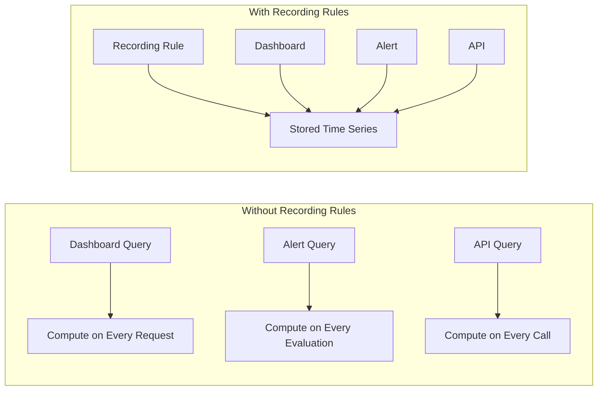

# How to Implement Recording Rules in Prometheus

Author: [nawazdhandala](https://www.github.com/nawazdhandala)

Tags: Prometheus, Recording Rules, PromQL, Performance, Metrics, Optimization

Description: Learn how to use Prometheus recording rules to pre-compute expensive queries, reduce dashboard load times, and prepare metrics for federation.

---

Recording rules allow Prometheus to pre-compute frequently used or computationally expensive PromQL expressions and save results as new time series. This guide shows you how to implement recording rules for better performance and cleaner queries.

## Why Use Recording Rules



Benefits include:
- **Performance**: Pre-compute expensive aggregations
- **Consistency**: Same calculation used everywhere
- **Federation**: Reduce data transferred between Prometheus servers
- **Simplicity**: Shorter queries in dashboards and alerts

## Basic Recording Rule Syntax

```yaml
# /etc/prometheus/rules/recording-rules.yml
groups:
  - name: example-recording-rules
    interval: 30s
    rules:
      - record: job:http_requests:rate5m
        expr: sum(rate(http_requests_total[5m])) by (job)
```

### Rule Components

- **record**: Name of the new metric (must follow naming conventions)
- **expr**: PromQL expression to evaluate
- **labels**: Optional additional labels
- **interval**: Optional evaluation interval (overrides group default)

## Naming Conventions

Follow the standard naming convention for clarity:

```
level:metric:operations
```

- **level**: Aggregation level (job, instance, cluster, namespace)
- **metric**: Base metric name
- **operations**: Operations performed (rate, ratio, sum)

### Examples

```yaml
rules:
  # Aggregated by job
  - record: job:http_requests_total:rate5m
    expr: sum(rate(http_requests_total[5m])) by (job)

  # Aggregated by instance
  - record: instance:node_cpu:avg_rate5m
    expr: avg(rate(node_cpu_seconds_total[5m])) by (instance)

  # Ratio calculation
  - record: instance:node_memory_utilization:ratio
    expr: 1 - (node_memory_MemAvailable_bytes / node_memory_MemTotal_bytes)

  # Histogram quantile
  - record: job:http_request_duration:p99_5m
    expr: histogram_quantile(0.99, sum(rate(http_request_duration_seconds_bucket[5m])) by (le, job))
```

## Common Recording Rule Patterns

### Request Rate Aggregations

```yaml
groups:
  - name: request-rate-rules
    rules:
      # Total request rate by service
      - record: service:http_requests:rate5m
        expr: sum(rate(http_requests_total[5m])) by (service)

      # Error rate by service
      - record: service:http_errors:rate5m
        expr: sum(rate(http_requests_total{status=~"5.."}[5m])) by (service)

      # Error ratio
      - record: service:http_error_ratio:rate5m
        expr: |
          service:http_errors:rate5m / service:http_requests:rate5m

      # Request rate by method and path (careful with cardinality)
      - record: service:http_requests_by_endpoint:rate5m
        expr: |
          sum(rate(http_requests_total[5m])) by (service, method, path)
```

### Latency Aggregations

```yaml
groups:
  - name: latency-rules
    rules:
      # P50 latency
      - record: service:http_latency:p50_5m
        expr: |
          histogram_quantile(0.50,
            sum(rate(http_request_duration_seconds_bucket[5m])) by (le, service)
          )

      # P90 latency
      - record: service:http_latency:p90_5m
        expr: |
          histogram_quantile(0.90,
            sum(rate(http_request_duration_seconds_bucket[5m])) by (le, service)
          )

      # P99 latency
      - record: service:http_latency:p99_5m
        expr: |
          histogram_quantile(0.99,
            sum(rate(http_request_duration_seconds_bucket[5m])) by (le, service)
          )

      # Average latency
      - record: service:http_latency:avg_5m
        expr: |
          sum(rate(http_request_duration_seconds_sum[5m])) by (service)
          /
          sum(rate(http_request_duration_seconds_count[5m])) by (service)
```

### Resource Utilization

```yaml
groups:
  - name: resource-rules
    rules:
      # CPU utilization by node
      - record: instance:node_cpu:utilization_avg5m
        expr: |
          100 - (avg by(instance) (rate(node_cpu_seconds_total{mode="idle"}[5m])) * 100)

      # Memory utilization by node
      - record: instance:node_memory:utilization_ratio
        expr: |
          1 - (node_memory_MemAvailable_bytes / node_memory_MemTotal_bytes)

      # Disk utilization
      - record: instance:node_disk:utilization_ratio
        expr: |
          1 - (node_filesystem_avail_bytes{fstype!~"tmpfs|overlay"}
               / node_filesystem_size_bytes{fstype!~"tmpfs|overlay"})

      # Network throughput
      - record: instance:node_network:receive_bytes_rate5m
        expr: sum(rate(node_network_receive_bytes_total[5m])) by (instance)

      - record: instance:node_network:transmit_bytes_rate5m
        expr: sum(rate(node_network_transmit_bytes_total[5m])) by (instance)
```

### Kubernetes Aggregations

```yaml
groups:
  - name: kubernetes-rules
    rules:
      # Pod CPU usage by namespace
      - record: namespace:container_cpu:usage_rate5m
        expr: |
          sum(rate(container_cpu_usage_seconds_total{container!=""}[5m])) by (namespace)

      # Pod memory usage by namespace
      - record: namespace:container_memory:working_set_bytes
        expr: |
          sum(container_memory_working_set_bytes{container!=""}) by (namespace)

      # Deployment availability ratio
      - record: namespace:deployment:availability_ratio
        expr: |
          kube_deployment_status_replicas_available
          /
          kube_deployment_spec_replicas

      # Pod restart rate
      - record: namespace:pod_restarts:rate1h
        expr: |
          sum(increase(kube_pod_container_status_restarts_total[1h])) by (namespace)
```

## Hierarchical Recording Rules

Build complex metrics from simpler recording rules:

```yaml
groups:
  - name: tier-1-rules
    interval: 15s
    rules:
      # Base aggregation
      - record: instance:http_requests:rate5m
        expr: sum(rate(http_requests_total[5m])) by (instance, job)

      - record: instance:http_errors:rate5m
        expr: sum(rate(http_requests_total{status=~"5.."}[5m])) by (instance, job)

  - name: tier-2-rules
    interval: 30s
    rules:
      # Aggregate from tier-1
      - record: job:http_requests:rate5m
        expr: sum(instance:http_requests:rate5m) by (job)

      - record: job:http_errors:rate5m
        expr: sum(instance:http_errors:rate5m) by (job)

      - record: job:http_error_ratio:rate5m
        expr: job:http_errors:rate5m / job:http_requests:rate5m

  - name: tier-3-rules
    interval: 60s
    rules:
      # Global aggregation
      - record: global:http_requests:rate5m
        expr: sum(job:http_requests:rate5m)

      - record: global:http_error_ratio:rate5m
        expr: sum(job:http_errors:rate5m) / sum(job:http_requests:rate5m)
```

## Recording Rules for Federation

Prepare metrics for efficient federation:

```yaml
groups:
  - name: federation-rules
    rules:
      # Pre-aggregate for federation
      - record: cluster:http_requests:rate5m
        expr: sum(rate(http_requests_total[5m]))
        labels:
          cluster: production-us-east

      - record: cluster:http_errors:rate5m
        expr: sum(rate(http_requests_total{status=~"5.."}[5m]))
        labels:
          cluster: production-us-east

      - record: cluster:node_cpu:avg_utilization
        expr: avg(100 - (avg by(instance) (rate(node_cpu_seconds_total{mode="idle"}[5m])) * 100))
        labels:
          cluster: production-us-east
```

Then federate only the cluster-level metrics:

```yaml
# On central Prometheus
scrape_configs:
  - job_name: 'federate'
    metrics_path: '/federate'
    params:
      'match[]':
        - '{__name__=~"cluster:.*"}'
```

## Performance Tuning

### Evaluation Intervals

```yaml
groups:
  # Frequently used metrics - shorter interval
  - name: hot-metrics
    interval: 15s
    rules:
      - record: service:http_requests:rate1m
        expr: sum(rate(http_requests_total[1m])) by (service)

  # Less time-sensitive metrics - longer interval
  - name: cold-metrics
    interval: 60s
    rules:
      - record: service:http_requests:rate1h
        expr: sum(rate(http_requests_total[1h])) by (service)
```

### Monitor Rule Evaluation

```promql
# Rule evaluation duration
prometheus_rule_group_duration_seconds

# Rule evaluation failures
prometheus_rule_evaluation_failures_total

# Rules loaded
prometheus_rule_group_rules
```

## Using Recording Rules in Alerts

Reference recording rules in alert expressions:

```yaml
groups:
  - name: recording-rules
    rules:
      - record: service:http_error_ratio:rate5m
        expr: |
          sum(rate(http_requests_total{status=~"5.."}[5m])) by (service)
          /
          sum(rate(http_requests_total[5m])) by (service)

  - name: alerts
    rules:
      - alert: HighErrorRate
        expr: service:http_error_ratio:rate5m > 0.05
        for: 5m
        labels:
          severity: critical
        annotations:
          summary: "Error rate above 5% for {{ $labels.service }}"
```

## Testing Recording Rules

```bash
# Validate syntax
promtool check rules /etc/prometheus/rules/*.yml

# Test with unit tests
promtool test rules test-recording-rules.yml
```

Example test file:

```yaml
# test-recording-rules.yml
rule_files:
  - /etc/prometheus/rules/recording-rules.yml

evaluation_interval: 1m

tests:
  - interval: 1m
    input_series:
      - series: 'http_requests_total{service="api",status="200"}'
        values: '0+100x10'
      - series: 'http_requests_total{service="api",status="500"}'
        values: '0+5x10'
    promql_expr_test:
      - expr: service:http_error_ratio:rate5m{service="api"}
        eval_time: 5m
        exp_samples:
          - labels: 'service:http_error_ratio:rate5m{service="api"}'
            value: 0.047619
```

## Best Practices

1. **Follow naming conventions**: Use `level:metric:operations` format
2. **Start broad, refine later**: Begin with job-level aggregations
3. **Monitor evaluation time**: Keep rules efficient
4. **Version control rules**: Track changes alongside code
5. **Document purpose**: Add comments explaining why rules exist

```yaml
groups:
  - name: documented-rules
    rules:
      # Used by: SRE dashboard, error budget alerts
      # Purpose: Track overall service health for SLO compliance
      - record: service:http_error_ratio:rate5m
        expr: |
          sum(rate(http_requests_total{status=~"5.."}[5m])) by (service)
          /
          sum(rate(http_requests_total[5m])) by (service)
```

## Conclusion

Recording rules transform Prometheus from a query engine into an efficient metrics processing pipeline. Use them to pre-compute expensive aggregations, prepare metrics for federation, and simplify dashboard and alert queries. Start with basic request rate and resource utilization rules, then expand based on your observability needs. OneUptime provides pre-built recording rules and intelligent metric aggregation out of the box.
