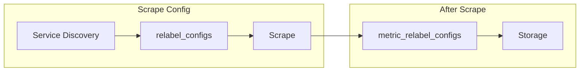

# How to Configure Relabeling in Prometheus

Author: [nawazdhandala](https://www.github.com/nawazdhandala)

Tags: Prometheus, Relabeling, Configuration, Service Discovery, Metrics, Labels

Description: Master Prometheus relabeling to transform labels, filter targets, and control metric ingestion with practical examples for common use cases.

---

Relabeling is one of Prometheus's most powerful features. It allows you to transform labels, filter targets, and modify metrics at various stages of the pipeline. This guide covers relabeling configurations for real-world scenarios.

## Relabeling Stages



- **relabel_configs**: Applied to targets discovered before scraping
- **metric_relabel_configs**: Applied to scraped metrics before storage

## Relabel Action Types

| Action | Purpose |
|--------|---------|
| replace | Replace label value using regex |
| keep | Keep targets matching regex |
| drop | Drop targets matching regex |
| hashmod | Set label to hash modulus |
| labelmap | Copy labels matching regex |
| labeldrop | Drop labels matching regex |
| labelkeep | Keep only labels matching regex |
| lowercase | Convert label value to lowercase |
| uppercase | Convert label value to uppercase |

## Basic Relabeling Examples

### Replace Action

Transform label values:

```yaml
relabel_configs:
  # Simple replacement
  - source_labels: [__meta_kubernetes_namespace]
    action: replace
    target_label: namespace

  # Regex replacement
  - source_labels: [__meta_kubernetes_pod_name]
    action: replace
    regex: '(.+)-[a-z0-9]+-[a-z0-9]+'
    replacement: '${1}'
    target_label: deployment

  # Combine multiple labels
  - source_labels: [__meta_kubernetes_namespace, __meta_kubernetes_pod_name]
    separator: '/'
    action: replace
    target_label: instance
```

### Keep Action

Filter targets:

```yaml
relabel_configs:
  # Keep only production namespace
  - source_labels: [__meta_kubernetes_namespace]
    action: keep
    regex: production

  # Keep pods with specific annotation
  - source_labels: [__meta_kubernetes_pod_annotation_prometheus_io_scrape]
    action: keep
    regex: 'true'

  # Keep multiple namespaces
  - source_labels: [__meta_kubernetes_namespace]
    action: keep
    regex: 'production|staging|development'
```

### Drop Action

Exclude targets:

```yaml
relabel_configs:
  # Drop test namespaces
  - source_labels: [__meta_kubernetes_namespace]
    action: drop
    regex: '.*-test'

  # Drop specific pods
  - source_labels: [__meta_kubernetes_pod_label_app]
    action: drop
    regex: 'debug-.*'

  # Drop unhealthy pods
  - source_labels: [__meta_kubernetes_pod_phase]
    action: drop
    regex: 'Pending|Failed|Succeeded'
```

### Labelmap Action

Copy metadata labels:

```yaml
relabel_configs:
  # Map all kubernetes labels
  - action: labelmap
    regex: __meta_kubernetes_pod_label_(.+)

  # Map with prefix
  - action: labelmap
    regex: __meta_kubernetes_node_label_(.+)
    replacement: node_${1}

  # Map specific labels
  - action: labelmap
    regex: __meta_kubernetes_service_label_(app|version|team)
```

## Kubernetes Relabeling Patterns

### Pod Discovery

```yaml
scrape_configs:
  - job_name: 'kubernetes-pods'
    kubernetes_sd_configs:
      - role: pod
    relabel_configs:
      # Only scrape pods with annotation
      - source_labels: [__meta_kubernetes_pod_annotation_prometheus_io_scrape]
        action: keep
        regex: true

      # Use custom path if specified
      - source_labels: [__meta_kubernetes_pod_annotation_prometheus_io_path]
        action: replace
        target_label: __metrics_path__
        regex: (.+)
        replacement: ${1}

      # Use custom port if specified
      - source_labels: [__address__, __meta_kubernetes_pod_annotation_prometheus_io_port]
        action: replace
        regex: ([^:]+)(?::\d+)?;(\d+)
        replacement: ${1}:${2}
        target_label: __address__

      # Use custom scheme if specified
      - source_labels: [__meta_kubernetes_pod_annotation_prometheus_io_scheme]
        action: replace
        target_label: __scheme__
        regex: (https?)

      # Add standard labels
      - source_labels: [__meta_kubernetes_namespace]
        action: replace
        target_label: namespace

      - source_labels: [__meta_kubernetes_pod_name]
        action: replace
        target_label: pod

      - source_labels: [__meta_kubernetes_pod_node_name]
        action: replace
        target_label: node

      # Extract deployment name
      - source_labels: [__meta_kubernetes_pod_controller_name]
        action: replace
        target_label: deployment

      # Map app labels
      - action: labelmap
        regex: __meta_kubernetes_pod_label_(app|version|team)
```

### Service Discovery

```yaml
scrape_configs:
  - job_name: 'kubernetes-services'
    kubernetes_sd_configs:
      - role: service
    relabel_configs:
      - source_labels: [__meta_kubernetes_service_annotation_prometheus_io_scrape]
        action: keep
        regex: true

      - source_labels: [__meta_kubernetes_service_annotation_prometheus_io_scheme]
        action: replace
        target_label: __scheme__
        regex: (https?)

      - source_labels: [__meta_kubernetes_service_annotation_prometheus_io_path]
        action: replace
        target_label: __metrics_path__
        regex: (.+)

      - source_labels: [__address__, __meta_kubernetes_service_annotation_prometheus_io_port]
        action: replace
        target_label: __address__
        regex: ([^:]+)(?::\d+)?;(\d+)
        replacement: ${1}:${2}

      - source_labels: [__meta_kubernetes_namespace]
        action: replace
        target_label: namespace

      - source_labels: [__meta_kubernetes_service_name]
        action: replace
        target_label: service
```

### Node Discovery

```yaml
scrape_configs:
  - job_name: 'kubernetes-nodes'
    kubernetes_sd_configs:
      - role: node
    relabel_configs:
      # Map node labels
      - action: labelmap
        regex: __meta_kubernetes_node_label_(.+)

      # Add instance label from node name
      - source_labels: [__meta_kubernetes_node_name]
        action: replace
        target_label: instance

      # Add region/zone from labels
      - source_labels: [__meta_kubernetes_node_label_topology_kubernetes_io_region]
        action: replace
        target_label: region

      - source_labels: [__meta_kubernetes_node_label_topology_kubernetes_io_zone]
        action: replace
        target_label: zone
```

## Metric Relabeling

Applied after scraping to filter or modify metrics:

```yaml
scrape_configs:
  - job_name: 'my-app'
    static_configs:
      - targets: ['app:8080']
    metric_relabel_configs:
      # Drop Go runtime metrics
      - source_labels: [__name__]
        action: drop
        regex: 'go_.*'

      # Drop high-cardinality metrics
      - source_labels: [__name__]
        action: drop
        regex: 'http_request_duration_seconds_bucket'

      # Rename metrics
      - source_labels: [__name__]
        action: replace
        regex: 'old_metric_name'
        replacement: 'new_metric_name'
        target_label: __name__

      # Drop specific label
      - action: labeldrop
        regex: 'pod_template_hash'

      # Keep only specific labels
      - action: labelkeep
        regex: 'job|instance|__name__|service|namespace'
```

## Advanced Patterns

### Hash-Based Sharding

Distribute scraping across multiple Prometheus instances:

```yaml
# Prometheus instance 0
relabel_configs:
  - source_labels: [__address__]
    modulus: 3
    target_label: __tmp_hash
    action: hashmod
  - source_labels: [__tmp_hash]
    action: keep
    regex: 0

# Prometheus instance 1
relabel_configs:
  - source_labels: [__address__]
    modulus: 3
    target_label: __tmp_hash
    action: hashmod
  - source_labels: [__tmp_hash]
    action: keep
    regex: 1

# Prometheus instance 2
relabel_configs:
  - source_labels: [__address__]
    modulus: 3
    target_label: __tmp_hash
    action: hashmod
  - source_labels: [__tmp_hash]
    action: keep
    regex: 2
```

### Environment-Based Configuration

```yaml
relabel_configs:
  # Add environment label based on namespace
  - source_labels: [__meta_kubernetes_namespace]
    action: replace
    regex: '(.*)-prod'
    replacement: 'production'
    target_label: environment

  - source_labels: [__meta_kubernetes_namespace]
    action: replace
    regex: '(.*)-staging'
    replacement: 'staging'
    target_label: environment

  - source_labels: [__meta_kubernetes_namespace]
    action: replace
    regex: '(.*)-dev'
    replacement: 'development'
    target_label: environment
```

### Dynamic Job Names

```yaml
relabel_configs:
  # Set job name from service label
  - source_labels: [__meta_kubernetes_service_label_app]
    action: replace
    target_label: job

  # Or from annotation
  - source_labels: [__meta_kubernetes_pod_annotation_prometheus_io_job]
    action: replace
    target_label: job
    regex: (.+)
```

### Remove High-Cardinality Labels

```yaml
metric_relabel_configs:
  # Drop UUID-based labels
  - action: labeldrop
    regex: 'request_id|trace_id|span_id'

  # Drop container hash
  - action: labeldrop
    regex: 'pod_template_hash|controller_revision_hash'

  # Keep only essential labels
  - action: labelkeep
    regex: 'job|instance|namespace|service|pod|container|__name__'
```

## Debugging Relabeling

### Check Discovered Targets

Access the Prometheus targets page:

```
http://prometheus:9090/targets
```

Or use the API:

```bash
curl http://prometheus:9090/api/v1/targets
```

### Check Label Values

```promql
# See all values for a label
count by (namespace) ({__name__=~".+"})

# Check if relabeling worked
{job="my-job"}
```

### Test Relabel Configurations

Use `promtool` for validation:

```bash
promtool check config prometheus.yml
```

## Best Practices

1. **Keep relabeling simple**: Complex regex can be hard to debug
2. **Document your relabeling**: Add comments explaining purpose
3. **Test before deploying**: Validate configuration changes
4. **Monitor cardinality**: Watch for label explosions
5. **Use labelkeep sparingly**: It can break queries expecting certain labels

```yaml
# Well-documented relabeling
relabel_configs:
  # Purpose: Only scrape pods with prometheus annotation
  # Required for: Opt-in scraping model
  - source_labels: [__meta_kubernetes_pod_annotation_prometheus_io_scrape]
    action: keep
    regex: true
```

## Conclusion

Relabeling gives you fine-grained control over what Prometheus scrapes and stores. Use relabel_configs to filter and transform targets during discovery, and metric_relabel_configs to modify metrics after scraping. Start simple and add complexity only when needed. OneUptime handles much of this complexity automatically while still allowing custom label transformations when required.
