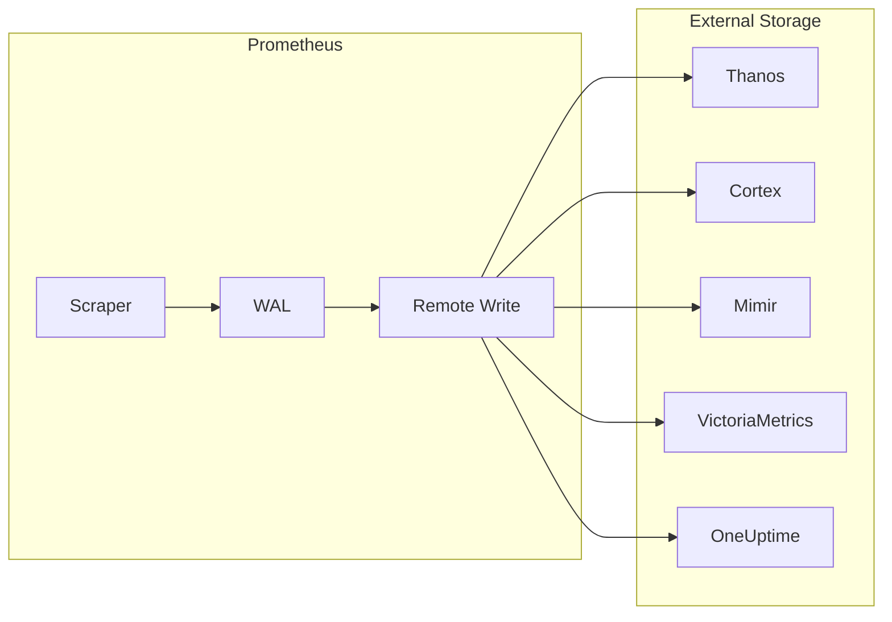

# How to Configure Remote Write in Prometheus

Author: [nawazdhandala](https://www.github.com/nawazdhandala)

Tags: Prometheus, Remote Write, Long-term Storage, Metrics, Thanos, Cortex, Observability

Description: Configure Prometheus remote write to send metrics to external storage systems for long-term retention, high availability, and global aggregation.

---

Prometheus local storage is designed for short-term data. Remote write enables sending metrics to external systems for long-term retention, cross-cluster aggregation, and high availability. This guide covers remote write configuration for various backends.

## Remote Write Architecture



## Basic Remote Write Configuration

```yaml
# prometheus.yml
global:
  scrape_interval: 15s

remote_write:
  - url: "http://remote-storage:9090/api/v1/write"
```

### Configuration Options

```yaml
remote_write:
  - url: "http://remote-storage:9090/api/v1/write"

    # Authentication
    basic_auth:
      username: prometheus
      password: secret

    # Or bearer token
    bearer_token: "your-token"

    # Or bearer token from file
    bearer_token_file: /var/run/secrets/token

    # TLS configuration
    tls_config:
      ca_file: /etc/prometheus/ca.crt
      cert_file: /etc/prometheus/client.crt
      key_file: /etc/prometheus/client.key
      insecure_skip_verify: false

    # Proxy configuration
    proxy_url: "http://proxy:8080"

    # Timeouts
    remote_timeout: 30s
```

## Queue Configuration

Tune the write queue for your workload:

```yaml
remote_write:
  - url: "http://remote-storage:9090/api/v1/write"
    queue_config:
      # Number of samples to buffer per shard
      capacity: 2500

      # Maximum number of shards
      max_shards: 200

      # Minimum number of shards
      min_shards: 1

      # Maximum samples per send
      max_samples_per_send: 500

      # Maximum time sample will wait in buffer
      batch_send_deadline: 5s

      # Initial retry delay
      min_backoff: 30ms

      # Maximum retry delay
      max_backoff: 5s
```

## Write Relabeling

Filter and transform metrics before sending:

```yaml
remote_write:
  - url: "http://remote-storage:9090/api/v1/write"
    write_relabel_configs:
      # Only send production metrics
      - source_labels: [env]
        regex: production
        action: keep

      # Drop high-cardinality metrics
      - source_labels: [__name__]
        regex: "go_.*"
        action: drop

      # Drop internal metrics
      - source_labels: [__name__]
        regex: "prometheus_.*"
        action: drop

      # Add external label
      - target_label: cluster
        replacement: production-us-east
```

## Backend-Specific Configurations

### Thanos Receive

```yaml
remote_write:
  - url: "http://thanos-receive:19291/api/v1/receive"
    queue_config:
      max_samples_per_send: 1000
      max_shards: 30
    write_relabel_configs:
      - target_label: cluster
        replacement: production
```

### Cortex / Mimir

```yaml
remote_write:
  - url: "http://cortex-distributor:8080/api/v1/push"
    headers:
      X-Scope-OrgID: tenant-1
    queue_config:
      capacity: 10000
      max_samples_per_send: 1000
      max_shards: 50
```

### VictoriaMetrics

```yaml
remote_write:
  - url: "http://victoriametrics:8428/api/v1/write"
    queue_config:
      max_samples_per_send: 10000
      capacity: 100000
```

### Grafana Cloud

```yaml
remote_write:
  - url: "https://prometheus-us-central1.grafana.net/api/prom/push"
    basic_auth:
      username: your-instance-id
      password_file: /etc/prometheus/grafana-cloud-api-key
    write_relabel_configs:
      - source_labels: [__name__]
        regex: "go_.*|prometheus_.*"
        action: drop
```

### AWS Managed Prometheus

```yaml
remote_write:
  - url: "https://aps-workspaces.us-east-1.amazonaws.com/workspaces/ws-xxx/api/v1/remote_write"
    sigv4:
      region: us-east-1
    queue_config:
      max_samples_per_send: 1000
      max_shards: 200
```

## Multiple Remote Write Endpoints

Send to multiple destinations:

```yaml
remote_write:
  # Primary storage
  - url: "http://thanos-receive:19291/api/v1/receive"
    name: thanos-primary
    queue_config:
      max_shards: 50

  # Backup storage
  - url: "http://backup-storage:9090/api/v1/write"
    name: backup
    queue_config:
      max_shards: 10
    write_relabel_configs:
      # Only send critical metrics to backup
      - source_labels: [__name__]
        regex: "up|http_requests_total|http_request_duration_seconds.*"
        action: keep

  # Analytics platform
  - url: "http://analytics:8080/ingest"
    name: analytics
    write_relabel_configs:
      # Only send aggregated metrics
      - source_labels: [__name__]
        regex: "job:.*|instance:.*"
        action: keep
```

## Monitoring Remote Write

### Key Metrics

```promql
# Samples pending in queue
prometheus_remote_storage_pending_samples

# Samples sent successfully
rate(prometheus_remote_storage_succeeded_samples_total[5m])

# Samples failed
rate(prometheus_remote_storage_failed_samples_total[5m])

# Samples dropped
rate(prometheus_remote_storage_dropped_samples_total[5m])

# Queue shards
prometheus_remote_storage_shards

# Bytes sent
rate(prometheus_remote_storage_sent_bytes_total[5m])

# Send latency
prometheus_remote_storage_sent_batch_duration_seconds
```

### Alert Rules for Remote Write

```yaml
groups:
  - name: remote-write-alerts
    rules:
      - alert: RemoteWriteFailing
        expr: |
          rate(prometheus_remote_storage_failed_samples_total[5m]) > 0
        for: 5m
        labels:
          severity: warning
        annotations:
          summary: "Remote write failing for {{ $labels.remote_name }}"

      - alert: RemoteWriteQueueBacklog
        expr: |
          prometheus_remote_storage_pending_samples > 10000
        for: 10m
        labels:
          severity: warning
        annotations:
          summary: "Remote write queue backing up"

      - alert: RemoteWriteHighLatency
        expr: |
          histogram_quantile(0.99,
            rate(prometheus_remote_storage_sent_batch_duration_seconds_bucket[5m])
          ) > 5
        for: 5m
        labels:
          severity: warning
        annotations:
          summary: "Remote write latency above 5s"
```

### Grafana Dashboard Queries

```promql
# Write throughput (samples/s)
sum(rate(prometheus_remote_storage_succeeded_samples_total[5m]))

# Error rate
sum(rate(prometheus_remote_storage_failed_samples_total[5m]))
/
sum(rate(prometheus_remote_storage_succeeded_samples_total[5m]))

# Queue utilization
prometheus_remote_storage_pending_samples
/
prometheus_remote_storage_samples_total

# Shard efficiency
prometheus_remote_storage_shards / prometheus_remote_storage_shards_max
```

## Performance Tuning

### High-Volume Environments

```yaml
remote_write:
  - url: "http://remote-storage:9090/api/v1/write"
    queue_config:
      capacity: 50000
      max_shards: 200
      max_samples_per_send: 2000
      batch_send_deadline: 10s
    write_relabel_configs:
      # Drop verbose metrics
      - source_labels: [__name__]
        regex: "go_.*|promhttp_.*"
        action: drop
```

### Low-Bandwidth Environments

```yaml
remote_write:
  - url: "http://remote-storage:9090/api/v1/write"
    queue_config:
      capacity: 5000
      max_shards: 10
      max_samples_per_send: 100
      batch_send_deadline: 30s
    write_relabel_configs:
      # Only essential metrics
      - source_labels: [__name__]
        regex: "up|http_requests_total|node_cpu_seconds_total|node_memory_.*"
        action: keep
```

## Handling Failures

### Retry Configuration

```yaml
remote_write:
  - url: "http://remote-storage:9090/api/v1/write"
    queue_config:
      min_backoff: 100ms
      max_backoff: 30s
      retry_on_http_429: true
```

### WAL-Based Buffering

Prometheus uses Write-Ahead Log (WAL) for buffering:

```yaml
# prometheus.yml
storage:
  tsdb:
    wal_compression: true
    out_of_order_time_window: 30m
```

## Security Best Practices

### Use TLS

```yaml
remote_write:
  - url: "https://remote-storage:9090/api/v1/write"
    tls_config:
      ca_file: /etc/prometheus/ca.crt
      cert_file: /etc/prometheus/client.crt
      key_file: /etc/prometheus/client.key
```

### Use Secret Management

```yaml
remote_write:
  - url: "https://remote-storage:9090/api/v1/write"
    basic_auth:
      username: prometheus
      password_file: /var/run/secrets/remote-write-password
```

### Kubernetes Secret

```yaml
apiVersion: v1
kind: Secret
metadata:
  name: prometheus-remote-write
type: Opaque
stringData:
  password: your-secure-password
---
apiVersion: apps/v1
kind: Deployment
metadata:
  name: prometheus
spec:
  template:
    spec:
      containers:
        - name: prometheus
          volumeMounts:
            - name: remote-write-secret
              mountPath: /var/run/secrets
      volumes:
        - name: remote-write-secret
          secret:
            secretName: prometheus-remote-write
```

## Conclusion

Remote write extends Prometheus beyond local storage limitations, enabling long-term retention, global views, and high availability. Choose your backend based on scale requirements and existing infrastructure. Monitor remote write performance to catch issues before they cause data loss. OneUptime provides native Prometheus remote write ingestion with intelligent retention and cross-cluster aggregation built in.
