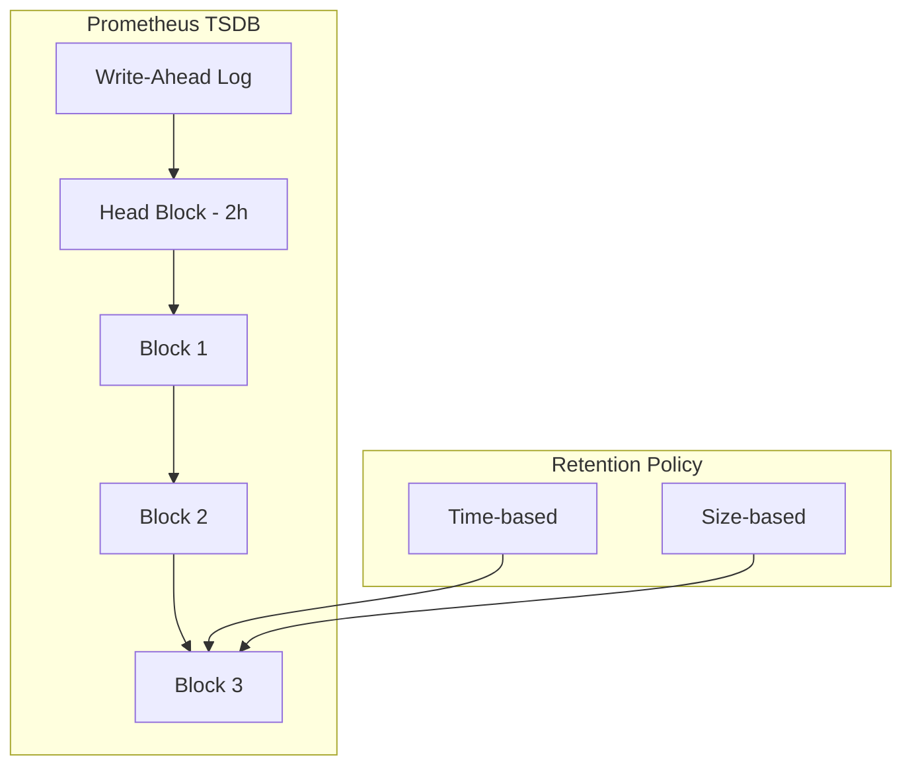

# How to Configure Retention Policies in Prometheus

Author: [nawazdhandala](https://www.github.com/nawazdhandala)

Tags: Prometheus, Retention, Storage, Data Management, TSDB, Monitoring

Description: Learn how to configure Prometheus retention policies to balance storage costs, query performance, and data availability for your monitoring needs.

---

Prometheus stores time series data locally, and without proper retention configuration, storage can grow unbounded. This guide covers retention settings, storage management, and strategies for long-term data preservation.

## Understanding Prometheus Storage



Key concepts:
- **WAL (Write-Ahead Log)**: Recent data, not yet compacted
- **Head Block**: Current 2-hour block being written
- **Blocks**: Compressed, immutable time series data
- **Retention**: Rules for when data gets deleted

## Basic Retention Configuration

### Time-Based Retention

```yaml
# prometheus.yml or command line args
# Keep data for 15 days
--storage.tsdb.retention.time=15d
```

Or in a configuration file:

```yaml
# Via Prometheus Operator
apiVersion: monitoring.coreos.com/v1
kind: Prometheus
metadata:
  name: prometheus
spec:
  retention: 15d
```

### Size-Based Retention

```yaml
# Keep up to 50GB of data
--storage.tsdb.retention.size=50GB
```

### Combined Retention

When both are specified, the first limit reached triggers deletion:

```bash
prometheus \
  --storage.tsdb.path=/prometheus \
  --storage.tsdb.retention.time=30d \
  --storage.tsdb.retention.size=100GB
```

## Kubernetes Deployment Configuration

```yaml
apiVersion: apps/v1
kind: StatefulSet
metadata:
  name: prometheus
  namespace: monitoring
spec:
  serviceName: prometheus
  replicas: 1
  selector:
    matchLabels:
      app: prometheus
  template:
    metadata:
      labels:
        app: prometheus
    spec:
      containers:
        - name: prometheus
          image: prom/prometheus:v2.47.0
          args:
            - '--config.file=/etc/prometheus/prometheus.yml'
            - '--storage.tsdb.path=/prometheus'
            - '--storage.tsdb.retention.time=15d'
            - '--storage.tsdb.retention.size=45GB'
            - '--storage.tsdb.wal-compression'
            - '--web.enable-lifecycle'
          ports:
            - containerPort: 9090
          volumeMounts:
            - name: prometheus-storage
              mountPath: /prometheus
          resources:
            requests:
              memory: "2Gi"
              cpu: "500m"
            limits:
              memory: "4Gi"
              cpu: "2000m"
  volumeClaimTemplates:
    - metadata:
        name: prometheus-storage
      spec:
        accessModes: ["ReadWriteOnce"]
        storageClassName: fast-ssd
        resources:
          requests:
            storage: 50Gi
```

## Calculating Storage Requirements

### Estimate Storage Usage

```promql
# Current storage size
prometheus_tsdb_storage_blocks_bytes

# WAL size
prometheus_tsdb_wal_storage_size_bytes

# Total samples stored
prometheus_tsdb_head_samples_appended_total

# Active time series
prometheus_tsdb_head_series
```

### Estimation Formula

```
Storage (bytes) = samples_per_second * bytes_per_sample * retention_seconds
```

Where:
- **samples_per_second**: `rate(prometheus_tsdb_head_samples_appended_total[5m])`
- **bytes_per_sample**: Approximately 1-2 bytes with compression
- **retention_seconds**: Your retention period in seconds

### Example Calculation

```python
# Example calculation
samples_per_second = 100000  # 100k samples/s
bytes_per_sample = 1.5       # Average with compression
retention_days = 15
retention_seconds = retention_days * 24 * 3600

storage_bytes = samples_per_second * bytes_per_sample * retention_seconds
storage_gb = storage_bytes / (1024 ** 3)

print(f"Estimated storage: {storage_gb:.2f} GB")
# Output: Estimated storage: 194.01 GB
```

## TSDB Configuration Options

### Block Duration

```bash
prometheus \
  --storage.tsdb.min-block-duration=2h \
  --storage.tsdb.max-block-duration=2h
```

Default behavior:
- Blocks start at 2 hours
- Compacted into larger blocks over time (up to 31 days)

For Thanos/long-term storage, keep fixed 2-hour blocks:

```bash
prometheus \
  --storage.tsdb.min-block-duration=2h \
  --storage.tsdb.max-block-duration=2h
```

### WAL Compression

Enable for 50%+ storage savings:

```bash
prometheus \
  --storage.tsdb.wal-compression
```

### Out-of-Order Samples

Allow ingesting samples slightly out of order:

```bash
prometheus \
  --storage.tsdb.out-of-order-time-window=30m
```

## Monitoring Storage Health

### Key Metrics to Watch

```yaml
groups:
  - name: storage-alerts
    rules:
      # Disk usage high
      - alert: PrometheusStorageHigh
        expr: |
          (prometheus_tsdb_storage_blocks_bytes + prometheus_tsdb_wal_storage_size_bytes)
          / prometheus_tsdb_retention_limit_bytes > 0.8
        for: 1h
        labels:
          severity: warning
        annotations:
          summary: "Prometheus storage usage above 80%"

      # Too many active series
      - alert: PrometheusTooManySeries
        expr: prometheus_tsdb_head_series > 2000000
        for: 1h
        labels:
          severity: warning
        annotations:
          summary: "Prometheus has too many active series"

      # Compaction failures
      - alert: PrometheusCompactionsFailing
        expr: increase(prometheus_tsdb_compactions_failed_total[1h]) > 0
        for: 0m
        labels:
          severity: critical
        annotations:
          summary: "Prometheus TSDB compactions failing"

      # WAL corruption
      - alert: PrometheusWALCorruption
        expr: increase(prometheus_tsdb_wal_corruptions_total[1h]) > 0
        for: 0m
        labels:
          severity: critical
        annotations:
          summary: "Prometheus WAL corruption detected"
```

### Grafana Dashboard Queries

```promql
# Storage used
prometheus_tsdb_storage_blocks_bytes + prometheus_tsdb_wal_storage_size_bytes

# Storage growth rate
rate(prometheus_tsdb_storage_blocks_bytes[1h])

# Time series count
prometheus_tsdb_head_series

# Chunk count
prometheus_tsdb_head_chunks

# Compaction duration
prometheus_tsdb_compaction_duration_seconds

# Samples ingested rate
rate(prometheus_tsdb_head_samples_appended_total[5m])
```

## Tiered Retention Strategy

Use different retention periods for different metric types:

### Using Recording Rules for Downsampling

```yaml
groups:
  - name: downsampling-rules
    interval: 5m
    rules:
      # 5-minute aggregates for long-term
      - record: job:http_requests:rate5m
        expr: sum(rate(http_requests_total[5m])) by (job)

      - record: job:http_latency_p99:5m
        expr: |
          histogram_quantile(0.99,
            sum(rate(http_request_duration_seconds_bucket[5m])) by (le, job)
          )

  - name: hourly-aggregates
    interval: 1h
    rules:
      # Hourly aggregates
      - record: job:http_requests:rate1h
        expr: sum(rate(http_requests_total[1h])) by (job)
```

### Federation for Tiered Storage

```yaml
# Short-term Prometheus (15 days raw data)
global:
  scrape_interval: 15s

remote_write:
  - url: http://long-term-prometheus:9090/api/v1/write

# Long-term Prometheus (1 year of aggregated data)
# Only scrapes recording rules from short-term
scrape_configs:
  - job_name: 'federate-aggregates'
    honor_labels: true
    metrics_path: '/federate'
    params:
      'match[]':
        - '{__name__=~"job:.*"}'
    static_configs:
      - targets: ['short-term-prometheus:9090']
```

## Long-Term Storage Solutions

### Thanos

```yaml
# prometheus with thanos sidecar
--storage.tsdb.retention.time=2h
--storage.tsdb.min-block-duration=2h
--storage.tsdb.max-block-duration=2h
```

Thanos provides:
- Unlimited retention in object storage
- Global query view
- Downsampling (5m, 1h aggregates)

### Remote Write to External Storage

```yaml
remote_write:
  - url: "http://cortex:9009/api/v1/push"
    queue_config:
      max_samples_per_send: 1000
      max_shards: 200
```

## Storage Management Best Practices

### 1. Start Conservative

```bash
# Start with shorter retention, increase if needed
--storage.tsdb.retention.time=7d
```

### 2. Monitor Growth

```promql
# Track storage growth weekly
increase(prometheus_tsdb_storage_blocks_bytes[7d])
```

### 3. Use Recording Rules

Pre-aggregate data you need long-term:

```yaml
# Keep detailed data short-term
# Keep aggregates long-term
rules:
  - record: namespace:container_cpu:usage_avg1h
    expr: avg(rate(container_cpu_usage_seconds_total[1h])) by (namespace)
```

### 4. Set Size Limits

Protect against unbounded growth:

```bash
--storage.tsdb.retention.size=100GB
```

### 5. Regular Compaction Monitoring

```promql
# Check compaction health
prometheus_tsdb_compaction_duration_seconds
prometheus_tsdb_compactions_total
prometheus_tsdb_compactions_failed_total
```

## Backup Strategies

### Snapshot API

```bash
# Create a snapshot
curl -X POST http://prometheus:9090/api/v1/admin/tsdb/snapshot

# Response includes snapshot name
# {"status":"success","data":{"name":"20231201T120000Z-abc123"}}

# Snapshots are in: <storage.tsdb.path>/snapshots/
```

### Automated Backup Script

```bash
#!/bin/bash
PROMETHEUS_URL="http://prometheus:9090"
BACKUP_DIR="/backups/prometheus"
DATE=$(date +%Y%m%d)

# Create snapshot
SNAPSHOT=$(curl -s -X POST "${PROMETHEUS_URL}/api/v1/admin/tsdb/snapshot" | jq -r '.data.name')

# Copy snapshot
cp -r "/prometheus/snapshots/${SNAPSHOT}" "${BACKUP_DIR}/${DATE}"

# Clean old backups (keep 7 days)
find ${BACKUP_DIR} -type d -mtime +7 -delete

# Remove snapshot from Prometheus
rm -rf "/prometheus/snapshots/${SNAPSHOT}"
```

## Conclusion

Effective retention configuration balances storage costs with data availability. Start with conservative retention periods, monitor storage usage, and implement tiered strategies for long-term data. Use recording rules to preserve aggregated data and consider external storage solutions for extended retention. OneUptime handles retention complexity automatically while providing flexible data retention policies.
