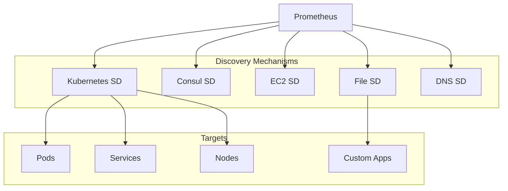

# How to Implement Service Discovery in Prometheus

Author: [nawazdhandala](https://www.github.com/nawazdhandala)

Tags: Prometheus, Service Discovery, Kubernetes, Monitoring, Dynamic Configuration, Cloud Native

Description: A comprehensive guide to configuring Prometheus service discovery for automatic target detection across Kubernetes, cloud providers, and custom solutions.

---

Static target configuration does not scale. Service discovery allows Prometheus to automatically find and monitor new targets as they appear. This guide covers the major service discovery mechanisms and how to configure them effectively.

## Service Discovery Overview

Prometheus supports multiple service discovery mechanisms:



## Kubernetes Service Discovery

Kubernetes SD is the most common for cloud-native deployments.

### Discovering Pods

```yaml
scrape_configs:
  - job_name: 'kubernetes-pods'
    kubernetes_sd_configs:
      - role: pod
    relabel_configs:
      # Only scrape pods with prometheus.io/scrape annotation
      - source_labels: [__meta_kubernetes_pod_annotation_prometheus_io_scrape]
        action: keep
        regex: true

      # Use custom metrics path if specified
      - source_labels: [__meta_kubernetes_pod_annotation_prometheus_io_path]
        action: replace
        target_label: __metrics_path__
        regex: (.+)

      # Use custom port if specified
      - source_labels: [__address__, __meta_kubernetes_pod_annotation_prometheus_io_port]
        action: replace
        regex: ([^:]+)(?::\d+)?;(\d+)
        replacement: $1:$2
        target_label: __address__

      # Add pod labels
      - action: labelmap
        regex: __meta_kubernetes_pod_label_(.+)

      # Add namespace label
      - source_labels: [__meta_kubernetes_namespace]
        action: replace
        target_label: namespace

      # Add pod name label
      - source_labels: [__meta_kubernetes_pod_name]
        action: replace
        target_label: pod
```

### Discovering Services

```yaml
scrape_configs:
  - job_name: 'kubernetes-services'
    kubernetes_sd_configs:
      - role: service
    relabel_configs:
      # Only scrape services with prometheus.io/scrape annotation
      - source_labels: [__meta_kubernetes_service_annotation_prometheus_io_scrape]
        action: keep
        regex: true

      # Use custom scheme if specified
      - source_labels: [__meta_kubernetes_service_annotation_prometheus_io_scheme]
        action: replace
        target_label: __scheme__
        regex: (https?)

      # Use custom path if specified
      - source_labels: [__meta_kubernetes_service_annotation_prometheus_io_path]
        action: replace
        target_label: __metrics_path__
        regex: (.+)

      # Use custom port if specified
      - source_labels: [__address__, __meta_kubernetes_service_annotation_prometheus_io_port]
        action: replace
        target_label: __address__
        regex: ([^:]+)(?::\d+)?;(\d+)
        replacement: $1:$2

      # Add service labels
      - action: labelmap
        regex: __meta_kubernetes_service_label_(.+)

      # Add namespace and service name
      - source_labels: [__meta_kubernetes_namespace]
        action: replace
        target_label: namespace
      - source_labels: [__meta_kubernetes_service_name]
        action: replace
        target_label: service
```

### Discovering Nodes

```yaml
scrape_configs:
  - job_name: 'kubernetes-nodes'
    kubernetes_sd_configs:
      - role: node
    scheme: https
    tls_config:
      ca_file: /var/run/secrets/kubernetes.io/serviceaccount/ca.crt
    bearer_token_file: /var/run/secrets/kubernetes.io/serviceaccount/token
    relabel_configs:
      # Map node labels
      - action: labelmap
        regex: __meta_kubernetes_node_label_(.+)
```

### Discovering Endpoints

```yaml
scrape_configs:
  - job_name: 'kubernetes-endpoints'
    kubernetes_sd_configs:
      - role: endpoints
    relabel_configs:
      - source_labels: [__meta_kubernetes_service_annotation_prometheus_io_scrape]
        action: keep
        regex: true
      - source_labels: [__meta_kubernetes_service_annotation_prometheus_io_port]
        action: keep
        regex: (\d+)
      - source_labels: [__address__, __meta_kubernetes_service_annotation_prometheus_io_port]
        action: replace
        target_label: __address__
        regex: ([^:]+)(?::\d+)?;(\d+)
        replacement: $1:$2
```

## File-Based Service Discovery

File SD is useful for custom integrations and hybrid environments.

### Configuration

```yaml
scrape_configs:
  - job_name: 'file-sd-targets'
    file_sd_configs:
      - files:
          - '/etc/prometheus/targets/*.json'
          - '/etc/prometheus/targets/*.yml'
        refresh_interval: 30s
```

### Target File Format (JSON)

```json
[
  {
    "targets": ["10.0.0.1:9100", "10.0.0.2:9100"],
    "labels": {
      "job": "node-exporter",
      "env": "production",
      "datacenter": "dc1"
    }
  },
  {
    "targets": ["10.0.1.1:8080", "10.0.1.2:8080"],
    "labels": {
      "job": "api-server",
      "env": "production",
      "team": "platform"
    }
  }
]
```

### Target File Format (YAML)

```yaml
- targets:
    - 10.0.0.1:9100
    - 10.0.0.2:9100
  labels:
    job: node-exporter
    env: production
    datacenter: dc1

- targets:
    - 10.0.1.1:8080
    - 10.0.1.2:8080
  labels:
    job: api-server
    env: production
    team: platform
```

### Dynamic Target Generation Script

```python
#!/usr/bin/env python3
import json
import requests
import time

def fetch_targets():
    # Your custom logic to discover targets
    # Example: query a CMDB or cloud API
    targets = []

    # Fetch from internal service registry
    response = requests.get('http://service-registry/api/services')
    services = response.json()

    for service in services:
        targets.append({
            'targets': [f"{host}:{service['port']}" for host in service['hosts']],
            'labels': {
                'job': service['name'],
                'env': service['environment'],
                'team': service['team']
            }
        })

    return targets

def write_targets(targets, path):
    with open(path, 'w') as f:
        json.dump(targets, f, indent=2)

if __name__ == '__main__':
    while True:
        targets = fetch_targets()
        write_targets(targets, '/etc/prometheus/targets/custom.json')
        time.sleep(60)
```

## Consul Service Discovery

For environments using Consul for service registration:

```yaml
scrape_configs:
  - job_name: 'consul-services'
    consul_sd_configs:
      - server: 'consul.example.com:8500'
        services: []  # Empty means all services
        tags:
          - 'prometheus'
    relabel_configs:
      - source_labels: [__meta_consul_service]
        target_label: service
      - source_labels: [__meta_consul_dc]
        target_label: datacenter
      - source_labels: [__meta_consul_tags]
        target_label: tags
```

### Filtering Consul Services

```yaml
scrape_configs:
  - job_name: 'consul-api-services'
    consul_sd_configs:
      - server: 'consul.example.com:8500'
        services:
          - 'api-gateway'
          - 'user-service'
          - 'order-service'
    relabel_configs:
      - source_labels: [__meta_consul_service_metadata_metrics_path]
        action: replace
        target_label: __metrics_path__
        regex: (.+)
```

## AWS EC2 Service Discovery

For AWS environments:

```yaml
scrape_configs:
  - job_name: 'ec2-instances'
    ec2_sd_configs:
      - region: us-east-1
        access_key: YOUR_ACCESS_KEY
        secret_key: YOUR_SECRET_KEY
        port: 9100
        filters:
          - name: tag:Environment
            values:
              - production
          - name: instance-state-name
            values:
              - running
    relabel_configs:
      - source_labels: [__meta_ec2_tag_Name]
        target_label: instance_name
      - source_labels: [__meta_ec2_instance_type]
        target_label: instance_type
      - source_labels: [__meta_ec2_availability_zone]
        target_label: availability_zone
      - source_labels: [__meta_ec2_private_ip]
        target_label: private_ip
```

## DNS Service Discovery

For environments with DNS-based service registration:

```yaml
scrape_configs:
  - job_name: 'dns-srv'
    dns_sd_configs:
      - names:
          - '_prometheus._tcp.api.example.com'
          - '_prometheus._tcp.web.example.com'
        type: SRV
        refresh_interval: 30s

  - job_name: 'dns-a'
    dns_sd_configs:
      - names:
          - 'api.example.com'
        type: A
        port: 9090
```

## Relabeling Deep Dive

Relabeling transforms labels during service discovery.

### Common Relabel Actions

```yaml
relabel_configs:
  # Keep targets matching regex
  - source_labels: [__meta_kubernetes_namespace]
    action: keep
    regex: production|staging

  # Drop targets matching regex
  - source_labels: [__meta_kubernetes_pod_phase]
    action: drop
    regex: Pending|Succeeded|Failed

  # Replace label value
  - source_labels: [__meta_kubernetes_namespace]
    action: replace
    target_label: namespace

  # Map multiple source labels to target
  - source_labels: [__meta_kubernetes_namespace, __meta_kubernetes_pod_name]
    separator: /
    action: replace
    target_label: instance

  # Lowercase label value
  - source_labels: [__meta_kubernetes_service_name]
    action: lowercase
    target_label: service

  # Hash for load distribution
  - source_labels: [__address__]
    modulus: 4
    target_label: __tmp_hash
    action: hashmod
```

### Metric Relabeling

Applied after scraping:

```yaml
scrape_configs:
  - job_name: 'my-app'
    static_configs:
      - targets: ['app:8080']
    metric_relabel_configs:
      # Drop high cardinality metrics
      - source_labels: [__name__]
        regex: 'go_.*'
        action: drop

      # Rename metrics
      - source_labels: [__name__]
        regex: 'http_request_duration_seconds_(.*)'
        target_label: __name__
        replacement: 'app_latency_${1}'
```

## Best Practices

1. **Use Annotations**: Let teams control scraping via pod/service annotations
2. **Limit Discovery Scope**: Use namespace filters to reduce API load
3. **Add Identifying Labels**: Include namespace, service, and team labels
4. **Handle Missing Annotations**: Set sensible defaults for path and port
5. **Monitor Discovery**: Track `prometheus_sd_discovered_targets`

```promql
# Monitor discovered targets
prometheus_sd_discovered_targets

# Monitor scrape failures
up == 0
```

## Conclusion

Service discovery eliminates manual target management and ensures Prometheus automatically monitors new services. Kubernetes SD handles most cloud-native needs, while file SD provides flexibility for custom integrations. Combine multiple discovery mechanisms as needed for hybrid environments. OneUptime extends these capabilities with automatic service discovery across your entire infrastructure.
