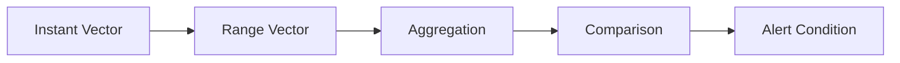

# How to Write PromQL Queries for Alerting

Author: [nawazdhandala](https://www.github.com/nawazdhandala)

Tags: Prometheus, PromQL, Alerting, Monitoring, Metrics, Observability

Description: Master PromQL query patterns for creating effective alerts that catch real issues without generating noise, including practical examples for common scenarios.

---

Writing effective alerting queries in PromQL requires balancing sensitivity with specificity. Alerts that trigger too often cause fatigue; alerts that miss issues cause outages. This guide teaches you to write PromQL queries that catch real problems.

## Understanding PromQL Basics for Alerting

Before writing alerts, understand these PromQL fundamentals:



### Instant vs Range Vectors

```promql
# Instant vector - current value
http_requests_total

# Range vector - values over time (required for rate calculations)
http_requests_total[5m]
```

### Rate and Increase Functions

```promql
# Rate: per-second average rate of increase
rate(http_requests_total[5m])

# Increase: total increase over time period
increase(http_requests_total[1h])
```

## Alert Query Patterns

### Pattern 1: Threshold Alerts

The simplest pattern compares a metric against a static threshold:

```yaml
groups:
  - name: basic-alerts
    rules:
      - alert: HighCPUUsage
        expr: 100 - (avg by(instance) (rate(node_cpu_seconds_total{mode="idle"}[5m])) * 100) > 80
        for: 5m
        labels:
          severity: warning
        annotations:
          summary: "High CPU usage on {{ $labels.instance }}"
          description: "CPU usage is {{ printf \"%.2f\" $value }}%"
```

Key elements:
- `expr`: The PromQL query that returns a value
- `for`: How long the condition must be true before firing
- `labels`: Additional labels for routing
- `annotations`: Human-readable information

### Pattern 2: Rate-Based Alerts

Monitor the rate of change rather than absolute values:

```yaml
- alert: HighErrorRate
  expr: |
    sum(rate(http_requests_total{status=~"5.."}[5m])) by (service)
    /
    sum(rate(http_requests_total[5m])) by (service)
    > 0.05
  for: 2m
  labels:
    severity: critical
  annotations:
    summary: "High error rate for {{ $labels.service }}"
    description: "Error rate is {{ printf \"%.2f\" $value | mul 100 }}%"
```

### Pattern 3: Absence Detection

Alert when expected metrics are missing:

```yaml
- alert: TargetDown
  expr: up == 0
  for: 1m
  labels:
    severity: critical
  annotations:
    summary: "Target {{ $labels.instance }} is down"

- alert: MetricAbsent
  expr: absent(http_requests_total{job="api-server"})
  for: 5m
  labels:
    severity: warning
  annotations:
    summary: "API server metrics missing"
```

### Pattern 4: Predictive Alerts

Alert before problems occur using prediction:

```yaml
- alert: DiskWillFillIn4Hours
  expr: |
    predict_linear(node_filesystem_free_bytes{fstype!="tmpfs"}[1h], 4 * 3600) < 0
  for: 30m
  labels:
    severity: warning
  annotations:
    summary: "Disk {{ $labels.device }} on {{ $labels.instance }} will fill within 4 hours"
```

### Pattern 5: Percentile-Based Alerts

Use histograms for latency alerts:

```yaml
- alert: HighLatencyP99
  expr: |
    histogram_quantile(0.99,
      sum(rate(http_request_duration_seconds_bucket[5m])) by (le, service)
    ) > 0.5
  for: 5m
  labels:
    severity: warning
  annotations:
    summary: "High P99 latency for {{ $labels.service }}"
    description: "P99 latency is {{ printf \"%.3f\" $value }}s"
```

## Common Alerting Scenarios

### Application Health

```yaml
# High request latency
- alert: HighRequestLatency
  expr: |
    (
      sum(rate(http_request_duration_seconds_sum[5m])) by (service)
      /
      sum(rate(http_request_duration_seconds_count[5m])) by (service)
    ) > 0.3
  for: 5m

# Pod restart loop
- alert: PodRestartLoop
  expr: increase(kube_pod_container_status_restarts_total[1h]) > 5
  for: 0m
  labels:
    severity: warning

# Container OOMKilled
- alert: ContainerOOMKilled
  expr: kube_pod_container_status_last_terminated_reason{reason="OOMKilled"} == 1
  for: 0m
  labels:
    severity: critical
```

### Infrastructure Health

```yaml
# Node memory pressure
- alert: NodeMemoryPressure
  expr: |
    (1 - (node_memory_MemAvailable_bytes / node_memory_MemTotal_bytes)) * 100 > 90
  for: 5m
  labels:
    severity: critical

# Disk I/O saturation
- alert: HighDiskIOUtilization
  expr: |
    rate(node_disk_io_time_seconds_total[5m]) > 0.9
  for: 10m
  labels:
    severity: warning

# Network packet drops
- alert: NetworkPacketDrops
  expr: |
    rate(node_network_receive_drop_total[5m]) > 100
    or
    rate(node_network_transmit_drop_total[5m]) > 100
  for: 5m
  labels:
    severity: warning
```

### Kubernetes-Specific Alerts

```yaml
# Deployment replicas unavailable
- alert: DeploymentReplicasUnavailable
  expr: |
    kube_deployment_status_replicas_available
    <
    kube_deployment_spec_replicas
  for: 10m
  labels:
    severity: warning

# PersistentVolume nearly full
- alert: PersistentVolumeNearlyFull
  expr: |
    kubelet_volume_stats_used_bytes
    /
    kubelet_volume_stats_capacity_bytes
    > 0.85
  for: 5m
  labels:
    severity: warning

# Job failed
- alert: KubernetesJobFailed
  expr: kube_job_status_failed > 0
  for: 0m
  labels:
    severity: warning
```

## Alert Query Best Practices

### Use Appropriate Time Windows

```promql
# Too short - noisy
rate(http_requests_total[1m])

# Better - smooths out spikes
rate(http_requests_total[5m])

# For very stable metrics
rate(http_requests_total[15m])
```

### Combine Multiple Conditions

```yaml
- alert: ServiceDegraded
  expr: |
    (
      sum(rate(http_requests_total{status=~"5.."}[5m])) by (service)
      /
      sum(rate(http_requests_total[5m])) by (service)
      > 0.01
    )
    and
    (
      sum(rate(http_requests_total[5m])) by (service) > 10
    )
  for: 5m
```

This alert only fires when:
1. Error rate exceeds 1%
2. AND there is meaningful traffic (>10 req/s)

### Use Recording Rules for Complex Queries

Pre-compute expensive queries:

```yaml
groups:
  - name: recording-rules
    rules:
      - record: job:http_requests:rate5m
        expr: sum(rate(http_requests_total[5m])) by (job)

      - record: job:http_errors:rate5m
        expr: sum(rate(http_requests_total{status=~"5.."}[5m])) by (job)

  - name: alerts
    rules:
      - alert: HighErrorRate
        expr: job:http_errors:rate5m / job:http_requests:rate5m > 0.05
        for: 5m
```

### Test Queries Before Deploying

Use the Prometheus UI to test:

```promql
# Test that your query returns expected results
sum(rate(http_requests_total{status=~"5.."}[5m])) by (service)

# Verify the comparison works
sum(rate(http_requests_total{status=~"5.."}[5m])) by (service) > 0
```

## Avoiding Alert Fatigue

1. **Set appropriate `for` durations**: Require conditions to persist
2. **Use severity levels**: Route critical vs warning differently
3. **Group related alerts**: Reduce notification volume
4. **Include runbook links**: Help responders act quickly

```yaml
- alert: HighMemoryUsage
  expr: container_memory_usage_bytes / container_spec_memory_limit_bytes > 0.9
  for: 10m
  labels:
    severity: warning
    runbook: "https://wiki.example.com/runbooks/high-memory"
  annotations:
    summary: "Container {{ $labels.container }} memory usage above 90%"
```

## Conclusion

Effective PromQL alerting queries balance catching real issues with avoiding noise. Start with simple threshold alerts, then evolve to rate-based and predictive patterns as you understand your system's behavior. Always test queries in the Prometheus UI before deploying, and iterate based on alert quality. For comprehensive alerting across metrics, logs, and traces, OneUptime provides unified alert management with intelligent noise reduction.
