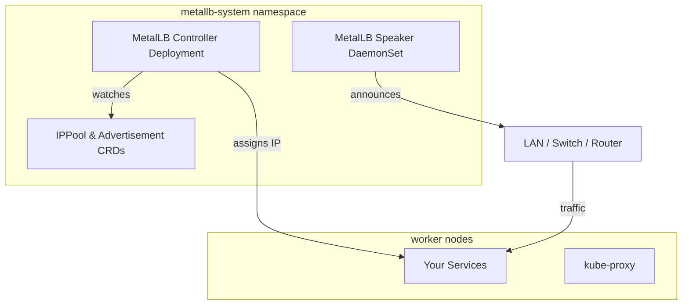

# How to Install MetalLB with Helm on Bare-Metal Kubernetes (and Actually Use It)

Author: [nawazdhandala](https://www.github.com/nawazdhandala)

Tags: Kubernetes, Bare Metal, Helm, Networking, MetalLB, DevOps

Description: A hands-on playbook for installing MetalLB via Helm, carving out safe IP pools on bare-metal networks, and proving it works by exposing real services with both Layer 2 and BGP announcements.

> Bare-metal clusters do not magically grow load balancers- MetalLB is the missing control plane that turns your own subnets into cloud-style `LoadBalancer` services.

## Why MetalLB is table stakes for bare metal

1. **Cloud parity** – Your manifests already define `type: LoadBalancer`. Without MetalLB they just hang in `pending` forever.
2. **Network control** – You pick the exact IP ranges MetalLB can hand out, so there are no accidental conflicts with DHCP or routers.
3. **Flexible advertising** – Start with simple Layer 2 ARP/NDP broadcasts, or announce via BGP when you need routed prefixes.
4. **Helm-first operations** – CRDs, controller, speaker DaemonSet, and future upgrades all live in one release that your platform team can audit.

## Reference architecture



## Prerequisites

- Kubernetes 1.22+ on bare metal with working `kubectl` context.
- Cluster networking that allows ARP/NDP or BGP to your upstream router.
- A dedicated IPv4/IPv6 range that is **not** handed out by DHCP.
- Helm 3.11+ (anything that supports chart dependencies and OCI pull).

## Step 1: Reserve an address pool

| Network question | Answer you need before touching Helm |
| --- | --- |
| Which subnet can MetalLB use? | e.g. `10.20.30.0/24`, reserve `.220-.239` for load balancers |
| Who owns routing? | Simple Layer 2 VLAN? Or upstream router that can peer via BGP? |
| Do you need IPv6? | Decide now so you can publish dual-stack pools |
| Any services that must stay static? | Pin them with `loadBalancerIP` overrides |

Create a scratch file (`values-metallb.yaml`) so your IP intent is version-controlled:

This values file defines your IP address pool and tells MetalLB to use Layer 2 (ARP) announcements. Keep this file in Git alongside your other infrastructure manifests so network changes go through code review.

```yaml
ipAddressPools:
  - name: baremetal-pool          # Logical name referenced by services and advertisements
    protocol: layer2              # Use ARP/NDP for simple flat networks
    addresses:
      - 10.20.30.220-10.20.30.239 # 20 IPs reserved exclusively for load balancers
l2Advertisements:
  - ipAddressPools:
      - baremetal-pool            # Advertise this pool via ARP on the local network segment
```

## Step 2: Install MetalLB with Helm

This sequence registers the MetalLB chart repository, creates an isolated namespace, and deploys the controller and speakers with your IP pool configuration. Running this in a dedicated namespace keeps MetalLB resources cleanly separated from application workloads.

```bash
# Add the official MetalLB Helm repository
helm repo add metallb https://metallb.github.io/metallb

# Refresh local chart cache to get latest versions
helm repo update

# Create a dedicated namespace for MetalLB components
kubectl create namespace metallb-system

# Install MetalLB with your IP pool configuration
helm upgrade --install metallb metallb/metallb \
  --namespace metallb-system \
  --version 0.14.7 \              # Pin version for reproducible deployments
  -f values-metallb.yaml          # Apply your address pool and advertisement config
```

What this does:

- Installs the CRDs (`IPAddressPool`, `L2Advertisement`, `BGPPeer`, etc.).
- Deploys the controller Deployment and speaker DaemonSet.
- Seeds your Layer 2 pool plus advertisement from the values file.

Verify the rollout:

These commands confirm that MetalLB components are running and your IP pool is properly configured. All pods should reach Ready state within seconds since MetalLB is lightweight and has no external dependencies.

```bash
# Verify controller and speaker pods are running
kubectl get pods -n metallb-system

# Confirm your IP address pool was created from the values file
kubectl get ipaddresspools.metallb.io

# Verify Layer 2 advertisements are active
kubectl get l2advertisements.metallb.io
```

Everything should show `READY` within a few seconds because the controller and speakers are lightweight.

## Step 3: (Optional) Enable BGP for routed prefixes

If your network team prefers real routing over ARP flooding, extend the values file:

BGP mode integrates MetalLB with your datacenter routing infrastructure. Each speaker establishes a peering session with your core router and announces load balancer IPs as /32 routes, enabling proper ECMP load distribution and faster failover than Layer 2.

```yaml
bgpPeers:
  - name: core-router               # Friendly name for this peering relationship
    myASN: 64513                    # Your cluster's private AS number
    peerASN: 64512                  # Your router's AS number
    peerAddress: 10.20.30.1         # Router's IP address for BGP peering
    holdTime: 30s                   # Time before session is considered dead
    keepaliveTime: 10s              # Interval between keepalive messages
bgpAdvertisements:
  - aggregationLength: 32           # Advertise each IP as a /32 host route
    ipAddressPools:
      - baremetal-pool              # Announce IPs from this pool via BGP
```

Then re-run the Helm upgrade. Speakers establish BGP sessions from every node that runs user workloads, ensuring failover if a node dies. Confirm with:

These commands verify that BGP peering is established and show session state details. Look for "Established" status to confirm successful connectivity with your router.

```bash
# List all BGP peer configurations
kubectl get bgppeers.metallb.io

# Show detailed session state including timers and received routes
kubectl describe bgppeers core-router -n metallb-system
```

## Step 4: Expose a real service

Deploy something boring (NGINX) so you can prove that MetalLB works end-to-end:

This manifest creates a complete test deployment with a LoadBalancer service. It demonstrates the full workflow from pod creation through external IP allocation. Once applied, MetalLB will assign an IP from your pool and begin answering ARP requests for it.

```yaml
apiVersion: v1
kind: Namespace
metadata:
  name: demo                        # Isolate test resources in their own namespace
---
apiVersion: apps/v1
kind: Deployment
metadata:
  name: web
  namespace: demo
spec:
  replicas: 2                       # Run two pods for basic redundancy testing
  selector:
    matchLabels:
      app: web                      # Label selector must match template labels
  template:
    metadata:
      labels:
        app: web                    # Labels used by both Deployment and Service selectors
    spec:
      containers:
        - name: nginx
          image: caddy:2.8          # Lightweight web server for testing
          ports:
            - containerPort: 80     # Expose HTTP inside the container
---
apiVersion: v1
kind: Service
metadata:
  name: web
  namespace: demo
spec:
  type: LoadBalancer                # Triggers MetalLB to allocate an external IP
  selector:
    app: web                        # Route traffic to pods with this label
  ports:
    - port: 80                      # External port clients will connect to
      targetPort: 80                # Container port to forward traffic to
```

Apply it and watch the `EXTERNAL-IP` field populate:

These commands deploy the test application and show real-time updates as MetalLB assigns an external IP. The IP should appear within seconds if your pool is correctly configured.

```bash
# Create the namespace, deployment, and service
kubectl apply -f demo.yaml

# Watch the service until EXTERNAL-IP changes from <pending> to an actual address
kubectl get svc -n demo -w
```

MetalLB should allocate one of the addresses from `10.20.30.220-239`. Hit it from any machine on that L2 segment:

```bash
# Test external connectivity - replace with the actual allocated IP
curl http://10.20.30.221
```

## Step 5: Operational guardrails

- **Pin VIPs for critical services** – Add `spec.loadBalancerIP: 10.20.30.230` to Services when DNS already points at a specific address.
- **Leverage annotations** – `metallb.universe.tf/address-pool: baremetal-pool` lets you pick different pools per namespace (e.g., DMZ vs internal).
- **Watch for conflicts** – Speakers log collisions if DHCP ever hands out a reserved IP. Scrape `metallb_controller_reallocate_total` to alert on it.
- **Treat Helm values as code** – Check the values file into Git, gate changes through PRs, and keep release notes tied to chart versions.

## Step 6: Verify with observability

| Check | Command | What good looks like |
| --- | --- | --- |
| Controller health | `kubectl -n metallb-system logs deploy/metallb-controller` | No retry spam, reconciliation loops under 100ms |
| Speaker status | `kubectl -n metallb-system logs ds/metallb-speaker -f` | One `memberlist: got local node address` per node |
| Prometheus metrics | scrape `metallb_controller_allocations{}` | Non-zero after first Service, no rapid churn |
| BGP sessions | `kubectl get bgppeers.metallb.io -o wide` | `Established` with expected ASN pairs |

Feed those metrics into your existing observability stack (OneUptime, Prometheus, etc.) so you can alert before `LoadBalancer` allocations stall.

## Common failure modes (and fixes)

| Symptom | Likely cause | Fix |
| --- | --- | --- |
| `EXTERNAL-IP` stuck on `<pending>` | No address pool matched | Check annotations and `ipAddressPools` names |
| VIP assigned but unreachable | Switch blocks ARP spoofing | Add MAC exceptions or move to BGP | 
| Random DHCP conflicts | Pool overlaps with DHCP scope | Shrink scopes or exclude MetalLB range in DHCP server |
| BGP session flaps | Keepalive/hold timers mismatched | Align timers with router defaults and confirm firewall rules |

## Wrap-up

MetalLB brings cloud-style load balancers to hardware you already own. Installing it with Helm keeps every knob- address pools, advertisements, chart versions- in source control. Start with a tiny Layer 2 pool, prove the automation with a demo Service, and only then graduate to BGP and multiple subnets. Once it is in place, every `type: LoadBalancer` manifest your teams already ship will “just work” on bare metal.
