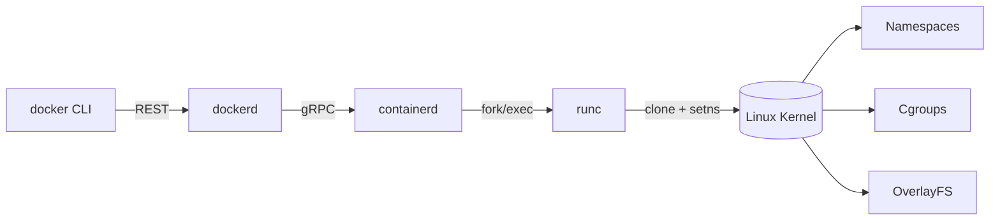

# How Docker Actually Works

Author: [nawazdhandala](https://www.github.com/nawazdhandala)

Tags: Docker, Containers, DevOps, Security, Performance

Description: A deep-yet-friendly walkthrough of Docker internals- OCI images, overlayfs layers, namespaces, cgroups, networking, and the low-level runtimes that translate `docker run` into real Linux syscalls.

Docker looks effortless: one CLI command builds an image or spawns a container in seconds. Underneath, it is orchestrating half a dozen Linux kernel features plus the Open Container Initiative (OCI) runtime stack. This post peels back every layer, so you can reason about performance, debugging, and security instead of treating Docker as a black box.

## 1. The Control Plane Journey from CLI to Kernel

The following diagram illustrates the complete path a command takes from when you type `docker run` until your container process starts. Understanding this flow is essential for debugging container issues and choosing the right tool for direct intervention when needed.



1. `docker` (CLI) talks to `dockerd` over a local Unix socket.
2. `dockerd` handles image pulls, auth, builds, networking JSON, and forwards runtime work to `containerd` via gRPC.
3. `containerd` is a long-running daemon that manages image unpacking, snapshots, and container lifecycle. It forks `runc` for each container.
4. `runc` is the reference OCI runtime. It simply reads a low-level spec (config.json), executes `clone()` to enter namespaces, writes cgroup files, sets up mounts, drops capabilities, and finally `exec`s your process.
5. The kernel enforces the isolation features (namespaces, cgroups, seccomp) that make the container look like a tiny, dedicated machine.

Knowing this stack helps when you need to step outside the Docker CLI. For example, `ctr` (installed with containerd) and `runc` let you reproduce Docker behavior during incident debugging or when building custom pipelines.

## 2. Images Are OCI Artifacts.

Every Docker image is an OCI manifest: JSON pointing to a config blob plus a series of content-addressed layers. You can inspect one without pulling it:

This command uses the `crane` tool to fetch and display the manifest metadata for an image directly from the registry. It's useful for understanding an image's layer structure and sizes before downloading potentially gigabytes of data.

```bash
# Show the manifest for nginx:1.27 without downloading gigabytes
# Uses crane (go-containerregistry tool) to query registry directly
# The jq filter extracts layer information showing media type and size
$ crane manifest nginx:1.27 | jq '.layers[] | {mediaType, size}'
```

Key takeaways:

- Layers are compressed tar archives. Their SHA256 digests guarantee immutability.
- The config object lists the root filesystem diff IDs, environment variables, entrypoint, exposed ports, and OCI annotations.
- Because layers are content-addressed, identical steps across images are shared on disk, making `docker build` and `docker pull` fast after the first run.

## 3. Copy-on-Write Layers and OverlayFS

When you start a container, Docker mounts a read-only stack of layers plus a thin writable layer on top. OverlayFS/globally known as union filesystems provide this illusion.

This Dockerfile demonstrates multi-stage builds, a critical optimization technique. The first stage compiles the application with all build dependencies, while the second stage creates a minimal runtime image using only the compiled binary. This dramatically reduces the final image size and attack surface.

```Dockerfile
# Stage 1: build
# Start from a full Go toolchain image for compilation
FROM golang:1.22-alpine AS build
# Set working directory for all subsequent commands
WORKDIR /src
# Copy source files into the build container
COPY . .
# Compile the binary with trimpath to remove local paths from the binary
RUN go build -trimpath -o app ./cmd/api

# Stage 2: minimal runtime image
# Use distroless base image (no shell, minimal attack surface)
FROM gcr.io/distroless/base
# Copy only the compiled binary from the build stage
COPY --from=build /src/app /app
# Set the container's entrypoint to run the binary directly
ENTRYPOINT ["/app"]
```

Each instruction creates a new layer. You can see them via `docker history myorg/api:latest`. At runtime, writes land in the topmost writable layer, so deleting a file only hides it; the old bytes still live below. That is why multistage builds (like the example above) and `docker image prune` matter.

If you ever wonder where files sit on disk, list `/var/lib/docker/overlay2`. Each directory is a layer identified by its digest.

## 4. Namespaces: Showing Each Container Its Own World

Namespaces virtualize kernel resources so one container's processes cannot accidentally see another's. When `runc` executes `clone(CLONE_NEWNS | CLONE_NEWPID | ...)`, it gets fresh views of:

- **PID namespace**: process IDs start at 1 inside the container. Only processes inside can signal each other unless explicitly shared.
- **Mount namespace**: containers get their own mount table. Docker overlays layers, bind-mounts volumes, and hides host paths you never asked for.
- **Network namespace**: each container owns a virtual NIC. Docker wires it to a bridge (docker0), a macvlan, or your custom CNI plugin.
- **IPC & UTS namespaces**: isolate shared-memory segments and hostnames.

You can prove it by entering a container's namespaces from the host:

This example demonstrates how to use `nsenter` to enter a running container's namespace from the host system. This is invaluable for debugging when you need host-level tools that aren't available inside the container, or when the container's shell is broken.

```bash
# Inspect the PID of a running container
# docker inspect retrieves container metadata; --format extracts the host PID
$ docker inspect --format '{{.State.Pid}}' api
21573
# Enter its namespace with nsenter
# --target specifies the PID to get namespaces from
# --mount --uts --ipc --net --pid enters all major namespaces
$ sudo nsenter --target 21573 --mount --uts --ipc --net --pid
# Now running in container's namespace - hostname shows container ID
root@f3a0c9b6f799:/# hostname
f3a0c9b6f799
```

## 5. Cgroups: Enforcing Real Resource Budgets

Control groups (v2 on modern kernels) are hierarchical filesystems under `/sys/fs/cgroup`. Docker writes numeric limits there just before your process starts:

This command starts an nginx container with strict resource limits. Memory is capped at 256MB, and CPU is limited to one full core. When these limits are exceeded, the container may be throttled (CPU) or killed (memory OOM).

```bash
# Run nginx with memory limited to 256MB and CPU limited to 1 core
# These flags translate to cgroup v2 settings in the kernel
$ docker run --memory=256m --cpus=1 nginx
```

Behind the scenes Docker creates a cgroup like `/sys/fs/cgroup/docker/<id>/` and writes files including:

- `memory.max = 268435456`
- `cpu.max = 100000 100000` (1 full CPU)
- `pids.max = 4096`

The kernel meters every page fault, CPU slice, and fork against these numbers. That is why production throttling or OOM events show up in `docker stats`, `ctr cgroup`, or observability pipelines. You can emit those metrics to OneUptime the same way you scrape `node_exporter`.

## 6. Networking: Virtual Ethernet, Bridges, and NAT

By default Docker creates:

1. `docker0` bridge on the host.
2. A veth pair per container- one end lives in the host namespace, the other inside the container.
3. iptables rules for SNAT/DNAT so containers reach the internet and exposed ports route inward.

Advanced scenarios:

- **User-defined bridges**: better DNS, service discovery, and isolation per stack.
- **macvlan/ipvlan**: map containers directly onto the physical LAN with real MAC addresses (useful for legacy appliances).
- **CNI plugins**: in Kubernetes or Compose v2 you can hand networking to technologies like Calico or Cilium.

Troubleshoot connectivity by inspecting the namespace: `ip netns exec <ns> ip addr show` or `ethtool vethXYZ` to check duplex and MTU.

## 7. Storage and Volumes Beyond OverlayFS

OverlayFS is great for root filesystems, but stateful apps need persistent volumes:

- **Bind mounts** (`-v /host/path:/container/path`) share a real host directory.
- **Named volumes** store data under `/var/lib/docker/volumes` and can use plugins like `local`, `nfs`, or CSI drivers.
- **Tmpfs** mounts keep secrets in RAM (`--tmpfs /run/secrets:rw,noexec,nosuid,size=64m`).

Snapshotters in containerd (overlayfs, btrfs, zfs, stargz) change performance characteristics. For high-density hosts, consider native ZFS/btrfs snapshotters to get instant clones without overlay penalties.

## 8. Security: Capabilities, Seccomp, and User Namespaces

Docker drops a curated capability set by default. Run `docker run --cap-drop ALL` and then selectively add what you need (`--cap-add NET_BIND_SERVICE`). Combine that with:

- `--security-opt seccomp=profile.json` to ban dangerous syscalls.
- `--security-opt apparmor=docker-default` or SELinux labels.
- Rootless mode (user namespaces) so the container's UID 0 maps to an unprivileged UID on the host.

If you are diving deeper, read about `landlock` and `fanotify` policies, and scan images for vulnerabilities. For a practical hardening checklist, see [How to Shrink and Harden Docker Images Without Breaking Builds](https://oneuptime.com/blog/post/2025-11-27-shrink-and-harden-docker-images/view).

## 9. Observability Hooks

Containers are processes; the kernel exposes their behavior via cgroup and namespace metrics:

- `cat /proc/<pid>/mountinfo` shows the layered filesystem inside.
- `perf stat -p <pid>` gives CPU counters scoped to that container.
- `ctr --namespace moby task metrics <container>` dumps cgroup stats you can ship to Prometheus.
- Sidecar or node-agent patterns emit OpenTelemetry traces/logs/metrics even when workloads keep changing images. (We detailed the pattern in [How to Instrument Dockerized Apps with OpenTelemetry Sidecars and Agents](https://oneuptime.com/blog/post/2025-11-27-instrument-dockerized-apps-with-opentelemetry/view).)

## 10. Reproducing Docker by Hand

Running the low-level stack manually demystifies Docker and helps when you understand all of this better:

The following commands show how to use `runc` directly, bypassing Docker entirely. This is useful for understanding exactly what happens at the OCI runtime level and for debugging low-level container issues.

```bash
# Generate a vanilla OCI bundle (creates config.json with default settings)
$ runc spec
# Edit config.json to set rootfs, env vars, and cgroup limits
# Then run the container directly with runc
$ sudo runc run demo
```

Or launch via containerd:

This example uses `ctr`, the containerd CLI, to pull an image and run a container. The `--rm` flag removes the container after exit, `--net-host` shares the host's network namespace, and the command shows the cgroup the process belongs to.

```bash
# Pull Alpine image from Docker Hub registry
$ ctr image pull docker.io/library/alpine:3.20
# Run container with host networking, auto-remove on exit
# The command shows which cgroup the container process belongs to
$ ctr run --rm --net-host docker.io/library/alpine:3.20 demo sh -c "cat /proc/self/cgroup"
```

When these commands succeed, you know the kernel is healthy and any Docker issue is likely in buildx, networking plugins, or authorization middleware.

## 11. Bringing It All Together

- Docker is a client, daemon, content store, snapshotter, and OCI runtime glued together.
- Containers are simply Linux processes with isolated namespaces plus cgroup budgets and layered filesystems.
- Images are verifiable OCI artifacts; builds are deterministic dependency graphs, so optimize them like any other supply chain.
- Observability and security hinge on understanding cgroups, capabilities, and overlayfs behavior, not on memorizing `docker` flags.

Once you see containers as orchestration of existing kernel primitives, you can design better runtime policies, troubleshoot weird behavior quickly, and decide when Docker is enough versus when you need Kubernetes or specialized runtimes.

**Next steps**

1. Need a beginner-friendly primer? Read [Learn Docker Step by Step: A Hands-On Beginner Guide](https://oneuptime.com/blog/post/2025-11-27-learn-docker-step-by-step/view).
2. Want production-grade tricks (BuildKit caches, Compose profiles, Trivy scans)? Continue with [10 Docker Superpowers Developers Forget to Use](https://oneuptime.com/blog/post/2025-11-27-ten-docker-superpowers-youre-probably-not-using/view).
