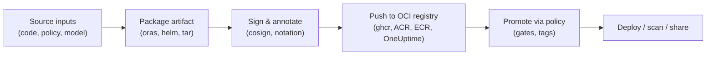

# OCI Artifacts Explained: Beyond Container Images

Author: [nawazdhandala](https://www.github.com/nawazdhandala)

Tags: Containers, DevOps, Supply Chain, Security, OCI

Description: OCI artifacts are just structured manifests in a registry, but they unlock consistent distribution for anything from Helm charts to SBOMs and AI models. This post breaks down how they work, why they matter, and how to publish your own.

> OCI artifacts give every deliverable code, policies, datasets, attestations the same portability guarantees Docker images enjoy.

We needed a way to move more than images through the exact same registry plumbing. Helm charts, WASM modules, SBOMs, model weights, policy bundles, signatures all of them deserve digests, immutability, and access control. Enter **OCI artifacts**, a thin convention on top of the OCI distribution spec that treats *anything* as a first-class citizen.

---

## OCI in 60 Seconds

- **Image spec**: Defines how layers, configs, and manifests are structured.
- **Runtime spec**: Defines how runtimes (containerd, runc, Kata) unpack and run those bundles.
- **Distribution spec**: Defines the registry API for pushing/pulling blobs by digest.
- **Artifact extension**: Adds light metadata so registries know "this manifest is a Helm chart" or "this digest is a signature for that SBOM".

The last piece is what most teams mean today when they say "OCI artifact".

---

## Anatomy of an Artifact Manifest

```json
{
  "mediaType": "application/vnd.oci.artifact.manifest.v1+json",
  "artifactType": "application/vnd.cncf.helm.chart.v1+json",
  "blobs": [
    { "mediaType": "application/tar+gzip", "size": 23142, "digest": "sha256:..." }
  ],
  "subject": {
    "mediaType": "application/vnd.oci.image.manifest.v1+json",
    "digest": "sha256:image"  
  },
  "annotations": { "org.opencontainers.artifact.created": "2025-12-08T09:00:00Z" }
}
```

Key bits:

- `artifactType` advertises what the blob *is* (Helm chart, SBOM, provenance doc, WASM bytecode, etc.).
- `subject` (optional) links to another digest (handy for signatures, policies, or test reports referring to an image).
- `annotations` carry human-friendly metadata without exploding cardinality.
- `blobs` list tarballs or files the artifact consists of; each blob is content-addressed by digest like image layers.

---

## Common Artifact Types

| Artifact | `artifactType` (example) | Why you care |
| --- | --- | --- |
| Helm chart | `application/vnd.cncf.helm.chart.v1+json` | Distribute charts alongside images in the same registry & RBAC model. |
| SBOM (CycloneDX) | `application/vnd.cyclonedx+json` | Ship dependency inventories for every build to enable downstream scanning. |
| Signatures / attestations | `application/vnd.dev.cosign.simplesigning.v1+json` | Cryptographically prove provenance and block untrusted workloads. |
| WASM module | `application/wasm+module` | Reuse OCI registries for server-side Wasm runtimes. |
| AI model weights | Custom, e.g. `application/vnd.myorg.model.v2+parquet` | Version and promote ML artifacts through the same pipeline as code. |

Because registries only see digests and media types, none of these required custom server features.

---

## Registry Flow (Build -> Push -> Promote)



Same lifecycle as containers, just with different consumers.

---

## Publishing an Artifact with `oras`

```bash
oras push ghcr.io/oneuptime/policies:rbac-v1 \
  --artifact-type application/vnd.cncf.openpolicyagent.config.v1+json \
  policy.bundle.tar.gz:application/gzip \
  --annotation org.opencontainers.image.source=https://github.com/oneuptime/policies \
  --annotation org.oneuptime.stage="prod"
```

- `oras` speaks the OCI distribution API directly.
- `artifact-type` tells downstream tooling how to interpret the blob.
- Annotations stay immutable with the digest, so promotion pipelines can rely on them.

Need to link the artifact to a container image you scanned? Use the `--subject` flag so scanners know *which* image the report belongs to.

---

## Validating and Trusting Artifacts

1. **Sign** with `cosign sign --yes ghcr.io/oneuptime/policies@sha256:...` (signatures themselves are OCI artifacts referencing the subject digest).
2. **Store provenance** (SLSA, in-toto) as artifacts referencing the same subject.
3. **Gate deployments** by verifying digest + signature at admission time (e.g., Kyverno or OPA hitting the registry for proofs).
4. **Audit** by enumerating referrers: `oras discover ghcr.io/oneuptime/platform@sha256:...` lists every SBOM, signature, and test report tied to that image.

---

## When to Reach for OCI Artifacts

- You already run a container registry and want *one* control plane for everything supply-chain related.
- You need to move declarative config, policies, templates, or models between environments without inventing another packaging system.
- You want immutability + digest pinning for artifacts that historically lived in ZIPs on S3.
- You rely on tooling that understands referrers (Cosign, Notation, ORAS, Helm 3.8+, Artifact Hub) and want to plug into that ecosystem.

Still learning how registries themselves store layers and manifests? Pair this post with [How Docker Actually Works](https://oneuptime.com/blog/post/2025-12-08-how-docker-actually-works/view).

---

## Lightweight Adoption Checklist

1. **Pick artifact types** you care about first (SBOMs + signatures deliver the fastest security ROI).
2. **Standardize naming**: `registry/org/artifact-family:semantic-tag` plus digests for promotion.
3. **Automate publishing** with CI (GitHub Actions + `oras` or `cosign attest`).
4. **Enforce verification** at deploy time (admission controllers, supply-chain scanners).
5. **Document discovery** so teams know how to list linked artifacts per digest.

OCI artifacts are intentionally boring: they reuse the most battle-tested primitives in the container ecosystem. Treat them like you treat images version them, scan them, sign them and they become the universal packaging layer for everything that ships with your software.
