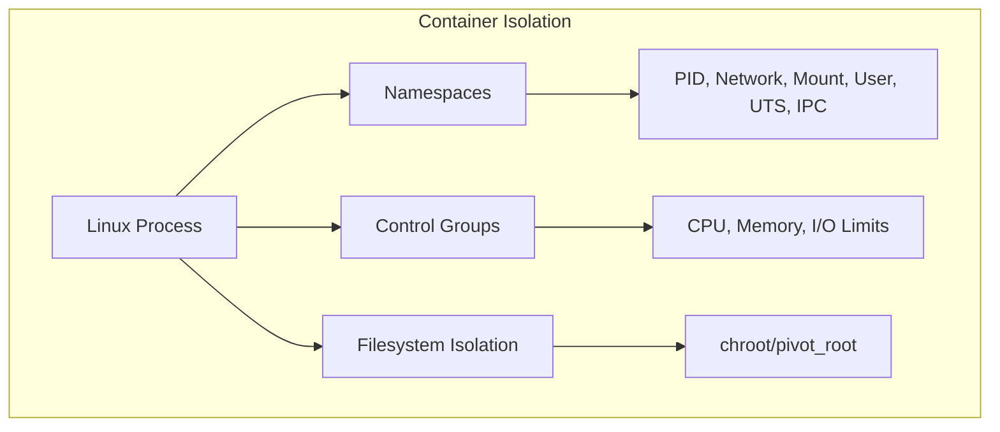
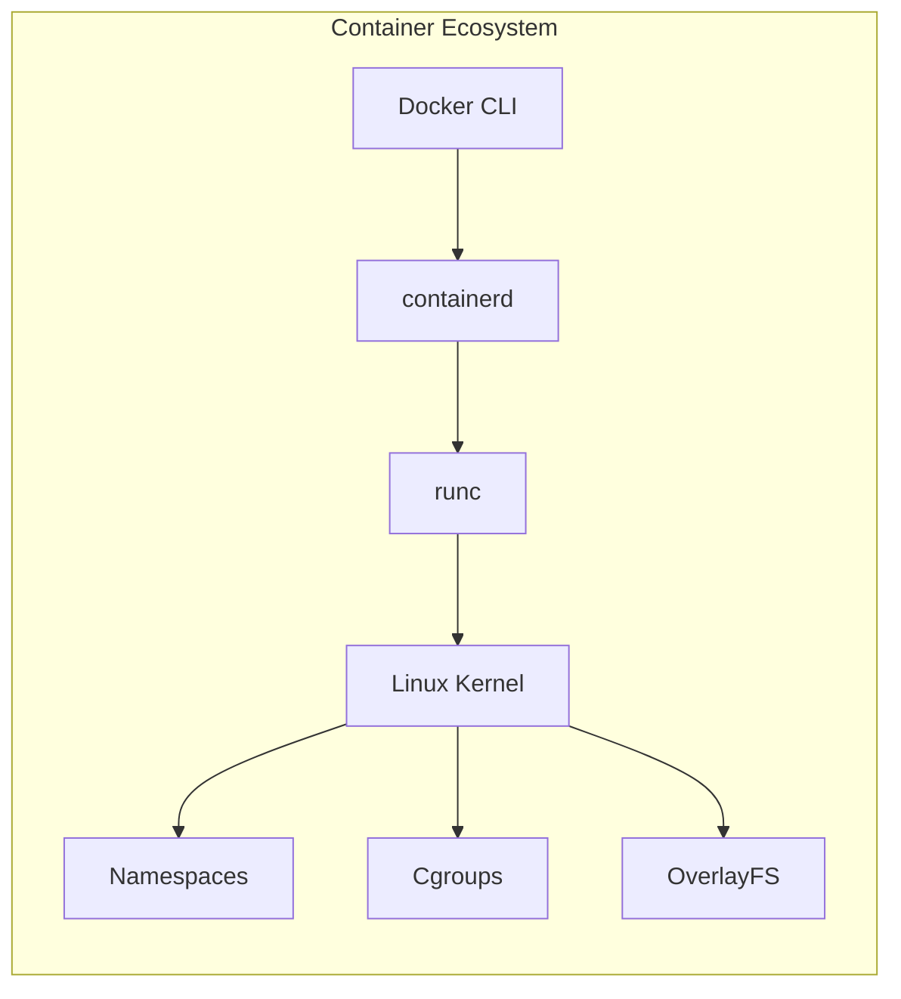

# Building Your Own Container Engine: A Step-by-Step Guide to Understanding Docker Internals

Author: [nawazdhandala](https://www.github.com/nawazdhandala)

Tags: Docker, Containers, Linux, DevOps, Learning Resource

Description: Learn how containers actually work under the hood by building a basic container engine from scratch. This hands-on guide demystifies Docker by walking through namespaces, cgroups, and filesystem isolation.

Docker revolutionized how we build, ship, and run applications. But have you ever wondered what's actually happening when you run `docker run`? Behind the friendly CLI lies a fascinating combination of Linux kernel features that have existed for years. Understanding these fundamentals doesn't just satisfy curiosity- it makes you a better engineer when debugging container issues, optimizing performance, or designing secure systems.

In this guide, we'll build a basic container engine from scratch using Go. By the end, you'll understand the core Linux primitives that power Docker and every other container runtime.

## What Makes a Container?

Before we write code, let's understand what a container actually is. Despite the marketing, containers aren't virtual machines. They're just regular Linux processes with three key isolation mechanisms:



1. **Namespaces**: Isolate what a process can see (PIDs, network, filesystem mounts, hostnames)
2. **Control Groups (cgroups)**: Limit what resources a process can use (CPU, memory, I/O)
3. **Filesystem Isolation**: Give processes their own root filesystem

That's it. No hypervisor, no kernel modules, just clever use of existing kernel features.

## Prerequisites

To follow along, you'll need:
- A Linux machine (Ubuntu 20.04+ recommended) or a Linux VM
- Go 1.19 or later installed
- Root access (we'll be using privileged system calls)
- Basic familiarity with Linux and Go

> **Note**: This won't work on macOS or Windows directly. Docker Desktop on those platforms actually runs a Linux VM behind the scenes.

## Project Structure

Let's create our project:

```bash
mkdir minicontainer && cd minicontainer
go mod init minicontainer
```

Our final structure will look like:

```
minicontainer/
├── go.mod
├── main.go
└── rootfs/          # We'll create this later
```

## Step 1: Understanding Linux Namespaces

Namespaces are the foundation of container isolation. Linux supports several namespace types:

| Namespace | Flag | What it isolates |
|-----------|------|------------------|
| PID | CLONE_NEWPID | Process IDs |
| Network | CLONE_NEWNET | Network interfaces, routing |
| Mount | CLONE_NEWNS | Filesystem mount points |
| UTS | CLONE_NEWUTS | Hostname and domain name |
| IPC | CLONE_NEWIPC | Inter-process communication |
| User | CLONE_NEWUSER | User and group IDs |
| Cgroup | CLONE_NEWCGROUP | Cgroup root directory |

Let's start with the basics. Create `main.go`:

```go
package main

import (
	"fmt"
	"os"
	"os/exec"
	"syscall"
)

func main() {
	switch os.Args[1] {
	case "run":
		run()
	case "child":
		child()
	default:
		panic("Unknown command")
	}
}

func run() {
	fmt.Printf("Running %v as PID %d\n", os.Args[2:], os.Getpid())

	cmd := exec.Command("/proc/self/exe", append([]string{"child"}, os.Args[2:]...)...)
	cmd.Stdin = os.Stdin
	cmd.Stdout = os.Stdout
	cmd.Stderr = os.Stderr

	// This is where the magic happens!
	cmd.SysProcAttr = &syscall.SysProcAttr{
		Cloneflags: syscall.CLONE_NEWUTS |  // New hostname namespace
			syscall.CLONE_NEWPID |           // New PID namespace
			syscall.CLONE_NEWNS,             // New mount namespace
		Unshareflags: syscall.CLONE_NEWNS,
	}

	must(cmd.Run())
}

func child() {
	fmt.Printf("Running %v as PID %d\n", os.Args[2:], os.Getpid())

	// Set a different hostname for our container
	must(syscall.Sethostname([]byte("container")))

	cmd := exec.Command(os.Args[2], os.Args[3:]...)
	cmd.Stdin = os.Stdin
	cmd.Stdout = os.Stdout
	cmd.Stderr = os.Stderr

	must(cmd.Run())
}

func must(err error) {
	if err != nil {
		panic(err)
	}
}
```

Let's test it:

```bash
go build -o minicontainer .
sudo ./minicontainer run /bin/bash
```

Inside the container, try:

```bash
hostname        # Should show "container"
echo $$         # Should show "1" - we're PID 1 in our namespace!
ps aux          # Still shows host processes (we'll fix this)
```

You've just created your first isolated namespace! The process sees itself as PID 1 and has its own hostname.

## Step 2: Filesystem Isolation with chroot

Seeing host processes isn't very container-like. We need to give our container its own filesystem. First, let's create a minimal root filesystem.

### Creating a Minimal Root Filesystem

You can use Alpine Linux's mini root filesystem:

```bash
mkdir -p rootfs
cd rootfs

# Download Alpine mini root filesystem
curl -o alpine.tar.gz https://dl-cdn.alpinelinux.org/alpine/v3.18/releases/x86_64/alpine-minirootfs-3.18.0-x86_64.tar.gz

# Extract it
tar xzf alpine.tar.gz
rm alpine.tar.gz
cd ..
```

### Updating Our Container to Use the New Filesystem

Update the `child()` function:

```go
func child() {
	fmt.Printf("Running %v as PID %d\n", os.Args[2:], os.Getpid())

	// Set hostname
	must(syscall.Sethostname([]byte("container")))

	// Change root filesystem
	must(syscall.Chroot("./rootfs"))
	must(os.Chdir("/"))

	// Mount proc so we can see our isolated processes
	must(syscall.Mount("proc", "proc", "proc", 0, ""))

	cmd := exec.Command(os.Args[2], os.Args[3:]...)
	cmd.Stdin = os.Stdin
	cmd.Stdout = os.Stdout
	cmd.Stderr = os.Stderr

	must(cmd.Run())

	// Clean up
	must(syscall.Unmount("proc", 0))
}
```

Rebuild and test:

```bash
go build -o minicontainer .
sudo ./minicontainer run /bin/sh
```

Now inside:

```bash
ps aux          # Only shows processes in our container!
ls /            # Alpine's filesystem
cat /etc/os-release  # Alpine Linux!
```

We now have proper process and filesystem isolation.

## Step 3: Adding Control Groups (cgroups)

Namespaces control what a process can see. Cgroups control what resources it can use. Let's limit our container's memory.

Update `child()`:

```go
func child() {
	fmt.Printf("Running %v as PID %d\n", os.Args[2:], os.Getpid())

	// Set up cgroup for memory limiting
	cg()

	// Set hostname
	must(syscall.Sethostname([]byte("container")))

	// Change root filesystem
	must(syscall.Chroot("./rootfs"))
	must(os.Chdir("/"))

	// Mount proc
	must(syscall.Mount("proc", "proc", "proc", 0, ""))

	cmd := exec.Command(os.Args[2], os.Args[3:]...)
	cmd.Stdin = os.Stdin
	cmd.Stdout = os.Stdout
	cmd.Stderr = os.Stderr

	must(cmd.Run())

	must(syscall.Unmount("proc", 0))
}

func cg() {
	// Create a cgroup for our container
	cgroupPath := "/sys/fs/cgroup/minicontainer"
	
	// Create the cgroup directory
	os.MkdirAll(cgroupPath, 0755)

	// Set memory limit to 100MB
	must(os.WriteFile(cgroupPath+"/memory.max", []byte("100000000"), 0700))

	// Add our process to this cgroup
	must(os.WriteFile(cgroupPath+"/cgroup.procs", []byte(fmt.Sprintf("%d", os.Getpid())), 0700))
}
```

> **Note**: This assumes cgroup v2. If you're on an older system with cgroup v1, the paths and file names will differ.

## Step 4: Network Isolation (Bonus)

Full network isolation requires more setup, but here's the concept:

```go
// Add to Cloneflags in run()
cmd.SysProcAttr = &syscall.SysProcAttr{
    Cloneflags: syscall.CLONE_NEWUTS |
        syscall.CLONE_NEWPID |
        syscall.CLONE_NEWNS |
        syscall.CLONE_NEWNET,  // New network namespace
    Unshareflags: syscall.CLONE_NEWNS,
}
```

With `CLONE_NEWNET`, the container gets its own network stack with no interfaces (except loopback). Setting up veth pairs and bridges for actual networking is beyond our basic implementation, but that's exactly what Docker does.

## The Complete Code

Here's our final `main.go`:

```go
package main

import (
	"fmt"
	"os"
	"os/exec"
	"syscall"
)

func main() {
	switch os.Args[1] {
	case "run":
		run()
	case "child":
		child()
	default:
		panic("Unknown command. Use: run <command>")
	}
}

func run() {
	fmt.Printf("Parent: Running %v as PID %d\n", os.Args[2:], os.Getpid())

	cmd := exec.Command("/proc/self/exe", append([]string{"child"}, os.Args[2:]...)...)
	cmd.Stdin = os.Stdin
	cmd.Stdout = os.Stdout
	cmd.Stderr = os.Stderr

	cmd.SysProcAttr = &syscall.SysProcAttr{
		Cloneflags: syscall.CLONE_NEWUTS |
			syscall.CLONE_NEWPID |
			syscall.CLONE_NEWNS |
			syscall.CLONE_NEWNET,
		Unshareflags: syscall.CLONE_NEWNS,
	}

	must(cmd.Run())
}

func child() {
	fmt.Printf("Child: Running %v as PID %d\n", os.Args[2:], os.Getpid())

	// Set up resource limits
	cg()

	// Set container hostname
	must(syscall.Sethostname([]byte("container")))

	// Set up new root filesystem
	must(syscall.Chroot("./rootfs"))
	must(os.Chdir("/"))

	// Mount /proc for process visibility
	must(syscall.Mount("proc", "proc", "proc", 0, ""))

	// Run the requested command
	cmd := exec.Command(os.Args[2], os.Args[3:]...)
	cmd.Stdin = os.Stdin
	cmd.Stdout = os.Stdout
	cmd.Stderr = os.Stderr

	must(cmd.Run())

	// Cleanup
	must(syscall.Unmount("proc", 0))
}

func cg() {
	cgroupPath := "/sys/fs/cgroup/minicontainer"
	os.MkdirAll(cgroupPath, 0755)
	
	// Memory limit: 100MB
	must(os.WriteFile(cgroupPath+"/memory.max", []byte("100000000"), 0700))
	
	// CPU limit: 50% of one core
	must(os.WriteFile(cgroupPath+"/cpu.max", []byte("50000 100000"), 0700))
	
	// Add current process to cgroup
	must(os.WriteFile(cgroupPath+"/cgroup.procs", []byte(fmt.Sprintf("%d", os.Getpid())), 0700))
}

func must(err error) {
	if err != nil {
		panic(err)
	}
}
```

## Testing Your Container

```bash
# Build
go build -o minicontainer .

# Run with a shell
sudo ./minicontainer run /bin/sh

# Inside the container:
hostname              # "container"
ps aux                # Only container processes
cat /etc/os-release   # Alpine Linux
ip addr               # Only loopback (isolated network)

# Test memory limit - this should fail or be killed
dd if=/dev/zero of=/dev/null bs=1M count=200
```

## What Real Container Runtimes Add

Our minicontainer demonstrates the core concepts, but production runtimes like Docker, containerd, and runc add much more:

| Feature | Our Implementation | Production Runtimes |
|---------|-------------------|---------------------|
| Image Format | Manual tarball | OCI Image Spec |
| Networking | None | CNI plugins, bridge networks |
| Storage | Simple chroot | Union filesystems (OverlayFS) |
| Security | Basic namespaces | Seccomp, AppArmor, capabilities |
| Orchestration | None | Docker Compose, Kubernetes |



## Why This Matters

Understanding container internals helps you:

1. **Debug Issues**: When a container behaves unexpectedly, knowing about namespaces and cgroups helps you investigate
2. **Optimize Performance**: Understanding cgroup limits helps you right-size container resources
3. **Improve Security**: Knowing isolation boundaries helps you identify potential escape vectors
4. **Make Better Decisions**: Understanding the overhead (or lack thereof) helps in architecture decisions

## Further Reading

If you want to go deeper:

- **OCI Runtime Spec**: The standard that defines container runtimes
- **runc source code**: The reference implementation used by Docker
- **Linux namespaces man pages**: `man 7 namespaces`, `man 7 cgroups`
- **"Containers from Scratch" by Liz Rice**: The talk that inspired many to explore this topic

## Conclusion

Containers aren't magic- they're a clever combination of Linux kernel features that have existed for years. By building a basic container engine, you've seen firsthand how namespaces provide isolation, cgroups limit resources, and filesystem tools like chroot create separate environments.

The next time you run `docker run`, you'll know exactly what's happening under the hood. And when things go wrong, you'll have the mental model to debug effectively.

**Related Reading:**

- [How moving from AWS to Bare-Metal saved us $230,000/yr](https://oneuptime.com/blog/post/2023-10-30-moving-from-aws-to-bare-metal/view) - Learn about our journey with containers and Kubernetes
- [Why build open-source DataDog?](https://oneuptime.com/blog/post/2024-08-14-why-build-open-source-datadog/view) - Our approach to open-source observability
- [Kubernetes Storage Layers: Ceph vs. Longhorn vs. Everything Else](https://oneuptime.com/blog/post/2025-11-27-choosing-kubernetes-storage-layers/view) - Deep dive into Kubernetes infrastructure
