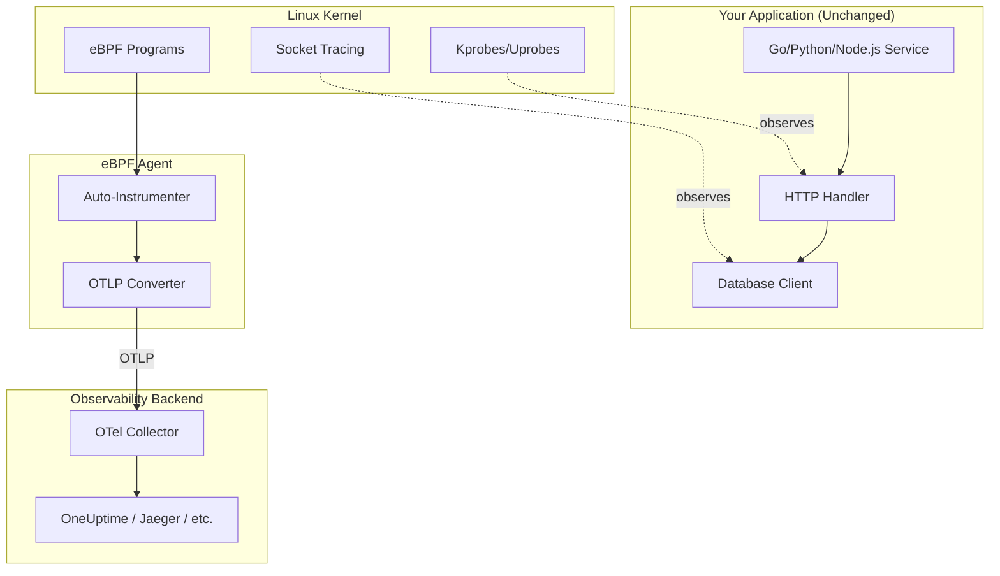
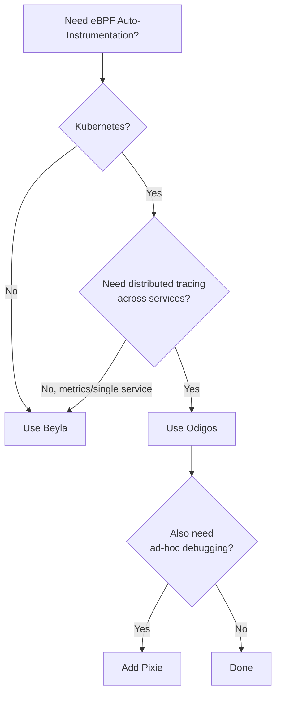
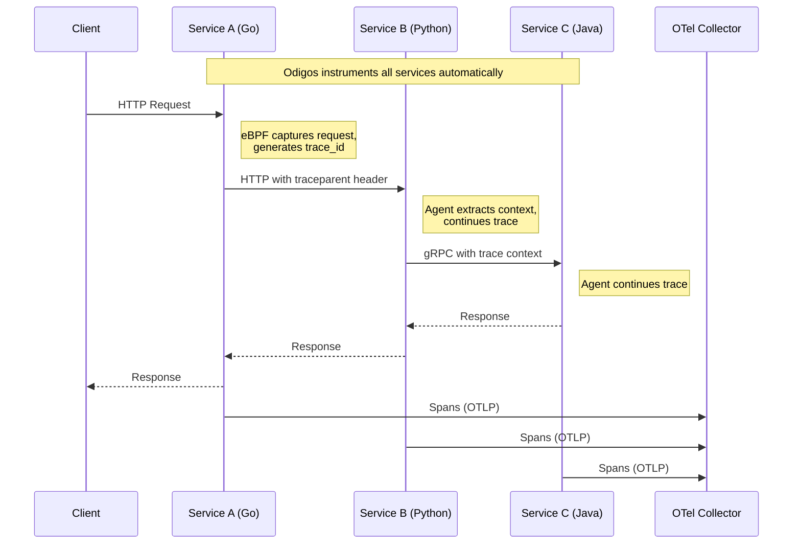
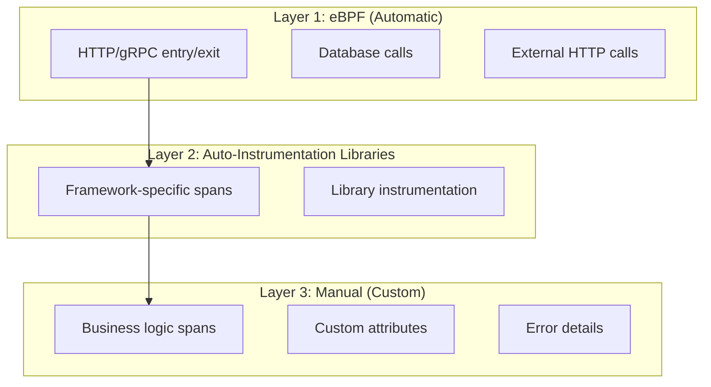

# Using eBPF with OpenTelemetry: Zero-Code Auto-Instrumentation for Any Application

Author: [nawazdhandala](https://www.github.com/nawazdhandala)

Tags: eBPF, OpenTelemetry, Observability, Tracing, Auto-Instrumentation, Kubernetes, Linux, Performance

Description: A practical guide to combining eBPF with OpenTelemetry for automatic, zero-code distributed tracing and observability. Learn how tools like Odigos, Beyla, and OpenTelemetry eBPF work, when to use them, and how to set them up in production.

---

> What if you could get full distributed tracing across all your services **without adding a single line of instrumentation code**?

Traditional OpenTelemetry instrumentation requires you to add SDKs, configure exporters, and wrap your code with spans. It's powerful but requires effort- especially when you have dozens of services in different languages.

[eBPF](https://oneuptime.com/blog/post/2025-12-10-what-is-ebpf-and-how-does-it-work/view) changes this equation entirely. By observing your applications from the Linux kernel, eBPF-based tools can automatically generate OpenTelemetry-compatible traces, metrics, and profiles- **without touching your application code**.

This post shows you how to combine eBPF with OpenTelemetry for powerful, zero-code observability.

---

## Table of Contents

1. The Problem: Instrumentation at Scale
2. How eBPF Enables Auto-Instrumentation
3. eBPF + OpenTelemetry Architecture
4. Tool Comparison: Odigos vs Beyla vs Pixie
5. Setting Up Beyla (Grafana's eBPF Auto-Instrumenter)
6. Setting Up Odigos for Kubernetes
7. What Gets Captured Automatically
8. Correlating eBPF Data with Manual Instrumentation
9. Performance Overhead
10. Limitations and When to Use Manual Instrumentation
11. Production Best Practices
12. Conclusion

---

## 1. The Problem: Instrumentation at Scale

Traditional [OpenTelemetry instrumentation](https://oneuptime.com/blog/post/2025-08-27-traces-and-spans-in-opentelemetry/view) follows a pattern:

1. Add the OTel SDK to each service
2. Configure exporters
3. Instrument entry points (HTTP handlers, gRPC methods)
4. Add spans for important operations
5. Propagate context across service boundaries
6. Repeat for every service, in every language

For a small team with a few services, this is manageable. But consider:

| Scenario | Challenge |
|----------|-----------|
| 50+ microservices | SDK integration across all services takes weeks |
| Polyglot stack | Different SDKs for Go, Python, Node.js, Java, Rust... |
| Legacy services | Can't easily modify code; no one wants to touch it |
| Third-party services | You don't have access to the source code |
| Rapid deployment | New services appear faster than you can instrument them |

**The result?** Observability gaps. Some services have traces, others don't. Context propagation breaks at the uninstrumented services. You're flying partially blind.

---

## 2. How eBPF Enables Auto-Instrumentation

eBPF solves this by observing applications **from outside the application itself**- at the kernel level.

### What eBPF Can See

Because eBPF hooks into kernel functions and system calls, it can observe:

| Layer | What eBPF Sees |
|-------|----------------|
| **Network** | Every TCP connection, HTTP request/response, DNS query |
| **System Calls** | File I/O, process creation, memory allocation |
| **User Functions** | Function entry/exit via uprobes (if symbols available) |
| **Language Runtimes** | Go, Node.js, Python, Java runtime internals |

### How This Becomes OpenTelemetry Data

eBPF-based auto-instrumenters work by:

1. **Attaching probes** to known entry points (HTTP libraries, gRPC handlers, database drivers)
2. **Extracting context** from requests (trace IDs from headers, request metadata)
3. **Measuring timing** using kernel timestamps
4. **Correlating** request/response pairs
5. **Exporting** as standard OpenTelemetry Protocol (OTLP) data



---

## 3. eBPF + OpenTelemetry Architecture

A typical production setup looks like this:

### Components

| Component | Role |
|-----------|------|
| **eBPF Agent** | Runs on each node, attaches eBPF programs, generates telemetry |
| **OTel Collector** | Receives OTLP data, processes, and exports to backend |
| **Backend** | Stores and visualizes traces/metrics (OneUptime, Jaeger, Tempo) |

### Deployment Patterns

**Pattern 1: DaemonSet (Kubernetes)**
```yaml
# eBPF agent runs on every node
apiVersion: apps/v1
kind: DaemonSet
metadata:
  name: ebpf-auto-instrumenter
spec:
  selector:
    matchLabels:
      app: ebpf-agent
  template:
    spec:
      hostPID: true      # Required for eBPF
      hostNetwork: true  # For network tracing
      containers:
      - name: agent
        securityContext:
          privileged: true  # Required for eBPF
```

**Pattern 2: Sidecar (Per-Pod)**
```yaml
# eBPF agent as sidecar (more isolation, more overhead)
spec:
  containers:
  - name: my-app
    image: my-app:latest
  - name: ebpf-sidecar
    image: ebpf-agent:latest
    securityContext:
      privileged: true
```

**Pattern 3: Standalone (Non-Kubernetes)**
```bash
# Run directly on the host
sudo ./beyla --config config.yaml
```

---

## 4. Tool Comparison: Odigos vs Beyla vs Pixie

Several tools combine eBPF with OpenTelemetry. Here's how they compare:

### Grafana Beyla

| Aspect | Details |
|--------|---------|
| **Focus** | HTTP/gRPC auto-instrumentation |
| **Languages** | Go, Python, Node.js, Java, Rust, .NET, Ruby |
| **Output** | OTLP (traces + metrics) |
| **Deployment** | Standalone binary or Kubernetes |
| **License** | Apache 2.0 |
| **Best For** | Simple setups, Grafana stack users |

### Odigos

| Aspect | Details |
|--------|---------|
| **Focus** | Full distributed tracing with context propagation |
| **Languages** | Go, Python, Node.js, Java, .NET |
| **Output** | OTLP (traces) |
| **Deployment** | Kubernetes-native (operator) |
| **License** | Apache 2.0 |
| **Best For** | Kubernetes environments, distributed tracing |

### Pixie (by New Relic)

| Aspect | Details |
|--------|---------|
| **Focus** | Full-stack observability with in-cluster storage |
| **Languages** | Go, C/C++, Python, Node.js, Java, Rust |
| **Output** | Pixie format (can export to OTel) |
| **Deployment** | Kubernetes only |
| **License** | Apache 2.0 |
| **Best For** | Debugging, ad-hoc queries, full visibility |

### Quick Decision Guide



---

## 5. Setting Up Beyla (Grafana's eBPF Auto-Instrumenter)

Beyla is the simplest way to get started with eBPF-based OpenTelemetry instrumentation.

### Prerequisites

- Linux kernel 5.8+ (for BTF support)
- Root/privileged access
- Target application running

### Installation

```bash
# Download the latest release
curl -LO https://github.com/grafana/beyla/releases/latest/download/beyla-linux-amd64.tar.gz
tar xzf beyla-linux-amd64.tar.gz
sudo mv beyla /usr/local/bin/
```

### Configuration

Create `beyla-config.yaml`:

```yaml
# beyla-config.yaml
open_port: 8080  # Instrument processes listening on this port

# Or target by executable name
# executable_name: "my-service"

# Or by process ID
# pid: 12345

# OTLP export configuration
otel_traces_export:
  endpoint: http://localhost:4317  # OTel Collector

otel_metrics_export:
  endpoint: http://localhost:4317
  
# Optional: Add resource attributes
attributes:
  kubernetes:
    enable: true  # Auto-detect K8s metadata
  
# Sampling (optional)
traces:
  sampler:
    name: parentbased_traceidratio
    arg: "0.1"  # 10% sampling
```

### Running Beyla

```bash
# Run with config file
sudo beyla --config beyla-config.yaml

# Or with environment variables
sudo BEYLA_OPEN_PORT=8080 \
     OTEL_EXPORTER_OTLP_ENDPOINT=http://localhost:4317 \
     beyla
```

### Kubernetes Deployment

```yaml
apiVersion: apps/v1
kind: DaemonSet
metadata:
  name: beyla
  namespace: observability
spec:
  selector:
    matchLabels:
      app: beyla
  template:
    metadata:
      labels:
        app: beyla
    spec:
      hostPID: true
      serviceAccountName: beyla
      containers:
      - name: beyla
        image: grafana/beyla:latest
        securityContext:
          privileged: true
          runAsUser: 0
        env:
        - name: BEYLA_OPEN_PORT
          value: "8080,3000,9090"  # Ports to instrument
        - name: OTEL_EXPORTER_OTLP_ENDPOINT
          value: "http://otel-collector.observability:4317"
        - name: BEYLA_KUBE_METADATA_ENABLE
          value: "true"
        volumeMounts:
        - name: sys-kernel
          mountPath: /sys/kernel
          readOnly: true
      volumes:
      - name: sys-kernel
        hostPath:
          path: /sys/kernel
```

### What Beyla Captures

Once running, Beyla automatically generates:

**Traces:**
- HTTP server spans (method, path, status, duration)
- HTTP client spans (outgoing requests)
- gRPC spans (method, status)
- SQL query spans (if using supported drivers)

**Metrics:**
- `http.server.request.duration` (histogram)
- `http.server.request.body.size`
- `http.client.request.duration`
- `rpc.server.duration`
- `rpc.client.duration`

---

## 6. Setting Up Odigos for Kubernetes

Odigos provides more comprehensive distributed tracing with automatic context propagation.

### Installation

```bash
# Install the Odigos CLI
brew install odigos-io/homebrew-odigos-cli/odigos

# Or download directly
curl -LO https://github.com/odigos-io/odigos/releases/latest/download/odigos-cli-linux-amd64
chmod +x odigos-cli-linux-amd64
sudo mv odigos-cli-linux-amd64 /usr/local/bin/odigos
```

### Deploy to Kubernetes

```bash
# Install Odigos in your cluster
odigos install

# This creates:
# - odigos-system namespace
# - Odigos operator
# - Instrumentor DaemonSet
# - OTel Collector (optional)
```

### Configure a Destination

```bash
# Add your observability backend
odigos ui

# Or via CLI
odigos destination add oneuptime \
  --endpoint https://otlp.oneuptime.com \
  --api-key YOUR_API_KEY
```

### Instrument Namespaces

```bash
# Instrument all workloads in a namespace
odigos instrument namespace my-app-namespace

# Or specific workloads
odigos instrument deployment my-service -n my-namespace
```

### How Odigos Works

Odigos is smarter than simple eBPF tracing:

1. **Language Detection**: Automatically detects the runtime (Go, Java, Python, etc.)
2. **Appropriate Instrumentation**: Uses eBPF for Go, injects agents for Java/Python
3. **Context Propagation**: Ensures trace context flows across service boundaries
4. **No Code Changes**: All injection happens at runtime



---

## 7. What Gets Captured Automatically

Here's what eBPF-based tools can and cannot capture automatically:

### Automatically Captured

| Signal | Details |
|--------|---------|
| **HTTP Server Requests** | Method, path, status code, duration, headers |
| **HTTP Client Requests** | Outgoing calls with destination, timing |
| **gRPC Calls** | Method, status, duration (both server and client) |
| **Database Queries** | Query text, duration, database type (varies by tool) |
| **DNS Lookups** | Domain, resolution time, result |
| **TCP Connections** | Source, destination, bytes transferred |
| **TLS Handshakes** | Certificate info, handshake duration |

### Partially Captured (Varies by Tool/Language)

| Signal | Limitations |
|--------|-------------|
| **Message Queues** | Kafka/RabbitMQ support varies; may need manual setup |
| **Custom Protocols** | Requires specific support in the tool |
| **Internal Function Calls** | Only with symbol information available |
| **Business Logic Context** | Cannot infer user IDs, order IDs, etc. |

### Not Captured (Need Manual Instrumentation)

| Signal | Why |
|--------|-----|
| **Custom Span Attributes** | eBPF doesn't know your business domain |
| **Application Errors** | Exception details, stack traces (partial) |
| **Custom Metrics** | Business KPIs, conversion rates |
| **Baggage/Context** | Custom propagated data |

---

## 8. Correlating eBPF Data with Manual Instrumentation

The best approach is often **hybrid**: eBPF for baseline coverage, manual instrumentation for important details.

### Strategy: Layer Your Instrumentation



### Example: Hybrid Setup

```go
// Your Go service - eBPF captures the HTTP handler automatically
// You add manual spans for important business logic

func (s *OrderService) CreateOrder(ctx context.Context, req *OrderRequest) (*Order, error) {
    // eBPF already captured: HTTP POST /orders, timing, status
    
    // Manual span for business logic detail
    ctx, span := tracer.Start(ctx, "order.validate")
    err := s.validateOrder(ctx, req)
    span.End()
    if err != nil {
        // Manual: Add error details eBPF can't see
        span.RecordError(err)
        span.SetStatus(codes.Error, "validation failed")
        return nil, err
    }
    
    // eBPF captures the database call automatically
    // Manual: Add business context
    ctx, span = tracer.Start(ctx, "order.save")
    span.SetAttributes(
        attribute.String("order.customer_id", req.CustomerID),
        attribute.Float64("order.total", req.Total),
        attribute.Int("order.items_count", len(req.Items)),
    )
    order, err := s.repo.Save(ctx, req)
    span.End()
    
    return order, err
}
```

### Ensuring Correlation Works

For eBPF spans and manual spans to appear in the same trace:

1. **Same Trace ID**: eBPF tools extract `traceparent` from incoming requests
2. **Context Propagation**: Your manual spans must use the same context
3. **Consistent Export**: Both eBPF and manual instrumentation export to the same collector

```yaml
# OTel Collector config to merge both sources
receivers:
  otlp:
    protocols:
      grpc:
        endpoint: 0.0.0.0:4317
      http:
        endpoint: 0.0.0.0:4318

processors:
  batch:
    timeout: 1s
    
  # Add consistent resource attributes
  resource:
    attributes:
      - key: deployment.environment
        value: production
        action: upsert

exporters:
  otlp:
    endpoint: https://oneuptime.com/otlp
    headers:
      x-oneuptime-token: ${ONEUPTIME_TOKEN}

service:
  pipelines:
    traces:
      receivers: [otlp]
      processors: [batch, resource]
      exporters: [otlp]
```

---

## 9. Performance Overhead

A critical question: **What's the cost of running eBPF-based auto-instrumentation?**

### Measured Overhead

| Tool | CPU Overhead | Memory | Latency Impact |
|------|-------------|--------|----------------|
| Beyla | 1-3% | ~50-100MB | < 1ms |
| Odigos | 2-5% | ~100-200MB | < 2ms |
| Pixie | 2-5% | ~500MB-1GB | < 1ms |

*Note: Actual overhead varies by workload, sampling rate, and number of traced endpoints.*

### Factors That Increase Overhead

| Factor | Impact | Mitigation |
|--------|--------|------------|
| High request volume | More eBPF events to process | Increase sampling |
| Many traced endpoints | More probes attached | Be selective |
| Full payload capture | Memory/CPU for data copy | Disable or limit |
| Low sampling rate | More data to export | Use head sampling |

### Reducing Overhead

```yaml
# Beyla example: Reduce overhead with sampling
traces:
  sampler:
    name: parentbased_traceidratio
    arg: "0.01"  # 1% sampling

# Exclude high-volume, low-value endpoints
routes:
  ignored:
    - /health
    - /ready
    - /metrics
```

---

## 10. Limitations and When to Use Manual Instrumentation

eBPF auto-instrumentation is powerful but not magic. Know when to supplement it.

### Use eBPF Auto-Instrumentation When:

✅ You need quick baseline observability across many services  
✅ You can't modify application code (legacy, third-party)  
✅ You want consistent HTTP/gRPC/DB tracing without per-service setup  
✅ You need network-level visibility (connections, DNS)  
✅ You're in a Kubernetes environment with mixed languages  

### Use Manual Instrumentation When:

✅ You need custom business attributes (user ID, order ID, feature flags)  
✅ You want detailed error information with stack traces  
✅ You need custom [metrics](https://oneuptime.com/blog/post/2025-08-26-what-are-metrics-in-opentelemetry/view) (business KPIs, counters for specific events)  
✅ You're tracing non-HTTP protocols without eBPF support  
✅ You need baggage propagation for cross-service context  
✅ You want control over span names and structure  

### Limitations of eBPF Auto-Instrumentation

| Limitation | Details |
|------------|---------|
| **Linux only** | No Windows, macOS, or container runtimes without Linux kernel |
| **Kernel version** | Requires 5.x+ for best results; some features need 5.8+ |
| **Privileged access** | Must run with elevated privileges (security concern) |
| **Symbol availability** | Go binaries stripped of symbols reduce visibility |
| **Encrypted traffic** | TLS inspection requires additional setup |
| **Application context** | Can't infer business meaning from network data |

---

## 11. Production Best Practices

### Security Considerations

eBPF agents run with elevated privileges. Mitigate risks:

```yaml
# Kubernetes: Use strict RBAC
apiVersion: rbac.authorization.k8s.io/v1
kind: ClusterRole
metadata:
  name: ebpf-agent-role
rules:
- apiGroups: [""]
  resources: ["pods", "nodes"]
  verbs: ["get", "list", "watch"]
# Avoid granting more permissions than needed
```

```yaml
# Use seccomp profiles where possible
securityContext:
  seccompProfile:
    type: RuntimeDefault
```

### Resource Limits

```yaml
containers:
- name: ebpf-agent
  resources:
    requests:
      cpu: 100m
      memory: 128Mi
    limits:
      cpu: 500m
      memory: 512Mi
```

### Filtering and Sampling

```yaml
# Don't trace everything - focus on what matters
routes:
  patterns:
    - /api/*        # Trace API calls
    - /graphql      # Trace GraphQL
  ignored:
    - /health       # Skip health checks
    - /metrics      # Skip metrics endpoint
    - /favicon.ico  # Skip static assets

# Sample to control volume
traces:
  sampler:
    name: parentbased_traceidratio
    arg: "0.1"  # 10% in production
```

### Gradual Rollout

```bash
# Start with non-production
odigos instrument namespace staging

# Verify overhead and data quality
# Then expand to production
odigos instrument namespace production
```

### Monitoring the Monitoring

```yaml
# Export eBPF agent metrics
prometheus:
  port: 9090
  path: /metrics

# Alert on agent issues
# - High CPU usage
# - Dropped events
# - Export failures
```

---

## 12. Conclusion

eBPF-based auto-instrumentation represents a paradigm shift in observability. By moving instrumentation to the kernel level, we can:

- **Eliminate instrumentation toil**: No more per-service SDK integration
- **Achieve universal coverage**: Observe any application, any language
- **Reduce blind spots**: Catch the services that fell through the cracks
- **Accelerate onboarding**: New services are observable immediately

But it's not a complete replacement for traditional instrumentation. The best observability strategies combine:

1. **eBPF** for baseline, infrastructure-level visibility
2. **Auto-instrumentation libraries** for framework-specific context
3. **Manual instrumentation** for business-critical spans and custom attributes

Tools like Beyla and Odigos make it easier than ever to get started. If you're running on Kubernetes with Linux, you can have distributed tracing across your entire stack in minutes- not weeks.

---

## Key Takeaways

1. **eBPF enables zero-code instrumentation** by observing applications from the kernel
2. **OpenTelemetry compatibility** means eBPF data flows into your existing observability stack
3. **Choose the right tool**: Beyla for simplicity, Odigos for Kubernetes distributed tracing, Pixie for debugging
4. **Hybrid approaches work best**: eBPF for coverage, manual for business context
5. **Overhead is low** (1-5% CPU) but monitor it and use sampling
6. **Security matters**: eBPF requires privileges; scope them appropriately
7. **Start small**: Instrument staging first, then expand to production

---

## Further Reading

- [What is eBPF and How Does It Work?](https://oneuptime.com/blog/post/2025-12-10-what-is-ebpf-and-how-does-it-work/view) - Deep dive into eBPF fundamentals
- [Traces and Spans in OpenTelemetry](https://oneuptime.com/blog/post/2025-08-27-traces-and-spans-in-opentelemetry/view) - Understanding distributed tracing
- [What are Metrics in OpenTelemetry?](https://oneuptime.com/blog/post/2025-08-26-what-are-metrics-in-opentelemetry/view) - Metrics fundamentals
- [Logs, Metrics & Traces: The Three Pillars](https://oneuptime.com/blog/post/2025-08-20-three-pillars-of-observability-logs-metrics-traces/view) - Complete observability overview
- [Basics of Profiling](https://oneuptime.com/blog/post/2025-09-09-basics-of-profiling/view) - When you need deeper performance insight

---

*Looking to implement eBPF-based auto-instrumentation and send the data to a unified observability platform? [OneUptime](https://oneuptime.com) supports OTLP ingestion, letting you combine eBPF-generated traces with your existing telemetry for complete visibility across your stack.*
